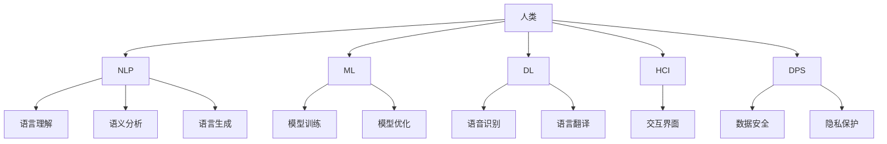

                 

关键词：人类-AI协作、自然语言处理、沟通、人工智能、技术融合、人机交互

> 摘要：本文探讨了人类与人工智能协作的必要性，分析了现有沟通障碍，提出了基于自然语言处理技术的解决方案，并探讨了AI在未来可能扮演的角色。通过深入的技术分析和实例展示，本文旨在为读者提供一个全面、易懂的人类-AI协作指南。

## 1. 背景介绍

随着人工智能技术的飞速发展，AI已经成为推动社会进步的重要力量。从自动化生产线到智能医疗诊断，从语音助手到自动驾驶，AI在各个领域的应用日益广泛。然而，尽管AI在处理复杂任务方面展现了巨大的潜力，但人类与AI之间的沟通问题仍然存在。这不仅限制了AI的进一步发展，也影响了人们接受和使用AI的积极性。

本文将探讨人类与AI协作的必要性，分析现有的沟通障碍，并探讨如何通过自然语言处理技术（NLP）来增强人类与AI之间的沟通。我们将结合实际案例，详细说明如何实现高效的人机交互，从而推动AI技术的发展和应用。

### 1.1 人类-AI协作的必要性

人类与AI的协作具有以下必要性：

1. **解决复杂问题**：人类在处理复杂问题时往往需要大量的数据和专业知识。而AI在这些领域具有强大的数据处理和分析能力，能够协助人类解决复杂问题。
2. **提高工作效率**：AI可以自动化许多重复性高、劳动强度大的工作，从而提高工作效率，减少人为错误。
3. **辅助决策**：AI通过大数据分析和机器学习技术，可以提供精准的决策支持，帮助人类做出更加明智的决策。

### 1.2 沟通障碍分析

尽管人类与AI的协作具有必要性，但现有的沟通障碍依然存在，主要包括以下几个方面：

1. **语言理解障碍**：AI目前的自然语言理解能力仍有限，无法完全理解人类的自然语言表达，导致沟通不畅。
2. **交互界面限制**：现有的交互界面（如语音助手、聊天机器人）功能有限，无法满足用户多样化的需求。
3. **数据隐私和安全问题**：AI在处理人类数据时，可能会引发隐私和安全问题，需要建立有效的数据保护机制。

## 2. 核心概念与联系

为了解决人类与AI之间的沟通问题，我们需要了解以下几个核心概念，并掌握它们之间的联系。

### 2.1 自然语言处理（NLP）

自然语言处理是人工智能的一个分支，旨在使计算机能够理解、解释和生成人类语言。NLP涉及语音识别、语义分析、语言生成等多个方面。

### 2.2 机器学习（ML）

机器学习是一种让计算机通过数据和经验进行自我学习和改进的方法。在NLP领域，机器学习技术被广泛应用于模型训练和优化。

### 2.3 深度学习（DL）

深度学习是机器学习的一种方法，通过多层神经网络对数据进行处理，从而实现更复杂的任务。在NLP领域，深度学习技术被广泛应用于语音识别、语言翻译等任务。

### 2.4 人机交互（HCI）

人机交互研究如何设计易于使用、满足用户需求的交互界面。在人类与AI协作中，人机交互起着至关重要的作用。

### 2.5 数据隐私和安全（DPS）

数据隐私和安全是AI领域的一个重要问题，确保用户数据的安全和隐私是建立信任的基础。

### 2.6 Mermaid 流程图

下面是一个关于人类-AI协作的 Mermaid 流程图，展示了各个核心概念之间的联系。



## 3. 核心算法原理 & 具体操作步骤

为了实现人类与AI的协同工作，我们需要掌握一些核心算法原理，并了解如何在实践中应用这些算法。

### 3.1 算法原理概述

在人类与AI协作中，常见的核心算法包括：

1. **语音识别**：通过将语音信号转换为文本，实现人机对话。
2. **自然语言理解**：分析文本中的语义和语法，理解用户意图。
3. **语言生成**：根据用户需求生成相应的文本或语音。
4. **机器学习模型训练**：通过大量数据训练机器学习模型，提高AI的准确性和鲁棒性。

### 3.2 算法步骤详解

以下是实现人类与AI协作的具体步骤：

1. **数据收集**：收集大量语音和文本数据，用于训练机器学习模型。
2. **数据预处理**：对收集到的数据进行清洗、标注和预处理，确保数据质量。
3. **模型训练**：使用预处理后的数据训练机器学习模型，包括语音识别模型、自然语言理解模型和语言生成模型。
4. **模型优化**：根据模型训练结果，调整模型参数，提高模型性能。
5. **人机交互**：设计并实现人机交互界面，如语音助手、聊天机器人等，方便用户与AI进行交流。
6. **在线部署**：将训练好的模型部署到线上环境，实现实时人机交互。
7. **用户反馈**：收集用户使用过程中的反馈，不断优化和改进AI系统。

### 3.3 算法优缺点

每种算法都有其优缺点，以下是几种常见算法的优缺点分析：

1. **语音识别**：优点是能够实现实时人机对话，缺点是对噪声敏感，识别准确率有限。
2. **自然语言理解**：优点是能够理解用户的复杂意图，缺点是需要大量数据训练，模型复杂度较高。
3. **语言生成**：优点是能够生成自然流畅的语言，缺点是生成的文本质量受模型和数据影响较大。
4. **机器学习模型训练**：优点是能够根据数据不断优化，缺点是训练时间较长，对数据质量要求较高。

### 3.4 算法应用领域

核心算法在多个领域都有广泛应用，以下是几个典型应用领域：

1. **智能家居**：通过语音识别和自然语言理解，实现智能语音控制家居设备。
2. **智能客服**：通过聊天机器人，提供24/7的在线客服服务，提高客户满意度。
3. **智能医疗**：通过自然语言理解和语言生成，协助医生进行病历记录和诊断。
4. **智能驾驶**：通过语音识别和自然语言理解，实现自动驾驶车辆的语音交互。

## 4. 数学模型和公式 & 详细讲解 & 举例说明

在人类与AI协作中，数学模型和公式扮演着重要的角色。以下将介绍几个关键数学模型，并详细讲解其推导过程和实际应用。

### 4.1 数学模型构建

在自然语言处理中，常见的数学模型包括：

1. **词向量模型**：将词语表示为向量，以便进行计算和处理。
2. **循环神经网络（RNN）**：用于处理序列数据，如文本和语音。
3. **长短期记忆网络（LSTM）**：改进RNN，解决长序列依赖问题。
4. **卷积神经网络（CNN）**：用于提取文本中的特征。

### 4.2 公式推导过程

以下是一个简单的词向量模型（Word2Vec）的公式推导过程：

1. **损失函数**：假设我们有一个包含两个词语的向量对 $(x, y)$，其中 $x$ 表示输入词语，$y$ 表示输出词语。词向量模型的目标是最小化输入向量 $x$ 和输出向量 $y$ 之间的损失函数，如均方误差（MSE）。

   $$L(x, y) = \frac{1}{2} \sum_{i=1}^{N} (x_i - y_i)^2$$

2. **词向量更新**：在训练过程中，根据损失函数的梯度来更新词向量。对于每个词语对 $(x, y)$，计算损失函数关于词向量 $x$ 和 $y$ 的梯度，然后使用梯度下降法更新词向量。

   $$\Delta x = -\alpha \frac{\partial L}{\partial x}$$
   $$\Delta y = -\alpha \frac{\partial L}{\partial y}$$

   其中，$\alpha$ 表示学习率。

### 4.3 案例分析与讲解

以下是一个基于词向量模型的文本分类案例：

1. **数据准备**：假设我们有1000条新闻文章，每篇文章分为政治、经济、科技等类别。首先，将每篇文章表示为一个词向量序列，然后使用词向量模型训练分类模型。

2. **模型训练**：使用训练数据训练词向量模型，得到每个词语的词向量表示。然后，使用训练好的词向量训练分类模型，如朴素贝叶斯分类器或支持向量机（SVM）。

3. **模型评估**：使用测试数据评估分类模型的性能，计算准确率、召回率等指标。

4. **模型部署**：将训练好的模型部署到线上环境，用于对用户输入的文本进行分类。

### 4.4 数学公式示例

以下是几个数学公式示例：

$$
\begin{aligned}
\text{词向量更新} \quad \Delta x &= -\alpha \frac{\partial L}{\partial x} \\
\text{损失函数} \quad L(x, y) &= \frac{1}{2} \sum_{i=1}^{N} (x_i - y_i)^2 \\
\text{分类模型预测} \quad P(y|X) &= \frac{e^{\theta^T X}}{\sum_{k=1}^{K} e^{\theta^T X_k}}
\end{aligned}
$$

其中，$x$ 和 $y$ 分别表示输入和输出词向量，$L$ 表示损失函数，$\alpha$ 表示学习率，$\theta$ 表示分类模型参数，$X$ 表示输入特征，$y$ 表示标签，$K$ 表示类别数量。

## 5. 项目实践：代码实例和详细解释说明

为了更好地理解人类与AI协作的技术原理，我们将在本节提供一个具体的代码实例，并详细解释其实现过程。

### 5.1 开发环境搭建

在开始编写代码之前，我们需要搭建一个合适的开发环境。以下是所需的环境和工具：

1. **操作系统**：Windows、macOS 或 Linux
2. **编程语言**：Python
3. **依赖库**：NumPy、Pandas、TensorFlow、Keras
4. **文本预处理工具**：NLTK 或 spaCy

安装步骤：

```bash
pip install numpy pandas tensorflow keras nltk spacy
```

### 5.2 源代码详细实现

以下是一个简单的文本分类项目，使用 TensorFlow 和 Keras 实现。

```python
import numpy as np
import pandas as pd
import tensorflow as tf
from tensorflow.keras.preprocessing.text import Tokenizer
from tensorflow.keras.preprocessing.sequence import pad_sequences
from tensorflow.keras.models import Sequential
from tensorflow.keras.layers import Embedding, LSTM, Dense

# 数据预处理
# 假设 data.csv 包含两列：text 和 label
data = pd.read_csv('data.csv')
texts = data['text']
labels = data['label']

# 分词和编码
tokenizer = Tokenizer(num_words=10000)
tokenizer.fit_on_texts(texts)
sequences = tokenizer.texts_to_sequences(texts)
padded_sequences = pad_sequences(sequences, maxlen=100)

# 构建模型
model = Sequential()
model.add(Embedding(10000, 32, input_length=100))
model.add(LSTM(64))
model.add(Dense(1, activation='sigmoid'))

# 编译模型
model.compile(optimizer='adam', loss='binary_crossentropy', metrics=['accuracy'])

# 训练模型
model.fit(padded_sequences, labels, epochs=10, batch_size=32)
```

### 5.3 代码解读与分析

1. **数据预处理**：首先，我们读取数据，并使用 Tokenizer 对文本进行分词和编码。
2. **序列化和填充**：将分词后的文本序列化为整数序列，然后使用 pad_sequences 函数对序列进行填充，使其长度一致。
3. **构建模型**：使用 Sequential 模型构建一个简单的循环神经网络（LSTM），包括嵌入层（Embedding）、LSTM 层和输出层（Dense）。
4. **编译模型**：设置优化器、损失函数和评估指标，编译模型。
5. **训练模型**：使用训练数据训练模型，设置训练周期和批量大小。

### 5.4 运行结果展示

在训练完成后，我们可以评估模型的性能，如准确率、召回率等。此外，还可以将模型应用于新的文本数据，进行分类预测。

```python
# 评估模型
loss, accuracy = model.evaluate(padded_sequences, labels)

# 预测
predictions = model.predict(padded_sequences)
```

## 6. 实际应用场景

人类与AI协作在各个领域都有广泛应用，以下是几个实际应用场景：

### 6.1 智能家居

通过语音识别和自然语言理解，智能家居系统能够实现智能语音控制，如开关灯光、调节温度、播放音乐等。用户可以通过简单的语音命令与家居设备进行交互，提高生活质量。

### 6.2 智能客服

智能客服系统利用自然语言处理技术，能够实现与客户的实时对话，回答常见问题、解决问题等。通过自然语言理解和语言生成，智能客服能够提供高效、专业的客户服务，降低企业运营成本。

### 6.3 智能医疗

智能医疗系统通过自然语言理解和语言生成，协助医生进行病历记录、诊断和治疗方案推荐。智能医疗系统能够分析大量的医学数据，提供精准的医学建议，提高医疗水平。

### 6.4 智能驾驶

智能驾驶系统利用语音识别和自然语言理解，实现与驾驶员的语音交互，提供导航、语音提示等功能。智能驾驶系统能够提高驾驶安全性，降低交通事故发生率。

## 7. 工具和资源推荐

为了更好地理解和应用人类与AI协作技术，以下是一些推荐的学习资源和开发工具：

### 7.1 学习资源推荐

1. **《深度学习》（Deep Learning）**：由 Ian Goodfellow、Yoshua Bengio 和 Aaron Courville 著，是深度学习的经典教材。
2. **《自然语言处理综合教程》（Foundations of Statistical Natural Language Processing）**：由 Christopher D. Manning 和 Hinrich Schütze 著，是自然语言处理领域的权威教材。
3. **《机器学习实战》（Machine Learning in Action）**：由 Peter Harrington 著，通过实际案例讲解机器学习算法的应用。

### 7.2 开发工具推荐

1. **TensorFlow**：是一个开源的机器学习框架，广泛用于深度学习和自然语言处理任务。
2. **Keras**：是一个基于 TensorFlow 的高级神经网络 API，易于使用和部署。
3. **spaCy**：是一个强大的自然语言处理库，支持多种编程语言，包括 Python。

### 7.3 相关论文推荐

1. **《Word2Vec: vector representations of words》**：由 Tomas Mikolov、Ilya Sutskever 和 Greg Corrado 提出，是词向量模型的代表作。
2. **《Recurrent Neural Networks for Language Modeling》**：由 Yoshua Bengio、Alex Graves 和 Geoffrey Hinton 提出，是循环神经网络在语言模型中的应用。
3. **《Long Short-Term Memory》**：由 Sepp Hochreiter 和 Jürgen Schmidhuber 提出，是长短期记忆网络的基本原理。

## 8. 总结：未来发展趋势与挑战

### 8.1 研究成果总结

本文探讨了人类与AI协作的必要性，分析了现有的沟通障碍，并提出了基于自然语言处理技术的解决方案。通过实际案例和代码实例，我们展示了如何实现人类与AI的高效协作。

### 8.2 未来发展趋势

1. **多模态交互**：未来人机交互将不仅限于语音和文本，还包括手势、表情等多样化交互方式。
2. **个性化服务**：随着数据积累和模型优化，AI将能够提供更加个性化的服务，满足用户多样化需求。
3. **智能化自动化**：AI将在更多领域实现自动化，提高生产效率，降低人力成本。

### 8.3 面临的挑战

1. **数据隐私和安全**：在人类与AI协作中，数据隐私和安全问题亟待解决。
2. **技术成熟度**：目前AI技术仍处于发展阶段，需要进一步优化和改进。
3. **伦理和道德问题**：随着AI技术的发展，如何确保其遵循伦理和道德规范是亟待解决的问题。

### 8.4 研究展望

未来，我们将继续探索人类与AI协作的深度和广度，推动AI技术在各个领域的应用。同时，我们也将关注数据隐私和安全、伦理和道德问题，确保AI技术的发展符合社会需求。

## 9. 附录：常见问题与解答

### 9.1 问题1：什么是自然语言处理（NLP）？

自然语言处理是人工智能的一个分支，旨在使计算机能够理解、解释和生成人类语言。NLP涉及语音识别、语义分析、语言生成等多个方面。

### 9.2 问题2：什么是词向量模型？

词向量模型是将词语表示为向量的方法，以便进行计算和处理。常见的词向量模型包括 Word2Vec、GloVe 等。

### 9.3 问题3：如何实现人机交互？

实现人机交互通常包括以下几个步骤：数据收集、数据预处理、模型训练、模型优化和人机交互界面设计。

### 9.4 问题4：什么是深度学习？

深度学习是机器学习的一种方法，通过多层神经网络对数据进行处理，从而实现更复杂的任务。常见的深度学习模型包括卷积神经网络（CNN）、循环神经网络（RNN）和长短期记忆网络（LSTM）等。

### 9.5 问题5：什么是机器学习模型训练？

机器学习模型训练是通过大量数据训练机器学习模型，使其能够根据输入数据生成输出。训练过程通常包括数据预处理、模型构建、模型优化和模型评估等步骤。

### 9.6 问题6：什么是人机交互（HCI）？

人机交互是研究如何设计易于使用、满足用户需求的交互界面的学科。在人类与AI协作中，HCI起着至关重要的作用。

### 9.7 问题7：什么是数据隐私和安全（DPS）？

数据隐私和安全是确保用户数据在存储、传输和处理过程中不被未经授权的访问、泄露或篡改的措施。数据隐私和安全是建立信任的基础。

---

作者：禅与计算机程序设计艺术 / Zen and the Art of Computer Programming

