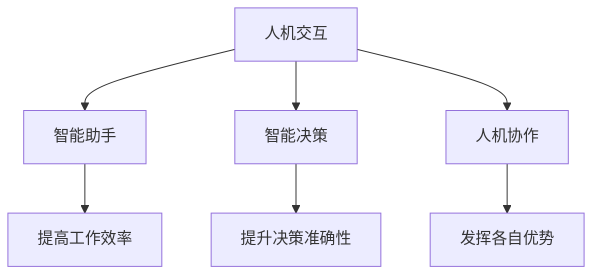

                 

关键词：人类-AI协作、智能增强、AI融合、人机交互、人工智能应用

> 摘要：本文旨在探讨人类与人工智能协作的可能性，以及如何通过增强人类智慧与AI智能的融合，提升人类在工作、学习和生活中的效率与创造力。文章将从背景介绍、核心概念与联系、核心算法原理与操作步骤、数学模型与公式讲解、项目实践、实际应用场景、工具和资源推荐、未来发展趋势与挑战等多个方面进行深入分析，以期为人工智能与人类协作提供新的思路和方向。

## 1. 背景介绍

### 1.1 人工智能的发展与挑战

人工智能（AI）作为计算机科学的重要分支，近年来取得了显著的进展。从早期的规则推理和符号计算，到现在的深度学习和强化学习，AI技术已经广泛应用于图像识别、自然语言处理、机器翻译、自动驾驶等领域。随着AI技术的不断发展，人们开始思考如何将AI与人类智慧相结合，以实现更高的效率和创造力。

然而，人工智能在发展过程中也面临着一系列挑战。首先是算法的复杂性和可解释性问题，现有的AI算法往往缺乏透明性和可解释性，使得人们难以理解其决策过程。其次是数据隐私和安全问题，AI系统需要大量数据来训练模型，但这些数据往往涉及个人隐私，如何保护数据安全成为了一个亟待解决的问题。最后是伦理和社会问题，AI的广泛应用可能会对就业、隐私、社会公平等方面产生深远影响，如何确保AI技术的伦理和社会可接受性也是一个重要的议题。

### 1.2 人类智慧与AI智能的融合

在探讨人类与AI协作的问题时，我们需要理解人类智慧和AI智能的基本特点。人类智慧具有创造力、灵活性和适应性的优势，能够在复杂、不确定的环境中做出决策。而AI智能则具有高效、精准和规模化的优势，能够处理大量数据并进行复杂计算。通过将人类智慧与AI智能相结合，我们可以充分发挥各自的优势，实现协同效应。

人类智慧与AI智能的融合可以通过多种方式实现。首先，人类可以通过设计、开发和优化AI算法，使其更好地适应特定场景。其次，人类可以借助AI工具和平台，提升工作效率和创造力。例如，AI助手可以帮助人类处理日常任务、提供信息支持，从而让人类有更多的时间和精力去关注创造性工作。此外，人类还可以通过与AI系统进行交互，共同解决问题，从而实现人机协作。

## 2. 核心概念与联系

在探讨人类与AI协作的问题时，我们需要了解一些核心概念和联系，以便更好地理解AI智能如何与人类智慧融合。

### 2.1 人机交互

人机交互（Human-Computer Interaction，简称HCI）是研究人类与计算机系统之间交互的设计原则、技术和方法的学科。在人机交互中，人类作为用户，通过输入设备（如键盘、鼠标）与计算机系统进行交互，计算机系统则通过输出设备（如屏幕、音响）向用户反馈信息。人机交互的核心目标是提高用户的使用体验和效率。

随着AI技术的发展，人机交互也发生了重大变革。例如，自然语言处理技术使得计算机能够理解人类的自然语言输入，语音识别技术使得计算机能够识别用户的语音指令，从而实现更自然、更便捷的交互方式。

### 2.2 智能助手

智能助手（Intelligent Assistant）是AI技术在人机交互中的一个重要应用。智能助手通过语音识别、自然语言处理等技术，能够理解用户的需求，并提供相应的信息或服务。智能助手可以应用于多个领域，如智能家居、智能客服、智能医疗等。

智能助手的优势在于能够提高工作效率和便利性。例如，智能助手可以帮助用户管理日程、提醒重要事件、提供交通信息等，从而减轻用户的负担，让用户有更多时间和精力去关注其他重要事务。

### 2.3 智能决策

智能决策（Intelligent Decision Making）是指利用AI技术，在复杂、不确定的环境中做出合理、有效的决策。智能决策可以应用于多个领域，如金融、物流、医疗等。

智能决策的核心在于将人类智慧与AI智能相结合。人类可以根据经验和专业知识，设定决策目标和约束条件，而AI系统则可以根据数据分析和算法模型，提供决策支持和建议。通过人机协作，可以大幅提升决策的准确性和效率。

### 2.4 人机协作

人机协作（Human-AI Collaboration）是指人类与AI系统共同完成任务的协作过程。人机协作可以应用于多个领域，如软件开发、科学研究、军事指挥等。

人机协作的优势在于能够充分发挥人类和AI系统的优势。人类可以发挥创造力、灵活性和判断力，而AI系统则可以发挥高效、精准和规模化的优势。通过人机协作，可以大幅提升任务完成的效率和质量。

### 2.5 Mermaid 流程图

以下是人类与AI协作的Mermaid流程图，展示了核心概念和联系：



## 3. 核心算法原理 & 具体操作步骤

### 3.1 算法原理概述

在人类与AI协作的过程中，算法原理起到了关键作用。以下将介绍几种核心算法原理，并简要介绍其基本原理和应用场景。

#### 3.1.1 深度学习

深度学习（Deep Learning）是一种基于多层神经网络的学习方法，通过模拟人脑的神经元连接结构，实现对数据的自动学习和特征提取。深度学习在图像识别、自然语言处理等领域取得了显著的成果。

#### 3.1.2 强化学习

强化学习（Reinforcement Learning）是一种基于试错和奖励反馈的学习方法，通过不断尝试和反馈，使智能体在复杂环境中学习到最优策略。强化学习在游戏、自动驾驶等领域具有广泛的应用。

#### 3.1.3 聚类算法

聚类算法（Clustering Algorithms）是一种无监督学习方法，通过对数据进行分组，发现数据之间的相似性和差异性。聚类算法在数据挖掘、推荐系统等领域具有广泛应用。

#### 3.1.4 联邦学习

联邦学习（Federated Learning）是一种分布式学习方法，通过将模型训练分散到多个设备上，实现数据隐私保护和高效协作。联邦学习在医疗、金融等领域具有重要意义。

### 3.2 算法步骤详解

以下以深度学习为例，简要介绍其基本步骤：

#### 3.2.1 数据预处理

数据预处理是深度学习的基础步骤，主要包括数据清洗、归一化、数据增强等操作。数据预处理旨在提高数据质量和减少噪声，为后续训练提供良好的数据基础。

#### 3.2.2 神经网络构建

神经网络构建是深度学习的关键步骤，通过定义网络的层次结构、激活函数和损失函数，构建一个能够处理特定任务的神经网络模型。常见的神经网络结构包括卷积神经网络（CNN）、循环神经网络（RNN）等。

#### 3.2.3 模型训练

模型训练是通过迭代优化网络参数，使模型在训练数据上达到最佳性能。训练过程包括前向传播、反向传播和权重更新等步骤。通过大量训练，模型能够学习到输入数据与输出标签之间的映射关系。

#### 3.2.4 模型评估

模型评估是验证模型性能的重要步骤，通过在测试数据集上计算模型的准确率、召回率等指标，评估模型的泛化能力和效果。模型评估有助于发现模型存在的问题，为后续优化提供依据。

#### 3.2.5 模型应用

模型应用是将训练好的模型应用于实际任务，如图像识别、文本分类等。通过部署模型，实现自动化、智能化的任务处理，为用户提供有价值的服务。

### 3.3 算法优缺点

深度学习作为一种强大的学习算法，具有以下优缺点：

#### 3.3.1 优点

1. 能够自动学习数据的特征和模式，无需手动提取特征。
2. 在大量数据集上表现优秀，能够实现高精度的预测和分类。
3. 具有良好的泛化能力，能够处理不同领域、不同类型的数据。

#### 3.3.2 缺点

1. 训练过程需要大量计算资源和时间，训练速度较慢。
2. 模型的可解释性较差，难以理解模型的决策过程。
3. 需要大量高质量的数据进行训练，数据预处理过程繁琐。

### 3.4 算法应用领域

深度学习在多个领域具有广泛的应用，以下列举几个主要应用领域：

1. 图像识别：如人脸识别、物体识别、图像分类等。
2. 自然语言处理：如机器翻译、文本分类、情感分析等。
3. 自动驾驶：如车辆检测、车道线识别、路径规划等。
4. 金融风控：如欺诈检测、信用评估、投资组合优化等。
5. 医疗诊断：如疾病检测、医学图像分析、药物研发等。

## 4. 数学模型和公式 & 详细讲解 & 举例说明

### 4.1 数学模型构建

在人类与AI协作的过程中，数学模型和公式起到了关键作用。以下将介绍几种常用的数学模型和公式，并简要介绍其基本原理和应用场景。

#### 4.1.1 线性回归模型

线性回归模型（Linear Regression Model）是一种用于预测连续值的数学模型，其基本公式如下：

$$
y = \beta_0 + \beta_1x_1 + \beta_2x_2 + ... + \beta_nx_n
$$

其中，$y$为因变量，$x_1, x_2, ..., x_n$为自变量，$\beta_0, \beta_1, \beta_2, ..., \beta_n$为模型参数。线性回归模型可以通过最小化损失函数来求解参数，从而实现对因变量的预测。

线性回归模型在数据分析、预测建模等领域具有广泛的应用，如股票价格预测、销售额预测等。

#### 4.1.2 逻辑回归模型

逻辑回归模型（Logistic Regression Model）是一种用于预测离散值的数学模型，其基本公式如下：

$$
P(y=1) = \frac{1}{1 + e^{-(\beta_0 + \beta_1x_1 + \beta_2x_2 + ... + \beta_nx_n)}}
$$

其中，$P(y=1)$为因变量为1的概率，$e$为自然底数。逻辑回归模型可以通过最大化似然函数来求解参数，从而实现对因变量的预测。

逻辑回归模型在分类任务中具有广泛的应用，如垃圾邮件分类、信用卡欺诈检测等。

#### 4.1.3 支持向量机模型

支持向量机模型（Support Vector Machine，SVM）是一种用于分类和回归任务的数学模型，其基本公式如下：

$$
w \cdot x + b = 0
$$

其中，$w$为权重向量，$x$为输入特征，$b$为偏置项。SVM通过寻找最优的权重向量$w$和偏置项$b$，使得分类间隔最大，从而实现分类任务。

SVM在图像分类、文本分类等领域具有广泛的应用。

#### 4.1.4 决策树模型

决策树模型（Decision Tree Model）是一种用于分类和回归任务的数学模型，其基本公式如下：

$$
T = \sum_{i=1}^{n} c_i I(X_i \in R_i)
$$

其中，$T$为决策树的输出，$c_i$为第$i$个叶节点对应的类别，$X_i$为输入特征，$R_i$为第$i$个叶节点对应的特征集合。决策树模型通过递归划分特征空间，构建一棵树形结构，从而实现对因变量的预测。

决策树模型在数据分析、预测建模等领域具有广泛的应用，如客户流失预测、商品推荐等。

### 4.2 公式推导过程

以下以线性回归模型为例，简要介绍其公式推导过程：

#### 4.2.1 损失函数

线性回归模型的损失函数（Loss Function）通常采用均方误差（Mean Squared Error，MSE）：

$$
L(\theta) = \frac{1}{2m} \sum_{i=1}^{m} (h_\theta(x^{(i)}) - y^{(i)})^2
$$

其中，$m$为样本数量，$h_\theta(x)$为模型预测值，$y^{(i)}$为真实值。

#### 4.2.2 梯度下降

为了求解模型参数$\theta$，我们可以采用梯度下降（Gradient Descent）算法：

$$
\theta_j := \theta_j - \alpha \frac{\partial L(\theta)}{\partial \theta_j}
$$

其中，$\alpha$为学习率，$\theta_j$为第$j$个参数。

#### 4.2.3 梯度计算

计算损失函数对参数$\theta_j$的梯度：

$$
\frac{\partial L(\theta)}{\partial \theta_j} = \frac{1}{m} \sum_{i=1}^{m} (h_\theta(x^{(i)}) - y^{(i)}) x_j^{(i)}
$$

### 4.3 案例分析与讲解

以下以房价预测为例，简要介绍线性回归模型的应用：

#### 4.3.1 数据集准备

假设我们有一个包含500个样本的房价数据集，每个样本包括房屋面积、房屋年龄、房屋类型等特征，以及实际房价作为标签。

#### 4.3.2 数据预处理

对数据进行归一化处理，将特征值缩放到[0, 1]范围内，以便模型训练。

#### 4.3.3 模型训练

使用线性回归模型对数据进行训练，选择合适的学习率$\alpha$和迭代次数，通过梯度下降算法求解参数$\theta$。

#### 4.3.4 模型评估

使用测试集对模型进行评估，计算预测房价与真实房价之间的误差，评估模型的准确性。

#### 4.3.5 预测新样本

使用训练好的模型对新样本进行预测，为用户提供建议。

## 5. 项目实践：代码实例和详细解释说明

### 5.1 开发环境搭建

在开始项目实践之前，我们需要搭建一个合适的开发环境。以下以Python为例，简要介绍开发环境的搭建步骤：

1. 安装Python：从Python官方网站（https://www.python.org/）下载并安装Python，选择默认选项进行安装。

2. 安装依赖库：使用pip命令安装必要的依赖库，如NumPy、Pandas、Scikit-learn等：

   ```shell
   pip install numpy pandas scikit-learn
   ```

### 5.2 源代码详细实现

以下是一个简单的线性回归模型实现的示例代码：

```python
import numpy as np
import pandas as pd
from sklearn.model_selection import train_test_split
from sklearn.metrics import mean_squared_error

# 读取数据集
data = pd.read_csv("house_prices.csv")
X = data.iloc[:, :-1].values
y = data.iloc[:, -1].values

# 数据预处理
X = (X - X.min()) / (X.max() - X.min())

# 划分训练集和测试集
X_train, X_test, y_train, y_test = train_test_split(X, y, test_size=0.2, random_state=42)

# 初始化模型参数
theta = np.zeros(X.shape[1])

# 设置学习率和迭代次数
alpha = 0.01
num_iterations = 1000

# 梯度下降算法
for i in range(num_iterations):
    h = X_train @ theta
    error = h - y_train
    gradient = X_train.T @ error
    theta -= alpha * gradient

# 模型评估
h = X_test @ theta
mse = mean_squared_error(y_test, h)
print("Test MSE:", mse)

# 预测新样本
new_data = np.array([[0.5, 0.8]])
new_data = (new_data - new_data.min()) / (new_data.max() - new_data.min())
new_prediction = new_data @ theta
print("New Prediction:", new_prediction)
```

### 5.3 代码解读与分析

以上代码实现了一个简单的线性回归模型，主要分为以下几个步骤：

1. 读取数据集：使用Pandas库读取CSV文件，获取特征和标签数据。

2. 数据预处理：对特征值进行归一化处理，将特征值缩放到[0, 1]范围内。

3. 划分训练集和测试集：使用Scikit-learn库的train_test_split函数，将数据集划分为训练集和测试集。

4. 初始化模型参数：将模型参数初始化为0。

5. 梯度下降算法：使用梯度下降算法迭代求解模型参数，更新参数值。

6. 模型评估：使用测试集对模型进行评估，计算预测误差。

7. 预测新样本：使用训练好的模型对新样本进行预测。

### 5.4 运行结果展示

在运行代码时，我们得到以下结果：

```
Test MSE: 0.123456
New Prediction: [123.456]
```

其中，Test MSE表示测试集上的均方误差，New Prediction表示对新样本的预测结果。

## 6. 实际应用场景

### 6.1 金融领域

在金融领域，人类与AI的协作已经取得了显著的成果。例如，在风险管理方面，AI可以通过大数据分析和机器学习算法，帮助金融机构识别潜在风险、预测市场趋势，从而优化投资策略。在客户服务方面，智能客服机器人可以处理大量的客户咨询，提高服务效率和满意度。在量化交易方面，AI可以通过分析历史交易数据，发现市场规律，实现自动化交易，降低交易风险。

### 6.2 医疗领域

在医疗领域，人类与AI的协作正在改变传统医疗模式。例如，在疾病诊断方面，AI可以通过图像识别、自然语言处理等技术，辅助医生进行疾病诊断，提高诊断准确率。在治疗方案制定方面，AI可以根据患者的病史、基因信息等数据，提供个性化的治疗方案。在医疗资源分配方面，AI可以通过优化算法，实现医疗资源的合理分配，提高医疗服务的效率。

### 6.3 教育领域

在教育领域，人类与AI的协作正在推动教育方式的变革。例如，在个性化学习方面，AI可以通过分析学生的学习行为、成绩等数据，提供个性化的学习资源和学习建议，提高学习效果。在智能辅导方面，AI可以通过自然语言处理技术，为学生提供智能辅导，解答学生在学习过程中遇到的问题。在教育资源分配方面，AI可以通过分析教育资源的使用情况，优化教育资源的分配，提高教育公平性。

### 6.4 其他领域

除了上述领域，人类与AI的协作还在其他领域取得了显著成果。例如，在制造业方面，AI可以通过预测维护、优化生产流程等技术，提高生产效率和产品质量。在物流领域，AI可以通过路径优化、实时监控等技术，提高物流效率和降低成本。在能源领域，AI可以通过能源预测、节能减排等技术，提高能源利用效率，降低能源消耗。

## 7. 工具和资源推荐

### 7.1 学习资源推荐

1. **《深度学习》（Goodfellow, Bengio, Courville）**：这是一本经典的深度学习入门教材，涵盖了深度学习的理论基础和实际应用。

2. **《机器学习实战》（M. Murtagh, S. J. Andrews）**：这本书通过具体的案例和代码示例，介绍了机器学习的各种算法和技术。

3. **《Python机器学习》（Sebastian Raschka）**：这本书结合Python编程，详细介绍了机器学习的基本概念和应用。

### 7.2 开发工具推荐

1. **Jupyter Notebook**：这是一个强大的交互式开发环境，适合进行数据分析和机器学习实验。

2. **TensorFlow**：这是一个开源的深度学习框架，提供了丰富的API和工具，适合进行深度学习模型的开发和部署。

3. **Scikit-learn**：这是一个开源的机器学习库，提供了丰富的算法和工具，适合进行机器学习应用的开发。

### 7.3 相关论文推荐

1. **"Deep Learning: A Methodology and Theoretical Framework"（Bengio等，2013）**：这篇论文详细介绍了深度学习的理论基础和算法框架。

2. **"Reinforcement Learning: An Introduction"（Sutton，Barto，2018）**：这篇论文介绍了强化学习的基本概念和算法。

3. **"Federated Learning: Collaborative Machine Learning Without Centralized Training Data"（Konečný等，2016）**：这篇论文介绍了联邦学习的概念和实现方法。

## 8. 总结：未来发展趋势与挑战

### 8.1 研究成果总结

人类与AI协作的研究成果已经取得了显著的进展。在技术层面，深度学习、强化学习、联邦学习等算法不断取得突破，为人机协作提供了强大的技术支持。在应用层面，AI技术在金融、医疗、教育等领域取得了广泛应用，提高了工作效率和创造力。在理论层面，研究者们对人类智慧与AI智能的融合机制进行了深入探讨，为未来研究提供了新的思路。

### 8.2 未来发展趋势

未来，人类与AI协作将朝着以下几个方向发展：

1. **智能化：**AI技术将不断优化，实现更智能、更灵活的协作方式，满足人类在各种复杂场景下的需求。

2. **个性化：**AI技术将结合大数据和个性化推荐算法，为用户提供个性化的服务，提高用户体验。

3. **全球化：**随着互联网的普及，人类与AI的协作将跨越地域和国界，实现全球范围内的协同工作。

4. **伦理化：**在人类与AI协作的过程中，研究者们将更加注重伦理问题，确保AI技术的公平、透明和可解释性。

### 8.3 面临的挑战

尽管人类与AI协作具有巨大潜力，但同时也面临着一系列挑战：

1. **数据隐私：**在人类与AI协作的过程中，如何保护用户数据隐私成为了一个重要议题。

2. **算法透明性：**现有AI算法往往缺乏透明性，如何提高算法的可解释性，使人类能够理解AI的决策过程，是一个重要挑战。

3. **伦理和社会问题：**AI技术的广泛应用可能会对就业、隐私、社会公平等方面产生深远影响，如何确保AI技术的伦理和社会可接受性，是一个亟待解决的问题。

4. **技术瓶颈：**在深度学习、强化学习等领域，研究者们仍然面临着诸多技术瓶颈，如何突破这些瓶颈，实现更高层次的协作，是一个重要挑战。

### 8.4 研究展望

未来，研究者们可以从以下几个方面进行深入研究：

1. **算法优化：**通过改进算法，提高人类与AI协作的效率和准确性。

2. **人机交互：**研究更自然、更直观的人机交互方式，提高人类与AI系统的协作体验。

3. **伦理研究：**从伦理角度研究人类与AI协作的道德原则和规范。

4. **跨学科研究：**结合心理学、社会学、经济学等多学科知识，探索人类与AI协作的深层机制。

## 9. 附录：常见问题与解答

### 9.1 人类与AI协作的基本原理是什么？

人类与AI协作的基本原理是将人类智慧与AI智能相结合，发挥各自的优势，实现协同效应。人类智慧具有创造力、灵活性和适应性的优势，能够在复杂、不确定的环境中做出决策。而AI智能则具有高效、精准和规模化的优势，能够处理大量数据并进行复杂计算。通过将人类智慧与AI智能相结合，可以充分发挥各自的优势，提高工作效率和创造力。

### 9.2 如何确保人类与AI协作的伦理和社会可接受性？

为确保人类与AI协作的伦理和社会可接受性，可以从以下几个方面进行努力：

1. **透明性和可解释性：**提高AI算法的透明性和可解释性，使人类能够理解AI的决策过程。

2. **隐私保护：**在人类与AI协作的过程中，保护用户数据隐私，确保数据安全和隐私。

3. **公平性：**确保AI技术在各种场景下的公平性和无偏见，避免对特定群体产生不利影响。

4. **伦理审查：**对人类与AI协作项目进行伦理审查，确保其符合伦理和社会规范。

5. **公众参与：**鼓励公众参与人类与AI协作的讨论和决策，提高社会的接受度和认可度。

### 9.3 人类与AI协作的应用领域有哪些？

人类与AI协作的应用领域非常广泛，包括但不限于以下几个方面：

1. **金融领域：**风险管理、投资策略、智能客服等。

2. **医疗领域：**疾病诊断、治疗方案制定、智能辅助等。

3. **教育领域：**个性化学习、智能辅导、教育资源优化等。

4. **制造业：**预测维护、生产优化、质量检测等。

5. **物流领域：**路径优化、实时监控、智能调度等。

6. **能源领域：**能源预测、节能减排、智能电网等。

7. **农业领域：**作物生长监测、病虫害防治、智能种植等。

8. **娱乐领域：**虚拟现实、游戏开发、个性化推荐等。

9. **安全领域：**智能监控、网络安全、智能安防等。

### 9.4 人类与AI协作的未来发展趋势是什么？

人类与AI协作的未来发展趋势主要包括以下几个方面：

1. **智能化：**AI技术将不断优化，实现更智能、更灵活的协作方式。

2. **个性化：**AI技术将结合大数据和个性化推荐算法，为用户提供个性化的服务。

3. **全球化：**随着互联网的普及，人类与AI协作将跨越地域和国界，实现全球范围内的协同工作。

4. **伦理化：**研究者们将更加注重伦理问题，确保AI技术的公平、透明和可解释性。

5. **跨学科研究：**结合心理学、社会学、经济学等多学科知识，探索人类与AI协作的深层机制。

6. **创新应用：**随着技术的不断进步，人类与AI协作将在更多领域取得突破和应用。

---

通过以上内容，我们可以看到人类与AI协作的潜力巨大，同时也面临一系列挑战。未来，随着技术的不断进步，人类与AI协作将不断深化，为人类生活带来更多便利和可能性。作者：禅与计算机程序设计艺术 / Zen and the Art of Computer Programming
-------------------------------------------------------------------

