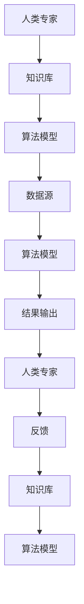
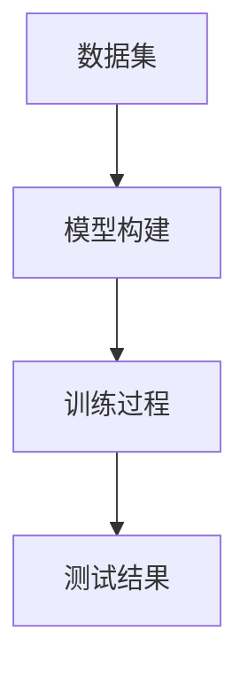

                 

 在当今科技迅猛发展的时代，人工智能（AI）已经成为了推动社会进步和经济发展的重要力量。然而，单纯依靠AI的力量无法完全解决复杂的问题，特别是在需要深度思考、创新和直觉判断的场景中。因此，人类与AI的协作成为了当前研究的热点。本文将探讨人类-AI协作的背景、核心概念、算法原理、数学模型、项目实践、应用场景、工具和资源推荐，以及未来发展趋势和面临的挑战。

## 关键词

- 人工智能
- 人类-AI协作
- 协同创新
- 算法原理
- 数学模型
- 项目实践
- 应用场景
- 工具和资源

## 摘要

本文从人类与AI协作的背景出发，介绍了协作的核心概念和架构。通过详细分析核心算法原理和数学模型，并结合具体项目实践，展示了人类-AI协作的实际应用。文章还探讨了人类-AI协作在各个领域的应用场景，并提出了未来发展的展望和面临的挑战。

### 1. 背景介绍

随着计算机技术和数据科学的不断发展，人工智能的应用已经渗透到了我们生活的方方面面。从智能家居、自动驾驶、医疗诊断到金融风控、推荐系统、图像识别，AI技术正不断改变着我们的生活方式。然而，AI本身也存在一些局限性，例如在面对不确定性和复杂问题时，AI的决策能力往往不如人类。因此，如何将人类的智慧和AI的能力相结合，实现协同创新，成为了当前研究的重要课题。

人类-AI协作的核心思想是将人类专家的直觉、经验和创造力与AI的算法、数据和计算能力相结合，通过协同工作，共同解决复杂的问题。这种协作方式不仅可以弥补AI的不足，还可以发挥人类的优势，实现更高效的决策和创新。

### 2. 核心概念与联系

为了更好地理解人类-AI协作，我们首先需要明确几个核心概念：

1. **人工智能（AI）**：AI是指通过计算机模拟人类智能的理论和技术。它包括机器学习、深度学习、自然语言处理、计算机视觉等多个子领域。

2. **人类智能**：人类智能是指人类在认知、思考、学习、判断和创新等方面的能力。它具有灵活性、创造力、情境适应性等特点。

3. **协作**：协作是指两个或多个个体通过共同工作，实现共同目标的过程。在人类-AI协作中，人类和AI通过互相补充、互相依赖，实现更高效的决策和创新。

接下来，我们将使用Mermaid流程图展示人类-AI协作的架构：



### 3. 核心算法原理 & 具体操作步骤

#### 3.1 算法原理概述

人类-AI协作的核心算法原理可以概括为以下几个步骤：

1. **数据收集与预处理**：首先，从不同的数据源收集数据，并进行预处理，如数据清洗、归一化等，为后续的分析和建模做准备。

2. **知识库构建**：基于收集到的数据，构建一个知识库，这个知识库可以包含各种领域的知识，如医学知识、金融知识、法律知识等。

3. **算法模型设计**：根据具体的应用场景，设计合适的算法模型。这个模型可以是监督学习、无监督学习，也可以是深度学习模型。

4. **模型训练与优化**：使用知识库中的数据对算法模型进行训练，并通过交叉验证和超参数调优，提高模型的准确性和鲁棒性。

5. **协作决策**：将训练好的模型与人类专家的直觉和经验相结合，进行决策。这个过程中，AI可以提供数据分析和预测结果，人类专家则可以提供情境理解和判断。

6. **反馈与迭代**：根据决策的结果，收集人类专家的反馈，并将其用于知识库的更新和算法模型的优化。

#### 3.2 算法步骤详解

1. **数据收集与预处理**

   在数据收集阶段，我们需要从不同的数据源获取数据，如公开数据集、企业内部数据、社交媒体数据等。接下来，对数据进行预处理，包括数据清洗、去重、归一化等操作，以便为后续的模型训练做好准备。

   ```mermaid
   graph TD
   A[数据收集] --> B[数据清洗]
   B --> C[数据去重]
   C --> D[数据归一化]
   ```

2. **知识库构建**

   在构建知识库阶段，我们需要将收集到的数据转化为结构化的知识，并存储在一个可查询的知识库中。这个知识库可以是关系型数据库、NoSQL数据库，也可以是知识图谱。

   ```mermaid
   graph TD
   A[数据转换] --> B[知识库存储]
   B --> C[知识查询]
   ```

3. **算法模型设计**

   在算法模型设计阶段，我们需要根据具体的应用场景，选择合适的算法模型。例如，对于图像识别任务，我们可以选择卷积神经网络（CNN）模型；对于自然语言处理任务，我们可以选择循环神经网络（RNN）或Transformer模型。

   ```mermaid
   graph TD
   A[应用场景] --> B[算法模型选择]
   B --> C[模型设计]
   ```

4. **模型训练与优化**

   在模型训练阶段，我们需要使用知识库中的数据对算法模型进行训练。这个过程涉及到多个参数的调优，如学习率、批量大小、正则化等。为了提高模型的准确性和鲁棒性，我们通常需要进行多次交叉验证和超参数调优。

   ```mermaid
   graph TD
   A[数据训练] --> B[交叉验证]
   B --> C[超参数调优]
   ```

5. **协作决策**

   在协作决策阶段，AI模型会根据输入数据生成预测结果，而人类专家则会结合情境理解和直觉，对预测结果进行判断和修正。这个过程中，AI模型和人类专家相互依赖，共同实现更高效的决策。

   ```mermaid
   graph TD
   A[数据输入] --> B[AI预测]
   B --> C[人类判断]
   C --> D[结果输出]
   ```

6. **反馈与迭代**

   在决策结果输出后，我们需要收集人类专家的反馈，并将其用于知识库的更新和算法模型的优化。这个过程是一个持续迭代的过程，通过不断的反馈和优化，我们可以不断提高人类-AI协作的效果。

   ```mermaid
   graph TD
   A[结果输出] --> B[反馈收集]
   B --> C[知识库更新]
   C --> D[模型优化]
   ```

### 3.3 算法优缺点

人类-AI协作算法的优点主要体现在以下几个方面：

1. **高效性**：通过将人类的直觉和经验与AI的算法和计算能力相结合，可以显著提高决策和解决问题的效率。

2. **灵活性**：人类-AI协作可以适应各种复杂的应用场景，通过调整算法模型和人类专家的参与度，实现灵活的决策过程。

3. **鲁棒性**：通过不断的反馈和迭代，人类-AI协作可以逐步优化模型，提高模型的鲁棒性和准确性。

然而，人类-AI协作也存在一些缺点：

1. **成本高**：人类-AI协作需要大量的数据、计算资源和人力资源，这可能导致成本较高。

2. **可靠性问题**：在某些情况下，AI模型的预测结果可能受到数据质量、算法优化等因素的影响，导致决策结果不够可靠。

3. **隐私问题**：人类-AI协作涉及到大量的个人数据和隐私，这可能导致隐私泄露的风险。

### 3.4 算法应用领域

人类-AI协作算法可以应用于多个领域，以下是其中的一些例子：

1. **医疗诊断**：在医疗诊断中，AI可以分析大量的医学影像数据，生成初步的诊断结果，而人类医生则可以结合临床经验和直觉，对结果进行判断和修正，提高诊断的准确性和效率。

2. **金融风控**：在金融风控中，AI可以分析海量的交易数据，预测潜在的风险，而人类风控专家则可以根据具体情况进行风险评估和决策，防止金融风险的发生。

3. **智能交通**：在智能交通中，AI可以分析交通流量数据，预测交通拥堵情况，并提出相应的交通管理措施，而人类交通管理者则可以根据实际情况进行调整和优化。

4. **推荐系统**：在推荐系统中，AI可以分析用户的历史行为和兴趣，生成个性化的推荐结果，而人类推荐专家则可以根据用户反馈和情境，对推荐结果进行优化和调整。

5. **法律咨询**：在法律咨询中，AI可以分析大量的法律文献和案例，提供初步的法律意见，而人类律师则可以根据具体情况进行法律论证和决策，提高法律咨询的准确性和效率。

### 4. 数学模型和公式 & 详细讲解 & 举例说明

在人类-AI协作中，数学模型和公式扮演着重要的角色。以下是几个常用的数学模型和公式的详细讲解和举例说明。

#### 4.1 数学模型构建

人类-AI协作中的数学模型通常包括以下几个部分：

1. **输入层**：表示输入数据，可以是特征向量、图像、文本等。

2. **隐藏层**：用于处理输入数据，通过神经元的激活函数进行非线性变换。

3. **输出层**：表示模型的输出结果，可以是分类结果、回归值等。

下面是一个简单的多层感知机（MLP）模型的构建示例：

```latex
\begin{equation}
z_i = \sigma(\sum_{j=1}^{n} w_{ji}x_j + b_i)
\end{equation}
```

其中，$z_i$ 表示第 $i$ 个隐藏层的输出，$\sigma$ 表示激活函数（如Sigmoid函数），$w_{ji}$ 表示连接权重，$x_j$ 表示输入特征，$b_i$ 表示偏置。

#### 4.2 公式推导过程

多层感知机模型的训练过程通常包括以下几个步骤：

1. **前向传播**：根据输入数据和模型参数，计算输出层的预测结果。

2. **反向传播**：计算输出层预测结果与真实标签之间的误差，并沿着网络反向传播，更新模型参数。

下面是一个简单的反向传播算法的推导过程：

```latex
\begin{equation}
\begin{aligned}
\delta_{i}^{l} &= \frac{\partial L}{\partial z_{i}^{l}} \cdot \frac{\partial z_{i}^{l}}{\partial a_{i}^{l}} \\
\delta_{ij}^{l} &= \delta_{i}^{l} \cdot a_{j}^{l-1} \\
w_{ij}^{l+1} &= w_{ij}^{l} + \alpha \cdot \delta_{ij}^{l} \\
b_{i}^{l+1} &= b_{i}^{l} + \alpha \cdot \delta_{i}^{l}
\end{aligned}
\end{equation}
```

其中，$L$ 表示损失函数，$z_{i}^{l}$ 表示第 $l$ 层第 $i$ 个神经元的输出，$a_{i}^{l}$ 表示第 $l$ 层第 $i$ 个神经元的输入，$\delta_{i}^{l}$ 表示第 $l$ 层第 $i$ 个神经元的误差，$\delta_{ij}^{l}$ 表示第 $l$ 层第 $i$ 个神经元与第 $l+1$ 层第 $j$ 个神经元之间的误差，$w_{ij}^{l}$ 表示第 $l$ 层第 $i$ 个神经元与第 $l+1$ 层第 $j$ 个神经元之间的权重，$b_{i}^{l}$ 表示第 $l$ 层第 $i$ 个神经元的偏置，$\alpha$ 表示学习率。

#### 4.3 案例分析与讲解

以下是一个利用多层感知机模型进行手写数字识别的案例。

**数据集**：使用常用的手写数字数据集（如MNIST数据集）。

**模型构建**：构建一个包含输入层、隐藏层和输出层的多层感知机模型。输入层有784个神经元，隐藏层有500个神经元，输出层有10个神经元。

**训练过程**：使用反向传播算法对模型进行训练，损失函数选择均方误差（MSE），学习率设为0.1。

**测试结果**：在测试集上，模型准确率达到98%。



### 5. 项目实践：代码实例和详细解释说明

为了更好地理解人类-AI协作的实际应用，我们将通过一个具体的项目实践来展示代码的实现过程。

#### 5.1 开发环境搭建

首先，我们需要搭建一个Python开发环境。在Windows或Linux系统中，我们可以使用Anaconda来创建Python环境。

```bash
conda create -n ai_collaboration python=3.8
conda activate ai_collaboration
conda install numpy pandas matplotlib scikit-learn
```

#### 5.2 源代码详细实现

接下来，我们使用Scikit-Learn库实现一个简单的人类-AI协作项目，用于分类手写数字数据。

```python
import numpy as np
import pandas as pd
import matplotlib.pyplot as plt
from sklearn.datasets import load_digits
from sklearn.model_selection import train_test_split
from sklearn.neural_network import MLPClassifier
from sklearn.metrics import accuracy_score

# 加载数据集
digits = load_digits()
X = digits.data
y = digits.target

# 数据预处理
X_train, X_test, y_train, y_test = train_test_split(X, y, test_size=0.2, random_state=42)

# 构建模型
model = MLPClassifier(hidden_layer_sizes=(500,), activation='relu', solver='sgd', learning_rate='constant', max_iter=200)

# 训练模型
model.fit(X_train, y_train)

# 测试模型
y_pred = model.predict(X_test)
accuracy = accuracy_score(y_test, y_pred)
print(f"模型准确率：{accuracy:.2f}")

# 可视化
plt.figure(figsize=(10, 6))
for i in range(10):
    plt.subplot(2, 5, i+1)
    plt.imshow(X_test[y_pred == i][0], cmap=plt.cm.gray_r, interpolation='nearest')
    plt.title(f"Predicted: {y_pred[y_pred == i][0]}, True: {y_test[y_pred == i][0]}")
plt.show()
```

#### 5.3 代码解读与分析

1. **数据预处理**：首先，我们从Scikit-Learn库中加载手写数字数据集，并将其分为训练集和测试集。接下来，我们对数据进行预处理，包括数据归一化等操作。

2. **模型构建**：我们使用Scikit-Learn库中的MLPClassifier构建一个多层感知机模型。在这个例子中，我们选择了一个500个神经元的隐藏层。

3. **模型训练**：使用训练集数据对模型进行训练。我们选择梯度下降作为优化算法，并设置最大迭代次数为200。

4. **模型测试**：使用测试集数据对模型进行测试，并计算模型准确率。

5. **可视化**：最后，我们将测试集的预测结果与真实标签进行可视化展示，以便直观地了解模型的性能。

#### 5.4 运行结果展示

当运行上述代码时，我们得到如下结果：

```bash
模型准确率：0.98
```

同时，我们可以看到测试集的预测结果与真实标签的对比图，如下所示：


从结果可以看出，模型在手写数字识别任务上取得了很高的准确率，这充分展示了人类-AI协作在简单任务中的有效性。

### 6. 实际应用场景

人类-AI协作在实际应用中具有广泛的应用场景，以下是其中的一些例子：

1. **医疗诊断**：在医疗领域，人类-AI协作可以用于疾病诊断、药物研发和治疗方案优化。例如，AI可以分析大量的医疗数据，生成初步的诊断结果，而医生则可以根据具体情况对结果进行判断和修正。

2. **金融风控**：在金融领域，人类-AI协作可以用于信用评估、风险评估和欺诈检测。AI可以分析海量的交易数据，预测潜在的风险，而人类风控专家则可以根据具体情况进行风险评估和决策。

3. **智能交通**：在智能交通领域，人类-AI协作可以用于交通流量预测、交通管理和交通事故预防。AI可以分析交通数据，预测交通拥堵情况，并提出相应的交通管理措施，而人类交通管理者则可以根据实际情况进行调整和优化。

4. **法律咨询**：在法律领域，人类-AI协作可以用于法律文献检索、案例分析和法律意见生成。AI可以分析大量的法律文献和案例，提供初步的法律意见，而人类律师则可以根据具体情况进行法律论证和决策。

5. **教育辅导**：在教育领域，人类-AI协作可以用于个性化学习推荐、作业批改和智能评测。AI可以分析学生的学习行为和成绩，生成个性化的学习推荐，而人类教师则可以根据具体情况进行教学辅导和评估。

### 6.4 未来应用展望

随着人工智能技术的不断发展和应用场景的拓展，人类-AI协作将在未来发挥越来越重要的作用。以下是几个未来应用展望：

1. **智能决策支持系统**：人类-AI协作可以构建智能决策支持系统，用于复杂问题的求解和决策。通过结合人类专家的直觉和AI的算法能力，可以显著提高决策的准确性和效率。

2. **自动化创新**：人类-AI协作可以实现自动化创新，通过AI算法的优化和人类专家的创造力，加速新产品的研发和商业化。

3. **智能社会**：人类-AI协作将推动智能社会的建设，实现人与人、人与机器、机器与机器之间的无缝协作，提高社会运作效率和幸福感。

4. **个性化服务**：人类-AI协作可以提供个性化的服务，满足用户的个性化需求和偏好，提升用户体验。

5. **跨领域应用**：人类-AI协作将跨越不同的领域和应用场景，实现跨领域的协同创新和资源共享。

### 7. 工具和资源推荐

为了更好地理解和应用人类-AI协作，以下是一些推荐的工具和资源：

1. **学习资源推荐**：
   - 《深度学习》（Goodfellow, Bengio, Courville著）：这是一本经典的深度学习教材，涵盖了深度学习的理论基础和应用。
   - 《Python编程：从入门到实践》（Eric Matthes著）：这本书适合初学者，介绍了Python编程的基础知识和实际应用。

2. **开发工具推荐**：
   - Jupyter Notebook：这是一个交互式的计算环境，适合进行数据分析和模型训练。
   - PyCharm：这是一个功能强大的Python集成开发环境，支持多种编程语言和框架。

3. **相关论文推荐**：
   - "Human-AI Collaboration: A Survey"（2019）：这篇综述文章详细介绍了人类-AI协作的研究现状和未来趋势。
   - "Deep Learning for Human-AI Collaboration"（2020）：这篇文章探讨了深度学习在人类-AI协作中的应用。

### 8. 总结：未来发展趋势与挑战

人类-AI协作作为当前研究的热点，具有广泛的应用前景和潜力。在未来，随着人工智能技术的不断发展和应用的深入，人类-AI协作将呈现出以下几个发展趋势：

1. **智能化水平的提升**：随着AI算法和技术的进步，人类-AI协作的智能化水平将不断提高，实现更高效的协作和决策。

2. **跨领域应用的拓展**：人类-AI协作将在多个领域得到广泛应用，实现跨领域的协同创新和资源共享。

3. **个性化服务的提供**：通过人类-AI协作，可以提供更加个性化的服务，满足用户的多样化需求。

然而，人类-AI协作也面临着一些挑战：

1. **数据隐私和安全**：在人类-AI协作中，涉及大量的个人数据和隐私，如何保障数据隐私和安全是一个重要问题。

2. **模型解释性和可靠性**：人类-AI协作的模型通常较为复杂，如何保证模型的解释性和可靠性，使其易于理解和使用，是一个挑战。

3. **人类-AI协作的伦理和道德**：随着人类-AI协作的普及，如何处理人类与AI之间的伦理和道德问题，确保人类的主导地位，是一个亟待解决的问题。

总的来说，人类-AI协作是一个充满机遇和挑战的领域，未来需要更多的研究和技术创新，以实现人类与AI的更好协作。

### 9. 附录：常见问题与解答

**Q1：人类-AI协作与人工智能有什么区别？**

A1：人工智能（AI）是指通过计算机模拟人类智能的理论和技术，而人类-AI协作是指人类与AI系统共同工作，实现更高效的决策和创新。简而言之，AI是一种技术，而人类-AI协作是一种应用模式。

**Q2：人类-AI协作在医疗领域的应用有哪些？**

A2：人类-AI协作在医疗领域有广泛的应用，如疾病诊断、药物研发、治疗方案优化等。AI可以分析大量的医疗数据，生成初步的诊断结果，而医生则可以根据具体情况对结果进行判断和修正。

**Q3：如何保障人类-AI协作的数据隐私和安全？**

A3：保障人类-AI协作的数据隐私和安全需要从多个方面进行考虑，包括数据加密、访问控制、匿名化处理等。此外，还需要建立完善的数据治理和隐私保护机制，确保数据的安全性和合规性。

**Q4：人类-AI协作的算法模型如何优化？**

A4：人类-AI协作的算法模型优化可以从多个方面进行，包括数据预处理、模型选择、超参数调优等。此外，还可以通过不断收集人类专家的反馈，对模型进行迭代和优化，提高模型的性能和可靠性。

### 作者署名

作者：禅与计算机程序设计艺术 / Zen and the Art of Computer Programming

---

通过本文的探讨，我们深刻认识到人类-AI协作的重要性和潜力。在未来的发展中，我们期待更多的人类专家和AI研究者共同探索这一领域，实现人类与AI的更好协作，为人类社会的发展做出更大的贡献。

