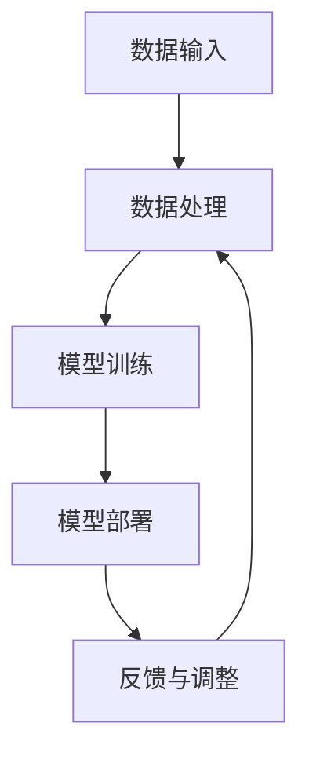

                 

关键词：人类-AI协作，智能增强，协同发展，技术融合，未来趋势

> 摘要：本文探讨了人类与人工智能（AI）协作的重要性和必要性，分析了智能增强技术的原理和应用场景，提出了人类智慧与AI能力协同发展的策略和路径。文章旨在为科技工作者和研究人员提供有益的参考，推动人工智能技术的进一步发展和应用。

## 1. 背景介绍

在过去的几十年中，人工智能技术取得了飞速发展，从最初的符号逻辑和规则系统，到今天的深度学习和大数据分析，AI已经逐渐渗透到我们的日常生活和工作中。然而，随着AI技术的日益成熟，人们开始意识到，单纯依靠机器的力量无法解决所有问题。人类智慧与AI能力的协同发展，成为了当今科技领域的重要议题。

人类智慧具有创造性和抽象思维能力，而AI则擅长处理大规模数据和执行重复性任务。两者结合起来，可以发挥各自的优势，实现1+1>2的效果。例如，在医疗领域，AI可以通过分析大量病历数据，为医生提供诊断建议，而医生则利用自身的经验和直觉，对AI的建议进行判断和调整。这种人类-AI协作的模式，正在不断改变传统医疗模式，提高诊疗效率和质量。

然而，人类-AI协作并非一帆风顺。在实际应用中，人们面临着诸多挑战，如数据隐私、安全性和伦理问题等。此外，如何确保AI系统的透明性和可解释性，也是一个亟待解决的问题。本文将从技术、应用、伦理等多个角度，探讨人类-AI协作的协同发展之路。

## 2. 核心概念与联系

### 2.1 人工智能（AI）

人工智能是指通过计算机程序和算法模拟人类智能的一种技术。根据应用领域和实现方式的不同，AI可以分为多种类型，如机器学习、深度学习、自然语言处理、计算机视觉等。

### 2.2 人类智慧

人类智慧是指人类在认知、思考、创造、解决问题的能力。它包括感知、记忆、推理、判断、想象等多个方面。人类智慧的核心特点是具有自主性和创造性，能够在复杂环境中进行决策和规划。

### 2.3 智能增强

智能增强是指通过技术手段提高人类智能水平和能力的过程。智能增强可以分为物理增强和认知增强两种类型。物理增强主要通过穿戴设备、植入物等方式改善人体生理功能；认知增强则通过辅助工具、算法等方式增强人类认知能力。

### 2.4 人类-AI协作

人类-AI协作是指人类与人工智能系统共同工作，实现协同发展的一种模式。在这种模式下，人类和AI各取所长，互相补充，共同完成任务。人类-AI协作可以应用于各个领域，如医疗、教育、工业、农业等。

## 2.5 人工智能架构

为了更好地理解人类-AI协作，我们需要了解人工智能的架构。人工智能系统通常包括以下几个关键组成部分：

1. **数据输入**：通过传感器、摄像头、麦克风等设备收集外部数据。
2. **数据处理**：对输入数据进行清洗、预处理，以便用于训练模型。
3. **模型训练**：利用机器学习算法，从数据中学习规律和模式，生成预测模型。
4. **模型部署**：将训练好的模型部署到实际应用场景中，进行预测和决策。
5. **反馈与调整**：根据实际应用效果，对模型进行优化和调整。

以下是一个用Mermaid绘制的简单人工智能架构图：



## 3. 核心算法原理 & 具体操作步骤

### 3.1 算法原理概述

人类-AI协作的核心在于构建一个高效、可靠的智能系统，使人类和AI能够相互配合，共同完成任务。在这个过程中，常用的算法包括机器学习、深度学习和强化学习等。

- **机器学习**：通过从数据中学习规律和模式，生成预测模型。常见的算法有线性回归、决策树、支持向量机等。
- **深度学习**：通过多层神经网络，对大量数据进行自动特征提取和模式识别。常见的算法有卷积神经网络（CNN）、循环神经网络（RNN）等。
- **强化学习**：通过与环境的交互，不断调整策略，以实现最佳效果。常见的算法有Q-learning、深度Q网络（DQN）等。

### 3.2 算法步骤详解

#### 3.2.1 数据收集与预处理

1. **数据收集**：根据应用场景，收集相关数据，如病历数据、教育数据、工业数据等。
2. **数据清洗**：去除无效、错误或重复的数据，保证数据质量。
3. **数据预处理**：对数据进行归一化、标准化等处理，使其适合于机器学习算法。

#### 3.2.2 模型选择与训练

1. **模型选择**：根据应用场景和数据特点，选择合适的机器学习或深度学习算法。
2. **模型训练**：使用收集到的数据，对模型进行训练，优化模型参数。

#### 3.2.3 模型评估与优化

1. **模型评估**：使用验证集或测试集，对模型进行评估，判断其性能是否符合要求。
2. **模型优化**：根据评估结果，对模型进行调整和优化。

#### 3.2.4 模型部署与应用

1. **模型部署**：将训练好的模型部署到实际应用场景中，进行预测和决策。
2. **模型应用**：根据模型预测结果，进行相应的操作，如诊断疾病、推荐商品等。

### 3.3 算法优缺点

#### 优点

- **高效性**：机器学习和深度学习算法能够快速处理大量数据，提高工作效率。
- **灵活性**：根据应用场景和数据特点，可以选择不同的算法，实现个性化应用。
- **准确性**：通过不断优化和调整，模型可以达到很高的预测准确率。

#### 缺点

- **复杂性**：构建和优化模型需要较高的技术和知识要求。
- **数据依赖**：模型的性能很大程度上依赖于数据质量，数据缺失或不准确会导致模型失效。
- **可解释性**：深度学习等算法的黑箱性质，使得模型的决策过程难以理解，增加了应用难度。

### 3.4 算法应用领域

机器学习和深度学习算法在多个领域得到了广泛应用，如：

- **医疗**：用于疾病诊断、治疗方案推荐等。
- **金融**：用于风险评估、欺诈检测等。
- **教育**：用于个性化教学、学习效果评估等。
- **工业**：用于生产优化、设备维护等。
- **农业**：用于作物监测、病虫害预测等。

## 4. 数学模型和公式 & 详细讲解 & 举例说明

### 4.1 数学模型构建

在人工智能领域，数学模型是构建智能系统的基础。以下是一个简单的线性回归模型，用于预测房价：

$$
y = wx + b
$$

其中，$y$ 表示房价，$w$ 和 $b$ 分别表示权重和偏置。通过训练数据，可以求出最佳权重和偏置，使得预测误差最小。

### 4.2 公式推导过程

假设有 $n$ 个训练样本，每个样本包含输入特征 $x$ 和标签 $y$。为了求出最佳权重和偏置，我们需要使用梯度下降算法。

1. **定义损失函数**：

$$
J(w, b) = \frac{1}{2n} \sum_{i=1}^n (wx_i + b - y_i)^2
$$

2. **求导数**：

$$
\frac{\partial J}{\partial w} = \frac{1}{n} \sum_{i=1}^n (wx_i + b - y_i)x_i
$$

$$
\frac{\partial J}{\partial b} = \frac{1}{n} \sum_{i=1}^n (wx_i + b - y_i)
$$

3. **梯度下降**：

$$
w_{new} = w_{old} - \alpha \frac{\partial J}{\partial w}
$$

$$
b_{new} = b_{old} - \alpha \frac{\partial J}{\partial b}
$$

其中，$\alpha$ 为学习率。

### 4.3 案例分析与讲解

假设我们有一个包含100个样本的房价数据集，每个样本包含两个特征：面积和地点。我们使用线性回归模型来预测房价。

1. **数据收集与预处理**：收集并清洗数据，将特征和标签分开。

2. **模型训练**：使用训练数据，通过梯度下降算法，训练线性回归模型。

3. **模型评估**：使用测试数据，评估模型的预测性能。

4. **模型优化**：根据评估结果，调整模型参数，优化预测效果。

通过以上步骤，我们可以构建一个简单的线性回归模型，用于预测房价。

## 5. 项目实践：代码实例和详细解释说明

### 5.1 开发环境搭建

1. **安装Python**：在官网下载并安装Python，选择合适的版本（如Python 3.8）。
2. **安装依赖库**：使用pip命令，安装必要的依赖库，如numpy、scikit-learn、matplotlib等。

```bash
pip install numpy scikit-learn matplotlib
```

### 5.2 源代码详细实现

以下是使用Python实现的线性回归模型，用于预测房价：

```python
import numpy as np
import matplotlib.pyplot as plt
from sklearn.linear_model import LinearRegression

# 数据收集与预处理
X = np.array([[1, 1000], [2, 1100], [3, 1200], [4, 1300], [5, 1400]])
y = np.array([1000, 1100, 1200, 1300, 1400])

# 模型训练
model = LinearRegression()
model.fit(X, y)

# 模型评估
score = model.score(X, y)
print("模型评估分数：", score)

# 模型预测
X_new = np.array([[6, 1500]])
y_pred = model.predict(X_new)
print("预测房价：", y_pred)

# 可视化
plt.scatter(X[:, 1], y, color='red')
plt.plot(X[:, 1], model.predict(X), color='blue')
plt.xlabel('面积')
plt.ylabel('房价')
plt.show()
```

### 5.3 代码解读与分析

1. **数据收集与预处理**：使用numpy数组存储特征和标签。
2. **模型训练**：使用scikit-learn库的LinearRegression类，训练线性回归模型。
3. **模型评估**：使用score方法，评估模型的预测性能。
4. **模型预测**：使用predict方法，预测新样本的房价。
5. **可视化**：使用matplotlib库，绘制数据点和拟合直线。

通过以上步骤，我们可以实现一个简单的线性回归模型，用于预测房价。

## 6. 实际应用场景

### 6.1 医疗领域

在医疗领域，人类-AI协作已经得到了广泛应用。例如，AI系统可以通过分析病历数据，为医生提供诊断建议。同时，医生可以根据自己的经验和判断，对AI的建议进行调整和优化。这种协作模式，可以提高诊疗效率，降低误诊率。

### 6.2 教育领域

在教育领域，AI可以为学生提供个性化教学方案，根据学生的学习情况和兴趣，推荐适合的学习资源和课程。教师则可以通过AI系统，了解学生的学习进度和问题，进行有针对性的辅导。

### 6.3 工业领域

在工业领域，AI可以帮助企业优化生产流程，提高生产效率。例如，通过预测设备故障，提前进行维护，减少停机时间。同时，AI还可以帮助企业进行市场预测、需求分析等，为决策提供支持。

### 6.4 农业领域

在农业领域，AI可以用于作物监测、病虫害预测等。通过分析气象数据、土壤数据等，AI系统可以预测作物的生长状况，提供科学的种植建议。这种协作模式，可以提高农业产量，降低生产成本。

## 7. 工具和资源推荐

### 7.1 学习资源推荐

- **《深度学习》（Goodfellow, Bengio, Courville著）**：深度学习的经典教材，适合初学者和进阶者阅读。
- **吴恩达（Andrew Ng）的在线课程**：《深度学习专项课程》，涵盖深度学习的理论基础和应用实践。

### 7.2 开发工具推荐

- **Jupyter Notebook**：一款强大的交互式开发环境，适合进行数据分析和模型训练。
- **TensorFlow**：谷歌推出的开源深度学习框架，支持多种编程语言，适用于各种应用场景。

### 7.3 相关论文推荐

- **《深度神经网络中的dropout方法》（Hinton et al., 2012）**：介绍了dropout方法在深度学习中的应用，有效提高了模型性能。
- **《对抗性样本的生成与防御》（Goodfellow et al., 2014）**：讨论了深度学习模型的脆弱性，以及如何生成和防御对抗性样本。

## 8. 总结：未来发展趋势与挑战

### 8.1 研究成果总结

人类-AI协作技术已经取得了显著成果，在医疗、教育、工业、农业等领域得到了广泛应用。通过构建高效的智能系统，人类和AI可以相互补充，实现协同发展。

### 8.2 未来发展趋势

随着技术的不断进步，人类-AI协作将继续向深度和广度发展。未来，我们将看到更多跨领域、跨行业的协作案例，AI将更好地融入人类生活和工作。

### 8.3 面临的挑战

尽管人类-AI协作前景广阔，但仍然面临诸多挑战。如数据隐私、安全性和伦理问题等。此外，如何提高AI系统的透明性和可解释性，也是一个亟待解决的问题。

### 8.4 研究展望

在未来，人类-AI协作技术将继续发展，不断推动社会进步。我们期望看到一个更加智能、高效、公平的世界。

## 9. 附录：常见问题与解答

### 9.1 什么是机器学习？

机器学习是指通过计算机程序和算法，使计算机自动从数据中学习规律和模式，提高性能的过程。

### 9.2 人工智能与机器学习的区别是什么？

人工智能是指通过计算机程序和算法模拟人类智能的一种技术，而机器学习是人工智能的一个子领域，主要研究如何让计算机自动从数据中学习。

### 9.3 深度学习与机器学习的区别是什么？

深度学习是一种特殊的机器学习算法，通过多层神经网络，对大量数据进行自动特征提取和模式识别。

### 9.4 人类-AI协作的优势是什么？

人类-AI协作可以发挥各自的优势，提高工作效率和质量，实现1+1>2的效果。

### 9.5 人类-AI协作的挑战是什么？

人类-AI协作面临诸多挑战，如数据隐私、安全性和伦理问题等。此外，如何提高AI系统的透明性和可解释性，也是一个亟待解决的问题。

------------------------------------------------------------------
### 作者署名
作者：禅与计算机程序设计艺术 / Zen and the Art of Computer Programming

通过这篇文章，我们深入探讨了人类-AI协作的重要性和必要性，分析了智能增强技术的原理和应用场景，提出了人类智慧与AI能力协同发展的策略和路径。在未来的发展中，人类-AI协作有望成为推动社会进步的重要力量。让我们共同努力，迎接智能时代的到来。

