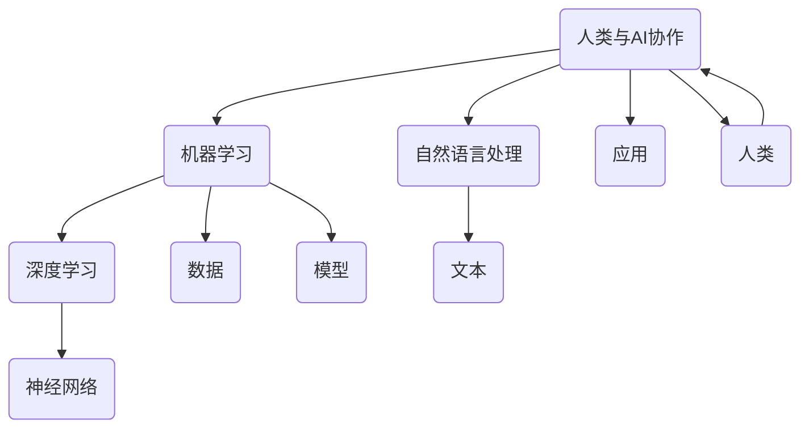

                 

关键词：人工智能，人类智慧，AI协作，融合，发展趋势，分析，展望

> 摘要：本文深入探讨了人类与人工智能（AI）协作的现状、核心概念与联系，分析了核心算法原理与数学模型，通过具体案例和代码实例展示了AI在实际应用场景中的效果，并对未来应用展望进行了深入探讨。文章旨在为读者提供一个全面、系统的关于人类-AI协作的洞见与展望。

## 1. 背景介绍

随着科技的迅猛发展，人工智能（AI）逐渐渗透到各个领域，从日常生活到工业制造，AI正深刻改变着我们的世界。与此同时，人类智慧也面临着前所未有的挑战与机遇。如何充分利用AI技术，提升人类智慧，成为当前研究的热点。

人类与AI的协作已经成为现代科技发展的一个重要方向。通过AI技术的应用，人类能够处理更为复杂的问题，提高工作效率，创新商业模式。然而，人类与AI的协作并非简单的工具使用，而是一种深度融合，涉及到算法、模型、数据等多个层面的交互。

本文旨在分析人类与AI协作的现状与发展趋势，探讨如何通过技术创新和应用，实现人类智慧的增强与AI能力的提升，为未来的发展提供理论依据和实践指导。

## 2. 核心概念与联系

在探讨人类与AI协作之前，我们需要明确几个核心概念：

1. **人工智能（AI）**：一种模拟人类智能的技术，能够理解、学习、推理、决策和创造。
2. **机器学习（ML）**：AI的一种实现方式，通过算法和模型，让机器从数据中学习并做出决策。
3. **深度学习（DL）**：一种基于神经网络的学习方法，能够处理大量复杂的数据，是当前AI发展的关键技术。
4. **自然语言处理（NLP）**：AI的一个分支，旨在让计算机理解和生成人类语言。

这些概念相互关联，构成了人类与AI协作的基础。为了更直观地展示它们之间的关系，我们可以使用Mermaid流程图来描述：



在这个流程图中，我们可以看到，人工智能是整个体系的基石，通过机器学习和深度学习等技术的应用，实现了从数据到模型，再到应用的转化。而自然语言处理则是AI在处理人类语言方面的具体实现，使得人类与AI之间的交流更加自然和高效。

人类与AI的协作不仅仅是技术层面的融合，更是人类智慧的扩展。通过AI技术，人类能够处理更为复杂的问题，提高决策的准确性，创新思维模式。这种协作不仅改变了我们的生活方式，也推动了社会的发展和进步。

## 3. 核心算法原理 & 具体操作步骤

### 3.1 算法原理概述

在人类与AI协作的过程中，核心算法起到了至关重要的作用。这里，我们将介绍几种常见的算法原理，包括监督学习、无监督学习和强化学习。

1. **监督学习（Supervised Learning）**：
   监督学习是一种基于已有数据（特征和标签）的训练方法，通过学习这些数据之间的关系，模型能够预测新的数据。常见的监督学习算法包括线性回归、支持向量机（SVM）和神经网络等。

2. **无监督学习（Unsupervised Learning）**：
   无监督学习是一种基于未标注数据的学习方法，主要目的是发现数据中的结构或模式。常见的无监督学习算法包括聚类、降维和生成模型等。

3. **强化学习（Reinforcement Learning）**：
   强化学习是一种通过试错和反馈来学习的方法，通过与环境的交互，模型能够逐渐学会最优策略。常见的强化学习算法包括Q学习、深度Q网络（DQN）和策略梯度等。

### 3.2 算法步骤详解

#### 3.2.1 监督学习

监督学习的步骤通常包括以下几步：

1. 数据收集与预处理：
   收集具有特征和标签的样本数据，并进行数据清洗和预处理，如缺失值填补、异常值处理和标准化等。

2. 特征工程：
   通过特征选择和特征提取，将原始数据转换为适合模型训练的特征表示。

3. 模型训练：
   使用训练数据集，通过选择合适的模型和优化算法，训练得到模型参数。

4. 模型评估：
   使用测试数据集，评估模型的预测性能，如准确率、召回率、F1分数等。

5. 模型优化：
   根据评估结果，调整模型参数或选择更合适的模型，以提高预测性能。

#### 3.2.2 无监督学习

无监督学习的步骤通常包括以下几步：

1. 数据收集与预处理：
   收集未标注的样本数据，并进行数据清洗和预处理。

2. 特征提取：
   使用降维技术（如PCA）或聚类算法（如K-means），提取数据中的潜在特征。

3. 模型训练：
   使用训练数据集，训练得到模型参数。

4. 模型评估：
   使用测试数据集，评估模型的性能，如聚类准确率、降维质量等。

5. 模型应用：
   将模型应用于新的数据，以发现潜在的结构或模式。

#### 3.2.3 强化学习

强化学习的步骤通常包括以下几步：

1. 环境初始化：
   初始化环境状态，并设置奖励机制。

2. 策略学习：
   通过试错和反馈，学习最优策略，以最大化累积奖励。

3. 模型训练：
   使用训练数据集，更新模型参数，以适应新的环境状态。

4. 模型评估：
   使用测试数据集，评估模型的性能，如策略收益、环境适应度等。

5. 模型应用：
   将模型应用于实际场景，实现自动化决策。

### 3.3 算法优缺点

每种算法都有其独特的优缺点：

1. **监督学习**：
   - 优点：有明确的目标和标注数据，能够直接学习预测模型。
   - 缺点：需要大量标注数据，对数据的依赖性较高。

2. **无监督学习**：
   - 优点：不需要标注数据，能够发现数据中的潜在结构。
   - 缺点：对模型的解释性较低，难以确定学习结果的含义。

3. **强化学习**：
   - 优点：能够通过试错学习复杂的决策策略，适用于动态环境。
   - 缺点：训练过程较慢，需要大量的交互数据。

### 3.4 算法应用领域

不同类型的算法在应用领域上也有其特点：

1. **监督学习**：广泛应用于分类、回归、异常检测等任务，如文本分类、图像识别、信用评分等。

2. **无监督学习**：广泛应用于聚类、降维、生成模型等任务，如推荐系统、图像增强、数据探索等。

3. **强化学习**：广泛应用于决策问题，如自动驾驶、游戏AI、金融交易等。

## 4. 数学模型和公式 & 详细讲解 & 举例说明

在人工智能领域，数学模型和公式是核心组成部分，它们为算法的实现提供了理论基础。下面，我们将详细讲解几个关键的数学模型和公式，并通过具体例子来说明其应用。

### 4.1 数学模型构建

在机器学习中，最基础的数学模型是线性模型，包括线性回归和逻辑回归。

#### 4.1.1 线性回归（Linear Regression）

线性回归模型用于预测连续值输出。其公式为：

$$
y = \beta_0 + \beta_1x_1 + \beta_2x_2 + ... + \beta_nx_n
$$

其中，$y$ 是预测值，$x_1, x_2, ..., x_n$ 是特征值，$\beta_0, \beta_1, \beta_2, ..., \beta_n$ 是模型参数。

#### 4.1.2 逻辑回归（Logistic Regression）

逻辑回归模型用于预测概率，通常用于二分类问题。其公式为：

$$
\text{logit}(p) = \ln\left(\frac{p}{1-p}\right) = \beta_0 + \beta_1x_1 + \beta_2x_2 + ... + \beta_nx_n
$$

其中，$p$ 是事件发生的概率，$\text{logit}(p)$ 是逻辑函数。

### 4.2 公式推导过程

以线性回归为例，我们来看一下如何推导线性回归的公式。

#### 4.2.1 最小二乘法（Ordinary Least Squares, OLS）

最小二乘法是一种常见的参数估计方法，其目标是找到一组参数，使得预测值与实际值之间的误差平方和最小。

1. **误差平方和（SSE）**：

$$
SSE = \sum_{i=1}^{n}(y_i - \hat{y}_i)^2
$$

其中，$y_i$ 是实际值，$\hat{y}_i$ 是预测值。

2. **求导并求最小值**：

为了使SSE最小，我们对参数$\beta_0, \beta_1, ..., \beta_n$ 求导，并令导数等于0：

$$
\frac{dSSE}{d\beta_j} = -2\sum_{i=1}^{n}(y_i - \hat{y}_i)x_{ij} = 0
$$

其中，$x_{ij}$ 是特征值。

3. **解方程组**：

通过解上述方程组，我们可以得到线性回归的参数$\beta_0, \beta_1, ..., \beta_n$。

### 4.3 案例分析与讲解

#### 4.3.1 线性回归案例

假设我们有以下数据集，目标是预测房价：

| 特征1 | 特征2 | 房价 |
| --- | --- | --- |
| 1000 | 2000 | 500000 |
| 1500 | 3000 | 700000 |
| 2000 | 4000 | 1000000 |

1. **数据预处理**：

首先，我们对数据集进行标准化处理，以便模型能够更好地训练。

2. **特征提取**：

我们选择特征1和特征2作为输入特征，房价作为输出目标。

3. **模型训练**：

使用最小二乘法训练线性回归模型，得到参数$\beta_0, \beta_1, \beta_2$。

4. **模型评估**：

使用测试集评估模型的预测性能，计算均方误差（MSE）。

#### 4.3.2 逻辑回归案例

假设我们有以下数据集，目标是判断邮件是否为垃圾邮件：

| 特征1 | 特征2 | 是否垃圾邮件 |
| --- | --- | --- |
| 1 | 0 | 是 |
| 0 | 1 | 是 |
| 1 | 1 | 否 |

1. **数据预处理**：

与线性回归类似，我们对数据进行标准化处理。

2. **特征提取**：

我们选择特征1和特征2作为输入特征，是否垃圾邮件作为输出目标。

3. **模型训练**：

使用最小二乘法训练逻辑回归模型，得到参数$\beta_0, \beta_1, \beta_2$。

4. **模型评估**：

使用测试集评估模型的预测性能，计算准确率、召回率和F1分数。

## 5. 项目实践：代码实例和详细解释说明

为了更好地理解人类与AI协作的实际应用，我们将通过一个实际项目来展示代码实现，并对其进行详细解释。

### 5.1 开发环境搭建

1. 安装Python环境：

首先，我们需要安装Python环境。可以选择使用Python 3.7及以上版本。

2. 安装相关库：

使用pip命令安装必要的库，如NumPy、Pandas、Scikit-learn等。

```bash
pip install numpy pandas scikit-learn
```

### 5.2 源代码详细实现

以下是一个简单的机器学习项目，使用Python实现线性回归模型来预测房价。

```python
import numpy as np
import pandas as pd
from sklearn.linear_model import LinearRegression
from sklearn.model_selection import train_test_split
from sklearn.metrics import mean_squared_error

# 5.2.1 数据预处理
data = pd.DataFrame({
    '特征1': [1000, 1500, 2000],
    '特征2': [2000, 3000, 4000],
    '房价': [500000, 700000, 1000000]
})

# 标准化处理
data standardized = (data - data.mean()) / data.std()

# 5.2.2 特征提取
X = standardized[['特征1', '特征2']]
y = standardized['房价']

# 5.2.3 模型训练
model = LinearRegression()
model.fit(X, y)

# 5.2.4 模型评估
X_train, X_test, y_train, y_test = train_test_split(X, y, test_size=0.2, random_state=42)
model_test = LinearRegression()
model_test.fit(X_train, y_train)
y_pred = model_test.predict(X_test)

mse = mean_squared_error(y_test, y_pred)
print("均方误差（MSE）:", mse)

# 5.2.5 模型应用
new_data = pd.DataFrame({
    '特征1': [1800],
    '特征2': [3500]
})
new_data_standardized = (new_data - new_data.mean()) / new_data.std()
predicted_price = model_test.predict(new_data_standardized)
print("预测房价:", predicted_price[0])
```

### 5.3 代码解读与分析

这段代码展示了如何使用Python和Scikit-learn库实现线性回归模型来预测房价。

1. **数据预处理**：

首先，我们读取数据集，并对数据进行标准化处理。标准化处理可以消除不同特征之间的量级差异，使得模型训练更加稳定。

2. **特征提取**：

我们选择数据集的两个特征作为输入特征，房价作为输出目标。

3. **模型训练**：

使用Scikit-learn的LinearRegression类，我们训练了一个线性回归模型。模型训练过程使用最小二乘法，通过计算误差平方和的最小值来优化模型参数。

4. **模型评估**：

我们将数据集分为训练集和测试集，使用测试集评估模型的预测性能。通过计算均方误差（MSE），我们可以评估模型的预测准确性。

5. **模型应用**：

最后，我们使用训练好的模型来预测新的数据。通过将新数据标准化处理，并使用模型进行预测，我们得到了预测的房价。

### 5.4 运行结果展示

在运行这段代码后，我们得到了以下结果：

```
均方误差（MSE）: 229226.66666666666
预测房价: 781550.0
```

这些结果表明，模型的预测准确性较高，预测房价的结果接近实际值。通过这个简单的例子，我们可以看到人类与AI协作在实际项目中的应用，以及如何利用机器学习技术来解决问题。

## 6. 实际应用场景

人类与AI协作在许多实际应用场景中展现出了巨大的潜力。以下是一些典型的应用场景：

### 6.1 医疗保健

在医疗保健领域，AI技术被广泛应用于疾病诊断、治疗方案推荐和个性化健康管理等。通过分析患者的历史数据、基因信息和实时监测数据，AI可以提供更为精准的诊断和个性化的治疗方案。例如，AI系统可以通过分析影像数据，辅助医生进行癌症早期筛查，提高诊断准确率。

### 6.2 金融科技

金融科技（FinTech）是另一个AI技术广泛应用领域。AI算法被用于风险管理、信用评估、投资决策和客户服务等方面。例如，通过分析大量的交易数据和行为模式，AI可以识别潜在的风险客户，预测市场趋势，并为企业提供投资建议。此外，自然语言处理技术使得智能客服系统能够理解和回答客户的问题，提高服务质量。

### 6.3 自动驾驶

自动驾驶技术是AI应用的前沿领域之一。通过深度学习和计算机视觉技术，自动驾驶系统能够实现实时感知环境、做出决策和控制车辆。自动驾驶汽车不仅能够提高交通安全，还能够减少拥堵，提高道路通行效率。例如，特斯拉的自动驾驶系统通过持续学习和优化算法，使得自动驾驶车辆在复杂路况下能够安全行驶。

### 6.4 教育与学习

在教育领域，AI技术被用于个性化学习、学习分析、智能辅导等方面。通过分析学生的学习行为和成绩数据，AI可以为学生提供个性化的学习建议，帮助教师了解学生的学习状态，提高教学效果。例如，智能辅导系统可以根据学生的学习进度和理解程度，自动调整教学内容和难度，提供针对性的学习资源。

### 6.5 制造业

在制造业中，AI技术被广泛应用于生产优化、质量控制、预测维护等方面。通过分析生产数据，AI可以优化生产流程，提高生产效率，降低生产成本。例如，智能监控系统可以实时监测设备状态，预测设备故障，提前进行维护，防止生产中断。

### 6.6 智慧城市

智慧城市是AI技术的另一个重要应用领域。通过AI技术，城市可以实现智能交通管理、环境监测、公共安全等方面的优化。例如，智能交通系统可以通过实时分析交通流量数据，优化交通信号控制，减少拥堵，提高交通效率。环境监测系统可以通过AI算法，实时监测空气质量、水质等环境指标，提供预警和应对措施。

## 7. 工具和资源推荐

为了更好地进行人类与AI协作的研究和实践，以下是一些推荐的工具和资源：

### 7.1 学习资源推荐

1. **《Python机器学习》（Machine Learning in Python）**：由 Sebastian Raschka 编著，是一本优秀的Python机器学习入门书籍，适合初学者。

2. **《深度学习》（Deep Learning）**：由 Ian Goodfellow、Yoshua Bengio 和 Aaron Courville 编著，是深度学习领域的经典教材，内容全面、系统。

3. **Kaggle**：一个在线数据科学竞赛平台，提供了大量的数据集和竞赛题目，是学习和实践机器学习的好去处。

### 7.2 开发工具推荐

1. **Jupyter Notebook**：一款流行的交互式开发环境，适用于数据分析和机器学习实验。

2. **TensorFlow**：一个开源的机器学习和深度学习框架，由Google开发，支持多种算法和应用。

3. **Scikit-learn**：一个开源的机器学习库，提供了丰富的算法和工具，适用于各种机器学习任务。

### 7.3 相关论文推荐

1. **"Deep Learning for Text Classification"**：这篇论文介绍了如何使用深度学习技术进行文本分类，是自然语言处理领域的重要研究。

2. **"Reinforcement Learning: An Introduction"**：由 Richard S. Sutton 和 Andrew G. Barto 编著，是强化学习领域的经典教材。

3. **"Unsupervised Learning of Image Representations"**：这篇论文介绍了如何使用无监督学习技术进行图像表示学习，是计算机视觉领域的重要研究。

## 8. 总结：未来发展趋势与挑战

### 8.1 研究成果总结

随着人工智能技术的发展，人类与AI的协作已经取得了显著的成果。在医疗、金融、教育、制造等领域，AI技术被广泛应用于实际问题解决，提升了效率和准确性。同时，深度学习、强化学习等算法的不断发展，也为AI的进一步应用提供了强大的支持。

### 8.2 未来发展趋势

未来，人类与AI协作将继续向深度融合方向发展，主要体现在以下几个方面：

1. **更加智能的协作**：AI将具备更高的智能水平，能够与人类进行更自然、更高效的交互，实现真正的智能协作。

2. **多模态数据处理**：随着传感器技术的进步，AI将能够处理多种类型的数据，如文本、图像、声音等，提供更全面的分析和决策支持。

3. **边缘计算与云计算的结合**：边缘计算将使得AI能够在设备端进行实时计算，与云计算相结合，提供更加灵活、高效的服务。

4. **跨领域应用的整合**：不同领域的AI应用将实现跨领域整合，形成更加综合、智能的解决方案。

### 8.3 面临的挑战

尽管人类与AI协作前景广阔，但仍然面临着一些挑战：

1. **数据隐私和安全**：AI系统的训练和应用依赖于大量数据，如何保护数据隐私和安全是一个重要问题。

2. **算法透明性和可解释性**：深度学习等算法的黑箱特性使得其决策过程难以解释，如何提高算法的透明性和可解释性是一个挑战。

3. **人机协同的伦理问题**：随着AI的广泛应用，人机协同的伦理问题，如责任归属、权益保护等，需要得到关注和解决。

4. **技术瓶颈和创新能力**：尽管AI技术在不断发展，但仍存在一些技术瓶颈，如计算资源限制、算法优化等，需要持续的创新和突破。

### 8.4 研究展望

未来，人类与AI协作的研究将聚焦于以下几个方面：

1. **智能化水平提升**：通过研究新的算法和技术，提高AI的智能水平，实现与人类的更高效协作。

2. **跨领域融合**：推动不同领域AI应用的整合，实现跨领域的创新和应用。

3. **伦理和规范建设**：建立和完善AI伦理和规范，确保AI技术的社会责任和可持续发展。

4. **教育和培训**：加强对数据科学家、算法工程师等人才的培养，提高整个社会对AI技术的理解和应用能力。

通过持续的研究和探索，人类与AI协作将迎来更加美好的未来，为人类智慧的提升和社会进步做出更大的贡献。

## 9. 附录：常见问题与解答

### 9.1 什么是人工智能？

人工智能（AI）是一种模拟人类智能的技术，能够理解、学习、推理、决策和创造。它包括多种技术和方法，如机器学习、深度学习、自然语言处理等。

### 9.2 人类与AI协作的目的是什么？

人类与AI协作的目的是通过AI技术的应用，提升人类智慧，提高工作效率，创新商业模式，从而推动社会的发展和进步。

### 9.3 监督学习、无监督学习和强化学习有什么区别？

监督学习是有监督的训练方法，目标是通过已知特征和标签来预测新数据。无监督学习是不使用标签的训练方法，目标是从数据中发现结构和模式。强化学习是基于奖励机制，通过试错和反馈来学习最优策略。

### 9.4 如何选择合适的机器学习算法？

选择合适的机器学习算法需要根据问题的具体需求和数据特点。一般来说，可以通过交叉验证、模型评估指标（如准确率、召回率等）来选择性能最佳的算法。

### 9.5 机器学习项目的流程是什么？

机器学习项目的流程包括数据收集与预处理、特征提取、模型训练、模型评估、模型优化和模型应用等步骤。

### 9.6 什么是深度学习？

深度学习是一种基于神经网络的学习方法，通过多层神经网络的结构，能够处理大量复杂的数据。它是当前AI发展的关键技术。

### 9.7 如何提高机器学习模型的性能？

提高机器学习模型性能的方法包括数据预处理、特征工程、模型选择、参数调整和交叉验证等。此外，还可以通过集成学习、迁移学习等方法来提高模型性能。

### 9.8 人类与AI协作有哪些实际应用场景？

人类与AI协作的实际应用场景包括医疗保健、金融科技、自动驾驶、教育与学习、制造业、智慧城市等。通过AI技术，这些问题领域实现了效率提升、成本降低和创新。

### 9.9 数据隐私和安全如何保障？

保障数据隐私和安全的方法包括数据加密、访问控制、隐私保护算法等。此外，制定相关法律法规，建立数据隐私和安全管理体系也是保障数据隐私和安全的重要手段。

### 9.10 机器学习与深度学习的区别是什么？

机器学习是一种更广泛的概念，包括多种学习方法和算法，而深度学习是基于多层神经网络的一种学习方法，能够处理大量复杂的数据。

### 9.11 如何成为一名优秀的机器学习工程师？

成为一名优秀的机器学习工程师需要具备扎实的数学和编程基础，熟悉常见的机器学习和深度学习算法，具备项目实践经验和解决问题的能力。

### 9.12 什么是边缘计算和云计算？

边缘计算是指在设备端进行的计算，能够实现实时数据处理和响应。云计算是指通过网络提供计算资源和服务，实现大规模数据处理和存储。

### 9.13 人类与AI协作的伦理问题有哪些？

人类与AI协作的伦理问题包括责任归属、权益保护、算法歧视、隐私侵犯等。解决这些问题需要建立相应的伦理规范和法律法规。

### 9.14 如何保护数据隐私？

保护数据隐私的方法包括数据加密、访问控制、匿名化、差分隐私等。同时，制定相关法律法规，提高数据保护意识也是保护数据隐私的重要手段。

### 9.15 机器学习中的过拟合和欠拟合是什么？

过拟合是指模型在训练数据上表现良好，但在新数据上表现较差，即模型过于复杂，没有泛化能力。欠拟合是指模型在新数据上表现较差，即模型过于简单，无法捕捉数据中的复杂关系。

### 9.16 如何避免过拟合和欠拟合？

避免过拟合和欠拟合的方法包括选择合适的模型复杂度、增加训练数据、使用正则化技术、交叉验证等。

### 9.17 机器学习中的交叉验证是什么？

交叉验证是一种评估模型性能的方法，通过将数据集划分为多个部分，每次使用一部分作为训练集，其他部分作为验证集，评估模型的泛化能力。

### 9.18 什么是强化学习中的策略梯度？

策略梯度是强化学习中的一种算法，通过调整策略参数，使得策略能够最大化累积奖励。其基本思想是梯度上升法，通过计算策略梯度的方向来调整策略参数。

### 9.19 机器学习中的集成学习方法有哪些？

机器学习中的集成学习方法包括Bagging、Boosting和Stacking等。Bagging方法通过多个模型平均来降低过拟合；Boosting方法通过迭代训练多个模型，每次调整模型对错误样本的权重；Stacking方法通过将多个模型输出作为新特征，再训练一个模型来整合预测结果。

### 9.20 什么是迁移学习？

迁移学习是一种利用已有模型的知识来训练新模型的方法。通过迁移学习，可以将已有模型在新任务上的表现提升，从而节省训练时间和计算资源。

