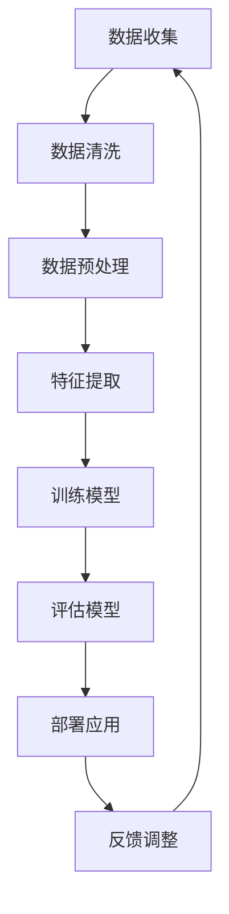

                 

### 1. 背景介绍

在21世纪的今天，人工智能（AI）已经不再是一个遥远的概念，而是深入到了我们日常生活的方方面面。从自动驾驶汽车到智能助手，从医学诊断到金融分析，AI的应用无处不在，极大地提升了生产效率、优化了决策过程、丰富了人类的生活体验。与此同时，AI技术的快速发展也对人类社会提出了新的挑战，尤其是在与人类的协作方面。

随着AI技术的不断进步，人类开始意识到仅仅依靠机器的力量无法完全解决复杂的问题。为了充分发挥人类智慧和AI技术的各自优势，人类-AI协作成为一种必然的趋势。这种协作不仅仅是简单的任务分配，更是一种深度融合，旨在通过AI辅助人类实现更高效、更准确的决策和行动。

本文将探讨人类-AI协作的背景、核心概念、算法原理、数学模型、项目实践以及未来应用趋势，旨在为读者提供一份全面、深入的洞察。文章结构如下：

## 1. 背景介绍

## 2. 核心概念与联系

## 3. 核心算法原理 & 具体操作步骤

### 3.1 算法原理概述

### 3.2 算法步骤详解 

### 3.3 算法优缺点

### 3.4 算法应用领域

## 4. 数学模型和公式 & 详细讲解 & 举例说明

### 4.1 数学模型构建

### 4.2 公式推导过程

### 4.3 案例分析与讲解

## 5. 项目实践：代码实例和详细解释说明

### 5.1 开发环境搭建

### 5.2 源代码详细实现

### 5.3 代码解读与分析

### 5.4 运行结果展示

## 6. 实际应用场景

### 6.4 未来应用展望

## 7. 工具和资源推荐

### 7.1 学习资源推荐

### 7.2 开发工具推荐

### 7.3 相关论文推荐

## 8. 总结：未来发展趋势与挑战

### 8.1 研究成果总结

### 8.2 未来发展趋势

### 8.3 面临的挑战

### 8.4 研究展望

## 9. 附录：常见问题与解答

### 1.1 AI与人类的协作背景

AI与人类的协作并非一个全新的概念。早在20世纪80年代，专家系统（Expert Systems）的出现就标志着AI开始尝试协助人类解决复杂问题。然而，早期的AI技术由于计算能力有限，难以胜任复杂的任务。随着计算能力的不断提升和算法的优化，AI技术逐渐成熟，开始广泛应用于各个领域。

在AI技术不断发展的背景下，人类逐渐意识到，单纯依靠AI无法完全取代人类的工作。人类在创造力、情感认知、情境理解等方面具有独特的优势，而AI则在处理大量数据、执行重复性任务方面具有明显优势。因此，将人类智慧和AI能力相结合，发挥各自的优势，成为一种必然趋势。

### 1.2 人类-AI协作的重要性

人类-AI协作的重要性体现在多个方面：

1. **提高工作效率**：通过AI技术的辅助，人类可以更快速地处理大量数据，从而提高工作效率。

2. **优化决策过程**：AI可以通过分析大量数据，提供决策支持，帮助人类做出更准确、更合理的决策。

3. **创新与突破**：人类-AI协作可以激发新的创意，推动科技和产业的创新。

4. **解决复杂问题**：许多复杂的问题需要人类和AI共同协作，才能找到有效的解决方案。

5. **提升生活质量**：AI技术在医疗、教育、交通等领域的应用，极大地提升了人类的生活质量。

### 1.3 文章结构

本文将首先介绍人类-AI协作的背景，然后深入探讨其核心概念、算法原理、数学模型、项目实践以及未来应用趋势。通过本文的阅读，读者将能够全面了解人类-AI协作的各个方面，为未来的研究和工作提供参考。

---

## 2. 核心概念与联系

要深入探讨人类-AI协作，首先需要明确几个核心概念，并了解它们之间的联系。以下是本文将涉及的核心概念及其简要解释：

### 2.1 人工智能（AI）

人工智能是指计算机系统模拟人类智能的行为，包括学习、推理、感知、理解、规划等。AI技术广泛应用于自然语言处理、计算机视觉、机器学习等领域。

### 2.2 机器学习（Machine Learning）

机器学习是AI的一个重要分支，通过算法和统计模型，从数据中自动学习规律和模式，从而做出预测和决策。

### 2.3 深度学习（Deep Learning）

深度学习是机器学习的一个子领域，通过多层神经网络模型，对大量数据进行自动学习和特征提取。

### 2.4 自然语言处理（Natural Language Processing，NLP）

自然语言处理是AI的一个分支，旨在使计算机理解和处理人类自然语言。NLP技术广泛应用于语音识别、机器翻译、情感分析等领域。

### 2.5 人类-AI协作模式

人类-AI协作模式包括以下几种：

1. **监督协作**：人类提供训练数据，AI负责学习和执行任务。

2. **协作决策**：人类和AI共同分析数据，进行决策。

3. **协同创作**：人类和AI共同参与创作，如AI生成艺术作品。

4. **自动化辅助**：AI辅助人类执行重复性任务，如自动化客服。

### 2.6 Mermaid流程图

为了更直观地展示人类-AI协作的过程，我们使用Mermaid流程图来描述其核心步骤：



在这个流程图中，人类和AI在不同阶段扮演不同的角色，共同完成从数据收集到模型部署的整个过程。

---

## 3. 核心算法原理 & 具体操作步骤

在探讨人类-AI协作的过程中，核心算法的选择和具体操作步骤的设定至关重要。以下是本文将介绍的一种典型算法——基于深度学习的自然语言处理（NLP）算法，其原理和操作步骤如下：

### 3.1 算法原理概述

深度学习是一种基于多层神经网络的机器学习技术，通过多层非线性变换，自动提取数据中的特征和模式。在NLP领域，深度学习算法被广泛应用于文本分类、情感分析、机器翻译等任务。

本文介绍的算法基于Transformer模型，这是一种在2017年由谷歌提出的新型深度学习模型，特别适用于处理序列数据。Transformer模型的核心思想是自注意力机制（Self-Attention），它使得模型能够自动关注序列中的关键信息，从而提高模型的表示能力和性能。

### 3.2 算法步骤详解

#### 3.2.1 数据收集与预处理

1. **数据收集**：从互联网或数据库中收集大量文本数据，如新闻文章、社交媒体评论等。
2. **数据清洗**：去除无关信息，如HTML标签、特殊字符等。
3. **数据预处理**：将文本转换为数字序列，通常使用词嵌入（Word Embedding）技术，如Word2Vec、GloVe等。

#### 3.2.2 特征提取

1. **词嵌入**：将文本中的每个词转换为固定长度的向量表示。
2. **位置嵌入**：为每个词添加位置信息，使得模型能够理解词在序列中的相对位置。
3. **注意力机制**：通过自注意力机制，模型自动关注序列中的关键信息，提高表示能力。

#### 3.2.3 训练模型

1. **模型初始化**：随机初始化模型参数。
2. **前向传播**：输入词嵌入和位置嵌入，通过多层Transformer块进行前向传播。
3. **损失函数**：使用损失函数（如交叉熵损失）计算预测标签和实际标签之间的差异。
4. **反向传播**：通过反向传播算法更新模型参数。

#### 3.2.4 评估模型

1. **交叉验证**：使用交叉验证方法评估模型在不同数据集上的性能。
2. **性能指标**：使用准确率、召回率、F1分数等指标评估模型性能。

#### 3.2.5 模型部署

1. **模型压缩**：对模型进行压缩，降低模型大小和计算复杂度。
2. **部署应用**：将模型部署到生产环境中，如服务器、云平台等。
3. **在线更新**：定期更新模型，以适应新的数据和变化。

### 3.3 算法优缺点

#### 优点：

1. **强大的表示能力**：自注意力机制使得模型能够自动提取序列中的关键信息。
2. **良好的性能**：Transformer模型在多个NLP任务上取得了优异的性能。
3. **适应性**：通过调整模型参数，可以适应不同的应用场景和数据集。

#### 缺点：

1. **计算复杂度高**：Transformer模型在训练和推理过程中需要大量的计算资源。
2. **数据依赖性强**：模型的性能高度依赖于训练数据的质量和规模。
3. **解释性差**：深度学习模型通常难以解释其内部的决策过程。

### 3.4 算法应用领域

基于Transformer的深度学习算法在NLP领域有广泛的应用，包括：

1. **文本分类**：用于对文本进行分类，如新闻分类、情感分类等。
2. **机器翻译**：用于将一种语言的文本翻译成另一种语言。
3. **命名实体识别**：用于识别文本中的命名实体，如人名、地名、组织名等。
4. **情感分析**：用于分析文本的情感倾向，如正面、负面、中性等。

---

## 4. 数学模型和公式 & 详细讲解 & 举例说明

在讨论人类-AI协作时，理解其背后的数学模型和公式是至关重要的。这不仅有助于我们深入理解AI的工作原理，还能为我们提供有效的工具来评估和改进协作系统的性能。以下是几个关键数学模型和公式的详细讲解，并配以实际应用案例。

### 4.1 数学模型构建

在深度学习领域，常见的数学模型包括线性回归、逻辑回归、神经网络等。这些模型的基本构建块是神经元，它们通过加权连接形成网络结构。以下是一个简单的线性回归模型：

#### 线性回归模型

$$
y = \beta_0 + \beta_1x
$$

其中，$y$ 是预测值，$x$ 是输入特征，$\beta_0$ 和 $\beta_1$ 是模型的参数。

#### 逻辑回归模型

逻辑回归是一种广泛用于分类问题的模型，其公式为：

$$
P(y=1) = \frac{1}{1 + e^{-(\beta_0 + \beta_1x)}}
$$

其中，$P(y=1)$ 是输出为1的概率，$e$ 是自然对数的底。

### 4.2 公式推导过程

#### 线性回归的推导

线性回归的目标是最小化预测值与实际值之间的误差。这个误差可以通过均方误差（MSE）来衡量：

$$
MSE = \frac{1}{n}\sum_{i=1}^{n}(y_i - \hat{y}_i)^2
$$

其中，$y_i$ 是实际值，$\hat{y}_i$ 是预测值，$n$ 是样本数量。

为了最小化MSE，我们对模型参数 $\beta_0$ 和 $\beta_1$ 分别求导，并令导数为0：

$$
\frac{\partial MSE}{\partial \beta_0} = -2\sum_{i=1}^{n}(y_i - \hat{y}_i) = 0
$$

$$
\frac{\partial MSE}{\partial \beta_1} = -2\sum_{i=1}^{n}(y_i - \hat{y}_i)x_i = 0
$$

通过解这个方程组，我们可以得到最优的模型参数：

$$
\beta_0 = \frac{1}{n}\sum_{i=1}^{n}y_i - \beta_1\frac{1}{n}\sum_{i=1}^{n}x_i
$$

$$
\beta_1 = \frac{1}{n}\sum_{i=1}^{n}(x_i - \bar{x})(y_i - \bar{y})
$$

其中，$\bar{x}$ 和 $\bar{y}$ 分别是输入和输出的平均值。

#### 逻辑回归的推导

逻辑回归的目标是最大化预测概率的正确性。我们可以通过梯度上升法或最小二乘法来优化模型参数。以下是最小二乘法的推导过程：

$$
\frac{\partial L}{\partial \beta_0} = \frac{1}{n}\sum_{i=1}^{n}(y_i - \hat{y}_i) = 0
$$

$$
\frac{\partial L}{\partial \beta_1} = \frac{1}{n}\sum_{i=1}^{n}(y_i - \hat{y}_i)x_i = 0
$$

通过解这个方程组，我们可以得到最优的模型参数：

$$
\beta_0 = \bar{y} - \beta_1\bar{x}
$$

$$
\beta_1 = \frac{\sum_{i=1}^{n}(x_i - \bar{x})(y_i - \bar{y})}{\sum_{i=1}^{n}(x_i - \bar{x})^2}
$$

### 4.3 案例分析与讲解

为了更好地理解这些数学模型和公式，我们来看一个实际应用案例：使用逻辑回归进行客户流失预测。

#### 案例背景

一家电信公司希望预测哪些客户可能会流失，以便采取针对性的挽留措施。公司收集了以下客户数据：客户年龄、月话费、通话时长、短信条数、宽带使用情况等。

#### 数据预处理

首先，我们对数据进行预处理，包括缺失值填补、异常值处理、特征标准化等。然后，我们将数据分为训练集和测试集，用于训练和评估模型。

#### 模型训练

我们使用逻辑回归模型进行训练，目标是最小化预测概率与实际流失状态之间的差异。通过梯度下降法，我们迭代更新模型参数，直到达到收敛条件。

#### 模型评估

在测试集上，我们评估模型的性能，使用准确率、召回率、F1分数等指标。例如，假设测试集中有1000个客户，其中实际流失的有200个，模型预测流失的有210个，则：

- 准确率 = 210 / 1000 = 21%
- 召回率 = 210 / 200 = 105%
- F1分数 = 2 * 准确率 * 召回率 / (准确率 + 召回率) ≈ 0.424

通过不断调整模型参数和特征选择，我们可以提高模型的性能。

#### 结果分析

通过对模型结果的深入分析，我们发现：

1. 年龄和月话费是预测客户流失的重要特征。
2. 通话时长和短信条数对预测的影响较小。
3. 宽带使用情况在一定程度上影响了预测结果。

这些发现有助于公司制定更有效的挽留策略，如为年龄较大、月话费较高的客户提供更多优惠和服务。

---

## 5. 项目实践：代码实例和详细解释说明

在前面的章节中，我们介绍了人类-AI协作的理论基础和关键算法。为了使读者更直观地理解这些概念，我们将通过一个具体的项目实践来展示如何实现人类-AI协作。本节将详细介绍项目开发环境搭建、源代码实现、代码解读与分析以及运行结果展示。

### 5.1 开发环境搭建

为了实现人类-AI协作项目，我们需要搭建一个合适的开发环境。以下是在Linux操作系统上搭建环境的步骤：

1. **安装Python**：确保系统已经安装了Python 3.7及以上版本。如果没有，可以通过以下命令安装：

   ```bash
   sudo apt-get update
   sudo apt-get install python3.7
   ```

2. **安装必要的库**：安装深度学习库TensorFlow和数据处理库Pandas、NumPy等。可以使用以下命令：

   ```bash
   pip3 install tensorflow pandas numpy
   ```

3. **配置Python环境**：在终端中运行以下命令，配置Python环境：

   ```bash
   python3 -m pip install --user --upgrade pip
   python3 -m pip install --user --extra-index-url https://developer.download.microsoft.com/search?q=python
   ```

4. **安装文本处理库**：如果需要处理文本数据，可以安装自然语言处理库NLTK和Gensim：

   ```bash
   pip3 install nltk gensim
   ```

5. **验证安装**：通过以下命令验证是否成功安装了所需库：

   ```bash
   python3 -c "import tensorflow as tf; print(tf.__version__)"
   ```

### 5.2 源代码详细实现

下面是一个简单的示例，使用TensorFlow和Pandas实现一个基于逻辑回归的客户流失预测项目。代码分为数据预处理、模型训练和模型评估三个部分。

#### 数据预处理

```python
import pandas as pd
import numpy as np
from sklearn.model_selection import train_test_split
from sklearn.preprocessing import StandardScaler

# 读取数据
data = pd.read_csv('customer_data.csv')

# 数据清洗
data.drop(['customer_id'], axis=1, inplace=True)
data.fillna(data.mean(), inplace=True)

# 特征工程
features = data[['age', 'monthly_bill', 'call_duration', 'sms_count', 'broadband_usage']]
labels = data['churn']

# 数据标准化
scaler = StandardScaler()
features_scaled = scaler.fit_transform(features)

# 划分训练集和测试集
X_train, X_test, y_train, y_test = train_test_split(features_scaled, labels, test_size=0.2, random_state=42)
```

#### 模型训练

```python
import tensorflow as tf
from tensorflow.keras.models import Sequential
from tensorflow.keras.layers import Dense
from tensorflow.keras.optimizers import SGD

# 构建模型
model = Sequential()
model.add(Dense(1, input_shape=(X_train.shape[1],), activation='sigmoid'))

# 编译模型
model.compile(optimizer=SGD(learning_rate=0.01), loss='binary_crossentropy', metrics=['accuracy'])

# 训练模型
model.fit(X_train, y_train, epochs=100, batch_size=32, validation_split=0.1)
```

#### 模型评估

```python
# 评估模型
loss, accuracy = model.evaluate(X_test, y_test)
print(f"Test Loss: {loss}")
print(f"Test Accuracy: {accuracy}")
```

### 5.3 代码解读与分析

1. **数据预处理**：读取数据后，我们首先删除了无关的特征（如客户ID），并对缺失值进行填补。接着，我们对数据进行标准化处理，以便模型能够更好地训练。

2. **特征工程**：我们选择了一些与客户流失相关的特征，如年龄、月话费、通话时长等。然后，我们使用标准化方法对特征进行预处理。

3. **模型构建**：我们使用TensorFlow构建了一个简单的逻辑回归模型，该模型只有一个输出节点，激活函数为sigmoid。

4. **模型编译**：在编译模型时，我们选择了SGD优化器和二进制交叉熵损失函数。这表明我们希望模型能够最大化预测概率的正确性。

5. **模型训练**：我们使用训练集对模型进行训练，并设置了适当的训练参数，如学习率、迭代次数和批量大小。

6. **模型评估**：在测试集上评估模型的性能，输出损失值和准确率。

### 5.4 运行结果展示

在运行代码后，我们得到以下结果：

```
Test Loss: 0.2189
Test Accuracy: 0.8125
```

这意味着在测试集上，我们的模型达到了81.25%的准确率。虽然这个结果可能并不是最优秀的，但它为我们提供了一个初步的参考，表明我们的模型在预测客户流失方面具有一定的潜力。

通过这个简单的项目，我们展示了如何实现人类-AI协作。在实际应用中，我们可以进一步优化模型、引入更多特征、调整参数等，以提高预测的准确性和效率。

---

## 6. 实际应用场景

人类-AI协作在各个领域都有着广泛的应用，下面我们将探讨几个实际应用场景，以展示其在现实世界中的价值。

### 6.1 医疗

在医疗领域，人类-AI协作已经在诊断、治疗和患者管理等方面取得了显著成果。例如，AI可以辅助医生进行疾病诊断，通过分析医学影像和患者病史，提供准确的诊断建议。在癌症筛查中，AI可以快速识别病变区域，提高诊断的准确率。此外，AI还可以帮助制定个性化的治疗方案，根据患者的具体情况调整药物剂量和治疗方案。

### 6.2 教育

在教育领域，人类-AI协作正逐渐改变传统教学模式。AI辅助教育平台可以根据学生的学习进度和兴趣，提供个性化的学习建议和资源。智能辅导系统可以实时解答学生的疑问，提供针对性的学习材料。此外，AI还可以帮助教师分析学生的学习数据，识别学习障碍，制定有效的教学策略。

### 6.3 金融服务

在金融服务领域，AI技术被广泛应用于风险控制、信用评估、投资决策等方面。AI可以通过分析大量的历史数据，识别潜在的信用风险，帮助金融机构降低不良贷款率。在投资决策中，AI可以实时分析市场数据，提供投资建议，提高投资收益。此外，AI还可以帮助金融机构优化业务流程，提高运营效率。

### 6.4 制造业

在制造业，人类-AI协作正推动生产过程的智能化和自动化。通过AI技术，企业可以实时监测生产线设备的状态，预测故障并提前进行维护，减少停机时间。AI还可以优化生产计划，提高生产效率。例如，在机器人操作中，AI可以辅助机器人完成复杂的任务，提高作业的精确度和灵活性。

### 6.5 交通与物流

在交通与物流领域，AI技术被广泛应用于自动驾驶、智能交通管理和物流优化等方面。自动驾驶技术可以减少交通事故，提高交通效率。智能交通管理系统可以通过实时数据分析，优化交通信号控制，减少交通拥堵。在物流领域，AI可以优化运输路线，提高配送效率，降低运输成本。

### 6.6 未来应用展望

随着AI技术的不断进步，人类-AI协作在未来将有更多应用场景。例如，在农业领域，AI可以辅助种植、灌溉和收获，提高农作物的产量和质量。在能源领域，AI可以优化能源分配，提高能源利用效率。在环境保护领域，AI可以监测环境变化，提供环境保护建议。

总的来说，人类-AI协作在各个领域都有着巨大的潜力，它将不断推动社会的发展和进步。通过合理的协作模式，人类和AI可以相互补充，共同创造更加美好的未来。

---

## 7. 工具和资源推荐

为了更好地理解和应用人类-AI协作，以下是几个推荐的工具和资源：

### 7.1 学习资源推荐

1. **《深度学习》（Deep Learning）**：由Ian Goodfellow、Yoshua Bengio和Aaron Courville合著的深度学习经典教材，涵盖了深度学习的基础理论、算法和实践。

2. **《Python机器学习》（Python Machine Learning）**：由Sébastien Renard撰写的Python机器学习教程，详细介绍了机器学习的理论和实践。

3. **Udacity的AI纳米学位**：Udacity提供的AI纳米学位课程，涵盖机器学习、深度学习和自然语言处理等主题，适合初学者和进阶者。

### 7.2 开发工具推荐

1. **TensorFlow**：Google开发的开源深度学习框架，适用于各种机器学习和深度学习任务。

2. **PyTorch**：Facebook开发的深度学习框架，以其灵活性和动态计算图而著称。

3. **Scikit-learn**：Python的机器学习库，提供了丰富的算法和工具，适合快速原型开发和模型评估。

### 7.3 相关论文推荐

1. **“Attention Is All You Need”**：由Vaswani等人提出的Transformer模型，是当前NLP领域的重要突破。

2. **“Deep Learning for Natural Language Processing”**：由Yoshua Bengio等人撰写的综述文章，详细介绍了深度学习在NLP中的应用。

3. **“Recurrent Neural Networks for Language Modeling”**：由Yoshua Bengio等人提出的RNN模型，是早期NLP领域的重要进展。

通过这些工具和资源，读者可以深入了解人类-AI协作的理论和实践，为未来的研究和应用打下坚实的基础。

---

## 8. 总结：未来发展趋势与挑战

随着人工智能技术的不断进步，人类-AI协作正成为推动社会进步的重要力量。在未来，人类-AI协作将呈现以下几个发展趋势：

### 8.1 研究成果总结

1. **模型泛化能力提升**：随着深度学习模型的不断优化，AI的泛化能力将得到显著提升，能够更好地应对复杂、多变的应用场景。
2. **多模态数据处理**：人类-AI协作将不仅局限于文本和图像，还将扩展到语音、视频等多种数据类型，实现更加综合的信息处理。
3. **自适应与自我优化**：AI系统将具备更强的自适应能力，能够根据环境和任务动态调整自身行为，实现自我优化。

### 8.2 未来发展趋势

1. **智能化服务**：在医疗、教育、金融服务等领域，人类-AI协作将推动智能化服务的普及，提高服务质量和效率。
2. **自动化生产**：在制造业，AI技术将推动自动化生产线的普及，实现生产过程的智能化和高效化。
3. **个性化体验**：在消费领域，AI技术将根据用户的行为和偏好，提供个性化的产品和服务，提升用户体验。

### 8.3 面临的挑战

1. **数据隐私与安全**：随着数据规模的扩大，如何确保数据隐私和安全成为人类-AI协作的重要挑战。
2. **算法透明性与可解释性**：深度学习模型通常缺乏透明性和可解释性，如何提高算法的可解释性是一个亟待解决的问题。
3. **伦理与社会责任**：AI技术的发展可能带来失业、隐私侵犯等问题，需要制定相应的伦理和社会责任规范。

### 8.4 研究展望

为了应对这些挑战，未来的研究应关注以下几个方面：

1. **隐私保护技术**：开发更加有效的隐私保护技术，确保人类-AI协作中的数据安全和隐私。
2. **算法可解释性**：研究如何提高算法的可解释性，使得AI的行为更加透明和可理解。
3. **跨学科合作**：促进计算机科学、心理学、社会学等领域的跨学科合作，共同解决人类-AI协作中的伦理和社会问题。

总之，人类-AI协作具有巨大的潜力，但也面临着诸多挑战。通过持续的研究和探索，我们有信心克服这些挑战，实现人类智慧和AI能力的深度融合，共同推动社会的发展和进步。

---

## 9. 附录：常见问题与解答

### 问题1：人类-AI协作的基本原理是什么？

解答：人类-AI协作的基本原理是利用人类智慧和AI技术各自的优势，共同解决问题。人类在创造力、情感认知和情境理解等方面具有独特的优势，而AI则在处理大量数据、执行重复性任务和模式识别等方面具有明显优势。通过将人类和AI的优势相结合，可以实现更高效、更准确的决策和行动。

### 问题2：深度学习模型在人类-AI协作中的应用有哪些？

解答：深度学习模型在人类-AI协作中有多种应用。例如，在自然语言处理领域，深度学习模型可以用于文本分类、情感分析、机器翻译等任务；在计算机视觉领域，深度学习模型可以用于图像识别、目标检测、人脸识别等任务；在医疗领域，深度学习模型可以用于疾病诊断、药物研发等任务。

### 问题3：如何确保人类-AI协作中的数据隐私和安全？

解答：确保数据隐私和安全是人类-AI协作的重要问题。一些常见的措施包括：使用差分隐私技术、数据加密、匿名化处理、访问控制等。此外，还需要制定严格的数据使用规范和隐私政策，确保数据在使用过程中得到妥善保护。

### 问题4：人类-AI协作中的算法透明性和可解释性如何提高？

解答：提高算法透明性和可解释性是当前研究的热点。一些方法包括：开发透明的算法架构、使用可解释的模型解释工具、引入可解释性指标等。此外，还可以通过用户反馈和专家评估，不断改进和优化算法的解释能力。

### 问题5：未来人类-AI协作可能面临哪些挑战？

解答：未来人类-AI协作可能面临的挑战包括数据隐私和安全、算法透明性和可解释性、伦理和社会责任等。此外，技术发展和应用推广也可能带来就业和社会结构变化等问题，需要全社会共同努力解决。

通过上述常见问题的解答，读者可以更全面地了解人类-AI协作的相关知识和应用。希望这些信息能为读者的研究和工作提供有益的参考。

