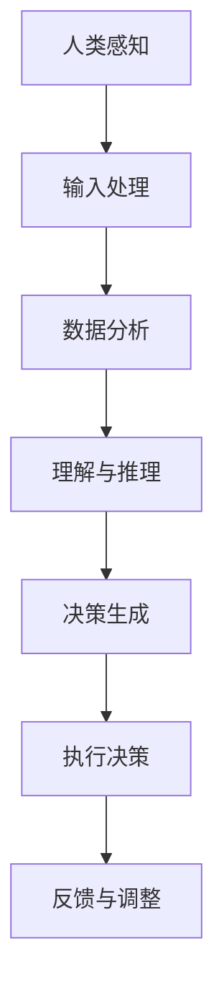

                 

关键词：人类-AI协作，人工智能，增强智慧，融合发展趋势，机遇与挑战

摘要：随着人工智能技术的迅猛发展，人类与AI的协作已经成为提升工作效率、拓展认知边界的重要方式。本文将深入探讨人类-AI协作的核心概念、发展趋势、应用场景以及面临的机遇与挑战，并预测未来人类与AI融合的发展方向。

## 1. 背景介绍

人工智能（Artificial Intelligence，AI）作为计算机科学的一个重要分支，其目标是使计算机具备人类的某些智能能力，如感知、理解、学习、推理和决策等。随着深度学习、自然语言处理、机器学习等技术的不断进步，AI的应用领域越来越广泛，从工业自动化到医疗诊断，从金融服务到智能家居，AI正在深刻改变着人类社会的各个方面。

人类-AI协作是指人类与人工智能系统共同完成某项任务的过程，这种协作不仅能够发挥人类的创造力、直觉和情感，还能利用AI的强大计算能力和数据分析能力，实现高效的决策和执行。在当今时代，人类-AI协作已经成为提高生产效率、优化决策过程、增强创新能力的重要手段。

## 2. 核心概念与联系

### 2.1 人工智能与人类智慧的关系

人工智能与人类智慧之间存在密切的联系。人类智慧包括感知、理解、推理、创造等多方面的能力，而人工智能则通过模拟和增强这些能力来辅助人类工作。例如，自然语言处理技术使得AI能够理解人类语言，从而实现人机对话；机器学习算法则能够通过数据分析识别模式和规律，辅助人类进行决策。

### 2.2 人类-AI协作的架构

人类-AI协作的架构通常包括以下几个部分：

- **感知模块**：接收外部信息，如视觉、听觉等。
- **理解模块**：对感知到的信息进行分析和处理，理解信息的含义。
- **决策模块**：基于理解模块提供的信息，生成决策。
- **执行模块**：执行决策，完成具体的任务。

下面是一个使用Mermaid绘制的简单流程图，展示了人类-AI协作的基本架构：



## 3. 核心算法原理 & 具体操作步骤

### 3.1 算法原理概述

人类-AI协作的核心算法通常是基于机器学习和深度学习技术。这些算法通过训练大量数据来学习模式，然后利用这些模式进行预测和决策。主要的算法包括：

- **监督学习**：通过已知数据的输入输出关系进行学习，然后对新数据进行预测。
- **无监督学习**：在没有已知输出标签的情况下，通过数据的内在结构和关系进行学习。
- **强化学习**：通过与环境的交互，学习在特定情况下采取最优行动的策略。

### 3.2 算法步骤详解

1. **数据收集与预处理**：收集相关的数据，并进行清洗、标准化等预处理操作。
2. **模型选择**：根据任务需求和数据特征，选择合适的机器学习模型。
3. **模型训练**：使用预处理后的数据训练模型，调整模型的参数，使其达到最优性能。
4. **模型评估**：使用验证集或测试集评估模型的性能，确保其准确性和可靠性。
5. **模型部署**：将训练好的模型部署到实际应用场景中，进行实时决策和执行。

### 3.3 算法优缺点

- **优点**：能够处理大规模数据，提高决策效率，降低人力成本。
- **缺点**：需要大量的训练数据，模型的泛化能力有限，可能存在过拟合现象。

### 3.4 算法应用领域

人类-AI协作算法广泛应用于各个领域，如：

- **金融**：风险控制、投资决策、量化交易等。
- **医疗**：疾病诊断、治疗方案推荐、药物研发等。
- **工业**：生产流程优化、设备故障预测、供应链管理等。
- **教育**：个性化学习、学习效果评估、智能辅导等。

## 4. 数学模型和公式 & 详细讲解 & 举例说明

### 4.1 数学模型构建

人类-AI协作的数学模型通常基于以下核心概念：

- **概率论与统计学**：用于数据分析和模式识别。
- **优化理论**：用于模型参数的调整和优化。
- **控制理论**：用于决策生成和执行。

### 4.2 公式推导过程

以监督学习为例，假设我们有一个输入特征向量 $X$ 和对应的标签 $Y$，我们的目标是找到一个函数 $f(X)$ 来预测标签。常用的损失函数是均方误差（MSE），其公式为：

$$
MSE = \frac{1}{m}\sum_{i=1}^{m}(f(X^{(i)}) - Y^{(i)})^2
$$

其中 $m$ 是样本数量。

为了最小化损失函数，我们通常使用梯度下降法进行优化，其迭代公式为：

$$
\theta_{j} = \theta_{j} - \alpha \frac{\partial}{\partial \theta_{j}}MSE
$$

其中 $\theta$ 是模型参数，$\alpha$ 是学习率。

### 4.3 案例分析与讲解

假设我们要预测股票价格，输入特征包括历史价格、成交量、宏观经济指标等。我们使用线性回归模型进行预测，损失函数为MSE。通过训练数据集训练模型，并调整学习率和迭代次数，最终得到最优的模型参数。

使用训练集数据进行预测，得到预测价格，并与实际价格进行比较，计算MSE。根据MSE的值调整学习率和迭代次数，直到达到满意的预测性能。

## 5. 项目实践：代码实例和详细解释说明

### 5.1 开发环境搭建

首先，我们需要搭建一个Python开发环境，安装必要的库，如NumPy、Pandas、Scikit-learn等。

```python
!pip install numpy pandas scikit-learn
```

### 5.2 源代码详细实现

以下是一个简单的线性回归模型的实现：

```python
import numpy as np
import pandas as pd
from sklearn.linear_model import LinearRegression
from sklearn.model_selection import train_test_split

# 数据加载与预处理
data = pd.read_csv('stock_data.csv')
X = data[['historical_price', 'volume', 'macro_economic_index']]
y = data['actual_price']

# 数据分割
X_train, X_test, y_train, y_test = train_test_split(X, y, test_size=0.2, random_state=42)

# 模型训练
model = LinearRegression()
model.fit(X_train, y_train)

# 模型评估
predictions = model.predict(X_test)
mse = np.mean((predictions - y_test) ** 2)
print(f'MSE: {mse}')

# 模型部署
print(f'Predicted Price: {model.predict(np.array([new_data]))}')
```

### 5.3 代码解读与分析

- **数据加载与预处理**：读取股票数据，提取输入特征和标签。
- **数据分割**：将数据分为训练集和测试集。
- **模型训练**：使用训练集数据训练线性回归模型。
- **模型评估**：使用测试集数据评估模型性能，计算MSE。
- **模型部署**：使用训练好的模型进行价格预测。

### 5.4 运行结果展示

运行上述代码，我们将得到MSE的值以及预测的价格。根据MSE的值，我们可以判断模型的预测性能。如果MSE较低，说明模型具有良好的预测能力。

## 6. 实际应用场景

人类-AI协作在实际应用中具有广泛的应用前景，以下是一些具体的场景：

- **智能客服**：利用自然语言处理技术，AI能够与客户进行智能对话，提供高效的客户服务。
- **医疗诊断**：AI可以帮助医生进行疾病诊断，提高诊断的准确性和效率。
- **智能交通**：通过数据分析和预测，AI可以优化交通信号控制，减少交通拥堵。
- **教育**：AI可以为学生提供个性化的学习计划和辅导，提高学习效果。

## 7. 未来应用展望

随着人工智能技术的不断进步，人类-AI协作将在更多领域得到应用。未来，人类与AI的协作将更加紧密，形成一种新的工作模式。以下是未来应用的一些展望：

- **智慧城市**：利用AI技术实现城市资源的优化配置，提高城市管理效率。
- **智能制造**：AI将深度参与到生产制造过程中，实现智能生产、智能检测和智能维护。
- **个性化服务**：AI可以根据用户的行为和偏好，提供个性化的产品和服务。
- **虚拟现实与增强现实**：AI将为虚拟现实和增强现实提供更加真实和丰富的体验。

## 8. 工具和资源推荐

### 8.1 学习资源推荐

- 《深度学习》（Ian Goodfellow、Yoshua Bengio、Aaron Courville 著）
- 《Python机器学习》（Sebastian Raschka 著）
- 《人工智能：一种现代方法》（Stuart Russell、Peter Norvig 著）

### 8.2 开发工具推荐

- Jupyter Notebook：用于数据分析和模型训练。
- TensorFlow：用于构建和训练深度学习模型。
- Keras：用于简化深度学习模型的构建。

### 8.3 相关论文推荐

- "Deep Learning"（Ian Goodfellow et al.）
- "A Theoretical Framework for Predictive Analytics"（Anders Krogh、Søren Holdt Jensen）
- "Deep Neural Networks for Speech Recognition"（Dan Povey et al.）

## 9. 总结：未来发展趋势与挑战

### 9.1 研究成果总结

人类-AI协作技术在过去几十年中取得了显著的进展，尤其是在机器学习、深度学习等领域。通过大量的数据和强大的计算能力，AI已经在许多领域展示了其卓越的性能。

### 9.2 未来发展趋势

- **更紧密的协作**：未来，人类与AI的协作将更加紧密，AI将更好地理解人类的需求，提供个性化的服务。
- **跨学科的融合**：人工智能将与其他学科，如生物学、心理学、经济学等，进行深度融合，推动新的科学发现和技术创新。
- **伦理与法律问题**：随着AI技术的发展，相关的伦理和法律问题也将日益突出，需要建立相应的规范和标准。

### 9.3 面临的挑战

- **数据隐私**：如何保护用户数据的安全和隐私，是AI发展面临的重要挑战。
- **算法透明度**：如何提高算法的透明度，使其能够被用户理解和监督，是AI发展的关键问题。
- **技术标准化**：如何建立统一的技术标准和规范，以确保AI系统的互操作性和兼容性，是AI发展的重要方向。

### 9.4 研究展望

在未来，人类-AI协作将朝着更加智能化、人性化的方向发展。通过不断的科学研究和技术创新，人类将能够更好地利用AI技术，提高工作效率，提升生活质量。

## 10. 附录：常见问题与解答

### 10.1 什么是人类-AI协作？

人类-AI协作是指人类与人工智能系统共同完成某项任务的过程，利用人类的创造力和情感，以及AI的计算能力和数据分析能力，实现更高效的决策和执行。

### 10.2 人类-AI协作有哪些优点？

人类-AI协作的优点包括：提高工作效率、降低人力成本、增强决策能力、拓展认知边界等。

### 10.3 人类-AI协作面临哪些挑战？

人类-AI协作面临的主要挑战包括：数据隐私、算法透明度、技术标准化等。

### 10.4 人类-AI协作的未来发展方向是什么？

人类-AI协作的未来发展方向包括：更紧密的协作、跨学科的融合、伦理与法律问题的解决等。

### 10.5 如何开始学习人类-AI协作？

可以阅读相关书籍，如《深度学习》、《Python机器学习》等，同时使用Jupyter Notebook、TensorFlow等工具进行实践。

---

作者：禅与计算机程序设计艺术 / Zen and the Art of Computer Programming

在结束之前，我们再次回顾一下本文的主要内容：

- 我们首先介绍了人类-AI协作的背景和重要性。
- 接着详细讲解了人类-AI协作的核心概念、架构和算法原理。
- 然后通过一个简单的线性回归模型实例，展示了如何进行项目实践。
- 在实际应用场景中，我们探讨了人类-AI协作在各个领域的应用。
- 最后，我们展望了未来的发展趋势，并推荐了一些学习资源和工具。

希望这篇文章能够为读者提供对人类-AI协作的深入理解和实践指导。让我们一起期待未来人类与AI更加紧密的协作，共同创造更美好的未来。

