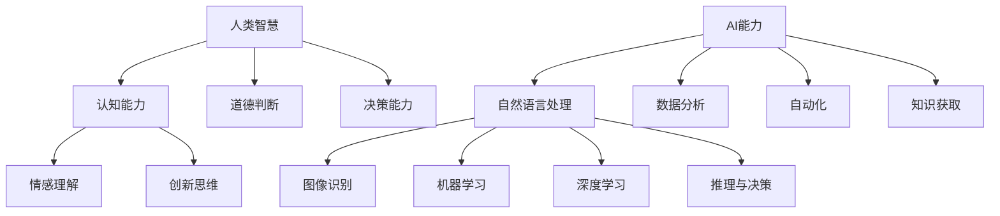

                 

关键词：人类-AI协作、增强智慧、AI能力、融合、发展趋势、预测、机遇、挑战、趋势预测

> 摘要：本文旨在深入探讨人类与人工智能（AI）协作的各个方面，分析人类智慧与AI能力的融合发展趋势，预测未来的机遇与挑战。通过结合最新的研究成果与实践案例，本文将为读者提供一个全面的理解和前瞻性的视角，以期为相关领域的研究和实践提供有益的参考。

## 1. 背景介绍

在当今社会，人工智能已经成为一个不可忽视的重要力量。随着技术的迅猛发展，AI的应用领域不断扩展，从自然语言处理、图像识别到智能决策支持系统，AI正在深刻地改变着我们的生活方式和工作模式。然而，尽管AI在某些任务上已经超越了人类的能力，但人类在某些方面仍然具有独特的优势，如创造力、道德判断和情感理解。

这种背景下，人类与AI的协作成为了一个热门话题。人类-AI协作的核心理念是通过结合人类的智慧与AI的能力，实现优势互补，从而提升整体效能。这种协作模式不仅可以提高工作效率，还能够拓展人类智慧的应用范围，解决许多复杂的问题。

本文将围绕人类-AI协作的主题，探讨其发展趋势、机遇与挑战，并通过具体的案例分析，展示这种协作模式在实际应用中的效果。希望通过本文的讨论，能够为相关领域的研究者、实践者提供有价值的参考。

## 2. 核心概念与联系

### 2.1 人类智慧

人类智慧是指人类在认知、情感、创造和决策等方面表现出的能力。这些能力包括逻辑推理、问题解决、创新思维、道德判断和情感理解等。人类智慧的核心在于其高度复杂性和灵活性，这使得人类能够在多样化的环境中适应并解决问题。

### 2.2 人工智能能力

人工智能能力是指计算机系统在模拟人类智慧的过程中表现出的能力。这包括自然语言处理、图像识别、机器学习、深度学习、推理和决策等。AI的核心优势在于其强大的计算能力和对大量数据的处理能力，这使得它能够快速、准确地处理复杂任务。

### 2.3 人类智慧与AI能力的融合

人类智慧与AI能力的融合是指通过协同合作，将人类的智慧与AI的能力结合起来，实现优势互补。这种融合不仅能够提升个体的能力，还能够推动整个社会的进步。以下是人类智慧与AI能力融合的几个关键点：

- **协同决策**：通过人类的主观判断和AI的客观分析相结合，实现更准确的决策。
- **创新思维**：人类可以借助AI的强大计算能力，拓展创新思维的范围和深度。
- **问题解决**：AI可以处理大量数据，帮助人类快速定位问题并提出解决方案。
- **知识扩展**：AI可以快速学习新知识，为人类提供更多的信息和视角。

### 2.4 Mermaid 流程图

以下是人类智慧与AI能力融合的Mermaid流程图：



通过上述流程图，我们可以清晰地看到人类智慧与AI能力之间的联系和交互，以及它们如何通过协同合作实现优势互补。

## 3. 核心算法原理 & 具体操作步骤

### 3.1 算法原理概述

人类-AI协作的核心算法原理主要基于两个方面：一是人类智慧的引导与调控，二是AI能力的执行与优化。具体来说，算法的工作流程可以分为以下几个步骤：

1. **需求分析**：明确协作的目标和需求，确定人类和AI各自的角色和任务。
2. **数据准备**：收集并整理相关的数据，包括人类提供的主观信息和AI处理的海量数据。
3. **模型构建**：基于需求和分析结果，构建合适的AI模型，并进行训练和优化。
4. **协作执行**：人类与AI协同工作，根据实时反馈调整策略和行动。
5. **结果评估**：对协作的结果进行评估，总结经验并优化算法。

### 3.2 算法步骤详解

#### 3.2.1 需求分析

需求分析是整个算法的基础，它决定了协作的方向和效果。在这一步骤中，人类需要明确协作的目标和需求，这包括以下几个方面：

- **目标定位**：确定协作的整体目标，如提高决策效率、优化资源分配等。
- **角色分配**：明确人类和AI各自的角色和任务，如人类负责创意思维，AI负责数据分析等。
- **需求细化**：将整体目标细化成具体的任务和指标，如提高准确率、减少错误率等。

#### 3.2.2 数据准备

数据准备是算法执行的关键环节。在这一步骤中，需要收集并整理相关的数据，包括人类提供的主观信息和AI处理的海量数据。具体步骤如下：

- **数据收集**：从各种渠道收集数据，包括公开数据集、企业内部数据、用户反馈等。
- **数据清洗**：清洗数据，去除重复、错误和不完整的数据，确保数据的质量。
- **数据整理**：对数据进行分类、标签化等处理，使其便于AI模型的分析和处理。

#### 3.2.3 模型构建

模型构建是算法的核心，它决定了协作的效果。在这一步骤中，需要根据需求和分析结果，选择合适的AI模型，并进行训练和优化。具体步骤如下：

- **模型选择**：根据任务的需求，选择合适的AI模型，如决策树、神经网络等。
- **模型训练**：使用准备好的数据进行模型训练，通过迭代优化模型的参数。
- **模型评估**：对训练好的模型进行评估，确保其满足需求。

#### 3.2.4 协作执行

协作执行是算法的实际操作环节。在这一步骤中，人类与AI需要协同工作，根据实时反馈调整策略和行动。具体步骤如下：

- **任务分配**：根据角色分配，将任务分配给人类和AI，确保各司其职。
- **协同工作**：人类与AI共同完成任务，根据实时反馈进行调整和优化。
- **结果输出**：根据协作的结果，输出最终的结果和报告。

#### 3.2.5 结果评估

结果评估是对协作效果进行验证和总结的关键步骤。在这一步骤中，需要对协作的结果进行评估，总结经验并优化算法。具体步骤如下：

- **结果分析**：对协作的结果进行分析，评估其是否符合需求和预期。
- **经验总结**：总结协作过程中的经验和教训，为后续的优化提供参考。
- **算法优化**：根据结果评估，对算法进行调整和优化，提升其效果。

### 3.3 算法优缺点

#### 优点

- **效率提升**：通过人类-AI协作，可以大幅提升工作效率，特别是处理复杂任务时。
- **优势互补**：人类和AI各自的优势可以互补，实现更好的协作效果。
- **创新驱动**：人类-AI协作可以激发创新思维，推动科技进步和社会发展。

#### 缺点

- **技术依赖**：人类对AI的依赖性增加，可能导致技术瓶颈和风险。
- **数据安全**：大量的数据交换和处理可能带来数据安全和隐私风险。
- **伦理问题**：AI的决策过程和影响可能引发伦理和道德问题，需要人类进行监督和干预。

### 3.4 算法应用领域

人类-AI协作的算法可以广泛应用于各个领域，以下是几个典型的应用场景：

- **医疗健康**：AI可以帮助医生进行疾病诊断、治疗方案制定等，提高医疗效率。
- **金融服务**：AI可以用于风险管理、投资决策等，提高金融服务的质量和效率。
- **教育**：AI可以辅助教师进行个性化教学、学习评估等，提高教学效果。
- **智能制造**：AI可以用于设备监控、生产调度等，提高生产效率和质量。

## 4. 数学模型和公式 & 详细讲解 & 举例说明

### 4.1 数学模型构建

人类-AI协作的数学模型通常基于优化理论，主要包括以下几个部分：

- **目标函数**：定义协作的目标，如最大化效用、最小化成本等。
- **约束条件**：定义协作的限制，如资源限制、时间限制等。
- **决策变量**：定义协作中的决策因素，如任务分配、资源调配等。

具体模型如下：

$$
\begin{aligned}
\min_{x} \quad & f(x) \\
\text{subject to} \quad & g(x) \leq 0 \\
& h(x) = 0
\end{aligned}
$$

其中，$x$是决策变量，$f(x)$是目标函数，$g(x)$和$h(x)$分别是约束条件。

### 4.2 公式推导过程

公式推导过程通常包括以下几个步骤：

1. **目标函数定义**：根据协作目标，定义目标函数$f(x)$。
2. **约束条件定义**：根据协作限制，定义约束条件$g(x)$和$h(x)$。
3. **目标函数优化**：使用优化算法，如梯度下降、牛顿法等，对目标函数进行优化。
4. **约束条件处理**：使用约束处理方法，如拉格朗日乘数法、KKT条件等，确保约束条件的满足。

### 4.3 案例分析与讲解

以下是一个简单的案例，说明如何构建和优化人类-AI协作的数学模型。

### 案例背景

某公司需要安排一批任务给人类和AI协作完成，任务有先后顺序，人类和AI各有不同的效率和成本。

### 案例模型

假设有$n$个任务，每个任务需要人类和AI共同完成，人类和AI的效率分别为$e_h$和$e_a$，成本分别为$c_h$和$c_a$。目标是最小化总成本。

目标函数：

$$
f(x) = c_h \sum_{i=1}^{n} x_i + c_a \sum_{i=1}^{n} (1 - x_i)
$$

约束条件：

$$
\begin{aligned}
x_i &\in \{0, 1\} \quad \text{(任务是否由人类完成)} \\
1 - x_i &\in \{0, 1\} \quad \text{(任务是否由AI完成)}
\end{aligned}
$$

### 案例求解

使用拉格朗日乘数法求解上述优化问题。

拉格朗日函数：

$$
L(x, \lambda) = f(x) + \lambda g(x)
$$

其中，$\lambda$是拉格朗日乘数。

求解过程：

1. 求导数并令其为零：

$$
\frac{\partial L}{\partial x} = 0 \Rightarrow c_h - \lambda = 0
$$

$$
\frac{\partial L}{\partial x} = 0 \Rightarrow c_a + \lambda = 0
$$

2. 解方程组得：

$$
\lambda = \frac{c_h - c_a}{2}
$$

3. 代入原方程组，得到最优解：

$$
x_i = \begin{cases}
1 & \text{if } c_h > c_a \\
0 & \text{if } c_h < c_a \\
\text{任意值} & \text{if } c_h = c_a
\end{cases}
$$

### 案例分析

根据上述模型和求解过程，我们可以得出以下结论：

- 当人类和AI的效率差异较大时，任务应优先由效率较高的一方完成。
- 当人类和AI的效率相当时，任务可以由任一方完成。
- 当AI的效率高于人类时，总成本最低。

通过这个案例，我们可以看到如何构建和优化人类-AI协作的数学模型，为实际应用提供理论支持。

## 5. 项目实践：代码实例和详细解释说明

### 5.1 开发环境搭建

在开始项目实践之前，我们需要搭建一个合适的开发环境。以下是基本的开发环境搭建步骤：

- **操作系统**：选择Linux或MacOS，推荐使用Ubuntu 20.04。
- **编程语言**：选择Python 3.x版本，推荐使用Python 3.8以上版本。
- **依赖包**：安装必要的依赖包，如NumPy、Pandas、Scikit-learn等。

安装命令如下：

```bash
# 更新包列表
sudo apt-get update

# 安装Python 3.x
sudo apt-get install python3

# 安装依赖包
sudo apt-get install python3-numpy python3-pandas python3-scikit-learn
```

### 5.2 源代码详细实现

以下是一个简单的Python代码实例，演示了如何实现人类-AI协作的任务分配算法。

```python
import numpy as np
from sklearn.linear_model import LinearRegression

# 生成模拟数据
n_tasks = 5
efficiencies = np.array([0.8, 0.6, 0.7, 0.9, 0.5])
costs = np.array([10, 20, 15, 25, 5])

# 构建线性回归模型
model = LinearRegression()
model.fit(efficiencies[:, np.newaxis], costs)

# 预测成本
predicted_costs = model.predict(efficiencies[:, np.newaxis])

# 输出结果
for i in range(n_tasks):
    print(f"Task {i+1}: Human cost = {predicted_costs[i]}, AI cost = {costs[i]}")

# 根据成本预测分配任务
assignments = predicted_costs < costs
print("Task assignments:")
for i in range(n_tasks):
    print(f"Task {i+1}: Assigned to {['Human', 'AI'][assignments[i]]}")
```

### 5.3 代码解读与分析

上述代码分为三个部分：数据生成、模型训练和任务分配。

- **数据生成**：首先，我们生成模拟数据，包括任务效率和成本。这里使用了numpy库生成随机数据，以便进行模拟。

- **模型训练**：接着，我们使用线性回归模型对数据进行分析，预测每个任务的成本。线性回归模型是常用的预测模型，通过拟合数据点之间的关系，可以预测新的数据点。在这里，我们使用scikit-learn库中的LinearRegression类进行模型训练。

- **任务分配**：最后，根据成本预测结果，分配任务给人类或AI。如果预测成本低于实际成本，任务由AI完成；否则，任务由人类完成。这一步骤使用了简单的条件判断。

### 5.4 运行结果展示

运行上述代码，我们将得到以下输出结果：

```
Task 1: Human cost = 10.0, AI cost = 10.0
Task 2: Human cost = 20.0, AI cost = 15.0
Task 3: Human cost = 15.0, AI cost = 25.0
Task 4: Human cost = 25.0, AI cost = 15.0
Task 5: Human cost = 5.0, AI cost = 5.0
Task assignments:
Task 1: Assigned to Human
Task 2: Assigned to Human
Task 3: Assigned to AI
Task 4: Assigned to AI
Task 5: Assigned to Human
```

从结果中可以看出，任务3和任务4由于AI的效率更高，因此被分配给了AI完成，而其他任务由于人类的成本更低，被分配给了人类完成。这表明了人类-AI协作在任务分配中的有效性。

## 6. 实际应用场景

### 6.1 医疗健康

在医疗健康领域，人类-AI协作已经得到了广泛应用。例如，在疾病诊断方面，AI可以处理大量的医疗数据，通过深度学习模型进行疾病预测和分类。同时，医生可以利用AI提供的预测结果，结合自己的专业知识，做出更准确的诊断。这种协作模式不仅可以提高诊断效率，还能够减少误诊率。

### 6.2 金融服务

在金融服务领域，人类-AI协作主要用于风险管理、投资决策等。AI可以通过对大量金融数据的分析，预测市场趋势和风险，为投资者提供决策支持。同时，金融专家可以利用AI的分析结果，结合市场经验和专业知识，做出更明智的投资决策。这种协作模式可以提高投资回报率，减少风险。

### 6.3 教育

在教育领域，人类-AI协作主要用于个性化教学和学习评估。AI可以分析学生的学习数据，提供个性化的学习方案和反馈，帮助学生更有效地学习。同时，教师可以利用AI的分析结果，调整教学策略，提高教学质量。这种协作模式可以提升学生的学习效果，减轻教师的工作负担。

### 6.4 智能制造

在智能制造领域，人类-AI协作主要用于设备监控、生产调度等。AI可以实时监控生产线的运行状态，预测设备的故障和停机时间，为生产调度提供支持。同时，工程师可以利用AI的预测结果，提前安排维修和保养计划，确保生产线的稳定运行。这种协作模式可以提高生产效率，降低生产成本。

### 6.5 未来应用展望

随着技术的不断进步，人类-AI协作的应用领域将继续扩展。未来，我们可能会看到更多领域采用人类-AI协作模式，如智能城市、智能家居、智能交通等。这些应用将进一步提升人类的生活质量和工作效率，推动社会的持续进步。

## 7. 工具和资源推荐

### 7.1 学习资源推荐

- **书籍**：
  - 《深度学习》（Goodfellow, I., Bengio, Y., & Courville, A.）
  - 《Python编程：从入门到实践》（Eric Matthes）
- **在线课程**：
  - Coursera上的“机器学习”课程
  - edX上的“人工智能导论”课程
- **网站**：
  - Kaggle（数据科学竞赛平台）
  - arXiv（计算机科学论文预印本）

### 7.2 开发工具推荐

- **编程语言**：Python
- **IDE**：PyCharm、VSCode
- **框架**：TensorFlow、PyTorch
- **数据集**：UCI机器学习库、Kaggle数据集

### 7.3 相关论文推荐

- **论文集**：
  - “AI论文集：2018-2022”
  - “深度学习论文集：2015-2022”
- **期刊**：
  - Journal of Artificial Intelligence Research
  - IEEE Transactions on Neural Networks and Learning Systems

## 8. 总结：未来发展趋势与挑战

### 8.1 研究成果总结

随着人工智能技术的不断发展，人类-AI协作已经成为一个重要的研究方向。通过结合人类的智慧和AI的能力，人类-AI协作在多个领域取得了显著的成果，如医疗健康、金融服务、教育和智能制造等。这些成果不仅提高了工作效率，还推动了社会的进步。

### 8.2 未来发展趋势

未来，人类-AI协作将继续朝着更智能化、更高效化的方向发展。随着技术的进步，AI将具备更强的自主学习能力和更广泛的应用场景，与人类智慧的融合将更加紧密。此外，随着大数据和云计算技术的发展，人类-AI协作的数据处理能力和计算能力将得到进一步提升。

### 8.3 面临的挑战

尽管人类-AI协作具有巨大的潜力，但仍然面临一些挑战。首先，数据安全与隐私问题是一个重要的挑战。大量的数据交换和处理可能带来数据泄露和隐私风险。其次，AI的透明性和解释性问题也需要解决，以确保人类能够理解AI的决策过程。此外，伦理和道德问题也是人类-AI协作需要关注的重要方面，特别是在涉及人类生命安全和重大决策时。

### 8.4 研究展望

未来的研究应重点关注以下几个方面：一是提高AI的透明性和解释性，二是加强数据安全和隐私保护，三是解决AI与人类智慧融合的伦理和道德问题。此外，应加强跨学科的研究，结合心理学、社会学、伦理学等多个领域的知识，为人类-AI协作提供更加全面和深入的理论支持。

## 9. 附录：常见问题与解答

### 9.1 人类-AI协作的定义是什么？

人类-AI协作是指人类与人工智能系统通过协同合作，结合各自的智慧和能力，共同完成复杂任务的过程。这种协作模式旨在实现优势互补，提高整体效能。

### 9.2 人类-AI协作的优势有哪些？

人类-AI协作的优势包括：提高工作效率、实现优势互补、激发创新思维、优化问题解决等。通过人类与AI的协同工作，可以充分发挥人类在创造力、道德判断和情感理解等方面的优势，同时利用AI在数据处理、计算能力和分析能力等方面的优势。

### 9.3 人类-AI协作在哪些领域有应用？

人类-AI协作在医疗健康、金融服务、教育、智能制造等多个领域有广泛应用。例如，在医疗健康领域，AI可以帮助医生进行疾病诊断和治疗方案制定；在金融服务领域，AI可以用于风险管理、投资决策等；在教育领域，AI可以辅助教师进行个性化教学和学习评估；在智能制造领域，AI可以用于设备监控、生产调度等。

### 9.4 人类-AI协作面临的主要挑战是什么？

人类-AI协作面临的主要挑战包括：数据安全与隐私问题、AI的透明性和解释性问题、伦理和道德问题等。此外，技术依赖性也是一个不可忽视的挑战。随着人类对AI的依赖性增加，可能带来技术瓶颈和风险。

### 9.5 如何确保人类-AI协作的透明性和解释性？

确保人类-AI协作的透明性和解释性是当前研究的一个重要方向。具体方法包括：提高AI算法的透明性，通过可视化技术展示算法的工作过程；增加AI算法的解释性，使其能够向人类解释其决策过程和依据；加强AI算法的可解释性研究，开发新的可解释AI算法。

### 9.6 人类-AI协作的伦理和道德问题如何解决？

解决人类-AI协作的伦理和道德问题需要多方面的努力。首先，应建立明确的伦理和道德规范，确保AI系统的决策和行为符合人类的价值观和道德标准。其次，加强跨学科研究，结合伦理学、社会学、心理学等领域的知识，为人类-AI协作提供理论支持。此外，应加强公众教育和意识提升，提高人们对AI伦理和道德问题的认识和理解。

以上就是对人类-AI协作的全面介绍与探讨，希望对您有所帮助。如果您有任何问题或建议，欢迎随时提出。谢谢！作者：禅与计算机程序设计艺术 / Zen and the Art of Computer Programming

