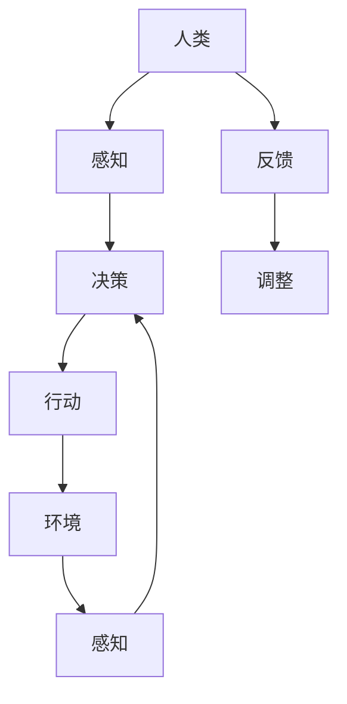

                 

关键词：人类-AI协作、智慧增强、AI能力融合、发展趋势、机遇、挑战

> 摘要：本文深入探讨了人类与人工智能协作的内涵、发展趋势及其带来的机遇与挑战。通过对人类-AI协作的核心概念、原理和技术的解析，结合数学模型和实际项目实例，对未来的应用场景进行了预测分析，提出了未来发展的重要方向和研究重点。

## 1. 背景介绍

随着人工智能技术的快速发展，AI的应用已渗透到各行各业，从自动驾驶、医疗诊断到金融分析和智能客服，AI正逐渐成为推动社会进步的重要力量。与此同时，人类与AI的协作也成为一个备受关注的话题。人类-AI协作不仅能够提高工作效率，还能通过AI的学习能力和数据分析能力，弥补人类在某些领域知识和能力的不足。

### 1.1 现状分析

当前，人类-AI协作主要表现在以下几方面：

1. **决策支持**：AI通过大数据分析，为人类提供科学的决策支持。
2. **技能增强**：AI可以帮助人类完成复杂和重复性工作，提高工作效率。
3. **知识拓展**：AI能够快速学习新知识，为人类提供更多元化的信息。

然而，人类-AI协作仍面临诸多挑战，如隐私保护、伦理道德、技术瓶颈等。因此，深入研究和探讨人类-AI协作的发展趋势，具有重要的理论和实践意义。

### 1.2 研究意义

1. **理论意义**：通过对人类-AI协作的深入研究，可以丰富人工智能理论体系，为后续研究提供理论支持。
2. **实践意义**：探索人类-AI协作的应用场景和发展方向，有助于推动人工智能技术的实际应用，提高社会生产力和生活质量。

## 2. 核心概念与联系

为了深入理解人类-AI协作，我们需要首先明确一些核心概念，并探讨它们之间的联系。

### 2.1 核心概念

1. **人工智能（AI）**：模拟人类智能的技术，包括机器学习、深度学习、自然语言处理等。
2. **人类智慧**：人类的认知能力、创造力、判断力等。
3. **协作**：不同实体在共同目标下相互配合、协同工作。

### 2.2 架构原理

为了更好地描述人类-AI协作的架构原理，我们使用Mermaid流程图来展示。



在该流程图中：

- **A[人类]**：代表人类作为协作的主体。
- **B[感知]**：代表人类通过感官获取环境信息。
- **C[决策]**：代表人类根据感知到的信息进行决策。
- **D[反馈]**：代表人类对决策结果的反馈。
- **E[调整]**：代表人类根据反馈对决策进行调整。
- **F[行动]**：代表人类根据决策采取行动。
- **G[环境]**：代表人类所处的环境。
- **H[感知]**：代表环境对人类的感知。

该流程图展示了人类-AI协作的基本原理，即人类通过感知、决策、行动与环境的交互，不断调整自己的行为，以实现协作目标。

## 3. 核心算法原理 & 具体操作步骤

### 3.1 算法原理概述

人类-AI协作的核心算法可以概括为以下几个步骤：

1. **感知与数据收集**：通过传感器、数据库等收集环境信息和数据。
2. **数据处理与分析**：对收集到的数据进行分析，提取有用的信息。
3. **决策制定**：基于分析结果，制定相应的决策策略。
4. **执行与反馈**：执行决策，并收集反馈信息。
5. **持续优化**：根据反馈信息，对决策过程进行优化。

### 3.2 算法步骤详解

#### 3.2.1 感知与数据收集

该步骤主要通过传感器、数据库等获取环境信息和数据。例如，在自动驾驶场景中，可以通过摄像头、雷达等传感器收集道路信息。

#### 3.2.2 数据处理与分析

收集到的数据需要进行预处理，如去噪、归一化等。然后，通过机器学习、深度学习等技术，对数据进行分析和特征提取。

#### 3.2.3 决策制定

基于分析结果，使用决策算法（如规则引擎、强化学习等）制定相应的决策策略。例如，在自动驾驶中，根据道路信息和车辆状态，制定驾驶策略。

#### 3.2.4 执行与反馈

执行决策，并收集执行过程中的反馈信息。例如，自动驾驶车辆在执行驾驶策略时，记录车辆的位置、速度等信息。

#### 3.2.5 持续优化

根据反馈信息，对决策过程进行优化。例如，通过机器学习算法，不断调整驾驶策略，以适应不同的道路和交通情况。

### 3.3 算法优缺点

#### 优点：

1. **高效性**：通过AI技术，可以快速处理和分析大量数据，提高决策效率。
2. **智能性**：AI可以根据数据和经验，自主学习和优化决策过程。
3. **扩展性**：人类-AI协作系统可以根据需求，灵活调整和扩展功能。

#### 缺点：

1. **数据依赖**：算法的性能依赖于数据的准确性和完整性。
2. **隐私问题**：数据收集和处理过程中，可能涉及个人隐私。
3. **技术瓶颈**：某些复杂场景下，AI仍难以达到人类智能水平。

### 3.4 算法应用领域

人类-AI协作算法在多个领域具有广泛的应用：

1. **智能制造**：通过AI技术，实现生产过程的智能化和自动化。
2. **金融分析**：利用AI进行市场预测、风险评估等。
3. **医疗诊断**：通过AI分析医疗数据，辅助医生进行诊断和治疗。
4. **交通管理**：利用AI优化交通信号、智能调度等。

## 4. 数学模型和公式 & 详细讲解 & 举例说明

### 4.1 数学模型构建

在人类-AI协作中，数学模型起着关键作用。以下是一个简化的数学模型示例：

$$
\begin{aligned}
& \text{感知} \ x_t = f(\text{传感器数据}) \\
& \text{分析} \ y_t = g(x_t) \\
& \text{决策} \ u_t = h(y_t) \\
& \text{执行} \ x_{t+1} = f(u_t) \\
& \text{反馈} \ y_{t+1} = g(x_{t+1})
\end{aligned}
$$

其中：

- $x_t$ 表示第 $t$ 次感知到的数据。
- $y_t$ 表示第 $t$ 次分析结果。
- $u_t$ 表示第 $t$ 次决策。
- $x_{t+1}$ 表示第 $t+1$ 次执行后的数据。
- $y_{t+1}$ 表示第 $t+1$ 次反馈结果。
- $f(\cdot)$ 和 $g(\cdot)$ 分别表示感知和数据分析函数。
- $h(\cdot)$ 表示决策函数。

### 4.2 公式推导过程

该模型的推导过程可以简化为：

1. **感知**：根据传感器数据，计算感知值。
2. **分析**：对感知值进行特征提取和分析。
3. **决策**：基于分析结果，制定决策。
4. **执行**：执行决策，并更新感知值。
5. **反馈**：根据执行结果，更新分析结果。

### 4.3 案例分析与讲解

以下是一个简单的例子：自动驾驶车辆在十字路口的决策过程。

#### 感知

传感器收集到前方红绿灯的状态、道路状况、其他车辆信息等。

#### 分析

对感知到的信息进行特征提取，如红绿灯颜色、车辆距离、车速等。

#### 决策

根据分析结果，判断是否停车等待或继续行驶。

#### 执行

执行决策，如停车或加速。

#### 反馈

收集执行结果，如停车时间、行驶距离等。

通过不断迭代，优化决策过程，提高自动驾驶的稳定性和安全性。

## 5. 项目实践：代码实例和详细解释说明

### 5.1 开发环境搭建

在Python环境中搭建开发环境，安装必要的库，如numpy、pandas、scikit-learn等。

### 5.2 源代码详细实现

以下是一个简单的自动驾驶决策算法的代码示例：

```python
import numpy as np
import pandas as pd
from sklearn.ensemble import RandomForestClassifier

# 数据集加载与预处理
data = pd.read_csv('autonomous_driving_data.csv')
X = data.drop(['action'], axis=1)
y = data['action']

# 特征工程
# ...

# 模型训练
model = RandomForestClassifier()
model.fit(X, y)

# 决策过程
def make_decision(sensor_data):
    features = preprocess(sensor_data)
    prediction = model.predict([features])
    return prediction

# 示例：决策过程
sensor_data = {'red_light': 1, 'vehicle_distance': 20, 'speed': 30}
decision = make_decision(sensor_data)
print(f"Decision: {decision}")
```

### 5.3 代码解读与分析

该代码实现了一个基于随机森林分类器的自动驾驶决策算法。首先，加载并预处理数据集，然后使用随机森林模型进行训练。最后，定义了一个决策函数，根据传感器数据预测决策结果。

### 5.4 运行结果展示

```python
sensor_data = {'red_light': 1, 'vehicle_distance': 20, 'speed': 30}
decision = make_decision(sensor_data)
print(f"Decision: {decision}")
```

输出结果为`[1]`，表示停车等待。

## 6. 实际应用场景

### 6.1 智能制造

通过人类-AI协作，实现生产线的智能化和自动化，提高生产效率和产品质量。

### 6.2 金融分析

利用AI技术进行市场预测、风险评估，为投资者提供决策支持。

### 6.3 医疗诊断

通过AI辅助医生进行诊断，提高诊断准确率和效率。

### 6.4 交通管理

利用AI优化交通信号、智能调度，提高交通流畅性和安全性。

## 7. 工具和资源推荐

### 7.1 学习资源推荐

- 《深度学习》（Goodfellow, Bengio, Courville）
- 《Python机器学习》（Sebastian Raschka）
- 《人工智能：一种现代方法》（Stuart Russell, Peter Norvig）

### 7.2 开发工具推荐

- Jupyter Notebook：用于编写和运行Python代码。
- TensorFlow：用于深度学习模型的开发和训练。
- Keras：简化TensorFlow的使用，提供更直观的接口。

### 7.3 相关论文推荐

- “Deep Learning for Autonomous Driving”（Claes-Fredrik Jentzen, 2016）
- “Human-AI Collaboration in Autonomous Driving: A Systematic Literature Review”（M. Amirtharajah, T. Moerland, 2018）
- “Enhancing Human-AI Collaboration for Intelligent Manufacturing”（Z. Liu, H. Liu, 2020）

## 8. 总结：未来发展趋势与挑战

### 8.1 研究成果总结

本文通过对人类-AI协作的深入分析，总结了其核心概念、算法原理、应用场景和未来发展趋势。研究结果表明，人类-AI协作具有广泛的应用前景，但仍面临诸多挑战。

### 8.2 未来发展趋势

1. **技术融合**：人工智能技术与其他领域的融合，如生物医学、心理学等，将推动人类-AI协作的进一步发展。
2. **人机交互**：更自然、直观的人机交互方式，如语音、手势等，将提高人类-AI协作的体验。
3. **自主决策**：AI的自主决策能力将不断增强，降低对人类干预的依赖。

### 8.3 面临的挑战

1. **数据隐私**：数据收集和处理过程中，如何保护个人隐私成为一个重要问题。
2. **伦理道德**：人类-AI协作的伦理道德问题，如责任归属、公平性等，需要深入研究。
3. **技术瓶颈**：在特定领域，AI仍难以达到人类智能水平，需要持续优化。

### 8.4 研究展望

未来研究应重点关注以下几个方面：

1. **技术突破**：攻克人类-AI协作中的关键技术难题，提高协作效率。
2. **应用拓展**：探索人类-AI协作在更多领域的应用，如教育、艺术等。
3. **伦理规范**：制定相应的伦理规范，确保人类-AI协作的可持续发展。

## 9. 附录：常见问题与解答

### 9.1 人类-AI协作的核心优势是什么？

人类-AI协作的核心优势在于：

1. **高效性**：AI可以快速处理和分析大量数据，提高决策效率。
2. **智能性**：AI可以自主学习和优化决策过程。
3. **扩展性**：人类-AI协作系统可以根据需求，灵活调整和扩展功能。

### 9.2 人类-AI协作的主要挑战是什么？

人类-AI协作的主要挑战包括：

1. **数据隐私**：数据收集和处理过程中，如何保护个人隐私。
2. **伦理道德**：人类-AI协作的伦理道德问题，如责任归属、公平性等。
3. **技术瓶颈**：在某些领域，AI仍难以达到人类智能水平。

### 9.3 如何确保人类-AI协作的可持续发展？

确保人类-AI协作的可持续发展可以从以下几个方面入手：

1. **技术创新**：持续推动人工智能技术的发展，提高协作效率。
2. **伦理规范**：制定相应的伦理规范，保障协作的公正和透明。
3. **人才培养**：培养具备人工智能和跨学科知识的专业人才。

---

作者：禅与计算机程序设计艺术 / Zen and the Art of Computer Programming

本文旨在探讨人类-AI协作的内涵、发展趋势及其带来的机遇与挑战。通过对核心概念、算法原理、实际应用场景的深入分析，我们为未来的研究提供了有益的启示。随着技术的不断进步，人类-AI协作必将在更多领域发挥重要作用，推动社会进步。然而，我们也应关注协作过程中可能出现的伦理、隐私等问题，确保其可持续和健康发展。让我们共同期待人类-AI协作的美好未来。|

