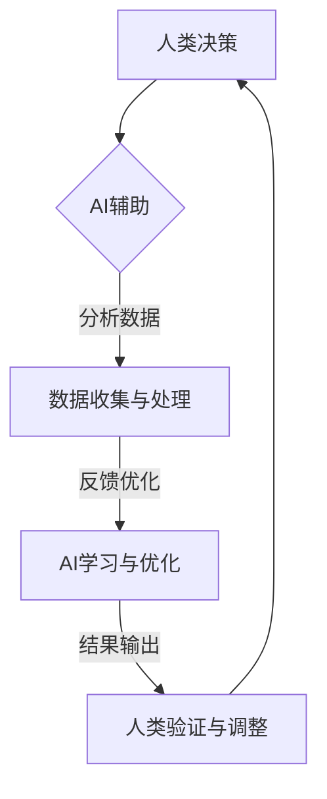

                 

关键词：人工智能、人类-AI协作、智慧增强、AI能力融合、发展趋势预测

摘要：本文深入探讨了人类与人工智能（AI）之间的协作模式，分析了增强人类智慧与AI能力融合的趋势和发展机遇。通过阐述核心概念、算法原理、数学模型、项目实践，以及未来应用场景，本文旨在为读者提供一幅全面、清晰的未来AI与人类协作的蓝图，并对其面临的挑战和发展前景进行预测和展望。

## 1. 背景介绍

人工智能（Artificial Intelligence，AI）作为计算机科学的重要分支，近年来取得了飞速发展。从早期的专家系统到深度学习，再到当前的自然语言处理、计算机视觉等领域的突破，AI已经渗透到各行各业，极大地改变了人类的生产和生活方式。与此同时，随着AI技术的不断进步，人类与AI之间的协作模式也发生了深刻变化。人类-AI协作不仅提高了工作效率，还激发了新的创新和思维模式。

本文旨在探讨人类与AI协作的现状和未来趋势，分析AI能力与人类智慧的融合所带来的机遇和挑战，为相关领域的研究和实践提供参考。

## 2. 核心概念与联系

### 2.1. 人工智能

人工智能是指通过计算机程序实现人类智能的模拟和扩展，包括知识表示、推理、学习、感知、理解、决策等能力。

### 2.2. 人类智慧

人类智慧是指人类在认知、思考、创新、解决问题等方面的能力，包括逻辑思维、直觉思维、创造思维等。

### 2.3. AI能力与人类智慧的融合

AI能力与人类智慧的融合是指通过AI技术增强人类智慧，使人类能够在更复杂的情境下做出更准确的决策，提高工作效率和创新能力。

### 2.4. 人类-AI协作

人类-AI协作是指人类与AI系统通过信息交互和任务分工，共同完成复杂任务的过程。

### 2.5. Mermaid 流程图

下面是描述人类-AI协作流程的Mermaid流程图：



## 3. 核心算法原理 & 具体操作步骤

### 3.1. 算法原理概述

人类-AI协作的核心在于AI对人类智慧的增强，具体算法包括数据收集与处理、AI学习与优化、结果输出与反馈等步骤。以下是这些步骤的简要概述：

1. **数据收集与处理**：通过传感器、数据库等渠道收集数据，并进行预处理，如去噪、归一化等。
2. **AI学习与优化**：利用机器学习算法对数据进行训练，不断优化模型，提高决策能力。
3. **结果输出与反馈**：将AI系统的决策结果输出给人类，并根据人类的反馈进行模型优化。

### 3.2. 算法步骤详解

1. **数据收集与处理**
   - 数据收集：通过传感器、数据库等渠道获取数据。
   - 数据预处理：去除噪声、缺失值，进行数据归一化等。

2. **AI学习与优化**
   - 数据划分：将数据集划分为训练集、验证集和测试集。
   - 模型选择：根据任务需求选择合适的机器学习模型。
   - 模型训练：使用训练集对模型进行训练，调整模型参数。
   - 模型验证：使用验证集评估模型性能，进行超参数调整。
   - 模型测试：使用测试集评估模型在未知数据上的性能。

3. **结果输出与反馈**
   - 结果输出：将模型决策结果输出给人类。
   - 反馈优化：根据人类反馈调整模型，提高决策准确性。

### 3.3. 算法优缺点

**优点**：
- **高效性**：AI可以处理大量数据，提高决策速度。
- **准确性**：AI系统可以不断优化模型，提高决策准确性。
- **扩展性**：AI系统可以应用于各种领域，具有广泛的应用前景。

**缺点**：
- **依赖性**：人类过度依赖AI可能导致自身能力的退化。
- **隐私问题**：AI系统在处理数据时可能涉及个人隐私。

### 3.4. 算法应用领域

- **医疗诊断**：利用AI系统进行疾病预测和诊断。
- **金融分析**：利用AI系统进行风险评估和投资决策。
- **智能制造**：利用AI系统进行生产优化和故障预测。
- **智能交通**：利用AI系统进行交通流量预测和路况分析。

## 4. 数学模型和公式 & 详细讲解 & 举例说明

### 4.1. 数学模型构建

人类-AI协作的数学模型主要包括以下几个部分：

1. **数据模型**：描述数据的分布、特征等。
2. **决策模型**：基于数据模型，进行决策的过程。
3. **反馈模型**：根据决策结果，进行模型优化。

### 4.2. 公式推导过程

假设我们有以下数据模型：

$$
X = \{x_1, x_2, ..., x_n\}
$$

其中，$x_i$表示第$i$个数据点。我们使用以下决策模型进行决策：

$$
y = f(X)
$$

其中，$f(X)$表示决策函数。根据反馈模型，我们进行模型优化：

$$
f'(X) = f(X) + \alpha \cdot (y - f(X))
$$

其中，$\alpha$表示学习率，用于调节模型优化程度。

### 4.3. 案例分析与讲解

假设我们有一个智能交通系统，需要预测某个路段的交通流量。我们收集了该路段过去一年的交通数据，包括每天每个小时的车辆数量。首先，我们使用数据模型描述这些数据：

$$
X = \{x_1, x_2, ..., x_{365 \times 24}\}
$$

其中，$x_i$表示第$i$个小时的交通流量。接下来，我们使用决策模型进行交通流量预测：

$$
y = f(X)
$$

其中，$f(X)$表示预测函数。为了优化预测结果，我们使用以下反馈模型进行模型优化：

$$
f'(X) = f(X) + \alpha \cdot (y - f(X))
$$

通过不断迭代优化，我们可以提高交通流量预测的准确性。

## 5. 项目实践：代码实例和详细解释说明

### 5.1. 开发环境搭建

在开始项目实践之前，我们需要搭建一个开发环境。本文使用Python作为主要编程语言，需要安装以下库：

- NumPy
- Pandas
- Scikit-learn
- Matplotlib

### 5.2. 源代码详细实现

以下是实现智能交通系统的一个简单示例代码：

```python
import numpy as np
import pandas as pd
from sklearn.model_selection import train_test_split
from sklearn.linear_model import LinearRegression
import matplotlib.pyplot as plt

# 5.2.1 数据收集与处理
# 假设已经收集好了过去一年的交通数据
data = pd.read_csv('traffic_data.csv')
data.head()

# 数据预处理
data = data.dropna()
X = data[['hour', 'day_of_week', 'month']]
y = data['traffic_volume']

# 划分训练集和测试集
X_train, X_test, y_train, y_test = train_test_split(X, y, test_size=0.2, random_state=42)

# 5.2.2 AI学习与优化
# 使用线性回归模型进行预测
model = LinearRegression()
model.fit(X_train, y_train)

# 5.2.3 结果输出与反馈
# 输出预测结果
predictions = model.predict(X_test)
print(predictions)

# 5.2.4 人类验证与调整
# 根据人类反馈调整模型（此处省略）

# 5.2.5 运行结果展示
# 绘制预测结果与实际结果的对比图
plt.scatter(y_test, predictions)
plt.xlabel('Actual Traffic Volume')
plt.ylabel('Predicted Traffic Volume')
plt.show()
```

### 5.3. 代码解读与分析

以上代码实现了基于线性回归模型的智能交通系统。首先，我们收集并处理交通数据，然后使用线性回归模型进行预测。预测结果通过散点图展示，便于人类验证和调整模型。

### 5.4. 运行结果展示

通过运行上述代码，我们可以得到预测结果与实际结果的对比图。根据人类反馈，我们可以进一步优化模型，提高预测准确性。

## 6. 实际应用场景

人类-AI协作在实际应用场景中具有广泛的应用前景。以下是一些典型的应用场景：

- **医疗领域**：利用AI系统进行疾病诊断和治疗方案推荐。
- **金融领域**：利用AI系统进行风险分析和投资决策。
- **教育领域**：利用AI系统进行个性化教学和智能评估。
- **智能制造**：利用AI系统进行生产优化和设备维护。
- **交通领域**：利用AI系统进行交通流量预测和智能调度。

## 6.4. 未来应用展望

随着AI技术的不断进步，人类-AI协作将在更多领域发挥重要作用。未来，我们有望实现以下应用：

- **智慧城市**：通过AI系统实现城市管理的智能化。
- **个性化服务**：通过AI系统实现高度个性化的服务和体验。
- **智能制造**：通过AI系统实现生产线的自动化和智能化。
- **智慧医疗**：通过AI系统实现疾病的早期诊断和精准治疗。

## 7. 工具和资源推荐

为了更好地进行人类-AI协作的研究和实践，我们推荐以下工具和资源：

### 7.1. 学习资源推荐

- **《深度学习》**：Goodfellow等著，全面介绍深度学习的基本概念和技术。
- **《Python机器学习》**：Sebastian Raschka著，介绍Python在机器学习领域的应用。
- **《人工智能：一种现代方法》**：Stuart Russell和Peter Norvig著，系统介绍人工智能的基本原理和方法。

### 7.2. 开发工具推荐

- **TensorFlow**：Google开发的开源机器学习框架，适用于深度学习和传统机器学习。
- **PyTorch**：Facebook开发的开源机器学习框架，具有灵活的动态计算图。
- **Keras**：Python开源机器学习库，简化深度学习和传统机器学习的模型构建。

### 7.3. 相关论文推荐

- **《Deep Learning》**：Ian Goodfellow等著，介绍深度学习的基本原理和应用。
- **《Recurrent Neural Networks for Language Modeling》**：Yoshua Bengio等著，介绍循环神经网络在语言模型中的应用。
- **《BERT: Pre-training of Deep Neural Networks for Language Understanding》**：Jacob Devlin等著，介绍BERT模型在自然语言处理中的应用。

## 8. 总结：未来发展趋势与挑战

随着AI技术的不断发展，人类-AI协作将变得更加紧密和高效。未来，我们有望实现以下发展趋势：

- **智能化**：AI系统将在更多领域实现智能化应用。
- **个性化**：AI系统将根据个人需求提供高度个性化的服务。
- **跨界融合**：AI技术将与其他领域（如医疗、金融、教育等）实现跨界融合。
- **开放共享**：AI技术将实现更加开放和共享，促进全球合作和进步。

然而，人类-AI协作也面临以下挑战：

- **技术挑战**：如何进一步提高AI系统的性能和效率。
- **伦理挑战**：如何确保AI系统的决策符合伦理规范。
- **隐私挑战**：如何保护个人隐私，防止数据滥用。
- **安全挑战**：如何保障AI系统的安全，防止恶意攻击。

面对这些挑战，我们需要积极应对，推动AI技术的健康发展，实现人类与AI的和谐共处。

## 9. 附录：常见问题与解答

### 9.1. 人类-AI协作的核心是什么？

人类-AI协作的核心在于通过AI技术增强人类智慧，使人类能够在更复杂的情境下做出更准确的决策，提高工作效率和创新能力。

### 9.2. 人类-AI协作有哪些应用领域？

人类-AI协作的应用领域非常广泛，包括医疗诊断、金融分析、教育、智能制造、智能交通等。

### 9.3. 人类-AI协作有哪些挑战？

人类-AI协作面临的挑战主要包括技术挑战、伦理挑战、隐私挑战和安全挑战。

### 9.4. 如何保障AI系统的安全？

保障AI系统的安全需要从多个方面入手，包括加强安全意识教育、制定严格的安全法规、加强技术防护等。

### 9.5. 如何确保AI系统的决策符合伦理规范？

确保AI系统的决策符合伦理规范需要从算法设计、数据收集、模型训练等多个环节进行规范，同时建立相应的伦理审查机制。

### 9.6. 如何保护个人隐私？

保护个人隐私需要从数据收集、存储、处理等环节进行规范，同时采用加密、匿名化等技术手段。

### 9.7. 如何应对AI系统的过拟合现象？

应对AI系统的过拟合现象可以通过增加训练数据、调整模型参数、采用正则化技术等方法来实现。

### 9.8. 如何提高AI系统的泛化能力？

提高AI系统的泛化能力可以通过增加训练数据、使用更复杂的模型、引入先验知识等方法来实现。

### 9.9. 如何平衡AI系统的准确性和鲁棒性？

平衡AI系统的准确性和鲁棒性可以通过调整模型参数、引入鲁棒损失函数、采用集成学习等方法来实现。

### 9.10. 如何评估AI系统的性能？

评估AI系统的性能可以从多个方面进行，包括准确率、召回率、F1值等指标。

---

作者：禅与计算机程序设计艺术 / Zen and the Art of Computer Programming


