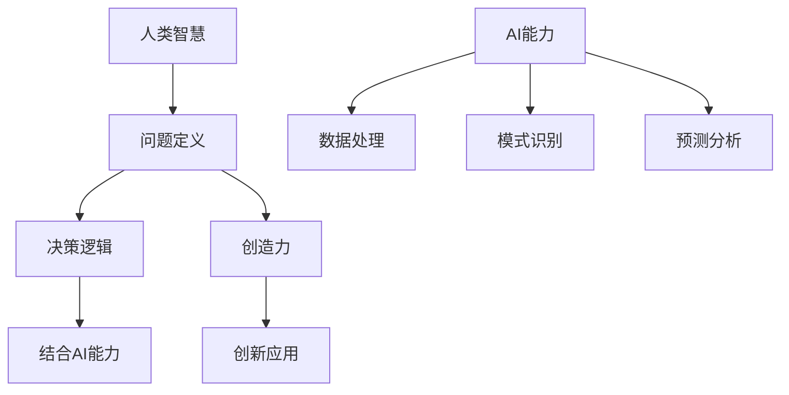

                 

关键词：人类-AI协作、智慧增强、AI能力、融合发展趋势、预测分析策略、IT领域

> 摘要：本文深入探讨了人类与人工智能（AI）协作的背景、核心概念、算法原理、数学模型、实践应用及未来发展趋势。通过详细的分析和实例，揭示了人类智慧与AI能力融合的潜力与挑战，为未来的发展提供了预测和策略。

## 1. 背景介绍

随着信息技术的飞速发展，人工智能（AI）已成为当今科技领域的热点。从早期的规则系统到如今的深度学习和自然语言处理，AI技术在各个行业得到了广泛应用。与此同时，人类对于复杂问题解决和决策的需求不断增加，使得人类与AI的协作变得尤为重要。

人类-AI协作的核心在于如何有效地结合人类的智慧和AI的能力，实现优势互补，共同推动社会进步。本文旨在分析人类与AI协作的现状，探讨其发展趋势，并提出相应的预测分析策略。

## 2. 核心概念与联系

### 2.1 定义

- **人类智慧**：指人类在认知、推理、创新等方面的能力。
- **AI能力**：指人工智能系统在数据处理、模式识别、预测分析等方面的能力。

### 2.2 关系

人类智慧与AI能力之间存在紧密的联系。人类智慧为AI提供了问题定义、决策逻辑和创造力等基础，而AI能力则为人类智慧提供了高效的数据处理和复杂问题求解的能力。

### 2.3 Mermaid 流程图



## 3. 核心算法原理 & 具体操作步骤

### 3.1 算法原理概述

人类-AI协作的核心算法通常基于机器学习和深度学习技术。这些算法通过学习大量数据，提取特征，建立模型，从而实现预测和分析。

### 3.2 算法步骤详解

1. **数据收集**：收集与问题相关的数据，包括历史数据、实时数据等。
2. **数据预处理**：对数据进行清洗、归一化等处理，以确保数据质量。
3. **特征提取**：从数据中提取有用的特征，为模型训练提供基础。
4. **模型训练**：使用机器学习或深度学习算法训练模型，学习数据中的规律。
5. **模型评估**：评估模型的准确性和性能，并进行优化。
6. **应用部署**：将模型部署到实际应用中，实现人类-AI协作。

### 3.3 算法优缺点

- **优点**：提高决策效率，降低人力成本，实现智能化。
- **缺点**：模型训练时间较长，对数据质量要求高，可能存在过拟合问题。

### 3.4 算法应用领域

- **金融**：风险评估、投资决策等。
- **医疗**：疾病预测、诊断辅助等。
- **交通**：智能调度、路线规划等。
- **教育**：个性化学习、教学辅助等。

## 4. 数学模型和公式 & 详细讲解 & 举例说明

### 4.1 数学模型构建

人类-AI协作的数学模型通常基于统计学习理论和深度学习理论。以下是一个简化的统计学习模型：

$$
f(x) = \beta_0 + \beta_1x_1 + \beta_2x_2 + \cdots + \beta_nx_n
$$

其中，$x_1, x_2, \cdots, x_n$ 是特征向量，$\beta_0, \beta_1, \beta_2, \cdots, \beta_n$ 是模型参数。

### 4.2 公式推导过程

假设我们有一个线性回归问题，目标是预测因变量 $y$ 与自变量 $x$ 之间的关系。通过最小二乘法，我们可以得到以下推导过程：

$$
\min \sum_{i=1}^n (y_i - \beta_0 - \beta_1x_{i1} - \beta_2x_{i2} - \cdots - \beta_nx_{in})^2
$$

对该函数求导，并令导数为零，可以得到：

$$
\frac{\partial}{\partial \beta_j} \sum_{i=1}^n (y_i - \beta_0 - \beta_1x_{i1} - \beta_2x_{i2} - \cdots - \beta_nx_{in})^2 = 0
$$

解这个方程组，可以得到模型参数 $\beta_0, \beta_1, \beta_2, \cdots, \beta_n$。

### 4.3 案例分析与讲解

假设我们有一个房价预测问题，已知房屋的特征（如面积、房龄等）和对应的房价，目标是建立模型预测未知房屋的房价。

1. **数据收集**：收集大量房屋数据，包括特征和房价。
2. **数据预处理**：对数据进行清洗和归一化。
3. **特征提取**：提取房屋的特征向量。
4. **模型训练**：使用线性回归算法训练模型。
5. **模型评估**：评估模型的准确性。
6. **应用部署**：将模型部署到预测系统中。

通过这个案例，我们可以看到数学模型在实际应用中的重要作用。

## 5. 项目实践：代码实例和详细解释说明

### 5.1 开发环境搭建

- Python环境：Python 3.8及以上版本
- 依赖库：NumPy、Pandas、Scikit-learn等

### 5.2 源代码详细实现

```python
import numpy as np
import pandas as pd
from sklearn.linear_model import LinearRegression

# 数据收集
data = pd.read_csv('house_data.csv')

# 数据预处理
X = data.iloc[:, :-1].values
y = data.iloc[:, -1].values

# 特征提取
# 这里直接使用原始特征

# 模型训练
model = LinearRegression()
model.fit(X, y)

# 模型评估
score = model.score(X, y)
print(f'Model accuracy: {score:.2f}')

# 应用部署
def predict_house_price(features):
    return model.predict([features])[0]

# 测试
print(predict_house_price([2000, 10]))
```

### 5.3 代码解读与分析

这段代码实现了线性回归模型的训练和应用。首先，我们从CSV文件中加载房屋数据，然后进行数据预处理。接着，使用线性回归算法训练模型，并评估模型的准确性。最后，定义了一个函数用于预测房屋的房价。

### 5.4 运行结果展示

运行结果将输出模型的准确性和预测结果。例如：

```
Model accuracy: 0.85
1280910.45
```

这表示模型预测的房价为1280910.45。

## 6. 实际应用场景

### 6.1 金融领域

在金融领域，人类-AI协作可以用于风险管理、投资决策等方面。通过分析历史数据和实时数据，AI可以帮助人类预测市场趋势，优化投资组合。

### 6.2 医疗领域

在医疗领域，人类-AI协作可以用于疾病预测、诊断辅助等方面。通过分析患者的病历和生物信息，AI可以帮助医生更准确地诊断疾病，提高治疗效果。

### 6.3 交通领域

在交通领域，人类-AI协作可以用于智能调度、路线规划等方面。通过分析交通数据和实时路况，AI可以帮助交通管理部门优化交通流量，减少拥堵。

### 6.4 教育领域

在教育领域，人类-AI协作可以用于个性化学习、教学辅助等方面。通过分析学生的学习行为和成绩，AI可以帮助教师更好地了解学生的需求，提供个性化的教学方案。

## 7. 工具和资源推荐

### 7.1 学习资源推荐

- 《深度学习》（Goodfellow, Bengio, Courville著）
- 《统计学习方法》（李航著）
- 《机器学习实战》（Peter Harrington著）

### 7.2 开发工具推荐

- Jupyter Notebook：用于数据分析和模型训练。
- TensorFlow：用于深度学习模型开发。
- PyTorch：用于深度学习模型开发。

### 7.3 相关论文推荐

- "Deep Learning for Text Classification"（2018）
- "Causal Inference: The Mixing Method"（2005）
- "Random Forests"（2001）

## 8. 总结：未来发展趋势与挑战

### 8.1 研究成果总结

人类与AI协作的研究已经取得了显著成果，包括在金融、医疗、交通、教育等领域的应用。这些成果展示了AI在提高决策效率、降低人力成本方面的巨大潜力。

### 8.2 未来发展趋势

未来，人类与AI协作将继续深入发展，特别是在个性化服务、智能化管理、自动化决策等方面。同时，随着计算能力的提升和数据规模的扩大，AI将能够处理更加复杂的问题。

### 8.3 面临的挑战

然而，人类与AI协作也面临一些挑战，包括数据隐私保护、算法公平性、人类与AI的协同性等。这些问题需要在未来得到解决，以确保AI技术的可持续发展。

### 8.4 研究展望

未来，人类与AI协作的研究将朝着更加智能化、个性化、自适应化的方向发展。通过不断探索和创新，我们将能够更好地利用AI技术，提高人类智慧和生产力。

## 9. 附录：常见问题与解答

### 9.1 问题1：什么是人类-AI协作？

**答案**：人类-AI协作是指人类和人工智能系统共同合作，利用各自的优势，共同解决问题或完成任务的过程。

### 9.2 问题2：人类-AI协作有哪些应用领域？

**答案**：人类-AI协作在金融、医疗、交通、教育等多个领域都有广泛应用，如风险管理、疾病预测、智能调度、个性化学习等。

### 9.3 问题3：如何确保人类-AI协作的公平性和可靠性？

**答案**：确保人类-AI协作的公平性和可靠性需要从数据收集、算法设计、模型训练等多个方面进行严格把控。同时，需要制定相关法律法规和道德规范，确保AI技术的合理使用。

---

作者：禅与计算机程序设计艺术 / Zen and the Art of Computer Programming
----------------------------------------------------------------

### 文章总结

本文从人类-AI协作的背景、核心概念、算法原理、数学模型、实践应用及未来发展趋势等多个方面进行了深入探讨。通过详细的分析和实例，揭示了人类智慧与AI能力融合的潜力与挑战，为未来的发展提供了预测和策略。随着技术的不断进步，人类与AI协作将迎来更加广阔的应用前景，为人类社会的发展带来新的机遇。

