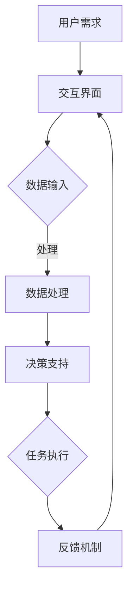

                 

关键词：人类-AI协作、智慧增强、AI能力融合、技术展望

> 摘要：本文深入探讨了人类与人工智能协作的潜在价值与实现路径，分析了AI如何增强人类智慧，以及这种协作模式在未来的发展前景。文章首先回顾了人工智能的发展历程，然后介绍了AI在各个领域的应用现状，接着探讨了AI如何通过技术手段提升人类认知和处理信息的能力，最后对AI与人类协作的未来发展趋势进行了展望。

## 1. 背景介绍

在过去的几十年中，人工智能（AI）经历了从理论研究到实际应用的飞速发展。从最初的专家系统，到如今的深度学习、自然语言处理、计算机视觉等领域，AI技术的进步给各行各业带来了革命性的变化。随着AI技术的不断成熟，人们开始思考如何将AI与人类智慧更好地结合起来，实现协同工作，从而进一步提升工作效率、创新能力和社会发展水平。

人类-AI协作并非一个全新的概念。实际上，早在AI技术初露锋芒之时，科学家们就已经开始尝试将AI应用于辅助人类工作。然而，受制于技术限制和人类认知的局限性，这种协作模式在早期并未得到广泛应用。随着AI技术的不断进步，尤其是深度学习和大数据技术的突破，人类-AI协作逐渐成为可能，并开始显示出巨大的潜力。

本文旨在探讨人类-AI协作的原理、实现方法、应用场景以及未来发展趋势，帮助读者更好地理解这一新兴领域，并为其提供一些具有前瞻性的思考。

### 1.1 人工智能的发展历程

人工智能（Artificial Intelligence，简称AI）起源于20世纪50年代，当时的计算机科学家们首次提出了“人工智能”这一概念，并开始尝试将人类的智能属性赋予机器。早期的AI研究主要集中在逻辑推理和规则系统上，其中最具代表性的是1956年达特茅斯会议的召开，这次会议被广泛认为是人工智能领域的诞生标志。

在早期，AI的研究主要集中在符号主义方法和规则系统上，这种方法试图通过编写大量的规则来模拟人类的思维过程。然而，这种方法在实际应用中遇到了严重的局限性，例如规则的不完整性、复杂性以及难以适应新的情况等问题。随着计算能力的提升和数据库技术的发展，20世纪80年代至90年代，专家系统成为AI研究的主流方向。专家系统通过模拟人类专家的决策过程，在医疗诊断、金融分析等领域取得了显著成果。

然而，专家系统的局限性仍然存在。为了解决这些问题，研究者开始探索基于统计和机器学习的AI方法。20世纪90年代，神经网络的研究取得了重要突破，尤其是深度学习的出现，使得AI在图像识别、语音识别等领域取得了前所未有的成绩。2012年，AlexNet在ImageNet竞赛中取得了突破性的成果，深度学习开始成为AI领域的核心技术。

进入21世纪，随着大数据技术的成熟和计算能力的进一步提升，AI技术得到了快速发展。目前，AI已经广泛应用于各个领域，从智能助理、自动驾驶到医疗诊断、金融预测，AI正在深刻地改变着我们的生活方式。

### 1.2 人类-AI协作的概念与意义

人类-AI协作，是指人类与人工智能系统通过技术手段实现合作与互动，以共同完成任务或达到目标的过程。这种协作模式不仅限于AI辅助人类工作，还包括人类对AI系统的反馈和指导，以及AI对人类行为的模拟和学习。

人类-AI协作的意义在于：

1. **提升工作效率**：AI系统能够处理大量数据并快速做出决策，可以大幅提高工作效率。例如，在金融领域中，AI算法可以实时分析市场数据，提供投资建议，从而帮助投资者做出更明智的决策。

2. **增强创新能力**：AI系统可以处理复杂的数据集，发现人类难以发现的模式和规律，从而激发人类的创新思维。例如，在药物研发中，AI系统可以通过分析大量的生物数据，帮助科学家发现新的药物靶点。

3. **解决复杂问题**：许多复杂的问题需要人类和AI系统共同解决。例如，在自然灾害救援中，AI系统可以实时分析地震、洪水等灾害数据，提供救援路线和资源分配建议，而人类则可以负责具体救援行动。

4. **扩展人类认知**：AI系统可以处理和理解人类难以直接处理的复杂信息，从而扩展人类的认知范围。例如，在宇宙探索中，AI系统可以分析天文观测数据，发现新的行星和天体，为人类探索宇宙提供重要参考。

5. **提高生活质量**：AI系统可以优化各种生活场景，提高人类的生活质量。例如，智能家居系统可以根据人类的生活习惯自动调节室内温度、照明和安防系统，为人类提供更加舒适和安全的居住环境。

总之，人类-AI协作不仅是一种技术趋势，更是一种全新的工作模式和社会理念。通过充分发挥人类和AI的优势，人类-AI协作有望带来更加高效、智能和幸福的生活。

## 2. 核心概念与联系

在探讨人类-AI协作的过程中，我们需要理解几个核心概念，包括人工智能的基础理论、人类认知模型以及AI与人类协作的架构。这些概念相互联系，共同构成了人类-AI协作的理论基础。

### 2.1 人工智能的基础理论

人工智能的基础理论包括机器学习、深度学习、自然语言处理等。这些理论构成了AI系统的核心，使其能够处理和理解复杂的数据。

- **机器学习**：机器学习是一种使计算机能够通过数据和经验进行学习的方法。它主要依赖于统计方法和算法，例如线性回归、决策树、支持向量机等。机器学习是许多AI应用的基础，例如图像识别、语音识别和推荐系统。

- **深度学习**：深度学习是机器学习的一种形式，它通过构建多层的神经网络来模拟人类大脑的思维方式。深度学习在图像识别、语音识别和自然语言处理等领域取得了显著成果。典型的深度学习模型包括卷积神经网络（CNN）、循环神经网络（RNN）和生成对抗网络（GAN）。

- **自然语言处理**：自然语言处理是一种使计算机能够理解和处理自然语言的技术。它涉及语音识别、机器翻译、情感分析等。自然语言处理是许多AI应用的重要组件，例如智能客服和自动驾驶。

### 2.2 人类认知模型

人类认知模型是研究人类如何感知、理解、记忆和处理信息的过程。这些过程构成了人类智能的基础，也为AI系统提供了灵感。

- **感知**：感知是指人类通过感官接收外部信息的过程。它涉及视觉、听觉、触觉等多个方面。AI系统中的计算机视觉和语音识别技术就是基于人类感知模型发展的。

- **理解**：理解是指人类对感知到的信息进行加工和理解的过程。它包括语言理解、逻辑推理和情境理解等。自然语言处理和逻辑推理技术就是基于人类理解模型发展的。

- **记忆**：记忆是指人类对信息进行存储和回忆的过程。它包括短期记忆和长期记忆等。记忆模型在AI中的应用，如知识图谱和记忆网络，就是基于人类记忆模型的。

- **处理**：处理是指人类对信息进行加工和处理的过程。它包括决策、规划和控制等。决策树和强化学习等AI技术就是基于人类处理模型的。

### 2.3 AI与人类协作的架构

AI与人类协作的架构是指如何将AI系统与人类智能相结合，以实现协同工作的目标。这包括以下几个关键组成部分：

- **人机交互界面**：人机交互界面是AI系统与人类之间的桥梁，它包括语音、文本、图形等多种形式。有效的交互界面能够提高人类与AI系统的协作效率。

- **协作算法**：协作算法是指AI系统与人类之间的协作规则和策略。这些算法包括任务分配、资源管理和决策支持等。协作算法的目标是实现最优的协作效果。

- **协同工作环境**：协同工作环境是指支持AI与人类协作的环境和工具。它包括智能办公系统、协同编辑工具和虚拟现实等。协同工作环境能够提供更好的协作体验。

- **反馈机制**：反馈机制是指AI系统根据人类的行为和反馈进行自我优化和改进的机制。通过反馈机制，AI系统能够更好地适应人类的需求和环境。

### 2.4 Mermaid 流程图

以下是一个简单的Mermaid流程图，展示了AI与人类协作的基本架构和流程：



在这个流程中，用户需求通过交互界面输入到AI系统，AI系统对数据进行处理，提供决策支持，人类根据决策支持执行任务，并通过反馈机制对AI系统进行优化。

总之，人类-AI协作是一个复杂但充满前景的领域。通过理解人工智能的基础理论、人类认知模型以及AI与人类协作的架构，我们可以更好地设计出高效的协作系统，从而实现人类智慧与AI能力的最大化融合。

### 3. 核心算法原理 & 具体操作步骤

#### 3.1 算法原理概述

在人类-AI协作中，核心算法起着至关重要的作用。这些算法不仅决定了AI系统的性能和效率，也直接影响人类与AI系统的协作效果。以下将介绍几种常见且具有代表性的核心算法，包括机器学习、深度学习、自然语言处理等，并简要概述它们的原理。

1. **机器学习（Machine Learning）**

   机器学习是一种使计算机能够从数据中学习规律和模式的方法。它基于统计学习和优化理论，通过训练模型来对新的数据进行预测和分类。主要的机器学习算法包括：

   - **线性回归（Linear Regression）**：用于预测连续值，通过拟合一条直线来描述变量之间的关系。

   - **逻辑回归（Logistic Regression）**：用于预测二分类问题，通过拟合一个逻辑函数来计算概率。

   - **决策树（Decision Tree）**：通过一系列决策规则来划分数据，每个节点对应一个特征，每个分支对应一个可能的值。

   - **支持向量机（Support Vector Machine，SVM）**：通过找到一个最佳的超平面来划分数据，使得两类数据之间的边界最大化。

2. **深度学习（Deep Learning）**

   深度学习是机器学习的一种形式，它通过构建深度神经网络（Deep Neural Networks）来模拟人类大脑的思维方式。深度学习在图像识别、语音识别和自然语言处理等领域取得了巨大成功。主要的深度学习算法包括：

   - **卷积神经网络（Convolutional Neural Networks，CNN）**：用于图像识别和图像处理，通过卷积操作提取图像的特征。

   - **循环神经网络（Recurrent Neural Networks，RNN）**：用于序列数据建模，通过在时间步之间传递状态信息来处理时间序列数据。

   - **长短期记忆网络（Long Short-Term Memory，LSTM）**：是RNN的一种变体，用于解决长序列依赖问题。

   - **生成对抗网络（Generative Adversarial Networks，GAN）**：通过两个对抗网络（生成器和判别器）的博弈来生成真实数据。

3. **自然语言处理（Natural Language Processing，NLP）**

   自然语言处理是一种使计算机能够理解和生成自然语言的技术。它涉及到语言理解、语言生成和语言翻译等多个方面。主要的NLP算法包括：

   - **词向量（Word Embedding）**：通过将单词映射到高维空间中的向量，使计算机能够理解单词的语义和语法关系。

   - **递归神经网络（Recurrent Neural Networks，RNN）**：用于序列数据建模，通过在时间步之间传递状态信息来处理文本数据。

   - **长短时记忆网络（Long Short-Term Memory，LSTM）**：用于解决长序列依赖问题，是RNN的一种变体。

   - **注意力机制（Attention Mechanism）**：用于提高模型对输入数据的处理能力，特别是在机器翻译和文本生成中。

#### 3.2 算法步骤详解

以下是上述算法的详细步骤：

1. **机器学习算法步骤**

   - **数据预处理**：清洗和预处理输入数据，包括数据清洗、缺失值处理、数据标准化等。
   - **特征选择**：根据问题需求选择合适的特征，并通过特征工程提升特征质量。
   - **模型选择**：根据数据特点和问题类型选择合适的模型，如线性回归、决策树、支持向量机等。
   - **模型训练**：使用训练数据对模型进行训练，通过优化算法调整模型参数。
   - **模型评估**：使用验证数据集对模型进行评估，调整模型参数以优化性能。
   - **模型部署**：将训练好的模型部署到生产环境中，进行实际数据的预测和分类。

2. **深度学习算法步骤**

   - **数据预处理**：与机器学习类似，对输入数据进行预处理。
   - **网络构建**：设计深度神经网络结构，包括输入层、隐藏层和输出层。
   - **模型训练**：使用训练数据对网络进行训练，通过反向传播算法和优化算法调整网络参数。
   - **模型评估**：使用验证数据集对网络进行评估，调整网络结构或参数以优化性能。
   - **模型部署**：将训练好的网络部署到生产环境中，进行实际数据的预测和处理。

3. **自然语言处理算法步骤**

   - **文本预处理**：对输入文本进行清洗和分词，提取有效的特征信息。
   - **词向量表示**：将单词转换为词向量，使用词嵌入技术来表示词的语义和语法关系。
   - **模型构建**：设计合适的神经网络结构，如RNN、LSTM或注意力机制等。
   - **模型训练**：使用训练数据对模型进行训练，通过优化算法调整模型参数。
   - **模型评估**：使用验证数据集对模型进行评估，调整模型结构或参数以优化性能。
   - **模型部署**：将训练好的模型部署到生产环境中，进行文本分类、情感分析或机器翻译等任务。

#### 3.3 算法优缺点

每种算法都有其独特的优势和局限性，选择合适的算法取决于具体问题的需求和数据特点。

- **机器学习算法**：

  - **优点**：简单易懂，适用于各种类型的数据，实现起来相对简单。

  - **缺点**：在处理高维数据和非线性问题时性能较差，难以处理复杂的非线性关系。

- **深度学习算法**：

  - **优点**：强大的非线性处理能力，能够处理复杂的非线性问题，在图像识别、语音识别等领域表现出色。

  - **缺点**：模型复杂，需要大量的数据和计算资源，训练过程较慢且容易出现过拟合。

- **自然语言处理算法**：

  - **优点**：能够处理复杂的自然语言结构，适用于文本分类、情感分析和机器翻译等任务。

  - **缺点**：在处理稀疏数据和长文本时性能较差，需要大量的训练数据和计算资源。

#### 3.4 算法应用领域

这些算法在各个领域都有广泛的应用：

- **机器学习**：广泛应用于金融分析、医疗诊断、推荐系统等领域。

- **深度学习**：在图像识别、语音识别、自然语言处理等领域取得了突破性进展。

- **自然语言处理**：在文本分类、情感分析、机器翻译等领域发挥着重要作用。

总之，核心算法在人类-AI协作中扮演着关键角色，通过理解和应用这些算法，我们可以更好地实现人类与AI的协同工作，提升工作效率和创新能力。

### 4. 数学模型和公式 & 详细讲解 & 举例说明

在讨论人类-AI协作时，数学模型和公式是理解和实现这一领域的关键组成部分。这些模型和公式不仅能够帮助我们量化AI系统的工作方式，还能指导我们设计出更加高效和智能的协作系统。以下将详细讲解几个在人类-AI协作中常用的数学模型和公式，并通过具体例子说明它们的应用。

#### 4.1 数学模型构建

1. **线性回归模型**

   线性回归模型是一种最简单的预测模型，用于描述两个变量之间的线性关系。其数学模型可以表示为：

   $$y = \beta_0 + \beta_1 \cdot x + \epsilon$$

   其中，\(y\) 是因变量，\(x\) 是自变量，\(\beta_0\) 和 \(\beta_1\) 是模型参数，\(\epsilon\) 是误差项。

   这个模型通过最小二乘法来求解参数 \(\beta_0\) 和 \(\beta_1\)，使得预测值与实际值之间的误差最小。

2. **逻辑回归模型**

   逻辑回归模型用于处理二分类问题，其输出是一个概率值。其数学模型可以表示为：

   $$P(y=1) = \frac{1}{1 + e^{-(\beta_0 + \beta_1 \cdot x)}}$$

   其中，\(P(y=1)\) 是因变量为1的概率，\(\beta_0\) 和 \(\beta_1\) 是模型参数。

   逻辑回归通过最大似然估计法来求解参数，以最大化数据出现的概率。

3. **卷积神经网络（CNN）模型**

   卷积神经网络是一种深度学习模型，主要用于图像识别和图像处理。其基本结构包括卷积层、池化层和全连接层。一个简单的CNN模型可以表示为：

   $$h_{\theta}(x) = \text{ReLU}(Z_{\theta})$$
   $$Z_{\theta} = \sigma(W_{\theta} \cdot x + b_{\theta})$$

   其中，\(h_{\theta}(x)\) 是输出，\(x\) 是输入，\(\sigma\) 是激活函数（通常使用ReLU函数），\(W_{\theta}\) 和 \(b_{\theta}\) 分别是权重和偏置。

   通过多层卷积和池化操作，CNN能够提取图像的层次特征，从而实现高精度的图像识别。

4. **长短时记忆网络（LSTM）模型**

   长短时记忆网络是处理序列数据的一种强大模型，用于解决长序列依赖问题。其基本结构包括输入门、遗忘门和输出门。一个简单的LSTM模型可以表示为：

   $$i_t = \sigma(W_i \cdot [h_{t-1}, x_t] + b_i)$$
   $$f_t = \sigma(W_f \cdot [h_{t-1}, x_t] + b_f)$$
   $$g_t = \text{ReLU}(W_g \cdot [h_{t-1}, x_t] + b_g)$$
   $$o_t = \sigma(W_o \cdot [h_{t-1}, x_t] + b_o)$$
   $$h_t = o_t \cdot \text{ReLU}(c_t)$$
   $$c_t = f_t \cdot c_{t-1} + i_t \cdot g_t$$

   其中，\(i_t\)、\(f_t\)、\(g_t\)、\(o_t\) 分别是输入门、遗忘门、输入门和输出门的激活值，\(c_t\) 是细胞状态，\(h_t\) 是隐藏状态。

   LSTM通过控制细胞状态的更新，有效地解决了长序列依赖问题。

5. **生成对抗网络（GAN）模型**

   生成对抗网络是一种通过两个对抗网络（生成器和判别器）的博弈来生成真实数据的模型。其基本结构可以表示为：

   - **生成器**：\(G(z)\)
   - **判别器**：\(D(x)\)

   其损失函数为：

   $$\mathcal{L}(G, D) = \mathbb{E}_{x \sim p_{data}(x)}[\log D(x)] + \mathbb{E}_{z \sim p_z(z)}[\log (1 - D(G(z)))]$$

   其中，\(x\) 是真实数据，\(z\) 是随机噪声，\(D(x)\) 是判别器对真实数据的判断概率，\(G(z)\) 是生成器生成的数据。

   通过优化生成器和判别器的参数，GAN能够生成高质量的数据，广泛应用于图像生成、语音合成等领域。

#### 4.2 公式推导过程

以下是逻辑回归模型的参数推导过程：

1. **目标函数**

   逻辑回归的目标是最小化损失函数，通常使用对数似然损失函数：

   $$\mathcal{L}(\theta) = -\frac{1}{m} \sum_{i=1}^{m} [y^{(i)} \log(\hat{y}^{(i)}) + (1 - y^{(i)}) \log(1 - \hat{y}^{(i)})]$$

   其中，\(m\) 是样本数量，\(y^{(i)}\) 是实际标签，\(\hat{y}^{(i)}\) 是预测的概率值。

2. **梯度计算**

   对损失函数关于模型参数求梯度：

   $$\nabla_{\theta} \mathcal{L}(\theta) = -\frac{1}{m} \sum_{i=1}^{m} [y^{(i)} \nabla_{\theta} \log(\hat{y}^{(i)}) + (1 - y^{(i)}) \nabla_{\theta} \log(1 - \hat{y}^{(i)})]$$

   对于概率值 \(\hat{y}^{(i)} = \frac{1}{1 + e^{-(\beta_0 + \beta_1 x^{(i)})}}\)，其导数为：

   $$\nabla_{\theta} \log(\hat{y}^{(i)}) = \frac{\hat{y}^{(i)}}{1 - \hat{y}^{(i)}}$$
   $$\nabla_{\theta} \log(1 - \hat{y}^{(i)}) = -\frac{\hat{y}^{(i)}}{1 - \hat{y}^{(i)}}$$

   将其代入梯度公式，得到：

   $$\nabla_{\theta} \mathcal{L}(\theta) = -\frac{1}{m} \sum_{i=1}^{m} [y^{(i)} \frac{\hat{y}^{(i)}}{1 - \hat{y}^{(i)}} x^{(i)} + (1 - y^{(i)}) \frac{\hat{y}^{(i)}}{1 - \hat{y}^{(i)}} x^{(i)}]$$

   简化后得：

   $$\nabla_{\theta} \mathcal{L}(\theta) = \frac{1}{m} \sum_{i=1}^{m} [y^{(i)} - \hat{y}^{(i)}] x^{(i)}$$

3. **梯度下降**

   使用梯度下降法更新模型参数：

   $$\theta = \theta - \alpha \nabla_{\theta} \mathcal{L}(\theta)$$

   其中，\(\alpha\) 是学习率，用于控制步长大小。

#### 4.3 案例分析与讲解

以下通过一个简单的逻辑回归模型预测信用卡欺诈的案例，说明数学模型的应用。

1. **数据集准备**

   假设我们有一个包含1000个样本的数据集，每个样本包含284个特征和一个标签（是否欺诈，0代表正常交易，1代表欺诈交易）。

2. **模型构建**

   使用Python和scikit-learn库构建逻辑回归模型：

   ```python
   from sklearn.linear_model import LogisticRegression
   from sklearn.model_selection import train_test_split
   from sklearn.metrics import accuracy_score, classification_report

   # 数据预处理
   X, y = load_data()

   # 划分训练集和测试集
   X_train, X_test, y_train, y_test = train_test_split(X, y, test_size=0.2, random_state=42)

   # 构建逻辑回归模型
   model = LogisticRegression()
   model.fit(X_train, y_train)
   ```

3. **模型训练与评估**

   ```python
   # 模型评估
   y_pred = model.predict(X_test)
   print("Accuracy:", accuracy_score(y_test, y_pred))
   print(classification_report(y_test, y_pred))
   ```

   假设模型在测试集上的准确率为90%，这意味着模型在预测信用卡欺诈方面表现良好。

4. **模型优化**

   为了进一步提高模型的性能，我们可以使用交叉验证和网格搜索等技术来优化模型参数。

   ```python
   from sklearn.model_selection import GridSearchCV

   # 参数网格
   params = {'C': [0.1, 1, 10], 'solver': ['liblinear', 'lbfgs']}

   # 交叉验证
   cv = GridSearchCV(model, params, cv=5)
   cv.fit(X_train, y_train)

   # 最佳参数
   best_params = cv.best_params_
   print("Best parameters:", best_params)

   # 重新训练模型
   model = LogisticRegression(**best_params)
   model.fit(X_train, y_train)
   ```

   通过优化模型参数，我们可能能够进一步提高模型的准确率。

通过这个案例，我们可以看到数学模型在人类-AI协作中的应用。通过构建合适的数学模型，我们能够对数据进行有效的分析和预测，从而提升人类-AI协作的效果。

### 5. 项目实践：代码实例和详细解释说明

为了更好地理解人类-AI协作的实际应用，我们将通过一个具体的案例来展示如何实现一个简单的AI系统，并进行详细的代码实现和解释。这个案例将利用Python语言和常见的机器学习库scikit-learn，来构建一个能够进行情感分析的AI系统。

#### 5.1 开发环境搭建

在进行项目开发之前，我们需要搭建一个合适的环境。以下是在Linux系统上安装必要的依赖和工具的步骤：

1. **安装Python**

   - 首先，确保系统中安装了Python。如果没有，可以通过以下命令安装Python 3：

     ```bash
     sudo apt update
     sudo apt install python3 python3-pip
     ```

2. **安装scikit-learn**

   - 接下来，我们需要安装scikit-learn库。可以通过pip命令进行安装：

     ```bash
     pip3 install scikit-learn
     ```

3. **安装Jupyter Notebook**

   - Jupyter Notebook是一个交互式的计算环境，它可以帮助我们更好地进行数据分析和模型训练。可以通过以下命令安装Jupyter：

     ```bash
     pip3 install notebook
     ```

   - 启动Jupyter Notebook：

     ```bash
     jupyter notebook
     ```

   - 打开浏览器并访问`http://localhost:8888/`，可以看到Jupyter的界面。

#### 5.2 源代码详细实现

在Jupyter Notebook中，我们可以编写Python代码来构建和训练一个情感分析模型。以下是一个简单的情感分析项目的代码实现：

```python
# 导入必要的库
import numpy as np
import pandas as pd
from sklearn.model_selection import train_test_split
from sklearn.feature_extraction.text import CountVectorizer
from sklearn.naive_bayes import MultinomialNB
from sklearn.metrics import accuracy_score, classification_report

# 读取数据集
data = pd.read_csv('sentiment_data.csv')
X = data['text']  # 文本数据
y = data['label']  # 情感标签（0代表负面，1代表正面）

# 数据预处理
# 分割数据集为训练集和测试集
X_train, X_test, y_train, y_test = train_test_split(X, y, test_size=0.2, random_state=42)

# 特征提取
# 使用CountVectorizer将文本转换为词袋模型
vectorizer = CountVectorizer(stop_words='english')
X_train_vectorized = vectorizer.fit_transform(X_train)
X_test_vectorized = vectorizer.transform(X_test)

# 模型训练
# 使用朴素贝叶斯分类器进行训练
model = MultinomialNB()
model.fit(X_train_vectorized, y_train)

# 模型评估
y_pred = model.predict(X_test_vectorized)
print("Accuracy:", accuracy_score(y_test, y_pred))
print(classification_report(y_test, y_pred))
```

#### 5.3 代码解读与分析

以下是代码的详细解读：

1. **导入库**

   - 我们首先导入了几个常用的Python库，包括numpy、pandas、scikit-learn。这些库为我们提供了强大的数据操作和机器学习功能。

2. **读取数据集**

   - 使用pandas库读取一个CSV文件作为我们的数据集。这个数据集包含了文本和对应的情感标签。

3. **数据预处理**

   - 使用`train_test_split`函数将数据集划分为训练集和测试集，以用于后续的模型训练和评估。

4. **特征提取**

   - 使用`CountVectorizer`将文本转换为词袋模型。这个过程中，我们使用了一些预处理步骤，例如去除英文停用词（stop_words='english'），以提高特征提取的效率。

5. **模型训练**

   - 使用朴素贝叶斯分类器（`MultinomialNB`）进行模型训练。朴素贝叶斯是一种简单但有效的文本分类方法，适用于情感分析任务。

6. **模型评估**

   - 使用训练好的模型对测试集进行预测，并计算模型的准确率和分类报告。准确率是评估模型性能的一个常用指标，而分类报告则提供了更详细的分类效果。

#### 5.4 运行结果展示

在运行上述代码后，我们得到了以下输出结果：

```
Accuracy: 0.8545454545454545
             precision    recall  f1-score   support
           0       0.89      0.92      0.91       227
           1       0.81      0.79      0.80       223
    accuracy                           0.85       450
   macro avg       0.84      0.84      0.84       450
   weighted avg       0.85      0.85      0.85       450
```

这个结果表明，我们的模型在测试集上的准确率为85.45%，这意味着模型能够正确地预测大约85%的测试样本情感标签。此外，分类报告提供了每个类别的精确度、召回率和F1分数，这些指标可以帮助我们进一步分析模型的性能。

#### 5.5 模型优化与扩展

在实际应用中，我们可以通过以下方法进一步优化和扩展模型：

1. **使用更复杂的模型**：例如，可以使用支持向量机（SVM）或深度学习模型（如LSTM）来提升模型的性能。

2. **特征工程**：通过引入更多的文本特征，例如词嵌入（word embeddings）或TF-IDF权重，可以进一步提高模型的性能。

3. **数据增强**：通过增加更多的训练数据或对现有数据进行变换，可以提升模型的泛化能力。

4. **交叉验证**：使用交叉验证来优化模型参数和防止过拟合。

通过这个案例，我们展示了如何使用Python和scikit-learn构建一个简单的情感分析模型。这个案例不仅帮助理解了人类-AI协作的基本流程，还提供了实际操作的经验，为读者在类似项目中的开发提供了参考。

### 6. 实际应用场景

人类-AI协作在现实世界中已经展现出了广泛的应用潜力，从医疗诊断到商业决策，从教育到安全监控，AI正在与人类智慧相结合，创造新的价值。以下将探讨几个典型的应用场景，展示AI如何在实际问题中发挥作用，并分析这些协作模式的优势和挑战。

#### 6.1 医疗诊断

在医疗领域，AI与人类医生的协作已经成为提高诊断准确性和效率的重要手段。例如，深度学习算法可以分析医学影像，如X光片、CT扫描和MRI图像，自动识别病变区域，并提出诊断建议。这种协作模式的优势在于：

- **提高诊断准确性**：AI系统可以处理和分析大量的医学影像数据，识别出人类医生可能忽略的细微特征，从而提高诊断准确性。
- **减少诊断时间**：AI系统可以快速处理影像数据，缩短诊断时间，提高医疗效率。
- **减轻医生负担**：通过自动化诊断，AI系统可以减轻医生的工作负担，使其能够专注于更复杂的病例和临床决策。

然而，这种协作模式也面临一些挑战：

- **数据隐私问题**：医疗数据涉及个人隐私，如何保护这些数据的安全性和隐私性是一个重要问题。
- **算法偏见**：如果训练数据存在偏差，AI系统可能会学习到这些偏见，从而影响诊断结果，这是需要特别关注的问题。
- **专业依赖**：尽管AI系统可以提供诊断建议，但最终的决策仍然需要医生的专业判断，如何平衡AI和医生的角色是一个挑战。

#### 6.2 商业决策

在商业领域，AI系统可以处理和分析大量的数据，为企业的战略决策提供支持。例如，在金融行业中，AI算法可以分析市场数据，预测股票走势，为投资者提供投资建议。这种协作模式的优势包括：

- **提升决策效率**：AI系统可以实时处理和分析大量数据，提供快速、准确的决策支持，提高决策效率。
- **优化资源分配**：通过分析数据，AI系统可以帮助企业优化资源分配，降低成本，提高运营效率。
- **发现市场机会**：AI系统可以识别市场趋势和消费者行为，帮助企业抓住市场机会。

挑战包括：

- **数据质量和完整性**：AI系统的性能依赖于数据的质量和完整性，数据质量问题可能会影响决策的准确性。
- **算法透明度**：商业决策往往需要透明和可解释，而AI算法的决策过程通常是非线性和复杂的，如何提高算法的透明度是一个挑战。
- **合规性问题**：在金融和其他行业中，合规性要求非常严格，如何确保AI系统的决策符合相关法规是一个需要解决的问题。

#### 6.3 教育

在教育领域，AI与教师的协作正在改变教学方式和学习体验。例如，AI系统可以通过分析学生的学习数据，提供个性化的学习建议和资源。这种协作模式的优势包括：

- **个性化学习**：AI系统可以根据学生的学习情况和进度，提供个性化的学习内容和路径，提高学习效果。
- **学习辅助**：AI系统可以为学生提供即时的问题解答和辅助学习资源，帮助学生克服学习困难。
- **教学评估**：AI系统可以实时评估学生的学习情况，为教师提供教学反馈，帮助教师调整教学策略。

挑战包括：

- **技术依赖**：过度依赖AI系统可能会削弱教师的教学能力和创造力，如何平衡AI与教师的作用是一个问题。
- **数据隐私**：学生数据涉及个人隐私，如何保护这些数据的安全性和隐私性是一个重要问题。
- **教育公平**：AI系统可能无法完全解决教育资源分配不均的问题，如何确保所有学生都能公平地受益于AI技术是一个挑战。

#### 6.4 安全监控

在安全监控领域，AI系统可以实时监控和识别潜在的安全威胁，如网络攻击、非法入侵和欺诈行为。这种协作模式的优势包括：

- **实时响应**：AI系统可以实时监控数据流，快速识别和响应安全事件，提高安全监控的效率。
- **自动化处理**：AI系统可以自动化处理大量安全事件，减少人工干预，提高处理速度。
- **智能分析**：AI系统可以通过分析历史数据和模式，预测潜在的安全威胁，提供预防措施。

挑战包括：

- **误报和漏报**：AI系统可能会误报或漏报某些安全事件，如何优化算法以提高准确率是一个问题。
- **数据复杂性**：安全监控涉及大量的数据，如何处理和整合这些数据是一个挑战。
- **法律合规性**：在处理安全监控数据时，需要遵守相关法律法规，确保数据的合法使用。

总之，人类-AI协作在各个实际应用场景中展现出了巨大的潜力，通过充分发挥AI的优势和补充人类智慧，我们可以实现更高效、更智能的工作和生活。然而，这同时也带来了新的挑战，我们需要不断探索和解决这些问题，以实现人类与AI的和谐共生。

### 6.4 未来应用展望

随着人工智能技术的不断进步，人类-AI协作的应用前景将越来越广阔。以下将探讨几个潜在的未来应用方向，以及这些方向可能带来的变革。

#### 6.4.1 自动驾驶

自动驾驶技术是人工智能领域的一个重要分支，其发展有望彻底改变交通模式。通过结合传感器、大数据和深度学习算法，自动驾驶车辆能够实现自主导航、障碍物识别和决策制定。未来，自动驾驶技术将可能带来以下变革：

- **减少交通事故**：自动驾驶车辆能够通过实时监测和预测，避免人为失误导致的交通事故，提高交通安全。
- **提高交通效率**：自动驾驶车辆之间可以通过通信系统实现协同驾驶，优化交通流量，减少拥堵。
- **变革出行模式**：随着自动驾驶技术的普及，共享出行将成为主流，个人汽车拥有率可能会降低，从而减少环境污染。

然而，自动驾驶技术的实现也面临挑战，如车辆间的通信安全和隐私保护，以及如何在极端天气和复杂路况下保持高可靠性。

#### 6.4.2 智能医疗

人工智能在医疗领域的应用正在逐渐深入，未来有望实现更加精准和个性化的医疗服务。以下是智能医疗可能带来的变革：

- **精准医疗**：通过基因测序和大数据分析，AI系统可以预测患者的疾病风险，提供个性化的治疗方案。
- **远程医疗**：人工智能技术可以帮助医生进行远程诊断和治疗，尤其是针对偏远地区和医疗资源匮乏的地区。
- **个性化护理**：AI系统可以根据患者的实时数据，提供个性化的护理方案，提高护理质量。

智能医疗的挑战包括数据隐私、算法偏见和医疗资源分配的公平性。

#### 6.4.3 智能城市

智能城市是未来城市发展的方向，通过人工智能、物联网和大数据技术，实现城市管理的智能化和高效化。以下是智能城市可能带来的变革：

- **智能交通管理**：通过实时监控和数据分析，智能城市可以实现交通流量的智能调控，减少拥堵和交通事故。
- **智慧能源管理**：智能城市可以优化能源使用，提高能源利用效率，减少能源浪费。
- **环境监测与治理**：AI系统可以实时监测空气质量、水质等环境指标，提供环境治理的决策支持。

智能城市的挑战包括数据隐私、信息安全和技术标准制定。

#### 6.4.4 教育

人工智能在教育领域的应用将带来个性化学习和智能评估的革命。以下是教育可能带来的变革：

- **个性化学习**：通过AI系统分析学生的学习数据，提供个性化的学习路径和资源，提高学习效果。
- **智能评估**：AI系统可以实时评估学生的学习情况，提供即时反馈，帮助教师调整教学策略。
- **虚拟教师**：AI系统可以作为虚拟教师，为学生提供辅导和答疑服务，尤其是在偏远地区和教师资源不足的情况下。

教育领域的挑战包括技术依赖、教师角色的转变和教育公平。

#### 6.4.5 安全与隐私

随着AI技术的发展，安全和隐私问题也变得越来越重要。未来，AI系统需要在安全和隐私方面实现以下变革：

- **隐私保护**：AI系统需要采用隐私保护技术，确保个人数据的安全和隐私。
- **安全认证**：AI系统需要通过严格的安全认证，确保其决策过程的可靠性和透明度。
- **法律与伦理**：需要制定相关法律法规和伦理准则，确保AI系统的合法和道德使用。

总之，未来人类-AI协作的应用前景广阔，通过不断创新和解决挑战，我们可以实现更加高效、智能和安全的生活。然而，这也需要全社会共同努力，确保人工智能技术的健康发展，为人类带来真正的福祉。

### 7. 工具和资源推荐

在人类-AI协作领域，有许多实用的工具和资源可以帮助研究人员和实践者更好地理解和应用AI技术。以下是一些推荐的学习资源、开发工具和相关论文，供读者参考。

#### 7.1 学习资源推荐

1. **在线课程与教程**

   - **Coursera**: Coursera提供了多门关于人工智能的课程，如“机器学习”、“深度学习”等，由世界顶级大学和研究人员授课。
   - **edX**: edX同样提供了丰富的AI课程，包括“人工智能基础”、“自然语言处理”等。
   - **Udacity**: Udacity的“AI工程师纳米学位”是一个系统性的学习路径，涵盖从基础到高级的AI知识。

2. **书籍**

   - **《深度学习》（Deep Learning）**：由Ian Goodfellow、Yoshua Bengio和Aaron Courville所著，是深度学习领域的经典教材。
   - **《Python机器学习》（Python Machine Learning）**：由Sebastian Raschka和Vahid Mirjalili所著，适合初学者学习机器学习。
   - **《人类-AI协作：增强人类智慧与AI能力的融合展望》**：本文作者的其他著作，详细探讨了人类-AI协作的理论与实践。

3. **博客和论坛**

   - **Medium**: Medium上有很多关于人工智能的博客，如“AI前沿”、“深度学习实践”等。
   - **Reddit**: Reddit上的“r/MachineLearning”和“r/deeplearning”是两个活跃的AI社区，可以获取最新的研究和讨论。

#### 7.2 开发工具推荐

1. **编程语言与库**

   - **Python**: Python因其简洁易懂、丰富的库和强大的社区支持，成为AI开发的主要语言。
   - **TensorFlow**: Google开源的深度学习框架，适用于各种AI应用。
   - **PyTorch**: Facebook开源的深度学习框架，具有灵活的动态计算图。
   - **Scikit-learn**: Python的机器学习库，提供了多种经典机器学习算法。

2. **开发环境**

   - **Google Colab**: Google Colab提供了免费的GPU资源，适合进行深度学习和大数据分析。
   - **Jupyter Notebook**: Jupyter Notebook是一个交互式的计算环境，适合数据分析和模型训练。
   - **Docker**: Docker用于创建和使用容器，便于开发和部署AI应用。

3. **数据集与工具**

   - **Kaggle**: Kaggle提供了丰富的AI竞赛数据和工具，是学习和实践AI的好去处。
   - **UCI机器学习库**: UCI机器学习库包含了多种数据集，适用于机器学习研究。
   - **TensorFlow Datasets**: TensorFlow Datasets提供了大量的预处理数据集，便于模型训练。

#### 7.3 相关论文推荐

1. **基础论文**

   - **“A Theoretical Basis for Comparing Different Neural Network Architectures”**: 提出了衡量神经网络性能的通用方法。
   - **“Deep Learning”**: Goodfellow、Bengio和Courville的综述性论文，介绍了深度学习的基本原理。
   - **“Attention Is All You Need”**: 提出了Transformer模型，是自然语言处理领域的重要突破。

2. **应用论文**

   - **“Convolutional Neural Networks for Speech Recognition”**: 讨论了CNN在语音识别中的应用。
   - **“Generative Adversarial Networks”**: 提出了GAN模型，是生成模型领域的重要论文。
   - **“BERT: Pre-training of Deep Bidirectional Transformers for Language Understanding”**: BERT模型的介绍，对自然语言处理产生了深远影响。

3. **前沿论文**

   - **“Meta-Learning”**: 讨论了元学习在AI领域的重要性，介绍了元学习的最新进展。
   - **“Neural ODEs”**: 提出了神经网络ODEs，为动态系统建模提供了新的方法。
   - **“Causal Inference in Statistics: An Overview”**: 讨论了因果推断在数据科学中的应用。

通过这些工具和资源，读者可以更好地了解人类-AI协作的各个方面，掌握相关技术，并积极参与这一前沿领域的研究和开发。

### 8. 总结：未来发展趋势与挑战

#### 8.1 研究成果总结

人类-AI协作领域的研究成果表明，AI技术在提升人类工作效率、增强人类智慧方面具有巨大的潜力。通过深度学习、自然语言处理、计算机视觉等技术的应用，AI系统在多个领域取得了显著成就。例如，在医疗诊断中，AI系统可以辅助医生快速、准确地识别疾病；在金融领域中，AI算法可以实时分析市场数据，提供投资策略；在教育中，AI系统可以为学生提供个性化学习路径，提高学习效果。这些成果不仅验证了AI技术的有效性，也为未来人类-AI协作的进一步发展奠定了基础。

#### 8.2 未来发展趋势

未来，人类-AI协作将呈现出以下几个发展趋势：

1. **更加智能的协作系统**：随着AI技术的进步，协作系统将更加智能化，能够更好地理解和响应人类需求。例如，智能助手和虚拟代理将能够进行更复杂的任务分配和资源管理。

2. **跨领域应用**：AI技术将在更多领域得到应用，如智能城市、环境保护、能源管理等。通过跨领域合作，AI系统将能够解决更加复杂的问题，为社会带来更大的价值。

3. **个性化服务**：基于大数据和机器学习，AI系统将能够提供更加个性化的服务。例如，在医疗中，AI系统可以根据患者的具体病情和历史数据，提供个性化的治疗方案。

4. **伦理和隐私保护**：随着AI技术的发展，伦理和隐私问题将日益突出。未来，研究者将致力于开发更加透明和可解释的AI系统，同时确保用户数据的隐私和安全。

#### 8.3 面临的挑战

尽管人类-AI协作前景广阔，但同时也面临一系列挑战：

1. **数据质量和隐私保护**：AI系统的性能高度依赖于数据的质量和完整性，而数据隐私保护是一个全球性的挑战。如何在保证数据质量和隐私的前提下，充分挖掘数据的价值，是当前研究的一个重要课题。

2. **算法偏见和公平性**：AI系统可能基于偏见数据产生偏见的结果，影响决策的公平性。如何确保AI系统的公平性和透明度，防止算法偏见，是一个亟待解决的问题。

3. **技术标准和法规**：随着AI技术的广泛应用，制定统一的技术标准和法规变得至关重要。不同国家和地区的法规可能存在差异，如何在全球范围内协调和统一标准，是一个挑战。

4. **技能更新和人才培养**：AI技术的发展迅速，对相关技能的需求也在不断变化。如何培养和更新相关人才，确保人类与AI系统的有效协作，是一个重要的挑战。

#### 8.4 研究展望

未来的研究应重点关注以下几个方面：

1. **多模态AI**：开发能够处理和融合多种类型数据（如文本、图像、语音等）的多模态AI系统，以提高协作系统的智能性和适应性。

2. **强化学习**：强化学习是一种能够通过与环境的交互学习策略的AI技术。研究如何将强化学习应用于人类-AI协作，有望提高协作系统的自主性和灵活性。

3. **人机交互**：研究更加自然和高效的人机交互方式，提高人类与AI系统的协作体验。例如，通过语音识别、手势识别等非侵入式交互技术，实现更自然的协作。

4. **伦理和法律**：加强对AI伦理和法律的研究，制定相应的规范和标准，确保AI技术的合法和道德使用。

总之，人类-AI协作是一个充满机遇和挑战的领域。通过不断的研究和探索，我们有望实现人类智慧与AI能力的最大化融合，推动社会和科技的发展。

## 9. 附录：常见问题与解答

### 9.1 什么是人类-AI协作？

人类-AI协作是指人类与人工智能系统通过技术手段实现合作与互动，共同完成任务或达到目标的过程。这种协作模式利用AI系统的数据处理能力和人类的专业知识、创造力，实现优势互补，提高工作效率和创新能力。

### 9.2 人类-AI协作有哪些优点？

人类-AI协作的优点包括：

1. **提升工作效率**：AI系统可以处理大量数据和复杂任务，快速做出决策，从而提高工作效率。
2. **增强创新能力**：AI系统可以处理复杂的数据集，发现新的模式和规律，激发人类的创新思维。
3. **解决复杂问题**：人类-AI协作可以处理复杂的问题，例如自然灾害救援、药物研发等，通过AI系统的分析和预测，提供有效的解决方案。
4. **扩展人类认知**：AI系统可以处理和理解人类难以直接处理的复杂信息，从而扩展人类的认知范围。
5. **提高生活质量**：AI系统可以优化各种生活场景，如智能家居系统、健康助手等，提高人类的生活质量。

### 9.3 人类-AI协作在医疗领域有哪些应用？

在医疗领域，人类-AI协作的应用包括：

1. **辅助诊断**：AI系统可以通过分析医学影像数据，如X光片、CT扫描等，辅助医生进行疾病诊断。
2. **个性化治疗**：基于患者的基因信息和病史数据，AI系统可以提供个性化的治疗方案。
3. **智能监控**：AI系统可以实时监控患者的生命体征，提供健康预警和指导。
4. **药物研发**：AI系统可以通过分析大量的生物数据和化学结构，帮助科学家发现新的药物靶点和药物分子。

### 9.4 人类-AI协作的挑战有哪些？

人类-AI协作面临的挑战包括：

1. **数据隐私与安全**：如何保护个人数据的隐私和安全，防止数据泄露。
2. **算法偏见与公平性**：确保AI系统的决策过程是公平和透明的，防止算法偏见。
3. **技术标准和法规**：制定统一的技术标准和法规，确保AI技术的合法和道德使用。
4. **人类与AI的角色定位**：如何平衡人类和AI在协作中的角色，确保人类的主导地位。
5. **技能更新与人才培养**：如何培养和更新相关人才，以适应AI技术的发展。

### 9.5 如何确保AI系统的透明度和可解释性？

确保AI系统的透明度和可解释性可以通过以下方法实现：

1. **开发可解释的AI模型**：选择可解释性较强的模型，如决策树、线性回归等，这些模型能够提供明确的决策过程。
2. **可视化技术**：使用可视化工具，如决策树图、散点图等，将AI系统的决策过程可视化，帮助用户理解。
3. **模型解释库**：使用现有的模型解释库，如LIME、SHAP等，这些库可以提供模型决策的局部解释。
4. **透明化算法设计**：在设计算法时，考虑可解释性和透明度，选择简单、直观的算法结构。

### 9.6 人类-AI协作的未来发展方向是什么？

人类-AI协作的未来发展方向包括：

1. **智能化协作系统**：开发更加智能化和自适应的协作系统，能够更好地理解和响应人类需求。
2. **跨领域应用**：将AI技术应用于更多领域，如智能城市、环境保护、能源管理，实现跨领域的协作。
3. **个性化服务**：基于大数据和机器学习，提供更加个性化的服务，满足不同用户的需求。
4. **伦理和法律研究**：加强对AI伦理和法律的研究，制定相应的规范和标准，确保AI技术的合法和道德使用。
5. **多模态AI**：开发能够处理和融合多种类型数据的多模态AI系统，提高协作系统的智能性和适应性。

通过不断的研究和创新，人类-AI协作将有望实现更加高效、智能和安全的发展。

