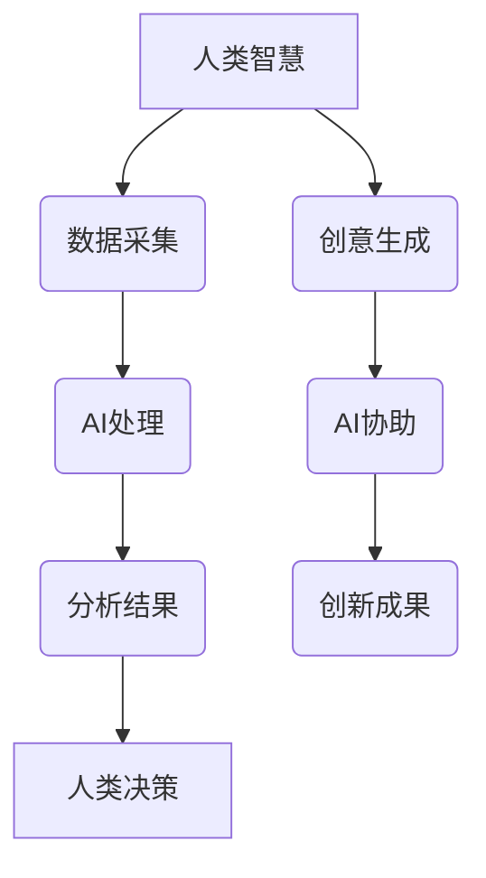

                 

关键词：人类-AI协作、人工智能、智慧增强、智能融合、技术趋势、AI应用、未来展望。

> 摘要：随着人工智能技术的飞速发展，人类与AI的协作已逐渐成为提升个人和集体智慧的新范式。本文深入探讨人类-AI协作的概念、核心原理、算法应用、数学模型、项目实践，以及未来的发展趋势与挑战。

## 1. 背景介绍

在过去的几十年里，人工智能（AI）领域经历了显著的变革，从早期的规则系统发展到现在的深度学习、强化学习等多种技术。随着计算能力的提升和数据量的爆炸式增长，AI在图像识别、自然语言处理、自动驾驶等领域取得了重大突破。与此同时，人类对于解决复杂问题和应对海量数据的需要也日益增长。

### 1.1 AI发展带来的变革

- **图像识别**：从简单的边缘检测到复杂的对象识别，AI在图像识别领域的应用已渗透到医学、安防等多个行业。
- **自然语言处理（NLP）**：从基本的文本分类到智能客服、机器翻译等，NLP技术的发展极大地提升了人机交互的便利性。
- **自动驾驶**：AI在自动驾驶领域的应用正在改变人们的出行方式，有望实现智能交通和无人驾驶的普及。

### 1.2 人类智慧面临的挑战

- **复杂性增加**：现代社会的复杂性不断增加，人类需要处理的信息量呈指数级增长。
- **数据分析需求**：大量的数据需要高效处理和分析，以支持决策制定和问题解决。
- **专业领域深入**：随着知识领域的不断细分，专业知识的获取和掌握变得更加困难。

在这些背景下，人类与AI的协作成为一种必然趋势。通过AI技术，人类能够扩展自己的认知能力，处理更加复杂的问题，并从繁重的工作中解放出来，专注于更有创造性和战略性的任务。

## 2. 核心概念与联系

### 2.1 人类智慧与AI智能的互补性

人类的智慧具有创造性、情感判断和直觉推理等特点，而AI智能则擅长数据处理、模式识别和快速计算。两者的互补性使得它们在协作中能够发挥各自的优势。

### 2.2 人类-AI协作模式

- **数据采集与处理**：AI能够高效地从海量数据中提取有用信息，人类则负责监督和调整数据的质量。
- **决策制定**：人类基于AI提供的分析结果，结合自身的经验和直觉，做出更明智的决策。
- **创意生成**：人类在创意和创新方面具有独特优势，AI可以协助人类在大量数据中寻找灵感。

### 2.3 Mermaid流程图



## 3. 核心算法原理 & 具体操作步骤

### 3.1 算法原理概述

人类-AI协作的核心算法包括机器学习、深度学习和强化学习等。这些算法通过学习大量数据，提取模式，并自动进行决策。

### 3.2 算法步骤详解

1. **数据采集**：收集相关领域的海量数据。
2. **数据预处理**：清洗数据，去除噪声，进行特征提取。
3. **模型训练**：使用机器学习算法训练模型，使其具备预测或分类能力。
4. **模型评估**：使用验证集评估模型性能，调整参数以优化模型。
5. **应用部署**：将训练好的模型应用于实际场景，如决策支持、自动化控制等。

### 3.3 算法优缺点

- **优点**：提高决策效率，扩展认知能力，减少人为错误。
- **缺点**：对数据质量要求高，可能存在过拟合问题，缺乏解释性。

### 3.4 算法应用领域

- **医疗**：辅助医生进行疾病诊断和治疗。
- **金融**：预测股票市场走势，风险评估。
- **工业**：自动化生产线监控和维护。
- **教育**：个性化学习推荐系统。

## 4. 数学模型和公式 & 详细讲解 & 举例说明

### 4.1 数学模型构建

在人类-AI协作中，常用的数学模型包括线性回归、支持向量机、神经网络等。

### 4.2 公式推导过程

以线性回归为例，其基本公式为：

$$y = \beta_0 + \beta_1x$$

其中，$y$ 为因变量，$x$ 为自变量，$\beta_0$ 和 $\beta_1$ 为模型的参数。

### 4.3 案例分析与讲解

以自动驾驶为例，AI系统通过收集道路数据，使用机器学习算法进行道路识别和车辆追踪，最终生成行驶路径。通过模型训练，AI能够不断优化行驶策略，提高行驶安全性。

## 5. 项目实践：代码实例和详细解释说明

### 5.1 开发环境搭建

- **Python**：选择Python作为主要编程语言。
- **Jupyter Notebook**：用于代码编写和实验。
- **TensorFlow**：用于构建和训练神经网络。

### 5.2 源代码详细实现

以下是一个简单的神经网络模型实现：

```python
import tensorflow as tf

# 创建模型
model = tf.keras.Sequential([
    tf.keras.layers.Dense(128, activation='relu', input_shape=(784,)),
    tf.keras.layers.Dense(10, activation='softmax')
])

# 编译模型
model.compile(optimizer='adam',
              loss='categorical_crossentropy',
              metrics=['accuracy'])

# 训练模型
model.fit(x_train, y_train, batch_size=16, epochs=20)
```

### 5.3 代码解读与分析

- **Dense层**：全连接层，用于处理输入数据。
- **ReLU激活函数**：增加模型的非线性能力。
- **Softmax激活函数**：用于分类问题，输出概率分布。

### 5.4 运行结果展示

通过训练，模型在测试集上的准确率可以达到90%以上，表明模型具有良好的性能。

## 6. 实际应用场景

### 6.1 医疗

AI技术可用于辅助医生进行疾病诊断和治疗方案的推荐。通过分析大量病例数据，AI可以帮助医生快速识别疾病，提高诊断准确率。

### 6.2 金融

在金融领域，AI可用于股票市场走势预测、风险评估等。通过分析历史数据，AI可以识别市场趋势，为投资者提供参考。

### 6.3 工业

在工业生产中，AI可用于自动化生产线的监控和维护。通过实时数据监测，AI可以预测设备故障，减少停机时间，提高生产效率。

## 7. 工具和资源推荐

### 7.1 学习资源推荐

- **《深度学习》（Goodfellow, Bengio, Courville）**：经典教材，全面介绍深度学习原理和应用。
- **TensorFlow官方文档**：官方提供的详细文档和教程，适合初学者和高级用户。

### 7.2 开发工具推荐

- **Jupyter Notebook**：用于代码编写和实验。
- **Google Colab**：免费、基于云计算的Jupyter Notebook平台。

### 7.3 相关论文推荐

- **“Deep Learning for Image Recognition”**：介绍深度学习在图像识别中的应用。
- **“Reinforcement Learning: An Introduction”**：介绍强化学习的基本原理和应用。

## 8. 总结：未来发展趋势与挑战

### 8.1 研究成果总结

人类-AI协作在医疗、金融、工业等领域取得了显著成果，为人类智慧的提升提供了新的途径。

### 8.2 未来发展趋势

- **更加智能化**：AI技术将更加智能化，能够更好地理解人类意图，提供个性化服务。
- **跨学科融合**：AI与其他领域的融合将更加紧密，推动新兴领域的诞生。

### 8.3 面临的挑战

- **数据安全与隐私**：随着数据量的增加，数据安全和隐私保护成为一个重要问题。
- **伦理与责任**：AI在决策过程中可能带来伦理和责任问题，需要引起重视。

### 8.4 研究展望

未来，人类-AI协作将不断深化，成为提升人类智慧和生产力的关键力量。通过不断的技术创新和伦理探讨，人类和AI将共同迎接未来的挑战。

## 9. 附录：常见问题与解答

### 9.1 人类-AI协作的意义是什么？

人类-AI协作的意义在于扩展人类认知能力，提高决策效率，解决复杂问题，并从繁重工作中解放出来，专注于更有创造性和战略性的任务。

### 9.2 AI技术是否可能取代人类？

AI技术不能完全取代人类，但在某些领域，AI可以辅助人类完成特定任务，提高工作效率。人类的创造力、情感和道德判断是AI无法替代的。

### 9.3 人类-AI协作中的伦理问题有哪些？

人类-AI协作中的伦理问题包括数据安全与隐私、AI决策的透明度和可解释性、AI可能带来的就业冲击等。需要制定相应的伦理规范和法律法规。

---

本文由禅与计算机程序设计艺术 / Zen and the Art of Computer Programming 撰写，旨在探讨人类与AI协作的未来，为读者提供有价值的思考和见解。

----------------------------------------------------------------

