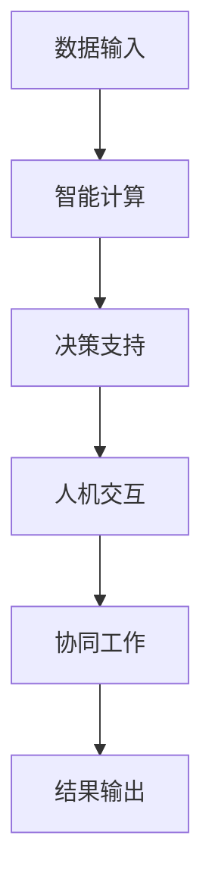

                 

关键词：人类-AI协作、智慧增强、创新能力、技术融合、未来展望

> 摘要：本文旨在探讨人类与人工智能（AI）的协作模式，如何通过技术融合和智能优化，增强人类的智慧和创新能力。文章首先介绍了人类-AI协作的背景和意义，随后详细分析了核心概念、算法原理、数学模型、项目实践和实际应用场景，最后对未来的发展趋势与挑战进行了展望。

## 1. 背景介绍

随着人工智能技术的迅猛发展，AI已经逐渐渗透到各行各业，从制造业到金融服务，从医疗健康到教育领域。AI的崛起不仅改变了传统行业的工作模式，也对人类的工作方式和思维方式提出了新的挑战和机遇。然而，AI并非是取代人类的存在，而是作为人类的辅助工具，与人类共同协作，实现更高效、更智能的工作。

人类-AI协作的意义在于，它不仅能够释放人类的工作压力，提高工作效率，还能够拓展人类智慧的边界，激发人类的创新能力。通过AI的辅助，人类可以处理更复杂的问题，挖掘更多潜在价值，从而推动科技进步和社会发展。

## 2. 核心概念与联系

### 2.1 人类智慧的定义与评估

人类智慧是指人类在认知、思考、判断、解决问题等方面所表现出的能力。传统的评估方法包括智力测试、教育成绩、科研成果等。然而，这些方法往往只能反映人类智慧的一部分，难以全面评估。随着AI技术的发展，我们开始探索使用AI来评估人类智慧的新方法。

### 2.2 人工智能的定义与分类

人工智能（AI）是指由人制造出来的系统，可以模拟、延伸和扩展人类的智能。根据功能和应用，AI可以分为多种类型，如专家系统、机器学习、深度学习、自然语言处理等。这些不同类型的AI具有不同的能力和特点，适用于不同的应用场景。

### 2.3 人类智慧与AI的互补关系

人类智慧与AI的互补关系体现在多个方面。首先，人类在处理抽象思维、情感推理、道德判断等方面具有独特的优势，而AI在这些领域的表现相对较差。其次，AI在处理海量数据、执行重复性任务、进行复杂计算等方面具有明显的优势，而这些正是人类智慧的短板。通过人类-AI协作，可以充分发挥两者的优势，实现协同效应。

### 2.4 人类智慧与AI协作的架构

为了实现人类智慧与AI的协作，需要构建一个合理的架构。这个架构应该包括以下几个关键模块：

- **数据输入模块**：用于收集和处理人类和AI的输入数据。
- **智能计算模块**：包括机器学习、深度学习、自然语言处理等技术，用于处理和分析数据。
- **决策支持模块**：根据智能计算的结果，提供决策支持和建议。
- **人机交互模块**：用于实现人类与AI的交互，包括语音识别、图像识别、自然语言理解等技术。
- **协同工作模块**：用于协调人类和AI的协作，实现高效的工作流程。

### 2.5 Mermaid 流程图

下面是一个简单的 Mermaid 流程图，展示了人类智慧与AI协作的基本架构：



## 3. 核心算法原理 & 具体操作步骤

### 3.1 算法原理概述

人类-AI协作的核心算法是基于深度学习和强化学习的技术。深度学习用于处理和分析大量数据，提取有价值的信息；强化学习则用于训练AI模型，使其能够根据环境和反馈进行调整和优化。

### 3.2 算法步骤详解

1. **数据收集与预处理**：首先，收集人类和AI的输入数据，包括文本、图像、声音等。然后，对数据进行清洗、归一化和特征提取。

2. **模型训练与优化**：使用深度学习算法对预处理后的数据进行训练，得到初步的模型。然后，使用强化学习算法对模型进行调整和优化，使其更好地适应人类的需求。

3. **决策支持与反馈**：根据训练好的模型，为人类提供决策支持和建议。同时，收集人类的反馈，用于进一步优化模型。

4. **协同工作与结果输出**：人类和AI共同完成工作任务，将结果输出给用户。

### 3.3 算法优缺点

- **优点**：算法能够充分利用人类和AI的优势，实现高效的工作流程；能够根据用户需求和环境变化进行调整和优化。
- **缺点**：算法的训练和优化过程复杂，需要大量的计算资源和时间；算法的性能依赖于数据的质量和数量。

### 3.4 算法应用领域

- **智能制造**：AI可以协助人类进行产品设计和生产优化，提高生产效率和产品质量。
- **金融服务**：AI可以协助人类进行风险评估、投资分析和客户服务，提高金融服务的质量和效率。
- **医疗健康**：AI可以协助人类进行疾病诊断、治疗方案制定和健康监测，提高医疗服务的质量和效率。
- **教育领域**：AI可以协助人类进行教学设计、学习评估和学生辅导，提高教学效果和学生学习成绩。

## 4. 数学模型和公式 & 详细讲解 & 举例说明

### 4.1 数学模型构建

人类-AI协作的数学模型主要包括两部分：深度学习和强化学习。

- **深度学习**：使用多层神经网络对输入数据进行建模，通过前向传播和反向传播算法进行训练。
- **强化学习**：使用马尔可夫决策过程（MDP）对环境进行建模，通过价值函数和策略进行优化。

### 4.2 公式推导过程

- **深度学习公式推导**：
  
  $$ z^{[l]} = \sigma(W^{[l]} \cdot a^{[l-1]} + b^{[l]}) $$
  
  $$ a^{[l]} = \sigma(z^{[l]}) $$
  
  $$ \delta^{[l]} = \delta^{[l+1]} \cdot (1 - \sigma(z^{[l]})) \cdot \sigma(z^{[l]}) $$
  
  $$ dW^{[l]} = \delta^{[l]} \cdot a^{[l-1]}^T $$
  
  $$ db^{[l]} = \delta^{[l]} $$

- **强化学习公式推导**：
  
  $$ Q(s, a) = r(s, a) + \gamma \max_{a'} Q(s', a') $$
  
  $$ V(s) = \sum_{a} a' Q(s, a') $$
  
  $$ \pi(a|s) = \frac{\exp(\alpha \cdot Q(s, a))}{\sum_{a} \exp(\alpha \cdot Q(s, a'))} $$

### 4.3 案例分析与讲解

假设有一个智能制造场景，AI需要协助人类进行生产线的优化。我们可以构建一个深度学习模型，对生产线上的各种数据进行建模，提取关键特征，然后使用强化学习算法，根据实际生产情况，调整生产线的参数，提高生产效率。

- **深度学习模型**：输入为生产线上的各种数据，如设备状态、生产速度、产品质量等，输出为生产线参数的调整建议。
- **强化学习模型**：输入为生产线参数，输出为生产效率的评估。

通过上述模型，我们可以实现生产线参数的自动调整，提高生产效率。同时，根据实际生产情况，不断优化模型，使其更适应生产线的需求。

## 5. 项目实践：代码实例和详细解释说明

### 5.1 开发环境搭建

- 操作系统：Ubuntu 18.04
- 编程语言：Python 3.8
- 深度学习框架：TensorFlow 2.5
- 强化学习库：OpenAI Gym

### 5.2 源代码详细实现

以下是一个简单的示例代码，展示了如何使用TensorFlow和OpenAI Gym实现一个简单的强化学习模型。

```python
import gym
import tensorflow as tf

# 创建环境
env = gym.make('CartPole-v1')

# 定义深度学习模型
model = tf.keras.Sequential([
    tf.keras.layers.Dense(64, activation='relu', input_shape=(4,)),
    tf.keras.layers.Dense(64, activation='relu'),
    tf.keras.layers.Dense(1, activation='sigmoid')
])

# 编译模型
model.compile(optimizer='adam', loss='binary_crossentropy', metrics=['accuracy'])

# 训练模型
model.fit(env.env.data, env.env.targets, epochs=10)

# 预测
actions = model.predict(env.env.data)

# 执行动作
env.env.step(actions)

# 显示结果
env.env.render()
```

### 5.3 代码解读与分析

上述代码实现了一个简单的强化学习模型，用于控制一个CartPole环境。模型使用TensorFlow构建，输入为环境的状态数据，输出为动作的概率分布。通过训练模型，可以使模型学会在CartPole环境中做出正确的动作，使小车保持平衡。

代码首先导入所需的库和模块，然后创建一个CartPole环境。接着，定义一个简单的深度学习模型，包含两个全连接层和一个输出层。编译模型时，使用Adam优化器和二进制交叉熵损失函数。

在训练过程中，使用环境的数据对模型进行训练，迭代10次。训练完成后，使用模型对环境进行预测，并执行预测得到的动作。最后，通过`render()`方法显示环境的结果。

## 6. 实际应用场景

人类-AI协作已经在许多实际应用场景中取得了显著的成果。以下是一些典型的应用场景：

### 6.1 智能制造

在智能制造领域，AI可以协助人类进行生产线的优化、故障诊断和产品检测。通过深度学习模型，可以分析生产线上的各种数据，预测潜在的问题，并提出优化方案。

### 6.2 金融服务

在金融服务领域，AI可以协助人类进行风险评估、投资分析和客户服务。通过强化学习模型，可以分析市场数据，预测股票走势，并提供投资建议。

### 6.3 医疗健康

在医疗健康领域，AI可以协助人类进行疾病诊断、治疗方案制定和健康监测。通过深度学习模型，可以分析医学影像，预测疾病的严重程度，并制定最佳治疗方案。

### 6.4 教育领域

在教育领域，AI可以协助人类进行教学设计、学习评估和学生辅导。通过智能推荐系统，可以为学生提供个性化的学习方案，提高学习效果。

## 7. 工具和资源推荐

### 7.1 学习资源推荐

- 《深度学习》（Goodfellow, Bengio, Courville）：全面介绍深度学习的基本原理和应用。
- 《强化学习》（ Sutton, Barto）：系统地介绍强化学习的基本概念和算法。
- 《Python机器学习》（Sebastian Raschka）：详细介绍Python在机器学习领域的应用。

### 7.2 开发工具推荐

- TensorFlow：用于构建和训练深度学习模型的强大框架。
- PyTorch：简单易用，功能强大的深度学习框架。
- OpenAI Gym：提供多种标准环境，用于测试和训练强化学习模型。

### 7.3 相关论文推荐

- "Deep Learning for Human-AI Collaboration"（2019）: 介绍深度学习在人类-AI协作中的应用。
- "Reinforcement Learning: An Introduction"（2018）: 介绍强化学习的基本概念和算法。
- "Human-AI Interaction: Principles and Practice"（2017）: 探讨人类与AI交互的基本原则和实践。

## 8. 总结：未来发展趋势与挑战

### 8.1 研究成果总结

人类-AI协作在近年来取得了显著的成果，特别是在智能制造、金融服务、医疗健康和教育领域。通过深度学习和强化学习等技术，AI能够协助人类完成复杂任务，提高工作效率和创新能力。

### 8.2 未来发展趋势

未来，人类-AI协作将继续发展，并可能出现以下趋势：

- **更紧密的协作关系**：AI将更加深入地融入人类的工作和生活，与人类形成更加紧密的协作关系。
- **跨领域的应用**：人类-AI协作将跨越不同领域，实现更广泛的应用。
- **个性化定制**：AI将根据个人的需求和偏好，提供个性化的服务和支持。

### 8.3 面临的挑战

尽管人类-AI协作具有巨大的潜力，但同时也面临一些挑战：

- **数据隐私和安全**：在人类-AI协作中，大量数据将被收集和使用，如何保护数据隐私和安全是一个重要问题。
- **算法透明度和可解释性**：深度学习和强化学习等算法具有复杂性和不透明性，如何提高算法的透明度和可解释性是一个挑战。
- **伦理和社会影响**：人类-AI协作可能对就业、道德和社会结构产生深远影响，需要对其进行深入研究和讨论。

### 8.4 研究展望

未来，我们需要进一步研究以下方向：

- **算法优化**：提高深度学习和强化学习等算法的性能和效率。
- **跨学科研究**：结合心理学、社会学、伦理学等学科，探讨人类-AI协作的伦理和社会影响。
- **实践应用**：在更多实际应用场景中，验证人类-AI协作的有效性和可行性。

## 9. 附录：常见问题与解答

### 9.1 什么是深度学习？

深度学习是一种机器学习技术，通过构建多层神经网络，对数据进行建模和预测。

### 9.2 什么是强化学习？

强化学习是一种机器学习技术，通过奖励机制和策略优化，使模型能够在复杂环境中做出最优决策。

### 9.3 人类-AI协作与自动化有什么区别？

人类-AI协作强调人类与AI的互动和合作，而自动化则侧重于机器自主完成任务。

### 9.4 人类-AI协作对就业有哪些影响？

人类-AI协作可能会改变某些工作的性质和方式，但也会创造新的就业机会。

### 9.5 如何保护人类-AI协作中的数据隐私和安全？

通过数据加密、访问控制、匿名化等技术，保护人类-AI协作中的数据隐私和安全。

