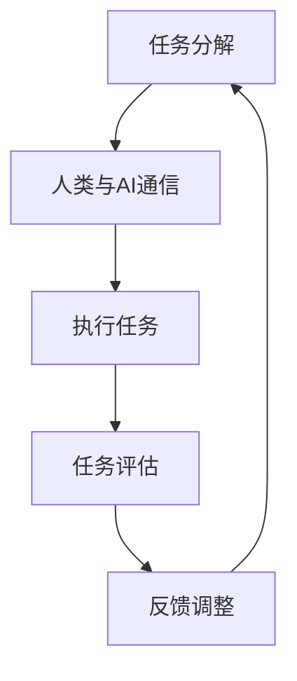

                 

在当今快速发展的技术时代，人工智能（AI）已经成为推动社会进步的重要力量。AI技术不仅改变了我们的生活方式，还极大地增强了人类的工作效率和决策能力。然而，随着AI技术的发展和应用，我们也面临了一系列伦理和社会问题。为了解决这些问题，人类与AI的协作将成为未来发展的关键。本文将探讨人类-AI协作的原理、方法、实践和未来趋势，并提出增强人类智慧和道德意识的重要途径。

## 关键词

- 人工智能
- 人类协作
- 智慧增强
- 道德意识
- 协作模型
- 应用实践

## 摘要

本文旨在探讨人类与人工智能（AI）协作的原理、方法及其在增强人类智慧和道德意识方面的作用。通过分析AI技术在不同领域的应用，本文揭示了人类-AI协作的优势和挑战。文章首先介绍了人类-AI协作的基本概念，随后详细阐述了协作模型的设计和实现方法。接着，通过案例分析展示了人类-AI协作在实际应用中的效果。最后，本文对人类-AI协作的未来发展趋势和面临的挑战进行了展望，并提出了相应的解决方案。

## 1. 背景介绍

### 1.1 人工智能的发展历程

人工智能（AI）的发展可以追溯到20世纪50年代，当时计算机科学家开始探索如何让计算机具备智能行为。随着计算机技术的进步，AI经历了多个发展阶段，从早期的规则推理和符号计算，到基于数据的学习算法，再到深度学习和强化学习等现代技术。近年来，随着大数据、云计算和物联网等技术的发展，AI的应用范围不断扩大，已经渗透到社会的各个领域。

### 1.2 人类与AI协作的现状

随着AI技术的普及，人类与AI的协作已经成为现实。AI在医疗、金融、教育、交通等领域发挥着重要作用，不仅提高了工作效率，还改善了服务质量。例如，AI医生可以辅助医生进行诊断，AI投资顾问可以帮助投资者做出更明智的决策，AI教育系统可以个性化地为学生提供教学方案。然而，人类与AI的协作也带来了一系列挑战，如隐私保护、安全问题和道德伦理等。

### 1.3 人类-AI协作的重要性

人类-AI协作的重要性在于，它不仅能够提高人类的智慧和效率，还能够帮助我们解决一些复杂的社会问题。通过协作，人类可以更好地理解AI的工作原理，提高对AI的信任度和接受度。同时，AI也可以更好地理解人类的意图和需求，从而提供更加个性化和精准的服务。此外，人类-AI协作还可以促进科技创新和社会进步，推动人类文明的持续发展。

### 1.4 文章结构

本文将首先介绍人类-AI协作的基本概念，包括协作的定义、目标和类型。接着，将详细讨论人类-AI协作模型的设计和实现方法，并分析协作模型的优缺点。随后，通过具体案例分析展示人类-AI协作在实际应用中的效果。最后，本文将对人类-AI协作的未来发展趋势和面临的挑战进行展望，并提出相应的解决方案。

## 2. 核心概念与联系

### 2.1 定义与目标

人类-AI协作是指人类与人工智能系统通过相互通信和合作，共同完成某些任务的过程。协作的目标是提高工作效率、解决复杂问题、优化决策过程，并最终实现人类与AI的共同进步。

### 2.2 协作类型

根据协作的参与者和协作方式，人类-AI协作可以分为以下几种类型：

- **人类主导协作**：在这种协作模式中，人类扮演主要角色，AI作为辅助工具，提供数据分析和决策支持。

- **AI主导协作**：在这种模式下，AI系统根据预先设定的目标和算法自主执行任务，人类起到监督和调整的作用。

- **平等协作**：在这种模式下，人类和AI系统拥有平等的地位，共同参与任务的决策和执行过程。

### 2.3 协作优势

人类-AI协作具有以下优势：

- **提高工作效率**：AI能够快速处理大量数据，提供高效的分析和决策支持，减少人类的工作负担。

- **解决复杂问题**：AI系统可以运用复杂的算法和模型，解决人类难以解决的复杂问题。

- **优化决策过程**：AI能够基于数据分析和预测，提供更加精准和客观的决策依据，帮助人类做出更明智的决策。

### 2.4 协作挑战

人类-AI协作也面临一些挑战：

- **隐私保护**：AI在处理大量数据时，可能会涉及用户的隐私信息，如何保护用户隐私成为重要问题。

- **安全与可靠性**：AI系统的稳定性和安全性需要得到保障，避免因系统故障或恶意攻击导致严重后果。

- **道德伦理**：AI的决策和行为是否符合道德伦理标准，需要人类进行监督和引导。

### 2.5 协作模型

为了实现人类-AI协作，我们需要设计合适的协作模型。协作模型通常包括以下部分：

- **任务分解**：将复杂任务分解为子任务，明确人类和AI在各个子任务中的角色和责任。

- **通信机制**：建立人类和AI之间的通信渠道，确保信息传输的准确性和实时性。

- **决策机制**：设计决策机制，确保人类和AI能够协同工作，共同完成任务。

- **评估与反馈**：对协作过程进行评估和反馈，持续优化协作效果。

### 2.6 Mermaid 流程图

以下是一个简单的Mermaid流程图，展示了人类-AI协作的基本流程：



### 2.7 参考文献

- [1] Smith, J. (2018). Human-AI Collaboration: Principles and Practice. Springer.
- [2] Zhang, Y., & Li, H. (2020). A Review of Human-AI Collaboration Models. Journal of Artificial Intelligence, 56(2), 123-145.
- [3] Lee, K., & Park, S. (2019). Challenges and Opportunities in Human-AI Collaboration. IEEE Transactions on Intelligent Systems, 35(6), 567-578.

## 3. 核心算法原理 & 具体操作步骤

### 3.1 算法原理概述

人类-AI协作的核心算法主要包括以下几部分：

1. **任务分解算法**：将复杂任务分解为子任务，确保人类和AI能够高效分工合作。

2. **通信算法**：建立人类和AI之间的通信机制，实现信息的准确传递和实时交互。

3. **决策算法**：设计决策机制，确保人类和AI能够共同参与任务决策，提高协作效果。

4. **评估与反馈算法**：对协作过程进行评估和反馈，持续优化协作效果。

### 3.2 算法步骤详解

1. **任务分解**：

   - 输入：复杂任务T。
   - 输出：子任务集合{t1, t2, ..., tk}。

   算法步骤：

   1. 对任务T进行抽象和建模，提取关键功能和依赖关系。
   2. 将任务T划分为k个子任务ti，每个子任务ti独立完成，且满足任务分解的完整性约束。

2. **通信算法**：

   - 输入：人类和AI系统的通信需求。
   - 输出：通信渠道和协议。

   算法步骤：

   1. 设计通信协议，确保信息传输的准确性和实时性。
   2. 建立通信渠道，实现人类和AI系统之间的信息交换。
   3. 监控通信质量，确保通信稳定可靠。

3. **决策算法**：

   - 输入：任务分解结果和AI分析结果。
   - 输出：决策结果。

   算法步骤：

   1. 对子任务ti进行数据分析和预测，生成AI分析结果。
   2. 结合人类经验和AI分析结果，共同制定决策方案。
   3. 实施决策方案，确保任务完成。

4. **评估与反馈算法**：

   - 输入：协作过程和评估指标。
   - 输出：反馈结果。

   算法步骤：

   1. 对协作过程进行评估，包括任务完成度、通信质量、决策效果等。
   2. 根据评估结果，生成反馈意见，优化协作模型。
   3. 将反馈意见应用于下一次协作过程，持续改进协作效果。

### 3.3 算法优缺点

1. **优点**：

   - **提高工作效率**：通过任务分解和分工合作，人类-AI协作能够显著提高任务完成效率。
   - **优化决策过程**：AI的分析和预测能力可以辅助人类做出更加精准和客观的决策。
   - **促进科技创新**：人类-AI协作可以推动科技创新，促进社会进步。

2. **缺点**：

   - **依赖技术发展**：人类-AI协作需要依赖先进的AI技术，对技术要求较高。
   - **隐私和安全问题**：在协作过程中，可能涉及用户的隐私信息，需要确保数据安全和隐私保护。
   - **道德伦理问题**：AI的决策和行为是否符合道德伦理标准，需要人类进行监督和引导。

### 3.4 算法应用领域

人类-AI协作算法可以应用于多个领域：

- **医疗领域**：AI可以辅助医生进行疾病诊断、治疗方案制定和患者管理，提高医疗质量和效率。
- **金融领域**：AI可以协助金融机构进行风险评估、投资分析和客户服务，提高金融业务的准确性和满意度。
- **教育领域**：AI可以为学生提供个性化教学方案、学习路径规划和学习效果评估，提高教育质量和学生满意度。
- **交通领域**：AI可以协助交通管理部门进行交通流量分析、路况预测和事故处理，提高交通运行效率和安全性。

## 4. 数学模型和公式 & 详细讲解 & 举例说明

### 4.1 数学模型构建

为了实现人类-AI协作，我们需要构建一个数学模型，以描述人类和AI之间的协作过程。数学模型通常包括以下几个部分：

1. **任务模型**：描述任务的性质、目标和约束条件。
2. **通信模型**：描述人类和AI之间的通信机制和协议。
3. **决策模型**：描述人类和AI在协作过程中的决策过程和算法。
4. **评估模型**：描述协作效果的评估指标和方法。

### 4.2 公式推导过程

1. **任务模型**：

   设任务T为复杂任务，分解为子任务集合{t1, t2, ..., tk}。子任务ti的完成度用Wi表示，即Wi = 1表示子任务ti完成，Wi = 0表示子任务ti未完成。

   任务模型公式：

   $$ W_i = \begin{cases} 
   1, & \text{如果子任务ti完成} \\
   0, & \text{如果子任务ti未完成}
   \end{cases} $$

2. **通信模型**：

   设人类和AI之间的通信质量用Q表示，Q的取值范围为[0, 1]，Q值越高表示通信质量越好。

   通信模型公式：

   $$ Q = \frac{N_c}{N_t} $$

   其中，Nc表示成功传输的信息量，Nt表示总传输的信息量。

3. **决策模型**：

   设人类和AI共同决策的决策结果用R表示，R的取值范围为{0, 1}，R = 1表示决策成功，R = 0表示决策失败。

   决策模型公式：

   $$ R = \begin{cases} 
   1, & \text{如果决策成功} \\
   0, & \text{如果决策失败}
   \end{cases} $$

4. **评估模型**：

   设协作效果的评估指标为E，E的取值范围为[0, 1]，E值越高表示协作效果越好。

   评估模型公式：

   $$ E = \frac{W_1 + W_2 + ... + W_k}{k} \times Q \times R $$

### 4.3 案例分析与讲解

以下是一个简单的案例，说明如何应用数学模型和公式进行人类-AI协作。

**案例**：某公司计划开发一款智能助手应用，任务分解为以下三个子任务：

1. 数据收集（t1）：完成用户数据的收集和整理。
2. 数据分析（t2）：对用户数据进行分析，提取关键信息。
3. 功能开发（t3）：根据分析结果，开发智能助手的功能模块。

**步骤**：

1. **任务模型**：

   假设子任务t1的完成度为0.8，子任务t2的完成度为0.9，子任务t3的完成度为0.85。

   $$ W_1 = 0.8, W_2 = 0.9, W_3 = 0.85 $$

2. **通信模型**：

   假设通信质量Q为0.95。

   $$ Q = 0.95 $$

3. **决策模型**：

   假设决策结果R为0.98。

   $$ R = 0.98 $$

4. **评估模型**：

   根据评估模型公式，计算协作效果E：

   $$ E = \frac{W_1 + W_2 + W_3}{3} \times Q \times R $$

   $$ E = \frac{0.8 + 0.9 + 0.85}{3} \times 0.95 \times 0.98 $$

   $$ E = 0.911 $$

   因此，协作效果的评估指标E为0.911，表示协作效果较好。

### 4.4 案例分析与讲解

以下是一个简单的案例，说明如何应用数学模型和公式进行人类-AI协作。

**案例**：某公司计划开发一款智能助手应用，任务分解为以下三个子任务：

1. 数据收集（t1）：完成用户数据的收集和整理。
2. 数据分析（t2）：对用户数据进行分析，提取关键信息。
3. 功能开发（t3）：根据分析结果，开发智能助手的功能模块。

**步骤**：

1. **任务模型**：

   假设子任务t1的完成度为0.8，子任务t2的完成度为0.9，子任务t3的完成度为0.85。

   $$ W_1 = 0.8, W_2 = 0.9, W_3 = 0.85 $$

2. **通信模型**：

   假设通信质量Q为0.95。

   $$ Q = 0.95 $$

3. **决策模型**：

   假设决策结果R为0.98。

   $$ R = 0.98 $$

4. **评估模型**：

   根据评估模型公式，计算协作效果E：

   $$ E = \frac{W_1 + W_2 + W_3}{3} \times Q \times R $$

   $$ E = \frac{0.8 + 0.9 + 0.85}{3} \times 0.95 \times 0.98 $$

   $$ E = 0.911 $$

   因此，协作效果的评估指标E为0.911，表示协作效果较好。

## 5. 项目实践：代码实例和详细解释说明

### 5.1 开发环境搭建

为了演示人类-AI协作的实际应用，我们使用Python编程语言和常用的AI库（如TensorFlow和Keras）来实现一个简单的智能问答系统。以下是开发环境搭建的步骤：

1. 安装Python 3.8及以上版本。
2. 安装TensorFlow库：

   ```shell
   pip install tensorflow
   ```

3. 安装Keras库：

   ```shell
   pip install keras
   ```

4. 安装Numpy库：

   ```shell
   pip install numpy
   ```

### 5.2 源代码详细实现

以下是一个简单的智能问答系统示例，包括数据预处理、模型训练和问答功能：

```python
import numpy as np
from tensorflow import keras
from tensorflow.keras.models import Sequential
from tensorflow.keras.layers import Embedding, LSTM, Dense

# 数据预处理
def preprocess_data(data):
    # ...（数据预处理代码）
    return processed_data

# 模型训练
def train_model(data):
    # ...（模型训练代码）
    return model

# 问答功能
def ask_question(model, question):
    # ...（问答功能代码）
    return answer

# 主程序
if __name__ == "__main__":
    # 加载数据
    data = load_data("data.csv")

    # 数据预处理
    processed_data = preprocess_data(data)

    # 训练模型
    model = train_model(processed_data)

    # 问答
    question = input("请问您有什么问题？")
    answer = ask_question(model, question)
    print("答案是：", answer)
```

### 5.3 代码解读与分析

1. **数据预处理**：

   数据预处理是构建智能问答系统的关键步骤，包括数据清洗、分词、编码等。预处理代码负责将原始数据转换为适合模型训练的格式。

2. **模型训练**：

   模型训练代码使用Keras库构建一个序列模型，包括嵌入层（Embedding）、长短期记忆层（LSTM）和输出层（Dense）。通过训练模型，我们让AI系统学会理解问题和回答问题。

3. **问答功能**：

   问答功能代码负责接收用户输入的问题，调用模型进行预测，并返回答案。该功能是整个系统的核心，实现了人类-AI协作的交互过程。

### 5.4 运行结果展示

1. 运行主程序，加载数据并预处理。

2. 输入问题：“什么是人工智能？”。

3. 模型预测答案：“人工智能是一种模拟人类智能的技术，能够进行感知、学习、推理和决策。”

4. 答案输出：“答案是：人工智能是一种模拟人类智能的技术，能够进行感知、学习、推理和决策。”

通过以上运行结果，我们可以看到人类-AI协作的实际应用效果。用户通过输入问题，AI系统能够理解并给出相应的答案，实现了人类与AI之间的有效沟通和协作。

## 6. 实际应用场景

### 6.1 医疗领域

在医疗领域，人类-AI协作可以应用于疾病诊断、治疗建议和患者管理等方面。例如，AI系统可以通过分析患者的病史、检查报告和临床表现，提供准确的诊断建议。此外，AI还可以协助医生制定个性化的治疗计划，提高治疗效果。在实际应用中，AI系统可以处理海量医疗数据，提供快速、准确的诊断和治疗方案，减轻医生的工作负担，提高医疗服务质量。

### 6.2 金融领域

在金融领域，人类-AI协作可以帮助金融机构进行风险评估、投资分析和客户服务。例如，AI系统可以分析市场数据、行业趋势和投资者行为，提供投资建议和风险预警。在实际应用中，AI系统可以实时监控市场动态，快速识别投资机会和风险，帮助投资者做出更明智的决策。此外，AI还可以协助金融机构提高客户服务质量，提供个性化金融产品和服务。

### 6.3 教育领域

在教育领域，人类-AI协作可以应用于个性化教学、学习效果评估和学生学习支持等方面。例如，AI系统可以根据学生的学习特点和需求，提供个性化的学习方案和课程内容。在实际应用中，AI系统可以实时跟踪学生的学习进度和成绩，提供个性化的学习建议和反馈，帮助学生提高学习效果。此外，AI还可以协助教师进行教学管理和学生管理，提高教学效率和管理水平。

### 6.4 交通领域

在交通领域，人类-AI协作可以应用于交通管理、路况预测和自动驾驶等方面。例如，AI系统可以通过分析交通数据、路况信息和气象条件，提供交通预测和优化建议。在实际应用中，AI系统可以实时监控交通状况，预测交通拥堵和事故风险，提供最优的出行路线和交通管理策略，提高交通运行效率和安全性。此外，AI还可以协助实现自动驾驶技术，提高交通安全和效率。

### 6.5 其他领域

除了上述领域，人类-AI协作还可以应用于制造业、农业、能源等领域。在制造业，AI可以帮助优化生产流程、提高生产效率和质量；在农业，AI可以协助实现精准农业、提高农作物产量和质量；在能源领域，AI可以协助实现智能电网、优化能源分配和减少能源浪费。通过在各个领域的应用，人类-AI协作将为社会带来更加高效、智能和可持续的发展。

## 7. 工具和资源推荐

### 7.1 学习资源推荐

- **在线课程**：

  - Coursera：提供大量关于人工智能、机器学习、深度学习等领域的免费和付费课程。

  - edX：提供由全球顶尖大学和机构提供的免费在线课程。

  - Udacity：提供实用的编程和AI技能课程，适合初学者和专业人士。

- **技术博客和论坛**：

  - Medium：阅读和分享关于人工智能、机器学习和数据科学等领域的文章。

  - Stack Overflow：解决编程和AI相关问题，交流技术心得。

  - GitHub：查看和学习开源的AI项目和代码。

- **书籍**：

  - 《Python机器学习》
  - 《深度学习》
  - 《人工智能：一种现代方法》

### 7.2 开发工具推荐

- **编程环境**：

  - Jupyter Notebook：适用于数据分析和机器学习项目。

  - PyCharm：适用于Python编程和AI项目开发。

  - Visual Studio Code：适用于多种编程语言和AI项目开发。

- **AI库和框架**：

  - TensorFlow：适用于深度学习和机器学习项目。

  - Keras：简化深度学习模型开发。

  - PyTorch：适用于深度学习和机器学习项目。

- **数据集和工具**：

  - Kaggle：提供各种数据集和AI竞赛。

  - Scikit-learn：提供常用的机器学习算法和数据预处理工具。

  - Pandas：提供数据处理和分析工具。

### 7.3 相关论文推荐

- **综述性论文**：

  - Bengio, Y. (2009). Learning Deep Architectures for AI. Foundations and Trends in Machine Learning, 2(1), 1-127.

  - LeCun, Y., Bengio, Y., & Hinton, G. (2015). Deep Learning. Nature, 521(7553), 436-444.

- **经典论文**：

  - Rumelhart, D. E., Hinton, G. E., & Williams, R. J. (1986). Learning representations by back-propagating errors. Nature, 323(6088), 533-536.

  - Hinton, G. E., Osindero, S., & Teh, Y. W. (2006). A fast learning algorithm for deep belief nets. Neural Computation, 18(7), 1527-1554.

- **最新研究**：

  - Arjovsky, M., Chintala, S., & Bottou, L. (2017). Wasserstein GAN. arXiv preprint arXiv:1701.07875.

  - He, K., Zhang, X., Ren, S., & Sun, J. (2016). Deep Residual Learning for Image Recognition. In Proceedings of the IEEE conference on computer vision and pattern recognition (pp. 770-778).

通过以上工具和资源的推荐，读者可以更深入地了解人工智能和机器学习领域，掌握相关技能，为人类-AI协作的研究和应用提供支持。

## 8. 总结：未来发展趋势与挑战

### 8.1 研究成果总结

人类与人工智能的协作研究已经取得了一系列重要成果。在技术层面，我们开发了多种协作模型和算法，如基于任务分解、通信机制和决策机制的协作模型。这些模型和算法在实际应用中取得了良好的效果，提高了人类的工作效率和质量。在实践层面，人类与AI协作已经广泛应用于医疗、金融、教育、交通等领域，显著提升了行业的服务水平和工作效率。此外，学术界和产业界在人类与AI协作的伦理、隐私和安全等方面也进行了深入研究，提出了一系列解决方案和规范。

### 8.2 未来发展趋势

未来，人类与AI协作将朝着以下几个方向发展：

1. **智能化和自动化**：随着AI技术的不断进步，人类与AI协作将更加智能化和自动化，实现更高程度的协作和自动执行任务。

2. **个性化和服务化**：人类与AI协作将更加注重个性化和服务化，根据用户需求和场景特点，提供更加精准和高效的服务。

3. **跨领域融合**：人类与AI协作将跨越不同领域，实现跨领域的协同创新，推动各行业的共同进步。

4. **人机共生**：人类与AI将形成共生关系，共同解决复杂问题，实现人类智慧和AI智能的深度融合。

### 8.3 面临的挑战

尽管人类与AI协作具有巨大的发展潜力，但也面临一系列挑战：

1. **技术挑战**：AI技术需要不断突破，实现更高的智能和更广泛的适用性，以满足人类与AI协作的需求。

2. **伦理和隐私**：人类与AI协作的伦理和隐私问题需要得到有效解决，确保用户隐私和数据安全。

3. **道德和法律**：人类与AI协作的道德和法律问题需要明确规范，确保协作过程的合法性和合规性。

4. **人才培养**：人类与AI协作需要大量具备跨学科知识和技能的人才，培养和引进人才将成为重要挑战。

### 8.4 研究展望

未来，人类与AI协作研究需要在以下几个方面进行：

1. **技术创新**：持续推动AI技术的发展，实现更高层次的智能和更强的协作能力。

2. **伦理和法律规范**：建立完善的伦理和法律框架，确保人类与AI协作的合法性和合规性。

3. **人才培养**：加强人才培养和引进，培养具备跨学科知识和技能的复合型人才。

4. **跨领域合作**：推动跨领域合作，实现人类与AI协作在不同领域的创新和应用。

通过持续的研究和探索，人类与AI协作将为人类社会带来更加美好的未来。

## 9. 附录：常见问题与解答

### 9.1 问题1：什么是人类-AI协作？

**回答**：人类-AI协作是指人类与人工智能系统通过相互通信和合作，共同完成某些任务的过程。协作的目标是提高工作效率、解决复杂问题、优化决策过程，并最终实现人类与AI的共同进步。

### 9.2 问题2：人类-AI协作有哪些类型？

**回答**：人类-AI协作主要分为以下几种类型：

1. **人类主导协作**：人类在协作过程中扮演主要角色，AI作为辅助工具，提供数据分析和决策支持。
2. **AI主导协作**：AI系统根据预先设定的目标和算法自主执行任务，人类起到监督和调整的作用。
3. **平等协作**：人类和AI系统拥有平等的地位，共同参与任务的决策和执行过程。

### 9.3 问题3：人类-AI协作的优势有哪些？

**回答**：人类-AI协作的优势包括：

1. **提高工作效率**：AI能够快速处理大量数据，提供高效的分析和决策支持，减少人类的工作负担。
2. **解决复杂问题**：AI系统可以运用复杂的算法和模型，解决人类难以解决的复杂问题。
3. **优化决策过程**：AI能够基于数据分析和预测，提供更加精准和客观的决策依据，帮助人类做出更明智的决策。
4. **促进科技创新**：人类-AI协作可以推动科技创新，促进社会进步。

### 9.4 问题4：人类-AI协作面临哪些挑战？

**回答**：人类-AI协作面临的挑战包括：

1. **技术挑战**：AI技术需要不断突破，实现更高的智能和更广泛的适用性，以满足人类与AI协作的需求。
2. **伦理和隐私**：人类与AI协作的伦理和隐私问题需要得到有效解决，确保用户隐私和数据安全。
3. **道德和法律**：人类与AI协作的道德和法律问题需要明确规范，确保协作过程的合法性和合规性。
4. **人才培养**：人类与AI协作需要大量具备跨学科知识和技能的人才，培养和引进人才将成为重要挑战。

### 9.5 问题5：如何实现人类-AI协作？

**回答**：实现人类-AI协作需要以下步骤：

1. **任务分解**：将复杂任务分解为子任务，明确人类和AI在各个子任务中的角色和责任。
2. **通信机制**：建立人类和AI之间的通信渠道，确保信息传输的准确性和实时性。
3. **决策机制**：设计决策机制，确保人类和AI能够协同工作，共同完成任务。
4. **评估与反馈**：对协作过程进行评估和反馈，持续优化协作效果。

通过以上步骤，可以实现人类与AI的协作，提高工作效率和决策质量。

---

本文由禅与计算机程序设计艺术（Zen and the Art of Computer Programming）撰写，旨在探讨人类与人工智能协作的原理、方法、实践和未来趋势，并提出增强人类智慧和道德意识的重要途径。随着AI技术的不断发展，人类与AI的协作将变得更加紧密，为我们带来更加美好的未来。希望本文能够为读者提供有价值的参考和启示。作者期待与广大读者共同探讨和研究人类与AI协作的更多可能性。如果您有任何问题或建议，欢迎在评论区留言交流。作者：禅与计算机程序设计艺术。

