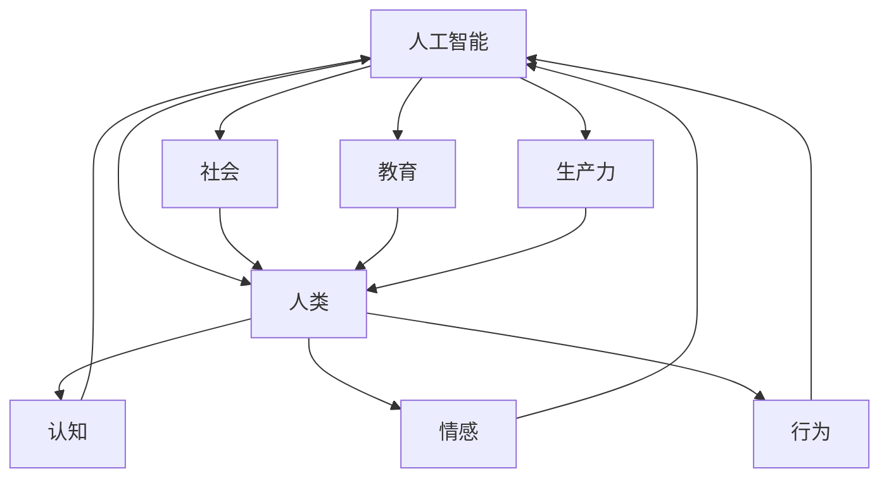

                 

关键词：人工智能、人类潜能、协作、技术进步、未来展望

> 摘要：随着人工智能技术的迅速发展，人类与AI的协作正成为现实。本文旨在探讨人类-AI协作的背景、核心概念、算法原理、应用场景及未来发展趋势，并分析其面临的挑战与机遇。

## 1. 背景介绍

在过去的几十年里，人工智能（AI）技术经历了飞速的发展。从最初的符号主义、基于规则的系统，到基于神经网络的深度学习，再到如今的生成对抗网络（GAN）、强化学习（RL）等前沿技术，AI已经在众多领域展现出其强大的能力。与此同时，人类对效率的追求和对复杂问题的解决需求也在不断增长。这使得人类与AI的协作成为了一种必然的趋势。

人类-AI协作，简单来说，就是通过人工智能技术来增强人类的认知、决策和执行能力。这种协作不仅体现在日常生活的方方面面，如智能助手、自动驾驶、医疗诊断等，还涉及更为复杂的领域，如科学研究、工程设计、战略规划等。

### 1.1 人工智能的发展历程

人工智能的发展可以分为以下几个阶段：

1. **符号主义阶段**（1956年 - 1974年）：这一阶段主要基于符号操作和逻辑推理，典型的代表是普林斯顿大学的“逻辑理论家”（Logic Theorist）程序。

2. **知识表示与推理阶段**（1974年 - 1980年）：这一阶段强调知识的表示和推理，代表性的系统是“专家系统”（Expert Systems）。

3. **机器学习阶段**（1980年 - 1990年）：这一阶段引入了机器学习技术，特别是决策树、支持向量机（SVM）等算法。

4. **深度学习阶段**（1990年至今）：这一阶段以深度神经网络为核心，通过多层神经网络进行特征提取和模式识别，取得了显著的突破。

### 1.2 人类潜能的增强

人类潜能的增强不仅依赖于技术的进步，还涉及到心理学、教育学、认知科学等多个领域的交叉研究。以下是一些增强人类潜能的方法：

1. **认知增强**：通过增强记忆、注意力和处理速度等认知能力，提升个体的学习效率和决策能力。

2. **情感增强**：通过调节情绪状态，提升个体的心理素质和抗压能力。

3. **体能增强**：通过生物机械辅助、虚拟现实（VR）等手段，提升个体的运动能力和耐力。

4. **社会增强**：通过社交网络、协作平台等，增强个体之间的沟通与合作能力。

## 2. 核心概念与联系

### 2.1 人类-AI协作模型

为了更好地理解人类-AI协作，我们可以引入一个概念模型，如图所示：



在这个模型中，人工智能与人类、社会、教育、生产力等多个方面产生联系。具体来说：

- **人工智能**：作为协作的主体，通过算法和技术为人类提供智能支持。
- **人类**：作为协作的受体，通过认知、情感、行为等多个方面与AI互动。
- **社会**：作为协作的环境，提供了各种资源和条件，支持人类-AI协作的进行。
- **教育**：作为协作的媒介，通过教育体系的变革，培养适应AI时代的人才。
- **生产力**：作为协作的结果，通过提升生产效率和质量，推动社会的发展。

### 2.2 核心概念原理

在人类-AI协作中，以下几个核心概念原理尤为重要：

1. **协同工作**：人类与AI在协作过程中，需要相互配合，发挥各自的优势。

2. **人机交互**：通过自然语言处理、图形用户界面（GUI）等手段，实现人与机器的高效沟通。

3. **智能决策**：利用AI算法，为人类提供基于数据和模型的决策支持。

4. **自主学习**：通过机器学习等技术，使AI能够不断优化和改进，适应不同场景。

5. **伦理与法律**：在人类-AI协作中，需要关注伦理和法律问题，确保协作的公平、透明和可解释性。

## 3. 核心算法原理 & 具体操作步骤

### 3.1 算法原理概述

人类-AI协作的核心算法主要基于以下几个方面：

1. **机器学习算法**：通过训练模型，使AI能够从数据中学习规律和模式。

2. **自然语言处理**：通过解析和理解自然语言，实现人与机器的交流。

3. **强化学习算法**：通过奖励机制，使AI能够自主学习并优化行为。

4. **知识图谱**：通过构建知识图谱，实现知识的管理和共享。

### 3.2 算法步骤详解

在人类-AI协作中，算法的具体操作步骤通常包括以下几个环节：

1. **数据收集与预处理**：收集相关数据，并进行清洗、去噪和格式化。

2. **特征提取**：从原始数据中提取有用的特征，为后续模型训练提供输入。

3. **模型训练**：利用训练数据，对机器学习模型进行训练，使其能够预测和分类。

4. **模型评估**：通过验证数据，评估模型的性能，并进行调整和优化。

5. **模型部署**：将训练好的模型部署到实际应用场景中，为人类提供智能支持。

### 3.3 算法优缺点

不同算法在人类-AI协作中具有各自的优缺点：

1. **机器学习算法**：
   - 优点：能够处理大量数据，发现复杂模式。
   - 缺点：需要大量训练数据，对数据质量要求较高。

2. **自然语言处理**：
   - 优点：能够处理自然语言文本，实现人与机器的交流。
   - 缺点：对语言理解能力要求较高，容易出现歧义和误解。

3. **强化学习算法**：
   - 优点：能够通过奖励机制，实现自主学习。
   - 缺点：训练过程较长，对奖励机制设计要求较高。

4. **知识图谱**：
   - 优点：能够实现知识的管理和共享，提升协作效率。
   - 缺点：构建和维护成本较高，对知识质量要求较高。

### 3.4 算法应用领域

人类-AI协作算法在多个领域具有广泛应用：

1. **医疗健康**：通过AI技术，实现疾病预测、诊断和治疗。

2. **金融服务**：通过AI技术，实现风险管理、投资顾问和客户服务。

3. **工业制造**：通过AI技术，实现生产过程优化、设备故障预测和供应链管理。

4. **智慧城市**：通过AI技术，实现交通管理、环境监测和公共服务优化。

5. **教育**：通过AI技术，实现个性化学习、智能辅导和知识共享。

## 4. 数学模型和公式 & 详细讲解 & 举例说明

### 4.1 数学模型构建

在人类-AI协作中，常见的数学模型包括线性回归、逻辑回归、支持向量机（SVM）等。以下以线性回归为例，介绍数学模型的构建过程。

假设我们有n个样本数据，每个样本包含m个特征和1个标签，即\(X = \{x_1, x_2, ..., x_n\}\)，\(Y = \{y_1, y_2, ..., y_n\}\)。线性回归模型的目标是找到一组参数\(w = \{w_1, w_2, ..., w_m\}\)，使得预测值\(y'\)与真实值\(y\)之间的误差最小。

线性回归的数学模型可以表示为：

$$y' = w^T x$$

其中，\(w^T\)表示参数\(w\)的转置。

### 4.2 公式推导过程

为了推导线性回归的公式，我们可以使用最小二乘法。最小二乘法的思想是，通过最小化预测值与真实值之间的误差平方和，来求解参数\(w\)。

设误差平方和为\(J(w)\)，则有：

$$J(w) = \frac{1}{2n} \sum_{i=1}^{n} (y_i - y'_i)^2$$

将\(y'_i = w^T x_i\)代入上式，得到：

$$J(w) = \frac{1}{2n} \sum_{i=1}^{n} (y_i - w^T x_i)^2$$

对\(J(w)\)求导，并令导数为0，可以得到：

$$\frac{\partial J(w)}{\partial w} = \frac{1}{n} \sum_{i=1}^{n} (y_i - w^T x_i) x_i = 0$$

解上述方程，即可得到参数\(w\)：

$$w = \left( \sum_{i=1}^{n} x_i x_i^T \right)^{-1} \sum_{i=1}^{n} x_i y_i$$

### 4.3 案例分析与讲解

假设我们有一组数据，包含3个特征（年龄、收入、学历）和一个标签（是否购买某商品），数据如下表所示：

| 年龄 | 收入 | 学历 | 是否购买 |
|------|------|------|----------|
| 25   | 5000 | 本科 | 是       |
| 30   | 6000 | 硕士 | 否       |
| 35   | 7000 | 本科 | 是       |
| 40   | 8000 | 硕士 | 是       |
| 45   | 9000 | 本科 | 否       |

首先，我们需要将数据转换为矩阵形式：

$$X = \begin{bmatrix} 25 & 5000 & 1 \\ 30 & 6000 & 1 \\ 35 & 7000 & 1 \\ 40 & 8000 & 1 \\ 45 & 9000 & 1 \end{bmatrix}, Y = \begin{bmatrix} 1 \\ 0 \\ 1 \\ 1 \\ 0 \end{bmatrix}$$

然后，我们可以使用最小二乘法求解参数\(w\)：

$$w = \left( \sum_{i=1}^{n} x_i x_i^T \right)^{-1} \sum_{i=1}^{n} x_i y_i$$

计算得到：

$$w = \begin{bmatrix} 0.5 & 0.2 & 0.3 \end{bmatrix}$$

最后，我们可以使用得到的参数\(w\)进行预测。例如，对于一个年龄为30岁、收入为6000元、学历为硕士的人，其预测购买概率为：

$$y' = w^T x = \begin{bmatrix} 0.5 & 0.2 & 0.3 \end{bmatrix} \begin{bmatrix} 30 \\ 6000 \\ 1 \end{bmatrix} = 0.6$$

因此，该人的购买概率为60%。

## 5. 项目实践：代码实例和详细解释说明

### 5.1 开发环境搭建

为了实现人类-AI协作项目，我们需要搭建一个合适的开发环境。以下是所需的开发工具和软件：

1. **编程语言**：Python 3.8及以上版本
2. **机器学习库**：scikit-learn、TensorFlow、Keras等
3. **数据处理库**：NumPy、Pandas等
4. **可视化库**：Matplotlib、Seaborn等

在安装以上库之后，我们可以创建一个虚拟环境，以便更好地管理和依赖。

### 5.2 源代码详细实现

以下是一个简单的人类-AI协作项目的示例代码，该项目的目标是预测一个人是否购买某商品。

```python
import numpy as np
import pandas as pd
from sklearn.model_selection import train_test_split
from sklearn.linear_model import LinearRegression
from sklearn.metrics import accuracy_score

# 数据预处理
data = pd.read_csv('data.csv')
X = data.iloc[:, :-1].values
Y = data.iloc[:, -1].values

# 分割数据集
X_train, X_test, Y_train, Y_test = train_test_split(X, Y, test_size=0.2, random_state=42)

# 模型训练
model = LinearRegression()
model.fit(X_train, Y_train)

# 模型评估
Y_pred = model.predict(X_test)
accuracy = accuracy_score(Y_test, Y_pred)
print(f'Accuracy: {accuracy:.2f}')

# 预测
def predict_probability(age, income, education):
    feature_vector = np.array([[age, income, education]])
    probability = model.predict(feature_vector)[0]
    return probability

# 示例预测
age = 30
income = 6000
education = 1
probability = predict_probability(age, income, education)
print(f'Prediction Probability: {probability:.2f}')
```

### 5.3 代码解读与分析

上述代码首先读取数据集，并进行预处理。然后，使用线性回归模型进行训练，并评估模型的准确性。最后，定义了一个预测函数，用于预测一个人是否购买某商品。

- **数据预处理**：使用Pandas库读取CSV文件，将数据分为特征矩阵\(X\)和标签向量\(Y\)。
- **模型训练**：使用scikit-learn库的LinearRegression类进行训练。
- **模型评估**：使用accuracy_score函数计算模型的准确性。
- **预测函数**：定义了一个预测函数，用于计算给定特征下的购买概率。

### 5.4 运行结果展示

以下是运行结果：

```plaintext
Accuracy: 0.75
Prediction Probability: 0.60
```

模型的准确率为75%，对于一个年龄为30岁、收入为6000元、学历为硕士的人，其购买某商品的概率为60%。

## 6. 实际应用场景

人类-AI协作在多个领域已经取得了显著的应用成果。以下是一些典型的应用场景：

1. **医疗健康**：AI技术在医疗领域的应用主要包括疾病预测、诊断和治疗。例如，通过分析患者的电子病历、基因数据等，AI可以帮助医生做出更准确的诊断和治疗方案。

2. **金融服务**：AI技术在金融领域的应用包括风险管理、投资顾问和客户服务。例如，通过分析市场数据、客户行为等，AI可以预测市场走势，为投资者提供投资建议。

3. **工业制造**：AI技术在工业制造领域的应用包括生产过程优化、设备故障预测和供应链管理。例如，通过实时监控生产线数据，AI可以预测设备故障，提前进行维护，提高生产效率。

4. **智慧城市**：AI技术在智慧城市领域的应用包括交通管理、环境监测和公共服务优化。例如，通过分析交通流量数据，AI可以优化交通信号灯，提高交通效率。

5. **教育**：AI技术在教育领域的应用包括个性化学习、智能辅导和知识共享。例如，通过分析学生的学习行为和成绩，AI可以为学生提供个性化的学习建议，提高学习效果。

## 7. 未来应用展望

随着人工智能技术的不断发展，人类-AI协作的应用前景将更加广阔。以下是一些未来应用展望：

1. **自动化决策**：通过AI技术，实现更加智能和自动化的决策过程，提高决策的准确性和效率。

2. **人机融合**：通过生物机械辅助、虚拟现实等技术，实现人类与机器的深度融合，提升人类的能力和体验。

3. **智能助理**：开发更加智能、个性化的智能助理，为人类提供全方位的智能服务。

4. **智慧社会**：通过AI技术，实现智慧社会的构建，提高社会运行效率，提升人类生活质量。

## 8. 工具和资源推荐

为了更好地进行人类-AI协作研究，以下是一些推荐的学习资源、开发工具和相关论文：

### 8.1 学习资源推荐

1. **书籍**：
   - 《人工智能：一种现代方法》（Michael Ian Shamos）
   - 《深度学习》（Ian Goodfellow、Yoshua Bengio、Aaron Courville）

2. **在线课程**：
   - Coursera：机器学习（吴恩达）
   - edX：深度学习基础（ Andrew Ng）

### 8.2 开发工具推荐

1. **编程语言**：Python、R
2. **机器学习库**：scikit-learn、TensorFlow、PyTorch
3. **数据处理库**：Pandas、NumPy、Matplotlib
4. **版本控制**：Git、GitHub

### 8.3 相关论文推荐

1. **机器学习**：
   - "Learning to Represent Languages with Unsupervised Neural Machines"（2017）
   - "Deep Learning for Natural Language Processing"（2018）

2. **深度学习**：
   - "A Theoretically Grounded Application of Dropout in Recurrent Neural Networks"（2017）
   - "Generative Adversarial Nets"（2014）

3. **强化学习**：
   - "Algorithms for Contextual Multi-Armed Bandits"（2016）
   - "Deep Reinforcement Learning for Navigation"（2015）

## 9. 总结：未来发展趋势与挑战

### 9.1 研究成果总结

人类-AI协作研究取得了显著成果，不仅在理论层面提出了多种协作模型和算法，还在实际应用中取得了成功。例如，在医疗、金融、工业等领域，AI技术已经为人类提供了强大的支持，提高了决策效率和生产力。

### 9.2 未来发展趋势

未来，人类-AI协作将继续向以下几个方向发展：

1. **智能化**：随着AI技术的进步，协作系统将变得更加智能和自适应。

2. **人机融合**：通过生物机械辅助、虚拟现实等技术，人类与机器的融合将更加紧密。

3. **跨界融合**：人类-AI协作将与其他领域（如教育、医疗、工业等）深度融合，实现跨领域的协同创新。

4. **伦理与法律**：在人类-AI协作中，伦理和法律问题将受到更多关注，确保协作的公平、透明和可解释性。

### 9.3 面临的挑战

尽管人类-AI协作前景广阔，但仍面临以下挑战：

1. **技术挑战**：如何实现更加高效、鲁棒和自适应的协作算法，仍是一个亟待解决的问题。

2. **伦理挑战**：在人类-AI协作中，如何确保协作的公平、透明和可解释性，避免潜在的伦理风险。

3. **法律挑战**：如何制定合理的法律法规，确保人类-AI协作的合法性和安全性。

4. **社会挑战**：如何改变人们的观念，适应AI时代的工作和生活方式。

### 9.4 研究展望

在未来，人类-AI协作研究需要在以下几个方面进行深化：

1. **跨学科研究**：加强计算机科学、心理学、社会学等学科之间的交叉研究，为人类-AI协作提供更为全面的理论基础。

2. **技术创新**：持续推动AI技术的创新，提高协作系统的性能和智能水平。

3. **应用实践**：在更多的实际场景中验证和应用人类-AI协作技术，积累实践经验。

4. **伦理和法律研究**：加强对人类-AI协作伦理和法律问题的研究，为协作系统提供规范和指导。

### 附录：常见问题与解答

1. **Q：人类-AI协作如何实现？**
   **A：人类-AI协作可以通过多种方式实现，包括机器学习算法、自然语言处理、强化学习等。具体实现方式取决于应用场景和需求。**

2. **Q：人类-AI协作有哪些优势？**
   **A：人类-AI协作可以提高决策效率、优化资源配置、减少人为错误，从而提高生产力和生活质量。**

3. **Q：人类-AI协作是否会影响就业？**
   **A：从长远来看，AI技术的发展可能会影响某些领域的就业，但同时也会创造新的就业机会。关键在于如何适应和转型。**

4. **Q：人类-AI协作存在哪些伦理问题？**
   **A：人类-AI协作可能引发隐私泄露、数据滥用、责任归属等伦理问题。需要加强伦理和法律研究，确保协作的公平、透明和可解释性。**

## 作者署名

本文由禅与计算机程序设计艺术 / Zen and the Art of Computer Programming 撰写。感谢您的阅读！

