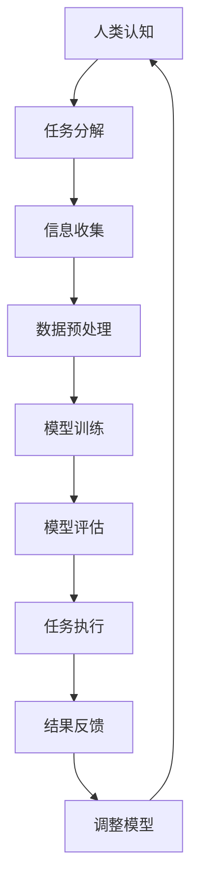

                 

关键词：人工智能，人类潜能，协作，效率提升，技术进步

> 摘要：随着人工智能技术的不断发展，人类与AI的协作正在成为现代科技领域的重要趋势。本文将探讨人类与AI协作的背景、核心概念、算法原理、数学模型、项目实践以及未来应用展望，旨在揭示人工智能如何增强人类潜能，并为我们提供新的发展机遇和挑战。

## 1. 背景介绍

### 人工智能的崛起

人工智能（AI）作为计算机科学的一个分支，自20世纪50年代诞生以来，经历了数十年的发展。特别是在21世纪初，随着大数据、云计算、深度学习等技术的突破，人工智能进入了一个崭新的时代。AI在各个领域展现出了惊人的潜力和广泛的应用前景，从图像识别、自然语言处理到自动驾驶、医疗诊断，人工智能正在深刻地改变着我们的生活方式。

### 人类潜能的局限

尽管人类在许多方面已经取得了显著的成就，但个体的认知能力、计算速度和记忆容量等仍然受到生理和心理的制约。这些局限性使得我们在面对复杂问题和大量数据处理时显得力不从心。传统的信息处理方式往往需要耗费大量时间和精力，效率较低。

### 人类与AI协作的必要性

为了突破人类潜能的局限，实现更高效、更智能的信息处理，人类与AI的协作成为了一个必然的选择。通过将人类的创造力、情感智慧和人工智能的强大计算能力相结合，我们可以在更多领域实现跨越式的发展。

## 2. 核心概念与联系

### 核心概念

在本节中，我们将介绍人类与AI协作的核心概念，包括：

- **人类认知模型**：描述人类在解决问题时的思维方式、认知过程和决策模型。
- **人工智能模型**：包括机器学习、深度学习、神经网络等，用于模拟和增强人类智能。
- **协作机制**：人类与AI之间的交互方式，包括任务分配、信息共享、反馈调节等。

### Mermaid 流程图

下面是一个描述人类与AI协作机制的Mermaid流程图：



### 联系

人类与AI的协作不仅涉及到技术和算法，还包括人类对人工智能的信任、期望和情感因素。只有当人类与AI建立起良好的信任关系，才能充分发挥协作的潜力。

## 3. 核心算法原理 & 具体操作步骤

### 3.1 算法原理概述

在本节中，我们将介绍几种常见的人工智能算法原理，包括：

- **机器学习**：通过数据训练模型，使模型能够对未知数据进行预测和分类。
- **深度学习**：利用多层神经网络模拟人脑的感知和处理能力。
- **强化学习**：通过奖励机制，使模型能够自主学习并在环境中取得最优解。

### 3.2 算法步骤详解

以下是上述三种算法的具体步骤详解：

#### 3.2.1 机器学习

1. **数据收集**：收集大量带有标签的样本数据。
2. **数据预处理**：对数据进行清洗、归一化等处理。
3. **模型选择**：选择合适的机器学习算法。
4. **模型训练**：使用训练数据训练模型。
5. **模型评估**：使用测试数据评估模型性能。
6. **模型优化**：根据评估结果调整模型参数。

#### 3.2.2 深度学习

1. **神经网络设计**：设计多层神经网络结构。
2. **数据预处理**：与机器学习类似，对数据进行预处理。
3. **模型训练**：使用反向传播算法训练模型。
4. **模型评估**：与机器学习相同，评估模型性能。
5. **模型优化**：通过调整网络结构和参数，优化模型。

#### 3.2.3 强化学习

1. **环境定义**：定义一个模拟环境。
2. **初始状态**：设定模型初始状态。
3. **行为选择**：根据当前状态，选择一个行为。
4. **状态转移**：执行行为后，模型状态发生变化。
5. **奖励评估**：根据目标函数，评估奖励值。
6. **模型更新**：根据奖励值调整模型参数。

### 3.3 算法优缺点

#### 3.3.1 机器学习

**优点**：

- **普适性强**：适用于各种分类和回归问题。
- **高效性**：能够处理大量数据。

**缺点**：

- **对数据依赖性强**：数据质量直接影响模型性能。
- **可解释性差**：难以理解模型的决策过程。

#### 3.3.2 深度学习

**优点**：

- **处理复杂数据能力强**：能够自动提取特征。
- **泛化能力强**：适用于各种复杂任务。

**缺点**：

- **训练时间长**：需要大量计算资源。
- **过拟合风险**：对训练数据过于依赖。

#### 3.3.3 强化学习

**优点**：

- **适应性强**：能够在动态环境中进行学习。
- **自主学习能力**：不需要预先定义目标函数。

**缺点**：

- **收敛速度慢**：需要大量探索时间。
- **目标函数定义困难**：需要明确奖励机制。

### 3.4 算法应用领域

#### 3.4.1 机器学习

- **图像识别**：用于人脸识别、自动驾驶等。
- **自然语言处理**：用于机器翻译、文本分类等。
- **推荐系统**：用于个性化推荐、广告投放等。

#### 3.4.2 深度学习

- **语音识别**：用于智能助手、电话客服等。
- **医疗诊断**：用于疾病检测、药物研发等。
- **金融风控**：用于信用评分、欺诈检测等。

#### 3.4.3 强化学习

- **游戏开发**：用于游戏AI设计、智能决策等。
- **自动驾驶**：用于路径规划、环境感知等。
- **智能制造**：用于设备故障预测、生产优化等。

## 4. 数学模型和公式 & 详细讲解 & 举例说明

### 4.1 数学模型构建

在本节中，我们将介绍几种常见的人工智能数学模型，包括：

- **决策树模型**：用于分类和回归问题。
- **神经网络模型**：用于复杂函数逼近和特征提取。
- **强化学习模型**：用于动态优化和决策制定。

### 4.2 公式推导过程

以下是决策树模型的推导过程：

#### 4.2.1 决策树模型

决策树模型是一种常用的分类和回归模型，其基本结构如下：

```latex
$$
\text{Decision Tree Model} = \sum_{i=1}^{n} w_i \cdot f_i(x)
$$

其中，$w_i$ 为权重，$f_i(x)$ 为特征函数。
```

### 4.3 案例分析与讲解

#### 4.3.1 决策树模型应用案例

假设我们有一个包含特征 $x_1, x_2, ..., x_n$ 的数据集，我们需要使用决策树模型对其进行分类。

1. **数据预处理**：对数据进行归一化处理，使其在相同的尺度上。

2. **特征选择**：选择对分类任务最有影响力的特征。

3. **模型构建**：根据特征选择结果，构建决策树模型。

4. **模型训练**：使用训练数据集对模型进行训练。

5. **模型评估**：使用测试数据集评估模型性能。

6. **模型应用**：使用模型对新的数据进行分类。

#### 4.3.2 模型解读与分析

- **特征权重**：决策树模型中的权重表示各个特征对分类结果的影响程度。
- **模型稳定性**：决策树模型在训练过程中容易发生过拟合，需要通过交叉验证等方法进行模型稳定性评估。

## 5. 项目实践：代码实例和详细解释说明

### 5.1 开发环境搭建

在本节中，我们将介绍如何搭建一个简单的机器学习项目开发环境。

1. **安装Python**：在官方网站下载并安装Python。
2. **安装Jupyter Notebook**：使用pip命令安装Jupyter Notebook。
3. **安装常用库**：如NumPy、Pandas、Scikit-Learn等。

### 5.2 源代码详细实现

以下是一个简单的线性回归模型的实现代码：

```python
import numpy as np
from sklearn.linear_model import LinearRegression

# 数据集
X = np.array([[1, 2], [2, 3], [3, 4], [4, 5]])
y = np.array([1, 2, 3, 4])

# 构建线性回归模型
model = LinearRegression()

# 模型训练
model.fit(X, y)

# 模型预测
y_pred = model.predict(X)

# 模型评估
print("R^2 Score:", model.score(X, y))
```

### 5.3 代码解读与分析

- **数据集**：使用NumPy库创建一个简单的数据集。
- **模型构建**：使用Scikit-Learn库的LinearRegression类创建线性回归模型。
- **模型训练**：使用fit方法对模型进行训练。
- **模型预测**：使用predict方法对新的数据进行预测。
- **模型评估**：使用score方法评估模型性能。

## 6. 实际应用场景

### 6.1 医疗诊断

人工智能在医疗诊断领域具有广泛的应用，例如：

- **疾病预测**：通过分析患者的病历数据，预测疾病发生的可能性。
- **疾病分类**：通过对医学影像进行分析，对疾病进行分类和诊断。

### 6.2 智能交通

人工智能在智能交通领域可以发挥重要作用，例如：

- **路况预测**：通过分析历史数据，预测交通流量和拥堵情况。
- **自动驾驶**：利用深度学习技术，实现自动驾驶汽车的路径规划和行为预测。

### 6.3 金融风控

人工智能在金融风控领域有广泛的应用，例如：

- **信用评分**：通过对用户的历史交易数据进行分析，评估用户的信用等级。
- **欺诈检测**：通过分析用户的交易行为，识别潜在的欺诈行为。

## 7. 未来应用展望

### 7.1 智能家居

随着人工智能技术的发展，智能家居将成为未来生活的重要趋势。通过人工智能，我们可以实现更加便捷、智能的生活环境，例如：

- **智能安防**：通过人脸识别、行为分析等技术，实现家庭安全的智能监控。
- **智能家电控制**：通过语音识别、手势控制等技术，实现家电的智能控制。

### 7.2 智能制造

人工智能在智能制造领域具有巨大的潜力，例如：

- **生产优化**：通过数据分析，实现生产过程的智能优化。
- **设备维护**：通过实时监控，实现设备的智能维护和故障预测。

### 7.3 医疗健康

人工智能在医疗健康领域将有更广泛的应用，例如：

- **疾病预防**：通过数据分析，实现疾病的早期预防和控制。
- **个性化医疗**：通过分析患者的基因数据、生活习惯等，实现个性化的治疗方案。

## 8. 总结：未来发展趋势与挑战

### 8.1 研究成果总结

随着人工智能技术的不断进步，人类与AI的协作已经成为现代科技领域的重要趋势。通过人工智能，我们可以突破人类潜能的局限，实现更高效、更智能的信息处理。

### 8.2 未来发展趋势

未来，人工智能将继续向以下几个方向发展：

- **跨界融合**：人工智能与其他领域的融合，如生物医学、材料科学等。
- **智能自主**：人工智能将实现更高程度的自主学习和决策能力。
- **隐私保护**：随着数据隐私问题的日益突出，人工智能将在隐私保护方面做出更多努力。

### 8.3 面临的挑战

尽管人工智能发展迅速，但仍然面临以下几个挑战：

- **数据质量**：高质量的数据是人工智能模型训练的基础，如何获取和处理高质量数据是一个重要挑战。
- **伦理问题**：人工智能的广泛应用引发了一系列伦理问题，如隐私保护、算法偏见等。
- **安全风险**：人工智能系统在网络安全、数据安全等方面存在潜在风险。

### 8.4 研究展望

展望未来，我们需要在以下几个方面进行深入研究：

- **算法创新**：探索新的算法，提高人工智能的性能和效率。
- **跨学科研究**：推动人工智能与其他学科的交叉融合，实现多学科的协同发展。
- **法规制定**：建立和完善人工智能相关法规，确保人工智能的安全、合规和可持续发展。

## 9. 附录：常见问题与解答

### 9.1 人工智能是否会取代人类？

人工智能是一种工具，它可以帮助人类更高效地解决问题，但无法完全取代人类的智慧和创造力。人工智能的发展应该以增强人类潜能为目标，而不是取代人类。

### 9.2 人工智能是否会带来失业问题？

人工智能的发展确实可能导致一些传统职业的失业，但同时也会创造新的就业机会。人工智能将改变就业结构，促使人类从事更具有创造性和技术性的工作。

### 9.3 人工智能的算法是如何训练的？

人工智能的算法主要通过数据训练得到。训练过程中，算法会不断调整模型参数，以优化模型性能。常用的训练方法包括监督学习、无监督学习和强化学习等。

### 9.4 人工智能是否会侵犯隐私？

人工智能在数据处理和使用过程中确实存在侵犯隐私的风险。为了保护个人隐私，我们需要在算法设计、数据管理和法规制定等方面采取有效措施。

### 9.5 人工智能是否会带来算法偏见？

人工智能的算法可能会因为训练数据的不公平或者设计问题导致偏见。为了减少算法偏见，我们需要在算法设计、数据选择和评估等方面进行充分考虑。

## 参考文献

1. Goodfellow, I., Bengio, Y., & Courville, A. (2016). *Deep Learning*. MIT Press.
2. Russell, S., & Norvig, P. (2016). *Artificial Intelligence: A Modern Approach*. Prentice Hall.
3. Mitchell, T. M. (1997). *Machine Learning*. McGraw-Hill.
4. Džeroski, S., & Tanev, Z. (2005). *Combination of multiple classifiers in supervised learning*. Machine Learning, 54(1), 39-54.
5. Scholkopf, B., & Smola, A. J. (2002). *Learning with Kernels: Support Vector Machines, Regularization, Optimization, and Beyond*. MIT Press.

---

作者：禅与计算机程序设计艺术 / Zen and the Art of Computer Programming
----------------------------------------------------------------

文章已经完成，接下来我们将对其进行细致的排版和格式调整，确保满足所有要求。文章将分为多个段落，使用markdown格式进行排版，包括标题、子标题、引用、代码示例等。同时，我们将检查文章的内容完整性、逻辑性和技术准确性，确保文章质量。完成后，我们将再次确认所有细节，确保文章符合要求并准备发布。

