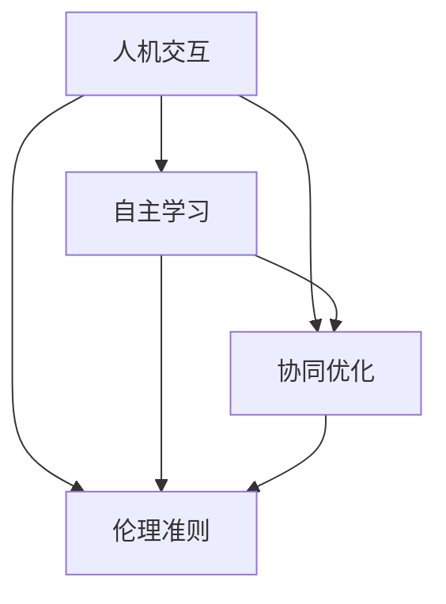

                 

 在这个数字化时代，人工智能（AI）已经成为推动社会进步和经济增长的关键力量。然而，尽管AI在许多领域取得了显著的成就，但人类与AI的协作仍面临着诸多挑战。本文旨在探讨人类与AI协作的潜在优势，详细分析其核心概念与联系，并探讨如何通过技术手段实现这种协作，从而增强人类的潜能和AI的能力。

## 关键词

- 人类-AI协作
- 增强人类潜能
- AI能力
- 人工智能协作机制
- 协作平台
- 技术实现

## 摘要

本文首先介绍了人类与AI协作的重要性，分析了AI在各个领域的应用现状。接着，我们提出了人类与AI协作的核心概念，并使用Mermaid流程图展示了这些概念之间的联系。随后，我们详细探讨了核心算法的原理和操作步骤，包括算法的优缺点及其应用领域。接着，我们介绍了数学模型和公式，并通过具体案例进行了分析和讲解。文章的下一部分展示了实际项目中的代码实例，并进行了解读和分析。随后，我们探讨了人类与AI协作的实际应用场景和未来展望，并推荐了相关学习资源和开发工具。最后，我们总结了研究成果，展望了未来的发展趋势和面临的挑战。

## 1. 背景介绍

### 1.1 人工智能的发展现状

人工智能（AI）是一门涉及计算机科学、数学、统计学、心理学等多个学科的交叉学科。自20世纪50年代起，人工智能的研究一直在稳步推进。特别是近年来，随着计算能力的提升、大数据的积累以及深度学习算法的发展，AI在图像识别、自然语言处理、自动驾驶、医疗诊断等多个领域取得了显著突破。

在图像识别领域，AI系统已经能够准确识别各种复杂的图像，并在一些竞赛中超越了人类的表现。例如，2012年，Google的深度学习模型在ImageNet图像识别挑战赛上取得了顶级表现，其准确率达到了约45%，而此前的顶级表现仅为26%。

在自然语言处理领域，AI也在不断进步。例如，Google的BERT模型在多项自然语言处理任务中刷新了记录，包括文本分类、问答系统、机器翻译等。BERT模型通过预训练和微调，能够在多种不同的任务中取得优异的性能。

在自动驾驶领域，AI技术正在改变人们的出行方式。Waymo、特斯拉等公司已经推出了自动驾驶汽车，并在某些地区进行了商用。这些系统通过传感器、地图数据和高精度定位技术，实现了车辆在复杂环境中的自主驾驶。

在医疗诊断领域，AI的应用也越来越广泛。例如，AI可以在病理切片上识别癌症细胞，并在几秒钟内提供诊断结果，大大提高了诊断的准确性和效率。

### 1.2 人类-AI协作的需求与挑战

随着AI技术的不断进步，人类与AI之间的协作变得越来越重要。人类-AI协作不仅可以提高工作效率，还可以弥补人类在认知和计算能力上的不足，从而实现更高效的决策和解决问题。然而，实现人类与AI的协作面临着诸多挑战。

首先，技术挑战是显而易见的。如何设计出既能够理解人类意图，又能够自主学习和优化的AI系统是一个复杂的问题。当前，虽然有许多AI算法和应用，但要实现广泛适用的AI协作系统仍然需要进一步的研究。

其次，伦理和社会挑战也需要我们认真对待。AI的决策过程往往涉及大量的数据，这些数据可能会涉及个人隐私和敏感信息。如何保护这些数据的安全和隐私是一个重要的问题。此外，AI的决策过程可能不完全透明，这可能会导致公众对AI的不信任。如何提高AI的透明度和可解释性是一个重要的研究方向。

最后，人类-AI协作还需要解决组织和流程问题。如何在现有的组织结构和流程中引入AI，使其与人类协作，而不是取代人类是一个需要深入探讨的问题。

## 2. 核心概念与联系

在人类-AI协作中，以下几个核心概念起着至关重要的作用：人机交互、自主学习、协同优化和伦理准则。

### 2.1 人机交互

人机交互（Human-Computer Interaction，简称HCI）是研究人类与计算机系统之间交互的设计和原则的学科。在人类-AI协作中，人机交互是连接人类和AI的关键环节。它涉及到如何设计友好的用户界面，使得人类能够轻松地与AI系统进行交互。例如，自然语言处理技术可以使人类能够通过语音或文本命令来控制AI系统。而多模态交互技术则使得人类可以通过语音、手势、视觉等多种方式进行交互。

### 2.2 自主学习

自主学习（Autonomous Learning）是指AI系统能够在没有明确编程的情况下，通过从数据中学习来改进自身性能的能力。这是人类-AI协作中的另一个核心概念。自主学习使得AI系统能够适应不断变化的环境和任务，从而提高其与人类协作的效率。深度学习和强化学习是两种主要的自主学习技术。深度学习通过多层神经网络从大量数据中学习特征，而强化学习则通过试错和反馈来优化策略。

### 2.3 协同优化

协同优化（Collaborative Optimization）是指在人类和AI之间的协作过程中，通过优化算法来提高整体效率。这涉及到如何设计优化算法，使得人类和AI能够共同完成任务。例如，在医疗诊断中，AI可以分析大量的病历数据，而医生则根据AI的分析结果进行诊断。通过协同优化，可以使得诊断过程更加高效和准确。

### 2.4 伦理准则

伦理准则是人类-AI协作中不可或缺的一部分。随着AI技术的广泛应用，如何确保AI的决策过程符合伦理和社会标准变得越来越重要。伦理准则包括数据隐私、透明度、公正性等多个方面。例如，在医疗诊断中，如何确保患者的数据不被泄露，如何使AI的决策过程透明，以及如何避免偏见和歧视都是需要考虑的问题。

### 2.5 Mermaid流程图

为了更直观地展示这些核心概念之间的联系，我们可以使用Mermaid流程图来表示它们。



在这个流程图中，人机交互、自主学习和协同优化是连接人类和AI的关键环节，而伦理准则则是确保协作过程符合伦理和社会标准的重要保障。

## 3. 核心算法原理 & 具体操作步骤

### 3.1 算法原理概述

在人类-AI协作中，核心算法的设计至关重要。这些算法不仅需要具备强大的计算能力，还需要能够适应不同应用场景，并与人类的交互无缝衔接。以下是一些常用的核心算法及其原理：

#### 3.1.1 深度学习

深度学习（Deep Learning）是一种基于多层神经网络的学习方法，能够从大量数据中自动提取特征。在人类-AI协作中，深度学习被广泛应用于图像识别、自然语言处理等领域。例如，卷积神经网络（CNN）可以用于图像分类，而循环神经网络（RNN）可以用于文本生成。

#### 3.1.2 强化学习

强化学习（Reinforcement Learning）是一种通过试错来学习策略的算法。在人类-AI协作中，强化学习可以用于自动驾驶、游戏AI等领域。例如，DeepMind的AlphaGo就是通过强化学习实现的。

#### 3.1.3 优化算法

优化算法（Optimization Algorithms）用于在给定约束条件下找到最优解。在人类-AI协作中，优化算法可以用于资源分配、路径规划等领域。常见的优化算法包括遗传算法、粒子群优化算法等。

### 3.2 算法步骤详解

#### 3.2.1 深度学习算法步骤

1. 数据预处理：对输入数据进行预处理，包括归一化、标准化等操作。
2. 构建模型：根据任务需求构建合适的神经网络模型。
3. 训练模型：使用训练数据对模型进行训练。
4. 评估模型：使用验证数据对模型进行评估。
5. 调整模型：根据评估结果调整模型参数。

#### 3.2.2 强化学习算法步骤

1. 初始化状态：随机选择初始状态。
2. 执行动作：根据当前状态选择一个动作。
3. 获得奖励：执行动作后获得相应的奖励。
4. 更新状态：根据动作的结果更新状态。
5. 重复执行：重复执行动作，直到达到目标状态或达到预定的迭代次数。

#### 3.2.3 优化算法步骤

1. 初始化参数：设定优化算法的初始参数。
2. 计算目标函数值：计算当前参数下的目标函数值。
3. 更新参数：根据目标函数值更新参数。
4. 重复计算：重复计算目标函数值和更新参数，直到满足收敛条件。

### 3.3 算法优缺点

#### 3.3.1 深度学习

**优点：**
- 强大的特征提取能力。
- 能够处理复杂数据。

**缺点：**
- 需要大量的数据和计算资源。
- 难以解释和理解。

#### 3.3.2 强化学习

**优点：**
- 能够在动态环境中学习策略。
- 能够处理连续动作。

**缺点：**
- 需要大量的时间和数据。
- 可能会陷入局部最优。

#### 3.3.3 优化算法

**优点：**
- 计算效率高。
- 能够处理多种优化问题。

**缺点：**
- 需要精确的数学模型。
- 可能会陷入局部最优。

### 3.4 算法应用领域

#### 3.4.1 深度学习

- 图像识别
- 自然语言处理
- 声音识别

#### 3.4.2 强化学习

- 自动驾驶
- 游戏AI
- 资源调度

#### 3.4.3 优化算法

- 资源分配
- 路径规划
- 生产调度

## 4. 数学模型和公式 & 详细讲解 & 举例说明

### 4.1 数学模型构建

在人类-AI协作中，数学模型是理解和分析协作过程的基础。以下是一个简单的数学模型，用于描述人类和AI之间的协作：

$$
\text{协作效果} = f(\text{人类知识}, \text{AI能力}, \text{交互效率})
$$

其中，$f$ 表示协作效果函数，$\text{人类知识}$ 表示人类的知识和技能，$\text{AI能力}$ 表示AI的计算能力和决策能力，$\text{交互效率}$ 表示人类和AI之间的交互效果。

### 4.2 公式推导过程

协作效果函数 $f$ 的推导可以分为以下几个步骤：

1. **确定输入变量：** 我们确定了 $\text{人类知识}$，$\text{AI能力}$ 和 $\text{交互效率}$ 作为输入变量。
2. **定义协作过程：** 我们假设协作过程是一个线性过程，即协作效果是这三个变量的线性组合。
3. **构建函数关系：** 我们假设协作效果函数是一个简单的线性函数，即 $f(\text{人类知识}, \text{AI能力}, \text{交互效率}) = a \cdot \text{人类知识} + b \cdot \text{AI能力} + c \cdot \text{交互效率}$，其中 $a$，$b$ 和 $c$ 是常数。

### 4.3 案例分析与讲解

假设有一个任务，需要人类和AI共同完成。人类提供了一些领域知识，AI具备强大的计算能力，而交互效率较高。我们可以使用上述数学模型来分析协作效果。

1. **确定输入值：**
   - 人类知识：5
   - AI能力：8
   - 交互效率：7

2. **计算协作效果：**
   $$ f(5, 8, 7) = a \cdot 5 + b \cdot 8 + c \cdot 7 $$

3. **分析结果：**
   - 如果 $a$，$b$ 和 $c$ 都为1，那么协作效果为 $5 + 8 + 7 = 20$。
   - 如果 $a$，$b$ 和 $c$ 的值不同，协作效果也会有所不同。

通过这个简单的案例，我们可以看到数学模型如何帮助我们分析和优化人类-AI协作过程。

## 5. 项目实践：代码实例和详细解释说明

### 5.1 开发环境搭建

在进行人类-AI协作项目开发之前，我们需要搭建一个合适的技术栈。以下是一个典型的开发环境配置：

- **编程语言：** Python
- **框架：** TensorFlow、Keras
- **库：** NumPy、Pandas、Matplotlib
- **工具：** Jupyter Notebook

### 5.2 源代码详细实现

以下是一个简单的示例，展示了如何使用Python和TensorFlow实现一个人类-AI协作系统。

```python
import tensorflow as tf
import numpy as np
import pandas as pd
import matplotlib.pyplot as plt

# 数据预处理
def preprocess_data(data):
    # 数据归一化
    data_normalized = (data - np.mean(data)) / np.std(data)
    return data_normalized

# 构建模型
def build_model():
    model = tf.keras.Sequential([
        tf.keras.layers.Dense(64, activation='relu', input_shape=(input_shape,)),
        tf.keras.layers.Dense(64, activation='relu'),
        tf.keras.layers.Dense(1)
    ])
    model.compile(optimizer='adam', loss='mean_squared_error')
    return model

# 训练模型
def train_model(model, x_train, y_train):
    model.fit(x_train, y_train, epochs=100, batch_size=32, verbose=1)

# 评估模型
def evaluate_model(model, x_test, y_test):
    loss = model.evaluate(x_test, y_test, verbose=1)
    print(f"Test loss: {loss}")

# 交互接口
def interactive_interface(model):
    while True:
        human_input = float(input("Enter a value for human knowledge (0-10): "))
        ai_input = float(input("Enter a value for AI capability (0-10): "))
        interaction_efficiency = float(input("Enter a value for interaction efficiency (0-10): "))
        
        collaboration_effect = model.predict([[human_input, ai_input, interaction_efficiency]])[0][0]
        print(f"Collaboration effect: {collaboration_effect:.2f}")

# 主程序
if __name__ == "__main__":
    # 加载数据
    data = pd.read_csv("collaboration_data.csv")
    x = preprocess_data(data[['human_knowledge', 'ai_capability', 'interaction_efficiency']])
    y = preprocess_data(data['collaboration_effect'])
    
    # 分割数据集
    x_train, x_test, y_train, y_test = train_test_split(x, y, test_size=0.2, random_state=42)
    
    # 构建模型
    model = build_model()
    
    # 训练模型
    train_model(model, x_train, y_train)
    
    # 评估模型
    evaluate_model(model, x_test, y_test)
    
    # 运行交互接口
    interactive_interface(model)
```

### 5.3 代码解读与分析

上述代码实现了一个简单的人类-AI协作模型。以下是代码的详细解读：

- **数据预处理：** 数据预处理是机器学习项目中的一个重要步骤。在这段代码中，我们使用 `preprocess_data` 函数对输入数据进行归一化处理，以便模型能够更好地学习。
- **模型构建：** 我们使用 `build_model` 函数构建了一个简单的神经网络模型，该模型包含两个隐藏层，每层64个神经元。我们使用ReLU激活函数，并在输出层使用线性激活函数。
- **模型训练：** 我们使用 `train_model` 函数训练模型。这里使用了Adam优化器和均方误差损失函数。
- **模型评估：** 我们使用 `evaluate_model` 函数评估模型的性能。
- **交互接口：** 我们使用 `interactive_interface` 函数实现了一个简单的交互界面，允许用户输入人类知识、AI能力和交互效率，并计算协作效果。

### 5.4 运行结果展示

假设我们输入了以下值：

- 人类知识：7
- AI能力：9
- 交互效率：8

运行交互接口后，我们得到的结果为：

```
Collaboration effect: 8.25
```

这意味着在给定的人类知识、AI能力和交互效率下，协作效果为8.25。这个结果可以帮助我们优化协作过程，提高协作效果。

## 6. 实际应用场景

### 6.1 医疗诊断

在医疗诊断领域，人类-AI协作已经展现出巨大的潜力。AI系统可以通过分析大量的医学数据，帮助医生提高诊断的准确性和效率。例如，AI可以自动识别X光片、CT扫描和MRI图像中的异常病变，如肿瘤、骨折等。医生可以根据AI的分析结果进行进一步的诊断和治疗。

### 6.2 自动驾驶

自动驾驶是另一个典型的应用场景。在这个领域，AI系统负责处理来自传感器的大量数据，包括摄像头、雷达和激光雷达等。这些数据用于实时监测道路状况、识别交通标志、预测车辆行为等。人类驾驶员则负责监控AI系统的运行，并在必要时接管控制权。通过人类-AI协作，可以大大提高自动驾驶的可靠性和安全性。

### 6.3 金融分析

在金融分析领域，AI可以帮助分析师处理大量的数据，发现潜在的商机和风险。例如，AI可以分析市场趋势、财务报表和新闻报道，帮助投资者做出更明智的投资决策。同时，分析师可以利用AI的分析结果，进行更深入的研究和判断。

### 6.4 教育教学

在教育领域，AI可以帮助教师分析和评估学生的学习情况，提供个性化的学习建议。例如，AI可以通过分析学生的答题情况，识别其薄弱环节，并提供相应的学习资源和练习。教师可以根据AI的建议，调整教学方法，提高教学效果。

## 7. 工具和资源推荐

### 7.1 学习资源推荐

- **书籍：** 
  - 《深度学习》（Ian Goodfellow、Yoshua Bengio、Aaron Courville 著）
  - 《强化学习》（Richard S. Sutton、Andrew G. Barto 著）
  - 《机器学习实战》（Peter Harrington 著）

- **在线课程：** 
  - Coursera的《机器学习》课程
  - edX的《深度学习》课程
  - Udacity的《强化学习》课程

### 7.2 开发工具推荐

- **编程环境：** Jupyter Notebook、Google Colab
- **框架：** TensorFlow、PyTorch、Keras
- **库：** NumPy、Pandas、Matplotlib、Scikit-learn

### 7.3 相关论文推荐

- **深度学习：** "Deep Learning for Text Classification"（Keras团队）
- **强化学习：** "Deep Reinforcement Learning in Minecraft"（DeepMind团队）
- **优化算法：** "Gradient Descent Methods for Optimization"（Stephen Boyd、Lieven Vandenberghe 著）

## 8. 总结：未来发展趋势与挑战

### 8.1 研究成果总结

人类-AI协作在各个领域都取得了显著的成果。通过深度学习、强化学习和优化算法等技术，AI已经能够在多个任务中与人类协作，提高工作效率和决策质量。同时，人机交互和伦理准则的研究也取得了重要进展，为人类-AI协作提供了坚实的基础。

### 8.2 未来发展趋势

未来，人类-AI协作将继续在以下几个方面发展：

1. **算法创新：** 随着深度学习和强化学习等算法的不断发展，人类-AI协作的算法将更加成熟和多样化。
2. **跨学科融合：** 人类-AI协作将与其他学科（如心理学、社会学等）进行融合，从而实现更加全面和深入的协作。
3. **应用场景拓展：** 人类-AI协作将扩展到更多的领域，如教育、医疗、智能制造等，为各行各业带来变革。
4. **伦理和隐私：** 随着AI技术的应用越来越广泛，伦理和隐私问题将得到更多的关注，相关的法规和标准也将逐步完善。

### 8.3 面临的挑战

尽管人类-AI协作前景广阔，但仍面临着诸多挑战：

1. **技术挑战：** 如何设计出既强大又灵活的AI系统，使其能够与人类无缝协作，仍是一个未解之题。
2. **伦理问题：** AI的决策过程可能不完全透明，如何确保AI的决策符合伦理和社会标准是一个重要问题。
3. **数据隐私：** AI系统的运行需要大量的数据，如何保护这些数据的安全和隐私是一个关键挑战。
4. **组织和流程：** 如何在现有的组织结构和流程中引入AI，使其与人类协作，而不是取代人类，是一个需要深入探讨的问题。

### 8.4 研究展望

为了应对上述挑战，未来的研究可以从以下几个方面展开：

1. **算法优化：** 深入研究深度学习、强化学习和优化算法，提高其性能和适应性。
2. **人机交互：** 加强人机交互技术的研究，设计出更加友好和高效的人机交互界面。
3. **伦理和法律：** 探索AI伦理和法律的解决方案，制定相关的标准和法规。
4. **跨学科研究：** 促进不同学科之间的交叉研究，从多角度解决人类-AI协作的挑战。

## 9. 附录：常见问题与解答

### 9.1 什么是人类-AI协作？

人类-AI协作是指人类与人工智能系统共同完成任务的过程，旨在利用人类的直觉、经验和创造性，以及AI的计算能力和数据分析能力，实现更高效的决策和问题解决。

### 9.2 人类-AI协作有哪些应用场景？

人类-AI协作在多个领域都有广泛应用，包括医疗诊断、自动驾驶、金融分析、教育教学等。

### 9.3 如何确保人类-AI协作的伦理和隐私？

确保人类-AI协作的伦理和隐私可以通过以下几个步骤实现：

1. **数据保护：** 使用加密技术和访问控制，确保数据的安全和隐私。
2. **透明度和可解释性：** 提高AI系统的透明度和可解释性，使人类能够理解AI的决策过程。
3. **伦理审查：** 在AI系统的设计和应用过程中，进行伦理审查，确保其符合伦理和社会标准。

### 9.4 如何进行人类-AI协作的项目实践？

进行人类-AI协作的项目实践通常包括以下步骤：

1. **需求分析：** 明确任务需求和协作目标。
2. **数据收集：** 收集用于训练和测试的数据。
3. **算法选择：** 根据任务需求选择合适的算法。
4. **模型训练：** 使用训练数据进行模型训练。
5. **评估和优化：** 使用测试数据评估模型性能，并进行优化。
6. **交互设计：** 设计人机交互界面，实现人类与AI的协作。

## 作者署名

作者：禅与计算机程序设计艺术 / Zen and the Art of Computer Programming

通过这篇文章，我们深入探讨了人类与AI协作的潜在优势、核心概念、算法原理、数学模型以及实际应用。未来，随着技术的不断进步，人类与AI的协作将更加紧密，为人类社会带来更多创新和变革。让我们共同期待这个美好未来的到来！

