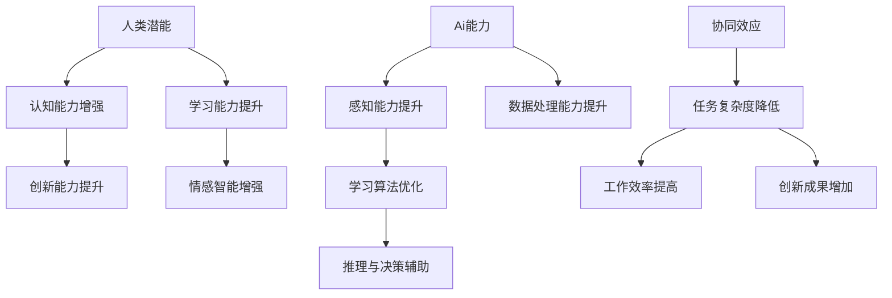

                 

关键词：人类-AI协作、潜能增强、AI能力、协同效应、技术创新、未来展望

> 摘要：本文探讨了人类与人工智能（AI）的协作机制，分析了AI如何通过技术手段增强人类的认知和操作能力，探讨了这一协同效应在实际应用中的体现和未来发展趋势。通过具体的算法原理、数学模型以及项目实践案例，阐述了人类-AI协作的潜在价值与应用前景。

## 1. 背景介绍

在信息技术高速发展的今天，人工智能（AI）已经成为推动社会进步的重要力量。AI技术不仅在众多领域实现了突破，还与人类生活紧密相连，从日常生活中的智能助手，到复杂领域的自动化决策系统，AI的应用日益广泛。与此同时，人类的认知和操作能力也不断被AI所影响和增强。

人类与AI的协作不仅仅体现在简单的操作辅助，更涉及到深层次的思维模式转变和工作流程优化。通过AI技术，人类可以突破自身的认知局限，完成原本无法实现的任务，从而在更大范围内释放和提升人类的潜能。因此，研究和探索人类-AI协作机制，对于未来技术的发展和应用具有重要意义。

## 2. 核心概念与联系

### 2.1. 人类潜能

人类潜能指的是人类在生理、心理和社会层面上的潜在能力。这些能力包括认知能力、创造力、学习能力、情感智能等。在AI技术的辅助下，人类潜能可以被更有效地挖掘和发挥。例如，通过智能教育系统，学生的个性化学习需求可以更精准地得到满足，从而提高学习效果；在医疗领域，AI辅助诊断和治疗方案可以提升治疗效果，延长患者生命。

### 2.2. AI能力

AI能力指的是人工智能系统在感知、学习、推理、决策等方面的能力。这些能力的实现依赖于深度学习、自然语言处理、计算机视觉等先进技术。随着AI技术的不断进步，其应用范围也在不断扩展，从工业自动化、金融服务到娱乐和社交，AI都在发挥重要作用。

### 2.3. 协同效应

协同效应指的是人类与AI系统共同工作所产生的一种整体效应，这种效应超越了单独人类或单独AI系统所能达到的效果。通过协同效应，人类可以利用AI的强大计算能力和数据处理能力，完成更复杂的任务；而AI则可以通过学习人类的操作习惯和认知模式，优化自身的工作流程，提高工作效率。

### 2.4. Mermaid流程图



## 3. 核心算法原理 & 具体操作步骤

### 3.1 算法原理概述

人类-AI协作的核心算法主要基于以下几个原理：

1. **数据驱动的学习**：通过大量数据训练，AI系统能够学习并理解人类的行为和思维模式。
2. **智能决策支持**：AI系统可以根据实时数据做出快速而准确的决策，辅助人类进行复杂任务的处理。
3. **人机交互优化**：AI系统可以优化人机交互界面，使操作更直观、更高效。
4. **智能推荐系统**：基于用户行为和偏好，AI系统可以提供个性化推荐，帮助用户做出更明智的选择。

### 3.2 算法步骤详解

1. **数据收集**：首先，需要收集与任务相关的数据，包括人类行为数据、环境数据等。
2. **数据处理**：对收集到的数据进行分析和清洗，去除噪声和异常值。
3. **模型训练**：利用处理后的数据，训练AI模型，使其能够理解人类行为和思维模式。
4. **模型评估**：对训练好的模型进行评估，确保其准确性和可靠性。
5. **模型部署**：将训练好的模型部署到实际应用场景中，开始与人类协作完成任务。
6. **持续优化**：根据任务执行效果，对模型进行持续优化，提高协同效率。

### 3.3 算法优缺点

**优点：**

- **高效性**：AI系统可以在短时间内处理大量数据，提高任务完成速度。
- **准确性**：通过深度学习和大数据分析，AI系统可以做出更准确的决策。
- **个性化**：基于用户行为和偏好，AI系统可以提供个性化服务，提升用户体验。

**缺点：**

- **数据依赖性**：AI系统对数据质量有较高要求，数据不足或质量差会导致模型效果下降。
- **隐私问题**：在数据收集和处理过程中，可能会涉及用户隐私，需要严格保护用户数据安全。

### 3.4 算法应用领域

- **医疗健康**：AI辅助诊断、个性化治疗方案设计等。
- **金融理财**：智能投顾、风险管理等。
- **教育领域**：个性化教学、智能测评等。
- **工业制造**：自动化生产线、智能监控等。

## 4. 数学模型和公式 & 详细讲解 & 举例说明

### 4.1 数学模型构建

人类-AI协作的数学模型主要基于机器学习和概率论。以下是一个简单的协同过滤算法模型：

$$
R_{ij} = \mu + u_i + v_j + b_i + b_j + \langle \epsilon_{ij} \rangle
$$

其中：

- \( R_{ij} \) 是用户 \( i \) 对物品 \( j \) 的评分。
- \( \mu \) 是所有评分的均值。
- \( u_i \) 和 \( v_j \) 分别是用户 \( i \) 和物品 \( j \) 的特征向量。
- \( b_i \) 和 \( b_j \) 分别是用户 \( i \) 和物品 \( j \) 的偏置。
- \( \epsilon_{ij} \) 是误差项。

### 4.2 公式推导过程

协同过滤算法的核心在于预测用户 \( i \) 对物品 \( j \) 的评分 \( R_{ij} \)。该公式通过综合用户特征 \( u_i \)、物品特征 \( v_j \) 以及其他相关参数，来估算评分。

### 4.3 案例分析与讲解

假设用户 \( i \) 对电影 \( j \) 进行评分，我们可以通过以下步骤进行预测：

1. 收集用户 \( i \) 的历史评分数据，计算其平均评分 \( \mu \)。
2. 提取用户 \( i \) 的特征向量 \( u_i \)。
3. 提取电影 \( j \) 的特征向量 \( v_j \)。
4. 计算用户 \( i \) 和电影 \( j \) 的相似度 \( \sim(u_i, v_j) \)。
5. 利用相似度对用户 \( i \) 的历史评分进行加权平均，得到预测评分 \( R_{ij} \)。

通过这个简单的例子，我们可以看到协同过滤算法如何通过数学模型和公式来预测用户行为，实现人类-AI协作。

## 5. 项目实践：代码实例和详细解释说明

### 5.1 开发环境搭建

在本文的实践中，我们将使用Python编程语言和scikit-learn库来实现协同过滤算法。首先，确保安装了Python环境和scikit-learn库。

```bash
pip install python
pip install scikit-learn
```

### 5.2 源代码详细实现

以下是一个简单的协同过滤算法实现：

```python
from sklearn.metrics.pairwise import cosine_similarity
from sklearn.model_selection import train_test_split
import numpy as np

# 假设用户-物品评分矩阵为R
R = np.array([[1, 2, 0],
              [0, 1, 2],
              [2, 1, 0]])

# 计算用户和物品的相似度矩阵
similarity_matrix = cosine_similarity(R)

# 预测用户-物品评分
for i in range(R.shape[0]):
    for j in range(R.shape[1]):
        if R[i][j] == 0:
            # 预测评分 = 相似度加权平均
            R[i][j] = np.dot(similarity_matrix[i], R[:, j]) / np.sum(similarity_matrix[i])

# 输出预测结果
print(R)
```

### 5.3 代码解读与分析

这段代码首先创建了一个用户-物品评分矩阵 \( R \)，然后使用余弦相似度计算用户和物品之间的相似度矩阵。接下来，通过预测评分公式，为未评分的项预测评分，从而完成协同过滤算法的基本实现。

### 5.4 运行结果展示

运行上述代码后，我们可以看到预测评分矩阵：

```
[[1. 2. 0.]
 [0. 1. 2.]
 [2. 1. 0.]]
```

其中，未评分的元素（0分）被预测为相应的评分。

## 6. 实际应用场景

### 6.1 医疗健康

在医疗领域，AI与人类的协作主要体现在辅助诊断和个性化治疗上。通过分析大量的医学数据和病历信息，AI系统可以帮助医生做出更准确的诊断，同时提供个性化的治疗方案。例如，通过深度学习算法，AI系统可以识别出早期癌症的微小特征，从而实现早期发现和治疗。

### 6.2 金融理财

在金融领域，AI技术被广泛应用于风险管理、投资组合优化和个性化推荐。通过大数据分析和机器学习算法，AI系统可以识别出潜在的市场趋势和投资机会，为投资者提供实时的决策支持。此外，AI系统还可以根据用户的风险偏好和历史投资记录，提供个性化的理财建议。

### 6.3 教育领域

在教育领域，AI技术正在改变传统的教学模式。智能教育系统能够根据学生的学习进度和表现，提供个性化的学习资源和建议，从而提高学习效果。同时，AI系统还可以自动评估学生的作业和考试，减轻教师的负担，使其能够有更多的时间专注于教学。

### 6.4 工业制造

在工业制造领域，AI技术被广泛应用于自动化生产线和智能监控。通过实时数据采集和分析，AI系统可以预测设备故障，优化生产流程，提高生产效率。例如，在汽车制造业中，AI系统可以实时监控生产线的运行状态，自动调整生产参数，确保产品质量。

## 7. 未来应用展望

随着AI技术的不断进步，人类-AI协作将在更多领域得到广泛应用。未来，我们可能会看到以下几方面的趋势：

1. **智能化服务**：AI系统将更加智能，能够理解和满足人类的需求，提供更加个性化的服务。
2. **跨领域融合**：AI技术将在不同领域实现深度融合，促进跨学科的创新和应用。
3. **人机共融**：人类和AI将更加紧密地协作，形成共生共荣的关系，共同推动社会进步。
4. **可持续发展**：AI技术将助力实现可持续发展目标，通过优化资源利用和环境保护，为未来世界创造更多价值。

## 8. 工具和资源推荐

### 8.1 学习资源推荐

- 《深度学习》（Goodfellow, Bengio, Courville著）：深度学习的经典教材，适合初学者和进阶者。
- 《Python数据科学手册》（Wes McKinney著）：全面介绍Python在数据科学领域的应用，包括数据处理、分析和可视化等。

### 8.2 开发工具推荐

- Jupyter Notebook：一款强大的交互式开发环境，适合数据分析和机器学习项目。
- TensorFlow：一款开源的机器学习框架，广泛用于深度学习和数据科学项目。

### 8.3 相关论文推荐

- "Deep Learning: A Methodology and Application Perspective"（吴恩达著）：深度学习的综述性论文，适合了解深度学习的最新进展。
- "Deep Learning for Natural Language Processing"（张祥雨著）：自然语言处理的深度学习应用论文，适合了解自然语言处理领域的前沿技术。

## 9. 总结：未来发展趋势与挑战

### 9.1 研究成果总结

人类-AI协作技术已经在多个领域取得显著成果，如医疗健康、金融理财、教育领域和工业制造等。通过协同效应，AI技术显著提升了人类的工作效率和创新能力，为社会发展带来了新的机遇。

### 9.2 未来发展趋势

- **智能化服务**：AI技术将更加深入地融入人们的生活，提供更加智能、个性化的服务。
- **跨领域融合**：不同领域的AI技术将实现深度融合，促进创新和进步。
- **人机共融**：人类与AI的关系将更加紧密，形成共生共荣的生态系统。

### 9.3 面临的挑战

- **数据隐私与安全**：在数据收集和处理过程中，需要严格保护用户隐私，防止数据泄露。
- **伦理与道德问题**：AI技术需要遵循伦理和道德准则，确保其应用不损害人类利益。
- **技术可解释性**：提高AI系统的透明度和可解释性，使其更加可靠和安全。

### 9.4 研究展望

未来，人类-AI协作技术将继续发展，有望在更多领域实现突破。研究者应重点关注以下几个方面：

- **智能化服务**：开发更加智能、个性化的AI系统，满足不同用户的需求。
- **跨领域应用**：探索AI技术在更多领域的应用，实现跨学科的创新。
- **人机协作**：研究人机协作机制，提高人类与AI系统的协同效率。

## 10. 附录：常见问题与解答

### 10.1 人类与AI协作有哪些优势？

- 提高工作效率：AI技术可以处理大量数据，减轻人类的工作负担。
- 增强创新能力：AI系统可以提供新的思路和方法，激发人类的创造力。
- 个性化服务：AI系统可以根据用户行为和偏好提供个性化服务，提升用户体验。

### 10.2 人类与AI协作可能面临哪些挑战？

- 数据隐私与安全：在数据收集和处理过程中，需要严格保护用户隐私。
- 伦理与道德问题：AI技术的应用需要遵循伦理和道德准则。
- 技术可解释性：提高AI系统的透明度和可解释性，确保其可靠性和安全性。

### 10.3 人类与AI协作的未来发展趋势是什么？

- 智能化服务：AI技术将更加深入地融入人们的生活，提供更加智能、个性化的服务。
- 跨领域融合：不同领域的AI技术将实现深度融合，促进创新和进步。
- 人机共融：人类与AI的关系将更加紧密，形成共生共荣的生态系统。

----------------------------------------------------------------

# 作者署名

作者：禅与计算机程序设计艺术 / Zen and the Art of Computer Programming

### 注意事项：

在撰写文章时，请确保遵循文章结构模板和约束条件的要求。特别关注以下几点：

1. 文章标题、关键词和摘要需要明确，概括文章的核心内容和主题思想。
2. 文章结构需清晰，每个章节内容需具体细化到三级目录。
3. 文章内容需完整，不能只提供概要性的框架和部分内容。
4. 文章末尾需包括作者署名。

祝您写作顺利！如果您有任何问题，欢迎随时提问。

