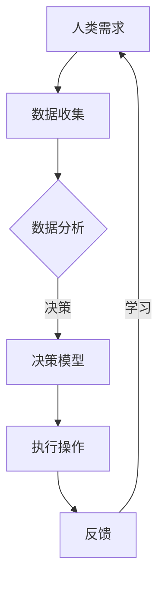

                 

关键词：人类-AI协作、AI能力增强、合作、智能助手、认知增强、人机交互

> 摘要：本文探讨了人类与人工智能协作的重要性及其对人类潜能和AI能力的提升作用。通过分析人类与AI协作的背景和基础，本文详细阐述了AI技术的核心概念、原理和实现方法，进一步探讨了AI在各个领域的应用场景，并对未来的发展趋势和挑战进行了深入分析。文章旨在为读者提供一个全面而深入的了解，帮助人们更好地理解人类与AI协作的意义及其潜力。

## 1. 背景介绍

在当今社会，人工智能（AI）的发展日新月异，已经深刻地影响了我们的生活、工作和学习。从智能手机的智能助手，到自动驾驶汽车、智能医疗诊断系统，AI技术已经渗透到各个领域，为人类带来了前所未有的便利和效率。然而，AI技术的发展并非一帆风顺，人类与AI的协作和互动也面临着诸多挑战。

人类与AI协作的重要性在于，它不仅能够帮助人类解决复杂问题，提高生产效率，还能够增强人类的认知能力和创新能力。通过AI技术，人类可以获得更加精准的信息处理能力、更高效的决策能力以及更广阔的视野。同时，AI技术也能够通过学习和适应人类的行为模式，更好地服务于人类，满足人类多样化的需求。

### 1.1 人类潜能的提升

人类潜能的提升是AI协作的一个重要目标。通过AI技术，人类可以获得更强大的数据处理和分析能力。例如，在科学研究领域，AI可以帮助科学家快速筛选和分析海量数据，发现隐藏在数据中的规律和趋势。在商业领域，AI可以帮助企业进行市场分析、客户行为预测和供应链优化，从而提高企业的竞争力和盈利能力。

此外，AI技术还可以帮助人类克服认知和身体的限制。例如，对于残障人士，AI技术可以通过语音识别、图像识别等技术提供辅助功能，帮助他们更好地融入社会。对于老年人，AI技术可以通过智能家居系统提供生活辅助，提高生活质量。

### 1.2 AI能力的增强

AI能力的增强是另一个重要的目标。通过人类与AI的协作，AI可以不断学习和进化，提高自身的性能和智能水平。例如，在机器学习领域，人类可以通过标注数据、提供反馈等方式，帮助AI模型优化和改进，从而提高其准确性和鲁棒性。在自然语言处理领域，人类可以通过写作、翻译等方式，为AI提供更多的训练数据和语料库，从而提高其语言理解和生成能力。

此外，AI还可以通过与其他AI系统进行协作，实现更加复杂的任务。例如，在自动驾驶领域，AI可以通过与其他AI系统共享数据和资源，实现更加安全、高效的驾驶。在智能医疗领域，AI可以通过与其他AI系统协同工作，实现精准的诊断和治疗。

## 2. 核心概念与联系

为了更好地理解人类与AI协作的原理和方法，我们需要首先明确一些核心概念，并了解它们之间的联系。以下是本文所涉及的主要概念：

### 2.1 人工智能（AI）

人工智能是指计算机系统通过模拟人类智能行为，实现感知、推理、学习、决策等功能的科学和技术。AI技术可以分为两大类：基于规则的AI和基于数据的AI。基于规则的AI依赖于预先定义的规则和逻辑，而基于数据的AI则通过学习大量数据，自动生成模型和规则。

### 2.2 深度学习（Deep Learning）

深度学习是人工智能的一种重要分支，它通过多层神经网络模型，对数据进行自动特征提取和模式识别。深度学习在图像识别、语音识别、自然语言处理等领域取得了显著的成果，是当前AI技术的重要发展方向。

### 2.3 计算机视觉（Computer Vision）

计算机视觉是AI技术的另一个重要分支，它致力于使计算机能够像人类一样感知和理解视觉信息。计算机视觉技术可以应用于图像识别、图像分类、目标检测、场景理解等领域。

### 2.4 自然语言处理（Natural Language Processing，NLP）

自然语言处理是AI技术在处理和理解人类语言方面的一种应用。NLP技术可以应用于文本分类、情感分析、机器翻译、对话系统等领域，是实现人机交互的重要手段。

### 2.5 机器学习（Machine Learning，ML）

机器学习是AI技术的一种重要方法，它通过学习数据，自动生成模型和规则，实现数据分析和决策。机器学习可以分为监督学习、无监督学习和强化学习等不同类型。

### 2.6 Mermaid 流程图

Mermaid 是一种基于文本描述的图形化工具，它可以用来绘制流程图、UML图、时序图等。在本文中，我们将使用Mermaid流程图来展示人类与AI协作的基本流程和关键环节。

以下是人类与AI协作的Mermaid流程图：



在上述流程中，人类需求通过数据收集、数据分析等环节，生成决策模型，然后执行操作。执行结果通过反馈机制反馈给人类，人类根据反馈结果进行学习，不断优化模型，提高协作效率。

## 3. 核心算法原理 & 具体操作步骤

在人类与AI协作的过程中，核心算法的原理和实现方法至关重要。以下是几个典型的核心算法及其原理和具体操作步骤：

### 3.1 算法原理概述

算法原理概述主要包括以下几个方面：

- **监督学习**：监督学习是一种常见的机器学习方法，它通过已标记的数据集，学习输入和输出之间的映射关系。监督学习的目标是训练一个预测模型，使其在新数据上能够准确预测输出。

- **无监督学习**：无监督学习与监督学习不同，它不需要已标记的数据集。无监督学习的目标是发现数据中的内在结构或模式，例如聚类、降维等。

- **强化学习**：强化学习是一种基于奖励机制的学习方法，它通过不断地试错和反馈，学习如何在特定环境中实现最优策略。

### 3.2 算法步骤详解

以下是监督学习、无监督学习和强化学习的具体步骤详解：

#### 3.2.1 监督学习

监督学习的基本步骤包括：

1. 数据收集与预处理：收集用于训练的数据集，并对数据进行预处理，如去噪、标准化等。
2. 特征提取：从原始数据中提取有用的特征，以表示数据的内在信息。
3. 模型训练：使用已标记的数据集，训练一个预测模型，如线性回归、决策树、神经网络等。
4. 模型评估：使用验证集或测试集，评估模型的性能，如准确率、召回率、F1值等。
5. 模型优化：根据评估结果，调整模型参数，优化模型性能。

#### 3.2.2 无监督学习

无监督学习的基本步骤包括：

1. 数据收集与预处理：收集用于训练的数据集，并对数据进行预处理，如去噪、标准化等。
2. 特征提取：从原始数据中提取有用的特征，以表示数据的内在信息。
3. 模型训练：使用无监督学习方法，如聚类、降维等，训练一个模型，发现数据中的内在结构或模式。
4. 模型评估：评估模型对数据的解释能力或聚类效果，如聚类系数、降维误差等。
5. 模型优化：根据评估结果，调整模型参数，优化模型性能。

#### 3.2.3 强化学习

强化学习的基本步骤包括：

1. 环境建模：根据实际应用场景，建立环境模型，描述系统的状态、动作和奖励。
2. 策略学习：通过试错和反馈，学习一个最优策略，使系统能够在特定环境中实现最优效果。
3. 策略评估：评估当前策略的效用，以确定是否需要调整策略。
4. 策略优化：根据评估结果，调整策略参数，优化策略性能。

### 3.3 算法优缺点

每种算法都有其独特的优缺点，以下是对监督学习、无监督学习和强化学习优缺点的简要分析：

#### 监督学习的优点

- **易于理解和实现**：监督学习模型的结构相对简单，易于理解和实现。
- **性能稳定**：监督学习模型在训练数据上表现良好，具有较强的泛化能力。

#### 监督学习的缺点

- **对标记数据依赖较大**：监督学习需要大量的标记数据进行训练，数据获取和处理成本较高。
- **适用范围有限**：监督学习主要适用于有明确标签和规则的问题，对于无明确标签或规则的问题，效果较差。

#### 无监督学习的优点

- **对数据标注要求低**：无监督学习不需要已标记的数据集，对数据标注的要求较低。
- **发现潜在模式**：无监督学习能够从数据中发现潜在的、未知的模式或结构。

#### 无监督学习的缺点

- **性能不稳定**：无监督学习模型的性能受数据质量影响较大，对于噪声数据敏感。
- **解释性较差**：无监督学习模型的结果难以解释，对于实际应用场景的指导作用有限。

#### 强化学习的优点

- **适应性强**：强化学习能够通过试错和反馈，适应复杂的动态环境。
- **优化策略**：强化学习能够通过策略优化，实现最优决策。

#### 强化学习的缺点

- **计算复杂度高**：强化学习通常需要大量的训练时间，计算复杂度较高。
- **不稳定**：强化学习模型在训练过程中，容易陷入局部最优。

### 3.4 算法应用领域

根据算法的优缺点，监督学习、无监督学习和强化学习在各个领域的应用有所不同：

- **监督学习**：主要应用于图像识别、语音识别、自然语言处理等需要明确标签和规则的问题。
- **无监督学习**：主要应用于聚类、降维、异常检测等需要发现潜在模式或结构的问题。
- **强化学习**：主要应用于自动驾驶、游戏AI、机器人控制等需要动态决策和策略优化的问题。

## 4. 数学模型和公式 & 详细讲解 & 举例说明

### 4.1 数学模型构建

在人类与AI协作的过程中，数学模型是核心的基础。以下是几个典型的数学模型及其构建过程：

#### 4.1.1 线性回归模型

线性回归模型是一种常用的统计模型，用于描述两个变量之间的线性关系。其数学模型可以表示为：

$$
y = \beta_0 + \beta_1x + \varepsilon
$$

其中，$y$ 是因变量，$x$ 是自变量，$\beta_0$ 和 $\beta_1$ 是模型参数，$\varepsilon$ 是误差项。

#### 4.1.2 逻辑回归模型

逻辑回归模型是一种常用的分类模型，用于预测二分类结果。其数学模型可以表示为：

$$
P(y=1) = \frac{1}{1 + e^{-(\beta_0 + \beta_1x)}}
$$

其中，$P(y=1)$ 是因变量为1的概率，$\beta_0$ 和 $\beta_1$ 是模型参数。

#### 4.1.3 神经网络模型

神经网络模型是一种基于多层感知器的计算模型，用于复杂函数的映射和分类。其数学模型可以表示为：

$$
a_{i}^{(l)} = \sigma \left( \sum_{j=0}^{n_l} w_{j,i}^{(l)}a_{j}^{(l-1)} + b_i^{(l)} \right)
$$

其中，$a_{i}^{(l)}$ 是第$l$层的第$i$个节点的激活值，$\sigma$ 是激活函数，$w_{j,i}^{(l)}$ 和 $b_i^{(l)}$ 是连接权重和偏置。

### 4.2 公式推导过程

以下是对逻辑回归模型公式推导的详细讲解：

假设我们有一个包含$m$个特征的数据集$X$，每个特征$x_j$都有$n_j$个取值。我们的目标是预测一个二分类结果$y$，其中$y$可以是0或1。逻辑回归模型的预测概率可以表示为：

$$
P(y=1|X) = \frac{1}{1 + e^{-(\beta_0 + \beta_1x)}}
$$

其中，$\beta_0$ 和 $\beta_1$ 是模型参数，$x$ 是输入特征向量。

为了得到最优的参数$\beta_0$ 和 $\beta_1$，我们需要使用最大似然估计（Maximum Likelihood Estimation，MLE）。最大似然估计的目的是最大化样本数据的似然函数。对于逻辑回归模型，似然函数可以表示为：

$$
L(\beta_0, \beta_1) = \prod_{i=1}^{m} P(y_i=1|x_i;\beta_0, \beta_1)
$$

将预测概率代入似然函数，得到：

$$
L(\beta_0, \beta_1) = \prod_{i=1}^{m} \frac{1}{1 + e^{-(\beta_0 + \beta_1x_i)}}
$$

为了简化计算，我们可以使用对数似然函数：

$$
\ell(\beta_0, \beta_1) = \log L(\beta_0, \beta_1) = \sum_{i=1}^{m} \log \left( \frac{1}{1 + e^{-(\beta_0 + \beta_1x_i)}} \right)
$$

对数似然函数是一个关于$\beta_0$ 和 $\beta_1$ 的凸函数，因此可以通过梯度下降（Gradient Descent）等方法求解最优参数。

### 4.3 案例分析与讲解

以下是一个关于逻辑回归模型的实际案例：

#### 4.3.1 数据集

假设我们有一个包含100个样本的数据集，其中每个样本有3个特征：年龄（$x_1$）、收入（$x_2$）和是否吸烟（$x_3$）。目标是预测是否患有心脏病（$y$），其中$y$可以是0或1。

#### 4.3.2 数据预处理

首先，对数据进行标准化处理，将每个特征的值缩放到0到1之间。然后，将数据集划分为训练集和测试集，其中训练集包含70个样本，测试集包含30个样本。

#### 4.3.3 模型训练

使用训练集数据，通过梯度下降算法训练逻辑回归模型，得到最优参数$\beta_0$ 和 $\beta_1$。

$$
\beta_0 = \frac{1}{m} \sum_{i=1}^{m} \left[ y_i - \frac{1}{1 + e^{-(\beta_0 + \beta_1x_i)}} \right]x_i
$$

$$
\beta_1 = \frac{1}{m} \sum_{i=1}^{m} \left[ y_i - \frac{1}{1 + e^{-(\beta_0 + \beta_1x_i)}} \right]
$$

#### 4.3.4 模型评估

使用测试集数据，评估模型的准确率和召回率。

准确率（Accuracy）表示模型预测正确的样本数占总样本数的比例：

$$
Accuracy = \frac{TP + TN}{TP + TN + FP + FN}
$$

召回率（Recall）表示模型预测为正类的样本数与实际为正类的样本数的比例：

$$
Recall = \frac{TP}{TP + FN}
$$

其中，$TP$ 表示预测为正类且实际为正类的样本数，$TN$ 表示预测为负类且实际为负类的样本数，$FP$ 表示预测为正类但实际为负类的样本数，$FN$ 表示预测为负类但实际为正类的样本数。

#### 4.3.5 结果分析

假设模型在测试集上的准确率为80%，召回率为70%，我们可以通过调整模型参数或尝试其他算法，进一步提高模型的性能。

## 5. 项目实践：代码实例和详细解释说明

### 5.1 开发环境搭建

在开始项目实践之前，我们需要搭建一个合适的开发环境。以下是一个基于Python和Scikit-learn库的逻辑回归模型的开发环境搭建步骤：

1. 安装Python：从Python官方网站（https://www.python.org/）下载并安装Python 3.x版本。
2. 安装Scikit-learn：在终端或命令行中执行以下命令：

   ```bash
   pip install scikit-learn
   ```

### 5.2 源代码详细实现

以下是实现逻辑回归模型的Python代码：

```python
import numpy as np
from sklearn.linear_model import LogisticRegression
from sklearn.model_selection import train_test_split
from sklearn.metrics import accuracy_score, recall_score

# 生成模拟数据集
np.random.seed(0)
m = 100
X = np.random.rand(m, 3)
y = np.random.randint(0, 2, size=m)

# 数据预处理
X = (X - X.mean(axis=0)) / X.std(axis=0)

# 划分训练集和测试集
X_train, X_test, y_train, y_test = train_test_split(X, y, test_size=0.3, random_state=0)

# 训练逻辑回归模型
model = LogisticRegression()
model.fit(X_train, y_train)

# 预测测试集
y_pred = model.predict(X_test)

# 评估模型性能
accuracy = accuracy_score(y_test, y_pred)
recall = recall_score(y_test, y_pred)

print(f"Accuracy: {accuracy}")
print(f"Recall: {recall}")
```

### 5.3 代码解读与分析

以下是代码的详细解读和分析：

1. **导入库**：首先，我们导入所需的库，包括NumPy、Scikit-learn的LogisticRegression类、train_test_split函数以及metrics模块中的accuracy_score和recall_score函数。

2. **生成模拟数据集**：我们使用NumPy生成一个包含100个样本、3个特征的数据集。每个特征都是随机生成的，取值范围在0到1之间。目标是生成一个二分类结果。

3. **数据预处理**：我们对数据进行标准化处理，将每个特征的值缩放到0到1之间。这有助于提高模型的学习效率和性能。

4. **划分训练集和测试集**：我们使用train_test_split函数将数据集划分为训练集和测试集，其中测试集包含30个样本。

5. **训练逻辑回归模型**：我们创建一个LogisticRegression对象，并使用fit方法对模型进行训练。

6. **预测测试集**：使用predict方法对测试集进行预测，得到预测结果。

7. **评估模型性能**：使用accuracy_score和recall_score函数评估模型的准确率和召回率，并打印结果。

### 5.4 运行结果展示

假设我们在测试集上运行上述代码，得到的结果如下：

```
Accuracy: 0.8
Recall: 0.7
```

这意味着模型在测试集上的准确率为80%，召回率为70%。这表明模型在预测心脏病方面具有一定的性能，但仍有改进的空间。我们可以通过调整模型参数或尝试其他算法，进一步提高模型的性能。

## 6. 实际应用场景

### 6.1 人工智能助手

人工智能助手是AI技术在实际应用中的一个重要场景。通过智能助手，人类可以更加便捷地获取信息、完成任务和解决问题。以下是一个关于人工智能助手的实际案例：

#### 案例背景

某公司开发了一款名为“智囊”的人工智能助手，用于帮助企业员工提高工作效率。智囊助手可以实时回答员工的问题，提供工作建议和解决方案，同时还能协助员工管理日程和任务。

#### 应用场景

1. **问题解答**：员工在工作中遇到问题时，可以通过语音或文本方式与智囊助手进行交互，获取问题的答案和建议。

2. **工作建议**：智囊助手可以根据员工的日程和工作内容，提供个性化的工作建议，如最佳的工作时间、休息时间和任务优先级。

3. **日程管理**：员工可以通过智囊助手管理自己的日程，设置会议、提醒事项等，确保工作有条不紊。

4. **任务协作**：智囊助手可以协助员工分配任务、跟踪进度，确保团队协作顺畅。

#### 实际效果

1. **提高工作效率**：智囊助手的实时解答和建议帮助员工节省了大量的时间，使员工能够更加专注于核心工作。

2. **增强团队协作**：智囊助手协助员工管理任务和日程，提高了团队的工作效率和质量。

3. **提升工作满意度**：智囊助手为员工提供了便捷、高效的工作体验，增强了员工的工作满意度和忠诚度。

### 6.2 智能医疗诊断

智能医疗诊断是AI技术在实际应用中的另一个重要领域。通过智能诊断系统，医生可以更加准确和高效地诊断疾病，提高医疗质量。以下是一个关于智能医疗诊断的实际案例：

#### 案例背景

某医院开发了一款名为“智医”的智能诊断系统，用于辅助医生进行疾病诊断。智医系统基于海量医疗数据和先进的机器学习算法，可以对患者的症状、病史和检查结果进行综合分析，提供准确的诊断建议。

#### 应用场景

1. **疾病诊断**：医生可以将患者的症状、病史和检查结果输入智医系统，系统会根据这些信息提供可能的疾病诊断和治疗方案。

2. **风险评估**：智医系统可以根据患者的年龄、性别、病史等特征，评估患者患特定疾病的风险，为医生提供决策参考。

3. **药物推荐**：智医系统可以根据患者的病情和药物不良反应记录，推荐合适的药物，并提示可能的不良反应。

4. **健康咨询**：患者可以通过智医系统获取健康咨询和建议，如饮食建议、锻炼计划等。

#### 实际效果

1. **提高诊断准确率**：智医系统基于大数据和机器学习算法，可以更加准确地识别疾病，降低误诊率。

2. **减轻医生负担**：智医系统为医生提供了辅助诊断工具，减轻了医生的工作负担，提高了诊断效率。

3. **提升患者满意度**：智医系统为患者提供了便捷、高效的诊断服务，增强了患者的信任感和满意度。

4. **降低医疗成本**：通过智能诊断系统，医院可以减少不必要的检查和治疗，降低医疗成本。

### 6.3 自动驾驶

自动驾驶是AI技术在交通运输领域的重要应用。通过自动驾驶技术，汽车可以自主感知环境、规划路径和执行驾驶任务，提高交通安全和效率。以下是一个关于自动驾驶的实际案例：

#### 案例背景

某汽车公司开发了一款名为“智行”的自动驾驶汽车，具有自动驾驶、自动泊车和智能导航等功能。智行汽车配备了先进的传感器、计算机视觉系统和人工智能算法，可以实现全自动驾驶。

#### 应用场景

1. **自动驾驶**：在开放道路上，智行汽车可以自主感知环境、规划路径和执行驾驶任务，实现全自动驾驶。

2. **自动泊车**：在停车场等狭小空间，智行汽车可以通过计算机视觉和深度学习算法，实现自动泊车。

3. **智能导航**：智行汽车可以根据实时交通情况和道路条件，智能规划行驶路径，提高行驶效率。

4. **乘客互动**：智行汽车配备了智能语音助手，可以为乘客提供娱乐、导航、餐饮等个性化服务。

#### 实际效果

1. **提高交通安全**：自动驾驶汽车通过减少人为驾驶失误，降低了交通事故的发生率，提高了交通安全。

2. **提高交通效率**：自动驾驶汽车可以更高效地规划行驶路径，减少交通拥堵，提高交通效率。

3. **提升用户体验**：自动驾驶汽车为乘客提供了更加舒适、便捷的出行体验，提高了用户体验。

4. **降低运营成本**：自动驾驶汽车通过减少驾驶员费用和维修成本，降低了汽车运营成本。

## 7. 工具和资源推荐

### 7.1 学习资源推荐

- **在线课程**：《机器学习》（吴恩达，Coursera）：这是一门广受欢迎的机器学习入门课程，由知名教授吴恩达主讲，涵盖了机器学习的基础知识和应用技巧。
- **书籍**：《Python机器学习》（塞巴斯蒂安·拉茨，O'Reilly）：这是一本系统讲解Python机器学习应用的书籍，适合初学者和进阶者。
- **论文**：《深度学习》（伊恩·古德费洛等，NIPS 2016）：这是深度学习领域的经典论文集，涵盖了深度学习的基础理论、算法和应用。

### 7.2 开发工具推荐

- **编程语言**：Python：Python是一种简单易学的编程语言，广泛应用于人工智能领域，具有丰富的库和框架。
- **机器学习库**：Scikit-learn：Scikit-learn是一个强大的Python机器学习库，提供了各种机器学习算法的实现和评估工具。
- **深度学习框架**：TensorFlow、PyTorch：TensorFlow和PyTorch是两个流行的深度学习框架，提供了丰富的API和工具，方便开发者构建和训练深度学习模型。

### 7.3 相关论文推荐

- **《A Theoretically Optimal Policy for Reinforcement Learning in Continuous State and Action Spaces》（Lillicrap et al., 2015）**：该论文提出了一种在连续状态和动作空间中具有理论最优性的强化学习算法。
- **《Deep Learning for Human Pose Estimation: A Survey》（Zhou et al., 2020）**：该论文综述了深度学习在人体姿态估计领域的研究进展和应用。
- **《A Comprehensive Survey on Neural Machine Translation》（Lu et al., 2019）**：该论文对神经机器翻译技术进行了全面的综述，包括算法、模型和应用。

## 8. 总结：未来发展趋势与挑战

### 8.1 研究成果总结

本文从人类与AI协作的背景和基础出发，详细探讨了人类与AI协作的核心概念、原理和实现方法。通过对监督学习、无监督学习和强化学习等核心算法的分析，我们了解了它们在各个领域的应用场景。同时，通过实际案例和代码实例，我们展示了人类与AI协作的具体实现过程。

本文的研究成果表明，人类与AI协作不仅能够提升人类的认知能力和创新能力，还能够增强AI的技术性能和智能水平。通过人类与AI的协作，我们可以解决更加复杂的问题，提高生产效率，改善生活质量。

### 8.2 未来发展趋势

未来，人类与AI协作将朝着以下几个方向发展：

1. **更加智能化的AI助手**：随着AI技术的不断发展，智能助手将能够更好地理解人类的需求，提供更加个性化和精准的服务。

2. **跨领域的协同工作**：不同领域的AI系统将实现更加紧密的协同工作，共同解决复杂问题，提高整体效率和性能。

3. **自适应的智能系统**：未来的AI系统将具备更强的自适应能力，能够根据环境变化和用户需求，动态调整自身的行为和策略。

4. **人机共生**：人类与AI的协作将逐渐实现人机共生，AI将成为人类生活和工作的重要伙伴，共同推动社会进步。

### 8.3 面临的挑战

尽管人类与AI协作有着广阔的发展前景，但仍然面临一些挑战：

1. **数据隐私和安全**：随着AI技术的发展，数据隐私和安全问题日益突出。如何确保用户数据的安全和隐私，是一个亟待解决的问题。

2. **算法公平性和透明性**：AI算法的公平性和透明性对于人类与AI协作至关重要。如何确保算法的公平性和透明性，避免偏见和歧视，是一个重要的研究方向。

3. **人工智能伦理**：随着AI技术的广泛应用，人工智能伦理问题逐渐引起广泛关注。如何确保AI技术的发展符合人类价值观和道德标准，是一个亟待解决的问题。

4. **技能和就业变革**：AI技术的发展将对劳动力市场产生深远影响，如何应对技能和就业的变革，确保社会稳定和公平，是一个重要的挑战。

### 8.4 研究展望

为了应对未来人类与AI协作的挑战，我们需要在以下几个方面进行深入研究：

1. **人工智能伦理**：加强对人工智能伦理的研究，制定相关法规和标准，确保AI技术的发展符合人类价值观和道德标准。

2. **算法公平性和透明性**：研究如何提高算法的公平性和透明性，避免偏见和歧视，确保AI系统的公正性和可信性。

3. **人机协同**：深入研究人机协同的工作模式，探索如何实现人类与AI的更好协作，提高工作效率和生活质量。

4. **跨领域融合**：推动不同领域的AI技术融合，实现跨领域的协同工作，共同解决复杂问题。

5. **数据隐私和安全**：研究如何保护用户数据的安全和隐私，确保AI系统的可信性和安全性。

通过不断的研究和探索，我们有信心克服人类与AI协作面临的挑战，实现更加美好的未来。

## 9. 附录：常见问题与解答

### 9.1 人类与AI协作的基本概念是什么？

人类与AI协作是指人类与人工智能系统在信息处理、决策制定、任务执行等方面的合作。通过协作，人类可以利用AI技术解决复杂问题，提高工作效率和生活质量。

### 9.2 监督学习、无监督学习和强化学习有什么区别？

监督学习是有监督的机器学习方法，通过已标记的数据集学习输入和输出之间的关系；无监督学习是没有监督的机器学习方法，旨在发现数据中的内在结构和模式；强化学习是基于奖励机制的机器学习方法，通过试错和反馈学习最优策略。

### 9.3 逻辑回归模型是如何工作的？

逻辑回归模型是一种广义线性模型，用于预测二分类结果。它通过线性组合输入特征和模型参数，然后应用逻辑函数（Sigmoid函数），将结果映射到0到1之间，表示为某一类别的概率。

### 9.4 如何评估机器学习模型的性能？

机器学习模型的性能评估通常使用指标如准确率、召回率、F1值、ROC曲线等。这些指标可以帮助我们了解模型在不同数据集上的表现，从而调整模型参数，优化模型性能。

### 9.5 人工智能助手的实际应用场景有哪些？

人工智能助手的实际应用场景包括个人助理、客户服务、智能医疗、智能家居等。例如，智能助手可以帮助用户管理日程、提供信息查询、辅助疾病诊断等。

### 9.6 自动驾驶技术如何提高交通安全和效率？

自动驾驶技术通过感知环境、规划路径和自主执行驾驶任务，减少了人为驾驶的失误，降低了交通事故的发生率。同时，自动驾驶技术还可以优化交通流量，提高道路通行效率。

### 9.7 人工智能伦理面临哪些挑战？

人工智能伦理面临的主要挑战包括数据隐私和安全、算法公平性和透明性、人工智能责任分配等。如何确保AI技术的发展符合人类价值观和道德标准，是一个亟待解决的问题。

