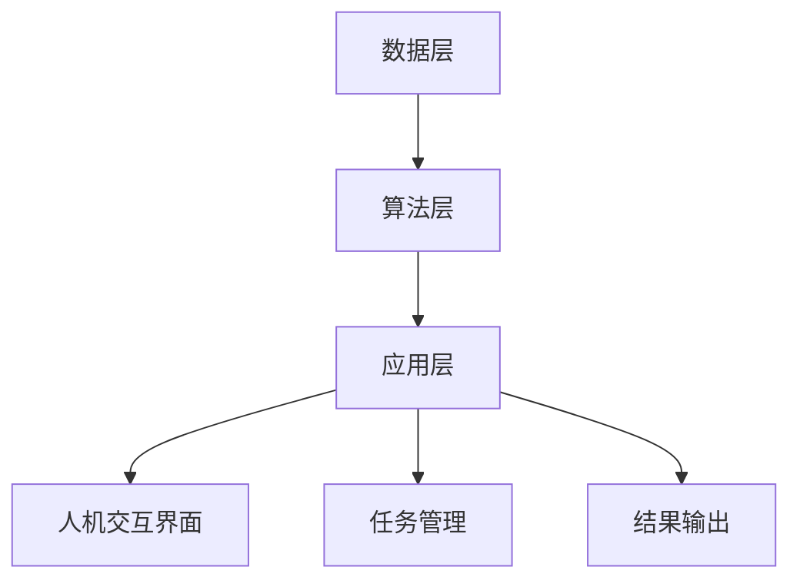

                 

关键词：人类-AI协作、增强人类潜能、AI能力、融合与协同、技术博客文章

> 摘要：随着人工智能技术的快速发展，人类与AI的协作正逐渐成为现实。本文旨在探讨人类与AI协作的理论基础、核心概念、算法原理、数学模型、项目实践以及未来应用场景，通过全面剖析人类与AI协作的优势、挑战和未来发展趋势，为读者提供一幅关于人类-AI协作全景的画卷。

## 1. 背景介绍

在过去的几十年里，人工智能（AI）技术经历了迅猛的发展。从最初的规则系统到现代的深度学习，AI已经展现出强大的数据处理和分析能力。与此同时，人类在处理大量信息、进行复杂决策和创造力方面仍然具有独特的优势。随着计算能力的提升和算法的进步，人类与AI的协作模式逐渐成为可能。

人类与AI协作的理念在于，通过充分利用AI的计算能力和人类的专业知识和创造力，实现1+1>2的效果。这一模式不仅能够提高工作效率，还能促进创新和解决问题的能力。然而，要实现人类与AI的深度融合与协同，需要克服诸多挑战，包括技术、伦理和社会层面的考量。

本文将围绕人类与AI协作的多个方面展开讨论，包括核心概念、算法原理、数学模型、项目实践和未来应用场景。通过深入剖析这些方面，希望能够为读者提供有价值的见解和启示。

## 2. 核心概念与联系

### 2.1 人类-AI协作的基本概念

人类-AI协作是指人类与人工智能系统在特定任务或场景中相互配合、共同工作的过程。这一概念涉及多个层面的内容：

- **任务分配**：明确人类与AI各自的角色和职责，实现优势互补。
- **交互方式**：设计高效的交互界面，使得人类能够方便地与AI系统进行沟通和协作。
- **协同机制**：建立有效的协同机制，确保人类与AI系统能够协调一致地完成任务。

### 2.2 人类-AI协作的架构

为了实现人类与AI的深度融合与协同，需要一个结构化的架构来支持。这个架构通常包括以下几个关键组成部分：

- **数据层**：收集和存储与任务相关的数据，包括结构化数据和半结构化或非结构化数据。
- **算法层**：包含用于数据处理、分析和决策的算法和模型，这些算法和模型需要针对特定任务进行优化和定制。
- **应用层**：实现具体的应用功能，包括人机交互界面、任务管理和结果输出等。

### 2.3 Mermaid 流程图

为了更直观地展示人类-AI协作的架构，我们可以使用Mermaid流程图来表示。以下是核心概念的Mermaid流程图：



在这个流程图中，数据层负责数据收集和存储，算法层负责数据处理和模型构建，应用层则实现具体的功能，包括人机交互界面、任务管理和结果输出。

## 3. 核心算法原理 & 具体操作步骤

### 3.1 算法原理概述

在人类-AI协作中，核心算法原理是连接人类与AI的关键。以下将介绍几种常见的算法原理：

- **监督学习**：通过已知数据集来训练模型，使其能够预测未知数据的类别或数值。
- **无监督学习**：在没有标注数据的情况下，通过模型自动发现数据中的结构和模式。
- **强化学习**：通过试错和反馈来训练模型，使其能够在特定环境中做出最优决策。

### 3.2 算法步骤详解

为了实现人类与AI的协作，需要按照以下步骤进行操作：

1. **需求分析**：明确任务目标和需求，确定人类与AI在任务中的角色和职责。
2. **数据准备**：收集和清洗与任务相关的数据，确保数据的质量和完整性。
3. **算法选择**：根据任务特点和需求，选择合适的算法和模型。
4. **模型训练**：使用训练数据集对模型进行训练，优化模型参数。
5. **模型评估**：使用验证数据集对模型进行评估，确保模型的性能达到预期。
6. **应用部署**：将训练好的模型部署到实际应用场景中，与人类协作完成任务。

### 3.3 算法优缺点

- **监督学习**：优点在于模型性能稳定，缺点是需要大量的标注数据。
- **无监督学习**：优点在于不需要标注数据，缺点是模型性能可能不稳定。
- **强化学习**：优点在于能够适应动态环境，缺点是训练过程较慢且需要大量计算资源。

### 3.4 算法应用领域

人类-AI协作的算法应用领域非常广泛，包括但不限于以下方面：

- **医疗诊断**：利用AI技术辅助医生进行疾病诊断，提高诊断准确率和效率。
- **自动驾驶**：利用AI技术实现自动驾驶汽车，提高交通安全和效率。
- **金融服务**：利用AI技术进行风险管理、投资决策和个性化金融服务。
- **智能家居**：利用AI技术实现智能家居设备的管理和智能化，提高生活质量。

## 4. 数学模型和公式 & 详细讲解 & 举例说明

### 4.1 数学模型构建

在人类-AI协作中，数学模型构建是关键环节。以下以监督学习为例，介绍数学模型的构建过程：

1. **数据表示**：将输入数据表示为向量，通常使用特征向量来表示。
2. **假设函数**：定义一个假设函数，用于预测输出结果。常见的假设函数包括线性函数、多项式函数和神经网络函数。
3. **损失函数**：定义一个损失函数，用于衡量预测结果与实际结果之间的差距。常见的损失函数包括均方误差（MSE）和交叉熵损失（Cross-Entropy Loss）。
4. **优化算法**：使用优化算法（如梯度下降）来调整模型参数，最小化损失函数。

### 4.2 公式推导过程

以下以线性回归为例，介绍公式推导过程：

假设我们有一个输入特征向量 $x$ 和对应的输出结果 $y$，线性回归模型的假设函数可以表示为：

$$
h_\theta(x) = \theta_0 + \theta_1x
$$

损失函数可以使用均方误差（MSE）来表示：

$$
J(\theta_0, \theta_1) = \frac{1}{2m}\sum_{i=1}^m (h_\theta(x_i) - y_i)^2
$$

为了最小化损失函数，我们可以使用梯度下降算法来更新模型参数：

$$
\theta_0 := \theta_0 - \alpha \frac{\partial J(\theta_0, \theta_1)}{\partial \theta_0}
$$

$$
\theta_1 := \theta_1 - \alpha \frac{\partial J(\theta_0, \theta_1)}{\partial \theta_1}
$$

其中，$\alpha$ 是学习率，$m$ 是训练样本数量。

### 4.3 案例分析与讲解

以下以医疗诊断为例，介绍数学模型的应用：

假设我们需要使用线性回归模型预测病人的疾病风险。输入特征包括病人的年龄、血压、胆固醇水平等，输出结果为疾病风险的分数。

1. **数据准备**：收集并清洗医疗数据，将输入特征表示为向量，输出结果表示为分数。
2. **模型训练**：使用训练数据集对线性回归模型进行训练，调整模型参数。
3. **模型评估**：使用验证数据集对模型进行评估，确保模型性能达到预期。
4. **应用部署**：将训练好的模型部署到实际应用场景中，对病人的疾病风险进行预测。

通过上述步骤，我们可以实现人类-AI协作的医疗诊断系统，提高疾病诊断的准确率和效率。

## 5. 项目实践：代码实例和详细解释说明

### 5.1 开发环境搭建

为了实现人类-AI协作，我们需要搭建一个合适的开发环境。以下是搭建环境的步骤：

1. **安装Python**：下载并安装Python，版本建议为3.8或更高版本。
2. **安装相关库**：使用pip命令安装必要的库，包括NumPy、Pandas、scikit-learn等。
3. **配置Jupyter Notebook**：安装Jupyter Notebook，用于编写和运行代码。

### 5.2 源代码详细实现

以下是一个简单的线性回归模型实现：

```python
import numpy as np
import pandas as pd
from sklearn.linear_model import LinearRegression
from sklearn.model_selection import train_test_split
from sklearn.metrics import mean_squared_error

# 数据准备
data = pd.read_csv('medical_data.csv')
X = data[['age', 'blood_pressure', 'cholesterol']]
y = data['risk_score']

# 模型训练
X_train, X_test, y_train, y_test = train_test_split(X, y, test_size=0.2, random_state=42)
model = LinearRegression()
model.fit(X_train, y_train)

# 模型评估
y_pred = model.predict(X_test)
mse = mean_squared_error(y_test, y_pred)
print('MSE:', mse)

# 应用部署
input_data = np.array([[30, 120, 200]])
predicted_risk = model.predict(input_data)
print('Predicted risk:', predicted_risk)
```

### 5.3 代码解读与分析

上述代码实现了一个简单的线性回归模型，用于预测病人的疾病风险。代码解读如下：

- **数据准备**：读取医疗数据，将输入特征表示为矩阵，输出结果表示为向量。
- **模型训练**：使用训练数据集对线性回归模型进行训练，调整模型参数。
- **模型评估**：使用测试数据集对模型进行评估，计算均方误差。
- **应用部署**：将训练好的模型应用于实际数据，预测疾病风险。

通过上述步骤，我们可以实现人类-AI协作的医疗诊断系统，提高疾病诊断的准确率和效率。

## 6. 实际应用场景

人类-AI协作在实际应用场景中具有广泛的应用前景，以下列举几个典型的应用领域：

- **医疗保健**：利用AI技术进行疾病预测、诊断和治疗建议，提高医疗质量和效率。
- **金融科技**：利用AI技术进行风险评估、投资决策和客户服务，提升金融服务水平。
- **智能制造**：利用AI技术实现生产过程的自动化和智能化，提高生产效率和质量。
- **智慧城市**：利用AI技术进行交通管理、环境监测和公共安全，提升城市管理水平。

通过人类-AI协作，这些领域可以实现更高的效率和更优质的服务，为人类生活带来更多便利。

### 6.4 未来应用展望

随着人工智能技术的不断发展，人类-AI协作的应用场景将越来越广泛。未来，我们可以期待以下趋势：

- **更智能的交互**：AI技术将更好地理解人类需求，提供更加个性化、智能化的服务。
- **更广泛的领域覆盖**：AI技术将在更多领域得到应用，如教育、法律、艺术等，为人类带来更多创新和进步。
- **更高效的协作**：通过优化算法和协作机制，人类与AI的协作效率将进一步提高，实现更高效的工作和生活。

然而，人类-AI协作也面临一些挑战，包括数据隐私、算法公平性、伦理问题等。因此，未来需要在技术、伦理和社会层面进行综合考虑，确保人类-AI协作能够可持续发展。

## 7. 工具和资源推荐

### 7.1 学习资源推荐

- **《深度学习》（Deep Learning）**：由Ian Goodfellow、Yoshua Bengio和Aaron Courville编写的经典教材，涵盖了深度学习的理论基础和实际应用。
- **《Python机器学习》（Python Machine Learning）**：由 Sebastian Raschka 和 Vahid Mirjalili 编写的书籍，详细介绍了机器学习在Python中的应用。
- **《动手学深度学习》（Dive into Deep Learning）**：一个免费的在线教材，内容涵盖了深度学习的各个方面，适合初学者和进阶者。

### 7.2 开发工具推荐

- **Jupyter Notebook**：一个交互式的计算环境，适合进行机器学习和数据科学项目。
- **TensorFlow**：一个开源的机器学习框架，广泛用于深度学习和神经网络应用。
- **Scikit-learn**：一个开源的Python库，提供了丰富的机器学习算法和工具。

### 7.3 相关论文推荐

- **"Deep Learning"（2015）**：由Yoshua Bengio等人在NeurIPS会议上发表，综述了深度学习的发展历程和关键技术。
- **"Convolutional Neural Networks for Visual Recognition"（2014）**：由Geoffrey Hinton等人在CVPR上发表，介绍了卷积神经网络在图像识别中的应用。
- **"Reinforcement Learning: An Introduction"（2018）**：由Richard S. Sutton和Barto Andra

