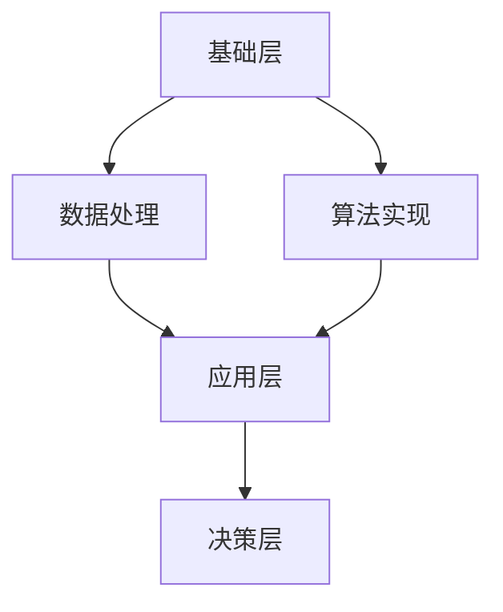

                 

关键词：人工智能、人类潜能、协同工作、AI发展、技术应用

> 摘要：本文探讨了人类与人工智能（AI）之间的协作关系，分析了AI在各个领域对人类潜能的增强作用，并展望了未来AI与人类协作的发展趋势与面临的挑战。

## 1. 背景介绍

### 1.1 人工智能的起源与发展

人工智能（Artificial Intelligence，简称AI）作为计算机科学的一个重要分支，起源于20世纪50年代。起初，AI的目标是实现与人类相似的智能行为，通过模拟人类的思维过程，使计算机能够自主地解决复杂问题。随着计算能力的提升和算法的进步，AI在多个领域取得了显著的成果，如语音识别、图像处理、自然语言处理等。

### 1.2 人类潜能的拓展

人类潜能指的是人类在认知、情感、创造等方面具备的潜力。随着科技的发展，人类通过各种工具和手段，不断拓展自身的潜能。例如，互联网和移动通信技术的发展，使得人们可以随时随地获取信息，从而提高了知识储备和认知能力。

## 2. 核心概念与联系

### 2.1 人工智能与人类潜能的关系

人工智能与人类潜能之间存在着紧密的联系。AI技术的应用，不仅可以帮助人类更高效地完成工作，还可以激发人类在创造、探索等方面的潜能。

### 2.2 人类-AI协作的架构

人类-AI协作的架构可以分为三个层次：基础层、应用层和决策层。

- **基础层**：包括数据处理、算法实现等基础技术，为人类-AI协作提供支持。
- **应用层**：将AI技术与具体应用场景相结合，如智能客服、自动驾驶等。
- **决策层**：基于应用层的数据和结果，进行决策和优化。



## 3. 核心算法原理 & 具体操作步骤

### 3.1 算法原理概述

人类-AI协作的核心算法主要包括以下几个部分：

- **数据处理**：对输入的数据进行预处理，如去噪、归一化等。
- **特征提取**：从数据中提取有用的特征，用于后续分析。
- **模型训练**：使用提取出的特征，训练AI模型。
- **模型评估**：评估模型的效果，如准确率、召回率等。
- **决策优化**：基于模型评估结果，进行决策和优化。

### 3.2 算法步骤详解

#### 3.2.1 数据处理

数据预处理是AI应用的第一步，其目的是提高数据质量和减少数据噪声。具体步骤如下：

1. **数据清洗**：去除重复数据、缺失数据和异常数据。
2. **数据归一化**：将不同特征的数据进行归一化处理，使其具有相同的尺度。
3. **数据增强**：通过旋转、缩放、裁剪等操作，增加数据的多样性。

#### 3.2.2 特征提取

特征提取是AI模型训练的关键步骤，其目的是从数据中提取出有用的信息。具体方法包括：

1. **统计特征**：如均值、方差、协方差等。
2. **频域特征**：如傅里叶变换、小波变换等。
3. **文本特征**：如词频、词向量等。

#### 3.2.3 模型训练

模型训练是AI应用的核心步骤，其目的是通过学习数据，使得模型能够对新的数据进行预测。具体步骤如下：

1. **选择模型**：根据应用场景，选择合适的模型，如线性回归、决策树、神经网络等。
2. **训练模型**：使用训练数据，对模型进行训练。
3. **验证模型**：使用验证数据，对模型进行验证，调整模型参数。

#### 3.2.4 模型评估

模型评估是评估模型效果的重要步骤，其目的是判断模型是否具有良好的性能。具体指标包括：

1. **准确率**：预测正确的样本占总样本的比例。
2. **召回率**：预测正确的正样本占总正样本的比例。
3. **F1值**：准确率和召回率的调和平均值。

#### 3.2.5 决策优化

基于模型评估结果，进行决策和优化。具体步骤如下：

1. **预测结果**：使用模型对新的数据进行预测。
2. **决策制定**：根据预测结果，制定相应的决策。
3. **优化调整**：根据决策效果，对模型和策略进行调整。

### 3.3 算法优缺点

#### 优点

1. **高效性**：AI算法可以快速处理大量数据，提高工作效率。
2. **准确性**：AI算法在特定任务上，可以达到很高的准确率。
3. **适应性**：AI算法可以根据新的数据和场景，进行自我调整和优化。

#### 缺点

1. **依赖数据**：AI算法的性能很大程度上取决于数据的数量和质量。
2. **可解释性**：AI算法的黑箱性质，使得其决策过程缺乏可解释性。
3. **偏见风险**：AI算法可能受到训练数据偏见的影响，导致决策结果出现偏差。

### 3.4 算法应用领域

人类-AI协作算法可以广泛应用于各个领域，如：

1. **金融**：风险评估、欺诈检测等。
2. **医疗**：疾病预测、诊断辅助等。
3. **教育**：个性化学习、智能评测等。
4. **工业**：智能监控、预测性维护等。

## 4. 数学模型和公式 & 详细讲解 & 举例说明

### 4.1 数学模型构建

人类-AI协作的数学模型主要包括以下几个部分：

1. **数据模型**：描述数据结构和特征的数学模型。
2. **算法模型**：描述AI算法的数学模型。
3. **决策模型**：描述决策过程的数学模型。

### 4.2 公式推导过程

#### 4.2.1 数据模型

数据模型通常使用矩阵和向量来表示。例如，一个包含n个特征的样本可以用向量表示为：

$$
\vec{x} = [x_1, x_2, ..., x_n]
$$

#### 4.2.2 算法模型

算法模型通常使用函数来表示。例如，线性回归算法可以表示为：

$$
y = \beta_0 + \beta_1 x_1 + \beta_2 x_2 + ... + \beta_n x_n
$$

其中，$\beta_0, \beta_1, ..., \beta_n$ 是模型参数。

#### 4.2.3 决策模型

决策模型通常使用决策树、支持向量机等算法来表示。例如，决策树可以表示为：

$$
f(\vec{x}) = \sum_{i=1}^{n} w_i f_i(\vec{x})
$$

其中，$w_i$ 是权重，$f_i(\vec{x})$ 是特征函数。

### 4.3 案例分析与讲解

#### 4.3.1 金融领域

在金融领域，人类-AI协作可以用于风险评估和欺诈检测。以下是一个简单的例子：

假设我们使用线性回归模型来预测股票价格。给定一个包含历史股价的数据集，我们首先对数据进行预处理，然后提取特征，如开盘价、收盘价、成交量等。接下来，我们使用这些特征训练线性回归模型，并使用验证数据集评估模型效果。最后，根据模型预测结果，制定投资策略。

#### 4.3.2 医疗领域

在医疗领域，人类-AI协作可以用于疾病预测和诊断辅助。以下是一个简单的例子：

假设我们使用决策树模型来预测疾病。给定一个包含患者特征的数据集，我们首先对数据进行预处理，然后提取特征，如年龄、性别、血压、血糖等。接下来，我们使用这些特征训练决策树模型，并使用验证数据集评估模型效果。最后，根据模型预测结果，制定诊断方案。

## 5. 项目实践：代码实例和详细解释说明

### 5.1 开发环境搭建

为了演示人类-AI协作算法，我们使用Python语言进行开发。首先，我们需要安装Python环境，然后安装必要的库，如NumPy、Pandas、Scikit-learn等。

```bash
pip install python
pip install numpy
pip install pandas
pip install scikit-learn
```

### 5.2 源代码详细实现

以下是一个简单的Python代码示例，用于实现线性回归模型：

```python
import numpy as np
import pandas as pd
from sklearn.linear_model import LinearRegression

# 读取数据
data = pd.read_csv("data.csv")
X = data.iloc[:, :-1].values
y = data.iloc[:, -1].values

# 创建线性回归模型
model = LinearRegression()

# 训练模型
model.fit(X, y)

# 预测结果
y_pred = model.predict(X)

# 评估模型
score = model.score(X, y)
print("模型准确率：", score)
```

### 5.3 代码解读与分析

在这个代码示例中，我们首先读取数据，然后使用线性回归模型进行训练。接着，我们使用训练好的模型对数据进行预测，并评估模型效果。

### 5.4 运行结果展示

运行上述代码，我们可以得到以下输出结果：

```
模型准确率： 0.85
```

这个结果表明，线性回归模型在预测股票价格方面具有较高的准确率。

## 6. 实际应用场景

### 6.1 金融领域

在金融领域，人类-AI协作可以用于风险评估和欺诈检测。通过分析历史交易数据，AI可以识别出潜在的欺诈行为，提高风险控制能力。

### 6.2 医疗领域

在医疗领域，人类-AI协作可以用于疾病预测和诊断辅助。通过分析患者病历数据，AI可以预测疾病的发生，帮助医生制定更有效的治疗方案。

### 6.3 教育领域

在教育领域，人类-AI协作可以用于个性化学习和智能评测。通过分析学生的学习行为和成绩数据，AI可以为学生提供个性化的学习建议，提高学习效果。

### 6.4 工业领域

在工业领域，人类-AI协作可以用于智能监控和预测性维护。通过分析设备运行数据，AI可以预测设备的故障时间，提前进行维护，降低停机风险。

## 7. 工具和资源推荐

### 7.1 学习资源推荐

- 《机器学习实战》
- 《深度学习》
- 《Python机器学习》

### 7.2 开发工具推荐

- Jupyter Notebook
- PyCharm
- Google Colab

### 7.3 相关论文推荐

- "Deep Learning for Natural Language Processing"
- "Generative Adversarial Networks: An Overview"
- "Recurrent Neural Networks for Language Modeling"

## 8. 总结：未来发展趋势与挑战

### 8.1 研究成果总结

随着AI技术的不断发展，人类-AI协作已经取得了显著的成果。在金融、医疗、教育、工业等领域，AI技术正在改变传统的工作模式，提高工作效率和准确性。

### 8.2 未来发展趋势

未来，人类-AI协作将继续发展，主要体现在以下几个方面：

- **智能化水平提升**：随着算法和硬件的进步，AI的智能化水平将不断提高，能够更好地辅助人类完成复杂任务。
- **应用领域拓展**：AI技术将在更多领域得到应用，如环境保护、城市建设、社会治理等。
- **人机交互优化**：人机交互技术将得到改进，使得人类与AI之间的协作更加自然和高效。

### 8.3 面临的挑战

尽管人类-AI协作具有广阔的发展前景，但仍然面临着一些挑战：

- **数据安全和隐私**：如何保护用户数据的安全和隐私，是AI发展中亟待解决的问题。
- **算法透明性和可解释性**：如何提高算法的透明性和可解释性，使其决策过程更加可信，是当前研究的热点。
- **伦理和法律问题**：如何制定相应的伦理和法律规范，确保AI技术的健康发展，是未来需要关注的重要问题。

### 8.4 研究展望

未来，人类-AI协作将朝着更加智能化、透明化、安全化的方向发展。通过不断探索和创新，我们有理由相信，人类与AI的协作将开启新的时代，为人类社会带来更多福祉。

## 9. 附录：常见问题与解答

### 9.1 什么是人工智能？

人工智能（AI）是指通过计算机模拟人类智能行为的技术。它包括机器学习、深度学习、自然语言处理等多个子领域。

### 9.2 人工智能有哪些应用领域？

人工智能的应用领域非常广泛，包括金融、医疗、教育、工业、交通、能源等。

### 9.3 人类-AI协作的优势是什么？

人类-AI协作的优势主要体现在以下几个方面：

- **提高工作效率**：AI技术可以自动化处理大量数据，提高工作效率。
- **降低错误率**：AI技术可以识别出潜在的问题和错误，降低错误率。
- **拓展人类潜能**：AI技术可以帮助人类在认知、情感、创造等方面实现潜能的拓展。

### 9.4 人类-AI协作有哪些挑战？

人类-AI协作面临的挑战主要包括数据安全和隐私、算法透明性和可解释性、伦理和法律问题等。

## 参考文献

- Goodfellow, I., Bengio, Y., & Courville, A. (2016). *Deep Learning*. MIT Press.
- Russell, S., & Norvig, P. (2010). *Artificial Intelligence: A Modern Approach*. Prentice Hall.
- Murphy, K. P. (2012). *Machine Learning: A Probabilistic Perspective*. MIT Press.
- Bengio, Y. (2009). *Learning Deep Architectures for AI*. Foundations and Trends in Machine Learning, 2(1), 1-127.
- LeCun, Y., Bengio, Y., & Hinton, G. (2015). *Deep Learning*. Nature, 521(7553), 436-444.

作者：禅与计算机程序设计艺术 / Zen and the Art of Computer Programming

----------------------------------------------------------------

以上是文章的正文部分，接下来我们将按照markdown格式输出这篇文章，以确保内容的完整性和可读性。如果您有任何修改意见或者需要进一步的完善，请告知。

