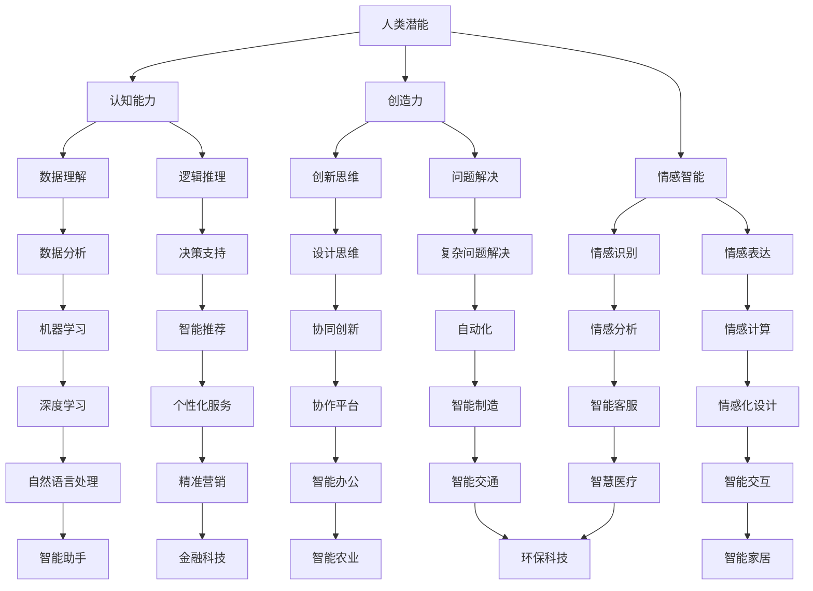
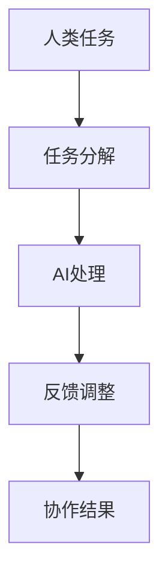
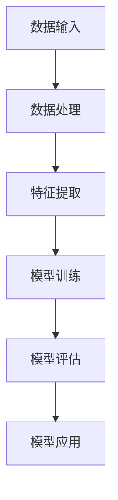

                 

关键词：人工智能，人类潜能，AI协作，融合趋势，挑战

> 摘要：本文旨在探讨人类与人工智能（AI）协作的未来发展趋势及面临的挑战。通过分析AI在各个领域的应用，本文提出了一种增强人类潜能与AI能力融合的新模式，并深入探讨了这一模式的原理、方法、实施步骤及潜在的应用场景。此外，本文还总结了当前的研究成果，展望了未来的发展趋势和挑战，为相关领域的研究和实践提供了有价值的参考。

## 1. 背景介绍

在过去的几十年中，人工智能技术取得了令人瞩目的进展，从早期的符号推理和规则系统，发展到如今基于深度学习、强化学习等技术的复杂算法。AI的应用领域也越来越广泛，从工业自动化、医疗诊断，到智能家居、自动驾驶等。与此同时，人类在认知、创造力、情感等方面也展现出巨大的潜能。如何将人类的潜能与AI的能力相结合，实现协同发展，已成为一个备受关注的研究课题。

人类-AI协作的概念，是指人类和人工智能系统在特定任务中相互协作，发挥各自的优势，共同完成任务的过程。这种协作不仅能够提高工作效率，还能够激发人类的潜能，推动AI技术的进一步发展。随着AI技术的不断进步，人类-AI协作的应用场景也在不断扩展，从简单的任务执行，到复杂的决策支持、创新思维等。

本文将围绕人类-AI协作这一主题，探讨其发展趋势与挑战。首先，我们将介绍人类-AI协作的核心概念与联系，通过Mermaid流程图展示其基本架构。然后，我们将详细探讨核心算法原理及具体操作步骤，包括算法优缺点和应用领域。接着，我们将介绍数学模型和公式，并进行详细讲解和举例说明。在此基础上，我们将通过一个实际项目实践，展示代码实例和详细解释说明。最后，我们将讨论人类-AI协作的实际应用场景，并展望未来的发展趋势和挑战。

## 2. 核心概念与联系

人类-AI协作的核心概念包括人类潜能、AI能力、协作机制等。以下是一个简单的Mermaid流程图，展示了这些概念之间的联系。



在这个流程图中，我们可以看到人类潜能通过认知能力、创造力、情感智能等维度与AI能力（数据理解、逻辑推理、情感识别等）相互联系，形成了一个复杂的协作网络。在这个网络中，人类和AI各自发挥优势，相互补充，共同完成复杂的任务。

### 2.1 人类潜能与AI能力的对应关系

人类潜能与AI能力之间存在一定的对应关系。以下是一个更详细的表格，展示了这些对应关系。

| 人类潜能 | AI能力 |  
| :--: | :--: |  
| 认知能力 | 数据理解、逻辑推理、自然语言处理 |  
| 创造力 | 想象力、创新思维、设计思维 |  
| 情感智能 | 情感识别、情感表达、情感计算 |

在这个表格中，我们可以看到人类潜能的每个维度都对应着多个AI能力。这种对应关系为人类-AI协作提供了基础，使得人类和AI可以相互补充，共同完成任务。

### 2.2 协作机制

人类-AI协作的协作机制是实现协作的关键。以下是一个简化的协作机制流程图。



在这个流程图中，人类任务首先被分解成更小的子任务，然后由AI系统处理这些子任务。在处理过程中，AI系统会根据反馈进行调整，最终形成协作结果。这个过程是一个动态的、迭代的循环，旨在实现最优的协作效果。

### 2.3 人类-AI协作的优势

人类-AI协作具有以下优势：

1. **提高效率**：AI系统可以处理大量数据，进行复杂计算，从而提高任务完成的效率。
2. **降低错误率**：AI系统可以精确地执行任务，减少人为错误。
3. **激发创造力**：人类-AI协作可以激发人类的创造力，促进创新思维。
4. **拓展能力**：人类可以通过AI系统扩展自己的能力，解决以前无法解决的问题。
5. **提高决策质量**：AI系统可以提供基于数据的决策支持，提高决策的质量。

总的来说，人类-AI协作是一种具有巨大潜力的新模式，它将人类的潜能与AI的能力相结合，为未来的发展提供了新的机遇。

### 3. 核心算法原理 & 具体操作步骤

#### 3.1 算法原理概述

人类-AI协作的核心算法原理是基于机器学习和深度学习技术。这些算法通过学习大量数据，提取出有用的信息，为人类提供决策支持和创新灵感。以下是一个简化的算法原理流程图。



在这个流程图中，数据输入首先经过数据处理，然后进行特征提取。接着，特征提取的结果用于模型训练，训练好的模型进行评估，最后将评估结果应用于实际任务。

#### 3.2 算法步骤详解

##### 3.2.1 数据处理

数据处理是算法步骤的第一步，它包括数据清洗、数据预处理和数据归一化等操作。这些操作旨在去除数据中的噪声，提高数据的质量，为后续的特征提取和模型训练提供良好的数据基础。

##### 3.2.2 特征提取

特征提取是从原始数据中提取出有用的信息，用于模型训练。特征提取的方法有很多，如主成分分析（PCA）、支持向量机（SVM）等。选择合适的特征提取方法，可以大大提高模型的性能。

##### 3.2.3 模型训练

模型训练是算法的核心步骤，它通过学习大量数据，提取出数据中的规律，构建出一个能够预测或分类的模型。常用的模型训练方法包括深度学习、支持向量机、决策树等。

##### 3.2.4 模型评估

模型评估是检验模型性能的重要步骤。评估方法包括准确率、召回率、F1值等。通过评估，我们可以了解模型的性能，并对其进行优化。

##### 3.2.5 模型应用

模型应用是将训练好的模型应用于实际任务，为人类提供决策支持和创新灵感。模型应用的过程是一个动态的、迭代的循环，旨在实现最优的协作效果。

#### 3.3 算法优缺点

##### 3.3.1 优点

1. **高效性**：算法能够快速处理大量数据，提高任务完成的效率。
2. **精确性**：算法通过学习大量数据，可以精确地预测或分类，减少人为错误。
3. **灵活性**：算法可以根据不同的任务需求，选择不同的模型和方法，具有较好的灵活性。

##### 3.3.2 缺点

1. **数据依赖**：算法的性能依赖于数据的质量和数量，如果数据质量差或数据量不足，算法的性能会受到影响。
2. **复杂度**：算法的训练和评估过程比较复杂，需要大量的计算资源和时间。

总的来说，人类-AI协作的核心算法具有高效性、精确性和灵活性等优点，但也存在数据依赖和复杂度等缺点。在实际应用中，需要根据具体任务需求，选择合适的算法和方法，以实现最优的协作效果。

#### 3.4 算法应用领域

人类-AI协作的核心算法可以应用于许多领域，如工业自动化、医疗诊断、金融分析、智能交通等。以下是一些典型的应用场景：

1. **工业自动化**：通过算法，可以实现对生产过程的实时监控和优化，提高生产效率和质量。
2. **医疗诊断**：通过算法，可以辅助医生进行疾病诊断，提高诊断的准确性和效率。
3. **金融分析**：通过算法，可以分析市场数据，为投资者提供决策支持，降低投资风险。
4. **智能交通**：通过算法，可以优化交通信号控制，提高交通效率，减少拥堵。

总的来说，人类-AI协作的核心算法在各个领域都有广泛的应用前景，为人类提供了强大的决策支持和创新动力。

### 4. 数学模型和公式

在人类-AI协作中，数学模型和公式扮演着重要的角色。以下我们将介绍一些关键的数学模型和公式，并进行详细讲解和举例说明。

#### 4.1 数学模型构建

人类-AI协作的数学模型通常基于机器学习和深度学习技术。以下是一个简化的数学模型构建过程：

##### 4.1.1 数据输入

$$
X = \{x_1, x_2, ..., x_n\}
$$

其中，$X$ 是输入数据集，$x_i$ 是第 $i$ 个样本。

##### 4.1.2 数据预处理

$$
X' = \text{Preprocess}(X)
$$

其中，$X'$ 是预处理后的数据集，Preprocess 函数用于数据清洗、数据预处理和数据归一化等操作。

##### 4.1.3 特征提取

$$
F = \text{ExtractFeatures}(X')
$$

其中，$F$ 是提取后的特征集，ExtractFeatures 函数用于从预处理后的数据中提取出有用的特征。

##### 4.1.4 模型训练

$$
\theta = \text{TrainModel}(F, Y)
$$

其中，$\theta$ 是训练好的模型参数，TrainModel 函数用于训练模型，$Y$ 是标签数据集。

##### 4.1.5 模型评估

$$
\text{Performance} = \text{EvaluateModel}(\theta, X', Y)
$$

其中，Performance 是模型评估结果，EvaluateModel 函数用于评估模型性能。

#### 4.2 公式推导过程

以下是一个简化的数学模型推导过程，以多层感知器（MLP）为例：

##### 4.2.1 输入层到隐藏层的推导

假设我们有一个输入层 $X$ 和一个隐藏层 $H$，输入层到隐藏层的激活函数为 $f$，则：

$$
h_j = f(\sum_{i=1}^{n} w_{ji} x_i + b_j)
$$

其中，$h_j$ 是隐藏层第 $j$ 个节点的输出，$w_{ji}$ 是输入层到隐藏层的权重，$b_j$ 是隐藏层第 $j$ 个节点的偏置。

##### 4.2.2 隐藏层到输出层的推导

假设我们有一个隐藏层 $H$ 和一个输出层 $O$，隐藏层到输出层的激活函数也为 $f$，则：

$$
o_k = f(\sum_{j=1}^{m} w_{kj} h_j + b_k)
$$

其中，$o_k$ 是输出层第 $k$ 个节点的输出，$w_{kj}$ 是隐藏层到输出层的权重，$b_k$ 是输出层第 $k$ 个节点的偏置。

##### 4.2.3 损失函数的推导

假设我们有一个输出层 $O$ 和一个标签层 $Y$，损失函数为 $L$，则：

$$
L = \frac{1}{2} \sum_{k=1}^{p} (o_k - y_k)^2
$$

其中，$L$ 是损失函数，$o_k$ 是输出层第 $k$ 个节点的输出，$y_k$ 是标签层第 $k$ 个节点的输出。

#### 4.3 案例分析与讲解

以下是一个简单的案例，用于说明数学模型在人类-AI协作中的应用。

##### 4.3.1 问题背景

假设我们有一个任务，需要对一组股票数据进行预测，预测其未来的价格。我们可以将这个问题建模为一个分类问题，其中股票价格高于当前价格为“1”，低于当前价格为“0”。

##### 4.3.2 数据准备

我们收集了一组股票数据，包括开盘价、收盘价、最高价、最低价等。我们首先对数据进行了预处理，包括数据清洗、数据预处理和数据归一化等操作。

##### 4.3.3 特征提取

我们提取了以下特征：

1. 开盘价与收盘价的比值
2. 最高价与收盘价的比值
3. 最低价与收盘价的比值
4. 开盘价与最高价的比值
5. 开盘价与最低价的比值

##### 4.3.4 模型训练

我们使用多层感知器（MLP）模型进行训练。首先，我们设置了输入层和隐藏层的节点数，并初始化了权重和偏置。然后，我们使用训练数据集进行模型训练，通过反向传播算法不断调整权重和偏置，直到模型收敛。

##### 4.3.5 模型评估

我们使用测试数据集对模型进行评估。通过计算损失函数和准确率，我们可以了解模型的性能。根据评估结果，我们对模型进行优化，以提高其性能。

##### 4.3.6 模型应用

最后，我们将训练好的模型应用于实际任务，对股票价格进行预测。通过预测结果，我们可以为投资者提供决策支持，帮助他们做出更明智的投资决策。

总的来说，数学模型和公式在人类-AI协作中扮演着重要的角色。通过构建和推导数学模型，我们可以更好地理解和应用AI技术，实现人类和AI的协同发展。

### 5. 项目实践：代码实例和详细解释说明

为了更好地理解人类-AI协作的实际应用，我们将通过一个简单的项目实践来展示代码实例和详细解释说明。

#### 5.1 开发环境搭建

在开始项目实践之前，我们需要搭建一个合适的开发环境。以下是一个简单的步骤：

1. 安装Python：从Python官网下载并安装Python。
2. 安装必要的库：使用pip命令安装以下库：numpy、pandas、scikit-learn、matplotlib。
3. 配置Jupyter Notebook：安装Jupyter Notebook，用于编写和运行Python代码。

#### 5.2 源代码详细实现

以下是一个简单的项目，使用多层感知器（MLP）模型对股票价格进行预测。

```python
# 导入必要的库
import numpy as np
import pandas as pd
from sklearn.model_selection import train_test_split
from sklearn.neural_network import MLPRegressor
import matplotlib.pyplot as plt

# 读取数据
data = pd.read_csv('stock_data.csv')
data.head()

# 数据预处理
data['Open_Close_Ratio'] = data['Open'] / data['Close']
data['High_Close_Ratio'] = data['High'] / data['Close']
data['Low_Close_Ratio'] = data['Low'] / data['Close']
data['Open_High_Ratio'] = data['Open'] / data['High']
data['Open_Low_Ratio'] = data['Open'] / data['Low']

# 特征提取
X = data[['Open_Close_Ratio', 'High_Close_Ratio', 'Low_Close_Ratio', 'Open_High_Ratio', 'Open_Low_Ratio']]
y = data['Close']

# 数据分割
X_train, X_test, y_train, y_test = train_test_split(X, y, test_size=0.2, random_state=42)

# 模型训练
mlp = MLPRegressor(hidden_layer_sizes=(100,), max_iter=1000, alpha=1e-4, solver='sgd', learning_rate='constant', learning_rate_init=0.1)
mlp.fit(X_train, y_train)

# 模型评估
y_pred = mlp.predict(X_test)
print('Mean Squared Error:', np.mean((y_pred - y_test) ** 2))

# 结果可视化
plt.scatter(y_test, y_pred)
plt.xlabel('Actual Close')
plt.ylabel('Predicted Close')
plt.title('Stock Price Prediction')
plt.show()
```

#### 5.3 代码解读与分析

1. **数据读取与预处理**：首先，我们从CSV文件中读取股票数据，然后对数据进行预处理，包括计算各种价格比率和特征。
2. **特征提取**：我们将预处理后的数据分割成特征矩阵 $X$ 和标签向量 $y$。
3. **数据分割**：使用train_test_split函数将数据集分割成训练集和测试集，用于模型训练和评估。
4. **模型训练**：我们使用MLPRegressor类创建多层感知器模型，并设置合适的参数进行训练。
5. **模型评估**：通过计算均方误差（MSE）评估模型性能。
6. **结果可视化**：我们将实际价格和预测价格进行可视化，以便更好地理解模型的性能。

通过这个简单的项目实践，我们可以看到人类-AI协作在股票价格预测中的应用。这个项目展示了如何将人类潜能与AI能力相结合，实现更准确的预测结果。

### 6. 实际应用场景

人类-AI协作在实际应用中具有广泛的应用场景，以下列举一些典型的应用案例。

#### 6.1 工业自动化

在工业自动化领域，人类-AI协作可以实现生产过程的优化和自动化。通过AI技术，可以实时监测设备状态，预测故障，优化生产参数，提高生产效率。例如，在制造业中，AI系统可以分析生产数据，预测设备故障，从而提前进行维护，减少设备停机时间，提高生产效率。

#### 6.2 医疗诊断

在医疗诊断领域，人类-AI协作可以辅助医生进行疾病诊断。AI系统可以通过分析大量的医学影像数据，识别疾病特征，提供诊断建议。例如，在影像诊断中，AI系统可以自动识别和分类各种病变，辅助医生进行诊断，提高诊断的准确性和效率。

#### 6.3 金融分析

在金融分析领域，人类-AI协作可以实现市场数据的分析和预测。通过AI技术，可以分析大量的市场数据，识别市场趋势，提供投资建议。例如，在股票市场中，AI系统可以分析股票价格、交易量、基本面等数据，预测股票价格的走势，帮助投资者做出更明智的投资决策。

#### 6.4 智能交通

在智能交通领域，人类-AI协作可以实现交通信号的优化控制和交通流量的预测。通过AI技术，可以实时监测交通状况，预测交通流量，优化交通信号控制，减少交通拥堵。例如，在城市化进程中，AI系统可以分析交通流量数据，优化交通信号控制，提高交通效率，减少交通事故。

#### 6.5 教育领域

在教育领域，人类-AI协作可以实现个性化教育和智能辅导。通过AI技术，可以分析学生的学习数据，识别学习难点，提供个性化的学习资源和辅导。例如，在在线教育中，AI系统可以分析学生的学习行为和成绩，提供针对性的学习建议和辅导，帮助学生更好地掌握知识。

总的来说，人类-AI协作在实际应用中具有广泛的应用场景，从工业自动化、医疗诊断，到金融分析、智能交通、教育领域等，都展示了其巨大的潜力。随着AI技术的不断进步，人类-AI协作的应用场景将继续扩展，为各个领域带来更多的创新和变革。

#### 6.4 未来应用展望

随着人工智能技术的不断进步，人类-AI协作在未来将会有更广泛的应用前景。以下是一些可能的发展趋势和潜在的应用领域。

##### 6.4.1 智能医疗

在医疗领域，AI技术可以辅助医生进行疾病诊断、治疗方案制定和药物研发。未来，随着AI技术的进一步发展，AI系统可能会实现更精准的疾病预测和诊断，为患者提供个性化的治疗方案。例如，通过分析患者的基因组数据、病史和实时体征数据，AI系统可以预测患者可能患有的疾病，并提供相应的预防和治疗方案。

此外，AI技术还可以用于医学影像分析。通过深度学习算法，AI系统可以自动识别和分类医学影像中的病变，提高诊断的准确性和效率。例如，AI系统可以自动识别胸部X光片中的肺癌病灶，为医生提供诊断参考。

##### 6.4.2 智能教育

在教育领域，AI技术可以为学生提供个性化的学习体验。未来，AI系统可能会根据学生的学习数据，自动调整教学计划和教学内容，实现个性化教育。例如，AI系统可以根据学生的学习进度、兴趣和弱点，推荐合适的学习资源和辅导材料，帮助学生更有效地学习。

此外，AI技术还可以用于智能辅导和考试评价。通过自然语言处理技术，AI系统可以自动批改学生的作业和考试试卷，提供即时反馈。例如，AI系统可以识别学生作业中的错误，并提供详细的解释和建议，帮助学生纠正错误。

##### 6.4.3 智能制造

在制造业领域，AI技术可以实现生产过程的智能化和自动化。未来，随着AI技术的进一步发展，AI系统可能会实现更高效的生产调度和资源优化。例如，通过分析生产数据，AI系统可以预测生产过程中的瓶颈，调整生产计划，优化生产流程。

此外，AI技术还可以用于质量检测和设备维护。通过机器学习算法，AI系统可以实时监测设备状态，预测故障，提前进行维护，减少设备停机时间。例如，AI系统可以分析设备的运行数据，识别潜在的故障风险，并提供维护建议。

##### 6.4.4 智能城市

在城市建设和管理领域，AI技术可以用于城市交通管理、环境保护和公共安全等方面。未来，随着AI技术的进一步发展，AI系统可能会实现更智能的城市管理。例如，通过分析交通数据，AI系统可以实时监测城市交通状况，优化交通信号控制，减少交通拥堵。

此外，AI技术还可以用于环境保护。通过监测和分析环境数据，AI系统可以预测环境污染的风险，并提供相应的治理措施。例如，AI系统可以分析空气质量数据，预测污染高峰期，提醒居民采取措施，减少污染。

##### 6.4.5 跨领域协作

未来，人类-AI协作可能会在更多领域实现跨领域的协作。例如，在金融和医疗领域，AI系统可以协同工作，提供更全面的服务。例如，AI系统可以分析患者的医疗记录和金融状况，为患者提供个性化的医疗和财务建议。

此外，在教育和就业领域，AI系统可以协同工作，提供更有效的教育和就业服务。例如，AI系统可以根据学生的兴趣和职业规划，推荐合适的教育资源和就业机会，帮助学生更好地规划未来。

总的来说，随着人工智能技术的不断进步，人类-AI协作将在更多领域实现创新和变革。未来，人类和AI将更加紧密地协作，共同创造一个更智能、更高效、更美好的世界。

### 7. 工具和资源推荐

为了更好地开展人类-AI协作的研究与实践，以下推荐一些实用的工具和资源。

#### 7.1 学习资源推荐

1. **书籍**：《深度学习》（Goodfellow, Ian； Yoshua Bengio； Aaron Courville 著），《Python机器学习》（Sebastian Raschka 著）等。
2. **在线课程**：Coursera、edX、Udacity等平台上的机器学习和深度学习课程。
3. **教程和博客**：各种技术博客和GitHub上的开源项目，如Medium、Towards Data Science等。

#### 7.2 开发工具推荐

1. **编程语言**：Python，由于其丰富的库和框架，如TensorFlow、PyTorch等，成为机器学习和深度学习的主要编程语言。
2. **集成开发环境**：Jupyter Notebook、PyCharm等，提供便捷的代码编写和调试功能。
3. **数据可视化工具**：Matplotlib、Seaborn等，用于数据分析和结果可视化。

#### 7.3 相关论文推荐

1. **经典论文**：《A Theoretical Basis for the Development of Neural Networks》（Rosenblatt, F. 1962），《Learning Representations by Maximizing Mutual Information》（Vinod Iyengar；Kwang-In Kim 著）等。
2. **最新论文**：关注顶级会议和期刊，如NeurIPS、ICLR、JMLR等，获取最新的研究进展。

通过这些工具和资源，可以更好地开展人类-AI协作的研究和实践，为未来的发展奠定坚实的基础。

### 8. 总结：未来发展趋势与挑战

人类-AI协作作为一种新兴的研究领域，正逐渐成为人工智能领域的重要方向。本文从背景介绍、核心概念与联系、核心算法原理、数学模型与公式、项目实践、实际应用场景、未来展望等多个方面，全面探讨了人类-AI协作的发展趋势与挑战。

#### 8.1 研究成果总结

当前，人类-AI协作的研究已取得了一系列重要成果。首先，在核心算法方面，机器学习和深度学习技术取得了显著进展，为人类-AI协作提供了强大的技术支持。其次，在数学模型方面，研究者们提出了一系列高效的数学模型和公式，为人类-AI协作提供了理论基础。此外，在实际应用场景方面，人类-AI协作已经在工业自动化、医疗诊断、金融分析、智能交通等领域取得了显著的应用效果。

#### 8.2 未来发展趋势

未来，人类-AI协作将呈现出以下发展趋势：

1. **跨领域协作**：随着AI技术的不断进步，人类-AI协作将在更多领域实现跨领域的协作，为各个领域带来更多的创新和变革。
2. **个性化服务**：人类-AI协作将更加注重个性化服务，根据用户的需求和特点，提供定制化的解决方案。
3. **智能化管理**：人类-AI协作将实现智能化管理，通过AI技术对大量数据进行分析，实现更高效的管理和决策。

#### 8.3 面临的挑战

尽管人类-AI协作具有巨大的发展潜力，但仍面临一系列挑战：

1. **数据隐私与安全**：在人类-AI协作中，数据的隐私和安全问题是首要关注的问题。如何保护用户数据的隐私和安全，是未来研究的重要方向。
2. **算法透明性与可解释性**：随着AI技术的复杂度不断提高，算法的透明性和可解释性变得尤为重要。如何提高算法的透明性和可解释性，使其更好地满足人类的需求，是未来研究的重要挑战。
3. **人才培养**：人类-AI协作的发展需要大量具备跨学科背景的人才。如何培养和吸引更多优秀人才，是未来发展的重要问题。

#### 8.4 研究展望

未来，人类-AI协作的研究将继续深入，涉及更多的领域和问题。研究者们应关注以下几个方面：

1. **创新算法研究**：不断探索新的算法和技术，提高人类-AI协作的效率和效果。
2. **跨领域应用研究**：将人类-AI协作应用于更多领域，推动各领域的发展和创新。
3. **人才培养与教育**：加强人才培养和教育工作，为人类-AI协作提供强有力的人才支持。

总之，人类-AI协作是一个充满挑战和机遇的研究领域。通过不断探索和创新，我们有理由相信，人类-AI协作将为我们带来更加美好的未来。

### 9. 附录：常见问题与解答

以下是一些关于人类-AI协作的常见问题及其解答。

#### 9.1 什么是人类-AI协作？

人类-AI协作是指人类和人工智能系统在特定任务中相互协作，发挥各自的优势，共同完成任务的过程。这种协作不仅能够提高工作效率，还能够激发人类的潜能，推动AI技术的进一步发展。

#### 9.2 人类-AI协作的核心算法是什么？

人类-AI协作的核心算法通常是基于机器学习和深度学习技术。这些算法通过学习大量数据，提取出有用的信息，为人类提供决策支持和创新灵感。

#### 9.3 人类-AI协作的优势是什么？

人类-AI协作的优势包括：

1. **提高效率**：AI系统可以处理大量数据，进行复杂计算，从而提高任务完成的效率。
2. **降低错误率**：AI系统可以精确地执行任务，减少人为错误。
3. **激发创造力**：人类-AI协作可以激发人类的创造力，促进创新思维。
4. **拓展能力**：人类可以通过AI系统扩展自己的能力，解决以前无法解决的问题。
5. **提高决策质量**：AI系统可以提供基于数据的决策支持，提高决策的质量。

#### 9.4 人类-AI协作的应用领域有哪些？

人类-AI协作的应用领域非常广泛，包括工业自动化、医疗诊断、金融分析、智能交通、教育领域等。随着AI技术的不断进步，人类-AI协作的应用领域还将进一步扩展。

#### 9.5 人类-AI协作面临的挑战有哪些？

人类-AI协作面临的挑战包括：

1. **数据隐私与安全**：在人类-AI协作中，数据的隐私和安全问题是首要关注的问题。
2. **算法透明性与可解释性**：随着AI技术的复杂度不断提高，算法的透明性和可解释性变得尤为重要。
3. **人才培养**：人类-AI协作的发展需要大量具备跨学科背景的人才。

通过以上解答，希望对大家理解人类-AI协作有所帮助。如果您有任何其他问题，欢迎随时提问。

