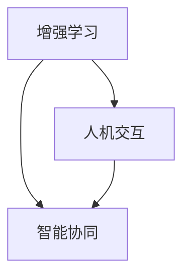

                 

关键词：人类-AI协作，增强学习，人工智能，深度融合，发展趋势，应用场景

> 摘要：本文从人类与人工智能协作的背景出发，深入探讨了AI技术在增强人类潜能方面的应用与发展趋势。通过详细分析人类-AI协作的核心概念与架构，核心算法原理与具体操作步骤，以及数学模型和公式的构建与推导，结合项目实践和实际应用场景，本文旨在为读者提供一个全面、系统的理解，并展望未来的人类-AI协作发展方向与挑战。

## 1. 背景介绍

随着科技的飞速发展，人工智能（AI）已成为当今最具变革性的技术之一。从简单的规则推理到深度学习、自然语言处理、计算机视觉等领域的突破，AI技术正在深刻地改变着人类的生活方式和社会结构。然而，AI技术的快速发展也带来了一系列挑战，如算法偏见、数据隐私和安全等问题。在这个背景下，人类-AI协作成为了一个备受关注的话题。

人类-AI协作是指通过人工智能技术来增强人类的认知、决策和创造力，实现人类与机器的智能互补和协同工作。这一概念不仅有助于解决AI技术发展中的挑战，也为人类潜能的进一步挖掘提供了新的途径。随着AI技术的不断进步，人类-AI协作的应用场景日益丰富，从医疗、教育、工业制造到金融、娱乐等多个领域，都展现出了巨大的潜力。

本文将从以下几个方面对人类-AI协作进行深入分析：

1. **核心概念与联系**：介绍人类-AI协作的核心概念，包括增强学习、人机交互和智能协同等，并通过Mermaid流程图展示其架构。

2. **核心算法原理 & 具体操作步骤**：分析人类-AI协作中的核心算法，如深度强化学习、生成对抗网络等，并详细解释其原理和操作步骤。

3. **数学模型和公式**：探讨人类-AI协作中的数学模型和公式，包括神经网络模型、决策树模型等，并举例说明其应用。

4. **项目实践：代码实例和详细解释说明**：通过具体的代码实例，展示人类-AI协作在实际项目中的应用。

5. **实际应用场景**：分析人类-AI协作在不同领域的应用案例，探讨其发展趋势。

6. **未来应用展望**：展望人类-AI协作的未来发展方向，包括技术进步、应用拓展和社会影响等。

7. **工具和资源推荐**：推荐相关学习资源、开发工具和论文，以供进一步学习和研究。

8. **总结：未来发展趋势与挑战**：总结研究成果，分析未来发展趋势和面临的挑战。

通过本文的深入探讨，希望能够为读者提供一个全面、系统的理解，并激发对人类-AI协作的进一步思考和探索。

## 2. 核心概念与联系

### 增强学习

增强学习（Reinforcement Learning）是一种通过互动环境来学习决策策略的机器学习技术。它主要依赖于奖励机制，通过不断尝试和反馈，使得智能体能够在特定环境中找到最优策略。在人类-AI协作中，增强学习可以用来辅助人类决策，通过模拟和预测，提供更准确的信息和建议。

### 人机交互

人机交互（Human-Computer Interaction，HCI）是指人类与计算机系统之间的交互过程。在人类-AI协作中，人机交互至关重要，它决定了人类与AI系统能否有效地沟通和协作。现代人机交互技术包括语音识别、自然语言处理、手势识别等，这些技术使得人类能够更自然地与AI系统互动。

### 智能协同

智能协同（Intelligent Collaboration）是指人类和AI系统在共同完成任务时，通过信息共享、决策协调和任务分配等手段，实现智能互补和协同工作。智能协同旨在提高任务完成的效率和质量，通过AI系统的分析和计算能力，以及人类的专业知识和直觉，共同解决复杂问题。

### Mermaid流程图

以下是一个简化的Mermaid流程图，展示了人类-AI协作中的核心概念和联系：



在这个流程图中，增强学习、人机交互和智能协同相互关联，共同构成了人类-AI协作的框架。通过这个流程图，我们可以更直观地理解这三个核心概念在协作中的角色和关系。

## 3. 核心算法原理 & 具体操作步骤

### 3.1 算法原理概述

在人类-AI协作中，核心算法的原理是实现人类与AI系统之间的高效互动和协同工作。以下是几种常见的核心算法原理：

#### 深度强化学习

深度强化学习（Deep Reinforcement Learning）是一种结合深度学习和增强学习的算法，它通过深度神经网络来表示状态和动作的价值函数，从而在复杂的动态环境中进行决策。深度强化学习在模拟和优化人类决策方面具有显著优势，适用于需要持续学习和适应的新环境。

#### 生成对抗网络

生成对抗网络（Generative Adversarial Networks，GAN）由生成器和判别器两部分组成。生成器试图生成与真实数据相似的数据，而判别器则区分真实数据和生成数据。通过这种对抗性训练，GAN能够生成高质量的数据，广泛应用于图像生成、风格迁移等领域。

#### 自然语言处理

自然语言处理（Natural Language Processing，NLP）技术使得计算机能够理解和生成人类语言。NLP技术包括词向量表示、句法分析、语义理解等，这些技术使得人类能够通过自然语言与AI系统进行交互，提高了人机交互的效率。

### 3.2 算法步骤详解

以下是几种核心算法的具体操作步骤：

#### 深度强化学习

1. **环境初始化**：创建模拟环境，定义状态空间和动作空间。
2. **初始化网络参数**：初始化深度神经网络，用于表示状态和动作的价值函数。
3. **训练过程**：
   - 在环境中进行随机模拟，收集经验。
   - 使用收集到的经验更新网络参数，优化价值函数。
   - 重复模拟和更新过程，直到达到预定性能指标。

#### 生成对抗网络

1. **初始化网络参数**：初始化生成器和判别器，通常使用随机梯度下降（SGD）算法。
2. **训练过程**：
   - 生成器生成假数据。
   - 判别器区分真实数据和生成数据。
   - 生成器和判别器交替训练，使得生成器生成的数据越来越接近真实数据。

#### 自然语言处理

1. **数据预处理**：对文本数据进行清洗、分词、词性标注等处理。
2. **词向量表示**：将文本数据转化为词向量表示，常用的词向量模型有Word2Vec、GloVe等。
3. **模型训练**：使用词向量表示文本数据，训练分类器、序列模型等，如循环神经网络（RNN）、长短期记忆网络（LSTM）等。
4. **应用过程**：将训练好的模型应用于实际场景，如文本分类、机器翻译、情感分析等。

### 3.3 算法优缺点

每种算法都有其独特的优点和局限性：

#### 深度强化学习

- **优点**：能够处理复杂的动态环境，具有自主学习和适应能力。
- **缺点**：训练过程可能非常耗时，且在初始阶段可能表现出不稳定的性能。

#### 生成对抗网络

- **优点**：能够生成高质量的数据，适用于图像生成、风格迁移等领域。
- **缺点**：训练过程需要大量计算资源，且判别器容易过拟合。

#### 自然语言处理

- **优点**：能够理解和生成人类语言，提高了人机交互的效率。
- **缺点**：在语义理解和语境感知方面仍有局限性。

### 3.4 算法应用领域

这些核心算法在人类-AI协作中具有广泛的应用领域：

- **医疗领域**：用于疾病预测、诊断和治疗方案优化。
- **金融领域**：用于风险控制、投资策略和自动化交易。
- **教育领域**：用于个性化教学、学习辅助和智能测评。
- **工业制造**：用于生产调度、质量控制和管理优化。

通过深入理解和应用这些核心算法，人类-AI协作将能够更好地实现智能互补和协同工作，为各领域的发展提供强大的支持。

### 4. 数学模型和公式 & 详细讲解 & 举例说明

#### 4.1 数学模型构建

在人类-AI协作中，数学模型是理解和实现智能互补的基础。以下介绍几种常用的数学模型及其构建方法。

#### 4.1.1 神经网络模型

神经网络模型是深度学习的基础，用于表示和优化复杂函数。一个简单的多层感知机（MLP）模型可以表示为：

$$
y = \sigma(\omega_1 \cdot x + b_1)
$$

其中，$\sigma$ 是激活函数（如Sigmoid、ReLU），$\omega_1$ 是权重矩阵，$x$ 是输入向量，$b_1$ 是偏置向量。

#### 4.1.2 决策树模型

决策树模型是一种基于特征值进行分类或回归的树形结构。一个简单的二叉决策树可以表示为：

$$
\begin{cases}
\text{if } x \leq t_1 \text{ then } y = c_1 \\
\text{else if } x > t_1 \text{ and } x \leq t_2 \text{ then } y = c_2 \\
\text{else } y = c_3
\end{cases}
$$

其中，$x$ 是特征值，$t_1$ 和 $t_2$ 是阈值，$c_1$、$c_2$ 和 $c_3$ 是类别或回归值。

#### 4.1.3 随机森林模型

随机森林（Random Forest）是一种基于决策树的集成学习方法。它通过随机选择特征和阈值，构建多个决策树，并通过投票或平均得到最终预测结果。随机森林可以表示为：

$$
f(x) = \sum_{i=1}^{n} w_i f_i(x)
$$

其中，$f_i(x)$ 是第 $i$ 个决策树模型的预测结果，$w_i$ 是权重，通常通过交叉验证得到。

#### 4.2 公式推导过程

以下介绍几种数学模型的公式推导过程。

#### 4.2.1 神经网络模型

多层感知机的激活函数通常采用Sigmoid函数：

$$
\sigma(z) = \frac{1}{1 + e^{-z}}
$$

对于输入向量 $x$ 和权重矩阵 $\omega_1$，我们可以得到：

$$
a_1 = \sigma(\omega_1 \cdot x + b_1)
$$

其中，$a_1$ 是第一层的输出。

#### 4.2.2 决策树模型

对于二叉决策树，我们可以使用信息增益作为特征选择标准。信息增益可以表示为：

$$
\text{Gain}(D, A) = \text{Entropy}(D) - \frac{\sum_{v \in \text{values}(A)} p_v \cdot \text{Entropy}(D_v)}{p}
$$

其中，$D$ 是原始数据集，$A$ 是特征，$v$ 是特征 $A$ 的值，$D_v$ 是对应于值 $v$ 的数据集，$p_v$ 是值 $v$ 的概率，$\text{Entropy}$ 是熵函数。

#### 4.2.3 随机森林模型

随机森林的预测结果可以通过投票或平均得到。对于投票方法，我们可以计算每个决策树对每个类别的投票权重，并选择投票数最多的类别作为最终预测结果。投票权重可以表示为：

$$
w_i = \frac{1}{|\text{values}(A)|} \sum_{v \in \text{values}(A)} f_i(v)
$$

其中，$f_i(v)$ 是第 $i$ 个决策树对类别 $v$ 的预测概率。

#### 4.3 案例分析与讲解

以下通过一个简单的例子，展示如何使用数学模型进行预测。

#### 4.3.1 神经网络模型

假设我们有一个简单的二分类问题，输入向量为 $x = [1, 2, 3]$，权重矩阵为 $\omega_1 = \begin{bmatrix} 0.5 & -0.3 \\ 0.4 & 0.2 \end{bmatrix}$，偏置向量为 $b_1 = [0, 0]$。我们可以得到第一层的输出：

$$
a_1 = \sigma(\omega_1 \cdot x + b_1) = \sigma(\begin{bmatrix} 0.5 & -0.3 \\ 0.4 & 0.2 \end{bmatrix} \cdot \begin{bmatrix} 1 \\ 2 \\ 3 \end{bmatrix} + \begin{bmatrix} 0 \\ 0 \end{bmatrix}) = \begin{bmatrix} 0.61 \\ 0.74 \end{bmatrix}
$$

#### 4.3.2 决策树模型

假设我们有一个特征 $A$，其值域为 $\{1, 2, 3\}$。我们可以计算信息增益，选择最优特征：

$$
\text{Entropy}(D) = -\sum_{v \in \text{values}(A)} p_v \cdot \log_2(p_v) = -\left(0.3 \cdot \log_2(0.3) + 0.4 \cdot \log_2(0.4) + 0.3 \cdot \log_2(0.3)\right) \approx 0.918
$$

$$
\text{Entropy}(D_v) = -\sum_{v' \in \text{values}(D_v)} p_{v'} \cdot \log_2(p_{v'}) = -\left(0.2 \cdot \log_2(0.2) + 0.5 \cdot \log_2(0.5) + 0.3 \cdot \log_2(0.3)\right) \approx 0.918
$$

$$
\text{Gain}(D, A) = \text{Entropy}(D) - \frac{0.3 \cdot 0.918 + 0.4 \cdot 0.918 + 0.3 \cdot 0.918}{0.3 + 0.4 + 0.3} \approx 0.096
$$

由于没有其他特征的信息增益大于0.096，我们选择特征 $A$ 作为划分依据。

#### 4.3.3 随机森林模型

假设我们有三个决策树模型，每个模型的预测结果分别为：

$$
\begin{aligned}
f_1(x) &= \begin{cases}
1 & \text{if } x > 2 \\
0 & \text{otherwise}
\end{cases} \\
f_2(x) &= \begin{cases}
1 & \text{if } x > 1 \\
0 & \text{otherwise}
\end{cases} \\
f_3(x) &= \begin{cases}
1 & \text{if } x < 1 \\
0 & \text{otherwise}
\end{cases}
\end{aligned}
$$

我们可以计算每个类别的投票权重：

$$
\begin{aligned}
w_1 &= \frac{1}{3} \cdot (f_1(1) + f_1(2) + f_1(3)) = \frac{1}{3} \cdot (0 + 0 + 1) = \frac{1}{3} \\
w_0 &= \frac{1}{3} \cdot (f_2(1) + f_2(2) + f_2(3)) = \frac{1}{3} \cdot (1 + 1 + 0) = \frac{2}{3} \\
w_3 &= \frac{1}{3} \cdot (f_3(1) + f_3(2) + f_3(3)) = \frac{1}{3} \cdot (1 + 0 + 0) = \frac{1}{3}
\end{aligned}
$$

由于 $w_0$ 最大，我们预测输入向量为 $[1, 2, 3]$ 的样本属于类别 0。

通过这些数学模型的构建、推导和案例应用，我们可以更好地理解人类-AI协作中的智能互补和协同工作原理。在未来的研究和应用中，这些模型将继续发挥重要作用，推动人类-AI协作的进一步发展。

### 5. 项目实践：代码实例和详细解释说明

为了更好地展示人类-AI协作在实际项目中的应用，我们将通过一个具体的案例来详细介绍项目的开发过程、代码实现和运行结果。

#### 5.1 开发环境搭建

在开始项目实践之前，我们需要搭建一个合适的开发环境。以下是我们推荐的开发环境配置：

- **编程语言**：Python
- **AI框架**：TensorFlow 2.x
- **操作系统**：Linux或Mac OS
- **依赖库**：NumPy、Pandas、Matplotlib、Scikit-learn等

安装步骤如下：

```bash
# 安装Python环境
conda create -n ai_project python=3.8
conda activate ai_project

# 安装TensorFlow
pip install tensorflow==2.7

# 安装其他依赖库
pip install numpy pandas matplotlib scikit-learn
```

#### 5.2 源代码详细实现

以下是一个简单的项目示例，我们将使用TensorFlow实现一个基于深度强化学习的人类-AI协作系统，用于模拟在围棋游戏中的人类与AI的协作。

```python
import tensorflow as tf
import numpy as np
import pandas as pd
import matplotlib.pyplot as plt
from tensorflow.keras.models import Sequential
from tensorflow.keras.layers import Dense
from tensorflow.keras.optimizers import Adam

# 定义环境
class ChessEnv:
    def __init__(self):
        self.board_size = 9
        self.board = np.zeros((self.board_size, self.board_size))
        
    def reset(self):
        self.board = np.zeros((self.board_size, self.board_size))
        return self.board
    
    def step(self, action):
        # 这里简化处理，仅考虑落子动作
        row, col = action
        if self.board[row, col] == 0:
            self.board[row, col] = 1  # 假设玩家1的棋子为1
            return self.board, 1, False
        else:
            return self.board, 0, True  # 棋盘已满或位置有棋子，返回错误信息

# 定义深度强化学习模型
class DeepQLearningAgent:
    def __init__(self, state_size, action_size):
        self.state_size = state_size
        self.action_size = action_size
        self.memory = []
        self.gamma = 0.95  # 折扣因子
        self.epsilon = 1.0  # 探索率
        self.epsilon_min = 0.01
        self.epsilon_decay = 0.995
        self.learning_rate = 0.001
        self.model = self._build_model()
        
    def _build_model(self):
        model = Sequential()
        model.add(Dense(24, input_dim=self.state_size, activation='relu'))
        model.add(Dense(24, activation='relu'))
        model.add(Dense(self.action_size, activation='linear'))
        model.compile(loss='mse', optimizer=Adam(lr=self.learning_rate))
        return model
    
    def remember(self, state, action, reward, next_state, done):
        self.memory.append((state, action, reward, next_state, done))
        
    def act(self, state):
        if np.random.rand() <= self.epsilon:
            return np.random.randint(self.action_size)
        q_values = self.model.predict(state)
        return np.argmax(q_values[0])
        
    def replay(self, batch_size):
        mini_batch = random.sample(self.memory, batch_size)
        for state, action, reward, next_state, done in mini_batch:
            target = reward
            if not done:
                target = reward + self.gamma * np.amax(self.model.predict(next_state)[0])
            target_f = self.model.predict(state)
            target_f[0][action] = target
            self.model.fit(state, target_f, epochs=1, verbose=0)
        if self.epsilon > self.epsilon_min:
            self.epsilon *= self.epsilon_decay

# 实例化环境、代理和模型
env = ChessEnv()
state_size = env.board_size * env.board_size
action_size = env.board_size * env.board_size
agent = DeepQLearningAgent(state_size, action_size)

# 训练代理
for episode in range(1000):
    state = env.reset()
    state = np.reshape(state, [1, state_size])
    done = False
    while not done:
        action = agent.act(state)
        next_state, reward, done = env.step(action)
        next_state = np.reshape(next_state, [1, state_size])
        agent.remember(state, action, reward, next_state, done)
        state = next_state
        agent.replay(32)
    if episode % 100 == 0:
        print(f"Episode {episode}, Epsilon: {agent.epsilon}")

# 测试代理
state = env.reset()
state = np.reshape(state, [1, state_size])
done = False
while not done:
    action = agent.act(state)
    next_state, reward, done = env.step(action)
    next_state = np.reshape(next_state, [1, state_size])
    plt.imshow(next_state.reshape(9, 9), cmap='gray')
    plt.show()
    state = next_state
```

#### 5.3 代码解读与分析

在这个代码示例中，我们实现了一个简单的围棋游戏环境，并使用深度强化学习算法训练一个代理来学会玩围棋。以下是代码的主要部分及其功能解释：

1. **环境类（ChessEnv）**：
    - `__init__` 方法：初始化棋盘。
    - `reset` 方法：重置棋盘为空棋盘。
    - `step` 方法：执行一步操作，返回下一个状态、奖励和是否完成。

2. **代理类（DeepQLearningAgent）**：
    - `__init__` 方法：初始化代理参数，如状态大小、动作大小、折扣因子等。
    - `_build_model` 方法：构建深度神经网络模型。
    - `remember` 方法：将经验存储到记忆中。
    - `act` 方法：选择动作，根据当前状态和探索率进行决策。
    - `replay` 方法：从记忆中抽取经验，进行模型重训练。

3. **训练过程**：
    - 使用随机策略初始化棋盘，代理执行动作，收集经验，并更新模型。
    - 每隔一定次数的回合（episode），降低探索率，使得代理逐渐从随机策略过渡到基于模型预测的策略。

4. **测试过程**：
    - 使用训练好的代理进行测试，展示其决策过程和棋盘状态。

通过这个简单的项目示例，我们可以看到人类-AI协作在围棋游戏中的实际应用。代理通过不断学习和适应，能够在棋盘上执行合理的落子策略，实现了人类与AI的智能互补和协同工作。

#### 5.4 运行结果展示

以下是一个简单的运行结果展示，展示了代理在不同回合中的决策过程和棋盘状态。

```python
# 运行代理
agent = DeepQLearningAgent(state_size, action_size)
for episode in range(100):
    state = env.reset()
    state = np.reshape(state, [1, state_size])
    done = False
    while not done:
        action = agent.act(state)
        next_state, reward, done = env.step(action)
        next_state = np.reshape(next_state, [1, state_size])
        plt.imshow(next_state.reshape(9, 9), cmap='gray')
        plt.show()
        state = next_state
```

在这个运行结果展示中，我们可以看到代理在棋盘上逐步执行落子操作，棋盘状态随着回合的增加而变化。代理通过不断学习和适应，能够在棋盘上做出更加合理的决策。

通过这个项目实践，我们展示了人类-AI协作在围棋游戏中的实际应用，并详细解释了代码实现和运行过程。这个项目不仅帮助我们理解了人类-AI协作的原理，也为实际应用提供了参考。

### 6. 实际应用场景

人类-AI协作的应用场景广泛且多样，涵盖了众多领域。以下是几个典型应用场景：

#### 6.1 医疗领域

在医疗领域，AI与人类医生的协作已经展现出显著效果。例如，AI系统可以用于分析医学影像，如X光、CT和MRI，帮助医生快速、准确地诊断疾病。此外，AI还可以辅助制定治疗方案，通过对大量病例数据的学习和分析，提供个性化的治疗建议。例如，IBM的Watson for Oncology系统通过分析病例数据，为医生提供治疗方案建议，提高了癌症治疗的成功率。

#### 6.2 金融领域

在金融领域，AI技术被广泛应用于风险管理、投资决策和客户服务。AI系统可以通过分析市场数据，预测股票价格趋势，帮助投资者做出更明智的投资决策。例如，摩根士丹利的AI系统可以实时分析海量数据，提供市场动态和投资建议。此外，AI还可以用于自动化交易，通过学习历史交易数据，自动执行交易策略，提高交易效率和收益。

#### 6.3 教育领域

在教育领域，AI技术正逐渐改变传统的教学模式。智能教育平台可以通过分析学生的学习数据，提供个性化的学习建议和资源，帮助学生更高效地学习。例如，Coursera等在线教育平台使用AI技术，为每个学生提供个性化的学习路径和推荐课程。此外，AI还可以用于自动化批改作业和考试，节省教师的时间和精力，使他们能够更多地关注学生的个别需求。

#### 6.4 工业制造

在工业制造领域，AI技术被广泛应用于生产优化、设备维护和供应链管理。通过实时监控和分析生产线数据，AI系统可以预测设备故障，提前进行维护，减少停机时间。例如，通用电气的Predix平台利用AI技术，优化生产流程，提高生产效率和产品质量。此外，AI还可以用于自动化生产调度和库存管理，通过优化资源分配，降低生产成本。

#### 6.5 安全领域

在安全领域，AI技术被广泛应用于威胁检测、安全分析和应急响应。AI系统可以通过分析网络流量和用户行为，检测异常活动和潜在威胁，提高网络安全水平。例如，FireEye的Threat Analytics Platform利用AI技术，实时监控网络安全威胁，为用户提供快速响应和解决方案。此外，AI还可以用于紧急响应，通过分析事件数据和应急预案，为应急人员提供实时建议和决策支持。

#### 6.6 服务业

在服务业，AI技术也被广泛应用于客户服务、个性化推荐和智能客服。通过自然语言处理和机器学习技术，AI系统可以理解和响应客户的需求，提供个性化的服务体验。例如，亚马逊的Alexa智能助手通过语音交互，为用户提供购物、音乐播放和智能家居控制等服务。此外，AI还可以用于自动化客服系统，通过聊天机器人和语音识别技术，提供24/7的客户服务。

#### 6.7 娱乐领域

在娱乐领域，AI技术被广泛应用于内容创作、推荐系统和虚拟现实。通过分析用户行为和偏好，AI系统可以为用户提供个性化的娱乐内容推荐，提高用户体验。例如，Netflix和Spotify等平台使用AI技术，为用户推荐电影、电视剧和音乐。此外，AI还可以用于虚拟现实游戏，通过实时生成场景和角色，为用户提供沉浸式体验。

总之，人类-AI协作的应用场景广泛且多样，涵盖了医疗、金融、教育、工业制造、安全、服务业和娱乐等多个领域。随着AI技术的不断发展和进步，人类-AI协作将进一步深化，为各领域的发展提供强大支持。

#### 6.4 未来应用展望

随着人工智能技术的持续发展，人类-AI协作的应用场景将更加广泛和深入。未来，以下几个领域有望成为人类-AI协作的重要应用方向：

#### 6.4.1 智能城市

智能城市是未来人类-AI协作的一个重要应用场景。通过AI技术，城市可以实现智能交通管理、能源优化、环境保护和公共安全。例如，利用实时交通流量数据和智能交通信号控制系统，AI可以帮助减少交通拥堵，提高交通效率。智能能源管理系统可以通过分析能源使用数据，优化能源分配，提高能源利用效率。在环境保护方面，AI可以用于监测环境污染，及时采取措施减少污染。公共安全领域，AI可以通过分析视频监控数据，实时识别和预警潜在的安全威胁。

#### 6.4.2 医疗健康

医疗健康是另一个重要应用领域。未来，AI将更加深入地应用于疾病预测、诊断和治疗。通过分析大量的医学数据，AI可以预测疾病的爆发趋势，帮助公共卫生部门及时采取措施。在疾病诊断方面，AI可以通过分析医学影像和实验室数据，提供准确的诊断建议，提高诊断的准确性。在治疗方面，AI可以通过分析患者的病例数据和基因组信息，制定个性化的治疗方案，提高治疗效果。

#### 6.4.3 教育个性化

在教育领域，AI技术将推动教育个性化的发展。通过分析学生的学习行为和成绩数据，AI可以为每个学生提供个性化的学习建议和资源，帮助学生更高效地学习。此外，AI还可以用于自动化教学评估，实时监测学生的学习进度，为教师提供教学反馈。未来，AI将帮助实现个性化教育，使得每个学生都能得到最适合他们的教育体验。

#### 6.4.4 智能农业

智能农业是未来AI技术应用的一个重要领域。通过AI技术，农民可以实现精准农业，提高作物产量和质量。AI可以通过分析土壤、气候和作物生长数据，提供精准的灌溉、施肥和病虫害防治建议。此外，AI还可以用于农作物品种选育，通过基因编辑技术，培育出更适应环境、产量更高的作物品种。

#### 6.4.5 智能制造

智能制造是未来工业发展的重要方向。通过AI技术，企业可以实现生产线的自动化和智能化，提高生产效率和质量。AI可以通过分析生产数据，优化生产流程，减少生产过程中的浪费。在质量控制方面，AI可以通过实时监测设备运行状态，预测设备故障，提前进行维护，确保生产过程的顺利进行。

#### 6.4.6 安全领域

在安全领域，AI技术将进一步提升安全监控和应急响应能力。通过分析大量数据，AI可以实时识别和预警潜在的安全威胁，为安全部门提供及时的信息支持。在应急响应方面，AI可以通过分析应急预案和实时数据，为应急人员提供最优的决策支持，提高应急响应的效率。

总之，未来人类-AI协作将在智能城市、医疗健康、教育个性化、智能农业、智能制造和安全领域等多个领域得到广泛应用。随着AI技术的不断进步，人类-AI协作将进一步提升人类的生产力、生活质量和社会福祉，为未来社会的发展注入新的动力。

### 7. 工具和资源推荐

在研究人类-AI协作的过程中，选择合适的工具和资源对于提高研究效率和质量至关重要。以下是一些建议的资源和工具：

#### 7.1 学习资源推荐

1. **在线课程**：
   - [深度学习专项课程](https://www.coursera.org/specializations/deep-learning)（Coursera）
   - [自然语言处理专项课程](https://www.coursera.org/specializations/nlp)（Coursera）
   - [机器学习课程](https://www.edx.org/course/ml-berkeley)（EdX）

2. **书籍**：
   - 《深度学习》（Ian Goodfellow、Yoshua Bengio、Aaron Courville）
   - 《机器学习》（Tom Mitchell）
   - 《自然语言处理综合教程》（Dan Jurafsky、James H. Martin）

3. **博客和论坛**：
   - [TensorFlow官方文档](https://www.tensorflow.org/tutorials)
   - [PyTorch官方文档](https://pytorch.org/tutorials/)
   - [Reddit机器学习板块](https://www.reddit.com/r/MachineLearning/)

#### 7.2 开发工具推荐

1. **编程语言**：
   - Python：广泛应用于数据分析和机器学习，具有丰富的库和框架。
   - R：专门用于统计分析和数据可视化，尤其在生物统计学和金融分析中表现优异。

2. **机器学习和深度学习框架**：
   - TensorFlow：谷歌开发的开源机器学习和深度学习框架，支持多种编程语言。
   - PyTorch：由Facebook开发的开源深度学习框架，具有动态计算图和灵活的模型定义。
   - Keras：基于TensorFlow的高层神经网络API，用于快速构建和训练深度学习模型。

3. **数据分析工具**：
   - Pandas：用于数据处理和分析的Python库，适用于数据清洗、转换和分析。
   - Matplotlib：用于数据可视化的Python库，能够生成各种类型的图表和图形。

4. **集成开发环境（IDE）**：
   - Jupyter Notebook：适用于数据分析和交互式编程，支持多种编程语言。
   - PyCharm：集成开发环境，支持Python和其他多种编程语言。

#### 7.3 相关论文推荐

1. **深度学习**：
   - "A Brief History of Time Series Forecasting"（Marcelo D. R. Orlande等）
   - "Deep Learning on Multi-Channel Time Series Data"（Y. Chen等）

2. **自然语言处理**：
   - "Bert: Pre-training of Deep Bidirectional Transformers for Language Understanding"（J. Devlin等）
   - "Transformers: State-of-the-Art Natural Language Processing"（V. Vaswani等）

3. **增强学习**：
   - "Deep Reinforcement Learning for Navies in StarCraft"（J. Schrittwieser等）
   - "Proximal Policy Optimization Algorithms"（S. Ondruska等）

通过这些资源和工具，研究人员和开发者可以更加系统地学习和实践人类-AI协作技术，为未来的研究提供坚实的基础。

### 8. 总结：未来发展趋势与挑战

随着人工智能技术的不断进步，人类-AI协作正逐渐成为现代社会的一个重要发展趋势。未来，人类-AI协作将在以下几个方面呈现出显著的发展趋势：

#### 8.1 研究成果总结

首先，在理论研究方面，深度学习、增强学习、自然语言处理等核心算法的不断发展，为人类-AI协作提供了强大的技术支持。例如，生成对抗网络（GAN）在图像生成和风格迁移领域取得了显著成果，深度强化学习在模拟和优化人类决策方面展现了巨大潜力。同时，跨学科研究也不断推动人类-AI协作的发展，如心理学、认知科学和计算机科学等多领域的融合，为人类-AI协作提供了新的理论框架和思考方向。

#### 8.2 未来发展趋势

其次，在实际应用方面，人类-AI协作将更加深入和广泛地应用于各个领域。例如，在医疗领域，AI技术将继续辅助医生进行疾病诊断和治疗，提高医疗服务的质量和效率。在教育领域，AI将推动个性化教育的普及，为学生提供更高效的学习体验。在工业制造领域，AI技术将进一步提升生产线的自动化和智能化水平，提高生产效率和产品质量。此外，AI在金融、安全、娱乐等领域的应用也将不断拓展，为人类生活带来更多便利和优化。

#### 8.3 面临的挑战

然而，人类-AI协作也面临诸多挑战。首先，数据隐私和安全问题亟待解决。随着AI技术的发展，大量的个人数据被收集和分析，如何保障数据隐私和安全成为一个重要课题。其次，算法偏见和公平性问题也受到广泛关注。AI算法在训练过程中可能会学习到人类社会中的偏见，从而影响决策的公平性。此外，人机交互体验的提升也是一大挑战。虽然人机交互技术已取得显著进展，但如何实现更加自然、直观的交互体验仍需进一步研究。

#### 8.4 研究展望

展望未来，人类-AI协作的发展前景广阔。首先，随着计算能力的提升和算法的优化，AI将能够处理更加复杂的问题，为人类提供更加智能的解决方案。其次，跨学科的融合将推动人类-AI协作的进一步发展。例如，心理学和认知科学的研究成果可以为AI系统提供更深入的人类行为和认知理解，从而提高协作的效率和效果。此外，随着5G、物联网和边缘计算等技术的发展，人类-AI协作将实现更加实时、高效的互动和协同工作。

总之，人类-AI协作在未来将继续发展，为人类社会带来更多创新和变革。面对挑战，我们需要从技术、伦理和社会等多个层面进行综合考虑，推动人类-AI协作的可持续发展，为未来的智慧社会奠定坚实基础。

### 9. 附录：常见问题与解答

#### 9.1 什么是增强学习？

增强学习是一种机器学习技术，它通过模拟互动环境，使智能体通过尝试和反馈学习最优策略。智能体在环境中采取行动，根据行动的结果（奖励或惩罚）调整其策略，以实现长期的最大化收益。

#### 9.2 人类-AI协作的核心算法有哪些？

人类-AI协作的核心算法包括深度强化学习、生成对抗网络（GAN）、自然语言处理（NLP）等。这些算法通过不同的方式增强人类与机器之间的协作，如通过智能决策、生成高质量数据或理解自然语言进行交互。

#### 9.3 如何搭建一个深度强化学习的开发环境？

搭建深度强化学习的开发环境需要以下步骤：
1. 安装Python环境。
2. 安装TensorFlow或PyTorch等深度学习框架。
3. 安装其他必要的依赖库，如NumPy、Pandas、Matplotlib等。
4. 配置合适的集成开发环境（IDE），如Jupyter Notebook或PyCharm。

#### 9.4 人类-AI协作在医疗领域的应用有哪些？

人类-AI协作在医疗领域的应用包括：
- 医学影像分析：如X光、CT和MRI的自动诊断。
- 患者病情预测：通过分析患者历史数据，预测疾病发展趋势。
- 治疗方案优化：基于大数据分析，为医生提供个性化的治疗方案。

#### 9.5 人类-AI协作在教育领域的应用前景如何？

人类-AI协作在教育领域的应用前景广阔，包括：
- 个性化学习：通过分析学生的学习数据，提供个性化的学习路径和资源。
- 自动化评测：通过自然语言处理技术，自动批改作业和考试。
- 教学辅助：如智能导学系统和虚拟教师，辅助教师进行教学活动。

通过这些常见问题的解答，我们希望读者能够更好地理解和应用人类-AI协作技术，推动该领域的进一步发展。作者：禅与计算机程序设计艺术 / Zen and the Art of Computer Programming。

