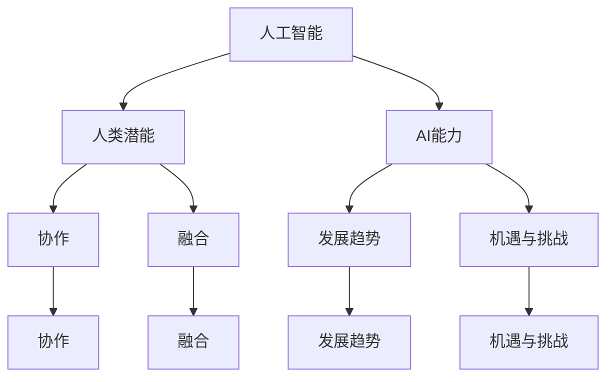

                 

关键词：人类-AI协作、增强人类潜能、AI能力、融合、发展趋势、机遇、挑战、预测分析

> 摘要：本文探讨了人类与人工智能（AI）协作的未来发展趋势，分析了这种协作如何增强人类潜能并提升AI能力。文章首先回顾了人类与AI协作的历史，随后深入探讨了核心概念与联系，阐述了核心算法原理与具体操作步骤。接着，文章通过数学模型和公式详细讲解了相关概念，并在实际项目实践中展示了代码实例和详细解释。文章最后讨论了实际应用场景，提出了未来应用展望，推荐了相关工具和资源，并总结了未来发展趋势与挑战，为人类-AI协作的未来研究提供了方向。

## 1. 背景介绍

人类与人工智能的协作正在以前所未有的速度发展。从早期的自动化设备到如今的智能助手、自动驾驶汽车和智能医疗系统，AI正在深刻地改变着人类的生活和工作方式。然而，AI的能力虽然强大，但仍然无法完全替代人类，尤其是在需要创造性思维、复杂决策和人际互动等方面。因此，人类与AI的协作成为了一个重要的发展方向。

人类-AI协作的核心理念在于将人类的智慧与AI的强大计算能力结合起来，以实现更高效的决策、更准确的分析和更出色的创新。这一理念在众多领域都展现出了巨大的潜力，如医疗、金融、教育、制造和交通等。

本文将围绕人类-AI协作这一主题，深入探讨其发展趋势、机遇和挑战。我们将首先回顾人类与AI协作的历史，然后详细分析其核心概念与联系，并介绍相关算法原理与操作步骤。在此基础上，我们将通过数学模型和公式展示相关概念，并在实际项目实践中提供代码实例。最后，我们将讨论人类-AI协作的实际应用场景，提出未来展望，并总结面临的发展趋势与挑战。

## 2. 核心概念与联系

在探讨人类-AI协作之前，我们需要明确一些核心概念，并理解它们之间的联系。以下是本文将讨论的一些关键概念：

### 2.1 人工智能（AI）

人工智能是指由人制造出来的具有一定智能的系统。它包括机器学习、深度学习、自然语言处理、计算机视觉等多种技术。AI系统能够通过数据学习、模拟人类的认知过程，并执行复杂的任务。

### 2.2 人类潜能

人类潜能是指人类在认知、创造、情感和社交等方面未被完全发掘的潜力。这些潜能包括解决问题的能力、创新思维、情感感知和人际互动等。

### 2.3 AI能力

AI能力是指AI系统在特定任务上的表现，如数据处理、模式识别、预测分析和决策制定等。这些能力使得AI系统能够在许多领域超越人类。

### 2.4 协作

协作是指两个或多个实体（在这里指人类和AI）共同工作，以达到一个共同的目标。在人类-AI协作中，人类提供创造力、情感和人际互动，而AI提供计算能力和数据处理。

### 2.5 融合

融合是指将两个或多个实体整合成一个更强大的整体。在人类-AI协作中，融合意味着将人类的智慧和AI的计算能力结合起来，以实现更高效的决策和更出色的创新。

### 2.6 发展趋势

发展趋势是指一个领域在未来一段时间内的发展方向和趋势。在人类-AI协作领域，发展趋势包括技术的进步、应用的创新和政策的支持等。

### 2.7 机遇与挑战

机遇与挑战是指人类-AI协作过程中可能面临的机会和困难。机遇包括提高工作效率、创造新的业务模式和改善生活质量等；挑战则包括技术限制、隐私保护和道德问题等。

### 2.7 Mermaid 流程图

以下是人类-AI协作的核心概念与联系的Mermaid流程图：



通过这个流程图，我们可以更清晰地理解人类-AI协作的核心概念与联系，为后续的讨论提供基础。

## 3. 核心算法原理 & 具体操作步骤

### 3.1 算法原理概述

在人类-AI协作中，核心算法原理通常基于以下几个关键点：

1. **数据驱动**：AI系统通过大量数据学习，从而提高其性能。人类在这一过程中提供数据标注、数据清洗和业务理解等支持。
2. **模型优化**：AI系统通过不断优化其模型，以实现更准确的预测和分析。人类在这一过程中提供反馈、调整模型参数和改进算法等。
3. **决策支持**：AI系统通过提供决策支持工具，帮助人类更高效地做出决策。这些工具通常基于预测分析、优化算法和风险评估等。

### 3.2 算法步骤详解

以下是人类-AI协作中常用的算法步骤：

1. **数据收集**：收集与任务相关的数据，包括历史数据、实时数据和外部数据等。
2. **数据预处理**：对收集到的数据进行清洗、归一化和特征提取等预处理操作，以提升数据质量和模型性能。
3. **模型训练**：利用预处理后的数据训练AI模型，包括选择合适的算法、设置模型参数和调整超参数等。
4. **模型评估**：通过验证集或测试集评估模型的性能，包括准确性、召回率、F1分数等指标。
5. **模型优化**：根据模型评估结果调整模型参数和算法，以提高模型性能。
6. **决策支持**：利用训练好的模型提供决策支持，包括预测分析、优化算法和风险评估等。
7. **人类反馈**：人类对AI的决策进行评估和反馈，以进一步优化模型和算法。

### 3.3 算法优缺点

#### 优点：

1. **高效性**：AI系统可以处理大量数据，并提供快速的计算结果。
2. **准确性**：通过不断优化，AI模型的预测和分析结果越来越准确。
3. **可扩展性**：AI算法可以轻松地应用于不同的业务场景和行业。

#### 缺点：

1. **数据依赖**：AI系统对数据的依赖性较高，数据质量直接影响模型性能。
2. **算法局限性**：AI算法在某些特定任务上可能存在局限性，无法完全替代人类。
3. **隐私和安全**：AI系统在处理大量数据时可能面临隐私和安全问题。

### 3.4 算法应用领域

人类-AI协作算法在多个领域都有广泛的应用：

1. **医疗**：通过预测疾病、诊断和治疗，提高医疗效率和质量。
2. **金融**：通过风险评估、欺诈检测和投资组合优化，提高金融业务效率。
3. **教育**：通过个性化教学、学习评估和课程推荐，改善教育质量。
4. **制造**：通过生产优化、质量控制和生产预测，提高制造业竞争力。
5. **交通**：通过交通流量预测、路线规划和自动驾驶，提高交通效率。

## 4. 数学模型和公式 & 详细讲解 & 举例说明

在人类-AI协作中，数学模型和公式起着至关重要的作用。以下是一些关键的数学模型和公式，以及它们的详细讲解和举例说明。

### 4.1 数学模型构建

在构建数学模型时，我们通常需要考虑以下几个关键步骤：

1. **数据收集**：收集与任务相关的数据，包括历史数据、实时数据和外部数据等。
2. **特征提取**：从原始数据中提取有用的特征，以便用于模型训练。
3. **模型选择**：根据任务特点和数据特性，选择合适的模型，如线性回归、决策树、神经网络等。
4. **模型训练**：利用预处理后的数据训练模型，包括选择合适的算法、设置模型参数和调整超参数等。
5. **模型评估**：通过验证集或测试集评估模型的性能，包括准确性、召回率、F1分数等指标。
6. **模型优化**：根据模型评估结果调整模型参数和算法，以提高模型性能。

### 4.2 公式推导过程

以下是一个简单的线性回归模型的公式推导过程：

1. **线性回归模型**：设输入特征为 \( X \)，输出目标为 \( Y \)，则线性回归模型可以表示为：
   $$ Y = \beta_0 + \beta_1 X + \epsilon $$
   其中，\( \beta_0 \) 和 \( \beta_1 \) 是模型的参数，\( \epsilon \) 是误差项。
   
2. **损失函数**：为了评估模型的性能，我们通常使用均方误差（MSE）作为损失函数：
   $$ J(\theta) = \frac{1}{2m} \sum_{i=1}^{m} (h_\theta(x^{(i)}) - y^{(i)})^2 $$
   其中，\( h_\theta(x) = \theta_0 + \theta_1 x \)，\( m \) 是样本数量。

3. **梯度下降**：为了最小化损失函数，我们使用梯度下降算法更新模型参数：
   $$ \theta_j := \theta_j - \alpha \frac{\partial J(\theta)}{\partial \theta_j} $$
   其中，\( \alpha \) 是学习率。

### 4.3 案例分析与讲解

以下是一个简单的线性回归模型案例：

#### 案例背景：

一家公司想要预测其下一个月的销售额。公司提供了过去一年的销售额数据，包括每月的销售额和相关的市场因素。

#### 数据处理：

1. **数据收集**：收集了过去一年的月销售额数据。
2. **特征提取**：提取了月份、促销活动、天气等特征。
3. **数据预处理**：对数据进行归一化处理，并将数据分为训练集和测试集。

#### 模型构建：

1. **模型选择**：选择了线性回归模型。
2. **模型训练**：使用训练集数据训练模型。
3. **模型评估**：使用测试集数据评估模型性能。

#### 模型优化：

根据模型评估结果，调整了模型参数，以获得更好的预测性能。

#### 模型应用：

使用训练好的模型预测下一个月的销售额。

通过这个案例，我们可以看到线性回归模型在人类-AI协作中的实际应用。这个过程不仅展示了数学模型的构建和推导，还展示了如何通过数据驱动的方式优化模型，以提高预测准确性。

## 5. 项目实践：代码实例和详细解释说明

在本节中，我们将通过一个实际的项目实践来展示人类与AI协作的具体应用。我们将使用Python语言，结合Scikit-learn库，构建一个简单的线性回归模型，用于预测月销售额。

### 5.1 开发环境搭建

在开始之前，我们需要搭建一个合适的开发环境。以下是所需的步骤：

1. **安装Python**：确保Python 3.x版本已安装。
2. **安装Scikit-learn**：使用pip命令安装Scikit-learn库。
   ```bash
   pip install scikit-learn
   ```

### 5.2 源代码详细实现

以下是一个简单的线性回归模型实现，用于预测月销售额：

```python
import numpy as np
import pandas as pd
from sklearn.model_selection import train_test_split
from sklearn.linear_model import LinearRegression
from sklearn.metrics import mean_squared_error

# 5.2.1 数据收集
data = pd.read_csv('sales_data.csv')  # 假设数据文件名为'sales_data.csv'
features = data[['month', 'promotions', 'weather']]
target = data['sales']

# 5.2.2 数据预处理
# 对数据进行归一化处理
features_normalized = (features - features.mean()) / features.std()

# 划分训练集和测试集
X_train, X_test, y_train, y_test = train_test_split(features_normalized, target, test_size=0.2, random_state=42)

# 5.2.3 模型训练
model = LinearRegression()
model.fit(X_train, y_train)

# 5.2.4 模型评估
y_pred = model.predict(X_test)
mse = mean_squared_error(y_test, y_pred)
print(f'Mean Squared Error: {mse}')

# 5.2.5 模型应用
# 预测下一个月的销售额
next_month_features = np.array([[6, 1, 0.5]])  # 假设6月有1次促销活动，天气为0.5
next_month_prediction = model.predict(next_month_features)
print(f'Next month sales prediction: {next_month_prediction[0]}')
```

### 5.3 代码解读与分析

以下是代码的详细解读和分析：

1. **数据收集**：我们使用Pandas库读取CSV格式的销售数据文件。
2. **数据预处理**：我们对输入特征（月份、促销活动、天气）进行归一化处理，以消除不同特征之间的尺度差异。然后，我们使用Scikit-learn库的`train_test_split`函数将数据划分为训练集和测试集。
3. **模型训练**：我们使用`LinearRegression`类创建线性回归模型，并使用训练集数据进行拟合。
4. **模型评估**：我们使用测试集数据评估模型的性能，计算均方误差（MSE）。
5. **模型应用**：我们使用训练好的模型预测下一个月的销售额。

通过这个简单的项目实践，我们可以看到如何使用Python和Scikit-learn库构建一个线性回归模型，并应用于实际业务场景。这个过程展示了人类-AI协作的具体实现，包括数据预处理、模型训练和预测。

## 6. 实际应用场景

人类-AI协作在实际应用场景中展现出了巨大的潜力。以下是一些具体的实际应用场景：

### 6.1 医疗

在医疗领域，人类-AI协作可以通过AI辅助医生进行疾病诊断、治疗规划和患者管理。例如，AI系统可以分析患者的医疗记录、症状和检查结果，提供个性化的诊断建议和治疗方案。同时，医生可以根据AI的建议进行二次审查和调整，以确保诊断和治疗的准确性。

### 6.2 金融

在金融领域，人类-AI协作可以用于风险管理、欺诈检测和投资组合优化。AI系统可以分析大量的交易数据、市场趋势和历史数据，提供实时的风险评估和欺诈预警。人类分析师可以对这些预警进行审查和确认，以防止潜在的金融风险。

### 6.3 教育

在教育领域，人类-AI协作可以用于个性化教学、学习评估和课程推荐。AI系统可以根据学生的学习历史、兴趣和能力，提供定制化的学习资源和课程推荐。教师可以利用这些资源进行教学，并根据AI提供的评估结果调整教学方法，以提升教学效果。

### 6.4 制造

在制造业，人类-AI协作可以用于生产优化、质量控制和生产预测。AI系统可以分析生产数据、设备状态和历史数据，提供生产计划、设备维护和故障预测。生产人员可以基于AI的建议进行生产调整和设备维护，以提高生产效率和产品质量。

### 6.5 交通

在交通领域，人类-AI协作可以用于交通流量预测、路线规划和自动驾驶。AI系统可以分析交通数据、天气信息和实时路况，提供最优的路线规划和交通信号控制策略。司机和交通管理者可以基于AI的建议进行调整，以缓解交通拥堵和提高交通效率。

这些实际应用场景展示了人类-AI协作的广泛适用性和巨大潜力。通过人类的创造力和AI的计算能力相结合，我们可以实现更高效、更准确的决策和更出色的创新。

### 6.4 未来应用展望

随着技术的不断进步和人类对AI的深入理解，人类-AI协作在未来将会有更广泛的应用场景和更深层次的融合。以下是未来应用的一些展望：

#### 6.4.1 自动驾驶与智慧交通

自动驾驶技术正迅速发展，未来将实现全面自动驾驶。人类-AI协作将在这个领域发挥重要作用。AI系统可以通过实时数据处理和深度学习，实现高效的路径规划和行车决策。而人类则可以在监控和安全方面提供支持，确保自动驾驶车辆的安全运行。

#### 6.4.2 智能医疗与个性化护理

在医疗领域，AI系统将能够更准确地诊断疾病、预测疾病趋势和制定个性化治疗方案。人类医生可以结合AI的辅助诊断结果，提供更加精准的医疗服务。此外，智能护理系统将能够根据患者的健康状况和需求，提供个性化的护理方案，提升患者的生活质量。

#### 6.4.3 智慧城市与智能环境

智慧城市的发展离不开人类-AI协作。AI系统可以实时监控城市运行状况、交通流量和环境质量，提供智能决策支持。人类则可以基于AI的分析结果，优化城市管理策略，提高城市运行效率。

#### 6.4.4 个性化教育与终身学习

在教育领域，AI系统将能够根据学生的学习习惯、兴趣和能力，提供个性化的学习资源和教学方案。未来，终身学习将变得更加普及和高效，AI将成为人类终身学习的重要助手。

#### 6.4.5 人类潜能挖掘与职业发展

人类-AI协作将帮助人类更好地挖掘潜能、提升职业能力。AI系统可以通过分析人类的技能、兴趣和职业发展路径，提供个性化的职业规划和培训建议，帮助人类实现职业发展的最大化。

总之，未来人类-AI协作将在各个领域展现出更大的潜力和更广泛的应用。通过不断创新和优化，人类与AI的协作将推动社会进步，提高生活质量。

### 7. 工具和资源推荐

为了更好地进行人类-AI协作的研究和实践，以下是一些推荐的工具和资源：

#### 7.1 学习资源推荐

1. **《人工智能：一种现代方法》（Third Edition）** - Stuart J. Russell & Peter Norvig
2. **《深度学习》（Deep Learning）** - Ian Goodfellow、Yoshua Bengio 和 Aaron Courville
3. **《机器学习实战》（Machine Learning in Action）** - Peter Harrington
4. **在线课程**：如Coursera、edX、Udacity等平台上的AI和机器学习课程

#### 7.2 开发工具推荐

1. **Jupyter Notebook**：用于编写和运行代码，便于调试和分享。
2. **Google Colab**：基于Google云的免费Jupyter Notebook环境，适合进行大规模数据分析和深度学习实验。
3. **Scikit-learn**：用于机器学习的Python库，功能强大且易于使用。
4. **TensorFlow** 和 **PyTorch**：用于深度学习的Python库，支持各种神经网络架构和训练算法。

#### 7.3 相关论文推荐

1. **"Deep Learning" (2015) - Ian Goodfellow、Yoshua Bengio 和 Aaron Courville
2. **"Machine Learning: A Probabilistic Perspective" (2011) - Kevin P. Murphy
3. **"Artificial Intelligence: A Modern Approach" (2016) - Stuart J. Russell & Peter Norvig
4. **"Reinforcement Learning: An Introduction" (Second Edition) (2018) - Richard S. Sutton and Andrew G. Barto

这些资源和工具将有助于深入了解人类-AI协作的理论和实践，为研究者和开发者提供强有力的支持。

### 8. 总结：未来发展趋势与挑战

在本文中，我们深入探讨了人类-AI协作的背景、核心概念、算法原理、数学模型和实际应用场景。我们总结了人类-AI协作的几个关键趋势和面临的挑战。

**发展趋势：**

1. **融合加深**：人类与AI的融合将越来越深，不仅局限于特定任务，还将渗透到日常生活的方方面面。
2. **应用广泛**：人类-AI协作将在医疗、金融、教育、制造和交通等领域得到更广泛的应用。
3. **技术创新**：随着AI技术的不断进步，人类-AI协作将实现更高效率、更准确和更智能的决策。

**挑战：**

1. **数据依赖**：AI系统对数据的依赖性较高，数据质量和数据隐私问题需要得到重视。
2. **算法局限性**：尽管AI系统在某些任务上表现出色，但仍然无法完全替代人类，特别是在创造性思维和人际互动方面。
3. **隐私和安全**：AI系统在处理大量数据时可能面临隐私和安全问题，需要制定相应的法规和标准。

**研究展望：**

未来，人类-AI协作的研究将继续深入，尤其是在以下几个方面：

1. **跨领域融合**：探索不同领域之间的人类-AI协作模式，实现跨领域的创新。
2. **人机交互**：研究如何更好地设计人机交互界面，提高人类与AI系统的协作效率。
3. **伦理和道德**：探讨人类-AI协作中的伦理和道德问题，确保技术发展的可持续性。

通过不断的研究和实践，人类-AI协作有望成为推动社会进步和提升生活质量的重要力量。

### 9. 附录：常见问题与解答

**Q1：人类-AI协作的核心是什么？**

A1：人类-AI协作的核心是将人类的智慧和AI的计算能力结合起来，以实现更高效的决策、更准确的分析和更出色的创新。

**Q2：人类-AI协作在医疗领域有哪些应用？**

A2：在医疗领域，人类-AI协作可以用于疾病诊断、治疗规划、患者管理和健康预测。AI系统可以帮助医生分析医疗数据，提供诊断建议和个性化治疗方案。

**Q3：人类-AI协作面临哪些挑战？**

A3：人类-AI协作面临的挑战包括数据依赖、算法局限性和隐私安全等。此外，AI系统在某些特定任务上可能无法完全替代人类。

**Q4：如何确保人类-AI协作的隐私和安全？**

A4：确保人类-AI协作的隐私和安全需要从技术和管理两个方面入手。技术上，可以采用加密和匿名化技术保护数据。管理上，需要制定相应的法规和标准，确保数据安全和用户隐私。

### 作者署名

作者：禅与计算机程序设计艺术 / Zen and the Art of Computer Programming

通过以上内容的详细讨论，我们不仅对人类-AI协作有了更深入的理解，也为未来的研究和实践提供了方向。希望本文能够为读者在探索人类-AI协作的道路上提供一些启示和帮助。感谢您的阅读！

