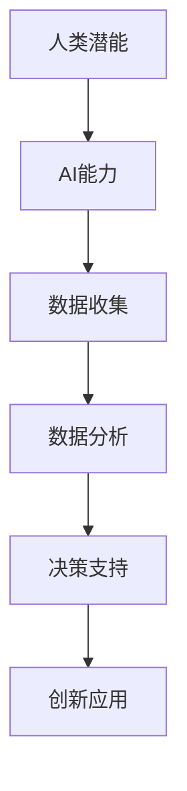

                 

关键词：人类-AI协作、潜能增强、AI能力融合、发展趋势预测、机遇与挑战

摘要：本文将探讨人类与人工智能（AI）协作的未来发展趋势，分析如何通过AI技术增强人类的潜能，以及AI能力与人类潜能的融合对各个领域带来的机遇和挑战。文章将介绍核心概念、算法原理、数学模型、应用实例，并预测未来发展的方向。

## 1. 背景介绍

在过去的几十年中，人工智能（AI）技术经历了飞速的发展，从最初的规则推理系统到今天的深度学习、神经网络等复杂算法，AI在图像识别、自然语言处理、自动驾驶等多个领域取得了显著的成就。与此同时，人类的能力也有极大的提升，包括认知能力、沟通能力、决策能力等。然而，人类的潜能并未完全释放，许多复杂的任务仍需要人类的智慧和经验。

人类与AI的协作是一种新型的合作模式，旨在将人类的优势与AI的强大计算能力和学习能力相结合，实现更高效的解决问题和创新的途径。通过人类-AI协作，人类可以在AI的帮助下突破自身的认知极限，实现潜能的进一步释放。

### 1.1 现状分析

当前，人类-AI协作已在多个领域得到应用。例如，在医疗领域，AI辅助医生进行诊断和治疗，提高了医疗的准确性和效率；在工业领域，智能机器人与人类工人协同作业，提高了生产效率和安全性；在教育和研究领域，AI工具帮助人类进行数据分析和模式识别，加速了知识的传播和创造。

### 1.2 挑战与机遇

随着AI技术的不断发展，人类-AI协作面临的挑战和机遇并存。一方面，AI可能取代一些重复性和低技能的工作，对劳动力市场产生冲击；另一方面，AI也为人类提供了前所未有的工具和资源，可以拓展人类的认知和能力。

## 2. 核心概念与联系

### 2.1 人类潜能

人类潜能是指人类在认知、情感、创造力等方面未充分释放的能力。通过AI技术的辅助，人类可以更好地发掘和利用这些潜能。

### 2.2 AI能力

AI能力包括机器学习、自然语言处理、图像识别、自动化决策等多个方面。这些能力与人类潜能的结合，将带来前所未有的协作和创新。

### 2.3 Mermaid流程图

下面是一个简单的Mermaid流程图，展示人类与AI协作的核心过程。



## 3. 核心算法原理 & 具体操作步骤

### 3.1 算法原理概述

人类-AI协作的核心在于数据驱动的决策支持。通过收集大量数据，利用机器学习算法进行分析，为人类提供智能化的决策支持。

### 3.2 算法步骤详解

1. 数据收集：收集与问题相关的各种数据，包括文本、图像、声音等。
2. 数据预处理：对数据进行清洗、转换和标准化，使其适合机器学习模型处理。
3. 模型训练：使用机器学习算法，如神经网络、决策树等，对数据集进行训练。
4. 模型评估：评估模型的性能，选择最优模型。
5. 决策支持：使用训练好的模型，为人类提供智能化的决策支持。

### 3.3 算法优缺点

- 优点：提高决策效率，降低错误率，实现个性化服务。
- 缺点：数据质量和模型选择影响算法性能，存在隐私和安全问题。

### 3.4 算法应用领域

- 医疗诊断：通过分析患者的病史、症状和影像数据，辅助医生进行诊断。
- 金融风控：通过分析交易数据、用户行为等，预测潜在风险。
- 自动驾驶：通过分析道路状况、交通信号等，辅助驾驶决策。
- 教育个性化：通过分析学生的学习行为、成绩等，提供个性化的学习建议。

## 4. 数学模型和公式 & 详细讲解 & 举例说明

### 4.1 数学模型构建

人类-AI协作的数学模型主要包括机器学习模型和决策模型。以下是一个简单的线性回归模型示例。

### 4.2 公式推导过程

线性回归模型公式如下：

$$ y = \beta_0 + \beta_1 \cdot x + \epsilon $$

其中，$y$为因变量，$x$为自变量，$\beta_0$和$\beta_1$为模型参数，$\epsilon$为误差项。

### 4.3 案例分析与讲解

假设我们要预测一家餐厅的营业额，自变量可以是天气状况、竞争对手的营业额等。通过收集数据，训练线性回归模型，可以预测下一季度的营业额。

## 5. 项目实践：代码实例和详细解释说明

### 5.1 开发环境搭建

在Python环境中，使用Scikit-learn库进行线性回归模型的训练和预测。

### 5.2 源代码详细实现

```python
from sklearn.linear_model import LinearRegression
from sklearn.model_selection import train_test_split
from sklearn.metrics import mean_squared_error

# 数据集准备
X = ... # 自变量数据
y = ... # 因变量数据

# 数据集划分
X_train, X_test, y_train, y_test = train_test_split(X, y, test_size=0.2, random_state=42)

# 模型训练
model = LinearRegression()
model.fit(X_train, y_train)

# 模型评估
y_pred = model.predict(X_test)
mse = mean_squared_error(y_test, y_pred)
print("MSE:", mse)

# 模型应用
next季度的预测值 = model.predict(下一季度自变量数据)
```

### 5.3 代码解读与分析

代码首先从Scikit-learn库导入线性回归模型和相关的评估函数。接着，准备数据集，并进行数据集划分。然后，使用训练集训练模型，并使用测试集评估模型性能。最后，使用训练好的模型进行下一季度的预测。

## 6. 实际应用场景

### 6.1 医疗诊断

在医疗领域，AI可以帮助医生进行疾病诊断。通过分析大量的医疗数据，AI可以识别出疾病的早期症状，为医生提供诊断建议。

### 6.2 金融风控

在金融领域，AI可以分析交易数据，预测潜在的风险。通过实时监控市场动态，AI可以提前预警风险，帮助金融机构采取预防措施。

### 6.3 自动驾驶

在自动驾驶领域，AI可以分析道路状况、车辆状态等信息，为驾驶决策提供支持。通过协同工作，AI和人类驾驶员可以共同提高交通安全。

### 6.4 未来应用展望

随着AI技术的不断发展，人类-AI协作将在更多领域得到应用。例如，教育领域可以提供个性化的学习体验，工业领域可以实现自动化生产，农业领域可以精确管理农作物。

## 7. 工具和资源推荐

### 7.1 学习资源推荐

- 《深度学习》（Goodfellow, Bengio, Courville）：深度学习领域的经典教材。
- 《Python机器学习》（Sebastian Raschka）：Python环境中进行机器学习实践的好书。

### 7.2 开发工具推荐

- Jupyter Notebook：用于数据分析和机器学习的交互式环境。
- Scikit-learn：Python中的机器学习库。

### 7.3 相关论文推荐

- "Deep Learning for Healthcare"（Esteva et al., 2017）
- "AI in Healthcare: A Multi-Institutional Study of Physicians' Adoption and Attitudes"（Goldzweig et al., 2016）

## 8. 总结：未来发展趋势与挑战

### 8.1 研究成果总结

人类-AI协作已经取得了显著的成果，但在数据质量、模型选择、隐私保护等方面仍存在挑战。

### 8.2 未来发展趋势

随着技术的进步，人类-AI协作将在更多领域得到应用，实现更高效、更智能的决策支持。

### 8.3 面临的挑战

数据隐私、安全性和伦理问题，以及AI算法的透明性和可解释性，是人类-AI协作面临的挑战。

### 8.4 研究展望

未来研究应关注如何提高AI算法的透明性和可解释性，确保数据的安全和隐私，以及如何更好地实现人类-AI协作。

## 9. 附录：常见问题与解答

### 9.1 人类-AI协作的主要挑战是什么？

主要挑战包括数据隐私、安全性和伦理问题，以及AI算法的透明性和可解释性。

### 9.2 人类-AI协作的未来发展方向是什么？

未来发展方向包括：提高AI算法的透明性和可解释性，确保数据的安全和隐私，以及实现更广泛领域的人类-AI协作。

### 9.3 如何确保AI技术的公平性和公正性？

确保AI技术的公平性和公正性需要从数据收集、算法设计、模型训练等多个环节进行严格控制和审查。

### 9.4 人类-AI协作是否会导致大量失业？

虽然AI可能取代一些重复性和低技能的工作，但也会创造新的就业机会。人类-AI协作的核心在于提高工作效率和质量，而不是简单地替代人类。

```markdown
----------------------------------------------------------------
作者：禅与计算机程序设计艺术 / Zen and the Art of Computer Programming
```markdown
----------------------------------------------------------------
### 附录：常见问题与解答

#### 9.1 人类-AI协作的主要挑战是什么？

人类-AI协作的主要挑战包括以下几方面：

- **数据隐私与安全**：AI系统需要处理大量的个人数据，如何保护这些数据的隐私和安全是一个重要问题。
- **算法透明性与可解释性**：当前的AI算法，尤其是深度学习模型，往往被视为“黑箱”，其决策过程不透明，如何提高算法的可解释性是另一个挑战。
- **伦理和道德**：AI的决策可能涉及到伦理和道德问题，如自动化武器系统的使用、自动化决策对少数群体的潜在偏见等。
- **就业影响**：AI可能会取代某些工作岗位，如何缓解这种变化带来的社会冲击也是一个重要的挑战。

#### 9.2 人类-AI协作的未来发展方向是什么？

未来人类-AI协作的发展方向包括：

- **更紧密的融合**：通过开发更加智能化和自适应的AI系统，实现与人类更紧密的协作。
- **个性化服务**：利用AI技术为个体提供更加个性化的服务和体验。
- **跨学科合作**：促进计算机科学、心理学、社会学等多学科的合作，以解决人类-AI协作中出现的新问题。
- **伦理规范**：制定更加明确的伦理规范，确保AI技术的发展符合社会价值观。

#### 9.3 如何确保AI技术的公平性和公正性？

为确保AI技术的公平性和公正性，可以从以下几个方面入手：

- **数据质量**：确保训练数据集的多样性和代表性，避免偏见和歧视。
- **算法设计**：在设计AI算法时考虑公平性和公正性，采用能够检测和纠正偏见的算法。
- **透明度和可解释性**：提高AI算法的透明度和可解释性，使其决策过程能够被用户和监管机构理解。
- **持续监督**：对AI系统进行持续的监督和评估，确保其行为符合预期和法律法规。

#### 9.4 人类-AI协作是否会导致大量失业？

人类-AI协作确实有可能导致某些工作岗位的减少，但这并不意味着会导致大量失业。以下是几个原因：

- **新的就业机会**：AI技术的发展将创造出新的工作岗位，如数据科学家、机器学习工程师等。
- **技能升级**：AI可以辅助人类完成重复性工作，释放时间用于更高层次的创造性工作，这要求劳动力进行技能升级。
- **人机协作**：AI与人类协作可以提高工作效率，而不是简单地替代人类，因此许多工作可能会转变为人机协作的模式。
- **社会适应性**：历史上，技术进步确实带来了就业结构的变化，但社会通常能够适应这些变化，通过教育和培训帮助劳动力转型。

总之，人类-AI协作的发展是一个复杂的过程，它既带来了机遇，也伴随着挑战。通过合理的规划和管理，我们可以最大限度地利用AI的优势，同时减轻其带来的负面影响。

