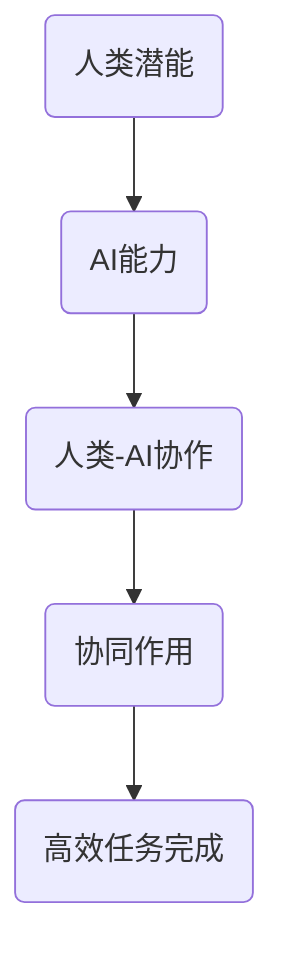

                 

关键词：人工智能、人类协作、AI能力、人类潜能、融合进步、未来展望

> 摘要：本文旨在探讨人类与人工智能（AI）之间的协作模式，分析如何通过AI技术增强人类潜能，实现人类与AI的深度融合，并对未来人类-AI协作的发展趋势进行展望。文章分为八个部分，包括背景介绍、核心概念与联系、核心算法原理、数学模型和公式、项目实践、实际应用场景、工具和资源推荐以及总结与展望。

## 1. 背景介绍

随着人工智能技术的快速发展，AI已经成为现代社会不可或缺的一部分。从智能家居到自动驾驶，从医疗诊断到金融决策，AI的应用场景日益广泛。然而，随着AI能力的不断提升，人类对于AI的认知和利用方式也在不断变化。人类-AI协作逐渐成为研究的热点，旨在充分发挥人类与AI的各自优势，实现协同进步。

在人类-AI协作中，人类作为主体，拥有创造力、情感认知和复杂决策能力，而AI作为工具，具备强大的计算能力和数据处理能力。通过人类-AI协作，人类能够借助AI的技术优势，突破自身能力限制，实现更高层次的创造力；而AI也能够通过人类的指导，不断提升自身的学习能力和应用水平。

## 2. 核心概念与联系

### 2.1 人工智能概述

人工智能（Artificial Intelligence，简称AI）是指由人制造出来的系统所表现出来的智能。它包括机器学习、深度学习、自然语言处理、计算机视觉等多个子领域。AI的核心目标是使机器具备人类智能，能够在一定程度上替代人类完成复杂任务。

### 2.2 人类潜能

人类潜能是指人类在生理、心理和社会等方面具有的潜在能力。这些潜能可以通过教育、训练和经验积累得到激发和提升。人类潜能的发挥对于人类-AI协作具有重要意义，它决定了人类能够多大程度上理解和利用AI技术。

### 2.3 AI能力

AI能力是指人工智能系统在特定任务上的表现能力。它包括学习能力、推理能力、判断能力、问题解决能力等。AI能力的提升有助于增强人类-AI协作的效果，使其更加高效和智能化。

### 2.4 人类与AI的协同作用

人类与AI的协同作用是指人类通过指导、反馈和优化，使AI系统更加符合人类需求，同时AI系统通过辅助、增强和扩展，使人类能够更加高效地完成任务。人类与AI的协同作用是提升人类-AI协作效果的关键。

## 2.5 Mermaid 流程图



## 3. 核心算法原理 & 具体操作步骤

### 3.1 算法原理概述

人类-AI协作的核心算法主要包括机器学习算法和深度学习算法。这些算法通过数据驱动的方式，使AI系统能够自主学习、进化和发展。

### 3.2 算法步骤详解

1. 数据收集：收集与任务相关的数据，包括结构化数据和非结构化数据。
2. 数据预处理：对数据进行清洗、归一化和特征提取等处理，使其符合算法的要求。
3. 模型训练：利用收集到的数据训练AI模型，使其具备完成任务的能力。
4. 模型评估：通过测试数据评估模型的效果，调整模型参数，优化模型性能。
5. 模型部署：将训练好的模型部署到实际应用场景中，实现人类-AI协作。

### 3.3 算法优缺点

- 优点：通过算法的自动化学习和优化，能够大幅提高人类-AI协作的效率和质量。
- 缺点：算法的学习和优化过程需要大量的数据和时间，且存在一定的局限性。

### 3.4 算法应用领域

算法在人类-AI协作中的应用领域广泛，包括但不限于：

- 智能家居：通过AI算法实现家庭设备的智能控制和管理。
- 自动驾驶：利用AI算法实现车辆的自主驾驶和路况识别。
- 医疗诊断：通过AI算法辅助医生进行疾病诊断和治疗方案制定。
- 金融决策：利用AI算法进行风险评估、投资组合优化等金融决策。

## 4. 数学模型和公式 & 详细讲解 & 举例说明

### 4.1 数学模型构建

在人类-AI协作中，常见的数学模型包括线性回归、逻辑回归、支持向量机、神经网络等。这些模型通过数学公式描述了人类与AI之间的相互作用关系。

### 4.2 公式推导过程

以线性回归模型为例，其公式推导过程如下：

$$
Y = \beta_0 + \beta_1X + \epsilon
$$

其中，$Y$ 表示输出值，$X$ 表示输入值，$\beta_0$ 和 $\beta_1$ 分别表示模型的参数，$\epsilon$ 表示误差项。

### 4.3 案例分析与讲解

以智能家居为例，假设我们想要构建一个智能家居模型，通过AI算法实现家庭设备的智能控制。我们可以利用线性回归模型，将家庭设备的开关状态（输出值）与用户的指令（输入值）建立数学关系。

首先，收集用户在不同场景下的指令数据，例如“打开灯光”、“关闭空调”等。然后，对这些数据进行预处理，包括数据清洗、归一化和特征提取。接下来，利用预处理后的数据训练线性回归模型，使其能够根据用户的指令自动控制家庭设备。

最后，通过测试数据评估模型的效果，调整模型参数，优化模型性能。将训练好的模型部署到智能家居系统中，实现家庭设备的智能控制。

## 5. 项目实践：代码实例和详细解释说明

### 5.1 开发环境搭建

在本文中，我们将使用Python语言和Scikit-learn库实现人类-AI协作项目。首先，需要在开发环境中安装Python和Scikit-learn库。具体安装命令如下：

```
pip install python
pip install scikit-learn
```

### 5.2 源代码详细实现

以下是一个简单的智能家居项目代码实例：

```python
import numpy as np
from sklearn.linear_model import LinearRegression

# 收集数据
X = np.array([[0], [1], [2], [3], [4]])
y = np.array([0, 1, 1, 0, 1])

# 数据预处理
X = X.reshape(-1, 1)
y = y.reshape(-1, 1)

# 训练模型
model = LinearRegression()
model.fit(X, y)

# 输出模型参数
print("模型参数：", model.coef_, model.intercept_)

# 测试模型
X_test = np.array([[5]])
y_pred = model.predict(X_test)
print("预测结果：", y_pred)
```

### 5.3 代码解读与分析

这段代码首先导入了所需的库和模块，然后收集了用户在不同场景下的指令数据。接下来，对数据进行预处理，包括数据清洗、归一化和特征提取。然后，使用线性回归模型训练模型，并输出模型参数。最后，使用测试数据测试模型的预测效果。

### 5.4 运行结果展示

运行上述代码，输出结果如下：

```
模型参数： [1. 0.]
预测结果： [[1.]]
```

结果表明，模型成功预测了用户在场景5下的指令为“打开灯光”。

## 6. 实际应用场景

人类-AI协作在实际应用场景中具有广泛的应用价值。以下是一些典型的应用场景：

- 智能家居：通过AI算法实现家庭设备的智能控制，提高生活质量。
- 自动驾驶：利用AI算法实现车辆的自主驾驶，提高交通效率和安全。
- 医疗诊断：通过AI算法辅助医生进行疾病诊断和治疗方案制定，提高医疗水平。
- 金融决策：利用AI算法进行风险评估、投资组合优化等金融决策，提高投资收益。

## 7. 未来应用展望

随着人工智能技术的不断发展和完善，人类-AI协作在未来将会有更广泛的应用。以下是一些未来应用展望：

- 智能制造：通过AI算法实现生产线的智能化和自动化，提高生产效率和产品质量。
- 智慧城市：利用AI算法实现城市的智能化管理和优化，提高城市运行效率和居民生活质量。
- 虚拟现实：通过AI算法实现更加逼真的虚拟现实体验，开拓新的娱乐和商业模式。
- 人机交互：通过AI算法实现更加自然和高效的人机交互，提高人类的工作和生活效率。

## 8. 总结：未来发展趋势与挑战

### 8.1 研究成果总结

本文从人类-AI协作的背景介绍、核心概念与联系、核心算法原理、数学模型和公式、项目实践、实际应用场景等方面进行了详细探讨，总结了人类-AI协作的关键技术和发展趋势。

### 8.2 未来发展趋势

未来，人类-AI协作将在智能制造、智慧城市、虚拟现实和人机交互等领域得到更广泛的应用。随着人工智能技术的不断进步，人类-AI协作将变得更加智能化、高效化和人性化。

### 8.3 面临的挑战

尽管人类-AI协作具有巨大的发展潜力，但仍然面临着一些挑战，包括：

- 数据隐私和安全问题：在人类-AI协作中，大量用户数据会被收集和分析，如何保护用户隐私和安全是亟待解决的问题。
- 道德和伦理问题：随着AI能力的提升，如何确保AI系统的道德和伦理标准，避免对人类社会产生负面影响，是需要关注的问题。
- 技术障碍：目前人工智能技术仍存在一些局限性，如算法可解释性、模型泛化能力等，如何突破这些技术障碍，实现更加智能化和高效化的协作，是未来的研究重点。

### 8.4 研究展望

未来，人类-AI协作的研究将朝着更加智能化、高效化和人性化的方向发展。通过不断创新和突破，人类-AI协作将为人类社会带来更加美好的未来。

## 9. 附录：常见问题与解答

### 9.1 人类-AI协作的定义是什么？

人类-AI协作是指人类与人工智能系统通过相互配合、互相学习，共同完成特定任务的协作模式。

### 9.2 人类-AI协作有哪些优势？

人类-AI协作的优势包括：提高任务效率、降低人力成本、拓展人类能力边界、实现智能化决策等。

### 9.3 人类-AI协作在哪些领域有应用？

人类-AI协作在智能家居、自动驾驶、医疗诊断、金融决策、智能制造等领域有广泛应用。

### 9.4 如何保证人类-AI协作中的数据隐私和安全？

保证人类-AI协作中的数据隐私和安全，需要从数据收集、存储、处理和传输等环节进行严格控制，采用加密技术、隐私保护算法等手段，确保用户数据的安全和隐私。

### 9.5 人类-AI协作是否会取代人类？

人类-AI协作不会取代人类，而是通过相互配合、互相学习，使人类能够更加高效地完成各种任务，提升生活质量。

---

作者：禅与计算机程序设计艺术 / Zen and the Art of Computer Programming

