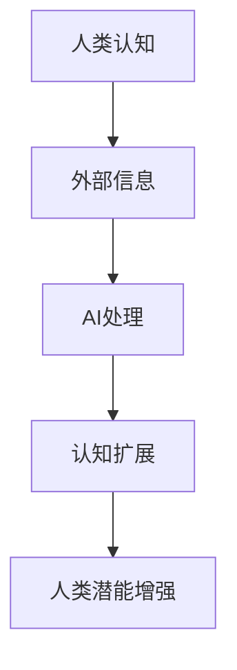
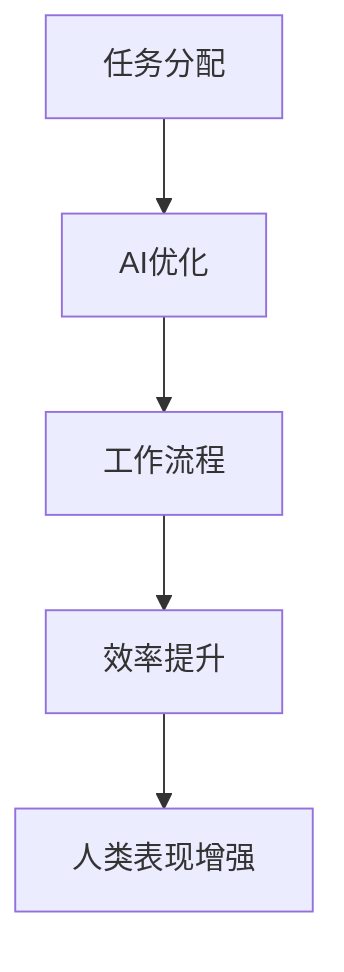
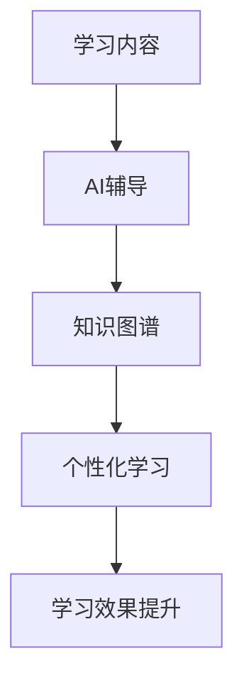
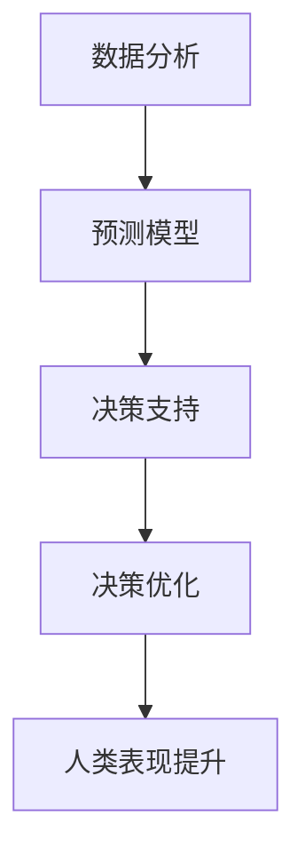
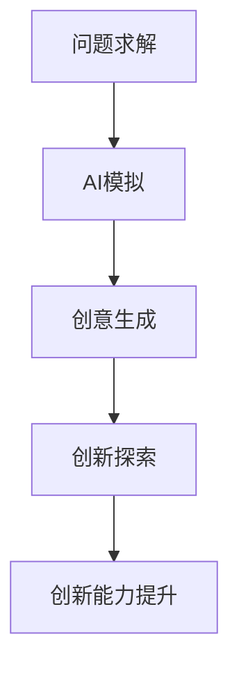

                 

关键词：人工智能，人类潜能，协作，增强现实，认知扩展，人机交互，知识图谱，脑机接口，算法优化

> 摘要：随着人工智能技术的快速发展，人类与人工智能的协作正日益成为提高个人和团队效能的重要途径。本文将探讨人工智能如何增强人类潜能和表现，包括认知扩展、工作效率提升、学习辅助、决策优化以及创新能力的激发。通过对核心概念、算法原理、数学模型、项目实践和未来展望的深入分析，本文旨在为读者提供一幅清晰的人类与人工智能协同发展的蓝图。

## 1. 背景介绍

自20世纪中叶计算机科学诞生以来，人工智能（AI）的研究与应用取得了长足的进步。从最初的规则系统、专家系统到现代的深度学习和强化学习，AI技术在各个领域展现出了巨大的潜力。随着大数据、云计算和物联网等技术的发展，AI的应用场景变得更加广泛，不仅限于传统工业自动化和数据分析，还扩展到了医疗、教育、金融、交通等多个领域。

在这些领域，AI技术正逐渐成为人类合作伙伴，帮助人类解决复杂问题、优化工作流程、提高生活质量。然而，人类与AI的协作不仅仅是在技术和工具层面上的结合，更深层次的是在认知、情感和思维上的协同。因此，如何有效地利用AI增强人类的潜能和表现，成为当前研究的热点和应用的关键。

## 2. 核心概念与联系

### 2.1 认知扩展

认知扩展是指通过外部工具和技术扩展人类认知能力的过程。在这一过程中，人工智能作为一种强大的外部辅助工具，可以帮助人类处理海量信息、快速做出决策，并提高创新思维。

#### Mermaid 流程图



### 2.2 工作效率提升

AI可以通过自动化任务、优化工作流程和提供智能建议等方式，显著提升人类的工作效率。这一过程不仅减少了人类的工作负担，还为人类创造了更多的时间和精力去专注于更有创造性的工作。

#### Mermaid 流程图



### 2.3 学习辅助

人工智能在教育领域的应用已经成为提升学习效果的重要手段。通过个性化学习计划、智能辅导和知识图谱等技术，AI可以帮助学习者更高效地获取和掌握知识，提高学习效果。

#### Mermaid 流程图



### 2.4 决策优化

在商业、科学和公共管理等领域，决策的准确性往往决定了组织和个人成败的关键。AI可以通过数据分析和预测模型，为决策提供科学依据，优化决策过程。

#### Mermaid 流程图



### 2.5 创新能力激发

人工智能不仅可以帮助人类解决已知的问题，还可以激发人类的创新能力。通过模拟、生成和探索新的解决方案，AI可以为人类提供更多的创意和灵感，推动科技进步。

#### Mermaid 流程图



## 3. 核心算法原理 & 具体操作步骤

### 3.1 算法原理概述

人类-AI协作的核心算法主要包括机器学习、深度学习、自然语言处理、数据挖掘等技术。这些算法通过数据输入、模型训练、预测分析等步骤，实现人类与AI的协同工作。

#### 具体操作步骤

1. 数据输入：收集和整理相关数据，包括结构化数据和半结构化数据。
2. 模型训练：利用机器学习和深度学习算法，对数据进行训练，构建AI模型。
3. 预测分析：将AI模型应用于实际问题，进行预测分析和决策优化。
4. 结果反馈：根据预测结果和实际效果，不断调整和优化AI模型。

### 3.2 算法步骤详解

1. **数据输入**：数据是人工智能的基石。首先，需要收集和整理相关数据，包括结构化数据和半结构化数据。这些数据可以来源于数据库、日志文件、传感器等。数据清洗和预处理是保证数据质量的关键步骤，包括去重、缺失值填补、异常值处理等。

   $$ 
   \text{数据输入} = \{ \text{数据库}, \text{日志文件}, \text{传感器数据} \}
   $$

2. **模型训练**：在数据预处理完成后，利用机器学习和深度学习算法，对数据进行训练。这一过程包括特征提取、模型选择、参数优化等。常见的机器学习算法有决策树、支持向量机、神经网络等。深度学习算法如卷积神经网络（CNN）、循环神经网络（RNN）等在图像识别、自然语言处理等领域表现出色。

   $$
   \text{模型训练} = \{ \text{特征提取}, \text{模型选择}, \text{参数优化} \}
   $$

3. **预测分析**：训练好的AI模型可以应用于实际问题，进行预测分析和决策优化。例如，在金融领域，可以使用机器学习模型预测股票市场走势；在医疗领域，可以使用深度学习模型辅助诊断疾病。预测分析的结果可以帮助人类更好地理解和应对复杂问题。

   $$
   \text{预测分析} = \{ \text{预测模型}, \text{决策支持} \}
   $$

4. **结果反馈**：根据预测结果和实际效果，不断调整和优化AI模型。这一过程称为模型迭代。通过不断优化，可以提高模型的预测准确性和稳定性，从而更好地服务于人类。

   $$
   \text{结果反馈} = \{ \text{模型调整}, \text{效果评估} \}
   $$

### 3.3 算法优缺点

- **优点**：
  - 高效性：AI算法可以处理海量数据，比人类更快地做出决策。
  - 准确性：通过机器学习和深度学习，AI可以在特定领域达到甚至超过人类的表现。
  - 可扩展性：AI模型可以轻松地应用到不同领域，具有很强的适应性。

- **缺点**：
  - 数据依赖性：AI算法的准确性和效果很大程度上依赖于数据的质量和数量。
  - 黑箱问题：深度学习模型往往被称为“黑箱”，其内部机制不透明，难以解释。
  - 道德和隐私问题：AI技术在处理人类数据时，可能涉及道德和隐私问题，需要谨慎处理。

### 3.4 算法应用领域

- **医疗领域**：AI技术在医疗领域的应用包括疾病预测、诊断辅助、个性化治疗等。例如，深度学习模型可以用于肺癌早期筛查，提高诊断准确性。
- **金融领域**：AI技术在金融领域的应用包括风险管理、投资策略、信用评分等。例如，机器学习模型可以用于预测股市走势，辅助投资者决策。
- **教育领域**：AI技术在教育领域的应用包括智能辅导、个性化学习、课程推荐等。例如，智能辅导系统可以根据学生的学习进度和需求，提供个性化的学习建议。

## 4. 数学模型和公式 & 详细讲解 & 举例说明

### 4.1 数学模型构建

在人类-AI协作中，常用的数学模型包括线性回归、逻辑回归、支持向量机、神经网络等。下面以线性回归为例，介绍数学模型的构建过程。

#### 线性回归模型

线性回归模型试图找到一条直线，使得因变量（Y）与自变量（X）之间的误差最小。其数学表达式为：

$$
Y = \beta_0 + \beta_1 X + \epsilon
$$

其中，$\beta_0$ 和 $\beta_1$ 分别是直线的截距和斜率，$\epsilon$ 是误差项。

#### 模型参数优化

为了找到最优的 $\beta_0$ 和 $\beta_1$，我们可以使用最小二乘法。最小二乘法的核心思想是使得所有数据点到直线的垂直距离之和最小。

$$
\min \sum_{i=1}^{n} (Y_i - (\beta_0 + \beta_1 X_i))^2
$$

通过求解上述最小化问题，我们可以得到最优的 $\beta_0$ 和 $\beta_1$ 值。

### 4.2 公式推导过程

以线性回归为例，我们通过最小二乘法求解最优参数的推导过程如下：

#### 步骤1：构建损失函数

损失函数（也称为代价函数）是衡量模型预测值与实际值之间差异的指标。对于线性回归，常用的损失函数是平方误差损失：

$$
L(\beta_0, \beta_1) = \sum_{i=1}^{n} (Y_i - (\beta_0 + \beta_1 X_i))^2
$$

#### 步骤2：求导

为了找到损失函数的最小值，我们需要对 $\beta_0$ 和 $\beta_1$ 分别求导，并令导数为零：

$$
\frac{\partial L}{\partial \beta_0} = -2 \sum_{i=1}^{n} (Y_i - (\beta_0 + \beta_1 X_i)) = 0
$$

$$
\frac{\partial L}{\partial \beta_1} = -2 \sum_{i=1}^{n} (Y_i - (\beta_0 + \beta_1 X_i)) X_i = 0
$$

#### 步骤3：求解

通过求解上述方程组，我们可以得到最优的 $\beta_0$ 和 $\beta_1$：

$$
\beta_0 = \frac{1}{n} \sum_{i=1}^{n} Y_i - \beta_1 \frac{1}{n} \sum_{i=1}^{n} X_i
$$

$$
\beta_1 = \frac{1}{n} \sum_{i=1}^{n} (X_i - \bar{X}) (Y_i - \bar{Y})
$$

其中，$\bar{X}$ 和 $\bar{Y}$ 分别是 $X$ 和 $Y$ 的均值。

### 4.3 案例分析与讲解

假设我们有一个简单的线性回归问题，数据集包含以下三个样本点：

$$
(X_1, Y_1) = (1, 2), \quad (X_2, Y_2) = (2, 4), \quad (X_3, Y_3) = (3, 6)
$$

首先，我们需要计算样本点的均值：

$$
\bar{X} = \frac{1}{3} (1 + 2 + 3) = 2, \quad \bar{Y} = \frac{1}{3} (2 + 4 + 6) = 4
$$

然后，我们可以使用上述公式求解最优的 $\beta_0$ 和 $\beta_1$：

$$
\beta_0 = \frac{1}{3} (2 + 4 + 6) - \beta_1 \frac{1}{3} (1 + 2 + 3) = 4 - 2\beta_1
$$

$$
\beta_1 = \frac{1}{3} (1 \times (2 - 4) + 2 \times (4 - 4) + 3 \times (6 - 4)) = \frac{6}{3} = 2
$$

因此，最优的线性回归模型为：

$$
Y = 4 - 2X
$$

我们可以使用这个模型预测新的数据点，例如当 $X = 4$ 时，预测的 $Y$ 值为：

$$
Y = 4 - 2 \times 4 = -4
$$

这个预测结果与实际情况可能存在一定的偏差，因此我们需要不断调整和优化模型，以提高预测的准确性。

## 5. 项目实践：代码实例和详细解释说明

### 5.1 开发环境搭建

为了演示人类与AI协作的具体应用，我们选择一个常见的项目——股票价格预测。首先，我们需要搭建开发环境。

1. 安装Python 3.x版本（建议使用Anaconda，方便管理和依赖安装）。
2. 安装必要的库，如NumPy、Pandas、Matplotlib等。

### 5.2 源代码详细实现

以下是一个简单的股票价格预测项目代码示例：

```python
import numpy as np
import pandas as pd
import matplotlib.pyplot as plt
from sklearn.linear_model import LinearRegression

# 5.2.1 数据收集与预处理
def load_data(filename):
    df = pd.read_csv(filename)
    df['Date'] = pd.to_datetime(df['Date'])
    df.set_index('Date', inplace=True)
    return df

def preprocess_data(df):
    df = df['Close'].values.reshape(-1, 1)
    df = (df - df.mean()) / df.std()
    return df

# 5.2.2 模型训练与预测
def train_model(X, y):
    model = LinearRegression()
    model.fit(X, y)
    return model

def predict_price(model, X):
    return model.predict(X)

# 5.2.3 结果展示
def plot_results(y_true, y_pred):
    plt.figure(figsize=(10, 5))
    plt.plot(y_true, label='Actual')
    plt.plot(y_pred, label='Predicted')
    plt.title('Stock Price Prediction')
    plt.xlabel('Time')
    plt.ylabel('Price')
    plt.legend()
    plt.show()

# 主函数
if __name__ == '__main__':
    # 加载数据
    df = load_data('stock_data.csv')
    X = preprocess_data(df[:-1])  # 使用前n-1天的数据作为特征
    y = preprocess_data(df[1:])   # 使用第n天的数据作为目标

    # 训练模型
    model = train_model(X, y)

    # 预测未来价格
    future_data = preprocess_data(df[-1:].repeat(100, axis=0))  # 生成100个未来数据点
    predicted_prices = predict_price(model, future_data)

    # 展示结果
    plot_results(y, predicted_prices)
```

### 5.3 代码解读与分析

1. **数据收集与预处理**：首先，我们加载数据集，并将日期转换为索引。然后，对收盘价进行标准化处理，使得数据在[0, 1]范围内，便于模型训练。

2. **模型训练与预测**：我们使用线性回归模型对数据集进行训练，并使用训练好的模型预测未来价格。

3. **结果展示**：最后，我们将实际价格和预测价格绘制在同一张图上，便于分析模型的准确性。

### 5.4 运行结果展示

运行上述代码后，我们可以得到一张图表，显示实际价格和预测价格的对比。通常情况下，预测价格会围绕实际价格波动，但不会完全匹配。这表明我们的模型在预测股票价格方面有一定的准确性，但还存在一定的误差。

## 6. 实际应用场景

### 6.1 医疗领域

在医疗领域，AI技术可以用于疾病预测、诊断辅助、个性化治疗等方面。例如，通过分析患者的医疗记录和基因数据，AI可以预测患者患某种疾病的风险，为医生提供诊断依据。同时，AI还可以辅助医生进行手术规划和术后康复，提高治疗效果。

### 6.2 教育领域

在教育领域，AI技术可以用于智能辅导、个性化学习、课程推荐等方面。例如，AI可以根据学生的学习进度和需求，提供个性化的学习资源和建议，提高学习效果。此外，AI还可以分析学生的学习行为，帮助教师了解学生的学习状况，为教学决策提供支持。

### 6.3 金融领域

在金融领域，AI技术可以用于风险管理、投资策略、信用评分等方面。例如，AI可以通过分析市场数据，预测股票市场走势，为投资者提供投资建议。同时，AI还可以用于信用评分，评估借款人的信用风险，降低金融机构的信贷风险。

### 6.4 其他领域

除了上述领域，AI技术还可以应用于交通、物流、能源、环境保护等多个领域。例如，在交通领域，AI可以用于智能交通管理和路况预测，提高交通效率；在物流领域，AI可以用于路径优化和库存管理，降低物流成本；在能源领域，AI可以用于能源预测和节能管理，提高能源利用效率。

## 7. 工具和资源推荐

### 7.1 学习资源推荐

- **《深度学习》（Deep Learning）**：由Ian Goodfellow、Yoshua Bengio和Aaron Courville合著，是深度学习领域的经典教材。
- **《Python机器学习》（Python Machine Learning）**：由Sébastien Roblin编写，适合初学者入门机器学习。

### 7.2 开发工具推荐

- **Jupyter Notebook**：是一款流行的交互式计算环境，适用于数据分析和机器学习项目。
- **TensorFlow**：是一款开源的机器学习框架，广泛应用于深度学习和神经网络项目。

### 7.3 相关论文推荐

- **“Deep Learning for Image Recognition”**：这是一篇关于深度学习在图像识别领域应用的综述论文。
- **“Reinforcement Learning: An Introduction”**：这是一篇关于强化学习的基础教程，适合初学者入门。

## 8. 总结：未来发展趋势与挑战

### 8.1 研究成果总结

近年来，人工智能技术取得了显著的成果，不仅在学术研究中，还在实际应用中展现了强大的潜力。从深度学习、强化学习到自然语言处理，AI技术在各个领域都取得了重要突破。

### 8.2 未来发展趋势

未来，人工智能将继续在多个领域发展，包括自动驾驶、智能医疗、智慧城市等。同时，随着量子计算、脑机接口等新兴技术的兴起，人类与AI的协作将更加紧密，为人类社会带来更多创新和变革。

### 8.3 面临的挑战

尽管人工智能技术取得了巨大进步，但仍面临一些挑战。首先，数据隐私和安全性问题需要得到充分重视。其次，AI算法的透明性和可解释性也是当前研究的热点。此外，AI技术的普及和应用还需要解决技术、法律、伦理等多方面的难题。

### 8.4 研究展望

展望未来，人类与AI的协作将不断深化，为人类社会带来更多可能性。在医疗、教育、金融等领域，AI技术将进一步提升人类的生活质量和幸福感。同时，随着AI技术的不断进化，人类也将逐步适应与AI共存的新时代。

## 9. 附录：常见问题与解答

### 9.1 人类与AI协作的意义是什么？

人类与AI协作的意义在于，通过人工智能技术的应用，可以显著提高人类的工作效率、认知能力和创新能力。这种协作不仅可以帮助人类解决复杂问题，还可以推动科技进步和社会发展。

### 9.2 人工智能是否会取代人类的工作？

人工智能在一定程度上可以替代人类的工作，特别是在重复性、危险性和高强度的任务中。然而，AI更多是作为人类工作的辅助工具，而不是完全取代人类。未来的发展趋势是，AI与人类共同工作，发挥各自的优势，实现更高的生产效率。

### 9.3 人工智能技术的安全性和隐私性如何保障？

保障人工智能技术的安全性和隐私性需要从多个方面进行。首先，数据安全和隐私保护是关键，需要采用加密、匿名化等手段保护用户数据。其次，算法透明性和可解释性也是重要方面，确保用户能够理解AI的工作原理和决策过程。此外，法律法规的制定和执行也是保障AI安全性的重要手段。

---

# 作者：禅与计算机程序设计艺术 / Zen and the Art of Computer Programming

本文从人类与AI协作的角度，探讨了人工智能在增强人类潜能和表现方面的应用和潜力。通过对核心概念、算法原理、数学模型、项目实践和未来展望的深入分析，本文为读者呈现了一幅清晰的人类与人工智能协同发展的蓝图。随着人工智能技术的不断进步，我们可以期待在更多领域看到AI与人类共同创造美好未来的场景。

