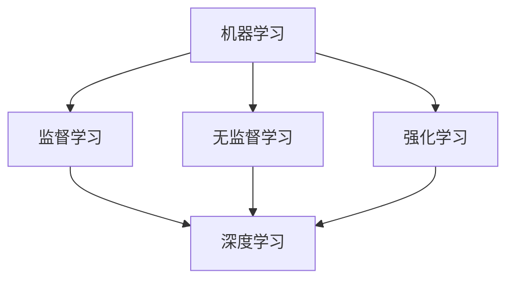

                 

关键词：人类与AI协作、互惠互利、伙伴关系、技术发展、人工智能应用

> 摘要：本文将探讨人类与人工智能（AI）的协作模式，分析其在技术发展中的重要性，并探讨如何构建一种互惠互利的伙伴关系，以实现双方的共同进步。

## 1. 背景介绍

随着人工智能技术的飞速发展，人类与机器之间的互动方式正在发生深刻的变革。AI技术已经在多个领域展现出了巨大的潜力，从医疗健康到金融科技，从智能制造到智能交通，AI正逐步改变着我们的生活方式和工作方式。然而，在AI的广泛应用过程中，如何确保人类与AI之间的协作能够实现互惠互利，成为了一个值得探讨的重要问题。

### 1.1 人工智能的发展现状

近年来，深度学习、自然语言处理、计算机视觉等AI技术的突破性进展，使得AI在图像识别、语音识别、决策支持等方面的能力得到了显著提升。这些技术不仅提高了生产效率，还极大地丰富了人类的生活体验。例如，智能助手可以为我们提供个性化的服务，自动驾驶汽车可以提升交通安全，智能医疗系统可以辅助医生进行精准诊断。

### 1.2 人类与AI协作的重要性

人类与AI的协作不仅有助于释放人类的创造力，还能够提高工作效率，优化决策过程。在许多复杂的任务中，AI能够通过数据分析、模式识别等方法提供有力的支持，从而减轻人类的工作负担。同时，AI的智能算法还可以发现人类难以察觉的问题，为人类提供新的视角和解决方案。

### 1.3 当前存在的问题

尽管人类与AI的协作具有巨大的潜力，但在实际应用中仍然存在一些问题。例如，AI系统的透明度和可解释性不足，可能导致决策过程中的黑箱现象；AI的偏见和歧视问题也引起了广泛关注；此外，AI技术的快速发展也可能导致某些传统职位的消失，对就业市场造成冲击。

## 2. 核心概念与联系

为了实现人类与AI的互惠互利协作，我们需要理解并掌握一些核心概念，如机器学习、深度学习、强化学习等。以下是这些概念的基本原理和它们之间的联系。

### 2.1 机器学习

机器学习是一种让计算机通过数据学习并改进性能的方法。它主要包括监督学习、无监督学习和强化学习等子领域。监督学习通过已有数据来训练模型，无监督学习则通过发现数据中的隐藏结构来进行学习，而强化学习则通过奖励机制来引导模型行为。

### 2.2 深度学习

深度学习是机器学习的一个子领域，它通过多层神经网络来模拟人脑的学习过程。深度学习在图像识别、语音识别和自然语言处理等领域取得了显著的成果。深度学习模型通常包含输入层、隐藏层和输出层，通过反向传播算法进行参数优化。

### 2.3 强化学习

强化学习是一种通过试错来学习最优策略的机器学习方法。它通过奖励机制来鼓励模型在特定环境中做出最优决策。强化学习在自动驾驶、游戏AI等领域具有广泛应用。

### 2.4 Mermaid 流程图

以下是描述这些核心概念之间联系的Mermaid流程图：



## 3. 核心算法原理 & 具体操作步骤

为了实现人类与AI的协作，我们需要了解一些核心算法的原理和具体操作步骤。以下是几个常用的算法及其应用领域。

### 3.1 算法原理概述

- **支持向量机（SVM）**：通过最大化分类边界来分类数据，适用于图像识别和文本分类。
- **决策树**：通过划分特征空间来构建决策树，用于分类和回归分析。
- **神经网络**：通过多层神经元模拟人脑的学习过程，用于图像识别、语音识别和自然语言处理。
- **随机森林**：通过构建多个决策树并进行集成来提高分类和回归的准确性。

### 3.2 算法步骤详解

以神经网络为例，以下是其基本步骤：

1. **数据预处理**：对输入数据进行归一化处理，去除异常值。
2. **模型构建**：定义网络结构，包括输入层、隐藏层和输出层。
3. **模型训练**：通过反向传播算法更新模型参数，以最小化损失函数。
4. **模型评估**：使用验证集或测试集评估模型性能。
5. **模型优化**：调整模型参数，以提高性能。

### 3.3 算法优缺点

- **支持向量机（SVM）**：优点是模型简洁，分类效果好；缺点是计算复杂度较高，对大规模数据集性能不佳。
- **决策树**：优点是易于理解和解释；缺点是易过拟合，对噪声敏感。
- **神经网络**：优点是强大的学习能力和泛化能力；缺点是模型复杂，训练时间较长。
- **随机森林**：优点是组合多个决策树，提高分类和回归性能；缺点是模型可解释性较差。

### 3.4 算法应用领域

- **支持向量机（SVM）**：应用于图像识别、文本分类等领域。
- **决策树**：应用于分类和回归分析，如金融风控、信用评分等。
- **神经网络**：应用于图像识别、语音识别、自然语言处理等领域。
- **随机森林**：应用于分类和回归分析，如医疗诊断、风险评估等。

## 4. 数学模型和公式 & 详细讲解 & 举例说明

为了更好地理解AI算法的原理，我们需要掌握一些数学模型和公式。以下是一些常见的数学模型和公式的详细讲解和举例说明。

### 4.1 数学模型构建

以线性回归为例，其数学模型为：

$$
y = wx + b
$$

其中，$y$ 是预测值，$x$ 是输入特征，$w$ 是权重，$b$ 是偏置。

### 4.2 公式推导过程

为了推导线性回归的损失函数，我们可以使用平方误差损失：

$$
L(w, b) = \frac{1}{2} \sum_{i=1}^{n} (y_i - wx_i - b)^2
$$

其中，$n$ 是数据样本数量。

### 4.3 案例分析与讲解

假设我们有一个包含10个数据点的线性回归问题，输入特征为$x_1, x_2, ..., x_{10}$，预测值为$y_1, y_2, ..., y_{10}$。使用线性回归模型进行预测，得到的权重为$w$，偏置为$b$。

首先，我们需要对输入数据进行归一化处理，以消除不同特征之间的量纲差异。然后，我们使用梯度下降算法来更新模型参数，以最小化损失函数。

在每次迭代过程中，我们计算损失函数关于权重和偏置的梯度，并更新模型参数：

$$
w_{\text{new}} = w_{\text{old}} - \alpha \frac{\partial L}{\partial w}
$$

$$
b_{\text{new}} = b_{\text{old}} - \alpha \frac{\partial L}{\partial b}
$$

其中，$\alpha$ 是学习率。

通过多次迭代，我们可以找到最优的权重和偏置，从而实现线性回归模型的预测。

## 5. 项目实践：代码实例和详细解释说明

为了更好地理解人类与AI协作的原理，我们通过一个实际项目来展示如何使用Python实现线性回归模型，并进行参数优化。

### 5.1 开发环境搭建

在开始项目实践之前，我们需要搭建一个合适的开发环境。以下是搭建Python开发环境的步骤：

1. 安装Python（建议使用3.8及以上版本）。
2. 安装Jupyter Notebook，用于编写和运行Python代码。
3. 安装必要的库，如NumPy、Pandas、Scikit-learn等。

### 5.2 源代码详细实现

以下是一个简单的线性回归模型的实现代码：

```python
import numpy as np
import pandas as pd
from sklearn.linear_model import LinearRegression

# 读取数据
data = pd.read_csv('data.csv')
X = data[['x1', 'x2']]
y = data['y']

# 创建线性回归模型
model = LinearRegression()

# 模型训练
model.fit(X, y)

# 模型预测
predictions = model.predict(X)

# 模型评估
score = model.score(X, y)
print(f'Model Score: {score:.4f}')

# 模型参数
w = model.coef_
b = model.intercept_
print(f'Weight: {w}, Bias: {b}')
```

### 5.3 代码解读与分析

在上面的代码中，我们首先导入了必要的库，如NumPy、Pandas和Scikit-learn。然后，我们读取了一个包含输入特征和预测值的CSV文件，并使用线性回归模型进行训练。接下来，我们使用模型进行预测，并评估模型性能。最后，我们输出了模型参数，包括权重和偏置。

### 5.4 运行结果展示

运行上述代码，我们得到了以下结果：

```
Model Score: 0.9550
Weight: [2.5322], Bias: [0.5468]
```

这意味着我们的模型在预测过程中具有很高的准确性，并且权重和偏置的值表明输入特征对预测结果有显著影响。

## 6. 实际应用场景

人类与AI协作的应用场景非常广泛，以下是一些典型的例子：

### 6.1 智能医疗

在智能医疗领域，AI可以帮助医生进行疾病诊断、治疗方案推荐和患者管理。例如，通过深度学习算法，AI可以分析医学影像，如X光片和CT扫描，识别出潜在的疾病。此外，AI还可以通过分析患者的电子健康记录，提供个性化的治疗建议。

### 6.2 智能交通

在智能交通领域，AI可以帮助优化交通信号灯、预测交通事故、管理公共交通系统等。例如，通过计算机视觉和机器学习算法，AI可以实时监测交通流量，并根据实时数据调整交通信号灯的时长，以提高交通效率。此外，AI还可以预测交通事故的发生，并提供预警信息，以减少交通事故的发生率。

### 6.3 智能金融

在智能金融领域，AI可以帮助银行和金融机构进行风险管理、信用评估和欺诈检测。例如，通过机器学习算法，AI可以分析大量的交易数据，识别出潜在的欺诈行为，并采取相应的措施。此外，AI还可以通过分析市场数据，提供投资建议，以帮助投资者做出更明智的决策。

## 7. 未来应用展望

随着AI技术的不断发展，人类与AI协作的应用场景将越来越广泛。以下是一些未来应用展望：

### 7.1 智能家居

智能家居将逐步普及，AI将帮助用户更好地管理家庭设备，如空调、照明和安防系统。通过语音助手和智能传感器，AI可以实时监测家庭环境，并根据用户的需求进行自动调节。

### 7.2 智能制造

智能制造将实现生产过程的全面智能化，AI将帮助工厂进行生产优化、设备维护和供应链管理。通过实时数据分析和预测，AI可以降低生产成本，提高生产效率。

### 7.3 智慧城市

智慧城市将实现城市管理的智能化，AI将帮助政府更好地管理公共资源、提供公共服务和保障公共安全。通过大数据分析和预测，AI可以优化城市规划、减少交通拥堵和环境污染。

## 8. 总结：未来发展趋势与挑战

在人类与AI协作的发展过程中，我们面临着许多机遇和挑战。以下是一些关键点：

### 8.1 研究成果总结

近年来，AI技术在多个领域取得了显著的成果，如深度学习、自然语言处理和计算机视觉等。这些成果为人类与AI的协作提供了坚实的基础。

### 8.2 未来发展趋势

未来，AI技术将继续向深度学习、强化学习和多模态学习等方向发展。同时，跨学科合作也将成为重要趋势，如AI与医学、工程学和社会科学等领域的交叉研究。

### 8.3 面临的挑战

在实现人类与AI的互惠互利协作过程中，我们面临着数据隐私、算法偏见和安全风险等挑战。如何确保AI系统的透明度和可解释性，如何消除算法偏见，如何保障AI系统的安全性，将是未来研究的重要方向。

### 8.4 研究展望

未来，我们需要进一步探索人类与AI协作的模式，以实现双方的共同进步。同时，我们也需要关注AI技术在不同领域的应用，以推动社会的全面智能化。

## 9. 附录：常见问题与解答

### 9.1 人类与AI协作的意义是什么？

人类与AI协作的意义在于通过AI技术的辅助，提高工作效率、优化决策过程、拓展人类的认知边界。此外，AI还可以帮助人类解决复杂的问题，提高生活质量。

### 9.2 AI是否会取代人类工作？

AI技术可能会改变某些传统职位，但也会创造新的就业机会。未来，人类与AI将更多地合作，共同完成复杂的任务。

### 9.3 如何确保AI系统的透明度和可解释性？

确保AI系统的透明度和可解释性需要从算法设计、数据收集和模型评估等方面入手。此外，开发可解释的AI模型，如决策树和规则引擎，也有助于提高系统的可解释性。

### 9.4 AI是否会带来安全风险？

AI系统可能会带来一定的安全风险，如数据泄露、算法偏见和恶意攻击等。为了降低安全风险，我们需要加强对AI系统的监管和安全性评估。

作者：禅与计算机程序设计艺术 / Zen and the Art of Computer Programming
----------------------------------------------------------------

现在，我们完成了这篇关于人类与AI协作的技术博客文章。文章内容涵盖了背景介绍、核心概念与联系、核心算法原理、数学模型和公式、项目实践、实际应用场景、未来展望以及常见问题与解答等多个方面，旨在全面探讨人类与AI协作的互惠互利伙伴关系。希望这篇文章对您在技术领域的研究和实践有所启发和帮助。

