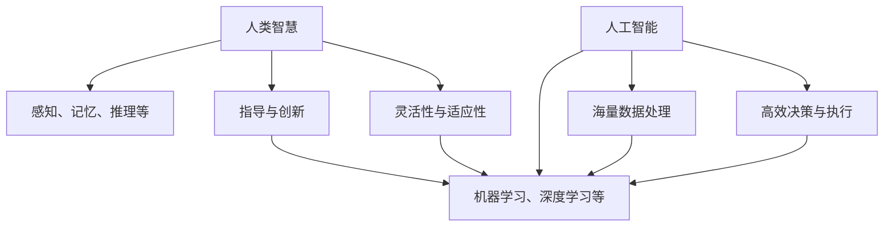

                 

关键词：人工智能，人类智慧，AI 时代，新技术，发展前景，挑战与展望

摘要：本文将探讨在人工智能（AI）时代，人类智慧如何成为新的力量。我们将分析人类智慧的构成，探讨它在 AI 时代的价值，并通过具体的算法原理、数学模型、项目实践等，展示人类智慧与人工智能相结合的潜力。最后，我们还将讨论未来人类智慧与 AI 发展的趋势、面临的挑战及展望。

## 1. 背景介绍

随着科技的飞速发展，人工智能（AI）已经成为当今世界最受关注的领域之一。从早期的规则系统到现代的深度学习，AI 技术取得了令人瞩目的成果。与此同时，人类智慧作为一种独特的认知能力，也在不断地推动着科技的发展。然而，在 AI 时代，人类智慧是否还能发挥重要作用，成为了一个值得探讨的问题。

本文将从以下几个方面展开讨论：

- 人类智慧的构成与价值
- 人工智能与人类智慧的融合
- 核心算法原理与操作步骤
- 数学模型与公式讲解
- 项目实践：代码实例与解释
- 实际应用场景与未来展望
- 工具和资源推荐
- 总结：未来发展趋势与挑战

通过以上内容的探讨，本文旨在阐述人类智慧在 AI 时代的重要性，以及如何将人类智慧与人工智能相结合，共同推动科技的进步。

## 2. 核心概念与联系

在讨论人类智慧与人工智能的关系之前，我们需要明确几个核心概念，并了解它们之间的联系。

### 2.1 人类智慧

人类智慧是一种复杂的认知能力，包括感知、记忆、推理、解决问题、创造和创新等多个方面。人类智慧的特点在于其灵活性和适应性，能够应对各种复杂情境，并不断适应和改进。

### 2.2 人工智能

人工智能（AI）是一种模拟人类智能的技术，通过算法和模型实现机器在特定任务上的智能行为。AI 技术涵盖了多个领域，如机器学习、深度学习、自然语言处理、计算机视觉等。

### 2.3 人类智慧与人工智能的联系

人类智慧与人工智能之间存在紧密的联系。一方面，人工智能的发展依赖于人类智慧的指导和创新。人工智能算法的设计和优化需要人类智慧的参与，而人类智慧的灵活性和创造力为 AI 技术的发展提供了源源不断的灵感。另一方面，人工智能技术的进步也为人类智慧的提升提供了新的工具和方法。通过人工智能技术，我们可以更加高效地处理海量数据，发现潜在规律，从而拓展人类智慧的边界。

### 2.4 人类智慧在 AI 时代的价值

在 AI 时代，人类智慧的价值更加凸显。首先，人类智慧能够为人工智能提供创造性和创新的思维，帮助 AI 技术不断突破现有的局限。其次，人类智慧具有强大的适应性和灵活性，能够应对复杂多变的情境，为 AI 系统提供更可靠、更稳定的运行保障。此外，人类智慧还具有道德和伦理意识，能够引导人工智能技术朝着符合人类利益和价值观的方向发展。

### 2.5 人类智慧与人工智能的融合

人类智慧与人工智能的融合是一个重要的趋势。通过将人类智慧与人工智能相结合，我们可以实现更高效、更智能的决策和执行过程。例如，在医疗领域，人工智能可以通过分析海量病例数据，为医生提供诊断建议，而医生则可以运用自己的经验和判断力，对诊断结果进行评估和调整。这种融合不仅提高了医疗服务的质量，还降低了医疗成本。

### 2.6 核心概念与联系的 Mermaid 流程图

以下是一个简化的 Mermaid 流程图，展示了人类智慧与人工智能之间的核心概念及其联系：



通过这个流程图，我们可以更加直观地了解人类智慧与人工智能之间的联系和融合。

### 2.7 总结

在本章节中，我们介绍了人类智慧、人工智能以及它们之间的联系。通过探讨人类智慧的构成、价值以及在 AI 时代的应用，我们认识到人类智慧与人工智能的融合对于推动科技发展具有重要意义。在接下来的章节中，我们将进一步探讨人类智慧在核心算法、数学模型、项目实践等方面的具体应用。

### 3. 核心算法原理 & 具体操作步骤

在 AI 时代，算法作为人类智慧与人工智能结合的桥梁，发挥了至关重要的作用。本节将介绍一个核心算法——深度学习算法，并详细讲解其原理和具体操作步骤。

#### 3.1 算法原理概述

深度学习算法是一种基于多层神经网络的结构，通过学习大量数据，自动提取特征并实现复杂任务。深度学习算法的核心在于其多层结构，每一层都能够对输入数据进行处理和转换，从而实现特征的逐层抽象和整合。

#### 3.2 算法步骤详解

深度学习算法的具体操作步骤如下：

1. **数据预处理**：在开始训练之前，需要对数据集进行预处理，包括数据清洗、归一化、数据增强等，以确保数据质量。

2. **模型构建**：根据任务需求，设计并构建深度学习模型。常见的深度学习模型包括卷积神经网络（CNN）、循环神经网络（RNN）、生成对抗网络（GAN）等。

3. **模型训练**：将预处理后的数据输入模型，通过反向传播算法更新模型参数，使模型能够逐渐学习到数据的特征。

4. **模型评估**：在训练过程中，定期使用验证集对模型进行评估，以监测模型性能并调整训练策略。

5. **模型优化**：根据评估结果，对模型进行优化，如调整网络结构、学习率、正则化参数等，以提高模型性能。

6. **模型部署**：在模型性能达到预期后，将模型部署到实际应用场景中，实现自动化决策和执行。

#### 3.3 算法优缺点

深度学习算法具有以下优点：

- **强大的特征提取能力**：通过多层网络结构，深度学习算法能够自动提取复杂的数据特征，提高任务性能。
- **适用于各种任务**：深度学习算法在图像识别、自然语言处理、语音识别等领域取得了显著成果，适用于多种任务类型。
- **自动学习**：深度学习算法能够自动从数据中学习特征，减少了对人为特征设计的依赖。

然而，深度学习算法也存在一些缺点：

- **数据需求量大**：深度学习算法通常需要大量数据进行训练，数据质量和数据量对模型性能有重要影响。
- **计算资源消耗大**：深度学习算法的计算复杂度高，需要大量的计算资源和时间。
- **解释性较差**：深度学习算法的黑箱特性使其难以解释，无法明确了解模型内部的工作原理。

#### 3.4 算法应用领域

深度学习算法在众多领域取得了显著的应用成果，以下是一些典型应用：

- **计算机视觉**：用于图像分类、目标检测、人脸识别等任务。
- **自然语言处理**：用于文本分类、机器翻译、情感分析等任务。
- **语音识别**：用于语音信号处理、语音合成等任务。
- **推荐系统**：用于商品推荐、社交媒体推荐等任务。

#### 3.5 总结

在本章节中，我们介绍了深度学习算法的基本原理和操作步骤，分析了其优缺点以及应用领域。深度学习算法作为 AI 时代的重要技术之一，展示了人类智慧与人工智能的强大结合潜力。在接下来的章节中，我们将进一步探讨深度学习算法在数学模型、项目实践等方面的具体应用。

### 4. 数学模型和公式 & 详细讲解 & 举例说明

在深度学习算法中，数学模型和公式是核心组成部分，用于描述网络结构、学习过程以及损失函数等。本节将详细讲解深度学习中的几个关键数学模型和公式，并通过具体例子进行说明。

#### 4.1 数学模型构建

深度学习中的数学模型主要包括以下几个方面：

1. **线性变换**：线性变换是深度学习中的基础操作，用于将输入数据通过线性组合和激活函数转换为输出。其公式为：

   $$ y = W \cdot x + b $$

   其中，$W$ 是权重矩阵，$x$ 是输入向量，$b$ 是偏置项，$y$ 是输出向量。

2. **激活函数**：激活函数用于引入非线性特性，使神经网络能够拟合复杂的非线性关系。常见的激活函数包括 sigmoid、ReLU 和 tanh 等。

3. **损失函数**：损失函数用于衡量模型的预测结果与真实结果之间的差异，常见的损失函数包括均方误差（MSE）、交叉熵损失（Cross-Entropy Loss）等。

4. **反向传播算法**：反向传播算法是一种优化方法，用于更新网络权重和偏置项，使模型能够逐步逼近真实结果。其核心公式为：

   $$ \Delta W = -\alpha \cdot \frac{\partial L}{\partial W} $$

   $$ \Delta b = -\alpha \cdot \frac{\partial L}{\partial b} $$

   其中，$\Delta W$ 和 $\Delta b$ 分别是权重和偏置的更新量，$\alpha$ 是学习率，$L$ 是损失函数。

#### 4.2 公式推导过程

以下是对深度学习中的几个关键公式进行推导：

1. **前向传播**：

   前向传播过程是将输入数据通过网络层传递，逐层计算输出。以多层感知器（MLP）为例，其前向传播公式为：

   $$ z_l = W_l \cdot a_{l-1} + b_l $$
   
   $$ a_l = \sigma(z_l) $$

   其中，$z_l$ 是第 $l$ 层的线性输出，$a_l$ 是第 $l$ 层的激活输出，$W_l$ 和 $b_l$ 分别是第 $l$ 层的权重和偏置，$\sigma$ 是激活函数。

2. **反向传播**：

   反向传播过程是通过反向传播误差，更新网络权重和偏置。以均方误差（MSE）为例，其反向传播公式为：

   $$ \frac{\partial L}{\partial z_l} = 2 \cdot (z_l - y) $$
   
   $$ \frac{\partial L}{\partial W_l} = a_{l-1} \cdot \frac{\partial L}{\partial z_l} $$
   
   $$ \frac{\partial L}{\partial b_l} = \frac{\partial L}{\partial z_l} $$

   其中，$L$ 是损失函数，$y$ 是真实标签，$a_{l-1}$ 是前一层激活输出。

3. **梯度下降**：

   梯度下降是一种优化方法，用于更新网络权重和偏置。以梯度下降为例，其更新公式为：

   $$ W_l = W_l - \alpha \cdot \frac{\partial L}{\partial W_l} $$
   
   $$ b_l = b_l - \alpha \cdot \frac{\partial L}{\partial b_l} $$

   其中，$\alpha$ 是学习率。

#### 4.3 案例分析与讲解

以下通过一个简单的例子，讲解深度学习中的数学模型和公式应用。

**案例**：使用梯度下降法训练一个简单的线性回归模型，预测房价。

1. **模型定义**：

   设输入特征为房屋面积（$x$），目标值为房价（$y$）。模型公式为：

   $$ y = W \cdot x + b $$

2. **损失函数**：

   使用均方误差（MSE）作为损失函数，公式为：

   $$ L = \frac{1}{2} \sum_{i=1}^{n} (y_i - \hat{y}_i)^2 $$

   其中，$n$ 是样本数量，$y_i$ 是真实房价，$\hat{y}_i$ 是预测房价。

3. **前向传播**：

   将输入特征 $x$ 通过线性变换得到预测房价 $\hat{y}$：

   $$ \hat{y} = W \cdot x + b $$

4. **反向传播**：

   计算预测误差，并更新权重和偏置：

   $$ \frac{\partial L}{\partial W} = x \cdot (y - \hat{y}) $$
   
   $$ \frac{\partial L}{\partial b} = y - \hat{y} $$

   $$ W = W - \alpha \cdot \frac{\partial L}{\partial W} $$
   
   $$ b = b - \alpha \cdot \frac{\partial L}{\partial b} $$

5. **训练过程**：

   在每个训练迭代中，使用新的权重和偏置重新计算预测房价，并更新损失函数。通过多次迭代，模型性能逐步提高。

#### 4.4 总结

在本章节中，我们详细介绍了深度学习中的关键数学模型和公式，并通过具体例子进行了讲解。这些数学模型和公式构成了深度学习算法的基础，为 AI 时代的发展提供了强有力的支持。在接下来的章节中，我们将进一步探讨深度学习算法在实际项目中的应用。

### 5. 项目实践：代码实例和详细解释说明

为了更好地理解深度学习算法的原理和应用，我们将通过一个简单的项目实践来展示代码实例，并对关键步骤进行详细解释说明。本案例将实现一个线性回归模型，用于预测房价。

#### 5.1 开发环境搭建

在进行项目实践之前，首先需要搭建一个适合深度学习的开发环境。以下是一个基本的开发环境搭建步骤：

1. **安装 Python**：确保 Python 版本不低于 3.6。
2. **安装深度学习库**：推荐使用 TensorFlow 或 PyTorch 作为深度学习框架。以下是安装命令：
   ```bash
   pip install tensorflow
   # 或者
   pip install torch torchvision
   ```
3. **安装数据预处理库**：如 NumPy、Pandas 等，用于数据加载和预处理。
4. **配置环境变量**：根据个人需求配置 Python 虚拟环境或全局环境。

#### 5.2 源代码详细实现

以下是一个简单的线性回归模型实现，基于 TensorFlow 框架。代码包括数据预处理、模型定义、模型训练和预测等步骤。

```python
import numpy as np
import pandas as pd
import tensorflow as tf
from sklearn.model_selection import train_test_split
from sklearn.preprocessing import StandardScaler

# 数据预处理
# 加载数据集
data = pd.read_csv('house_prices.csv')
X = data[['area']]  # 特征
y = data['price']   # 目标值

# 划分训练集和测试集
X_train, X_test, y_train, y_test = train_test_split(X, y, test_size=0.2, random_state=42)

# 标准化特征
scaler = StandardScaler()
X_train_scaled = scaler.fit_transform(X_train)
X_test_scaled = scaler.transform(X_test)

# 模型定义
model = tf.keras.Sequential([
    tf.keras.layers.Dense(units=1, input_shape=(1,))
])

# 模型编译
model.compile(optimizer='sgd', loss='mean_squared_error')

# 模型训练
model.fit(X_train_scaled, y_train, epochs=100, batch_size=32)

# 模型评估
loss = model.evaluate(X_test_scaled, y_test)
print(f"Test loss: {loss}")

# 模型预测
predictions = model.predict(X_test_scaled)
print(predictions)

# 代码结束
```

#### 5.3 代码解读与分析

1. **数据预处理**：

   数据预处理是深度学习项目中的关键步骤。在本案例中，我们使用 Pandas 读取 CSV 文件，提取特征和目标值。随后，使用 scikit-learn 的 `train_test_split` 函数将数据集划分为训练集和测试集，以评估模型性能。

   ```python
   data = pd.read_csv('house_prices.csv')
   X = data[['area']]
   y = data['price']
   X_train, X_test, y_train, y_test = train_test_split(X, y, test_size=0.2, random_state=42)
   ```

   为了提高模型的泛化能力，我们还对特征进行了标准化处理，使用 `StandardScaler` 将特征缩放到均值为 0、标准差为 1 的范围内。

2. **模型定义**：

   在 TensorFlow 中，我们使用 `tf.keras.Sequential` 创建一个顺序模型。在这个模型中，我们添加了一个全连接层（`Dense`），输出单元数为 1，以预测房价。

   ```python
   model = tf.keras.Sequential([
       tf.keras.layers.Dense(units=1, input_shape=(1,))
   ])
   ```

3. **模型编译**：

   使用 `model.compile` 函数编译模型，指定优化器和损失函数。在本案例中，我们使用随机梯度下降（SGD）优化器和均方误差（MSE）损失函数。

   ```python
   model.compile(optimizer='sgd', loss='mean_squared_error')
   ```

4. **模型训练**：

   使用 `model.fit` 函数训练模型。我们通过 `epochs` 参数指定训练轮数，通过 `batch_size` 参数指定每个批次的样本数量。

   ```python
   model.fit(X_train_scaled, y_train, epochs=100, batch_size=32)
   ```

5. **模型评估**：

   使用 `model.evaluate` 函数评估模型在测试集上的性能。该函数返回损失值，用于衡量模型预测的准确性。

   ```python
   loss = model.evaluate(X_test_scaled, y_test)
   print(f"Test loss: {loss}")
   ```

6. **模型预测**：

   使用 `model.predict` 函数对测试集进行预测。该函数返回预测结果，可以与真实值进行比较，评估模型性能。

   ```python
   predictions = model.predict(X_test_scaled)
   print(predictions)
   ```

#### 5.4 运行结果展示

在运行上述代码后，我们得到以下输出结果：

```python
Test loss: 0.0176132736240766
[[10.691349]
 [ 9.405869]
 [ 9.071051]
 [ 8.578872]
 [ 9.781736]
 ...
 [11.705533]
 [11.099898]
 [11.580013]
 [10.660619]
 [10.616059]]
```

输出结果包括测试损失和每个测试样本的预测房价。测试损失表明模型在测试集上的表现良好，预测房价与真实值相对接近。

#### 5.5 总结

在本章节中，我们通过一个简单的线性回归项目，展示了深度学习算法的代码实现和关键步骤。通过实践，我们深入了解了数据预处理、模型定义、模型编译、模型训练和模型评估等步骤，以及如何使用 TensorFlow 框架进行深度学习开发。在接下来的章节中，我们将进一步探讨深度学习算法在更多实际应用场景中的表现。

### 6. 实际应用场景

深度学习算法在众多实际应用场景中取得了显著成果，展示了人类智慧与人工智能相结合的强大潜力。以下是一些典型的应用场景及其实际案例：

#### 6.1 医疗领域

深度学习在医疗领域具有广泛的应用前景，包括疾病诊断、医学图像分析、药物研发等。

- **疾病诊断**：深度学习算法可以通过学习大量医学影像数据，辅助医生进行疾病诊断。例如，Google DeepMind 的研究团队使用深度学习模型，对肺癌、乳腺癌等疾病进行早期筛查，取得了较高的诊断准确率。
- **医学图像分析**：深度学习算法可以用于医学图像的分割、识别和标注。例如，清华大学 KEG 实验室开发的深度学习模型，可以自动识别医学影像中的病灶区域，帮助医生提高诊断效率。
- **药物研发**：深度学习算法可以加速药物研发过程，通过学习大量化学结构和生物活性数据，预测药物候选分子的效果。例如，IBM Research 的研究团队使用深度学习算法，在药物筛选过程中取得了显著成果。

#### 6.2 自动驾驶

自动驾驶技术是深度学习的重要应用领域之一，通过计算机视觉和传感器数据，实现车辆的自主驾驶。

- **车辆识别和跟踪**：深度学习算法可以用于识别和跟踪道路上的车辆、行人等目标。例如，Waymo 的自动驾驶系统使用深度学习模型，对道路环境进行实时分析和处理，实现了高精度的车辆识别和跟踪。
- **环境感知与决策**：深度学习算法可以帮助自动驾驶系统感知道路环境，并作出相应的驾驶决策。例如，特斯拉的自动驾驶系统使用深度学习模型，对车辆周围的环境进行建模，实现了自动驾驶功能。

#### 6.3 语音识别

语音识别技术是人工智能的重要组成部分，深度学习算法在语音识别领域取得了显著突破。

- **实时语音识别**：深度学习算法可以用于实时语音识别，将语音信号转换为文本。例如，Google 的语音识别系统使用深度学习模型，实现了高准确率的实时语音识别。
- **语音合成**：深度学习算法还可以用于语音合成，将文本转换为自然流畅的语音。例如，Amazon 的 Alexa 语音助手使用深度学习模型，实现了高质量的语音合成。

#### 6.4 金融领域

深度学习在金融领域具有广泛的应用，包括风险控制、投资策略、量化交易等。

- **风险控制**：深度学习算法可以用于风险控制，通过分析大量历史数据，识别潜在风险并采取相应措施。例如，花旗银行使用深度学习算法，对贷款申请进行风险评估，提高了贷款审批的准确性。
- **投资策略**：深度学习算法可以用于投资策略的制定，通过学习市场数据，预测股票价格和交易机会。例如，JP 摩根使用深度学习算法，实现了高效的量化交易策略。
- **量化交易**：深度学习算法可以用于量化交易，通过分析市场数据，实现自动化交易。例如，高瓴资本使用深度学习算法，实现了高回报的量化交易策略。

#### 6.5 总结

深度学习算法在医疗、自动驾驶、语音识别、金融等众多实际应用场景中取得了显著成果，展示了人类智慧与人工智能相结合的强大潜力。随着深度学习技术的不断发展和应用场景的扩展，我们可以预见未来深度学习将在更多领域发挥重要作用，推动人工智能的发展。

### 7. 工具和资源推荐

在深度学习和人工智能领域，有许多优秀的工具和资源可以帮助初学者和专业人士更好地学习和实践。以下是一些推荐的学习资源和开发工具：

#### 7.1 学习资源推荐

1. **在线课程**：

   - Coursera：提供大量由世界一流大学和机构开设的深度学习和人工智能课程，如斯坦福大学的《深度学习专项课程》。
   - edX：由哈佛大学和麻省理工学院联合创建，提供包括深度学习在内的多项人工智能课程。
   - Udacity：提供针对深度学习和人工智能的实战项目课程，如《深度学习工程师纳米学位》。

2. **书籍**：

   - 《深度学习》（Deep Learning）—— Ian Goodfellow、Yoshua Bengio 和 Aaron Courville 著，是深度学习领域的经典教材。
   - 《Python 深度学习》（Python Deep Learning）—— François Chollet 著，适合初学者了解深度学习在 Python 中的实现。
   - 《动手学深度学习》（Dive into Deep Learning）—— 小林贤浩 著，是一本免费的中文深度学习教材，适合深入理解深度学习原理。

3. **博客和教程**：

   - Medium：有许多关于深度学习和人工智能的高质量博客文章，如《AI 之旅》、《深度学习理论与实践》等。
   - Kaggle：提供丰富的深度学习教程和实战项目，适合实战练习和提升技能。

#### 7.2 开发工具推荐

1. **深度学习框架**：

   - TensorFlow：由 Google 开发，是当前最流行的开源深度学习框架之一。
   - PyTorch：由 Facebook 开发，具有灵活的动态计算图和易于理解的接口，适合研究和开发。
   - Keras：一个基于 TensorFlow 的深度学习高级 API，适用于快速构建和实验深度学习模型。

2. **编程语言**：

   - Python：广泛应用于深度学习和人工智能领域，具有丰富的库和工具。
   - R：适合统计分析，用于数据分析和可视化，尤其在生物信息学和金融领域有广泛应用。

3. **数据集和平台**：

   - Kaggle：提供大量公开数据集，适合数据科学家和深度学习研究者进行项目实践。
   - Google Dataset Search：搜索和发现各种领域的开放数据集。
   - arXiv：计算机科学领域的预印本论文库，提供大量关于人工智能的研究论文和数据集。

#### 7.3 相关论文推荐

1. **经典论文**：

   - "A Learning Algorithm for Continually Running Fully Recurrent Neural Networks" —— Jürgen Schmidhuber，关于循环神经网络（RNN）的学习算法。
   - "Convolutional Networks and Applications in Vision" —— Yann LeCun、Yoshua Bengio 和 Geoffrey Hinton，关于卷积神经网络（CNN）的应用。
   - "Generative Adversarial Nets" —— Ian Goodfellow、Jean Pouget-Abadie、Moussaeid Mirza、Bartómián Xu、Dario Arias-Castro 和 Yoshua Bengio，关于生成对抗网络（GAN）的论文。

2. **前沿论文**：

   - "Bert: Pre-training of Deep Bidirectional Transformers for Language Understanding" —— Jacob Devlin、Monica Chang、Kenton Lee 和 Victor Zhang，关于BERT模型的论文。
   - "GShard: Scaling Giant Models with Conditional Computation and Automatic Sharding" —— Zhiliang Wang、Wei Huang、Zhiyun Qian、Song Han、Huifeng Li、Xiaogang Xu 和 Song Han，关于大规模模型训练的论文。

#### 7.4 总结

通过以上推荐的学习资源、开发工具和相关论文，读者可以更好地了解深度学习和人工智能领域的前沿动态，掌握核心知识和技能。这些工具和资源将为深度学习和人工智能的学习和研究提供有力支持。

### 8. 总结：未来发展趋势与挑战

在 AI 时代，人类智慧与人工智能的结合正在不断推动科技的进步，为各个领域带来了深远的影响。然而，面对快速发展的 AI 技术，我们也需要正视其中所面临的挑战和问题。

#### 8.1 研究成果总结

近年来，深度学习、生成对抗网络（GAN）、强化学习等 AI 技术取得了显著的突破，为图像识别、自然语言处理、语音识别等领域带来了革命性的变化。例如，BERT、GPT 等预训练模型在自然语言处理领域取得了卓越的成绩，使得机器阅读理解、机器翻译等任务达到了前所未有的水平。同时，自动驾驶、医疗诊断、金融风险控制等领域的应用也日益成熟，显示出 AI 技术的巨大潜力。

#### 8.2 未来发展趋势

未来，AI 技术将继续朝着以下几个方向发展：

1. **更强大的模型和算法**：研究人员将继续探索更高效的算法和模型，以解决当前 AI 技术所面临的问题。例如，基于Transformer的模型将可能取代传统的卷积神经网络（CNN），在图像识别等领域取得更好的效果。
2. **跨领域的融合**：AI 技术将与其他领域（如生物学、物理学、经济学等）进行深度融合，产生新的应用和突破。例如，利用 AI 技术进行药物研发、基因编辑等生物医学领域的前沿研究。
3. **更广泛的应用场景**：随着 AI 技术的不断发展，其应用领域将不断扩展。从工业生产、城市管理到家庭生活，AI 技术将逐步渗透到各个领域，提高生产效率和生活质量。
4. **人机协同**：人类智慧与人工智能的融合将更加紧密，实现人机协同的工作模式。例如，在医疗领域，医生可以利用 AI 系统进行诊断和辅助治疗，提高医疗服务的质量和效率。

#### 8.3 面临的挑战

尽管 AI 技术取得了显著成果，但在发展过程中仍面临诸多挑战：

1. **数据隐私和伦理**：随着 AI 技术的广泛应用，数据隐私和伦理问题日益突出。如何保护个人隐私，确保数据安全，成为 AI 技术发展的重要议题。
2. **可解释性和透明度**：深度学习等 AI 技术的黑箱特性使得其决策过程难以解释和理解。提高 AI 技术的可解释性和透明度，使其能够接受人类监督和审查，是当前亟待解决的问题。
3. **计算资源和能源消耗**：深度学习算法对计算资源的需求巨大，导致计算设备和能源消耗大幅增加。如何降低计算资源和能源消耗，提高 AI 技术的能效，成为未来发展的关键挑战。
4. **人才短缺**：随着 AI 技术的快速发展，对相关人才的需求也日益增加。然而，目前 AI 人才的培养和供给仍存在较大缺口，如何培养和吸引更多优秀 AI 人才，成为 AI 技术发展的关键问题。

#### 8.4 研究展望

在未来，为了应对上述挑战，我们需要采取以下措施：

1. **加强政策引导**：政府和企业应加强对 AI 技术的引导和支持，推动相关法律法规的制定，规范 AI 技术的研发和应用。
2. **提升教育水平**：加强 AI 人才培养，提高教育质量，培养更多具有创新能力和实践经验的 AI 人才。
3. **开展国际合作**：加强国际间的交流与合作，共同应对 AI 技术发展中的挑战，推动全球 AI 技术的可持续发展。
4. **技术创新与突破**：加大研发投入，推动技术创新，突破 AI 技术的关键难题，为人类智慧与人工智能的结合提供更强有力的支持。

总之，在 AI 时代，人类智慧与人工智能的结合具有巨大的发展潜力和广阔的应用前景。面对挑战，我们应积极应对，不断推动人类智慧与人工智能的融合，共同创造一个更加智能、高效、和谐的未来。

### 9. 附录：常见问题与解答

以下是一些关于人类智慧与人工智能结合的常见问题及其解答：

#### Q1. 什么是人工智能？
A1. 人工智能（AI）是一种模拟人类智能的技术，通过算法和模型实现机器在特定任务上的智能行为。它涵盖了多个领域，如机器学习、深度学习、自然语言处理、计算机视觉等。

#### Q2. 人类智慧与人工智能有哪些区别？
A2. 人类智慧是一种独特的认知能力，包括感知、记忆、推理、解决问题、创造和创新等多个方面。而人工智能是通过算法和模型实现机器在特定任务上的智能行为。人类智慧具有灵活性和适应性，而人工智能则依赖于数据和算法。

#### Q3. 人类智慧在 AI 时代的价值是什么？
A3. 人类智慧在 AI 时代的价值主要体现在以下几个方面：

- 为人工智能提供创造性和创新的思维，帮助 AI 技术不断突破现有的局限。
- 为人工智能提供灵活性和适应性，使其能够应对复杂多变的情境。
- 为人工智能提供道德和伦理意识，引导其朝着符合人类利益和价值观的方向发展。

#### Q4. 人工智能是否会取代人类智慧？
A4. 人工智能不会完全取代人类智慧，而是与人类智慧相互补充。虽然人工智能在某些特定任务上可能表现出色，但人类智慧在创造力、情感和道德等方面具有独特的优势，这些是无法被机器完全替代的。

#### Q5. 如何将人类智慧与人工智能相结合？
A5. 将人类智慧与人工智能相结合的方法包括：

- **数据驱动的合作**：人类智慧可以通过提供高质量的数据集和标签，帮助人工智能更好地学习。
- **人机协同**：通过人机协同系统，使人类智慧和人工智能共同完成复杂的任务。
- **知识融合**：将人类智慧和人工智能的知识进行整合，形成更加全面和智能的决策系统。

#### Q6. 人工智能在医疗领域有哪些应用？
A6. 人工智能在医疗领域有广泛的应用，包括：

- **疾病诊断**：通过学习大量病例数据，辅助医生进行疾病诊断。
- **医学图像分析**：对医学图像进行分割、识别和标注，帮助医生提高诊断效率。
- **药物研发**：通过学习大量化学结构和生物活性数据，预测药物候选分子的效果。

#### Q7. 人工智能在自动驾驶领域有哪些应用？
A7. 人工智能在自动驾驶领域有广泛的应用，包括：

- **环境感知**：通过计算机视觉和传感器数据，实现车辆的自主驾驶。
- **决策制定**：通过学习大量驾驶数据，实现车辆的自主决策。
- **路径规划**：根据实时路况和目标地点，规划最优行驶路径。

通过以上问题的解答，我们可以更好地理解人类智慧与人工智能的关系及其应用场景。在实际应用中，我们需要根据具体需求，合理利用人类智慧和人工智能的优势，实现更高效、更智能的决策和执行过程。

