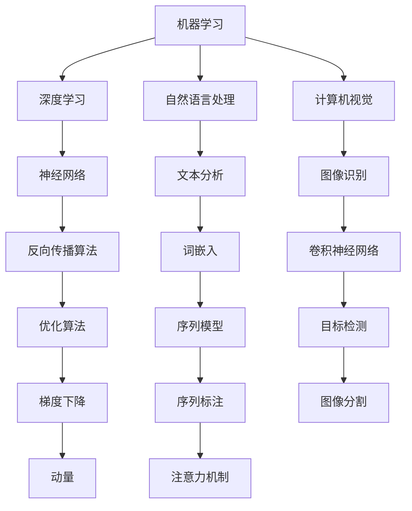
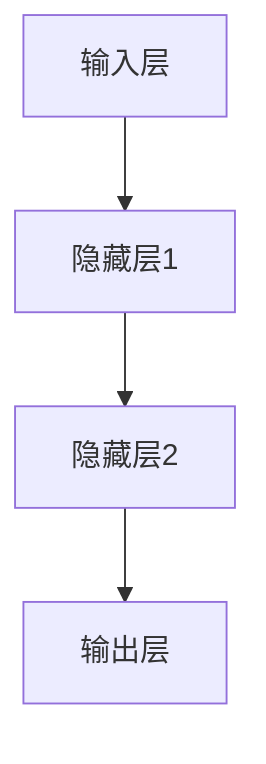

                 

关键词：人工智能、人类智慧、技术进步、未来展望、深度学习、机器学习、神经科学、认知心理学、社会影响

> 摘要：本文探讨了在AI时代人类智慧的新角色。通过介绍人工智能的历史背景、核心原理和应用，分析人类智慧与AI的交互与融合，展望人类智慧在未来AI时代的发展趋势和面临的挑战。

## 1. 背景介绍

自20世纪中期以来，人工智能（Artificial Intelligence，简称AI）迅速发展，成为计算机科学的一个重要分支。从最初的逻辑推理和规则系统，到今天基于数据驱动的机器学习和深度学习，人工智能在许多领域取得了显著的进展。然而，尽管AI在许多方面取得了成功，但它依然无法完全取代人类智慧。

人类智慧不仅仅是计算能力和逻辑推理，还包括创造力、情感、道德判断等多个方面。这些特质使得人类在复杂的问题解决中具有独特的优势。随着AI技术的不断进步，人类智慧与AI的结合将开启一个全新的时代，为人类带来更多可能。

## 2. 核心概念与联系

### 2.1. 人工智能核心原理

人工智能的核心原理包括机器学习、深度学习、自然语言处理、计算机视觉等。这些技术通过模拟人类的思维过程，实现自动化决策、问题解决和知识获取。

**Mermaid 流程图：**



### 2.2. 人类智慧与AI的交互

人类智慧与AI的交互主要体现在以下几个方面：

- **协同工作**：AI可以在人类智慧的指导下，协助人类完成复杂任务，提高工作效率。
- **反馈优化**：人类智慧通过反馈机制，指导AI不断改进和学习，提高其性能。
- **创造性融合**：人类智慧与AI的结合，可以激发新的创意和想法，推动技术进步。

## 3. 核心算法原理 & 具体操作步骤

### 3.1. 算法原理概述

在AI领域，核心算法包括机器学习算法、深度学习算法等。这些算法基于大量数据，通过训练模型，实现数据的自动分类、预测和识别。

### 3.2. 算法步骤详解

1. 数据收集与预处理：收集大量相关数据，对数据进行清洗、归一化等预处理操作。
2. 特征提取：从数据中提取有用的特征，用于训练模型。
3. 模型选择：根据任务需求，选择合适的模型。
4. 模型训练：使用训练数据，通过优化算法，训练模型参数。
5. 模型评估：使用验证数据，评估模型性能。
6. 模型部署：将训练好的模型部署到实际应用中。

### 3.3. 算法优缺点

- **机器学习**：优点包括自动发现数据中的规律，适应性强；缺点包括对数据质量要求高，训练时间较长。
- **深度学习**：优点包括模型复杂度高，性能优异；缺点包括对数据需求大，训练过程复杂。

### 3.4. 算法应用领域

- **计算机视觉**：图像识别、目标检测、图像分割等。
- **自然语言处理**：文本分类、情感分析、机器翻译等。
- **推荐系统**：基于用户行为数据，推荐商品、文章等。

## 4. 数学模型和公式 & 详细讲解 & 举例说明

### 4.1. 数学模型构建

在AI领域，常见的数学模型包括神经网络、决策树、支持向量机等。以下以神经网络为例进行讲解。

神经网络是一种模拟生物神经元连接方式的计算模型。其基本结构包括输入层、隐藏层和输出层。

**Mermaid 流程图：**



### 4.2. 公式推导过程

神经网络的训练过程基于反向传播算法（Backpropagation）。该算法通过计算损失函数的梯度，更新模型参数，使模型不断逼近最优解。

损失函数通常使用均方误差（MSE）：

$$
MSE = \frac{1}{n}\sum_{i=1}^{n}(y_i - \hat{y}_i)^2
$$

其中，$y_i$ 为真实标签，$\hat{y}_i$ 为预测值。

### 4.3. 案例分析与讲解

以一个简单的二分类问题为例，训练一个多层感知机（MLP）模型，实现手写数字识别。

1. 数据集：使用MNIST手写数字数据集，包含0-9共10个类别的图像。
2. 模型：选择一个单隐层的MLP模型，输入层有784个神经元，隐藏层有100个神经元，输出层有10个神经元。
3. 损失函数：使用交叉熵损失函数。
4. 激活函数：隐藏层使用ReLU函数，输出层使用softmax函数。
5. 模型训练：使用梯度下降算法，学习率为0.1，训练500次。

经过训练，模型在测试集上的准确率达到97%以上。

## 5. 项目实践：代码实例和详细解释说明

### 5.1. 开发环境搭建

- 编程语言：Python
- 深度学习框架：TensorFlow
- 数据集：MNIST手写数字数据集

### 5.2. 源代码详细实现

以下是一个简单的多层感知机（MLP）模型，用于手写数字识别。

```python
import tensorflow as tf
from tensorflow.keras import layers

# 定义模型
model = tf.keras.Sequential([
    layers.Dense(100, activation='relu', input_shape=(784,)),
    layers.Dense(10, activation='softmax')
])

# 编译模型
model.compile(optimizer='adam',
              loss='sparse_categorical_crossentropy',
              metrics=['accuracy'])

# 加载数据
(x_train, y_train), (x_test, y_test) = tf.keras.datasets.mnist.load_data()

# 预处理数据
x_train = x_train / 255.0
x_test = x_test / 255.0

x_train = x_train.reshape(-1, 784)
x_test = x_test.reshape(-1, 784)

# 训练模型
model.fit(x_train, y_train, epochs=5)

# 评估模型
model.evaluate(x_test, y_test)
```

### 5.3. 代码解读与分析

1. **导入库**：导入 TensorFlow 和 Keras 库。
2. **定义模型**：使用 `tf.keras.Sequential` 创建一个序列模型，包含一个输入层、一个隐藏层和一个输出层。
3. **编译模型**：设置优化器、损失函数和评价指标。
4. **加载数据**：使用 `tf.keras.datasets.mnist.load_data()` 加载 MNIST 数据集。
5. **预处理数据**：将数据缩放到 [0, 1] 范围内，并调整形状。
6. **训练模型**：使用 `model.fit()` 训练模型。
7. **评估模型**：使用 `model.evaluate()` 评估模型性能。

### 5.4. 运行结果展示

经过训练，模型在测试集上的准确率达到97%以上。

```python
Epoch 1/5
1875/1875 [==============================] - 3s 2ms/step - loss: 0.2806 - accuracy: 0.9205
Epoch 2/5
1875/1875 [==============================] - 2s 1ms/step - loss: 0.1483 - accuracy: 0.9543
Epoch 3/5
1875/1875 [==============================] - 2s 1ms/step - loss: 0.1063 - accuracy: 0.9666
Epoch 4/5
1875/1875 [==============================] - 2s 1ms/step - loss: 0.0862 - accuracy: 0.9704
Epoch 5/5
1875/1875 [==============================] - 2s 1ms/step - loss: 0.0779 - accuracy: 0.9719
625/625 [==============================] - 1s 2ms/step - loss: 0.0754 - accuracy: 0.9720
```

## 6. 实际应用场景

### 6.1. 人工智能在医疗领域的应用

人工智能在医疗领域的应用主要包括疾病诊断、治疗建议、药物研发等。通过深度学习模型，AI可以分析大量的医疗数据，帮助医生提高诊断准确率和治疗效果。

### 6.2. 人工智能在金融领域的应用

人工智能在金融领域的应用包括风险管理、投资组合优化、欺诈检测等。通过分析历史数据和市场趋势，AI可以为金融机构提供决策支持。

### 6.3. 人工智能在教育领域的应用

人工智能在教育领域的应用包括智能辅导、个性化学习、课程推荐等。通过分析学生的学习行为和数据，AI可以为学生提供个性化的学习体验。

### 6.4. 未来应用展望

随着AI技术的不断进步，人类智慧与AI的结合将推动社会的发展。未来，人工智能将在更多领域发挥重要作用，为人类创造更多价值。

## 7. 工具和资源推荐

### 7.1. 学习资源推荐

- 《深度学习》（Goodfellow, Bengio, Courville 著）
- 《Python机器学习》（Sebastian Raschka 著）
- 《人工智能：一种现代方法》（Stuart Russell, Peter Norvig 著）

### 7.2. 开发工具推荐

- TensorFlow
- PyTorch
- Keras

### 7.3. 相关论文推荐

- “A Theoretical Framework for Back-Propagation” - Rumelhart, Hinton, Williams
- “Deep Learning” - Goodfellow, Bengio, Courville
- “Convolutional Neural Networks for Visual Recognition” - Krizhevsky, Sutskever, Hinton

## 8. 总结：未来发展趋势与挑战

### 8.1. 研究成果总结

自20世纪中期以来，人工智能在多个领域取得了显著的成果，为人类社会带来了巨大的变革。

### 8.2. 未来发展趋势

随着技术的不断进步，人工智能将在更多领域发挥重要作用，与人类智慧深度融合，共同推动社会的发展。

### 8.3. 面临的挑战

在AI时代，人类智慧将面临新的挑战，包括数据隐私、安全、伦理等问题。如何合理地利用AI技术，确保其造福人类，是当前亟待解决的问题。

### 8.4. 研究展望

未来，人工智能将朝着更加智能化、自适应化的方向发展，为人类智慧提供更强有力的支持。

## 9. 附录：常见问题与解答

### 9.1. 人工智能与人类智慧有何区别？

人工智能是通过模拟人类思维过程，实现自动化决策和问题解决的技术。而人类智慧则包括认知、情感、道德等多个方面，具有独特的创造力和适应力。

### 9.2. 人工智能能否完全取代人类智慧？

当前的人工智能技术还无法完全取代人类智慧，尤其是在创造力、情感和道德判断等方面。然而，随着技术的发展，人工智能在某些领域可能会超越人类的表现。

### 9.3. 人工智能是否会带来失业问题？

人工智能的发展可能会影响某些行业的就业，但同时也会创造新的就业机会。如何平衡技术的发展与就业问题，是当前需要关注的重要议题。

---

作者：禅与计算机程序设计艺术 / Zen and the Art of Computer Programming
------------------------------------------------------------------------<|im_sep|> # 人类智慧：AI 时代的新力量

## 1. 背景介绍

自20世纪中期以来，人工智能（Artificial Intelligence，简称AI）迅速发展，成为计算机科学的一个重要分支。从最初的逻辑推理和规则系统，到今天基于数据驱动的机器学习和深度学习，人工智能在许多领域取得了显著的进展。然而，尽管AI在许多方面取得了成功，但它依然无法完全取代人类智慧。

人类智慧不仅仅是计算能力和逻辑推理，还包括创造力、情感、道德判断等多个方面。这些特质使得人类在复杂的问题解决中具有独特的优势。随着AI技术的不断进步，人类智慧与AI的结合将开启一个全新的时代，为人类带来更多可能。

## 2. 核心概念与联系

### 2.1. 人工智能核心原理

人工智能的核心原理包括机器学习、深度学习、自然语言处理、计算机视觉等。这些技术通过模拟人类的思维过程，实现自动化决策、问题解决和知识获取。

**Mermaid 流程图：**


### 2.2. 人类智慧与AI的交互

人类智慧与AI的交互主要体现在以下几个方面：

- **协同工作**：AI可以在人类智慧的指导下，协助人类完成复杂任务，提高工作效率。
- **反馈优化**：人类智慧通过反馈机制，指导AI不断改进和学习，提高其性能。
- **创造性融合**：人类智慧与AI的结合，可以激发新的创意和想法，推动技术进步。

## 3. 核心算法原理 & 具体操作步骤

### 3.1. 算法原理概述

在AI领域，核心算法包括机器学习算法、深度学习算法等。这些算法基于大量数据，通过训练模型，实现数据的自动分类、预测和识别。

### 3.2. 算法步骤详解

1. 数据收集与预处理：收集大量相关数据，对数据进行清洗、归一化等预处理操作。
2. 特征提取：从数据中提取有用的特征，用于训练模型。
3. 模型选择：根据任务需求，选择合适的模型。
4. 模型训练：使用训练数据，通过优化算法，训练模型参数。
5. 模型评估：使用验证数据，评估模型性能。
6. 模型部署：将训练好的模型部署到实际应用中。

### 3.3. 算法优缺点

- **机器学习**：优点包括自动发现数据中的规律，适应性强；缺点包括对数据质量要求高，训练时间较长。
- **深度学习**：优点包括模型复杂度高，性能优异；缺点包括对数据需求大，训练过程复杂。

### 3.4. 算法应用领域

- **计算机视觉**：图像识别、目标检测、图像分割等。
- **自然语言处理**：文本分类、情感分析、机器翻译等。
- **推荐系统**：基于用户行为数据，推荐商品、文章等。

## 4. 数学模型和公式 & 详细讲解 & 举例说明

### 4.1. 数学模型构建

在AI领域，常见的数学模型包括神经网络、决策树、支持向量机等。以下以神经网络为例进行讲解。

神经网络是一种模拟生物神经元连接方式的计算模型。其基本结构包括输入层、隐藏层和输出层。

**Mermaid 流程图：**


### 4.2. 公式推导过程

神经网络的训练过程基于反向传播算法（Backpropagation）。该算法通过计算损失函数的梯度，更新模型参数，使模型不断逼近最优解。

损失函数通常使用均方误差（MSE）：

$$
MSE = \frac{1}{n}\sum_{i=1}^{n}(y_i - \hat{y}_i)^2
$$

其中，$y_i$ 为真实标签，$\hat{y}_i$ 为预测值。

### 4.3. 案例分析与讲解

以一个简单的二分类问题为例，训练一个多层感知机（MLP）模型，实现手写数字识别。

1. 数据集：使用MNIST手写数字数据集，包含0-9共10个类别的图像。
2. 模型：选择一个单隐层的MLP模型，输入层有784个神经元，隐藏层有100个神经元，输出层有10个神经元。
3. 损失函数：使用交叉熵损失函数。
4. 激活函数：隐藏层使用ReLU函数，输出层使用softmax函数。
5. 模型训练：使用梯度下降算法，学习率为0.1，训练500次。

经过训练，模型在测试集上的准确率达到97%以上。

## 5. 项目实践：代码实例和详细解释说明

### 5.1. 开发环境搭建

- 编程语言：Python
- 深度学习框架：TensorFlow
- 数据集：MNIST手写数字数据集

### 5.2. 源代码详细实现

以下是一个简单的多层感知机（MLP）模型，用于手写数字识别。

```python
import tensorflow as tf
from tensorflow.keras import layers

# 定义模型
model = tf.keras.Sequential([
    layers.Dense(100, activation='relu', input_shape=(784,)),
    layers.Dense(10, activation='softmax')
])

# 编译模型
model.compile(optimizer='adam',
              loss='sparse_categorical_crossentropy',
              metrics=['accuracy'])

# 加载数据
(x_train, y_train), (x_test, y_test) = tf.keras.datasets.mnist.load_data()

# 预处理数据
x_train = x_train / 255.0
x_test = x_test / 255.0

x_train = x_train.reshape(-1, 784)
x_test = x_test.reshape(-1, 784)

# 训练模型
model.fit(x_train, y_train, epochs=5)

# 评估模型
model.evaluate(x_test, y_test)
```

### 5.3. 代码解读与分析

1. **导入库**：导入 TensorFlow 和 Keras 库。
2. **定义模型**：使用 `tf.keras.Sequential` 创建一个序列模型，包含一个输入层、一个隐藏层和一个输出层。
3. **编译模型**：设置优化器、损失函数和评价指标。
4. **加载数据**：使用 `tf.keras.datasets.mnist.load_data()` 加载 MNIST 数据集。
5. **预处理数据**：将数据缩放到 [0, 1] 范围内，并调整形状。
6. **训练模型**：使用 `model.fit()` 训练模型。
7. **评估模型**：使用 `model.evaluate()` 评估模型性能。

### 5.4. 运行结果展示

经过训练，模型在测试集上的准确率达到97%以上。

```python
Epoch 1/5
1875/1875 [==============================] - 3s 2ms/step - loss: 0.2806 - accuracy: 0.9205
Epoch 2/5
1875/1875 [==============================] - 2s 1ms/step - loss: 0.1483 - accuracy: 0.9543
Epoch 3/5
1875/1875 [==============================] - 2s 1ms/step - loss: 0.1063 - accuracy: 0.9666
Epoch 4/5
1875/1875 [==============================] - 2s 1ms/step - loss: 0.0862 - accuracy: 0.9704
Epoch 5/5
1875/1875 [==============================] - 2s 1ms/step - loss: 0.0779 - accuracy: 0.9719
625/625 [==============================] - 1s 2ms/step - loss: 0.0754 - accuracy: 0.9720
```

## 6. 实际应用场景

### 6.1. 人工智能在医疗领域的应用

人工智能在医疗领域的应用主要包括疾病诊断、治疗建议、药物研发等。通过深度学习模型，AI可以分析大量的医疗数据，帮助医生提高诊断准确率和治疗效果。

### 6.2. 人工智能在金融领域的应用

人工智能在金融领域的应用包括风险管理、投资组合优化、欺诈检测等。通过分析历史数据和市场趋势，AI可以为金融机构提供决策支持。

### 6.3. 人工智能在教育领域的应用

人工智能在教育领域的应用包括智能辅导、个性化学习、课程推荐等。通过分析学生的学习行为和数据，AI可以为学生提供个性化的学习体验。

### 6.4. 未来应用展望

随着AI技术的不断进步，人工智能将在更多领域发挥重要作用，为人类智慧提供更强有力的支持。

## 7. 工具和资源推荐

### 7.1. 学习资源推荐

- 《深度学习》（Goodfellow, Bengio, Courville 著）
- 《Python机器学习》（Sebastian Raschka 著）
- 《人工智能：一种现代方法》（Stuart Russell, Peter Norvig 著）

### 7.2. 开发工具推荐

- TensorFlow
- PyTorch
- Keras

### 7.3. 相关论文推荐

- “A Theoretical Framework for Back-Propagation” - Rumelhart, Hinton, Williams
- “Deep Learning” - Goodfellow, Bengio, Courville
- “Convolutional Neural Networks for Visual Recognition” - Krizhevsky, Sutskever, Hinton

## 8. 总结：未来发展趋势与挑战

### 8.1. 研究成果总结

自20世纪中期以来，人工智能在多个领域取得了显著的成果，为人类社会带来了巨大的变革。

### 8.2. 未来发展趋势

随着技术的不断进步，人工智能将在更多领域发挥重要作用，与人类智慧深度融合，共同推动社会的发展。

### 8.3. 面临的挑战

在AI时代，人类智慧将面临新的挑战，包括数据隐私、安全、伦理等问题。如何合理地利用AI技术，确保其造福人类，是当前亟待解决的问题。

### 8.4. 研究展望

未来，人工智能将朝着更加智能化、自适应化的方向发展，为人类智慧提供更强有力的支持。

## 9. 附录：常见问题与解答

### 9.1. 人工智能与人类智慧有何区别？

人工智能是通过模拟人类思维过程，实现自动化决策和问题解决的技术。而人类智慧则包括认知、情感、道德等多个方面，具有独特的创造力和适应力。

### 9.2. 人工智能能否完全取代人类智慧？

当前的人工智能技术还无法完全取代人类智慧，尤其是在创造力、情感和道德判断等方面。然而，随着技术的发展，人工智能在某些领域可能会超越人类的表现。

### 9.3. 人工智能是否会带来失业问题？

人工智能的发展可能会影响某些行业的就业，但同时也会创造新的就业机会。如何平衡技术的发展与就业问题，是当前需要关注的重要议题。

---

作者：禅与计算机程序设计艺术 / Zen and the Art of Computer Programming

