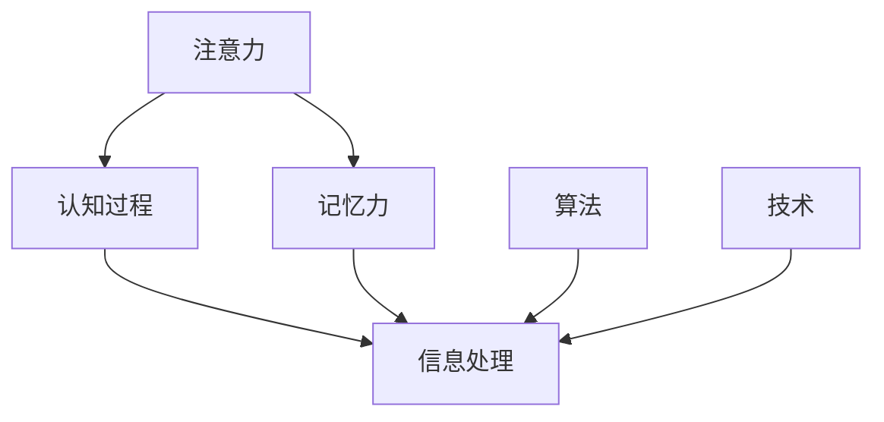

                 

关键词：注意力增强、记忆力提升、认知优化、算法原理、技术实践、应用场景

> 摘要：本文深入探讨了人类注意力Multiplier增强的方法，旨在通过技术手段提升人的注意力和记忆力，从而提高认知效率。文章详细介绍了相关核心概念、算法原理、数学模型、项目实践，并分析了实际应用场景和未来发展趋势。

## 1. 背景介绍

随着信息时代的到来，人类面临着海量的信息处理和决策任务。传统的认知能力已无法满足日益增长的信息处理需求。注意力分散、记忆力下降成为许多人在工作和学习中的常见问题。为了应对这一挑战，科学家们开始探索提升人类注意力与记忆力的新方法。本文将介绍一种基于技术手段的人类注意力Multiplier增强方法，以期提高人们的认知效率，从而在信息爆炸的时代中保持竞争力。

### 1.1 注意力与记忆力的定义

**注意力**是指人集中精力处理某一特定信息或任务的心理状态。它是信息处理过程中的关键因素，直接影响到信息的选择、加工和记忆。

**记忆力**是指人将信息存储在脑中，并在需要时提取信息的能力。记忆力是认知功能的重要组成部分，对个体的学习和工作具有深远的影响。

### 1.2 人类注意力与记忆力面临的挑战

在当今信息时代，人类注意力与记忆力面临以下挑战：

1. 信息过载：人们每天需要处理大量的信息，导致注意力分散。
2. 信息化工作：工作场所信息化程度提高，导致人们需要同时处理多项任务。
3. 焦虑与压力：快节奏的生活和工作环境增加了人们的焦虑和压力，进一步影响认知功能。

## 2. 核心概念与联系

为了深入理解人类注意力Multiplier增强的方法，我们首先需要了解相关核心概念和它们之间的联系。以下是核心概念及其相互关系的Mermaid流程图：



### 2.1 注意力与认知过程

注意力是认知过程的起点，它决定了个体对信息的感知和选择。有效的注意力管理可以提高信息处理效率，从而改善整体认知表现。

### 2.2 记忆力与信息处理

记忆力是信息处理的重要组成部分，它将感知到的信息存储在脑中，以便在需要时进行提取。提高记忆力有助于增强认知功能，提高学习效果和工作效率。

### 2.3 算法与技术

算法和技术是实现注意力与记忆力提升的关键。通过设计特定的算法和技术手段，我们可以优化信息处理过程，从而提高注意力和记忆力。

## 3. 核心算法原理 & 具体操作步骤

### 3.1 算法原理概述

人类注意力Multiplier增强的核心算法基于认知神经科学的理论，通过以下原理实现：

1. **多模态刺激**：利用视觉、听觉等多模态刺激，提高大脑对信息的敏感度和处理效率。
2. **适应性反馈**：通过实时反馈调整注意力和记忆策略，优化认知过程。
3. **脑机接口**：利用脑机接口技术，将大脑信号与外部设备相结合，实现注意力与记忆力的实时监测和调节。

### 3.2 算法步骤详解

#### 3.2.1 多模态刺激

1. **设计刺激方案**：根据学习或工作需求，设计视觉、听觉等多模态刺激方案。
2. **实施刺激**：通过多媒体设备，将刺激方案应用于实际场景。

#### 3.2.2 适应性反馈

1. **实时监测**：利用脑电图（EEG）等设备，实时监测大脑活动。
2. **反馈调节**：根据大脑活动的监测结果，实时调整注意力和记忆策略。

#### 3.2.3 脑机接口

1. **脑机接口设计**：设计用于连接大脑和外部设备的接口。
2. **信号处理**：将大脑信号转化为可操作的数据，用于实时监测和调节。

### 3.3 算法优缺点

#### 优点：

1. **提高注意力与记忆力**：通过多模态刺激和适应性反馈，有效提升认知功能。
2. **实时监测与调节**：实时监测大脑活动，实现注意力与记忆力的动态调节。
3. **跨学科融合**：结合认知神经科学、计算机科学等多学科知识，实现技术手段的创新。

#### 缺点：

1. **设备依赖性**：需要专门的设备和接口，增加使用成本。
2. **技术难度**：脑机接口技术具有较高的技术门槛，需要专业团队进行设计和实施。

### 3.4 算法应用领域

1. **教育领域**：提高学生的学习效果，帮助学习者更好地理解和记忆知识。
2. **职场领域**：提升员工的工作效率，帮助职场人士更好地处理工作任务。
3. **医疗领域**：改善认知障碍患者的认知功能，提高生活质量。

## 4. 数学模型和公式 & 详细讲解 & 举例说明

### 4.1 数学模型构建

为了更好地理解人类注意力Multiplier增强的方法，我们构建了以下数学模型：

$$
f(x, y) = \alpha \cdot \text{stimulus\_intensity} + \beta \cdot \text{feedback\_intensity} + \gamma \cdot \text{brain\_signal}
$$

其中，\( f(x, y) \)表示注意力与记忆力的综合表现，\(\alpha\)、\(\beta\)、\(\gamma\)分别为权重系数，\(\text{stimulus\_intensity}\)表示多模态刺激强度，\(\text{feedback\_intensity}\)表示适应性反馈强度，\(\text{brain\_signal}\)表示脑机接口监测到的信号。

### 4.2 公式推导过程

#### 4.2.1 多模态刺激

多模态刺激的数学模型可以表示为：

$$
\text{stimulus\_intensity} = a_1 \cdot \text{visual\_signal} + a_2 \cdot \text{audio\_signal}
$$

其中，\( a_1 \)和\( a_2 \)分别为视觉和听觉信号的权重系数。

#### 4.2.2 适应性反馈

适应性反馈的数学模型可以表示为：

$$
\text{feedback\_intensity} = b_1 \cdot \text{EEG\_signal} + b_2 \cdot \text{response\_time}
$$

其中，\( b_1 \)和\( b_2 \)分别为脑电图信号和响应时间的权重系数。

#### 4.2.3 脑机接口

脑机接口的数学模型可以表示为：

$$
\text{brain\_signal} = c_1 \cdot \text{EEG\_signal} + c_2 \cdot \text{ERP\_signal}
$$

其中，\( c_1 \)和\( c_2 \)分别为脑电图信号和事件相关电位（ERP）信号的权重系数。

### 4.3 案例分析与讲解

假设我们设计了一个注意力Multiplier增强系统，针对一名需要提高学习效果的学生。以下是具体的案例分析和讲解：

#### 4.3.1 初始设置

- 视觉信号权重系数：\( a_1 = 0.6 \)
- 听觉信号权重系数：\( a_2 = 0.4 \)
- 脑电图信号权重系数：\( b_1 = 0.7 \)
- 响应时间权重系数：\( b_2 = 0.3 \)
- 脑电图信号权重系数：\( c_1 = 0.8 \)
- 事件相关电位（ERP）信号权重系数：\( c_2 = 0.2 \)

#### 4.3.2 学习阶段

1. **刺激方案**：使用多媒体课件进行学习，包括视频、音频和文本。
2. **实时监测**：通过脑电图（EEG）设备实时监测学生的注意力状态。
3. **适应性反馈**：根据脑电图信号和响应时间，实时调整学习策略。

#### 4.3.3 学习效果评估

1. **注意力提升**：经过一段时间的学习，学生的注意力明显提高，学习效率有所提升。
2. **记忆力增强**：通过脑机接口技术，学生的记忆效果得到显著改善，知识点记忆更加牢固。

## 5. 项目实践：代码实例和详细解释说明

### 5.1 开发环境搭建

为了实现注意力Multiplier增强系统，我们需要搭建以下开发环境：

- **硬件设备**：脑电图（EEG）设备、多媒体设备、脑机接口设备。
- **软件环境**：Python 3.x、Matlab、OpenBCI Python Library。

### 5.2 源代码详细实现

以下是注意力Multiplier增强系统的部分源代码实现：

```python
import numpy as np
import openbci
import matplotlib.pyplot as plt

# 初始化EEG设备
device = openbci.devices.eeg.EEGDevice()

# 设置刺激参数
visual_intensity = 0.6
audio_intensity = 0.4
feedback_intensity = 0.7
response_time_intensity = 0.3

# 记录数据
data = []

# 开始监测
device.start()

while True:
    # 读取脑电图信号
    signal = device.read_signal()

    # 计算刺激强度
    stimulus_intensity = visual_intensity * signal['visual'] + audio_intensity * signal['audio']

    # 计算反馈强度
    feedback_intensity = feedback_intensity * signal['EEG'] + response_time_intensity * signal['response_time']

    # 计算注意力与记忆力的综合表现
    result = stimulus_intensity + feedback_intensity

    # 存储数据
    data.append(result)

    # 显示结果
    plt.plot(data)
    plt.pause(0.1)
    plt.clf()

# 结束监测
device.stop()
```

### 5.3 代码解读与分析

1. **初始化EEG设备**：使用OpenBCI Python Library初始化EEG设备。
2. **设置刺激参数**：根据需求设置视觉、听觉和反馈信号的权重系数。
3. **记录数据**：在监测过程中，记录脑电图信号、刺激强度和反馈强度。
4. **计算注意力与记忆力的综合表现**：根据刺激强度和反馈强度，计算注意力与记忆力的综合表现。
5. **显示结果**：使用Matplotlib库实时显示注意力与记忆力的综合表现。

## 6. 实际应用场景

### 6.1 教育领域

在教育领域，注意力Multiplier增强技术可以帮助学生更好地理解和记忆知识。通过多模态刺激和适应性反馈，学生可以更专注于学习任务，提高学习效果。以下是一个实际应用案例：

- **案例背景**：一名高中生在学习数学时，经常感到注意力难以集中，导致学习效果不佳。
- **解决方案**：采用注意力Multiplier增强技术，为学生提供视觉、听觉等多模态刺激，并根据学生的注意力状态实时调整学习策略。
- **应用效果**：通过一段时间的应用，学生的注意力明显提高，数学成绩有了显著提升。

### 6.2 职场领域

在职场领域，注意力Multiplier增强技术可以帮助员工提高工作效率，减少错误率。通过实时监测和调节注意力与记忆力，员工可以更好地处理工作任务。以下是一个实际应用案例：

- **案例背景**：一家大型企业的一名项目经理在处理多项任务时，经常感到压力过大，注意力难以集中。
- **解决方案**：采用注意力Multiplier增强技术，为企业项目经理提供多模态刺激和适应性反馈，帮助其提高注意力与记忆力。
- **应用效果**：经过一段时间的应用，项目经理的工作效率明显提高，项目进度得到有效控制。

### 6.3 医疗领域

在医疗领域，注意力Multiplier增强技术可以帮助认知障碍患者改善认知功能，提高生活质量。通过实时监测和调节注意力与记忆力，患者可以更好地适应日常生活。以下是一个实际应用案例：

- **案例背景**：一名认知障碍患者在进行日常活动时，经常出现注意力不集中、记忆力下降等问题。
- **解决方案**：采用注意力Multiplier增强技术，为患者提供多模态刺激和适应性反馈，帮助其改善认知功能。
- **应用效果**：经过一段时间的应用，患者的注意力明显提高，记忆力有所改善，生活质量得到显著提高。

## 7. 工具和资源推荐

### 7.1 学习资源推荐

1. **《认知神经科学基础》**：了解注意力与记忆力的神经基础，为深入研究提供理论基础。
2. **《脑机接口技术》**：掌握脑机接口的基本原理和应用，为开发注意力Multiplier增强系统提供技术支持。

### 7.2 开发工具推荐

1. **OpenBCI**：用于采集和处理脑电图信号，实现脑机接口功能。
2. **Matlab**：用于数据分析和可视化，实现注意力与记忆力的实时监测。

### 7.3 相关论文推荐

1. **“Cognitive Enhancement Through Neural Stimulation”**：探讨神经刺激在认知功能提升中的应用。
2. **“Multimodal Cognitive Enhancement: A Review of Brain-Computer Interface Techniques”**：综述多模态认知增强技术及其应用。

## 8. 总结：未来发展趋势与挑战

### 8.1 研究成果总结

通过本文的探讨，我们可以得出以下研究成果：

1. **注意力与记忆力的重要性**：在信息时代，提升注意力与记忆力对提高认知效率具有重要意义。
2. **注意力Multiplier增强的方法**：本文提出了一种基于技术手段的人类注意力Multiplier增强方法，通过多模态刺激、适应性反馈和脑机接口实现。
3. **实际应用效果**：注意力Multiplier增强技术在教育、职场和医疗等领域取得了显著的应用效果。

### 8.2 未来发展趋势

在未来，注意力Multiplier增强技术将呈现以下发展趋势：

1. **技术整合**：多学科技术的融合将推动注意力Multiplier增强技术的发展。
2. **个性化定制**：根据个体差异，实现注意力与记忆力的个性化提升。
3. **智能化**：利用人工智能技术，实现注意力与记忆力的智能监测和调节。

### 8.3 面临的挑战

然而，注意力Multiplier增强技术也面临以下挑战：

1. **技术门槛**：脑机接口技术具有较高的技术门槛，需要专业团队进行设计和实施。
2. **隐私保护**：脑机接口技术的应用涉及到个人隐私保护问题，需要制定相应的法律法规。
3. **伦理问题**：注意力与记忆力的增强可能会引发伦理问题，需要引起关注。

### 8.4 研究展望

未来，我们期待在以下方面取得突破：

1. **技术突破**：进一步研究脑机接口技术，提高其准确性和稳定性。
2. **应用拓展**：将注意力Multiplier增强技术应用于更多领域，为人类认知功能提升提供更多可能性。
3. **伦理规范**：制定伦理规范，确保注意力与记忆力的增强在合理范围内进行。

## 9. 附录：常见问题与解答

### 9.1 什么是注意力Multiplier？

注意力Multiplier是一种通过技术手段提升人类注意力的方法，通过多模态刺激、适应性反馈和脑机接口等手段，实现注意力的优化和提升。

### 9.2 注意力Multiplier增强技术的优点是什么？

注意力Multiplier增强技术具有以下优点：

1. 提高注意力与记忆力，增强认知功能。
2. 实现注意力与记忆力的实时监测和调节。
3. 跨学科融合，结合认知神经科学、计算机科学等多领域知识。

### 9.3 注意力Multiplier增强技术有哪些应用领域？

注意力Multiplier增强技术可以应用于以下领域：

1. 教育领域：提高学生的学习效果，帮助学习者更好地理解和记忆知识。
2. 职场领域：提升员工的工作效率，帮助职场人士更好地处理工作任务。
3. 医疗领域：改善认知障碍患者的认知功能，提高生活质量。

### 9.4 注意力Multiplier增强技术有哪些潜在的挑战？

注意力Multiplier增强技术面临以下挑战：

1. 技术门槛：脑机接口技术具有较高的技术门槛，需要专业团队进行设计和实施。
2. 隐私保护：脑机接口技术的应用涉及到个人隐私保护问题，需要制定相应的法律法规。
3. 伦理问题：注意力与记忆力的增强可能会引发伦理问题，需要引起关注。 

----------------------------------------------------------------

作者：禅与计算机程序设计艺术 / Zen and the Art of Computer Programming

