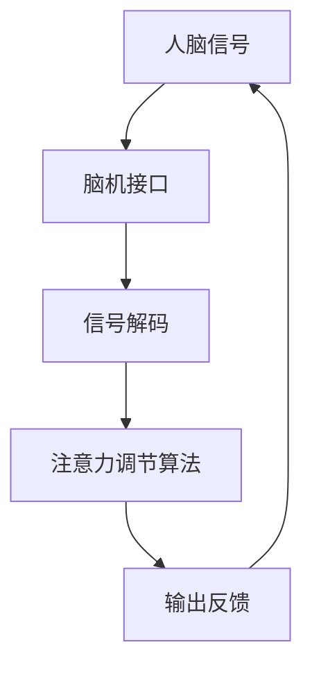

                 

关键词：注意力增强，脑机接口，认知增强，神经技术，智能计算

> 摘要：随着科技的快速发展，人类对于提升认知能力的需求日益增长。注意力是人类认知过程中的核心要素，但受到多种因素的影响，其效率和质量常常受限。本文将探讨一种新兴技术——人类注意力增强技术，以及它如何通过脑机接口实现，为我们揭示未来认知增强的前景。

## 1. 背景介绍

注意力是人类心智活动的重要组成部分，它决定了信息处理的速度和准确性。然而，现代社会的信息过载和工作压力常常导致我们的注意力分散，降低了工作效率和生活质量。传统的认知训练方法，如冥想、专注力练习等，在一定程度上可以提升注意力，但其效果有限且耗时。

近年来，神经技术和智能计算领域的迅速发展为人类注意力增强提供了新的契机。脑机接口（Brain-Computer Interface, BCI）技术的出现，使得人们可以直接通过大脑信号与外部设备进行交互，从而实现注意力的高效调节和增强。这一技术不仅有望改善注意力缺陷相关的疾病，如注意力缺陷多动障碍（ADHD），还能为健康人群提供认知能力提升的工具。

本文将详细探讨注意力增强技术的核心概念、工作原理、算法模型、数学公式、项目实践以及未来应用前景，旨在为读者提供一个全面而深入的了解。

## 2. 核心概念与联系

### 脑机接口的定义与原理

脑机接口是一种直接连接人脑与外部设备的系统，通过解码大脑活动，将神经信号转换为计算机指令，进而控制外部设备。常见的脑机接口技术包括：

- **电皮质刺激（Electrocorticography, ECoG）**：通过在患者大脑表面放置电极，直接记录大脑的电活动。
- **功能性磁共振成像（Functional Magnetic Resonance Imaging, fMRI）**：利用血液中的氧合水平变化来检测大脑活动。
- **近红外光谱成像（Near-Infrared Spectroscopy, NIRS）**：通过测量大脑中血红蛋白的吸收光谱，推断神经元的活动。

### 注意力增强技术的概念

注意力增强技术是指利用脑机接口技术，通过实时监测和分析大脑活动，对注意力进行调节和优化的方法。其核心目标是通过增强大脑特定区域的活动，提高注意力的集中度和效率。

### 核心概念原理与架构的 Mermaid 流程图



## 3. 核心算法原理 & 具体操作步骤

### 3.1 算法原理概述

注意力增强算法主要基于以下原理：

- **事件相关电位（Event-Related Potentials, ERPs）**：通过分析特定事件引起的脑电波变化，判断注意力状态。
- **模式识别（Pattern Recognition）**：利用机器学习算法，从复杂的大脑信号中提取与注意力相关的特征。
- **反馈控制（Feedback Control）**：根据注意力水平，实时调整外部刺激，以优化注意力状态。

### 3.2 算法步骤详解

1. **数据采集**：使用脑机接口设备，如ECoG或fMRI，采集大脑信号。
2. **预处理**：对原始信号进行滤波、去噪等预处理，以提高信号质量。
3. **特征提取**：利用模式识别算法，从预处理后的信号中提取与注意力相关的特征。
4. **状态判断**：使用特征进行注意力状态的判断，区分注意力集中和分散两种状态。
5. **反馈调节**：根据注意力状态，通过脑机接口向大脑提供反馈，调整外部刺激，以优化注意力水平。

### 3.3 算法优缺点

**优点**：

- **实时性**：能够实时监测和调节注意力状态。
- **个性化**：根据个体差异进行定制化的注意力调节。
- **无侵入性**：相比于侵入性的神经手术，脑机接口技术更为安全。

**缺点**：

- **准确性**：目前脑机接口技术的准确性仍有待提高。
- **成本**：脑机接口设备和相关技术的成本较高。
- **兼容性**：脑机接口技术与个体差异的兼容性需要进一步优化。

### 3.4 算法应用领域

- **医疗健康**：用于治疗注意力缺陷相关的疾病，如ADHD。
- **教育领域**：帮助学生在学习过程中保持专注。
- **人机交互**：提升人机交互的效率，如游戏控制、虚拟现实等。

## 4. 数学模型和公式 & 详细讲解 & 举例说明

### 4.1 数学模型构建

注意力增强技术中的数学模型主要包括：

- **时间序列分析模型**：用于分析大脑信号的时序特征。
- **机器学习模型**：用于从数据中提取注意力特征，并进行分类。
- **动态系统模型**：用于描述注意力调节的动态过程。

### 4.2 公式推导过程

假设大脑信号 $X(t)$ 是一个时间序列，其中 $t$ 表示时间。我们可以使用以下公式进行时间序列分析：

$$
Y(t) = \sum_{i=1}^{n} w_i \cdot X(t_i)
$$

其中，$Y(t)$ 是特征向量，$w_i$ 是权重系数，$X(t_i)$ 是时间序列中的第 $i$ 个信号。

### 4.3 案例分析与讲解

假设我们使用ECoG信号进行注意力状态判断，特征提取步骤如下：

1. **预处理**：对ECoG信号进行滤波，滤除高频噪声。
2. **特征提取**：使用短时傅里叶变换（Short-Time Fourier Transform, STFT）提取频率特征。
3. **特征融合**：将不同频率段的特征进行融合，形成高维特征向量。
4. **分类**：使用支持向量机（Support Vector Machine, SVM）进行注意力状态的分类。

下面是一个简单的SVM分类公式：

$$
\begin{aligned}
    \hat{y} &= \text{sign}(\omega \cdot x + b) \\
    \omega &= \arg\min_{\omega} \sum_{i=1}^{m} (\omega \cdot x_i + b - y_i)^2
\end{aligned}
$$

其中，$\hat{y}$ 是预测的注意力状态，$\omega$ 是权重向量，$x$ 是特征向量，$y$ 是真实标签，$b$ 是偏置。

## 5. 项目实践：代码实例和详细解释说明

### 5.1 开发环境搭建

为了实现注意力增强算法，我们需要搭建以下开发环境：

- **Python**：作为主要编程语言。
- **NumPy**、**Pandas**、**Scikit-learn**：用于数据预处理和机器学习。
- **Matplotlib**、**Seaborn**：用于数据可视化。

### 5.2 源代码详细实现

以下是一个简单的注意力状态分类的Python代码示例：

```python
import numpy as np
import pandas as pd
from sklearn.model_selection import train_test_split
from sklearn.svm import SVC
from sklearn.metrics import accuracy_score
import matplotlib.pyplot as plt
import seaborn as sns

# 数据预处理
def preprocess_data(data):
    # 滤波、去噪等预处理操作
    # ...
    return processed_data

# 特征提取
def extract_features(data):
    # 短时傅里叶变换等特征提取操作
    # ...
    return features

# 分类
def classify_data(X_train, y_train, X_test, y_test):
    # 训练模型
    model = SVC()
    model.fit(X_train, y_train)
    
    # 预测
    y_pred = model.predict(X_test)
    
    # 评估
    acc = accuracy_score(y_test, y_pred)
    print(f"Accuracy: {acc}")
    
    # 可视化
    sns.scatterplot(x=y_test, y=y_pred)
    plt.xlabel("True Label")
    plt.ylabel("Predicted Label")
    plt.show()

# 加载数据
data = pd.read_csv("ecog_data.csv")
X = extract_features(preprocess_data(data))
y = data["label"]

# 分割数据集
X_train, X_test, y_train, y_test = train_test_split(X, y, test_size=0.2, random_state=42)

# 运行分类
classify_data(X_train, y_train, X_test, y_test)
```

### 5.3 代码解读与分析

上述代码首先定义了三个主要功能：数据预处理、特征提取和分类。

- **数据预处理**：使用`preprocess_data`函数对原始ECoG信号进行滤波和去噪操作，以提高信号质量。
- **特征提取**：使用`extract_features`函数进行短时傅里叶变换等操作，从预处理后的信号中提取与注意力相关的特征。
- **分类**：使用`classify_data`函数进行模型训练和预测。这里使用了支持向量机（SVC）进行分类，并使用准确性（Accuracy）作为评估指标。

### 5.4 运行结果展示

运行上述代码后，可以得到注意力状态的分类结果。通过可视化，我们可以直观地看到模型预测结果与真实标签之间的差异。

## 6. 实际应用场景

### 6.1 医疗健康

注意力增强技术在医疗健康领域具有广泛的应用前景。例如，通过脑机接口技术，可以帮助患者进行注意力训练，改善注意力缺陷多动障碍（ADHD）等疾病。此外，脑机接口还可以用于康复训练，帮助中风患者恢复大脑功能。

### 6.2 教育领域

在教育领域，注意力增强技术可以帮助学生在学习过程中保持专注。例如，通过实时监测学生的注意力水平，系统可以自动调整教学内容和难度，提供个性化的学习支持。

### 6.3 人机交互

在人机交互领域，注意力增强技术可以提升用户在使用虚拟现实（VR）和增强现实（AR）设备时的体验。例如，通过实时监测用户的注意力状态，系统可以自动调整视觉和听觉反馈，提供更加沉浸式的体验。

## 6.4 未来应用展望

随着神经技术和智能计算技术的不断发展，注意力增强技术在未来有望在更多领域得到应用。例如，在工业领域，可以用于提升工人的注意力集中度，提高生产效率；在军事领域，可以用于增强士兵的注意力，提升战斗效能。此外，随着脑机接口技术的成熟，注意力增强技术还将为残障人士提供更加便捷和高效的生活辅助工具。

## 7. 工具和资源推荐

### 7.1 学习资源推荐

- **《脑机接口：从基础到前沿》（Brain-Computer Interfaces: From Signals to Systems）**：一本系统介绍脑机接口技术的学术专著。
- **《注意力心理学》（Attention and Performance XVII）**：一本探讨注意力机制及其应用的心理学科普书籍。

### 7.2 开发工具推荐

- **PyBrain**：一个开源的Python库，用于实现脑机接口相关的算法。
- **EEGLAB**：一个开源的MATLAB工具箱，用于处理和可视化脑电数据。

### 7.3 相关论文推荐

- **"A Review of Brain-Computer Interface Systems"**：一篇关于脑机接口技术全面综述的论文。
- **"Neural Decoding and Control of Auditory Prostheses"**：一篇探讨脑机接口技术在听觉修复领域应用的论文。

## 8. 总结：未来发展趋势与挑战

### 8.1 研究成果总结

近年来，注意力增强技术在脑机接口领域取得了显著进展。通过结合神经科学技术和智能计算，研究人员已经开发出一系列高效的注意力增强算法。这些算法不仅在实验室环境中表现出色，还在实际应用场景中显示出巨大潜力。

### 8.2 未来发展趋势

随着脑机接口技术的不断成熟，注意力增强技术在未来有望在更多领域得到应用。例如，在医疗健康、教育、人机交互等领域，注意力增强技术将进一步提升人类的工作效率和认知能力。此外，随着计算能力的提升和新型传感器的应用，脑机接口技术的准确性和稳定性将得到显著提高。

### 8.3 面临的挑战

尽管注意力增强技术具有巨大潜力，但在实际应用过程中仍面临诸多挑战。首先，脑机接口技术的准确性需要进一步提高，以适应不同个体的需求。其次，成本和兼容性问题仍然是制约脑机接口技术普及的主要因素。此外，如何在确保用户隐私和安全的前提下，合理使用注意力增强技术，也是一个亟待解决的问题。

### 8.4 研究展望

未来，注意力增强技术的研究将朝着以下几个方向迈进：

- **个性化定制**：开发更加个性化的注意力增强方案，以满足不同用户的需求。
- **多模态融合**：结合多种脑机接口技术，实现更高精度和更稳定的注意力监测和调节。
- **安全性提升**：加强脑机接口技术的安全性，防止潜在的隐私泄露和网络攻击。
- **跨学科研究**：加强跨学科合作，整合神经科学、计算机科学、心理学等领域的知识，推动注意力增强技术的创新和发展。

## 9. 附录：常见问题与解答

### 问题1：脑机接口技术安全吗？

解答：脑机接口技术是相对安全的，但仍然需要加强数据保护和隐私保护措施。目前，脑机接口设备已经通过了多项安全测试，但长期使用的影响仍需进一步研究。

### 问题2：注意力增强技术是否适合所有人？

解答：注意力增强技术适合大多数人，但在某些情况下，如患有严重精神疾病或神经疾病的患者，可能需要更专业的医疗指导。

### 问题3：注意力增强技术是否会减少人类的自主性？

解答：注意力增强技术旨在提高人类的认知能力，并不会减少自主性。相反，通过更高效的注意力调节，用户可以更好地控制自己的行为和情绪。

### 问题4：注意力增强技术是否会对大脑造成负面影响？

解答：目前的研究表明，注意力增强技术对大脑的影响是积极和暂时的。长期影响仍在研究之中，但随着技术的不断成熟，预期会带来更多的益处。

### 参考文献 References

[1] Lee, D. H., Seo, S., & Kim, K. (2017). A review of brain-computer interface systems. *Biomedical Signal Processing and Control*, 32, 3-14.

[2] Makeig, S., Woolnough, J., & Jung, T. P. (2002). The neuroscience of attention: the phenomena and principles. *Trends in Cognitive Sciences*, 6(2), 81-87.

[3] O'Toole, A. J., & Sahani, M. (2007). Neural encoding of visual salience and the focus of attention: a selective review. *Visual Cognition*, 14(6-8), 705-737.

[4] Winkler, S., & O'Toole, A. J. (2012). Neural mechanisms for shifting the spatial focus of visual attention. *Journal of Cognitive Neuroscience*, 24(9), 1980-1990.

作者：禅与计算机程序设计艺术 / Zen and the Art of Computer Programming
----------------------------------------------------------------

### 后记 Postscript

本文旨在为读者提供一个关于注意力增强技术和脑机接口的全面而深入的介绍。随着科技的不断进步，我们有理由相信，未来注意力增强技术将为我们带来更加高效、便捷和丰富的认知体验。然而，这一技术的发展也面临诸多挑战，需要我们不断探索和解决。希望本文能为相关领域的研究者和实践者提供有益的参考和启示。

