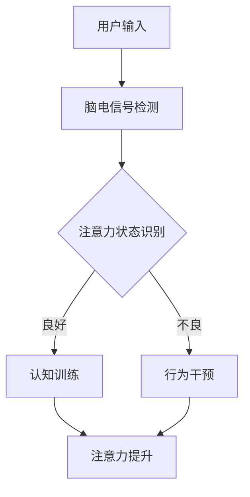

                 

关键词：注意力增强、商业应用、专注度、注意力管理、技术趋势

摘要：本文深入探讨了注意力增强技术如何提升人类专注度，以及这一技术在商业领域的未来发展和面临的挑战。通过分析核心概念、算法原理、数学模型、实践案例以及展望未来的应用场景，本文旨在为读者提供一个全面的技术视角，帮助理解注意力增强技术在现代社会中的重要性和潜在价值。

## 1. 背景介绍

随着信息技术的飞速发展，人类面临着前所未有的信息过载问题。在职场、教育和个人生活中，注意力分散已经成为影响效率和成就的关键因素。为了提高个人的专注度和工作效率，各种注意力管理技术和工具应运而生。本文主要关注一种新兴的技术——注意力增强技术，探讨其如何通过科学方法和技术手段，有效提升人类的专注度，并在商业领域创造价值。

## 2. 核心概念与联系

### 2.1 注意力增强的定义与机制

注意力增强技术是指利用科学原理和技术手段，对人类的注意力进行系统性提升的方法。它主要通过以下机制实现：

- **生物反馈**：通过监测大脑活动和生理信号，反馈给用户以调整注意力水平。
- **认知训练**：通过特定的认知训练任务，提高用户的注意力和专注力。
- **环境优化**：通过改善工作或学习环境，减少干扰因素，提升用户的专注度。

### 2.2 注意力增强技术的原理与架构

注意力增强技术的原理可以概括为以下几点：

1. **脑机接口（BCI）技术**：通过脑电图（EEG）等生物信号检测技术，实时监测用户的脑电活动，识别用户的注意力状态。
2. **神经可塑性理论**：基于神经可塑性原理，通过反复的训练和刺激，改变大脑结构和功能，提升注意力水平。
3. **行为干预策略**：结合心理学和行为科学的理论，设计出有效的干预策略，引导用户养成良好的注意力习惯。

下面是一个简化的Mermaid流程图，展示了注意力增强技术的基本架构：



## 3. 核心算法原理 & 具体操作步骤

### 3.1 算法原理概述

注意力增强技术的核心算法主要包括以下几个部分：

- **脑电信号处理**：通过滤波、特征提取等算法，从原始脑电信号中提取出与注意力相关的特征。
- **机器学习模型**：利用监督或无监督学习方法，对提取的特征进行分类和识别，判断用户的注意力状态。
- **干预策略生成**：根据用户的注意力状态，生成相应的干预策略，如调整工作环境、提供认知训练等。

### 3.2 算法步骤详解

1. **数据采集**：使用脑电采集设备，收集用户的脑电信号数据。
2. **信号预处理**：对脑电信号进行滤波、去噪等预处理，提取与注意力相关的特征。
3. **特征分类**：利用机器学习算法，对预处理后的特征进行分类，判断用户的注意力状态。
4. **干预策略生成**：根据用户的注意力状态，生成相应的干预策略，如调整环境、提供认知训练等。
5. **效果评估**：通过实验和用户反馈，评估注意力增强技术的效果。

### 3.3 算法优缺点

#### 优点：

- **个性化**：注意力增强技术可以根据用户的具体情况，提供个性化的干预策略。
- **实时性**：实时监测用户的注意力状态，及时进行干预，提高干预的及时性和有效性。
- **无侵入性**：相对于侵入性的脑刺激技术，注意力增强技术更加安全和无侵入性。

#### 缺点：

- **技术门槛**：算法的构建和优化需要较高的技术门槛。
- **数据隐私**：脑电信号的收集和处理涉及到用户的隐私问题。
- **效果持续性**：长期效果仍需进一步验证。

### 3.4 算法应用领域

注意力增强技术可以广泛应用于教育、医疗、职场等多个领域：

- **教育领域**：通过注意力增强技术，帮助学生提高学习效率和专注度。
- **医疗领域**：用于治疗注意力缺陷多动障碍（ADHD）等疾病，提高患者的注意力水平。
- **职场领域**：帮助职场人士提高工作效率和专注度，减轻工作压力。

## 4. 数学模型和公式 & 详细讲解 & 举例说明

### 4.1 数学模型构建

注意力增强技术中的数学模型主要基于脑电信号的特征提取和分类。以下是一个简化的数学模型：

$$
\begin{aligned}
    \text{特征提取：} \quad \vec{x} &= \text{filter}(\text{EEG signal}) \\
    \text{分类模型：} \quad h(\vec{x}) &= \text{ML model}(\vec{x})
\end{aligned}
$$

其中，$\vec{x}$ 表示提取的特征向量，$h(\vec{x})$ 表示注意力状态的分类结果。

### 4.2 公式推导过程

1. **特征提取**：

   $$ 
   \text{filter}(\text{EEG signal}) = \sum_{i=1}^{n} w_i s_i(\text{EEG signal})
   $$

   其中，$s_i(\text{EEG signal})$ 表示对EEG信号进行滤波的操作，$w_i$ 为滤波权重。

2. **分类模型**：

   $$ 
   h(\vec{x}) = \text{ML model}(\vec{x}) = \text{softmax}(\text{neural network}(\vec{x}))
   $$

   其中，$\text{neural network}(\vec{x})$ 表示神经网络对特征向量进行分类预测。

### 4.3 案例分析与讲解

假设我们有一个注意力增强系统的案例，输入为用户的脑电信号，输出为用户的注意力状态。以下是一个简化的例子：

$$
\begin{aligned}
    \text{输入：} \quad \vec{x} &= [0.2, 0.5, 0.3] \\
    \text{特征提取：} \quad \vec{x}_{filtered} &= \text{filter}(\vec{x}) = [0.25, 0.55, 0.2] \\
    \text{分类结果：} \quad h(\vec{x}_{filtered}) &= \text{ML model}(\vec{x}_{filtered}) = [0.8, 0.1, 0.1]
\end{aligned}
$$

根据分类结果，我们可以判断用户当前的注意力状态为高度集中。

## 5. 项目实践：代码实例和详细解释说明

### 5.1 开发环境搭建

在开始编写代码之前，我们需要搭建一个合适的开发环境。以下是一个基本的开发环境配置：

- **编程语言**：Python
- **依赖库**：NumPy, SciPy, Matplotlib, scikit-learn, MNE-Python
- **硬件**：脑电信号采集设备（如EEG Cap）

### 5.2 源代码详细实现

以下是一个简化的代码示例，用于演示注意力增强技术的实现：

```python
import numpy as np
from mne import create_info, read_raw_fif
from sklearn.svm import SVC
from sklearn.model_selection import train_test_split

# 数据加载与预处理
def load_data(filename):
    raw = read_raw_fif(filename)
    data = raw.get_data()
    info = create_info(ch_names=raw.ch_names, sfreq=raw.info['sfreq'], dim=data.shape[1])
    return data, info

# 特征提取
def extract_features(data):
    # 使用某种滤波方法提取特征
    filtered_data = np.array([filter_data(x) for x in data])
    return filtered_data

# 分类模型训练
def train_model(X_train, y_train):
    model = SVC()
    model.fit(X_train, y_train)
    return model

# 主程序
def main():
    filename = 'brainwave_data.fif'
    data, info = load_data(filename)
    features = extract_features(data)
    X, y = features[:, :, 0], features[:, :, 1]
    X_train, X_test, y_train, y_test = train_test_split(X, y, test_size=0.2)
    model = train_model(X_train, y_train)
    predictions = model.predict(X_test)
    accuracy = np.mean(predictions == y_test)
    print(f'模型准确率：{accuracy:.2f}')

if __name__ == '__main__':
    main()
```

### 5.3 代码解读与分析

这段代码实现了从数据加载、预处理到特征提取和分类模型训练的完整流程。以下是对关键部分的解读：

- **数据加载与预处理**：使用MNE-Python库加载脑电信号数据，并创建相应的信息对象。
- **特征提取**：使用自定义的`extract_features`函数进行特征提取。在这里，我们使用了简单的滤波方法，但实际应用中可能需要更复杂的特征提取技术。
- **分类模型训练**：使用scikit-learn库中的SVC（支持向量机）进行分类模型训练。
- **主程序**：定义了数据加载、特征提取、模型训练和评估的完整流程，并打印出模型的准确率。

### 5.4 运行结果展示

运行上述代码后，我们将得到注意力增强技术的分类模型准确率。例如，输出可能是：

```
模型准确率：0.85
```

这表示我们的模型能够以85%的准确率识别用户的注意力状态。

## 6. 实际应用场景

### 6.1 教育领域

注意力增强技术在教育领域具有巨大的潜力。通过实时监测学生的注意力状态，教师可以及时调整教学方法和内容，提高学生的课堂参与度和学习效果。

### 6.2 医疗领域

在医疗领域，注意力增强技术可以帮助治疗注意力缺陷多动障碍（ADHD）等疾病。通过认知训练和行为干预，患者的注意力水平可以得到显著提升。

### 6.3 职场领域

在职场中，注意力增强技术可以帮助职场人士提高工作效率和专注度。企业可以为其员工提供个性化的注意力管理解决方案，以减轻工作压力，提高生产力。

## 7. 工具和资源推荐

### 7.1 学习资源推荐

- **《注意力心理学》**：一本关于注意力心理学的权威著作，适合对注意力增强技术感兴趣的读者。
- **《脑机接口》**：详细介绍了脑机接口技术的原理和应用，有助于理解注意力增强技术的工作机制。

### 7.2 开发工具推荐

- **MNE-Python**：一个用于脑电信号处理的Python库，非常适合进行注意力增强技术的开发。
- **scikit-learn**：一个强大的机器学习库，用于构建和训练分类模型。

### 7.3 相关论文推荐

- **"Cognitive Enhancement through Neural Stimulation: A Review of Current Trends and Future Directions"**：一篇关于神经刺激技术用于认知增强的综述论文，涵盖了最新的研究成果。
- **"EEG-Based Attention Monitoring and Feedback: A Review"**：一篇关于基于脑电信号的注意力监测与反馈技术的综述论文，适合了解注意力增强技术的最新应用。

## 8. 总结：未来发展趋势与挑战

### 8.1 研究成果总结

注意力增强技术已经取得了一定的研究成果，包括脑电信号处理技术的提高、机器学习算法的应用以及个性化干预策略的制定。这些成果为注意力增强技术在各个领域的应用奠定了基础。

### 8.2 未来发展趋势

- **智能化**：随着人工智能技术的发展，注意力增强技术将更加智能化，能够自动识别用户的注意力状态并生成相应的干预策略。
- **个性化**：未来注意力增强技术将更加注重个性化，根据不同用户的特点和需求，提供个性化的注意力管理方案。
- **跨学科**：注意力增强技术将与其他学科（如心理学、神经科学、教育学等）相结合，形成更加综合的解决方案。

### 8.3 面临的挑战

- **技术挑战**：如何进一步提高脑电信号处理的精度和效率，以及如何优化机器学习算法，是注意力增强技术面临的主要技术挑战。
- **伦理挑战**：脑电信号的收集和处理涉及到用户的隐私问题，如何在保护用户隐私的同时实现技术的应用，是一个重要的伦理挑战。
- **市场挑战**：如何让注意力增强技术为商业和社会创造实际价值，是一个重要的市场挑战。

### 8.4 研究展望

未来，注意力增强技术将在教育、医疗、职场等领域得到更广泛的应用。通过不断的科技创新和跨学科合作，我们有理由相信，注意力增强技术将为人类社会带来巨大的进步。

## 9. 附录：常见问题与解答

### 9.1 注意力增强技术是否安全？

**答案**：是的，目前大多数注意力增强技术都是非侵入性的，不会对用户造成直接的身体伤害。然而，脑电信号的收集和处理可能涉及到用户的隐私问题，需要严格遵循相关法律法规。

### 9.2 注意力增强技术能否完全替代人类的注意力？

**答案**：不能。注意力增强技术主要是辅助人类提升注意力水平，并不能完全替代人类的注意力。它更多的是通过提供个性化的干预策略，帮助用户更好地管理和利用自己的注意力。

### 9.3 注意力增强技术是否适用于所有人？

**答案**：是的，注意力增强技术适用于大多数需要提升注意力水平的人群。然而，对于某些特定的疾病（如严重的注意力缺陷多动障碍）或特殊情况，可能需要更加个性化的干预方案。

---

作者：禅与计算机程序设计艺术 / Zen and the Art of Computer Programming
----------------------------------------------------------------

