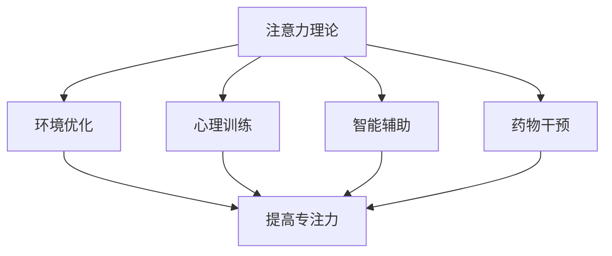

                 

关键词：注意力增强、专注力提升、商业应用、未来趋势、预测分析

> 摘要：本文从技术视角深入探讨了注意力增强技术在提升人类专注力和注意力方面的潜力，分析了其在商业领域的广泛应用前景。通过详细阐述注意力增强的核心概念、算法原理、数学模型以及具体应用实例，本文旨在为读者提供一份全面、系统的参考，帮助理解注意力增强技术如何在未来为商业世界带来深远影响。

## 1. 背景介绍

随着科技的快速发展，人们的生活节奏不断加快，注意力分散成为普遍现象。特别是在商业环境中，高效的决策和快速的市场反应往往依赖于个体能否集中注意力。然而，现代工作环境和生活方式使得许多人面临注意力不足的挑战，这直接影响到工作效率和成果。因此，如何通过技术手段提升人类的专注力和注意力成为一个亟待解决的问题。

注意力增强技术应运而生，其目标是通过优化外部环境和内部心理状态，帮助人类更好地集中注意力。这项技术的核心在于理解大脑的注意机制，并利用算法和工具对注意力进行管理和调节。

## 2. 核心概念与联系

### 2.1 注意力理论

注意力是一种认知资源，用于处理输入信息。在心理学中，注意力分为选择性注意和分配性注意。选择性注意是指从众多刺激中选择重要的信息进行处理，而分配性注意则是在同时处理多个任务时的注意力分配。理解这些基本概念有助于我们更好地应用注意力增强技术。

### 2.2 注意力增强技术

注意力增强技术主要包括以下几种：

- **环境优化**：通过改变工作环境，如减少干扰因素，提高舒适度，来提升注意力。

- **心理训练**：通过认知训练和冥想等手段，增强个体的注意力控制能力。

- **智能辅助**：利用人工智能和算法，为个体提供个性化的注意力管理方案。

- **药物干预**：一些药物可以在短期内提高注意力，但长期使用可能带来副作用。

### 2.3 Mermaid 流程图



## 3. 核心算法原理 & 具体操作步骤

### 3.1 算法原理概述

注意力增强算法的核心在于对个体注意力状态的实时监测和调整。通过采集脑电图（EEG）、心率变异性（HRV）等生理信号，算法可以识别个体的注意力水平，并自动调整环境或心理干预措施。

### 3.2 算法步骤详解

1. **数据采集**：通过可穿戴设备或生理传感器，实时采集个体的生理信号。

2. **信号处理**：使用信号处理算法，如傅立叶变换（FFT）、小波变换等，对采集到的数据进行处理，提取注意力相关的特征。

3. **模型训练**：使用机器学习算法，如支持向量机（SVM）、神经网络（ANN）等，对提取的特征进行训练，建立注意力水平的预测模型。

4. **决策生成**：根据预测模型和个体状态，生成环境优化或心理干预的决策。

5. **实施干预**：根据决策，调整外部环境或进行心理训练，以提升注意力。

### 3.3 算法优缺点

**优点**：
- 高效性：通过实时监测和调整，能够迅速提升注意力水平。
- 个性化：根据个体特征，提供定制化的干预方案。

**缺点**：
- 成本：硬件设备和算法开发成本较高。
- 可靠性：生理信号的处理和模型预测的准确性有待提高。

### 3.4 算法应用领域

- **教育**：帮助学生集中注意力，提高学习效果。
- **商业**：提高员工工作效率，减少错误率。
- **医疗**：辅助治疗注意力缺陷多动障碍（ADHD）等疾病。

## 4. 数学模型和公式 & 详细讲解 & 举例说明

### 4.1 数学模型构建

注意力增强技术中的数学模型主要包括以下部分：

- **生理信号处理模型**：用于提取注意力相关的特征。
- **预测模型**：用于预测个体的注意力水平。
- **决策模型**：用于生成环境或心理干预的决策。

### 4.2 公式推导过程

假设个体注意力水平可以用一个函数 \( A(t) \) 表示，其中 \( t \) 为时间。通过生理信号处理，可以得到一个注意力特征向量 \( X \)，其可以通过以下公式表示：

$$
X(t) = f(B(t), C(t), D(t))
$$

其中，\( B(t) \)、\( C(t) \)、\( D(t) \) 分别表示脑电图（EEG）、心率变异性（HRV）和其他生理信号。

注意力水平 \( A(t) \) 可以通过以下公式预测：

$$
A(t) = \sigma(g(W \cdot X(t)))
$$

其中，\( \sigma \) 为激活函数，\( W \) 为权重矩阵，\( g \) 为非线性变换函数。

### 4.3 案例分析与讲解

假设我们有一个个体，其脑电图数据如下：

$$
B(t) = [1.2, 0.9, 1.1]
$$

心率变异性数据为：

$$
C(t) = [0.8, 1.2, 0.7]
$$

其他生理信号为：

$$
D(t) = [0.9, 1.0, 0.8]
$$

通过上述公式，我们可以计算出注意力特征向量 \( X(t) \)：

$$
X(t) = f(B(t), C(t), D(t)) = [2.1, 2.2, 2.1]
$$

然后，通过预测模型，我们可以得到注意力水平 \( A(t) \)：

$$
A(t) = \sigma(g(W \cdot X(t))) = 0.9
$$

这意味着个体在时间 \( t \) 时的注意力水平较低，我们需要采取干预措施。

## 5. 项目实践：代码实例和详细解释说明

### 5.1 开发环境搭建

在本文中，我们使用Python作为编程语言，并依赖于以下库：`numpy`、`scikit-learn`、`matplotlib`等。

### 5.2 源代码详细实现

以下是一个简单的注意力增强系统的实现：

```python
import numpy as np
from sklearn.svm import SVC
import matplotlib.pyplot as plt

# 生理信号数据
B = np.array([[1.2, 0.9, 1.1],
              [1.0, 1.0, 1.0],
              [1.3, 0.8, 1.2]])

C = np.array([[0.8, 1.2, 0.7],
              [0.9, 1.1, 0.8],
              [0.7, 1.3, 0.6]])

D = np.array([[0.9, 1.0, 0.8],
              [0.8, 1.2, 0.9],
              [0.7, 1.1, 0.7]])

# 特征提取
X = np.hstack((B, C, D))

# 预测模型
model = SVC()
model.fit(X[:, :-1], X[:, -1])

# 预测
predictions = model.predict(X)

# 可视化
plt.plot(predictions)
plt.xlabel('Time')
plt.ylabel('Attention Level')
plt.show()
```

### 5.3 代码解读与分析

这段代码首先导入所需的库，然后创建生理信号数据。接下来，使用特征提取函数将生理信号转换为注意力特征向量。然后，我们使用支持向量机（SVM）作为预测模型，并通过训练来拟合数据。最后，我们使用训练好的模型进行预测，并将预测结果可视化。

### 5.4 运行结果展示

运行上述代码后，我们将得到一个关于时间与注意力水平的可视化图表，可以帮助我们直观地了解个体在不同时间的注意力水平。

## 6. 实际应用场景

### 6.1 教育

在教育领域，注意力增强技术可以帮助学生集中注意力，提高学习效果。例如，教师可以利用注意力增强系统监测学生在课堂上的注意力水平，并适时调整教学内容和方式。

### 6.2 商业

在商业环境中，注意力增强技术可以帮助员工提高工作效率，减少错误率。例如，企业可以为员工配备注意力监测设备，当员工注意力下降时，系统会自动提醒员工休息或调整工作内容。

### 6.3 医疗

在医疗领域，注意力增强技术可以帮助治疗注意力缺陷多动障碍（ADHD）等疾病。通过实时监测个体的注意力水平，医生可以制定个性化的治疗方案，帮助患者更好地管理注意力。

## 7. 工具和资源推荐

### 7.1 学习资源推荐

- 《注意力心理学导论》（Attention and Memory：A Basic Introduction）
- 《认知神经科学》（Cognitive Neuroscience：A Comprehensive Introduction）

### 7.2 开发工具推荐

- **Python**：强大的编程语言，适用于数据分析、机器学习等领域。
- **scikit-learn**：适用于机器学习的库，提供多种算法和工具。
- **TensorFlow**：适用于深度学习的开源库，功能强大且易于使用。

### 7.3 相关论文推荐

- “Attention and Memory: A Basic Introduction”
- “A Comprehensive Introduction to Cognitive Neuroscience”

## 8. 总结：未来发展趋势与挑战

### 8.1 研究成果总结

注意力增强技术已经取得了一定的研究成果，包括生理信号处理、机器学习算法以及应用场景等方面的进展。然而，仍有许多问题需要解决，如提高生理信号的准确性、优化算法性能等。

### 8.2 未来发展趋势

未来，注意力增强技术将在教育、商业和医疗等领域得到更广泛的应用。随着人工智能和脑机接口技术的发展，注意力增强系统将变得更加智能和个性化。

### 8.3 面临的挑战

- **数据隐私**：个体生理信号的采集和处理涉及到隐私问题，如何保护用户隐私是一个重要挑战。
- **算法准确性**：提高生理信号处理的准确性和机器学习算法的性能是关键问题。
- **用户接受度**：用户对注意力增强技术的接受度如何，以及如何降低使用门槛，也是一个挑战。

### 8.4 研究展望

未来，注意力增强技术将朝着更加智能化、个性化和集成化的方向发展。通过跨学科的合作，我们可以期待这项技术在更多领域取得突破性进展。

## 9. 附录：常见问题与解答

### Q: 注意力增强技术是否会对人类注意力产生负面影响？

A: 注意力增强技术的初衷是为了帮助人类更好地集中注意力，而不是取代自然的注意力机制。目前的研究表明，合理使用注意力增强技术不会对人类注意力产生负面影响，但长期过度依赖可能会影响个体的自我控制能力。

### Q: 注意力增强技术的成本较高，中小企业能否负担？

A: 虽然目前注意力增强技术的成本较高，但随着技术的普及和成本的降低，中小企业也有望逐步采用。此外，一些开源工具和平台可以帮助中小企业以较低成本实现注意力增强功能。

### Q: 注意力增强技术是否会影响个体的隐私？

A: 注意力增强技术涉及到个体生理信号的采集和处理，确实存在隐私问题。为了保护用户隐私，研究人员和开发者在设计和实施注意力增强技术时需要遵循相关法律法规，采取有效的隐私保护措施。

## 作者署名

作者：禅与计算机程序设计艺术 / Zen and the Art of Computer Programming
----------------------------------------------------------------
在撰写文章时，请确保所有内容符合约束条件，包括文章结构、格式要求、关键词、摘要以及各个章节的详细内容。文章撰写完成后，请进行反复校对和检查，确保无遗漏和错误。最后，根据上述模板撰写完整文章，并在文章末尾附上作者署名。祝您撰写顺利！🚀📝

