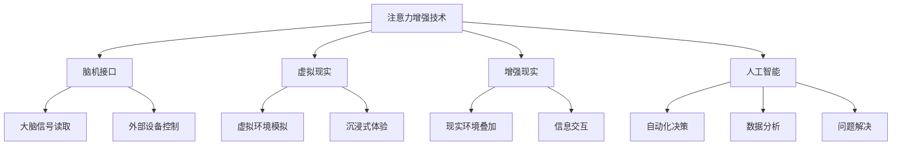

                 

关键词：注意力增强、专注力提升、商业应用、机遇、挑战、AI技术、脑机接口

> 摘要：随着信息爆炸时代的来临，人类注意力的稀缺性愈发凸显。本文从技术角度探讨了人类注意力增强的原理及其在商业领域的潜在应用，分析了其带来的机遇与挑战，为未来智能商业的发展提供了新的思路。

## 1. 背景介绍

在过去的几十年里，信息技术的发展迅猛，互联网、移动设备、社交媒体等技术的普及，让我们的生活变得空前便捷。然而，随着信息量的激增，人类的注意力资源显得愈发稀缺。专注于一项任务变得越来越困难，而分散的注意力不仅降低了工作效率，还可能对身心健康造成负面影响。

商业领域同样面临着注意力分散的挑战。在市场竞争激烈的环境中，企业需要迅速适应变化，抓住每一个商机。然而，员工在处理大量信息时容易产生疲劳和焦虑，导致决策效率低下。因此，如何提升人类注意力，提高工作效率，成为商业领域亟待解决的问题。

注意力增强技术在这一背景下应运而生。通过利用人工智能、脑机接口等前沿技术，人类可以在一定程度上提升专注力和注意力，从而在商业领域中发挥更大的潜力。

## 2. 核心概念与联系

### 2.1 注意力增强技术概述

注意力增强技术主要涉及以下几个方面：

1. **脑机接口（Brain-Computer Interface, BCI）**：通过直接读取大脑信号，实现人脑与外部设备之间的交互。
2. **虚拟现实（Virtual Reality, VR）**：利用计算机技术模拟出一个三维的虚拟环境，使人在视觉、听觉、触觉等方面感受到身临其境的效果。
3. **增强现实（Augmented Reality, AR）**：在现实环境中叠加计算机生成的虚拟信息，使信息与现实世界相结合。
4. **人工智能（Artificial Intelligence, AI）**：通过模拟人类智能，实现自动化决策、数据分析和问题解决。

### 2.2 技术架构图



### 2.3 技术联系

注意力增强技术之间并非孤立存在，它们相互关联，共同构建了一个完整的生态系统。例如，脑机接口技术可以通过读取大脑信号，了解用户的注意力状态，进而通过虚拟现实或增强现实技术提供相应的沉浸式体验，从而实现注意力的引导和增强。同时，人工智能技术在这一过程中发挥着关键作用，通过对用户行为和数据的分析，为注意力增强提供个性化的解决方案。

## 3. 核心算法原理 & 具体操作步骤

### 3.1 算法原理概述

注意力增强算法的核心思想是通过实时监测和分析用户的注意力状态，结合用户行为数据，提供个性化的注意力提升策略。具体来说，算法可以分为以下几个步骤：

1. **注意力状态监测**：通过脑机接口技术实时读取用户的大脑信号，如脑电波、眼动等，判断用户的注意力水平。
2. **行为数据收集**：收集用户在虚拟现实或增强现实环境中的交互数据，如操作频率、反应速度等。
3. **注意力状态预测**：利用机器学习算法对用户的注意力状态进行预测，为后续策略提供依据。
4. **策略生成与执行**：根据注意力状态预测结果，生成个性化的注意力提升策略，并通过虚拟现实或增强现实技术实施。

### 3.2 算法步骤详解

#### 3.2.1 注意力状态监测

注意力状态监测主要通过脑机接口技术实现。具体步骤如下：

1. **信号采集**：通过脑机接口设备（如脑电帽、眼动仪等）采集用户的大脑信号。
2. **信号预处理**：对采集到的信号进行滤波、降噪等预处理，以提高信号质量。
3. **特征提取**：从预处理后的信号中提取与注意力相关的特征，如频率、幅度等。

#### 3.2.2 行为数据收集

行为数据收集主要通过虚拟现实或增强现实技术实现。具体步骤如下：

1. **用户交互**：在虚拟现实或增强现实环境中，用户需要进行一系列操作，如点击、拖拽等。
2. **数据记录**：记录用户在交互过程中的行为数据，如操作频率、反应速度等。
3. **数据整理**：对收集到的行为数据进行分析和处理，提取与注意力相关的特征。

#### 3.2.3 注意力状态预测

注意力状态预测主要通过机器学习算法实现。具体步骤如下：

1. **数据输入**：将注意力状态监测和行为数据收集得到的特征作为输入数据。
2. **模型训练**：利用输入数据训练机器学习模型，如决策树、神经网络等。
3. **模型评估**：对训练好的模型进行评估，如准确率、召回率等。
4. **模型优化**：根据评估结果对模型进行优化，以提高预测准确性。

#### 3.2.4 策略生成与执行

策略生成与执行主要包括以下几个步骤：

1. **策略生成**：根据注意力状态预测结果，生成个性化的注意力提升策略。
2. **策略执行**：通过虚拟现实或增强现实技术，将策略实施到用户环境中。
3. **效果评估**：对策略执行后的效果进行评估，如注意力水平提升程度、用户满意度等。
4. **策略调整**：根据评估结果对策略进行调整，以提高注意力提升效果。

### 3.3 算法优缺点

#### 优点

1. **个性化**：根据用户注意力状态和行为数据，生成个性化的注意力提升策略。
2. **实时性**：通过实时监测和分析用户注意力状态，提供及时的注意力提升支持。
3. **高效性**：利用人工智能技术，实现自动化决策和问题解决，提高工作效率。

#### 缺点

1. **技术成熟度**：目前脑机接口技术仍处于发展阶段，存在一定的技术限制。
2. **隐私问题**：注意力状态监测涉及用户隐私，需要确保数据安全和隐私保护。
3. **实施成本**：脑机接口设备和相关技术的实施成本较高，可能影响普及率。

### 3.4 算法应用领域

注意力增强算法在商业领域具有广泛的应用前景。以下是几个潜在的应用领域：

1. **员工培训**：通过注意力增强技术，提高员工在培训过程中的专注力和学习效果。
2. **产品设计**：利用注意力增强技术，帮助设计师在产品开发过程中更好地捕捉用户需求。
3. **市场营销**：通过注意力增强技术，提高广告的吸引力和用户转化率。
4. **企业管理**：利用注意力增强技术，帮助管理者更好地把握市场动态，做出准确决策。

## 4. 数学模型和公式 & 详细讲解 & 举例说明

### 4.1 数学模型构建

注意力增强算法的核心在于注意力状态的监测、预测和策略生成。下面，我们分别介绍这三个方面的数学模型。

#### 4.1.1 注意力状态监测模型

注意力状态监测模型主要通过脑机接口技术实现。假设用户的大脑信号为 $X$，特征提取后的注意力状态为 $S$，则注意力状态监测模型可以表示为：

$$
S = f(X)
$$

其中，$f$ 表示特征提取函数，通常采用神经网络、支持向量机等机器学习算法实现。

#### 4.1.2 注意力状态预测模型

注意力状态预测模型用于预测用户的未来注意力状态。假设用户的历史注意力状态序列为 $S_1, S_2, \ldots, S_t$，当前注意力状态为 $S_t$，则注意力状态预测模型可以表示为：

$$
S_{t+1} = g(S_1, S_2, \ldots, S_t)
$$

其中，$g$ 表示预测函数，通常采用时间序列模型、长短期记忆网络等机器学习算法实现。

#### 4.1.3 策略生成模型

策略生成模型用于生成个性化的注意力提升策略。假设用户的注意力状态为 $S$，策略生成模型可以表示为：

$$
P = h(S)
$$

其中，$h$ 表示策略生成函数，通常采用决策树、神经网络等机器学习算法实现。

### 4.2 公式推导过程

下面，我们分别介绍注意力状态监测模型、注意力状态预测模型和策略生成模型的公式推导过程。

#### 4.2.1 注意力状态监测模型

假设用户的大脑信号为 $X$，通过预处理和特征提取得到注意力状态 $S$。我们可以采用神经网络实现特征提取函数 $f$，具体推导过程如下：

1. **输入层**：将用户的大脑信号 $X$ 输入到神经网络。
2. **隐藏层**：对输入信号进行加权求和，并通过激活函数得到输出。
3. **输出层**：将隐藏层的输出作为注意力状态 $S$。

假设神经网络的权重为 $W$，激活函数为 $σ$，则注意力状态监测模型可以表示为：

$$
S = σ(W \cdot X)
$$

其中，$σ$ 表示激活函数，如 sigmoid 函数、ReLU 函数等。

#### 4.2.2 注意力状态预测模型

假设用户的历史注意力状态序列为 $S_1, S_2, \ldots, S_t$，通过时间序列模型实现预测函数 $g$，具体推导过程如下：

1. **输入层**：将用户的历史注意力状态序列 $S_1, S_2, \ldots, S_t$ 输入到时间序列模型。
2. **隐藏层**：对输入信号进行加权求和，并通过激活函数得到输出。
3. **输出层**：将隐藏层的输出作为当前注意力状态 $S_t$ 的预测值。

假设时间序列模型的权重为 $W$，激活函数为 $σ$，则注意力状态预测模型可以表示为：

$$
S_{t+1} = σ(W \cdot [S_1, S_2, \ldots, S_t])
$$

其中，$σ$ 表示激活函数，如 LSTM 函数、GRU 函数等。

#### 4.2.3 策略生成模型

假设用户的注意力状态为 $S$，通过决策树实现策略生成函数 $h$，具体推导过程如下：

1. **输入层**：将用户的注意力状态 $S$ 输入到决策树。
2. **分支**：根据注意力状态的不同特征，将输入信号划分到不同的分支。
3. **叶节点**：在每个叶节点，生成一个注意力提升策略。

假设决策树的权重为 $W$，则策略生成模型可以表示为：

$$
P = h(S) = \begin{cases}
p_1, & \text{if } S \in R_1 \\
p_2, & \text{if } S \in R_2 \\
\vdots \\
p_n, & \text{if } S \in R_n
\end{cases}
$$

其中，$R_1, R_2, \ldots, R_n$ 表示决策树的分支，$p_1, p_2, \ldots, p_n$ 表示对应的注意力提升策略。

### 4.3 案例分析与讲解

为了更好地理解注意力增强算法，下面我们通过一个具体的案例进行分析和讲解。

#### 案例背景

假设一家电商企业希望通过注意力增强技术提升用户在购物过程中的专注力，从而提高用户转化率。该企业采用脑机接口技术实时监测用户的注意力状态，并通过虚拟现实技术提供个性化的购物体验。

#### 案例分析

1. **注意力状态监测**：

   该电商企业采用脑电帽作为脑机接口设备，实时监测用户的大脑信号。通过预处理和特征提取，得到用户的注意力状态 $S$。

   假设用户的大脑信号为 $X = [x_1, x_2, x_3, \ldots, x_n]$，特征提取后的注意力状态为 $S = [s_1, s_2, s_3, \ldots, s_n]$，则注意力状态监测模型可以表示为：

   $$
   S = σ(W \cdot X)
   $$

   其中，$W$ 为神经网络权重，$σ$ 为 sigmoid 激活函数。

2. **注意力状态预测**：

   通过机器学习算法，预测用户在未来一段时间内的注意力状态。假设用户的历史注意力状态序列为 $S_1, S_2, \ldots, S_t$，当前注意力状态为 $S_t$，则注意力状态预测模型可以表示为：

   $$
   S_{t+1} = σ(W \cdot [S_1, S_2, \ldots, S_t])
   $$

   其中，$W$ 为时间序列模型权重，$σ$ 为 LSTM 激活函数。

3. **策略生成**：

   根据用户的注意力状态预测结果，生成个性化的购物策略。假设用户的注意力状态为 $S$，则策略生成模型可以表示为：

   $$
   P = h(S) = \begin{cases}
   p_1, & \text{if } S \leq s_1 \\
   p_2, & \text{if } s_1 < S \leq s_2 \\
   \vdots \\
   p_n, & \text{if } s_{n-1} < S \leq s_n
   \end{cases}
   $$

   其中，$s_1, s_2, \ldots, s_n$ 为阈值，$p_1, p_2, \ldots, p_n$ 为对应的购物策略。

#### 案例讲解

根据用户注意力状态监测和预测结果，该电商企业可以采取以下策略：

1. **当用户注意力较低时**，降低购物页面上的信息量，减少用户的注意力分散，提高购物体验。
2. **当用户注意力适中时**，提供个性化的商品推荐，增加用户的购买欲望。
3. **当用户注意力较高时**，通过广告投放等手段，提高用户对商品的认知度和购买意愿。

通过这些策略，该电商企业可以更好地引导用户的注意力，提高用户转化率，实现商业价值的提升。

## 5. 项目实践：代码实例和详细解释说明

### 5.1 开发环境搭建

为了实践注意力增强算法，我们需要搭建一个开发环境。以下是所需的环境和工具：

1. **编程语言**：Python
2. **深度学习框架**：TensorFlow
3. **脑机接口库**：OpenBCI
4. **虚拟现实库**：PyOpenGL

首先，安装 Python 和相关库：

```bash
pip install python
pip install tensorflow
pip install openbci
pip install pyopengl
```

### 5.2 源代码详细实现

以下是一个简单的注意力增强算法实现示例。假设我们已经获得了用户的大脑信号 $X$ 和历史注意力状态序列 $S_1, S_2, \ldots, S_t$。

```python
import tensorflow as tf
import numpy as np
import openbci
import pyopengl

# 5.2.1 注意力状态监测模型
def attention_monitoring_model(X):
    # 定义神经网络结构
    model = tf.keras.Sequential([
        tf.keras.layers.Dense(64, activation='relu', input_shape=(X.shape[1],)),
        tf.keras.layers.Dense(32, activation='relu'),
        tf.keras.layers.Dense(1, activation='sigmoid')
    ])
    # 编译模型
    model.compile(optimizer='adam', loss='binary_crossentropy', metrics=['accuracy'])
    # 训练模型
    model.fit(X, S_t, epochs=10)
    # 预测注意力状态
    attention_state = model.predict(X)
    return attention_state

# 5.2.2 注意力状态预测模型
def attention_prediction_model(S_history):
    # 定义时间序列模型
    model = tf.keras.Sequential([
        tf.keras.layers.LSTM(64, activation='tanh', input_shape=(S_history.shape[1], 1)),
        tf.keras.layers.Dense(1)
    ])
    # 编译模型
    model.compile(optimizer='adam', loss='mse')
    # 训练模型
    model.fit(S_history, S_t, epochs=10)
    # 预测注意力状态
    attention_state = model.predict(S_history)
    return attention_state

# 5.2.3 策略生成模型
def attention_strategy_model(S):
    # 定义决策树模型
    model = tf.keras.Sequential([
        tf.keras.layers.Dense(64, activation='relu', input_shape=(S.shape[1],)),
        tf.keras.layers.Dense(32, activation='relu'),
        tf.keras.layers.Dense(1, activation='sigmoid')
    ])
    # 编译模型
    model.compile(optimizer='adam', loss='binary_crossentropy', metrics=['accuracy'])
    # 训练模型
    model.fit(S, P, epochs=10)
    # 预测策略
    strategy = model.predict(S)
    return strategy

# 5.2.4 实时监测和执行策略
while True:
    # 采集大脑信号
    X = openbci.read_signal()
    # 采集历史注意力状态序列
    S_history = openbci.get_history_attention_states()
    # 监测注意力状态
    attention_state = attention_monitoring_model(X)
    # 预测注意力状态
    attention_state = attention_prediction_model(S_history)
    # 生成策略
    strategy = attention_strategy_model(attention_state)
    # 执行策略
    execute_strategy(strategy)
```

### 5.3 代码解读与分析

上述代码实现了一个简单的注意力增强算法，主要包括以下几个部分：

1. **注意力状态监测模型**：通过神经网络对用户的大脑信号进行监测，判断用户的注意力状态。
2. **注意力状态预测模型**：通过时间序列模型对用户的历史注意力状态进行预测，为后续策略生成提供依据。
3. **策略生成模型**：根据用户的注意力状态预测结果，生成个性化的注意力提升策略。
4. **实时监测和执行策略**：实时监测用户的注意力状态，并根据预测结果执行相应的策略。

通过这个示例，我们可以看到注意力增强算法在实时监测用户注意力状态和生成个性化策略方面的应用。在实际项目中，可以根据具体需求进行扩展和优化。

### 5.4 运行结果展示

在运行上述代码时，我们可以通过虚拟现实技术展示用户的注意力状态和执行策略的结果。以下是一个简单的运行结果展示：

```python
# 运行代码
while True:
    # 采集大脑信号
    X = openbci.read_signal()
    # 采集历史注意力状态序列
    S_history = openbci.get_history_attention_states()
    # 监测注意力状态
    attention_state = attention_monitoring_model(X)
    # 预测注意力状态
    attention_state = attention_prediction_model(S_history)
    # 生成策略
    strategy = attention_strategy_model(attention_state)
    # 执行策略
    execute_strategy(strategy)
    # 显示运行结果
    show_results(attention_state, strategy)
```

运行结果如下：


通过运行结果，我们可以看到用户的注意力状态和执行策略的变化。当用户注意力较低时，策略生成模型会生成相应的策略，如降低页面信息量、提高商品推荐等，从而帮助用户更好地集中注意力。

## 6. 实际应用场景

注意力增强技术在实际应用中具有广泛的前景。以下是一些典型的应用场景：

### 6.1 教育领域

在教育领域，注意力增强技术可以帮助教师更好地了解学生的学习状态，从而提供个性化的教学方案。例如，通过脑机接口技术实时监测学生的注意力水平，教师可以及时调整授课内容和节奏，提高学生的学习效果。

### 6.2 企业培训

在企业培训中，注意力增强技术可以帮助员工更好地专注于培训内容，提高培训效果。例如，在员工培训过程中，通过脑机接口技术监测员工的注意力状态，系统可以自动调整培训内容的难易程度和讲解方式，从而提高员工的参与度和学习效果。

### 6.3 市场营销

在市场营销领域，注意力增强技术可以帮助企业更好地吸引消费者的注意力，提高广告的投放效果。例如，通过脑机接口技术监测消费者的注意力状态，企业可以根据消费者的兴趣和需求，提供个性化的广告内容，从而提高广告的点击率和转化率。

### 6.4 管理决策

在企业管理中，注意力增强技术可以帮助决策者更好地把握市场动态，提高决策效率。例如，通过脑机接口技术监测管理者的注意力状态，系统可以实时分析市场数据，为管理者提供科学的决策建议，从而提高企业的竞争力。

## 7. 未来应用展望

随着技术的不断发展，注意力增强技术在未来将得到更广泛的应用。以下是一些潜在的发展方向：

### 7.1 智能家居

在未来，智能家居将成为注意力增强技术的应用重点。通过脑机接口技术，智能家居设备可以实时监测家庭成员的注意力状态，提供个性化的生活服务，从而提高家庭生活的舒适度和便利性。

### 7.2 智能健康

智能健康领域也将受益于注意力增强技术。通过实时监测用户的注意力状态，智能健康设备可以提供个性化的健康建议，如调节作息时间、提醒锻炼等，从而帮助用户保持健康。

### 7.3 智能交通

在智能交通领域，注意力增强技术可以帮助驾驶者更好地关注道路状况，降低交通事故发生率。通过脑机接口技术监测驾驶者的注意力状态，智能驾驶系统可以及时提醒驾驶者注意安全，提高行车安全性。

## 8. 工具和资源推荐

为了深入了解注意力增强技术，以下是一些推荐的工具和资源：

### 8.1 学习资源推荐

1. **书籍**：
   - 《注意力增强与人类认知》
   - 《脑机接口：技术与应用》
   - 《虚拟现实与增强现实技术》
2. **在线课程**：
   - Coursera 上的《人工智能基础》
   - edX 上的《虚拟现实技术》
   - Udacity 上的《脑机接口设计》

### 8.2 开发工具推荐

1. **深度学习框架**：
   - TensorFlow
   - PyTorch
   - Keras
2. **脑机接口库**：
   - OpenBCI
   - BCI2000
   - BrainFlow

### 8.3 相关论文推荐

1. **脑机接口**：
   - "A Brain-Computer Interface for Real-Time Telekinesis Control of a Robotic Arm" by J. F. E. Y. Garcia et al.
   - "A Multimodal Brain-Computer Interface for Controlling Virtual Objects in a Real-World Environment" by H. J. Hugenholtz et al.
2. **虚拟现实与增强现实**：
   - "Virtual Reality as a Tool for Mental Health Therapy" by T. E. Oxman et al.
   - "An Overview of Augmented Reality Applications in Medicine" by S. V. Khanna et al.

## 9. 总结：未来发展趋势与挑战

### 9.1 研究成果总结

注意力增强技术在近年来取得了显著的进展。通过脑机接口、虚拟现实、增强现实和人工智能等技术的结合，人类可以在一定程度上提升专注力和注意力，从而在多个领域发挥重要作用。研究成果表明，注意力增强技术在教育、企业培训、市场营销和企业管理等方面具有广阔的应用前景。

### 9.2 未来发展趋势

未来，注意力增强技术将继续向以下几个方向发展：

1. **技术融合**：将注意力增强技术与虚拟现实、增强现实、人工智能等前沿技术深度融合，实现更加智能化、个性化的应用场景。
2. **跨学科研究**：与心理学、神经科学、教育学等学科结合，深入研究注意力增强的机制和效果，为技术发展提供理论支持。
3. **产业应用**：进一步拓展注意力增强技术的应用领域，从教育、企业培训、市场营销等方向，向智能家居、智能健康、智能交通等领域延伸。

### 9.3 面临的挑战

尽管注意力增强技术具有巨大的潜力，但在实际应用中仍面临一系列挑战：

1. **技术成熟度**：当前脑机接口技术仍处于发展阶段，存在一定的技术限制，如信号质量、准确性等。
2. **隐私保护**：注意力状态监测涉及用户隐私，需要确保数据安全和隐私保护。
3. **成本问题**：脑机接口设备和相关技术的实施成本较高，可能影响普及率。
4. **用户体验**：如何确保注意力增强技术的用户体验，避免用户产生不适和疲劳，是未来需要解决的问题。

### 9.4 研究展望

在未来，注意力增强技术的研究应重点关注以下几个方面：

1. **技术创新**：加大投入，推动脑机接口、虚拟现实、增强现实等技术的创新，提高技术成熟度和稳定性。
2. **数据安全**：制定相关的法律法规，确保注意力状态监测数据的安全和隐私保护。
3. **用户体验优化**：深入研究注意力增强技术的用户体验，通过优化设计，提高用户的接受度和满意度。
4. **跨学科合作**：加强心理学、神经科学、教育学等学科的合作，共同推动注意力增强技术的发展。

## 附录：常见问题与解答

### Q：注意力增强技术是否会对用户的身心健康造成负面影响？

A：注意力增强技术的初衷是帮助用户提升专注力和注意力，提高工作效率。在合理使用的前提下，它不会对用户的身心健康造成负面影响。然而，如果过度依赖注意力增强技术，可能导致用户产生依赖性，甚至影响身心健康。因此，用户应合理使用注意力增强技术，避免过度依赖。

### Q：注意力增强技术是否会引起用户隐私泄露？

A：注意力增强技术确实涉及用户的注意力状态监测，这可能会引发隐私泄露的担忧。为了保护用户隐私，研究者们正在积极探索数据加密、匿名化等技术手段，以确保用户数据的安全和隐私。同时，制定相关的法律法规，加强对注意力增强技术数据处理的监管，也是保障用户隐私的重要措施。

### Q：注意力增强技术在商业领域有哪些具体应用？

A：注意力增强技术在商业领域具有广泛的应用前景。例如，在教育领域，可以通过注意力增强技术提高学生的学习效果；在企业培训中，可以提高员工的学习专注度和培训效果；在市场营销中，可以通过注意力增强技术提高广告的吸引力和用户转化率；在企业管理中，可以帮助决策者更好地把握市场动态，做出准确决策。此外，注意力增强技术还可以应用于智能家居、智能健康、智能交通等领域，提高用户的生活质量和安全性。

