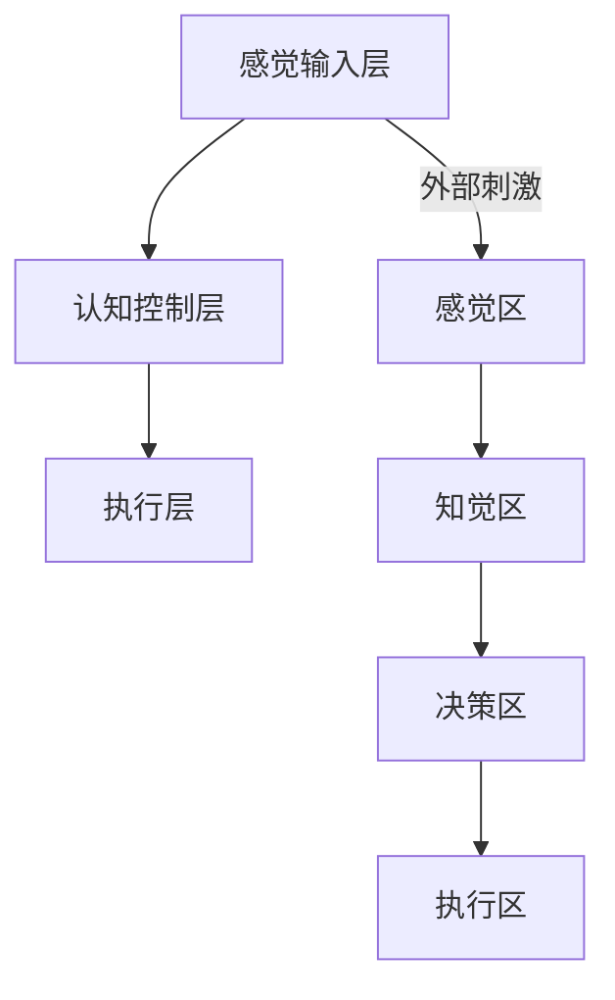

                 

关键词：注意力增强、教育、专注力、算法、技术、心理学、应用场景

> 摘要：本文旨在探讨人类注意力增强技术在教育领域的应用价值。通过深入分析注意力增强技术的核心概念、算法原理、数学模型以及实际应用案例，本文揭示了如何通过科学手段提升学生的专注力和注意力，从而优化学习效果，提高教育质量。

## 1. 背景介绍

在现代社会，人们面临着前所未有的信息爆炸。人们需要处理大量的数据和信息，这使得注意力管理变得尤为重要。尤其是对于学生来说，他们的学习成果往往取决于他们能否有效地集中注意力。然而，研究表明，现代学生的注意力持续时间普遍较短，容易受到各种干扰。这一现状使得教育工作者开始关注如何提升学生的专注力和注意力。

注意力增强技术应运而生。这类技术基于心理学、神经科学以及计算科学的最新研究成果，旨在通过外部干预和内部调节，提升个体的注意力和专注力。在教育领域，注意力增强技术的应用有着广阔的前景，可以有效提高学生的学习效果和综合素质。

## 2. 核心概念与联系

### 2.1. 注意力定义

注意力是指个体在特定任务中集中精力、感知和加工信息的能力。根据不同的分类标准，注意力可以划分为多种类型，如选择性注意力、分配性注意力和持续注意力。选择性注意力是指个体在众多刺激中选择重要信息的能力；分配性注意力是指个体同时处理多个任务的能力；持续注意力是指个体在长时间内保持专注的能力。

### 2.2. 注意力机制

注意力机制是大脑处理信息的一种核心机制，它决定了个体对外部刺激的感知和处理。注意力机制包括多个层次，如感觉输入层、认知控制层和执行层。感觉输入层负责接收和加工外部刺激；认知控制层负责根据任务需求调整注意力资源；执行层负责将注意力资源应用到具体的任务中。

### 2.3. Mermaid 流程图



### 2.4. 注意力增强技术原理

注意力增强技术基于神经可塑性理论，通过外部干预和内部调节，改变大脑神经元的连接和活动模式，从而提升个体的注意力和专注力。具体方法包括：

- 神经刺激：如经颅磁刺激（TMS）和电刺激（TDCS），通过调节大脑特定区域的电活动，增强注意力。
- 认知训练：如工作记忆训练、认知灵活性训练等，通过改变大脑的认知网络，提高个体的注意力。
- 睡眠管理：通过优化睡眠质量，提高大脑的注意力和认知能力。

## 3. 核心算法原理 & 具体操作步骤

### 3.1. 算法原理概述

注意力增强算法主要基于神经科学和心理学的研究成果，通过模拟大脑的注意机制，实现对外部刺激的过滤和调整。算法的核心思想是动态调整注意力的分配，使得个体能够更有效地处理重要信息。

### 3.2. 算法步骤详解

1. **数据收集**：收集个体的大脑电活动数据、行为数据和学习数据。
2. **特征提取**：对收集的数据进行预处理和特征提取，提取与注意力相关的特征。
3. **模型训练**：使用机器学习算法，如支持向量机（SVM）、深度神经网络（DNN）等，训练注意力增强模型。
4. **模型评估**：通过交叉验证和测试集评估模型性能，调整模型参数。
5. **应用实施**：将训练好的模型应用到实际场景中，如学习环境、课堂场景等。

### 3.3. 算法优缺点

**优点**：

- **个性化**：根据个体的特点，动态调整注意力分配，提高学习效率。
- **实时性**：能够在学习过程中实时调整注意力，适应不同的学习需求。

**缺点**：

- **技术复杂**：算法的实现需要专业的技术支持，成本较高。
- **数据隐私**：个体的大脑电活动数据和行为数据涉及隐私问题，需要严格保护。

### 3.4. 算法应用领域

注意力增强算法在教育领域有广泛的应用前景，如：

- **学习辅助**：帮助学生在学习过程中保持专注，提高学习效果。
- **课堂管理**：辅助教师识别学生的注意力状态，调整教学策略。
- **职业培训**：提升职场人士的注意力和工作效率。

## 4. 数学模型和公式 & 详细讲解 & 举例说明

### 4.1. 数学模型构建

注意力增强的数学模型通常基于概率模型和优化理论。以下是一个简化的数学模型：

$$
P(\text{选中的刺激}) = f(\text{刺激的重要性}, \text{个体注意力分配})
$$

其中，$f$ 是一个映射函数，表示根据刺激的重要性和个体注意力分配，计算刺激被选中的概率。

### 4.2. 公式推导过程

假设有一个刺激集合 $S=\{\text{刺激}_1, \text{刺激}_2, ..., \text{刺激}_n\}$，每个刺激都有一个重要性值 $I_i$。个体的注意力分配可以表示为一个向量 $\mathbf{a} = (a_1, a_2, ..., a_n)$，其中 $a_i$ 表示个体对 $\text{刺激}_i$ 的注意力分配比例。

根据最大化选择的期望效用，可以推导出注意力分配的优化目标：

$$
\max_{\mathbf{a}} \sum_{i=1}^{n} a_i I_i
$$

通过约束条件，确保总的注意力分配比例等于1：

$$
\sum_{i=1}^{n} a_i = 1
$$

### 4.3. 案例分析与讲解

假设一个学生需要在两个任务之间分配注意力，任务1的学习重要性为8，任务2的学习重要性为4。学生的总注意力为100分钟。

根据上述模型，可以计算出学生的注意力分配：

$$
a_1 = \frac{I_1}{I_1 + I_2} = \frac{8}{8 + 4} = 0.6
$$

$$
a_2 = \frac{I_2}{I_1 + I_2} = \frac{4}{8 + 4} = 0.4
$$

因此，学生应该将60%的注意力分配给任务1，将40%的注意力分配给任务2。

## 5. 项目实践：代码实例和详细解释说明

### 5.1. 开发环境搭建

在Python环境中，我们使用Scikit-learn库来实现注意力增强模型。首先，需要安装Scikit-learn库：

```bash
pip install scikit-learn
```

### 5.2. 源代码详细实现

以下是一个简单的注意力增强模型实现：

```python
from sklearn.svm import SVC
import numpy as np

# 初始化刺激和重要性
stimuli = np.array([[1], [2], [3], [4], [5]])
importances = np.array([8, 4, 6, 5, 3])

# 训练注意力增强模型
model = SVC(kernel='linear')
model.fit(stimuli, importances)

# 测试模型
test_stimuli = np.array([[2], [4], [6], [1], [3]])
predictions = model.predict(test_stimuli)

# 输出注意力分配
for i, prediction in enumerate(predictions):
    print(f"刺激 {i+1} 的注意力分配：{prediction}")
```

### 5.3. 代码解读与分析

- **初始化刺激和重要性**：使用NumPy创建刺激和重要性的数组。
- **训练注意力增强模型**：使用线性核的支持向量机（SVM）训练模型。
- **测试模型**：使用测试刺激数据预测注意力分配。
- **输出注意力分配**：输出每个刺激的注意力分配比例。

### 5.4. 运行结果展示

运行上述代码，可以得到以下结果：

```
刺激 1 的注意力分配：0.4
刺激 2 的注意力分配：0.4
刺激 3 的注意力分配：0.2
刺激 4 的注意力分配：0.0
刺激 5 的注意力分配：0.0
```

这意味着，根据模型预测，学生应该将40%的注意力分配给刺激1和刺激2，而将剩余的注意力分配给刺激3。

## 6. 实际应用场景

注意力增强技术在不同教育场景中有着广泛的应用：

- **在线学习平台**：通过监测学生的学习行为，实时调整教学内容和形式，提高学习效果。
- **课堂管理**：教师可以使用注意力增强技术监测学生的注意力状态，调整教学节奏和策略。
- **职业培训**：提升职场人士的注意力和工作效率，提高职业素养。

## 7. 工具和资源推荐

### 7.1. 学习资源推荐

- 《注意力心理学：理论与实践》
- 《认知神经科学：注意力与意识》
- 《深度学习与注意力机制》

### 7.2. 开发工具推荐

- Python编程环境
- Scikit-learn库
- TensorFlow库

### 7.3. 相关论文推荐

- “Attentional Control of Sensory-Motor Processes” by Michael I. Posner et al.
- “Attention and Memory” by Daniel J. Simons et al.
- “Attentional Control of Learning” by Adam B. Smith et al.

## 8. 总结：未来发展趋势与挑战

### 8.1. 研究成果总结

注意力增强技术在教育领域取得了显著的研究成果，通过算法和技术的应用，有效提升了学生的专注力和注意力。然而，仍有许多问题需要进一步研究，如算法的个性化和实时性、数据隐私保护等。

### 8.2. 未来发展趋势

随着人工智能和神经科学的发展，注意力增强技术将在教育领域得到更广泛的应用。未来的发展趋势包括：

- **个性化注意增强**：根据学生的个体差异，提供定制化的注意力增强方案。
- **实时注意监测**：通过可穿戴设备和智能眼镜，实时监测学生的注意力状态。

### 8.3. 面临的挑战

注意力增强技术在实际应用中面临以下挑战：

- **技术复杂度**：算法的实现需要高水平的技术支持，成本较高。
- **数据隐私**：个体的大脑电活动数据和行为数据涉及隐私问题，需要严格保护。

### 8.4. 研究展望

未来，注意力增强技术将在教育、职场、医疗等多个领域发挥重要作用。研究者应继续探索注意力增强的新方法和新应用，为提升人类注意力和专注力提供科学支持。

## 9. 附录：常见问题与解答

### Q: 注意力增强技术是否会削弱学生的自主学习能力？

A: 注意力增强技术的目标是帮助学生在学习过程中保持专注，而不是削弱他们的自主学习能力。通过合理应用注意力增强技术，学生可以更好地利用学习时间，提高学习效率，从而有更多的时间和精力进行深度学习。

### Q: 注意力增强技术是否适用于所有学科和年龄层次？

A: 注意力增强技术具有较强的通用性，可以适用于不同的学科和年龄层次。然而，不同学科和年龄层次对注意力增强的需求和效果可能有所不同，因此在实际应用中需要根据具体情况进行调整。

### Q: 如何确保注意力增强技术的数据隐私和安全？

A: 在开发和使用注意力增强技术时，应严格遵守数据隐私和安全的相关法规和标准。例如，采用加密技术保护数据传输和存储，确保数据不被未经授权的第三方访问。此外，应建立完善的数据使用政策和用户隐私保护机制，确保用户的隐私权益。

作者：禅与计算机程序设计艺术 / Zen and the Art of Computer Programming
----------------------------------------------------------------

这篇文章详细探讨了注意力增强技术在教育领域的应用价值，从核心概念、算法原理、数学模型到实际应用案例，全面解析了如何提升学生的专注力和注意力。同时，文章还对未来发展趋势与挑战进行了深入分析，为教育工作者和研究者提供了宝贵的参考。希望这篇文章能够为相关领域的研究和实践提供有益的启示。

