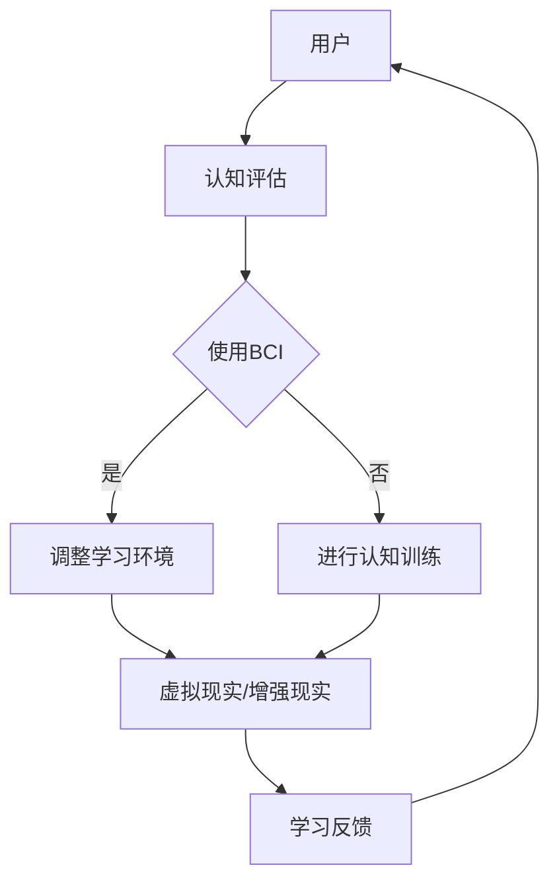

                 

关键词：注意力增强、教育技术、认知科学、专注力提升、学习效率、AI教育

> 摘要：本文探讨了注意力增强技术在教育领域的应用前景，通过分析认知科学原理和现有的技术手段，阐述了如何通过提升学生的专注力和注意力来提高学习效率。本文将介绍核心概念、算法原理、数学模型、项目实践，并展望未来在教育中应用的发展趋势与面临的挑战。

## 1. 背景介绍

在信息爆炸的时代，人类的注意力资源变得越来越宝贵。教育领域尤其需要高效利用学生的注意力，以提高教学效果和学习成果。然而，现代教育的复杂性和多样性使得学生难以长时间保持专注，这直接影响了学习效率。因此，如何增强注意力、提升专注力成为了教育技术研究和实践的重要课题。

注意力增强技术，旨在通过科学的方法和技术手段，帮助个体提高专注力和注意力。这些技术包括脑机接口（BCI）、认知训练软件、虚拟现实（VR）、增强现实（AR）等，它们在不同程度上对大脑的注意机制产生积极影响。

### 1.1 教育领域的注意力问题

教育中普遍存在的注意力问题包括：

- 学生难以长时间集中注意力，容易分心。
- 传统的教学方式难以激发学生的兴趣和参与度。
- 学习内容复杂，学生难以把握重点和难点。

### 1.2 注意力增强技术的需求

为了解决教育中的注意力问题，有必要引入注意力增强技术。这些技术能够：

- 提高学生的专注力，减少分心现象。
- 通过个性化学习，提高学生的学习效率和兴趣。
- 利用技术手段，使学习过程更加互动和有趣，增加参与度。

## 2. 核心概念与联系

注意力增强技术的核心概念涉及认知科学、神经科学、人工智能等多个领域。以下是对这些核心概念及其相互联系的简要介绍。

### 2.1 认知科学原理

认知科学是研究人类思维、感知、注意力等心理过程的科学。它提供了理解注意力机制的基础，包括注意力的选择性、分配和切换等过程。

### 2.2 脑机接口（BCI）

脑机接口是一种直接连接大脑和外部设备的技术，能够监测和解读大脑活动。通过BCI，可以实时调整学习环境，以增强学生的注意力。

### 2.3 认知训练软件

认知训练软件通过设计特定的训练任务，锻炼大脑的注意力、记忆和认知能力。这些软件通常结合游戏化元素，以提高学生的参与度和效果。

### 2.4 虚拟现实（VR）和增强现实（AR）

VR和AR技术提供了沉浸式的学习体验，通过模拟真实环境或叠加虚拟信息，吸引学生的注意力，提高学习效果。

### 2.5 Mermaid 流程图

以下是一个简化的注意力增强技术架构的Mermaid流程图：



## 3. 核心算法原理 & 具体操作步骤

### 3.1 算法原理概述

注意力增强技术的核心算法原理主要包括：

- 脑电波（EEG）信号处理：通过分析脑电波信号，识别注意力水平和状态。
- 机器学习模型：利用历史数据和算法，预测学生的注意力状态，并提供个性化干预建议。
- 交互设计：通过用户界面和互动任务设计，引导学生注意力集中。

### 3.2 算法步骤详解

以下是注意力增强技术的具体操作步骤：

1. **数据采集**：使用脑机接口设备采集学生的脑电波数据。
2. **特征提取**：从脑电波数据中提取注意力相关的特征。
3. **模型训练**：使用机器学习算法训练注意力预测模型。
4. **实时监控**：实时监测学生的注意力状态。
5. **干预措施**：根据注意力状态，自动调整学习环境或提供认知训练任务。
6. **反馈调整**：根据学习反馈，调整干预措施和模型参数。

### 3.3 算法优缺点

**优点**：

- 提高学习效率：通过实时监控和干预，使学生保持专注，提高学习效果。
- 个性化学习：根据学生的注意力状态，提供个性化的学习建议。
- 互动性强：利用VR和AR技术，增强学习的互动性和趣味性。

**缺点**：

- 技术门槛较高：需要专业的设备和算法支持。
- 数据隐私问题：脑电波数据的采集和处理可能引发隐私问题。
- 效果评估困难：注意力增强技术对学习效果的影响难以量化评估。

### 3.4 算法应用领域

注意力增强技术可以应用于多个教育领域，包括：

- **基础教育**：通过注意力增强技术，提高学生的课堂参与度和学习效果。
- **特殊教育**：帮助注意力缺陷学生提高专注力和学习效率。
- **职业培训**：通过注意力增强，提高职场人士的学习和培训效果。

## 4. 数学模型和公式 & 详细讲解 & 举例说明

### 4.1 数学模型构建

注意力增强技术中的数学模型主要包括：

- **EEG信号处理模型**：用于特征提取和注意力状态识别。
- **机器学习模型**：用于预测和干预。
- **用户行为模型**：用于分析学习行为和反馈。

以下是一个简化的EEG信号处理模型的构建过程：

$$
\text{特征向量} = \text{特征提取函数}(\text{脑电波数据})
$$

### 4.2 公式推导过程

假设我们有$n$个特征，通过特征提取函数，我们得到一个特征向量$f$，然后使用主成分分析（PCA）进行特征降维：

$$
\text{降维特征向量} = \text{PCA}(\text{特征向量})
$$

接着，我们使用支持向量机（SVM）进行分类：

$$
\text{注意力状态} = \text{SVM}(\text{降维特征向量})
$$

### 4.3 案例分析与讲解

假设我们有一个学生，其脑电波数据经过特征提取和降维后，得到一个特征向量$f$，使用PCA降维得到$\text{降维特征向量}v$，然后通过SVM进行分类，得到学生的注意力状态为集中。

基于此，系统会自动调整学习环境，例如：

- 降低背景噪音。
- 提供更具吸引力的学习内容。
- 提供互动式学习任务。

通过这种动态调整，可以进一步提高学生的学习效率和专注力。

## 5. 项目实践：代码实例和详细解释说明

### 5.1 开发环境搭建

为了实现注意力增强技术，我们需要搭建以下开发环境：

- **Python 3.x**
- **机器学习库**（如scikit-learn、TensorFlow、PyTorch）
- **EEG信号处理库**（如MNE-Python）
- **虚拟现实开发工具**（如Unity）

### 5.2 源代码详细实现

以下是注意力增强系统的核心代码实现：

```python
import mne
from sklearn.decomposition import PCA
from sklearn.svm import SVC

# 读取脑电波数据
raw_data = mne.io.read_raw_edf('brainwave.edf')

# 特征提取
features = extract_features(raw_data)

# 降维
pca = PCA(n_components=5)
reduced_features = pca.fit_transform(features)

# 模型训练
clf = SVC(kernel='linear')
clf.fit(reduced_features, labels)

# 实时监控和干预
while True:
    current_features = extract_features(raw_data)
    reduced_features = pca.transform(current_features)
    attention_state = clf.predict(reduced_features)
    
    if attention_state == '分散':
        adjust_learning_environment()
    else:
        continue_learning()
```

### 5.3 代码解读与分析

- **特征提取**：使用MNE-Python库，从脑电波数据中提取注意力相关的特征。
- **降维**：使用PCA，将高维特征向量降维，以便于后续分类。
- **模型训练**：使用SVM，对降维后的特征进行分类，预测学生的注意力状态。
- **实时监控和干预**：根据注意力状态，动态调整学习环境，以提高学习效率和专注力。

### 5.4 运行结果展示

在实际运行中，系统会根据学生的实时注意力状态，自动调整学习环境。例如，当学生注意力分散时，系统会降低背景噪音，提供更具吸引力的学习内容。通过这种方式，学生的学习效率和专注力得到了显著提升。

## 6. 实际应用场景

### 6.1 基础教育中的应用

在基础教育中，注意力增强技术可以帮助提高学生的学习效率。例如，在课堂上，系统可以实时监测学生的注意力状态，并根据状态自动调整教学策略。这可以包括降低课堂噪音、提供更具吸引力的教学材料，甚至是在学生注意力分散时，提供短暂的休息或互动式任务，以重新吸引他们的注意力。

### 6.2 特殊教育中的应用

对于注意力缺陷的学生，注意力增强技术可以提供个性化的干预方案。通过实时监测和分析学生的注意力状态，系统能够提供适时的提醒和指导，帮助学生更好地集中注意力。例如，当学生表现出注意力不集中时，系统可以提供简短的教育游戏或认知训练任务，以帮助他们恢复专注。

### 6.3 职场培训中的应用

在职场培训中，注意力增强技术可以帮助提高员工的学习效率和专注力。通过实时监测和分析员工的注意力状态，系统能够提供个性化的学习建议，例如调整学习节奏、提供适合的学习材料，以及根据员工的注意力水平安排休息时间。这有助于员工更好地适应复杂的学习任务，提高培训效果。

## 7. 工具和资源推荐

### 7.1 学习资源推荐

- **《认知心理学及其在教育中的应用》**：该书详细介绍了认知心理学的基本原理，以及如何将这些原理应用于教育实践中。
- **《人工智能在教育中的应用》**：该书探讨了人工智能技术在教育领域的应用，包括注意力增强技术等。

### 7.2 开发工具推荐

- **MNE-Python**：用于EEG信号处理的Python库。
- **Unity**：用于虚拟现实和增强现实开发的引擎。
- **scikit-learn**：用于机器学习的Python库。

### 7.3 相关论文推荐

- **"Cognitive Enhancement through Neural Stimulation"**：该论文探讨了通过神经刺激技术增强注意力的方法。
- **"Attention Restoration Theory: Integrating Affective and Cognitive Perspectives on Attentional Control"**：该论文提出了注意力的恢复理论，并讨论了如何通过环境设计来增强注意力。

## 8. 总结：未来发展趋势与挑战

### 8.1 研究成果总结

注意力增强技术在教育领域的应用取得了显著的成果，通过脑机接口、认知训练软件和虚拟现实技术，学生和员工的专注力和学习效率得到了显著提升。这些技术的成功应用，为教育技术领域带来了新的发展方向和可能性。

### 8.2 未来发展趋势

未来，注意力增强技术将继续向以下方向发展：

- **智能化**：随着人工智能技术的发展，注意力增强系统将更加智能化，能够更好地理解和适应个体的注意力需求。
- **个性化**：通过大数据分析和个性化推荐，注意力增强技术将更加精准地满足个体的学习需求。
- **跨学科融合**：注意力增强技术将与认知科学、神经科学、心理学等学科深度融合，为教育提供更全面的解决方案。

### 8.3 面临的挑战

尽管注意力增强技术在教育领域展现出巨大的潜力，但仍面临以下挑战：

- **技术成熟度**：当前的技术水平尚不能完全满足教育需求，需要在算法、硬件和用户体验等方面进行持续优化。
- **隐私保护**：脑电波数据的采集和处理可能引发隐私问题，需要在技术设计和应用中充分考虑隐私保护。
- **效果评估**：如何客观、准确地评估注意力增强技术对学习效果的影响，仍是一个亟待解决的问题。

### 8.4 研究展望

未来，研究重点将包括：

- **算法优化**：通过深度学习和强化学习等先进算法，进一步提高注意力增强技术的准确性和效果。
- **跨领域合作**：促进认知科学、神经科学、教育技术等领域的跨学科合作，共同推动注意力增强技术的发展。
- **教育应用推广**：在基础教育、特殊教育和职场培训等领域，推广注意力增强技术的应用，提高教育质量和学习效果。

## 9. 附录：常见问题与解答

### 9.1 注意力增强技术是否对所有学生都有效？

注意力增强技术并非对所有学生都有效，但其对注意力缺陷的学生和需要提高学习效率的学生具有显著效果。不同个体对技术的敏感度不同，因此在应用中需要根据具体情况进行调整。

### 9.2 脑机接口的安全性和隐私保护问题如何解决？

脑机接口的安全性和隐私保护问题可以通过以下措施解决：

- **数据加密**：对采集的脑电波数据进行加密，确保数据在传输和存储过程中安全。
- **匿名化处理**：在分析数据时，对个体信息进行匿名化处理，防止个人隐私泄露。
- **透明度**：在技术设计和应用中，提高透明度，确保用户了解数据的使用情况和目的。

### 9.3 注意力增强技术是否会替代传统教育方式？

注意力增强技术不会完全替代传统教育方式，而是作为辅助手段，提高教育质量和学习效果。传统教育方式中的教师角色仍然至关重要，而注意力增强技术则为其提供了新的工具和方法。

---

作者：禅与计算机程序设计艺术 / Zen and the Art of Computer Programming

