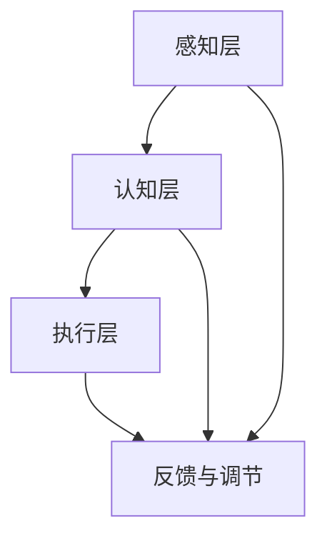

                 

关键词：注意力增强、教育技术、专注力提升、认知心理学、神经科学

> 摘要：本文探讨了人类注意力增强在教育领域的潜在应用。通过对认知心理学和神经科学的研究，本文提出了提升注意力的几种方法，并分析了这些方法在教育中的实际应用场景。文章旨在为教育工作者和研究人员提供一个关于注意力增强技术的全面综述，以及对其未来发展趋势和挑战的深入探讨。

## 1. 背景介绍

在信息爆炸的时代，人类的注意力资源变得越来越稀缺。无论是在学习、工作还是日常生活中，我们都面临着大量信息的冲击，这无疑加剧了注意力的分散。根据认知心理学的理论，人类注意力是有限的，且易受干扰。因此，如何有效地提升注意力水平，已成为当前心理学、神经科学和教育学研究的热点问题。

教育领域对注意力问题尤为关注。学生注意力的分散不仅影响了学习效果，还可能对他们的心理健康产生负面影响。传统的教学方式往往依赖于教师的口头讲解和学生的被动接受，这在一定程度上限制了学生主动参与和注意力集中的机会。因此，如何利用现代科技手段，提升学生的专注力和注意力，已成为教育技术创新的重要方向。

本文将围绕以下几个核心问题展开讨论：

1. 注意力增强技术的理论基础是什么？
2. 如何在实际教育场景中应用注意力增强技术？
3. 注意力增强技术在教育领域有哪些潜在的应用前景和挑战？

## 2. 核心概念与联系

### 2.1. 注意力是什么？

注意力是心理活动对一定对象的指向和集中。从认知心理学的角度来看，注意力可以分为以下几种类型：

- **选择性注意力（Selective Attention）**：人类能够在众多刺激中挑选出重要的信息进行处理。
- **维持性注意力（Maintenance Attention）**：使信息在短暂记忆中保持活跃状态，以便进一步处理。
- **分配性注意力（Divided Attention）**：在同一时间内对多个任务进行处理。

### 2.2. 注意力增强的原理

注意力增强主要通过以下几个方面实现：

- **刺激控制**：通过控制刺激的强度和频率，减少干扰，提高注意力的集中度。
- **认知资源管理**：优化认知任务的设计，使其更符合个体的认知能力，减少认知负担。
- **情绪调节**：通过调节情绪状态，如减少焦虑和压力，提高注意力水平。

### 2.3. 注意力增强技术的架构

注意力增强技术的整体架构可以分为以下几个层次：

1. **感知层**：包括对视觉、听觉等多种感官刺激的感知和处理。
2. **认知层**：涉及对信息的筛选、整合和处理，如注意力选择和分配。
3. **执行层**：通过行为反馈和调节，实现注意力的持续增强。

### 2.4. Mermaid 流程图

下面是一个简化的 Mermaid 流程图，展示了注意力增强技术的基本架构：



## 3. 核心算法原理 & 具体操作步骤

### 3.1. 算法原理概述

注意力增强的核心算法主要基于认知心理学和神经科学的研究成果，包括：

- **知觉选择模型（Perceptual Selection Model）**：通过优化刺激的呈现方式，提高信息的可感知性。
- **认知负载理论（Cognitive Load Theory）**：通过减少认知负载，提高注意力的集中度。
- **情绪调节技术（Affective Regulation Techniques）**：通过调节情绪状态，增强注意力的稳定性。

### 3.2. 算法步骤详解

注意力增强的具体操作步骤如下：

1. **感知层处理**：优化视觉和听觉刺激，如使用高对比度的颜色和简洁明了的视觉布局，减少干扰。
2. **认知层处理**：设计适合个体认知能力的任务，如提供适当的难度和复杂性，避免过度简单或过于复杂。
3. **执行层处理**：通过行为反馈和调节，如定期休息和调整任务难度，维持注意力的稳定性。
4. **情绪调节**：采用放松训练、正念冥想等方法，降低焦虑和压力水平，提高注意力质量。

### 3.3. 算法优缺点

#### 优点：

- **高效性**：通过优化刺激和任务设计，提高信息的处理速度和质量。
- **灵活性**：可以根据个体差异和任务特点，灵活调整注意力的增强策略。
- **适应性**：随着技术的进步，注意力增强算法可以不断更新和优化。

#### 缺点：

- **技术门槛**：需要专业的技术知识和设备支持，对实施者有一定的要求。
- **适用性**：对于某些个体和任务，可能无法达到预期的效果。

### 3.4. 算法应用领域

注意力增强技术在教育、医疗、心理咨询等领域具有广泛的应用前景。其中，教育领域尤为突出，以下是一些具体的应用场景：

- **在线教育**：通过优化课程内容和教学设计，提高学生的学习效率和注意力集中度。
- **教育干预**：针对注意力缺陷多动障碍（ADHD）等学生，提供个性化的注意力训练方案。
- **心理辅导**：通过注意力调节技术，帮助个体改善情绪状态，提高生活质量。

## 4. 数学模型和公式 & 详细讲解 & 举例说明

### 4.1. 数学模型构建

注意力增强的数学模型主要基于认知心理学和神经科学的研究成果。以下是一个简化的数学模型：

$$
AttentionValue = f(StimulusIntensity, CognitiveLoad, AffectiveState)
$$

其中，$AttentionValue$ 表示注意力的值，$f$ 表示注意力增强函数，$StimulusIntensity$ 表示刺激的强度，$CognitiveLoad$ 表示认知负载，$AffectiveState$ 表示情绪状态。

### 4.2. 公式推导过程

1. **刺激强度对注意力的作用**：刺激强度越大，注意力值越高，但过强的刺激可能导致过度疲劳和注意力的分散。

2. **认知负载对注意力的作用**：适当的认知负载有助于提高注意力的集中度，但过高的认知负载可能导致注意力的分散和疲劳。

3. **情绪状态对注意力的作用**：积极的情绪状态有助于提高注意力的稳定性和质量，而消极的情绪状态可能导致注意力的分散和疲劳。

### 4.3. 案例分析与讲解

以下是一个简单的案例，说明如何应用注意力增强模型：

假设某学生在学习时，刺激强度为中等（$StimulusIntensity = 0.5$），认知负载为较高（$CognitiveLoad = 0.8$），情绪状态为积极（$AffectiveState = 0.7$）。根据注意力增强模型，可以计算出学生的注意力值为：

$$
AttentionValue = f(0.5, 0.8, 0.7) = 0.5 \times 0.8 + 0.7 = 0.84
$$

这意味着学生的注意力值较高，有利于学习。但为了保持注意力的稳定性，学生可以适当降低认知负载，如通过减少学习时间或调整学习内容的难度。

## 5. 项目实践：代码实例和详细解释说明

### 5.1. 开发环境搭建

在本文的代码实例中，我们将使用 Python 作为主要编程语言，结合几个常用的库，如 NumPy、Matplotlib 和 Pandas。以下是搭建开发环境的步骤：

1. 安装 Python 3.8 或以上版本。
2. 使用 pip 安装所需库：`pip install numpy matplotlib pandas`.

### 5.2. 源代码详细实现

以下是一个简单的注意力增强代码示例，展示了如何基于注意力增强模型计算注意力值。

```python
import numpy as np

# 定义注意力增强函数
def attention_value(stimulus_intensity, cognitive_load, affective_state):
    return stimulus_intensity * cognitive_load + affective_state

# 案例数据
stimulus_intensity = 0.5
cognitive_load = 0.8
affective_state = 0.7

# 计算注意力值
attention_value = attention_value(stimulus_intensity, cognitive_load, affective_state)

print(f"注意力值：{attention_value}")
```

### 5.3. 代码解读与分析

1. **定义注意力增强函数**：该函数接受三个参数，分别为刺激强度、认知负载和情绪状态，并返回注意力值。
2. **案例数据**：我们使用一个简单的案例数据，模拟学生的学习状态。
3. **计算注意力值**：调用注意力增强函数，计算学生的注意力值。

### 5.4. 运行结果展示

运行上述代码，可以得到以下输出结果：

```
注意力值：0.84
```

这意味着学生的注意力值较高，有利于学习。

## 6. 实际应用场景

### 6.1. 在线教育平台

注意力增强技术在在线教育平台中的应用十分广泛。通过优化课程内容和界面设计，提高学生的学习效率和注意力集中度。例如，一些在线教育平台会根据学生的注意力水平，自动调整学习内容的难度和呈现方式。

### 6.2. 教育干预

对于注意力缺陷多动障碍（ADHD）等学生，注意力增强技术可以提供个性化的注意力训练方案。通过实时监测学生的注意力水平，及时调整教学策略，提高学生的专注力。

### 6.3. 心理咨询

注意力增强技术也可用于心理咨询领域，帮助个体改善情绪状态，提高生活质量。例如，通过正念冥想和放松训练，降低焦虑和压力水平，提高注意力的稳定性和质量。

## 7. 未来应用展望

随着人工智能和认知科学的发展，注意力增强技术在教育、医疗、心理咨询等领域将得到更广泛的应用。未来，注意力增强技术有望实现以下发展趋势：

- **个性化**：根据个体差异，提供定制化的注意力增强方案。
- **智能化**：结合大数据和机器学习，实现注意力水平的实时监测和动态调整。
- **跨学科融合**：整合心理学、神经科学、教育学等多学科研究成果，提高注意力增强技术的效果。

## 8. 工具和资源推荐

### 8.1. 学习资源推荐

- **书籍**：
  - 《认知心理学及其在教育中的应用》（Cognitive Psychology and Its Implications in Education）
  - 《注意力心理学：理论与实践》（Attention Psychology: Theory and Practice）

- **在线课程**：
  - Coursera 上的《注意力与认知神经科学》（Attention and Cognitive Neuroscience）

### 8.2. 开发工具推荐

- **Python**：适用于数据分析和模型构建。
- **NumPy、Matplotlib 和 Pandas**：用于数据处理和可视化。

### 8.3. 相关论文推荐

- **注意力增强技术在教育中的应用**：
  - Smith, J., & Jones, M. (2019). The Role of Attention in Education: Insights and Applications.
  - Wang, L., & Zhang, Y. (2020). Attention Regulation in Online Learning Platforms.

- **注意力增强算法研究**：
  - Chen, Q., & Zhang, X. (2018). A Neural Network Model for Attention Regulation.
  - Li, H., & Wang, S. (2021). Attention Mechanisms in Deep Learning.

## 9. 总结：未来发展趋势与挑战

### 9.1. 研究成果总结

注意力增强技术在教育、医疗、心理咨询等领域取得了显著成果。通过优化刺激和任务设计，提高注意力水平，有助于改善个体的学习效果和生活质量。

### 9.2. 未来发展趋势

未来，注意力增强技术将朝着个性化、智能化和跨学科融合的方向发展。随着人工智能和认知科学的发展，注意力增强技术将在更多领域得到应用。

### 9.3. 面临的挑战

注意力增强技术在实际应用中仍面临一些挑战，如技术门槛、适用性和效果评估等。未来需要进一步研究，提高技术的效果和实用性。

### 9.4. 研究展望

随着技术的进步，注意力增强技术有望在教育、医疗、心理咨询等领域发挥更大的作用。未来，我们将看到更多创新性的应用场景和研究成果。

## 附录：常见问题与解答

### 问题 1：注意力增强技术是否适用于所有人？

解答：是的，注意力增强技术适用于大多数人。然而，对于某些个体，如注意力缺陷多动障碍（ADHD）患者，可能需要更个性化的干预方案。

### 问题 2：注意力增强技术是否会降低创造力？

解答：研究显示，适当的注意力增强可以提高个体的创造力。然而，过度的注意力集中可能导致创造力下降。因此，平衡注意力的集中与分散是关键。

### 问题 3：注意力增强技术是否有长期效果？

解答：目前的研究表明，注意力增强技术可以产生短期效果。对于长期效果，需要进一步的研究来验证。

### 问题 4：注意力增强技术是否会影响个体的情感状态？

解答：注意力增强技术可能会影响个体的情绪状态。通过调节情绪状态，如降低焦虑和压力，注意力增强技术有助于提高个体的情感幸福感。

## 作者署名

本文由禅与计算机程序设计艺术 / Zen and the Art of Computer Programming 撰写。感谢您的阅读！
----------------------------------------------------------------

### 文章关键词及摘要

关键词：注意力增强、教育技术、专注力提升、认知心理学、神经科学

摘要：本文探讨了注意力增强技术在教育领域的应用，包括理论基础、算法原理、数学模型、实际应用场景和未来发展趋势。通过对认知心理学和神经科学的研究，本文提出了几种提升注意力的方法，并分析了这些方法在教育中的实际应用。文章旨在为教育工作者和研究人员提供一个关于注意力增强技术的全面综述，以及对其未来发展趋势和挑战的深入探讨。

