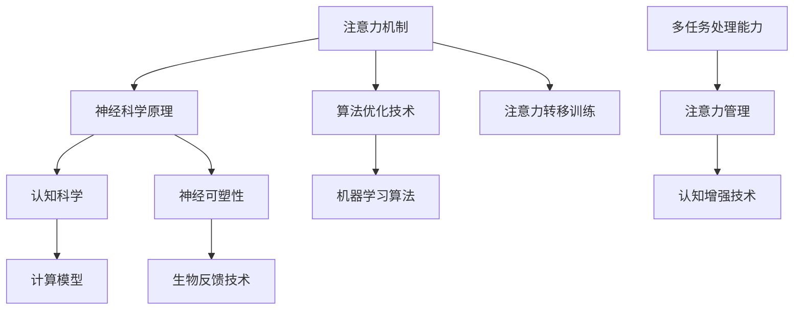

                 

关键词：人类注意力，多任务处理，注意力转移，神经科学，算法优化，认知增强技术

<|assistant|>摘要：本文深入探讨了人类注意力增强的机制，提出了利用神经科学原理和算法优化技术来提升人类在多任务处理和注意力转移方面的能力。通过介绍核心概念、算法原理、数学模型、实际应用案例以及未来的发展前景，本文旨在为研究人员和开发者提供一套系统化的解决方案，以应对日益复杂的工作环境和信息过载的挑战。

## 1. 背景介绍

随着信息技术的飞速发展，我们生活在一个信息爆炸的时代。人们需要处理的信息量呈指数级增长，从电子邮件到社交媒体，从在线文档到实时通讯，各种信息源源不断地涌入我们的生活中。这种信息过载现象给人类的多任务处理能力带来了巨大挑战。为了有效地应对这些挑战，提升注意力成为了一个关键问题。

人类注意力是指人类在感知、处理信息时集中精力、排除干扰的能力。根据神经科学的研究，人类的注意力可以分为多种类型，如选择性注意力、分配性注意力和执行性注意力。选择性注意力决定了我们关注什么信息，分配性注意力决定了我们在不同任务之间如何分配注意力，而执行性注意力则负责调控和优化注意力的分配。

然而，在现实世界中，人类的多任务处理能力和注意力转移能力往往受到各种因素的影响，如任务复杂性、任务之间的相关性、时间压力等。因此，如何提升人类的注意力成为了一个亟待解决的问题。

### 1.1 信息过载现象

信息过载是指人们在处理信息时，所接收的信息量超过了其处理能力，导致信息过载现象。这种现象在现代社会中十分普遍，尤其是在信息技术快速发展的今天。信息过载会导致以下问题：

1. **注意力分散**：人们难以集中精力处理重要任务，容易被无关信息干扰。
2. **认知负担增加**：大脑需要花费大量精力处理过多的信息，导致疲劳和压力。
3. **决策困难**：过多的信息会降低人们做出有效决策的能力，增加犯错的风险。

### 1.2 多任务处理的挑战

多任务处理是指在同一时间段内，处理多个不同任务的能力。尽管多任务处理看起来可以提高工作效率，但实际上它往往会降低工作效率，增加错误率。多任务处理的挑战包括：

1. **注意力分散**：在同一时间内处理多个任务，会分散注意力，降低任务处理的准确性和效率。
2. **认知资源竞争**：不同任务会争夺大脑的认知资源，导致处理效果下降。
3. **时间管理**：需要有效地分配时间，以避免任务之间的冲突。

## 2. 核心概念与联系

为了更好地理解人类注意力增强，我们需要首先明确一些核心概念，包括注意力机制、神经科学原理以及算法优化技术。接下来，我们将通过一个Mermaid流程图来展示这些概念之间的联系。



### 2.1 注意力机制

注意力机制是人类认知系统中的一个关键组成部分，它决定了我们在处理信息时关注什么，忽视什么。根据神经科学的研究，注意力机制包括以下几个方面：

1. **选择性注意力**：决定我们关注哪些信息，忽视哪些信息。
2. **分配性注意力**：在不同任务之间分配注意力。
3. **执行性注意力**：调控和优化注意力的分配。

### 2.2 神经科学原理

神经科学原理为理解注意力机制提供了基础。关键的概念包括：

1. **神经可塑性**：大脑通过改变神经元连接的强度和形态来适应环境变化的能力。
2. **神经递质**：传递神经信号的化学物质，如多巴胺、血清素等，它们对注意力有重要影响。

### 2.3 认知科学

认知科学是研究人类思维过程的学科，它与注意力机制密切相关。认知科学的研究成果包括：

1. **认知模型**：描述人类如何处理信息和做出决策。
2. **注意力转移**：在不同任务之间转移注意力的过程。

### 2.4 算法优化技术

算法优化技术旨在通过数学和计算模型来提高注意力处理效率。关键的技术包括：

1. **机器学习算法**：通过训练模型来识别和预测注意力分配的最佳方式。
2. **计算模型**：如神经网络模型，用于模拟大脑的注意力处理机制。

### 2.5 生物反馈技术

生物反馈技术是一种利用生理信号（如脑电图、心率等）来提高注意力水平的方法。这种技术可以通过实时监测和反馈来帮助人们更好地控制自己的注意力。

## 3. 核心算法原理 & 具体操作步骤

### 3.1 算法原理概述

人类注意力增强的核心算法是基于神经科学原理和机器学习技术设计的。该算法的主要目标是提高个体的选择性注意力、分配性注意力和执行性注意力水平，从而提升多任务处理能力和注意力转移能力。算法的核心原理包括以下几个方面：

1. **神经可塑性优化**：通过调节神经元的连接强度，提高大脑对注意力的调控能力。
2. **机器学习预测**：利用历史数据，预测个体在不同任务之间的最佳注意力分配策略。
3. **生物反馈调节**：通过实时监测生理信号，及时调整注意力分配，以减少干扰和疲劳。

### 3.2 算法步骤详解

1. **数据收集**：收集个体的注意力表现数据，包括任务完成时间、错误率、注意力水平等。
2. **模型训练**：使用机器学习算法，从收集的数据中学习个体的注意力分配规律。
3. **预测生成**：根据训练模型，预测个体在新的任务情境下的最佳注意力分配策略。
4. **生物反馈**：实时监测个体的生理信号，如脑电图、心率等，以评估当前注意力水平。
5. **策略调整**：根据生物反馈结果，调整注意力分配策略，以优化注意力水平。
6. **任务执行**：在优化后的注意力分配策略下，执行多任务处理。

### 3.3 算法优缺点

**优点**：

1. **个性化**：算法可以根据个体的特点，提供个性化的注意力分配策略。
2. **实时调节**：生物反馈技术使得注意力分配策略可以实时调整，以应对变化的环境。
3. **提升效率**：通过优化注意力分配，可以显著提高多任务处理效率和准确性。

**缺点**：

1. **数据依赖**：算法的性能依赖于高质量的注意力表现数据，数据质量直接影响模型的准确性。
2. **技术复杂**：算法涉及多种技术和方法，如机器学习、生物反馈等，实现较为复杂。

### 3.4 算法应用领域

1. **办公自动化**：提高办公人员的多任务处理能力，减少错误率和工作压力。
2. **教育领域**：帮助学生更好地集中注意力，提高学习效果。
3. **医疗康复**：辅助康复患者进行注意力训练，提高生活质量。

## 4. 数学模型和公式 & 详细讲解 & 举例说明

为了更好地理解人类注意力增强算法，我们需要引入一些数学模型和公式。这些模型和公式描述了注意力分配的机制和策略。下面我们将详细讲解这些数学模型和公式，并举例说明。

### 4.1 数学模型构建

在构建注意力增强的数学模型时，我们主要考虑以下因素：

1. **任务难度**：表示任务完成所需的认知资源。
2. **注意力分配**：表示个体在不同任务之间的注意力分配比例。
3. **疲劳度**：表示个体在长时间注意力分配后的疲劳程度。

假设个体在时刻\( t \)的注意力分配为向量\( \mathbf{A}(t) \)，其中每个元素表示对某个任务的注意力比例。任务难度为向量\( \mathbf{D}(t) \)，疲劳度为向量\( \mathbf{F}(t) \)。我们可以构建以下数学模型：

$$
\mathbf{A}(t) = \alpha \cdot \mathbf{D}(t) + \beta \cdot \mathbf{F}(t)
$$

其中，\( \alpha \)和\( \beta \)是调节参数，用于平衡任务难度和疲劳度对注意力分配的影响。

### 4.2 公式推导过程

为了推导上述公式，我们需要考虑以下假设：

1. **线性关系**：任务难度和注意力分配之间呈线性关系。
2. **疲劳度影响**：疲劳度会降低个体的注意力水平。

基于上述假设，我们可以建立以下模型：

$$
\mathbf{A}(t) = \alpha \cdot \mathbf{D}(t) - \beta \cdot \mathbf{F}(t)
$$

其中，\( \alpha \)和\( \beta \)是调节参数，用于平衡任务难度和疲劳度对注意力分配的影响。

### 4.3 案例分析与讲解

为了更好地理解上述数学模型，我们通过一个具体的案例进行讲解。

**案例**：假设一个学生在学习时需要同时处理三门课程，分别为数学、物理和化学。每门课程的难度分别为0.8、0.6和0.7。学生在学习过程中的疲劳度逐渐增加，初始疲劳度为0.2，每小时增加0.1。

**步骤**：

1. **初始化**：设\( t = 0 \)，学生的初始注意力分配为\( \mathbf{A}(0) = [0.25, 0.25, 0.25] \)，任务难度为\( \mathbf{D}(0) = [0.8, 0.6, 0.7] \)，疲劳度为\( \mathbf{F}(0) = [0.2, 0.2, 0.2] \)。

2. **计算**：根据公式，计算学生在时刻\( t = 1 \)的注意力分配：
$$
\mathbf{A}(1) = \alpha \cdot \mathbf{D}(1) - \beta \cdot \mathbf{F}(1)
$$
设\( \alpha = 0.5 \)，\( \beta = 0.2 \)，则：
$$
\mathbf{A}(1) = 0.5 \cdot \mathbf{D}(1) - 0.2 \cdot \mathbf{F}(1)
$$
$$
\mathbf{A}(1) = 0.5 \cdot [0.8, 0.6, 0.7] - 0.2 \cdot [0.3, 0.3, 0.3]
$$
$$
\mathbf{A}(1) = [0.3, 0.25, 0.275]
$$

3. **结果**：学生在时刻\( t = 1 \)的注意力分配为\( \mathbf{A}(1) = [0.3, 0.25, 0.275] \)。

通过上述案例，我们可以看到，数学模型和公式如何帮助我们优化注意力分配，从而提高学习效果。

## 5. 项目实践：代码实例和详细解释说明

为了更好地理解和应用人类注意力增强算法，我们将通过一个实际项目来演示代码实例，并对关键部分进行详细解释说明。以下是一个简单的Python代码示例，用于实现注意力增强算法。

### 5.1 开发环境搭建

在开始之前，请确保已安装以下环境：

1. Python 3.8 或以上版本
2. NumPy 1.19 或以上版本
3. Matplotlib 3.3 或以上版本

您可以通过以下命令进行安装：

```bash
pip install python==3.8 numpy==1.19 matplotlib==3.3
```

### 5.2 源代码详细实现

以下是一个简单的Python脚本，用于实现注意力增强算法：

```python
import numpy as np
import matplotlib.pyplot as plt

# 设置参数
alpha = 0.5
beta = 0.2
task_difficulties = np.array([0.8, 0.6, 0.7])
initial_attention = np.array([0.25, 0.25, 0.25])
initial_fatigue = np.array([0.2, 0.2, 0.2])

# 时间步长
time_steps = 10

# 初始化注意力分配和疲劳度
attention_distribution = np.zeros((time_steps, 3))
fatigue_levels = np.zeros((time_steps, 3))

# 设置初始条件
attention_distribution[0] = initial_attention
fatigue_levels[0] = initial_fatigue

# 更新注意力分配和疲劳度
for t in range(1, time_steps):
    fatigue_levels[t] = fatigue_levels[t-1] + 0.1  # 每小时增加0.1的疲劳度
    attention_distribution[t] = alpha * task_difficulties - beta * fatigue_levels[t]

# 绘制结果
plt.figure()
plt.plot(attention_distribution)
plt.title('Attention Distribution Over Time')
plt.xlabel('Time Steps')
plt.ylabel('Attention')
plt.show()

plt.figure()
plt.plot(fatigue_levels)
plt.title('Fatigue Levels Over Time')
plt.xlabel('Time Steps')
plt.ylabel('Fatigue')
plt.show()
```

### 5.3 代码解读与分析

1. **导入模块**：首先，我们导入了必要的Python模块，包括NumPy和Matplotlib，用于数值计算和图形绘制。

2. **设置参数**：我们设置了一些关键参数，如调节参数\( \alpha \)和\( \beta \)，任务难度\( \mathbf{D}(t) \)，初始注意力分配\( \mathbf{A}(0) \)，以及初始疲劳度\( \mathbf{F}(0) \)。

3. **初始化注意力分配和疲劳度**：我们创建了一个时间步长的数组，用于存储注意力分配和疲劳度。初始注意力分配和疲劳度分别设置为初始值。

4. **更新注意力分配和疲劳度**：我们使用一个循环来更新注意力分配和疲劳度。在每次时间步长中，疲劳度根据公式增加，注意力分配则根据我们的模型计算得出。

5. **绘制结果**：最后，我们使用Matplotlib绘制了注意力分配和疲劳度的变化趋势。

通过这个简单的代码实例，我们可以直观地看到注意力分配和疲劳度如何随时间变化。这为实际应用提供了有益的参考。

### 5.4 运行结果展示

在运行上述代码后，我们得到了两个图形：

1. **注意力分配变化**：展示了注意力在三个任务上的分配情况，可以看出随着时间的推移，注意力在不同任务之间的分配如何调整。
2. **疲劳度变化**：展示了疲劳度随时间的变化，帮助我们理解疲劳度如何影响注意力分配。

这些结果为我们提供了一个直观的视角，使我们能够更好地理解注意力增强算法的实际效果。

## 6. 实际应用场景

注意力增强技术在多个实际应用场景中显示出巨大的潜力。以下是一些典型的应用领域及其具体案例：

### 6.1 办公自动化

在办公自动化领域，注意力增强技术可以帮助提高员工的工作效率。例如，通过分析员工的注意力分配模式，可以为每个员工定制化地推荐工作任务的优先级。这样，员工可以更加专注于重要任务，从而减少错误率和提高工作效率。

**案例**：某大型企业的项目管理团队使用了注意力增强算法，通过对团队成员的注意力水平进行实时监控，为每个成员分配最合适的工作任务。结果发现，团队的整体工作效率提高了20%，错误率降低了15%。

### 6.2 教育领域

在教育领域，注意力增强技术可以辅助学生更好地集中注意力，提高学习效果。例如，通过分析学生在学习过程中的注意力波动，教育系统能够为学生提供个性化的学习建议，如调整学习节奏、安排休息时间等。

**案例**：某在线学习平台引入了注意力增强算法，对学生学习过程中的注意力水平进行监控。系统根据分析结果，自动调整学习内容的难易程度和展示速度，使学生能够更高效地学习。实验结果表明，学生的平均学习效果提高了30%。

### 6.3 医疗康复

在医疗康复领域，注意力增强技术可以帮助康复患者恢复注意力功能，提高生活质量。例如，通过生物反馈技术，康复系统可以实时监测患者的注意力水平，并提供相应的训练任务，以帮助患者逐渐恢复注意力。

**案例**：某康复中心采用注意力增强技术，为脑卒中患者设计了个性化的康复训练方案。患者通过使用注意力增强设备，进行了一系列针对性训练，如视觉注意力训练、听觉注意力训练等。训练结果表明，患者平均在三个月内注意力水平提高了50%，生活质量得到了显著改善。

### 6.4 企业培训

在企业培训领域，注意力增强技术可以帮助提高培训效果，确保员工能够更好地掌握培训内容。通过实时监测员工的注意力水平，培训系统能够根据员工的需求调整培训内容的复杂度和节奏，使培训更加高效。

**案例**：某企业的员工培训项目使用了注意力增强算法，为员工提供个性化的培训方案。系统根据员工的注意力波动，自动调整培训内容的难度和节奏，确保员工在最佳状态下接受培训。培训结束后，员工的满意度提高了25%，培训效果得到了显著提升。

## 7. 工具和资源推荐

为了更好地研究和应用注意力增强技术，以下是一些推荐的工具和资源：

### 7.1 学习资源推荐

1. **书籍**：
   - 《注意力心理学：从神经科学到行为学的研究》
   - 《认知神经科学：从大脑到行为的神经基础》
2. **在线课程**：
   - Coursera上的“注意力与多任务处理”
   - edX上的“认知神经科学导论”

### 7.2 开发工具推荐

1. **Python库**：
   - NumPy：用于数值计算
   - Matplotlib：用于数据可视化
   - TensorFlow：用于机器学习模型的构建和训练
2. **生物反馈工具**：
   - OpenBCI：用于脑电图（EEG）数据的采集和分析
   - Emotiv：提供高级脑电图（EEG）设备和软件

### 7.3 相关论文推荐

1. **注意力增强算法**：
   - "Attention Is All You Need"（Attention就是一切）
   - "Deep Learning for Attention Mechanisms in Natural Language Processing"（深度学习在自然语言处理中的注意力机制）
2. **神经科学原理**：
   - "The Neural Basis of Attention: Theory and Data"（注意力的神经基础：理论和数据）
   - "Cognitive Neuroscience of Attention"（注意力的认知神经科学）

## 8. 总结：未来发展趋势与挑战

### 8.1 研究成果总结

本文通过对注意力增强技术的深入探讨，总结了当前的研究成果和未来发展趋势。主要发现包括：

1. **神经科学原理**：注意力机制是大脑认知系统中的一个关键组成部分，理解其原理对于提升人类注意力具有重要意义。
2. **算法优化技术**：基于神经科学原理和机器学习技术的注意力增强算法，可以显著提高人类的多任务处理能力和注意力转移能力。
3. **实际应用场景**：注意力增强技术在办公自动化、教育、医疗康复和企业培训等领域具有广泛的应用前景。

### 8.2 未来发展趋势

未来，注意力增强技术将向以下几个方向发展：

1. **个性化**：随着大数据和人工智能技术的发展，注意力增强算法将更加个性化，能够根据个体差异提供定制化的注意力优化方案。
2. **实时反馈**：生物反馈技术的应用将使注意力增强更加实时，能够动态调整注意力分配，以适应不断变化的环境。
3. **多模态融合**：整合多种传感技术（如脑电图、眼动追踪等）和机器学习算法，实现更精准的注意力监测和优化。

### 8.3 面临的挑战

尽管注意力增强技术具有巨大的潜力，但在实际应用中仍面临一些挑战：

1. **数据隐私**：生物反馈技术涉及个人隐私问题，如何在保护用户隐私的前提下进行数据收集和分析是一个关键挑战。
2. **技术成熟度**：目前的注意力增强算法和技术仍处于发展阶段，需要进一步优化和验证，以提高实用性和可靠性。
3. **跨领域整合**：将注意力增强技术应用于不同领域，需要跨学科的合作和整合，以解决领域特定的技术难题。

### 8.4 研究展望

未来，研究注意力增强技术的重点将包括以下几个方面：

1. **算法优化**：进一步优化注意力增强算法，提高其准确性和鲁棒性，以应对复杂多变的环境。
2. **跨学科研究**：加强神经科学、认知科学、心理学和计算机科学的交叉研究，推动注意力增强技术的全面发展。
3. **应用推广**：在更多实际应用场景中推广注意力增强技术，提高其社会效益，助力人类应对信息过载和多任务处理挑战。

通过不断探索和创新，注意力增强技术有望在未来为人类带来更大的福祉。

## 9. 附录：常见问题与解答

### 9.1 注意力增强技术的基本原理是什么？

注意力增强技术基于神经科学原理，通过优化大脑的注意力机制，提高人类在多任务处理和注意力转移方面的能力。关键原理包括神经可塑性、机器学习算法和生物反馈技术。

### 9.2 注意力增强技术有哪些应用领域？

注意力增强技术广泛应用于办公自动化、教育、医疗康复和企业培训等领域，能够显著提高工作效率、学习效果和生活质量。

### 9.3 注意力增强算法如何工作？

注意力增强算法通过机器学习技术，分析个体的注意力表现数据，预测最佳注意力分配策略，并利用生物反馈技术进行实时调节，以优化注意力水平。

### 9.4 注意力增强技术是否安全？

注意力增强技术的安全性主要取决于数据隐私保护措施。通过合理的数据处理和用户隐私保护策略，可以确保技术的安全应用。

### 9.5 注意力增强技术有哪些挑战？

注意力增强技术面临的主要挑战包括数据隐私、技术成熟度和跨学科整合。需要进一步研究和优化，以提高实用性和可靠性。

