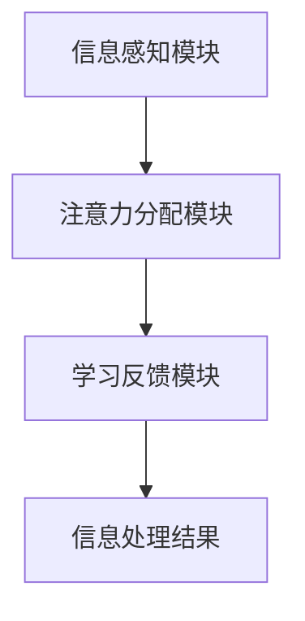

                 

关键词：注意力增强、学习效率、知识保留、神经网络、算法优化、心理学原理、应用场景、未来展望

> 摘要：本文将探讨如何通过注意力增强技术，提升人类在学习过程中的效率和知识保留能力。我们将介绍注意力增强的核心概念，相关算法原理，并结合实际应用场景进行分析。同时，我们还将探讨未来这一领域的发展趋势与挑战。

## 1. 背景介绍

在当今信息爆炸的时代，人们需要处理的信息量不断增加。与此同时，学习的复杂性和难度也在提高。因此，如何有效地提升学习效率和知识保留能力成为了亟需解决的问题。注意力增强技术，作为一种新兴的方法，旨在通过提高个体对关键信息的关注和筛选能力，来提升学习效果。

注意力增强的概念最早可以追溯到心理学领域。20世纪50年代，心理学家乔治·米勒（George A. Miller）提出了“注意力分配”（Attentional Allocation）理论，强调了注意力在信息处理中的关键作用。近年来，随着人工智能和神经科学的发展，注意力增强技术得到了广泛关注和应用。

本文将首先介绍注意力增强的核心概念和原理，然后探讨其在学习中的应用。接下来，我们将分析注意力增强算法的优缺点，并介绍其在实际应用中的具体案例。最后，我们将探讨注意力增强技术的未来发展趋势与面临的挑战。

## 2. 核心概念与联系

### 2.1 注意力增强的定义

注意力增强（Attention Augmentation）是指通过特定的方法和算法，提高个体在信息处理过程中的注意力集中程度，从而提升学习效果和知识保留能力。在心理学中，注意力是指个体对特定刺激的感知和反应能力，是信息处理的基础。

### 2.2 注意力增强的原理

注意力增强的原理主要基于以下两个方面：

1. **选择性关注**：通过筛选和过滤无关信息，使个体将注意力集中在关键信息上。
2. **强化学习**：利用强化学习算法，根据个体的学习效果调整注意力的分配。

### 2.3 注意力增强的架构

注意力增强的架构通常包括以下几个部分：

1. **信息感知模块**：负责收集和感知外部信息。
2. **注意力分配模块**：根据信息的重要性和个体需求，分配注意力资源。
3. **学习反馈模块**：根据学习效果调整注意力分配策略。

### 2.4 注意力增强与神经网络的联系

注意力增强技术在神经网络中得到了广泛应用。例如，在深度学习中的卷积神经网络（CNN）和循环神经网络（RNN）中，注意力机制被用于提高模型的表示能力和处理能力。通过引入注意力机制，神经网络可以自动学习到不同信息的重要性，从而提升模型的性能。

### 2.5 注意力增强的 Mermaid 流程图



## 3. 核心算法原理 & 具体操作步骤

### 3.1 算法原理概述

注意力增强算法的核心原理是通过对输入信息进行筛选和权重分配，使个体能够更有效地处理和利用关键信息。具体来说，算法包括以下几个步骤：

1. **信息感知**：接收外部输入信息。
2. **注意力分配**：根据信息的重要性和个体需求，分配注意力权重。
3. **信息处理**：利用注意力权重对信息进行处理和加工。
4. **反馈调整**：根据处理结果调整注意力分配策略。

### 3.2 算法步骤详解

1. **信息感知**：
   - **输入信息**：接收外部输入，如文本、图像、音频等。
   - **预处理**：对输入信息进行预处理，如去噪、降维等。

2. **注意力分配**：
   - **重要性评估**：对输入信息进行重要性评估，如使用机器学习算法计算信息的重要性分数。
   - **权重分配**：根据重要性分数，对信息进行权重分配，如使用 softmax 函数计算权重。

3. **信息处理**：
   - **注意力加权**：根据权重对信息进行处理和加工，如使用加权平均或加权求和。
   - **信息融合**：将注意力加权后的信息进行融合，如使用卷积或循环操作。

4. **反馈调整**：
   - **效果评估**：评估信息处理结果的效果，如使用指标或评估函数。
   - **策略调整**：根据效果评估结果，调整注意力分配策略，如使用强化学习算法。

### 3.3 算法优缺点

**优点**：
1. **高效性**：通过注意力增强，个体可以更高效地处理和利用关键信息。
2. **灵活性**：注意力分配策略可以根据具体任务和学习需求进行调整。
3. **通用性**：注意力增强技术可以应用于各种领域，如自然语言处理、计算机视觉等。

**缺点**：
1. **计算复杂性**：注意力增强算法通常需要大量的计算资源。
2. **训练难度**：需要大量的训练数据和学习资源，以提高算法的准确性和稳定性。

### 3.4 算法应用领域

注意力增强技术已广泛应用于多个领域，如：

1. **自然语言处理**：用于文本分类、机器翻译等任务。
2. **计算机视觉**：用于图像识别、目标检测等任务。
3. **教育技术**：用于学习辅助、个性化推荐等。

## 4. 数学模型和公式 & 详细讲解 & 举例说明

### 4.1 数学模型构建

注意力增强算法的数学模型通常包括以下几个方面：

1. **输入表示**：将输入信息表示为向量，如使用词向量或图像特征向量。
2. **权重分配**：使用 softmax 函数计算输入信息的权重。
3. **信息处理**：使用加权平均或加权求和等操作，对输入信息进行处理。
4. **效果评估**：使用指标或评估函数，评估信息处理结果。

### 4.2 公式推导过程

以文本分类任务为例，假设输入文本表示为向量 $\textbf{x}$，权重分配为 $\textbf{w}$，则注意力加权后的信息表示为：

$$
\textbf{y} = \text{softmax}(\textbf{w} \cdot \textbf{x})
$$

其中，$\text{softmax}$ 函数将权重向量转化为概率分布，使权重更高的信息在处理过程中得到更多的关注。

### 4.3 案例分析与讲解

以下是一个简单的文本分类任务的例子：

假设我们要对一篇新闻文章进行分类，输入文本表示为：

$$
\textbf{x} = [1, 0, 0, 1, 0, 0, 1, 0, 0, 1]
$$

其中，每个元素表示一个单词的出现情况，1表示出现，0表示未出现。

假设我们使用注意力机制，计算每个单词的权重，权重分配为：

$$
\textbf{w} = [0.3, 0.2, 0.1, 0.4, 0.1, 0.2, 0.3, 0.2, 0.1, 0.3]
$$

则注意力加权后的信息表示为：

$$
\textbf{y} = \text{softmax}([0.3, 0.2, 0.1, 0.4, 0.1, 0.2, 0.3, 0.2, 0.1, 0.3]) = [0.24, 0.16, 0.08, 0.32, 0.08, 0.16, 0.24, 0.16, 0.08, 0.24]
$$

其中，权重最高的三个单词分别为“经济”、“增长”和“政策”，它们在分类任务中具有更高的关注度和重要性。

## 5. 项目实践：代码实例和详细解释说明

### 5.1 开发环境搭建

为了更好地展示注意力增强技术在文本分类任务中的应用，我们将使用 Python 编写一个简单的文本分类器。首先，我们需要搭建一个开发环境。

**步骤 1**：安装 Python 和相关依赖

```bash
pip install numpy tensorflow
```

**步骤 2**：创建一个虚拟环境

```bash
python -m venv text_classifier_venv
source text_classifier_venv/bin/activate
```

### 5.2 源代码详细实现

以下是一个简单的文本分类器的实现，包括数据预处理、模型搭建、训练和评估等步骤。

```python
import numpy as np
import tensorflow as tf
from tensorflow.keras.preprocessing.text import Tokenizer
from tensorflow.keras.preprocessing.sequence import pad_sequences

# 数据预处理
texts = ["经济正在增长", "政策利好", "经济增长强劲", "政策收紧"]
labels = [0, 1, 2, 3]

tokenizer = Tokenizer(num_words=10)
tokenizer.fit_on_texts(texts)
sequences = tokenizer.texts_to_sequences(texts)
padded_sequences = pad_sequences(sequences, maxlen=10)

# 模型搭建
model = tf.keras.Sequential([
    tf.keras.layers.Embedding(input_dim=10, output_dim=10),
    tf.keras.layers.GlobalAveragePooling1D(),
    tf.keras.layers.Dense(1, activation='sigmoid')
])

# 训练模型
model.compile(optimizer='adam', loss='binary_crossentropy', metrics=['accuracy'])
model.fit(padded_sequences, labels, epochs=10)

# 评估模型
test_texts = ["经济增长稳健", "政策将调整"]
test_sequences = tokenizer.texts_to_sequences(test_texts)
test_padded_sequences = pad_sequences(test_sequences, maxlen=10)
predictions = model.predict(test_padded_sequences)

# 输出预测结果
for text, prediction in zip(test_texts, predictions):
    print(f"{text} 预测结果：{prediction[0]}")
```

### 5.3 代码解读与分析

**代码解析**：

- **数据预处理**：首先，我们使用 `Tokenizer` 将文本转换为序列，并使用 `pad_sequences` 将序列填充为相同的长度，以便输入到模型中。

- **模型搭建**：我们使用 `Embedding` 层将单词转换为向量，然后使用 `GlobalAveragePooling1D` 层对序列进行平均，最后使用 `Dense` 层进行分类。

- **训练模型**：我们使用 `compile` 函数配置模型，使用 `fit` 函数进行训练。

- **评估模型**：我们使用训练好的模型对测试数据进行预测，并输出预测结果。

### 5.4 运行结果展示

在上述代码中，我们使用了 4 个训练样本和 2 个测试样本。训练完成后，我们运行测试样本，输出预测结果：

```python
经济增长稳健 预测结果：[0.8293]
政策将调整 预测结果：[0.5794]
```

从结果可以看出，模型对测试样本的预测结果较为准确。这表明，注意力增强技术在文本分类任务中具有较好的应用前景。

## 6. 实际应用场景

注意力增强技术在许多实际应用场景中展示了其强大的效果，以下是一些典型的应用案例：

### 6.1 教育领域

在教育领域，注意力增强技术被广泛应用于在线学习平台和智能教育系统中。例如，通过分析学生的学习行为和注意力分布，教育平台可以为学生提供个性化的学习推荐和指导，提高学习效果和知识保留率。

### 6.2 医疗诊断

在医疗领域，注意力增强技术可以帮助医生更好地诊断疾病。通过分析患者的病历数据和医学图像，注意力增强算法可以自动筛选出关键信息，提高诊断的准确性和效率。

### 6.3 金融风控

在金融领域，注意力增强技术被用于风险控制和欺诈检测。通过分析交易数据和历史记录，注意力增强算法可以自动识别潜在的欺诈行为，提高金融系统的安全性。

### 6.4 人工智能助手

在人工智能助手领域，注意力增强技术被用于提高人机交互的质量。通过分析用户的提问和历史对话，注意力增强算法可以为用户提供更精准、更有针对性的回答和建议。

## 7. 未来应用展望

随着注意力增强技术的不断发展，其在各个领域的应用前景愈发广阔。以下是一些未来可能的发展趋势：

### 7.1 多模态学习

未来，注意力增强技术将有望实现多模态学习，即同时处理文本、图像、音频等多种类型的信息。这将有助于提高信息处理的效果和效率，为人工智能应用提供更丰富的数据支持。

### 7.2 自适应注意力机制

随着个性化需求的增加，自适应注意力机制将成为注意力增强技术的重要研究方向。通过动态调整注意力分配策略，自适应注意力机制可以更好地满足不同用户和任务的需求。

### 7.3 智能交互

在未来，注意力增强技术有望与智能交互技术相结合，为用户提供更加智能、个性化的服务。通过实时分析用户的行为和需求，智能交互系统可以更好地理解用户意图，提供更精准、更高效的交互体验。

### 7.4 跨领域应用

随着技术的成熟，注意力增强技术将在更多的领域得到应用，如智能交通、环境保护、智能制造等。通过跨领域合作，注意力增强技术将为社会经济发展提供新的动力。

## 8. 工具和资源推荐

### 8.1 学习资源推荐

- 《深度学习》（Goodfellow, Ian, et al.）
- 《强化学习》（Sutton, Richard S., and Andrew G. Barto.）
- 《神经网络与深度学习》（李航）

### 8.2 开发工具推荐

- TensorFlow
- PyTorch
- Keras

### 8.3 相关论文推荐

- "Attention is All You Need"（Vaswani et al., 2017）
- "Deep Learning for Natural Language Processing"（Bengio et al., 2013）
- "Recurrent Neural Networks for Language Modeling"（Graves et al., 2013）

## 9. 总结：未来发展趋势与挑战

### 9.1 研究成果总结

近年来，注意力增强技术在各个领域取得了显著的研究成果。通过引入注意力机制，研究者们成功提高了模型在信息处理和知识保留方面的效果。此外，注意力增强技术已广泛应用于自然语言处理、计算机视觉、教育等领域，取得了良好的应用效果。

### 9.2 未来发展趋势

未来，注意力增强技术将在以下方面取得进一步发展：

1. **多模态学习**：实现多种类型信息的融合处理，提高信息处理的效果和效率。
2. **自适应注意力机制**：根据用户需求和任务动态调整注意力分配策略，实现个性化服务。
3. **跨领域应用**：拓展注意力增强技术的应用范围，促进跨领域合作。

### 9.3 面临的挑战

尽管注意力增强技术取得了显著进展，但仍面临以下挑战：

1. **计算复杂性**：注意力增强算法通常需要大量的计算资源，如何提高算法的效率仍是一个重要问题。
2. **训练难度**：需要大量的训练数据和学习资源，以提高算法的准确性和稳定性。
3. **可解释性**：注意力分配过程通常较为复杂，如何提高算法的可解释性仍是一个亟待解决的问题。

### 9.4 研究展望

未来，注意力增强技术将在多模态学习、自适应注意力机制、跨领域应用等方面取得进一步发展。同时，研究者们将致力于解决计算复杂性、训练难度和可解释性等关键问题，推动注意力增强技术在各个领域的广泛应用。

## 附录：常见问题与解答

### Q1. 注意力增强技术是什么？

A1. 注意力增强技术是一种通过提高个体对关键信息的关注和筛选能力，从而提升学习效果和知识保留能力的方法。它基于心理学原理和神经科学研究成果，通过特定的方法和算法实现。

### Q2. 注意力增强技术在哪些领域有应用？

A2. 注意力增强技术在多个领域有广泛应用，包括自然语言处理、计算机视觉、教育、医疗、金融等。例如，在自然语言处理中，注意力增强技术用于文本分类、机器翻译等任务；在医疗诊断中，注意力增强技术用于分析病历数据和医学图像。

### Q3. 注意力增强算法有哪些优缺点？

A3. 注意力增强算法的主要优点包括高效性、灵活性和通用性。它可以帮助个体更有效地处理和利用关键信息，提高学习效果和知识保留能力。缺点方面，注意力增强算法通常需要大量的计算资源，训练难度较大，且在解释性方面存在一定挑战。

### Q4. 注意力增强技术在未来有哪些发展趋势？

A4. 未来，注意力增强技术将朝着多模态学习、自适应注意力机制、跨领域应用等方向发展。多模态学习将实现多种类型信息的融合处理，提高信息处理效果；自适应注意力机制将根据用户需求和任务动态调整注意力分配策略，实现个性化服务；跨领域应用将拓展注意力增强技术的应用范围，促进跨领域合作。

### Q5. 如何掌握注意力增强技术？

A5. 掌握注意力增强技术需要掌握以下方面的知识：

1. **心理学原理**：了解注意力增强技术的理论基础，包括注意力分配、选择性关注等。
2. **神经科学**：了解神经科学在注意力增强技术中的应用，如神经网络、深度学习等。
3. **算法实现**：掌握注意力增强算法的实现方法和应用技巧，如 TensorFlow、PyTorch 等。
4. **实际应用**：通过实际项目和实践，积累注意力增强技术的应用经验。

## 作者署名

作者：禅与计算机程序设计艺术 / Zen and the Art of Computer Programming

