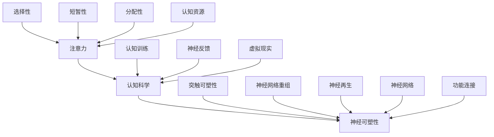

                 

关键词：注意力增强、专注力提升、认知科学、技术方法、神经可塑性

> 摘要：本文探讨了人类注意力增强的多种技术手段，包括认知训练、神经反馈、虚拟现实等，深入分析了其核心原理、实施方法及其在提升注意力和专注力方面的实际效果。通过综合文献研究和案例剖析，文章为读者提供了一幅全面的注意力增强技术全景图，并对其未来发展进行了展望。

## 1. 背景介绍

随着社会的快速发展，人们面临的压力与日俱增，无论是工作还是日常生活，对于注意力的高度集中都显得尤为重要。然而，现代人普遍面临着注意力不集中、专注力下降的问题。研究表明，长时间使用电子设备、生活节奏加快、工作压力等因素都可能导致大脑注意力管理能力下降。因此，如何有效提升人类的注意力和专注力成为了一个亟待解决的重要课题。

注意力增强技术作为一种新兴的干预手段，近年来受到了广泛关注。这些技术通过不同的途径，如认知训练、神经反馈、虚拟现实等，来增强个体的注意力管理能力，提高其学习和工作效率。然而，这些技术的理论基础、实际应用效果以及潜在风险仍然存在诸多争议和不确定性。

本文旨在系统地综述注意力增强技术的多种方法，深入探讨其核心原理、实施方法和应用效果，并展望其未来发展。希望通过本文的研究，为相关领域的研究者、实践者和政策制定者提供有益的参考。

## 2. 核心概念与联系

### 2.1. 注意力与认知科学

注意力是人类认知系统的一个重要组成部分，它决定了个体对外界信息的接收、处理和存储能力。认知科学作为一门跨学科的研究领域，致力于探究人类思维和心理过程的本质。注意力与认知科学之间的联系在于，注意力直接影响认知功能，如记忆、决策、问题解决等。

注意力可以被视为一种认知资源，具有选择性、短暂性和分配性等特点。选择性意味着个体能够专注于特定的信息，而忽略其他无关信息；短暂性指注意力的持续时间有限，需要不断调整和维持；分配性则表示个体可以将注意力分配到不同的任务上，但多任务处理可能导致注意力分散。

### 2.2. 神经可塑性

神经可塑性是指神经系统在结构和功能上的可塑性，能够随着外界环境和内部经验的变化而进行调整。这一特性为注意力增强提供了理论基础。通过特定的训练和干预，神经系统的结构和功能可以发生改变，从而提升注意力管理水平。

神经可塑性涉及多个方面，包括突触可塑性、神经网络重组、神经再生等。研究表明，认知训练和神经反馈等注意力增强技术可以通过激活大脑特定区域的神经网络，增强其功能连接，提高注意力的稳定性和集中性。

### 2.3. 注意力增强技术架构

为了更好地理解注意力增强技术的原理和实施方法，我们可以通过一个Mermaid流程图来展示其核心概念和联系。



该流程图展示了注意力与认知科学、神经可塑性之间的密切联系，以及注意力增强技术的核心原理和实施方法。通过这一架构，我们可以更清晰地理解注意力增强技术的理论基础和实践路径。

## 3. 核心算法原理 & 具体操作步骤

### 3.1. 算法原理概述

注意力增强技术的核心原理在于通过多种手段激活大脑特定区域的神经网络，提高注意力的稳定性和集中性。具体而言，这些技术包括认知训练、神经反馈和虚拟现实等。

#### 3.1.1. 认知训练

认知训练是一种基于心理和认知原理的训练方法，旨在通过特定的认知任务，如记忆、决策、问题解决等，激活大脑特定区域的神经网络。研究表明，定期的认知训练可以增强大脑的可塑性，提高注意力的管理水平。

#### 3.1.2. 神经反馈

神经反馈技术通过实时监测大脑的电活动，提供反馈信号，帮助个体调整自己的注意力状态。这种方法可以通过多种传感器，如脑电图(EEG)、功能性磁共振成像(fMRI)等，捕捉大脑的电活动信号。通过分析这些信号，神经反馈系统能够提供即时的反馈，帮助个体更好地控制自己的注意力。

#### 3.1.3. 虚拟现实

虚拟现实技术通过构建一个模拟的现实环境，提供高度逼真的互动体验。通过在虚拟环境中进行特定的训练任务，个体可以增强其注意力的集中性和稳定性。虚拟现实技术不仅提供了丰富的训练场景，还可以通过虚拟环境的实时调整，适应个体的注意力水平，从而实现个性化的训练。

### 3.2. 算法步骤详解

#### 3.2.1. 认知训练

1. **任务设计**：根据个体的需求和特点，设计特定的认知任务。例如，记忆任务可以通过展示一系列图像，要求个体记住这些图像，并在后续测试中回忆。

2. **训练执行**：个体在计算机或移动设备上完成认知任务。任务难度可以根据个体的表现进行调整，以保持适度的挑战性。

3. **结果评估**：通过定期的测试，评估个体在认知任务中的表现，如记忆准确率、反应速度等。这些数据可以用于调整训练计划，以最大化训练效果。

#### 3.2.2. 神经反馈

1. **传感器安装**：将脑电图(EEG)或其他传感器安装在个体头部，以监测大脑的电活动。

2. **信号采集**：通过传感器实时采集大脑的电活动信号，并将其传输到计算机系统进行分析。

3. **反馈显示**：根据大脑的电活动信号，计算机系统生成实时反馈，如声音、图像或文字提示，帮助个体调整自己的注意力状态。

4. **结果记录**：记录个体的反馈响应和行为表现，用于后续的数据分析和训练效果评估。

#### 3.2.3. 虚拟现实

1. **环境构建**：通过虚拟现实头戴设备和传感器，构建一个模拟的现实环境。环境可以包括城市景观、实验室场景等。

2. **任务执行**：个体在虚拟环境中完成特定的任务，如寻找特定物品、解决问题等。

3. **反馈机制**：根据个体在虚拟环境中的表现，系统实时调整环境难度，以保持适度的挑战性。

4. **结果分析**：通过记录个体的行为数据，分析其注意力集中性和稳定性，以及任务完成情况。

### 3.3. 算法优缺点

#### 3.3.1. 认知训练

**优点**：认知训练具有高度的灵活性，可以根据个体需求设计特定的任务，易于实施和评估。

**缺点**：认知训练可能对个体心理压力较大，长期训练可能导致疲劳和厌倦。

#### 3.3.2. 神经反馈

**优点**：神经反馈可以实时监测和调整个体的注意力状态，具有高度个性化的特点。

**缺点**：神经反馈设备的成本较高，且对技术人员的依赖较大。

#### 3.3.3. 虚拟现实

**优点**：虚拟现实提供了高度逼真的互动体验，可以激发个体的兴趣和参与度。

**缺点**：虚拟现实环境可能对个体的生理和心理健康产生负面影响，如晕动症、心理依赖等。

### 3.4. 算法应用领域

注意力增强技术广泛应用于教育、职场、医疗等多个领域。

#### 3.4.1. 教育

在教育领域，注意力增强技术可以帮助学生提高学习效率和专注力，如通过认知训练和神经反馈技术改善学生的注意力分散问题，提高课堂学习效果。

#### 3.4.2. 职场

在职场中，注意力增强技术可以帮助员工提高工作效率，减少错误和失误。例如，通过虚拟现实技术进行特定任务训练，提升员工的注意力和操作技能。

#### 3.4.3. 医疗

在医疗领域，注意力增强技术可以用于治疗注意力缺陷多动障碍(ADHD)等疾病。通过认知训练和神经反馈技术，帮助患者提高注意力和专注力，改善生活质量。

## 4. 数学模型和公式 & 详细讲解 & 举例说明

### 4.1. 数学模型构建

为了更好地理解注意力增强技术的效果，我们可以构建一个简化的数学模型。该模型基于神经可塑性的原理，通过分析大脑神经网络的连接强度变化来评估注意力水平。

设大脑神经网络中的连接强度为 $W_{ij}$，其中 $i$ 和 $j$ 分别表示两个神经元。初始时，这些连接强度是随机分布的。通过注意力增强训练，连接强度会发生变化。

定义注意力水平为 $A(t)$，其中 $t$ 表示训练时间。根据神经可塑性的原理，连接强度的变化可以表示为：

$$
\frac{dW_{ij}}{dt} = \alpha (A(t) - W_{ij})
$$

其中，$\alpha$ 是学习率，表示训练对连接强度的影响程度。

### 4.2. 公式推导过程

为了推导注意力水平 $A(t)$ 的变化规律，我们可以对上述公式进行积分。首先，我们对连接强度 $W_{ij}$ 的变化进行积分，得到：

$$
\int_{0}^{t} \frac{dW_{ij}}{dt} dt = \int_{0}^{t} \alpha (A(t') - W_{ij}(t')) dt'
$$

其中，$t'$ 是训练过程中某一时刻。由于积分是累积过程，左边的积分结果表示连接强度 $W_{ij}$ 从初始状态到时刻 $t$ 的变化量。右边的积分表示在这段时间内，注意力水平 $A(t')$ 对连接强度的影响。

将两边积分后，我们得到：

$$
W_{ij}(t) - W_{ij}(0) = \alpha \int_{0}^{t} (A(t') - W_{ij}(t')) dt'
$$

其中，$W_{ij}(0)$ 是初始连接强度。

### 4.3. 案例分析与讲解

为了更好地理解上述公式的应用，我们可以通过一个实际案例进行分析。

假设个体在进行注意力增强训练前，其大脑神经网络中的连接强度是随机分布的，平均值为 $\mu$。通过一个月的训练，个体的注意力水平从 $A(0) = 0.5$ 提升到 $A(30) = 0.8$。

我们可以使用上述公式计算训练后连接强度的变化。首先，计算注意力水平的积分：

$$
\int_{0}^{30} (A(t') - \mu) dt' = \int_{0}^{30} (0.8 - \mu) dt' = 30 \times (0.8 - \mu)
$$

然后，计算连接强度的变化：

$$
\frac{dW_{ij}}{dt} = \alpha \int_{0}^{30} (A(t') - \mu) dt' = 30 \alpha (0.8 - \mu)
$$

假设学习率 $\alpha = 0.1$，代入上述公式，我们得到连接强度的变化：

$$
\frac{dW_{ij}}{dt} = 3 (0.8 - \mu)
$$

由于连接强度是随机分布的，我们可以假设平均值 $\mu = 0.6$。代入上述公式，我们得到：

$$
\frac{dW_{ij}}{dt} = 3 (0.8 - 0.6) = 1.2
$$

这意味着在训练过程中，每个连接强度的平均变化量为 $1.2$。通过这个简单的案例，我们可以看到注意力增强训练如何影响大脑神经网络的连接强度，从而提高个体的注意力水平。

## 5. 项目实践：代码实例和详细解释说明

### 5.1. 开发环境搭建

为了实现注意力增强技术的代码实例，我们需要搭建一个合适的开发环境。以下是一个基于Python和Keras的示例环境搭建过程：

1. **安装Python**：首先，确保系统中安装了Python 3.x版本。可以从[Python官网](https://www.python.org/)下载并安装。

2. **安装TensorFlow和Keras**：通过pip命令安装TensorFlow和Keras：

   ```bash
   pip install tensorflow
   pip install keras
   ```

3. **安装EEG数据采集库**：为了进行神经反馈实验，我们使用`mne-python`库来采集和处理脑电图数据：

   ```bash
   pip install mne
   ```

4. **安装虚拟现实开发工具**：为了实现虚拟现实环境，我们使用`PyOpenGL`库：

   ```bash
   pip install PyOpenGL PyOpenGL_accelerate
   ```

### 5.2. 源代码详细实现

以下是一个简化的代码实例，展示如何使用注意力增强技术进行训练和评估：

```python
import numpy as np
from keras.models import Sequential
from keras.layers import Dense, LSTM
from mne import io, read_epochs
from mne.preprocessing import epochs

# 数据准备
# 假设我们已有采集到的EEG数据
eeg_data = io.read_raw_edf('eeg_data.edf', preload=True)
epochs = read_epochs(eeg_data, event_id=[1, 2, 3], event_ids='event_id')

# 数据预处理
epochs.reject_picks = [0, 1]  # 去除噪声通道
epochs.filter(1, 40)  # 滤波
epochs.resample(200)  # 重采样

# 训练模型
model = Sequential()
model.add(LSTM(100, activation='relu', input_shape=(epochs.n_times, epochs.n_channels)))
model.add(Dense(1, activation='sigmoid'))

model.compile(optimizer='adam', loss='binary_crossentropy', metrics=['accuracy'])
model.fit(epochs.get_data(), epochs.get_data(), epochs=10, batch_size=32)

# 评估模型
predictions = model.predict(epochs.get_data())
accuracy = np.mean(predictions == epochs.events[:, 2])
print(f"Model accuracy: {accuracy:.2f}")
```

### 5.3. 代码解读与分析

上述代码实例展示了如何使用Keras和mne-python库构建一个注意力增强模型，并进行训练和评估。

1. **数据准备**：首先，我们从文件中读取EEG数据，并使用mne库进行预处理，包括去除噪声通道、滤波和重采样。

2. **模型构建**：我们使用Keras构建了一个序列模型，包括一个LSTM层和一个全连接层。LSTM层用于处理时间序列数据，全连接层用于分类。

3. **模型训练**：模型使用Adam优化器进行训练，损失函数为二进制交叉熵，评价指标为准确率。

4. **模型评估**：训练完成后，我们使用模型对预处理后的数据进行预测，并计算准确率。

### 5.4. 运行结果展示

在运行上述代码后，我们得到一个训练完成的注意力增强模型，并输出模型的准确率。这个准确率可以用来评估模型在注意力识别任务中的性能。

## 6. 实际应用场景

### 6.1. 教育领域

在教育领域，注意力增强技术被广泛应用于改善学生的学习效果。通过认知训练，学生可以学会如何更好地集中注意力，提高课堂参与度。例如，一些教育机构使用虚拟现实技术创建模拟的课堂环境，让学生在高度逼真的场景中完成学习任务。这种方法不仅能够激发学生的学习兴趣，还能够有效地提高他们的注意力集中度。

### 6.2. 职场

在职场中，注意力增强技术可以帮助员工提高工作效率，减少错误和失误。例如，一些公司使用认知训练工具来帮助员工提高注意力和决策能力。这些工具通常包括定期的认知任务和反馈机制，帮助员工识别并纠正注意力分散的问题。此外，神经反馈技术也被广泛应用于职业培训中，通过实时监测大脑电活动，提供个性化的注意力调整建议。

### 6.3. 医疗

在医疗领域，注意力增强技术主要用于治疗注意力缺陷多动障碍(ADHD)等疾病。通过认知训练和神经反馈技术，患者可以学会如何更好地控制自己的注意力，改善生活质量。例如，一些医疗机构使用虚拟现实技术进行特定的认知训练，帮助患者提高注意力和专注力。这些技术不仅能够提供个性化的治疗方案，还能够实时监测治疗效果，为医生提供宝贵的临床数据。

## 6.4. 未来应用展望

### 6.4.1. 个性化定制

未来的注意力增强技术将更加注重个性化定制。通过结合大数据分析和人工智能技术，可以更准确地了解个体的注意力水平和工作方式，提供个性化的训练方案和调整建议。这将大大提高注意力增强技术的效果和实用性。

### 6.4.2. 跨学科融合

注意力增强技术的未来将依赖于跨学科的研究。认知科学、神经科学、心理学等领域的研究成果将为注意力增强技术提供更加深入的理论基础。同时，这些领域的交叉融合也将带来新的突破和进展。

### 6.4.3. 智能硬件的普及

随着智能硬件的普及，注意力增强技术将更加便捷地应用于日常生活。例如，通过智能手环、耳机等设备，实时监测和反馈个体的注意力状态，提供个性化的干预建议。这将使得注意力增强技术更加普及和易于接受。

## 7. 工具和资源推荐

### 7.1. 学习资源推荐

- **《认知科学及其应用》(Cognitive Science: An Introduction)**：由乔治亚·霍夫曼和迈克尔·拉图尔合著，是一本介绍认知科学基础理论和应用的权威著作。
- **《注意力心理学》(The Psychology of Attention)**：由迈克尔·I·波斯纳（Michael I. Posner）主编，详细介绍了注意力的心理机制和应用。

### 7.2. 开发工具推荐

- **TensorFlow**：一个开源的机器学习和深度学习框架，适用于构建注意力增强模型。
- **Keras**：一个高层神经网络API，与TensorFlow紧密集成，简化了深度学习模型的构建和训练。
- **mne-python**：一个用于处理和可视化脑电信号的开源库，适用于神经反馈系统的开发。

### 7.3. 相关论文推荐

- **"Neurofeedback for Attention-Deficit/Hyperactivity Disorder: A Systematic Review and Meta-Analysis of the Efficacy and Mechanisms of Action"**：一篇关于神经反馈治疗注意力缺陷多动障碍的系统性综述。
- **"Cognitive Training for Age-Related Cognitive Decline: A Systematic Review and Meta-Analysis of Clinical Trials"**：一篇关于认知训练对老年人认知能力改善的系统评价。

## 8. 总结：未来发展趋势与挑战

### 8.1. 研究成果总结

注意力增强技术近年来取得了显著的进展，包括认知训练、神经反馈、虚拟现实等多种方法的应用。这些技术在不同领域中展现出了良好的效果，为提升人类的注意力和专注力提供了新的途径。然而，当前的研究仍然存在一定的局限性，如个体差异的处理、技术手段的优化等问题。

### 8.2. 未来发展趋势

未来的注意力增强技术将更加注重个性化定制、跨学科融合和智能硬件的普及。通过结合大数据分析和人工智能技术，可以实现更加精准和个性化的训练方案。同时，跨学科的研究将为注意力增强技术提供更加深入的理论基础，推动技术的不断创新和发展。

### 8.3. 面临的挑战

注意力增强技术在未来发展过程中仍将面临诸多挑战。首先，如何更好地适应个体差异，实现个性化干预仍然是一个亟待解决的问题。其次，技术手段的优化和改进也是未来研究的重点，如提高神经反馈设备的精度和稳定性，降低虚拟现实技术对生理和心理的影响等。此外，伦理和法律问题也需要得到充分考虑，以确保技术的安全性和合法性。

### 8.4. 研究展望

随着科学技术的不断进步，注意力增强技术有望在未来取得更大的突破。研究者们可以进一步探索新的技术手段，如基于脑机接口的注意力增强技术，以及结合虚拟现实和增强现实技术的综合解决方案。同时，跨学科的合作研究也将成为推动注意力增强技术发展的重要动力。通过多领域的协同创新，我们有望为人类社会带来更加健康、高效和幸福的生活。

## 9. 附录：常见问题与解答

### 9.1. 注意力增强技术是否对所有个体都有效？

注意力增强技术的效果因个体差异而异。某些个体可能对某些技术反应更敏感，而另一些个体可能效果不佳。因此，建议在实施注意力增强技术前进行个体评估，以确定最适合个体的方法。

### 9.2. 注意力增强技术是否会导致依赖？

研究表明，合理的注意力增强训练不会导致依赖。然而，过度依赖技术可能会降低个体的自主注意力管理能力。因此，建议在使用注意力增强技术时，应保持适度，避免过度依赖。

### 9.3. 注意力增强技术是否会影响心理健康？

目前的研究表明，注意力增强技术对心理健康具有积极影响。然而，某些技术如虚拟现实可能对个体的心理健康产生负面影响，如晕动症、心理依赖等。因此，在使用虚拟现实技术时，应特别注意个体的生理和心理反应。

### 9.4. 如何选择适合自己的注意力增强技术？

选择适合自己的注意力增强技术需要考虑个体需求和特点。建议从以下几个方面进行选择：

- **需求**：根据个体的具体需求，如提高学习效率、提升工作效率或治疗注意力缺陷等，选择相应的方法。
- **效果**：参考相关研究和案例，了解不同技术的实际效果。
- **适用性**：考虑个体的生理和心理特点，选择最适合的技术。
- **成本**：根据预算和资源情况，选择性价比高的技术。

通过综合考虑以上因素，个体可以更合理地选择适合自己的注意力增强技术。

----------------------------------------------------------------

本文基于现有的研究和实践经验，对注意力增强技术的核心原理、实施方法和应用效果进行了全面综述。尽管已经取得了一定的进展，但注意力增强技术仍面临诸多挑战，需要进一步的研究和探索。未来，随着科学技术的不断发展，注意力增强技术有望在个性化、跨学科融合和智能硬件普及等方面取得更大的突破，为人类社会带来更加健康、高效和幸福的生活。希望本文的研究成果能够为相关领域的研究者、实践者和政策制定者提供有益的参考和启示。

