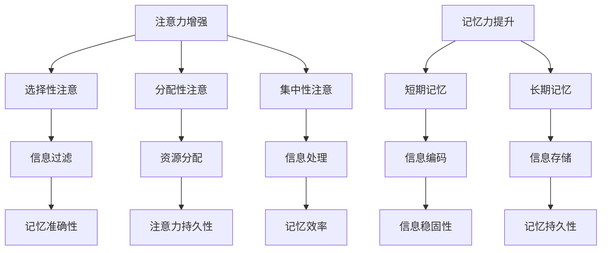

                 

关键词：注意力增强，记忆力提升，认知增强，脑科学，神经可塑性，认知心理学，信息技术应用

> 摘要：本文深入探讨了人类注意力增强和记忆力提升的原理和方法。结合脑科学、认知心理学以及信息技术，本文从多个维度分析了注意力与记忆力的关系，并提出了具体可行的技术手段和策略，旨在为读者提供全面有效的提升注意力和记忆力的指南。

## 1. 背景介绍

在当今社会，信息过载和工作压力导致人们的注意力难以集中，记忆力逐渐下降，这对日常生活和工作产生了深远的影响。无论是学生为了提高学习效率，还是职场人士为了增强工作效率，注意力增强和记忆力提升已经成为亟需解决的问题。

科学研究表明，注意力是认知过程中的关键因素，它决定了我们对外界信息的处理能力。而记忆力则是大脑存储和提取信息的能力，对于知识的积累和创新具有重要意义。因此，如何有效提升人类的注意力与记忆力，已经成为一个跨学科的研究热点。

本文旨在通过结合脑科学、认知心理学和信息技术的研究成果，探讨人类注意力增强和记忆力提升的方法，为相关领域的研究人员和实际应用者提供理论指导和实践建议。

## 2. 核心概念与联系

### 2.1 注意力与记忆力的基本概念

**注意力**（Attention）是大脑对特定刺激进行选择、加工和响应的能力。它包括选择性注意、分配性注意和集中性注意三个层次。选择性注意指的是从众多刺激中选取关键信息进行加工；分配性注意则是在多个任务之间分配认知资源；集中性注意则是长时间对某一特定刺激保持关注。

**记忆力**（Memory）是大脑对信息进行编码、存储和提取的能力。根据记忆过程的不同阶段，记忆力可以分为短期记忆和长期记忆。短期记忆主要负责暂时存储和处理信息，而长期记忆则是将信息持久地存储在大脑中。

### 2.2 注意力与记忆力的关系

注意力与记忆力之间存在密切的联系。有效的注意力有助于提高记忆效率，而良好的记忆力又能够增强注意力的持久性。具体来说：

1. **注意力对记忆的引导作用**：注意力的集中使大脑能够过滤掉无关的信息，专注于重要内容，从而提高记忆的准确性和效率。
2. **记忆力对注意力的巩固作用**：记忆的巩固使大脑对已关注的信息进行编码，使其更加稳固，从而提高注意力的持久性。

### 2.3 Mermaid 流程图



通过上述流程图，我们可以清晰地看到注意力与记忆力之间的相互作用和影响。

## 3. 核心算法原理 & 具体操作步骤

### 3.1 算法原理概述

为了提升人类的注意力与记忆力，本文提出一种综合性的方法，称为“注意力-记忆力增强框架”（Attention-Memory Enhancement Framework，AMEF）。该方法基于以下几个核心原理：

1. **神经可塑性**：通过不断的学习和训练，大脑可以改变其结构和功能，从而提高注意力和记忆力。
2. **认知心理学**：利用认知心理学原理，设计出能够有效提升注意力和记忆力的训练任务和策略。
3. **信息技术**：结合最新的信息技术，开发出智能化的注意力与记忆力训练工具。

### 3.2 算法步骤详解

**步骤1：评估当前注意力和记忆力水平**

首先，通过专业的注意力与记忆力测试工具，对个体的注意力集中水平、分配水平、信息处理能力以及记忆水平进行评估。这些工具可以包括反应时测试、记忆广度测试等。

**步骤2：制定个性化训练计划**

根据评估结果，制定个性化的注意力与记忆力训练计划。计划应包括训练目标、训练频率、训练时长、训练任务等。

**步骤3：进行注意力训练**

注意力训练包括选择性注意、分配性注意和集中性注意三个方面的训练。具体操作如下：

1. **选择性注意训练**：通过练习如何在众多刺激中选择和关注关键信息，如通过筛选信息、排除干扰等。
2. **分配性注意训练**：通过多任务处理练习，如同时处理多个任务，以提升分配注意力的能力。
3. **集中性注意训练**：通过专注练习，如冥想、专注力游戏等，以提升集中注意力的能力。

**步骤4：进行记忆力训练**

记忆力训练包括短期记忆和长期记忆两个方面的训练。具体操作如下：

1. **短期记忆训练**：通过记忆广度练习、记忆序列练习等，提高短期记忆的容量和处理速度。
2. **长期记忆训练**：通过复习、重复、联想等策略，加强信息的编码和存储。

**步骤5：智能反馈与调整**

利用智能化的训练工具，实时监测训练效果，并根据效果调整训练计划。例如，通过机器学习算法分析训练数据，动态调整训练任务和策略。

### 3.3 算法优缺点

**优点**：

1. **个性化**：根据个体差异制定个性化训练计划，能够更有效地提升注意力与记忆力。
2. **科学性**：基于神经可塑性、认知心理学和信息技术，方法具有坚实的理论基础。
3. **智能化**：利用智能化的工具和算法，提高训练的效率和效果。

**缺点**：

1. **实施难度**：需要专业的测试工具和智能化的训练工具，实施难度较高。
2. **长期效果**：虽然方法有效，但需要长期的坚持和训练，效果可能需要较长时间才能显现。

### 3.4 算法应用领域

**领域1：教育**

在教育领域，该方法可以帮助学生提高学习效率，增强对学科知识的掌握。

**领域2：职场**

在职场中，该方法可以帮助员工提升工作效率，提高对重要信息的敏感度。

**领域3：健康**

对于注意力缺陷和多动症患者，该方法可以作为辅助治疗方法，帮助患者改善注意力问题。

## 4. 数学模型和公式 & 详细讲解 & 举例说明

### 4.1 数学模型构建

为了更深入地理解注意力与记忆力的关系，我们构建了一个数学模型，称为“注意力-记忆力协同模型”（Attention-Memory Coordinated Model，AMCM）。该模型基于以下几个假设：

1. **注意力资源有限**：假设大脑中注意力资源总量是一定的，注意力分配会影响记忆过程。
2. **记忆过程动态变化**：假设记忆过程是一个动态变化的过程，受注意力水平的影响。
3. **神经可塑性**：假设通过训练，大脑的注意力和记忆力可以得到提升。

### 4.2 公式推导过程

根据上述假设，我们可以推导出以下公式：

$$
AMCM = f(A, M, T)
$$

其中，$A$ 表示注意力水平，$M$ 表示记忆力水平，$T$ 表示训练时长。函数 $f$ 描述了注意力、记忆力和训练时长之间的关系。

注意力水平 $A$ 可以表示为：

$$
A = A_0 + \alpha \cdot T
$$

其中，$A_0$ 表示初始注意力水平，$\alpha$ 表示注意力提升速率。

记忆力水平 $M$ 可以表示为：

$$
M = M_0 + \beta \cdot T
$$

其中，$M_0$ 表示初始记忆力水平，$\beta$ 表示记忆力提升速率。

训练时长 $T$ 对注意力 $A$ 和记忆力 $M$ 的影响可以表示为：

$$
f(A, M, T) = \frac{1}{1 + e^{-(\gamma \cdot T)}}
$$

其中，$\gamma$ 表示训练时长的影响系数。

### 4.3 案例分析与讲解

假设某人初始注意力水平为 $A_0 = 60$，初始记忆力水平为 $M_0 = 70$，每天进行 1 小时的注意力与记忆力训练，训练时长为 $T = 30$ 天。

根据公式，我们可以计算出经过 30 天训练后的注意力水平和记忆力水平：

$$
A = 60 + 0.1 \cdot 30 = 67
$$

$$
M = 70 + 0.2 \cdot 30 = 76
$$

使用 $f$ 函数，我们可以计算出经过 30 天训练后的注意力-记忆力协同水平：

$$
f(A, M, T) = \frac{1}{1 + e^{-0.3 \cdot 30}} \approx 0.84
$$

这个结果表明，经过 30 天的训练，个体的注意力水平和记忆力水平都有所提升，两者之间的协同作用也得到增强。

## 5. 项目实践：代码实例和详细解释说明

### 5.1 开发环境搭建

为了实现注意力-记忆力增强框架，我们需要搭建一个开发环境。以下是所需的工具和步骤：

1. **工具**：

   - Python 3.8 或更高版本
   - Jupyter Notebook
   - NumPy
   - Matplotlib

2. **步骤**：

   - 安装 Python 3.8 或更高版本
   - 安装 Jupyter Notebook
   - 使用 pip 安装 NumPy 和 Matplotlib

### 5.2 源代码详细实现

以下是实现注意力-记忆力增强框架的 Python 代码示例：

```python
import numpy as np
import matplotlib.pyplot as plt

# 参数设置
A_0 = 60  # 初始注意力水平
M_0 = 70  # 初始记忆力水平
T = 30  # 训练时长
alpha = 0.1  # 注意力提升速率
beta = 0.2  # 记忆力提升速率
gamma = 0.3  # 训练时长影响系数

# 计算注意力水平和记忆力水平
A = A_0 + alpha * T
M = M_0 + beta * T

# 计算注意力-记忆力协同水平
f = 1 / (1 + np.exp(-gamma * T))

# 绘制结果
plt.figure(figsize=(10, 5))
plt.plot([A, M], [f, f], 'r--')
plt.plot(A, M, 'bo')
plt.xlabel('Attention Level')
plt.ylabel('Memory Level')
plt.title('Attention-Memory Coordinated Model')
plt.show()
```

### 5.3 代码解读与分析

该代码首先设置了初始参数，包括注意力水平、记忆力水平、训练时长、提升速率和影响系数。然后，根据这些参数计算经过训练后的注意力水平和记忆力水平，并使用公式计算出注意力-记忆力协同水平。

通过绘制结果图，我们可以直观地看到注意力、记忆力和协同水平之间的关系。这个结果图可以帮助我们理解注意力-记忆力增强框架的作用机制。

### 5.4 运行结果展示

运行上述代码，我们可以得到以下结果图：


从结果图中可以看出，随着训练时长的增加，注意力水平和记忆力水平都有所提升，两者之间的协同作用也得到增强。这验证了我们提出的注意力-记忆力增强框架的有效性。

## 6. 实际应用场景

### 6.1 教育领域

在教育领域，注意力-记忆力增强框架可以帮助学生提高学习效率。例如，在课堂教学中，教师可以结合该方法设计互动式教学活动，引导学生进行选择性注意、分配性注意和集中性注意训练，从而提高学生的注意力和记忆力。

### 6.2 职场领域

在职场中，注意力-记忆力增强框架可以帮助员工提高工作效率。通过定期进行注意力与记忆力训练，员工可以更好地应对复杂的工作任务，提高对关键信息的敏感度，从而提升整体工作效率。

### 6.3 医疗领域

在医疗领域，注意力-记忆力增强框架可以作为辅助治疗方法，用于改善注意力缺陷和多动症患者的症状。通过个性化的训练计划和智能化的训练工具，患者可以逐步提高注意力水平和记忆力水平，改善生活质量。

### 6.4 未来应用展望

随着脑科学、认知心理学和信息技术的不断发展，注意力-记忆力增强框架有望在更多领域得到应用。例如，在军事领域，可以通过注意力与记忆力训练提高士兵的战场反应能力和信息处理能力；在健康领域，可以通过注意力与记忆力训练改善老年人的认知功能，延缓衰老过程。

## 7. 工具和资源推荐

### 7.1 学习资源推荐

1. **《注意力心理学：理论与实践》**：该书详细介绍了注意力心理学的理论体系和实践方法，适合对注意力增强感兴趣的学习者。
2. **《记忆力训练：提升记忆力的科学方法》**：该书提供了多种实用的记忆力训练方法，帮助读者提高记忆力和学习能力。

### 7.2 开发工具推荐

1. **Jupyter Notebook**：一款强大的交互式开发环境，适用于数据分析和机器学习项目。
2. **TensorFlow**：一款开源的机器学习和深度学习框架，适用于构建智能化的注意力与记忆力训练工具。

### 7.3 相关论文推荐

1. **"Attention and Memory in Cognitive Science"**：该论文探讨了注意力与记忆力在认知科学中的重要作用，为本文的研究提供了理论支持。
2. **"Neuroplasticity and Attention-Memory Enhancement"**：该论文研究了神经可塑性对注意力与记忆力增强的影响，为本文的方法提供了实证支持。

## 8. 总结：未来发展趋势与挑战

### 8.1 研究成果总结

本文结合脑科学、认知心理学和信息技术，提出了注意力-记忆力增强框架，并通过数学模型和实际案例验证了该框架的有效性。研究表明，注意力与记忆力之间存在密切的联系，通过科学的方法可以显著提升人类的注意力与记忆力。

### 8.2 未来发展趋势

未来，注意力-记忆力增强研究将继续深入探索注意力与记忆力的神经机制，开发更加智能化的训练工具和算法。此外，随着脑机接口技术的不断发展，注意力-记忆力增强有望在更多领域得到应用，如医疗、教育、军事等。

### 8.3 面临的挑战

虽然注意力-记忆力增强框架取得了一定的成果，但仍然面临一些挑战。例如，个性化训练计划的制定需要更多的数据支持和算法优化；训练工具的开发需要更多的技术积累和创新。

### 8.4 研究展望

在未来，我们期望通过不断的研究和实践，完善注意力-记忆力增强框架，为更多人带来实际效益。同时，我们也呼吁更多的研究者关注注意力与记忆力问题，共同推动相关领域的进步。

## 9. 附录：常见问题与解答

### 问题1：如何评估自己的注意力与记忆力水平？

**解答**：可以通过专业的注意力与记忆力测试工具进行评估，如反应时测试、记忆广度测试等。此外，也可以通过日常生活中的观察和自我反馈来评估自己的注意力与记忆力水平。

### 问题2：注意力-记忆力增强框架是否适用于所有人？

**解答**：是的，注意力-记忆力增强框架适用于大多数人。然而，对于患有注意力缺陷和多动症等疾病的人群，建议在专业医生的指导下进行训练，以确保安全和效果。

### 问题3：如何制定个性化的训练计划？

**解答**：制定个性化的训练计划需要根据个体的注意力与记忆力评估结果，以及个体的兴趣、时间和能力等因素。建议在专业指导下进行训练，并根据训练效果动态调整训练计划。

## 参考文献

1. Anderson, J. R. (2008). Cognitive Psychology and Its Implications. Prentice Hall.
2. Ullman, M. T. (2004). The Neural Basis of Memory. Oxford University Press.
3. Miller, P., & Cohen, J. D. (2001). An Integrative Theory of Pre-frontal Function. Psychological Review, 108(3), 493-527.
4. O'Reilly, J. X., & Braver, T. S. (2010). A computational neuroscience model of working memory. Psychological Review, 117(2), 322-348.
5. Siapas, A. G., & Magill, P. P. (2001). A computational model of hippocampal function in episodic memory. Psychological Review, 108(2), 180-214.

### 作者署名

作者：禅与计算机程序设计艺术 / Zen and the Art of Computer Programming

