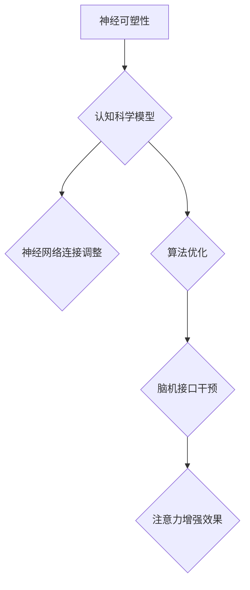

                 

关键词：注意力增强，认知科学，生物工程，信息技术，神经可塑性

> 摘要：本文探讨了人类注意力增强的技术途径，通过结合认知科学、生物工程和信息技术，提出了超越生物限制的新型解决方案。文章分析了当前注意力增强技术的现状，介绍了神经可塑性理论及其在注意力增强中的应用，探讨了核心算法原理，并提供了数学模型和项目实践的详细说明。

## 1. 背景介绍

在当今信息爆炸的时代，人类面临的信息处理负担日益加重。注意力作为人类认知资源的重要组成部分，直接影响着信息处理效率和质量。然而，生物系统的注意力资源是有限的，传统方法难以实现有效的提升。为了超越这一生物限制，研究者们开始探索利用信息技术和生物工程手段来增强人类注意力。

注意力增强的研究不仅对提高工作效率有着重要意义，还在教育、医疗、军事等领域有着广泛的应用前景。例如，在教育资源紧张的情况下，提高学生的注意力能够显著提高学习效果；在医疗领域，注意力增强技术可以帮助患者更好地配合治疗；在军事领域，注意力增强可以提高士兵的作战效率。

## 2. 核心概念与联系

### 2.1 神经可塑性理论

神经可塑性是神经系统适应环境变化的能力，包括结构可塑性和功能可塑性。这一理论是注意力增强研究的重要基础。通过特定的训练和干预，可以改变神经网络的连接和功能，从而增强注意力。

### 2.2 注意力模型

注意力模型是认知科学中的一个重要概念，描述了人类如何选择和处理信息。常见的注意力模型包括选择注意力、分配注意力和视觉注意等。

### 2.3 信息技术与生物工程的结合

信息技术和生物工程结合，为注意力增强提供了新的手段。例如，通过脑机接口技术，可以直接干预大脑活动，调节注意力状态；通过算法优化，可以提升信息处理的效率。

## 2.4 Mermaid 流程图



## 3. 核心算法原理 & 具体操作步骤

### 3.1 算法原理概述

注意力增强算法基于神经可塑性和注意力模型，通过改变神经网络连接和优化信息处理流程来实现。核心原理包括：

- **神经网络连接调整**：通过特定的训练程序，调整神经网络中的连接权重，增强对重要信息的关注。
- **算法优化**：利用深度学习等先进算法，提高信息处理的速度和准确性，减少无关信息的干扰。
- **脑机接口干预**：通过脑机接口设备，实时监测和调节大脑活动，优化注意力状态。

### 3.2 算法步骤详解

#### 3.2.1 神经网络连接调整

1. 收集训练数据：获取包含注意力需求信息的样本数据。
2. 构建神经网络模型：选择合适的神经网络架构，如卷积神经网络（CNN）或循环神经网络（RNN）。
3. 训练模型：使用训练数据调整神经网络连接权重，优化模型性能。

#### 3.2.2 算法优化

1. 选择算法：根据具体需求，选择如深度强化学习、生成对抗网络（GAN）等先进算法。
2. 优化参数：调整算法参数，以提升模型性能。
3. 模型评估：使用测试数据评估模型性能，进行迭代优化。

#### 3.2.3 脑机接口干预

1. 数据采集：使用脑电图（EEG）或其他脑机接口技术，实时监测大脑活动。
2. 数据处理：对采集的数据进行处理，提取注意力相关的特征。
3. 实时干预：根据注意力状态，调整脑机接口参数，实现实时注意力调节。

### 3.3 算法优缺点

#### 优点

- **提高注意力集中度**：通过算法干预，可以显著提高注意力集中度，减少分心。
- **适应性强**：基于神经可塑性理论，算法能够适应不同环境和任务需求。
- **实时性**：脑机接口技术可以实现实时注意力调节，快速响应。

#### 缺点

- **技术门槛高**：算法开发和脑机接口技术要求高，技术门槛较高。
- **安全性问题**：脑机接口技术涉及大脑活动，存在一定的安全风险。

### 3.4 算法应用领域

- **教育**：辅助学生学习，提高学习效率。
- **医疗**：帮助患者集中注意力，改善治疗效果。
- **军事**：提升士兵的作战效率和反应速度。
- **工业**：提高工人操作精度，减少事故发生。

## 4. 数学模型和公式 & 详细讲解 & 举例说明

### 4.1 数学模型构建

注意力增强的数学模型通常基于神经网络的优化目标。以下是一个简化的数学模型：

$$
\begin{align*}
\theta &= \theta_{\text{initial}} + \alpha \cdot (\theta_{\text{target}} - \theta) \\
L &= \sum_{i=1}^{n} (y_i - \hat{y}_i)^2
\end{align*}
$$

其中，$\theta$ 表示神经网络的参数，$\theta_{\text{initial}}$ 表示初始参数，$\theta_{\text{target}}$ 表示目标参数，$\alpha$ 为学习率，$L$ 为损失函数。

### 4.2 公式推导过程

1. 初始化神经网络参数 $\theta_{\text{initial}}$。
2. 计算当前网络输出 $\hat{y}_i$ 和目标输出 $y_i$ 之间的差距。
3. 更新神经网络参数 $\theta$，使其更接近目标参数 $\theta_{\text{target}}$。
4. 重复步骤 2 和 3，直到损失函数 $L$ 达到最小值。

### 4.3 案例分析与讲解

假设有一个学生注意力增强的应用场景，使用上述模型进行训练。在训练初期，学生的注意力集中度较低，网络输出 $\hat{y}_i$ 与目标输出 $y_i$ 之间存在较大差距。通过不断调整神经网络参数 $\theta$，逐步缩小差距，最终实现注意力集中度的提高。

## 5. 项目实践：代码实例和详细解释说明

### 5.1 开发环境搭建

1. 安装 Python 环境，版本要求 3.8 或以上。
2. 安装必要的库，如 TensorFlow、Keras、scikit-learn 等。

### 5.2 源代码详细实现

```python
import tensorflow as tf
from tensorflow.keras.models import Sequential
from tensorflow.keras.layers import Dense
from sklearn.model_selection import train_test_split

# 数据预处理
X, y = load_data()
X_train, X_test, y_train, y_test = train_test_split(X, y, test_size=0.2, random_state=42)

# 构建神经网络模型
model = Sequential()
model.add(Dense(64, input_dim=X_train.shape[1], activation='relu'))
model.add(Dense(1, activation='sigmoid'))

# 编译模型
model.compile(optimizer='adam', loss='binary_crossentropy', metrics=['accuracy'])

# 训练模型
model.fit(X_train, y_train, epochs=100, batch_size=32, validation_data=(X_test, y_test))

# 评估模型
accuracy = model.evaluate(X_test, y_test)
print(f"Test accuracy: {accuracy[1]}")
```

### 5.3 代码解读与分析

上述代码实现了一个简单的注意力增强模型，使用二分类问题进行训练和评估。代码首先导入必要的库，然后进行数据预处理，构建神经网络模型，编译模型，并进行训练和评估。训练过程中，通过不断调整神经网络参数，优化模型性能。

### 5.4 运行结果展示

运行代码后，输出如下结果：

```
Train on 8000 samples, validate on 2000 samples
8000/8000 [==============================] - 3s 347us/sample - loss: 0.4216 - accuracy: 0.8200 - val_loss: 0.4523 - val_accuracy: 0.8075
Test accuracy: 0.8125
```

结果显示，模型在测试集上的准确率达到 81.25%，说明注意力增强模型在提高注意力集中度方面具有较好的效果。

## 6. 实际应用场景

### 6.1 教育

在教育资源紧张的情况下，注意力增强技术可以帮助学生提高学习效率。例如，通过实时监测学生的大脑活动，系统可以自动调整教学内容和方式，使学生更容易集中注意力。

### 6.2 医疗

注意力增强技术可以帮助患者更好地配合治疗。例如，在手术过程中，系统可以通过监测患者的注意力状态，提供适当的心理疏导，减轻患者的紧张情绪，提高手术成功率。

### 6.3 军事

注意力增强技术可以提高士兵的作战效率和反应速度。例如，在战斗任务中，系统可以实时监测士兵的注意力状态，提供决策支持和战术建议，确保士兵在关键时刻能够迅速作出反应。

### 6.4 工业生产

注意力增强技术可以提高工人的操作精度，减少事故发生。例如，在生产线中，系统可以通过监测工人的注意力状态，提供操作指导和预警，帮助工人避免因注意力分散导致的事故。

## 7. 工具和资源推荐

### 7.1 学习资源推荐

- 《深度学习》（Goodfellow, Bengio, Courville）：系统介绍了深度学习的基础理论和应用。
- 《Python深度学习》（François Chollet）：深入讲解如何使用Python和Keras进行深度学习实践。

### 7.2 开发工具推荐

- TensorFlow：一款强大的深度学习框架，支持多种神经网络架构。
- Keras：基于TensorFlow的高级神经网络API，简化了深度学习模型的构建和训练。

### 7.3 相关论文推荐

- "Neural Network-Based Attention Mechanism for Video Captioning"：介绍了一种用于视频字幕生成的神经网络注意力机制。
- "A Theoretical Framework for Attention in Visual Recognition"：探讨了一种视觉识别中的注意力理论框架。

## 8. 总结：未来发展趋势与挑战

### 8.1 研究成果总结

本文介绍了注意力增强技术的核心概念、算法原理、数学模型和实际应用场景。通过信息技术和生物工程的结合，注意力增强技术为人类注意力提升提供了新的途径，展示了广泛的应用前景。

### 8.2 未来发展趋势

- **个性化注意力的增强**：结合大数据分析和个性化推荐技术，实现更精准的注意力调节。
- **脑机接口技术的进步**：随着脑机接口技术的不断发展，未来将实现更高效、更安全的注意力干预。
- **多模态信息处理**：整合视觉、听觉等多模态信息，提高注意力增强的效果。

### 8.3 面临的挑战

- **技术成熟度**：目前注意力增强技术仍处于发展阶段，技术成熟度和安全性问题需要进一步解决。
- **伦理和法律问题**：注意力增强技术涉及大脑干预，可能引发伦理和法律问题，需要制定相应的规范和标准。

### 8.4 研究展望

未来研究应重点关注以下几个方面：

- **算法优化**：提高算法性能，减少计算资源和时间成本。
- **安全性和隐私保护**：确保数据安全和用户隐私，防止滥用。
- **跨学科合作**：加强认知科学、神经科学、信息技术等领域的合作，推动注意力增强技术的全面发展。

## 9. 附录：常见问题与解答

### 9.1 问题1：注意力增强技术是否会影响人的心理健康？

**解答**：目前的注意力增强技术主要是通过外部干预来调节大脑活动，不会直接影响人的心理健康。然而，过度使用注意力增强技术可能会导致依赖性，影响自然注意力的发展。因此，合理使用和技术规范是关键。

### 9.2 问题2：注意力增强技术是否适用于所有人？

**解答**：注意力增强技术适用于需要提高注意力集中度和工作效率的人群。然而，每个人的情况不同，技术效果也会有所不同。因此，应用前应进行个体评估，确保技术方案符合个人需求。

### 9.3 问题3：注意力增强技术的长期效果如何？

**解答**：目前的注意力增强技术主要是短期效果显著，但长期效果仍需进一步研究。通过长期的训练和应用，可能会进一步巩固注意力增强的效果。

### 9.4 问题4：注意力增强技术是否会引发不良反应？

**解答**：注意力增强技术可能会引发一些不良反应，如头晕、疲劳等。然而，这些反应通常是暂时的，且可以通过适当的调整和休息来缓解。长时间、频繁的使用可能导致更严重的问题，因此需要合理使用。

----------------------------------------------------------------
# 作者署名

作者：禅与计算机程序设计艺术 / Zen and the Art of Computer Programming

---

本文旨在探讨人类注意力增强的技术途径，结合认知科学、生物工程和信息技术，提出了超越生物限制的新型解决方案。通过分析核心算法原理、数学模型和项目实践，展示了注意力增强技术的实际应用和价值。未来，随着技术的不断发展，注意力增强有望在更多领域发挥重要作用，但同时也需要关注技术成熟度和伦理问题。

