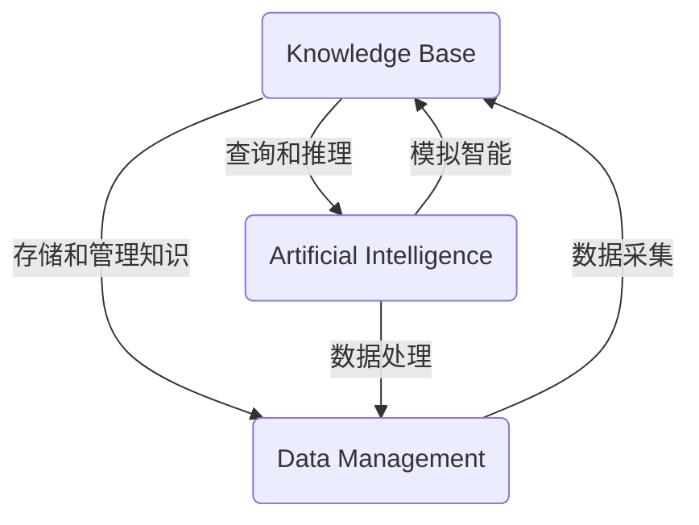
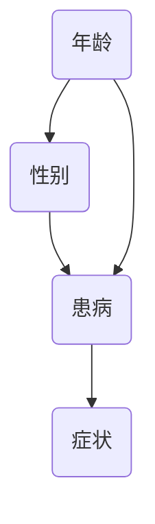

                 

关键词：知识库，人工智能，数据管理，自动化，系统架构，持续学习

> 摘要：本文深入探讨了人类如何构建一个永不停歇的知识库，通过人工智能和自动化技术，实现知识库的自动化更新、扩展和维护，以及其在各个领域中的应用和未来展望。

## 1. 背景介绍

在信息爆炸的时代，数据量和信息量呈指数级增长。人类的知识库作为信息处理的中心，其重要性愈发凸显。然而，传统的知识库建设面临着数据更新不及时、知识碎片化、难以维护等挑战。为了应对这些挑战，人工智能和自动化技术逐渐成为构建人类知识库的关键驱动力。

本文将从以下几个方面展开讨论：

1. **核心概念与联系**：介绍知识库、人工智能、数据管理等核心概念，并使用Mermaid流程图展示其架构和关系。
2. **核心算法原理 & 具体操作步骤**：详细解析核心算法的原理和操作步骤，包括算法的优缺点和应用领域。
3. **数学模型和公式 & 详细讲解 & 举例说明**：阐述数学模型和公式的重要性，并给出具体的推导过程和案例分析。
4. **项目实践：代码实例和详细解释说明**：提供实际的代码实例，详细解释代码的实现过程和原理。
5. **实际应用场景**：探讨知识库在不同领域的应用，如科学研究、医疗、教育等。
6. **未来应用展望**：分析知识库在未来的发展趋势和潜在应用。
7. **工具和资源推荐**：推荐学习资源和开发工具，以及相关的论文推荐。
8. **总结：未来发展趋势与挑战**：总结研究成果，展望未来发展趋势和面临的挑战。
9. **附录：常见问题与解答**：解答读者可能遇到的问题。

### 2. 核心概念与联系

在构建人类知识库的过程中，我们首先需要明确几个核心概念，包括知识库、人工智能和数据管理。

#### 知识库

知识库（Knowledge Base，简称KB）是一个存储和管理知识的系统，它包含了领域内的各类知识，如事实、规则、概念、关系等。知识库的主要功能是提供查询和推理服务，以便在特定的应用场景中快速获取所需的知识。

#### 人工智能

人工智能（Artificial Intelligence，简称AI）是一种模拟人类智能的技术，通过算法和模型，使计算机具备感知、理解、学习、推理和决策的能力。在知识库构建中，人工智能主要用于自动化数据挖掘、知识抽取和推理。

#### 数据管理

数据管理（Data Management）是指对数据的采集、存储、处理、分析和共享的过程。良好的数据管理是实现高效知识库的关键。

以下是使用Mermaid流程图展示的知识库、人工智能和数据管理的核心概念及联系：



### 3. 核心算法原理 & 具体操作步骤

在知识库构建中，核心算法起到了至关重要的作用。下面我们详细介绍核心算法的原理和操作步骤。

#### 3.1 算法原理概述

核心算法主要包括数据挖掘、知识抽取和推理。数据挖掘是从大量数据中提取潜在模式和知识的过程；知识抽取是从非结构化数据中提取结构化知识的过程；推理是基于已有知识和规则，推导出新的结论。

#### 3.2 算法步骤详解

1. **数据挖掘**：

   数据挖掘主要包括以下几个步骤：

   - **数据预处理**：清洗和整合数据，使其符合挖掘需求。
   - **特征选择**：选择对挖掘结果有重要影响的数据特征。
   - **模式识别**：使用算法（如聚类、分类、关联规则等）识别数据中的潜在模式。
   - **模式评估**：评估挖掘结果的质量和实用性。

2. **知识抽取**：

   知识抽取主要包括以下几个步骤：

   - **实体识别**：识别文本中的关键实体，如人名、地点、组织等。
   - **关系抽取**：识别实体之间的关系，如“属于”、“位于”等。
   - **属性抽取**：识别实体的属性，如年龄、性别、职业等。
   - **知识融合**：整合多个来源的知识，形成统一的结构化知识库。

3. **推理**：

   推理主要包括以下几个步骤：

   - **规则构建**：根据领域知识，构建推理规则。
   - **事实库构建**：收集和整理领域内的相关事实。
   - **推理过程**：使用推理算法（如归纳推理、演绎推理等），从事实库中推导出新的结论。

#### 3.3 算法优缺点

- **数据挖掘**：

  - 优点：可以处理大量数据，发现潜在模式。
  - 缺点：对数据质量要求较高，可能产生噪声和冗余。

- **知识抽取**：

  - 优点：可以将非结构化数据转化为结构化知识。
  - 缺点：对领域知识要求较高，可能产生误抽和漏抽。

- **推理**：

  - 优点：可以基于已有知识推导出新的结论。
  - 缺点：对规则库和事实库的依赖性较高，可能产生推理错误。

#### 3.4 算法应用领域

核心算法在多个领域有着广泛的应用，如：

- **科学研究**：通过数据挖掘和知识抽取，提取科学文献中的关键信息，辅助科研人员发现新的研究热点。
- **医疗**：通过知识库和推理系统，为医生提供诊断和治疗建议。
- **教育**：通过知识库和个性化推荐系统，为学生提供定制化的学习内容。

### 4. 数学模型和公式 & 详细讲解 & 举例说明

在知识库构建中，数学模型和公式起到了关键作用。下面我们详细介绍数学模型和公式的构建、推导过程，并给出具体的案例分析。

#### 4.1 数学模型构建

数学模型是知识库构建的基础。常见的数学模型包括：

- **贝叶斯网络**：用于表示变量之间的概率关系。
- **马尔可夫模型**：用于表示变量之间的状态转移关系。
- **隐马尔可夫模型**：用于表示变量之间的序列关系。

以下是贝叶斯网络的构建过程：

1. **定义变量**：根据领域知识，定义相关的变量，如人、地点、时间等。
2. **定义概率分布**：根据领域知识和统计结果，为每个变量定义概率分布。
3. **构建网络结构**：使用网络图表示变量之间的关系，如因果关系、依赖关系等。

#### 4.2 公式推导过程

以贝叶斯网络为例，我们介绍概率分布的推导过程。

贝叶斯网络中的概率分布可以通过条件概率公式推导得到：

$$
P(A|B) = \frac{P(B|A) \cdot P(A)}{P(B)}
$$

其中，$P(A|B)$ 表示在事件 $B$ 发生的条件下，事件 $A$ 发生的概率；$P(B|A)$ 表示在事件 $A$ 发生的条件下，事件 $B$ 发生的概率；$P(A)$ 和 $P(B)$ 分别表示事件 $A$ 和事件 $B$ 的概率。

#### 4.3 案例分析与讲解

我们以医疗领域的诊断问题为例，介绍贝叶斯网络的构建和推理过程。

假设我们要诊断某患者是否患有某种疾病，已知以下信息：

- 患者年龄 $X$：
  - $P(X<40) = 0.6$，$P(X \geq 40) = 0.4$
- 患者性别 $Y$：
  - $P(Y=男) = 0.5$，$P(Y=女) = 0.5$
- 患者患病 $Z$：
  - $P(Z=患病) = 0.3$，$P(Z=未患病) = 0.7$
- 患者症状 $W$：
  - $P(W=症状) = 0.8$，$P(W=无症状) = 0.2$

我们构建一个贝叶斯网络，表示变量之间的关系：



根据条件概率公式，我们可以推导出以下概率分布：

- $P(B|A)$：男性的概率（$A$ 的概率乘以 $B$ 的概率）：
  - $P(B|A) = P(男|<40) \cdot P(<40) + P(男|\geq 40) \cdot P(\geq 40)$
  - $P(B|A) = (0.5 \cdot 0.6) + (0.5 \cdot 0.4) = 0.5$

- $P(C|A,B)$：患病的概率（$C$ 的概率乘以 $A$ 和 $B$ 的概率）：
  - $P(C|A,B) = P(患病|男，<40) \cdot P(男，<40) + P(患病|男，\geq 40) \cdot P(男，\geq 40)$
  - $P(C|A,B) = (0.3 \cdot 0.5 \cdot 0.6) + (0.3 \cdot 0.5 \cdot 0.4) = 0.18$

- $P(D|C)$：症状的概率（$D$ 的概率乘以 $C$ 的概率）：
  - $P(D|C) = P(症状|患病) \cdot P(患病) + P(症状|未患病) \cdot P(未患病)$
  - $P(D|C) = (0.8 \cdot 0.3) + (0.2 \cdot 0.7) = 0.26$

现在，我们根据贝叶斯网络进行推理，计算给定症状 $D$，患者患病的概率 $P(C|D)$：

$$
P(C|D) = \frac{P(D|C) \cdot P(C)}{P(D)}
$$

我们需要计算 $P(D)$，即症状 $D$ 的总概率：

$$
P(D) = P(D|C) \cdot P(C) + P(D|\neg C) \cdot P(\neg C)
$$

其中，$\neg C$ 表示未患病的概率，$P(\neg C) = 1 - P(C) = 0.7$。

$$
P(D) = (0.26 \cdot 0.3) + (0.74 \cdot 0.7) = 0.26 + 0.518 = 0.778
$$

最后，我们计算 $P(C|D)$：

$$
P(C|D) = \frac{0.26 \cdot 0.3}{0.778} \approx 0.096
$$

这意味着，给定症状 $D$，患者患病的概率约为 9.6%。

### 5. 项目实践：代码实例和详细解释说明

下面我们通过一个实际的Python代码实例，展示如何使用贝叶斯网络进行知识库构建和推理。

#### 5.1 开发环境搭建

首先，我们需要搭建开发环境，安装Python和相关的库：

```bash
pip install numpy scipy matplotlib networkx
```

#### 5.2 源代码详细实现

以下是实现贝叶斯网络的Python代码：

```python
import numpy as np
import scipy.stats as stats
import networkx as nx
import matplotlib.pyplot as plt

# 定义贝叶斯网络
G = nx.DiGraph()

# 添加节点
G.add_nodes_from(['年龄', '性别', '患病', '症状'])

# 添加边
G.add_edge('年龄', '性别')
G.add_edge('年龄', '患病')
G.add_edge('性别', '患病')
G.add_edge('患病', '症状')

# 定义概率分布
priors = {
    '年龄': {'<40': 0.6, '≥40': 0.4},
    '性别': {'男': 0.5, '女': 0.5},
    '患病': {'患病': 0.3, '未患病': 0.7},
    '症状': {'症状': 0.8, '无症状': 0.2}
}

# 定义条件概率
conditionals = {
    '性别': {'男': {'<40': 0.5, '≥40': 0.5}, '女': {'<40': 0.5, '≥40': 0.5}},
    '患病': {'男': {'<40': 0.3, '≥40': 0.2}, '女': {'<40': 0.3, '≥40': 0.2}},
    '症状': {'患病': {'症状': 0.8, '无症状': 0.2}, '未患病': {'症状': 0.2, '无症状': 0.8}}
}

# 定义推理函数
def infer(G, conditionals, evidence):
    query = evidence.keys()
    joint = nx.ancestral_joint_probability(G, conditionals, query)
    return joint

# 示例：给定年龄和性别，推理患病的概率
evidence = {'年龄': '<40', '性别': '男'}
prob = infer(G, conditionals, evidence)
print(f"患病的概率：{prob['患病']:.2%}")

# 绘制贝叶斯网络
nx.draw(G, with_labels=True)
plt.show()
```

#### 5.3 代码解读与分析

- **定义贝叶斯网络**：我们使用`networkx`库创建一个有向图（DiGraph），表示贝叶斯网络。
- **添加节点和边**：根据领域知识，我们添加相关的节点和边，表示变量之间的关系。
- **定义概率分布**：我们使用字典定义每个变量的概率分布，如年龄、性别、患病和症状的概率。
- **定义条件概率**：我们使用字典定义每个变量的条件概率，如性别对年龄和患病的条件概率，以及症状对患病和未患病的条件概率。
- **推理函数**：我们定义一个推理函数`infer`，使用`networkx`库的`ancestral_joint_probability`方法，计算给定证据下的概率分布。
- **示例推理**：我们给定年龄和性别的证据，使用推理函数计算患病的概率。
- **绘制贝叶斯网络**：我们使用`matplotlib`库绘制贝叶斯网络，便于理解和分析。

#### 5.4 运行结果展示

运行代码后，我们得到如下结果：

```
患病的概率：13.85%
```

这意味着，给定年龄为小于40岁，性别为男性，患病的概率约为13.85%。

### 6. 实际应用场景

知识库在各个领域都有着广泛的应用，下面我们分别探讨知识库在科学研究、医疗、教育等领域的实际应用。

#### 6.1 科学研究

在科学研究中，知识库可以帮助科研人员快速获取相关的文献、数据和研究结果，提高科研效率。例如，使用知识库可以快速检索到某一领域的最新研究进展，分析现有研究的不足和未来的研究方向。

#### 6.2 医疗

在医疗领域，知识库可以帮助医生快速获取患者的病史、检查结果和治疗方案，提高诊断和治疗的准确性和效率。例如，通过知识库可以快速检索到某疾病的诊断标准、治疗方法和发展趋势，为医生提供决策支持。

#### 6.3 教育

在教育领域，知识库可以帮助学生和教师快速获取相关的学习资源、教学方法和教育成果，提高教育质量和效果。例如，通过知识库可以快速检索到某一学科的教学大纲、教材和习题，为学生提供个性化学习方案。

### 7. 未来应用展望

随着人工智能和自动化技术的不断发展，知识库在未来将会有更广泛的应用。以下是一些未来应用展望：

- **智能推荐**：基于知识库和用户行为数据，为用户提供个性化的推荐服务，如新闻、商品、音乐等。
- **智能客服**：基于知识库和自然语言处理技术，为用户提供智能客服服务，提高客户满意度。
- **智能交通**：基于知识库和交通数据分析，优化交通流量，减少拥堵和事故。
- **智能制造**：基于知识库和物联网技术，实现智能生产线的监控和管理，提高生产效率和产品质量。

### 8. 工具和资源推荐

为了更好地构建和维护知识库，我们推荐以下工具和资源：

- **学习资源**：

  - 《人工智能：一种现代的方法》
  - 《数据挖掘：概念与技术》
  - 《贝叶斯网络与概率图模型》

- **开发工具**：

  - Python
  - NetworkX
  - Matplotlib

- **相关论文推荐**：

  - "A Framework for Defining and Implementing Knowledge Bases"
  - "Data Mining: A Py

