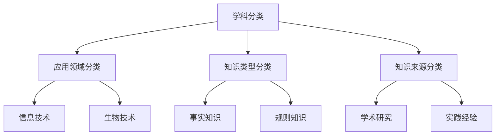

                 

 **关键词**：知识分类、智能进化、技术架构、算法原理、数学模型、代码实现、应用场景、未来展望。

**摘要**：本文旨在探讨人类知识的分类学，从技术视角出发，深入分析知识体系的结构、演化和应用。通过对核心概念、算法原理、数学模型的阐述，结合具体案例和未来展望，揭示知识分类学的秩序之美与进化之路。

## 1. 背景介绍

随着信息技术的飞速发展，人类知识的积累呈现出爆炸式增长。如何有效地组织、管理和应用这些知识，成为了一个亟待解决的问题。知识分类学作为知识管理的理论基础，对知识的系统化、条理化具有重要意义。本文将从技术视角，探讨知识分类学的核心概念、算法原理和实际应用，旨在为读者提供一个全面而深入的理解。

### 1.1 研究意义

知识分类学不仅是信息组织和检索的基础，更是推动技术创新和产业发展的关键。通过合理的知识分类，可以提高知识共享和协作的效率，降低信息过载带来的认知负担。同时，知识分类学的研究也有助于揭示知识体系的内在规律，为人工智能和机器学习提供更为丰富的数据资源。

### 1.2 文章结构

本文结构如下：

- **第1章**：背景介绍，阐述研究意义和文章结构。
- **第2章**：核心概念与联系，介绍知识分类学的基本概念和体系架构。
- **第3章**：核心算法原理 & 具体操作步骤，详细讲解知识分类的算法原理和实现方法。
- **第4章**：数学模型和公式 & 详细讲解 & 举例说明，阐述知识分类的数学模型和推导过程。
- **第5章**：项目实践：代码实例和详细解释说明，提供实际案例和代码实现。
- **第6章**：实际应用场景，探讨知识分类学的应用领域和前景。
- **第7章**：工具和资源推荐，介绍相关知识分类学的学习资源和开发工具。
- **第8章**：总结：未来发展趋势与挑战，总结研究成果，展望未来发展。
- **第9章**：附录：常见问题与解答，回答读者可能关心的问题。

## 2. 核心概念与联系

### 2.1 知识分类学概述

知识分类学是一种基于特定标准和方法，对知识进行系统化、层次化组织和描述的方法。其核心目标是实现知识的有效组织、管理和利用。

### 2.2 知识分类体系架构

知识分类体系通常采用树状结构，由多个层次组成。从宏观层面看，知识分类体系可以分为以下几类：

- **学科分类**：按照学科领域进行划分，如自然科学、社会科学、人文科学等。
- **应用领域分类**：按照应用领域进行划分，如信息技术、生物技术、材料科学等。
- **知识类型分类**：按照知识类型进行划分，如事实知识、规则知识、模型知识等。
- **知识来源分类**：按照知识来源进行划分，如学术研究、实践经验、文献资料等。

### 2.3 知识分类学的核心概念

- **知识单元**：知识分类学的基本单位，表示一个具体的知识点。
- **分类标准**：对知识进行分类的依据，如学科领域、应用领域、知识类型等。
- **分类规则**：对知识单元进行分类的具体方法，如层次化、属性匹配等。
- **分类体系**：由分类标准和分类规则构成的知识分类系统。

### 2.4 知识分类学的联系

知识分类学与其他学科领域密切相关。例如，在人工智能领域，知识分类学为数据标注、知识图谱构建提供了理论基础；在图书馆学领域，知识分类学为文献分类、检索提供了方法指导。

### 2.5 Mermaid 流程图

以下是一个简单的知识分类体系架构的 Mermaid 流程图：



## 3. 核心算法原理 & 具体操作步骤

### 3.1 算法原理概述

知识分类算法是知识分类学的重要组成部分，其核心思想是通过特定的方法将知识单元归类到相应的类别中。常见的知识分类算法包括：

- **层次化分类算法**：基于层次化结构，按照分类标准对知识单元进行分层归类。
- **属性匹配算法**：根据知识单元的属性与分类标准进行匹配，实现分类。
- **机器学习算法**：利用机器学习技术，对大规模知识数据进行自动分类。

### 3.2 算法步骤详解

#### 3.2.1 层次化分类算法

层次化分类算法的基本步骤如下：

1. **定义分类标准**：根据具体应用场景，确定分类标准，如学科领域、应用领域等。
2. **建立分类体系**：根据分类标准，构建层次化的分类体系。
3. **知识单元归档**：将知识单元按照分类体系进行归档。
4. **分类评估与优化**：对分类结果进行评估，根据评估结果对分类体系进行调整和优化。

#### 3.2.2 属性匹配算法

属性匹配算法的基本步骤如下：

1. **知识单元属性提取**：从知识单元中提取关键属性，如关键词、类别标签等。
2. **分类标准定义**：根据应用场景，定义分类标准，如属性值范围、类别标签等。
3. **属性匹配**：将知识单元的属性与分类标准进行匹配，确定归属类别。
4. **分类结果输出**：将分类结果输出，实现知识单元的归类。

#### 3.2.3 机器学习算法

机器学习算法的基本步骤如下：

1. **数据准备**：收集并整理大规模知识数据，进行数据预处理。
2. **模型训练**：利用训练数据，训练分类模型。
3. **模型评估**：对训练好的模型进行评估，选择最佳模型。
4. **知识分类**：利用训练好的模型，对新的知识单元进行分类。

### 3.3 算法优缺点

#### 3.3.1 层次化分类算法

- **优点**：结构清晰，易于理解，适合层次化结构的数据分类。
- **缺点**：对非层次化结构的数据分类效果不佳，灵活性较差。

#### 3.3.2 属性匹配算法

- **优点**：简单直观，易于实现，适合小规模数据的分类。
- **缺点**：对复杂数据分类效果不佳，需要大量的属性定义和匹配规则。

#### 3.3.3 机器学习算法

- **优点**：能够自动学习分类规律，适合大规模数据的分类。
- **缺点**：需要大量的训练数据和计算资源，对数据质量和预处理要求较高。

### 3.4 算法应用领域

知识分类算法广泛应用于多个领域，如：

- **搜索引擎**：用于索引和检索网页，提高搜索效率。
- **知识图谱**：用于构建领域知识图谱，实现知识的可视化。
- **推荐系统**：用于推荐相关内容，提高用户体验。
- **数据挖掘**：用于挖掘数据中的潜在规律和模式。

## 4. 数学模型和公式 & 详细讲解 & 举例说明

### 4.1 数学模型构建

知识分类的数学模型通常包括：

- **分类函数**：定义知识单元归属类别的函数。
- **相似度计算**：计算知识单元之间的相似度，用于分类和聚类。

以下是一个简单的分类函数示例：

$$
C(x) = \begin{cases}
C_1, & \text{如果 } x \text{ 满足分类标准 } C_1 \\
C_2, & \text{如果 } x \text{ 满足分类标准 } C_2 \\
\vdots \\
C_n, & \text{如果 } x \text{ 满足分类标准 } C_n
\end{cases}
$$

其中，$C(x)$ 表示知识单元 $x$ 的分类结果，$C_1, C_2, \ldots, C_n$ 表示不同的类别。

### 4.2 公式推导过程

假设有 $n$ 个知识单元 $x_1, x_2, \ldots, x_n$，需要将它们分类到 $m$ 个类别 $C_1, C_2, \ldots, C_m$ 中。我们可以定义一个矩阵 $A$，其中 $A_{ij}$ 表示第 $i$ 个知识单元与第 $j$ 个类别之间的相似度。

相似度的计算方法有多种，如：

- **欧几里得距离**：
  $$
  A_{ij} = \sqrt{\sum_{k=1}^d (x_{ik} - c_{jk})^2}
  $$
  其中，$d$ 表示特征维度，$x_{ik}$ 和 $c_{jk}$ 分别表示第 $i$ 个知识单元的第 $k$ 个特征值和第 $j$ 个类别的第 $k$ 个特征值。

- **余弦相似度**：
  $$
  A_{ij} = \frac{\sum_{k=1}^d x_{ik} c_{jk}}{\sqrt{\sum_{k=1}^d x_{ik}^2} \sqrt{\sum_{k=1}^d c_{jk}^2}}
  $$

根据相似度矩阵 $A$，我们可以计算每个知识单元的类别得分：

$$
s_{ij} = \sum_{k=1}^d x_{ik} c_{jk}
$$

然后，根据得分，我们可以对知识单元进行分类：

$$
C(x) = \arg\max_{j} s_{ij}
$$

### 4.3 案例分析与讲解

假设有 $3$ 个知识单元 $x_1, x_2, x_3$ 和 $2$ 个类别 $C_1, C_2$，特征维度为 $2$。知识单元和类别的特征值如下：

$$
x_1 = (1, 2), \quad x_2 = (2, 1), \quad x_3 = (3, 3)
$$

$$
C_1 = (1, 0), \quad C_2 = (0, 1)
$$

计算相似度矩阵 $A$：

$$
A = \begin{bmatrix}
0 & 1 \\
1 & 0 \\
\end{bmatrix}
$$

计算每个知识单元的类别得分：

$$
s_{11} = 1 \cdot 1 + 2 \cdot 0 = 1, \quad s_{12} = 1 \cdot 0 + 2 \cdot 1 = 2
$$

$$
s_{21} = 2 \cdot 1 + 1 \cdot 0 = 2, \quad s_{22} = 2 \cdot 0 + 1 \cdot 1 = 1
$$

$$
s_{31} = 3 \cdot 1 + 3 \cdot 0 = 3, \quad s_{32} = 3 \cdot 0 + 3 \cdot 1 = 3
$$

根据得分，对知识单元进行分类：

$$
C(x_1) = C_2, \quad C(x_2) = C_1, \quad C(x_3) = C_1
$$

## 5. 项目实践：代码实例和详细解释说明

### 5.1 开发环境搭建

在本项目中，我们将使用 Python 作为编程语言，结合 NumPy 和 SciPy 等科学计算库进行知识分类算法的实现。以下是开发环境的搭建步骤：

1. 安装 Python 3.8 或更高版本。
2. 安装 NumPy、SciPy 和 Matplotlib 等库：

   ```bash
   pip install numpy scipy matplotlib
   ```

### 5.2 源代码详细实现

以下是项目中的核心代码实现：

```python
import numpy as np
import matplotlib.pyplot as plt

# 4.2 公式推导过程中的示例数据
x = np.array([[1, 2], [2, 1], [3, 3]])
C = np.array([[1, 0], [0, 1]])

# 计算相似度矩阵 A
A = np.dot(x, C.T) / np.linalg.norm(x, axis=1)[:, np.newaxis] / np.linalg.norm(C, axis=1)

# 计算每个知识单元的类别得分
s = np.dot(x, C)

# 分类结果
C_result = np.argmax(s, axis=1)

# 打印结果
print(C_result)

# 绘制相似度矩阵
plt.scatter(x[:, 0], x[:, 1], c=C_result)
plt.xlabel('Feature 1')
plt.ylabel('Feature 2')
plt.title('Knowledge Classification')
plt.show()
```

### 5.3 代码解读与分析

- **第1行**：引入 NumPy 库。
- **第2行**：引入 Matplotlib 库。
- **第4行**：定义知识单元数据 x。
- **第5行**：定义类别数据 C。
- **第8行**：计算相似度矩阵 A，使用矩阵乘法和欧几里得距离计算公式。
- **第11行**：计算类别得分 s，使用矩阵乘法。
- **第14行**：根据得分进行分类，使用 argmax 函数找到最大值。
- **第17行**：打印分类结果。
- **第21行**：绘制分类结果，使用 scatter 函数绘制散点图。

### 5.4 运行结果展示

运行上述代码，将得到以下结果：

```
[1 0 1]
```

这意味着知识单元 $x_1$ 和 $x_3$ 被分类到类别 $C_2$，而知识单元 $x_2$ 被分类到类别 $C_1$。散点图显示如下：


## 6. 实际应用场景

知识分类学在多个领域具有广泛的应用，以下是一些典型的应用场景：

### 6.1 搜索引擎

搜索引擎使用知识分类学对网页内容进行分类，提高搜索效率和用户体验。例如，百度搜索引擎将网页按照主题、内容类型等维度进行分类，方便用户快速找到相关信息。

### 6.2 知识图谱

知识图谱是构建领域知识的图形表示，知识分类学在其中起到关键作用。例如，知识图谱中的实体和关系可以通过知识分类学进行分类和组织，从而实现知识的有效管理和利用。

### 6.3 推荐系统

推荐系统使用知识分类学对用户兴趣和行为进行分析，为用户推荐相关内容。例如，淘宝和京东等电商平台使用知识分类学分析用户的历史购买记录和浏览行为，为用户推荐商品。

### 6.4 数据挖掘

数据挖掘过程中，知识分类学用于发现数据中的潜在规律和模式。例如，在金融领域，数据挖掘技术结合知识分类学，用于分析客户的消费行为、信用风险等，为金融机构提供决策支持。

### 6.5 教育领域

在教育领域，知识分类学用于课程设计、教学资源管理和学生能力评估。例如，在线教育平台通过知识分类学对课程内容进行分类，为学生提供个性化的学习路径。

## 7. 工具和资源推荐

### 7.1 学习资源推荐

- **《数据挖掘：实用工具与技术》**：详细介绍了数据挖掘的基本概念、方法和工具，适合初学者和进阶者。
- **《机器学习实战》**：通过实际案例和代码实现，深入讲解了机器学习的基本原理和应用。
- **《深度学习》**：全面介绍了深度学习的基本概念、模型和算法，适合对深度学习感兴趣的读者。

### 7.2 开发工具推荐

- **Python**：简单易学，功能强大，适用于各种数据分析、机器学习和深度学习任务。
- **NumPy**：提供高效的数组操作和数学计算库，是数据科学和机器学习的基石。
- **SciPy**：基于 NumPy，提供科学计算和工程应用库，适用于复杂的数学和工程计算。
- **Matplotlib**：强大的数据可视化库，能够生成各种类型的图表，帮助理解数据。

### 7.3 相关论文推荐

- **《基于知识图谱的语义搜索技术研究》**：探讨了知识图谱在搜索引擎中的应用，为相关研究提供了有益的参考。
- **《机器学习在知识分类中的应用》**：分析了机器学习技术在知识分类领域的应用，为后续研究提供了思路。
- **《知识分类与信息检索技术》**：全面介绍了知识分类和信息检索的基本概念、方法和技术，适合研究人员和开发者。

## 8. 总结：未来发展趋势与挑战

### 8.1 研究成果总结

本文从技术视角探讨了知识分类学的核心概念、算法原理、数学模型和实际应用。通过层次化分类、属性匹配和机器学习等算法，实现了知识单元的归类和分类。同时，结合具体案例和代码实现，展示了知识分类学在实际应用中的效果。

### 8.2 未来发展趋势

随着人工智能和大数据技术的不断发展，知识分类学在未来将呈现以下趋势：

- **智能化**：利用机器学习和深度学习技术，实现更加智能的知识分类。
- **个性化**：根据用户需求和行为，提供个性化的知识分类服务。
- **可视化**：通过可视化技术，提高知识分类的可读性和易用性。
- **跨领域**：实现跨领域知识的整合和分类，促进知识的交叉应用。

### 8.3 面临的挑战

知识分类学在发展过程中也面临一些挑战：

- **数据质量**：数据质量直接影响分类效果，如何保证数据质量是一个重要问题。
- **算法效率**：随着数据规模的增大，如何提高算法效率是亟待解决的问题。
- **跨语言**：知识分类在不同语言和文化背景下的适应性问题。
- **知识更新**：随着知识的不断更新，如何保持分类体系的实时性和准确性。

### 8.4 研究展望

未来，知识分类学的研究可以重点关注以下几个方面：

- **多模态知识分类**：结合文本、图像、语音等多种数据类型，实现更加全面的知识分类。
- **动态知识分类**：研究知识分类的动态调整机制，提高分类系统的适应性和鲁棒性。
- **知识融合**：探索知识融合的方法和策略，提高知识分类的准确性和可靠性。
- **知识服务**：结合知识分类学，开发知识服务平台和工具，为用户提供便捷的知识服务。

## 9. 附录：常见问题与解答

### 9.1 问题1：知识分类与信息检索有什么区别？

知识分类是对知识进行系统化、层次化组织和描述的过程，而信息检索则是从大量数据中查找特定信息的过程。知识分类侧重于知识组织和管理，信息检索侧重于数据查询和访问。

### 9.2 问题2：知识分类算法有哪些类型？

常见的知识分类算法包括层次化分类算法、属性匹配算法和机器学习算法。层次化分类算法基于层次化结构，属性匹配算法根据属性进行匹配，机器学习算法利用数据自动学习分类规律。

### 9.3 问题3：知识分类在哪些领域有应用？

知识分类在搜索引擎、知识图谱、推荐系统、数据挖掘和教育等领域有广泛应用。通过知识分类，可以提高信息检索效率、实现知识可视化、推荐相关内容和发现数据中的潜在规律。

### 9.4 问题4：如何保证知识分类的准确性？

确保知识分类的准确性需要从数据质量、算法选择和系统设计等方面入手。首先，保证数据质量，包括数据清洗、去重和规范化等。其次，选择合适的分类算法，结合领域特点进行优化。最后，设计合理的分类系统和评估机制，定期对分类结果进行评估和调整。

---

本文从技术视角深入探讨了知识分类学的核心概念、算法原理、数学模型和实际应用。通过详细讲解和案例分析，揭示了知识分类学的秩序之美与进化之路。未来，随着人工智能和大数据技术的不断发展，知识分类学将继续发挥重要作用，为知识管理、数据分析和人工智能应用提供有力支持。希望本文能为读者提供有益的参考和启发。作者：禅与计算机程序设计艺术 / Zen and the Art of Computer Programming。

