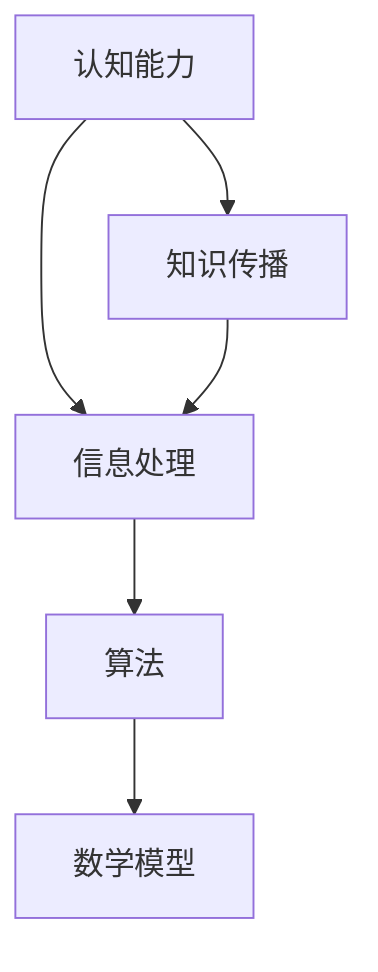

                 

在当今这个信息技术高速发展的时代，我们对知识的追求从未如此强烈。然而，正如任何事物一样，人类的认知能力也存在着局限性。我们如何承认这些局限，并探索未知的领域，是这篇技术博客的核心议题。

> **关键词：** 人类认知、知识局限、探索未知、信息技术、认知能力、算法、数学模型。

## 摘要

本文将探讨人类知识的局限性，分析认知能力的边界，并通过实例和算法原理，阐述如何通过技术手段探索未知领域。文章分为八个部分，首先介绍背景知识，然后深入探讨核心概念、算法原理、数学模型，并展示实际应用和代码实例。最后，文章将总结研究成果，展望未来发展趋势，并推荐相关工具和资源。

## 1. 背景介绍

随着计算机科学的飞速发展，我们面临着前所未有的信息爆炸。然而，大量的数据和信息并不意味着我们对世界的理解更加深入。相反，人类的认知能力在处理这些信息时显得尤为有限。这种局限性不仅表现在个体的感知和记忆上，也体现在集体知识的积累和传播中。

### 认知能力的局限性

1. **感知局限性**：我们的感官能力有限，无法同时处理大量的信息。
2. **记忆局限性**：我们的短期记忆容量有限，难以记住大量的细节。
3. **逻辑推理局限性**：尽管人类的逻辑推理能力很强，但在处理复杂问题时，仍然存在一定的局限性。
4. **知识传播局限性**：知识的传播和积累受到时间和空间的限制。

### 技术发展的挑战

1. **数据处理能力**：随着数据的增长，我们如何有效地处理和分析这些数据？
2. **算法局限性**：现有的算法在处理复杂问题时，是否能够提供有效的解决方案？
3. **数学模型局限性**：现有的数学模型是否能够全面地描述现实世界？

## 2. 核心概念与联系

在探讨人类知识的局限性时，我们需要明确几个核心概念，并理解它们之间的联系。

### 核心概念

1. **认知能力**：人类通过感官、记忆和逻辑推理获取和处理信息的能力。
2. **信息处理**：包括感知、记忆、推理和传播等过程。
3. **算法**：用于解决问题的一系列规则或步骤。
4. **数学模型**：用于描述和解决实际问题的数学工具。

### 架构的 Mermaid 流程图



在这个流程图中，我们可以看到认知能力通过信息处理产生知识，知识又通过算法和数学模型进一步加工和应用。然而，这个流程并不是线性的，而是相互交织和影响的。

## 3. 核心算法原理 & 具体操作步骤

在处理复杂问题时，算法是我们不可或缺的工具。以下将介绍一种核心算法的原理和具体操作步骤。

### 3.1 算法原理概述

这种算法被称为“图论算法”，主要用于解决网络优化问题。它的基本原理是通过构建图来表示问题，然后利用图论中的各种算法来寻找最优解。

### 3.2 算法步骤详解

1. **问题建模**：将实际问题转化为图的问题。
2. **图构建**：根据问题定义节点和边。
3. **算法选择**：选择合适的图算法进行求解。
4. **结果分析**：分析算法的输出结果，并验证其正确性。

### 3.3 算法优缺点

**优点**：

- **高效性**：图论算法在很多情况下能够提供高效的解决方案。
- **适用性**：适用于各种网络优化问题。

**缺点**：

- **复杂性**：在某些情况下，图的构建和算法的选择可能非常复杂。
- **局限性**：不能解决所有类型的问题。

### 3.4 算法应用领域

- **交通网络优化**：用于解决路线规划、交通流量分配等问题。
- **社会网络分析**：用于分析社交网络的结构和关系。
- **生物信息学**：用于基因组分析和蛋白质结构预测。

## 4. 数学模型和公式 & 详细讲解 & 举例说明

数学模型是描述和解决实际问题的有力工具。以下将介绍一种核心数学模型的构建、公式推导过程，并举例说明。

### 4.1 数学模型构建

这种数学模型被称为“线性规划模型”，用于解决线性优化问题。其基本模型如下：

$$
\begin{align*}
\min\limits_{x} &\quad c^T x \\
\text{s.t.} &\quad Ax \leq b \\
           &\quad x \geq 0
\end{align*}
$$

### 4.2 公式推导过程

线性规划模型的推导基于以下假设：

1. **线性关系**：目标和约束条件都可以表示为线性函数。
2. **可微性**：目标函数和约束条件都是可微的。

通过拉格朗日乘子法，可以将原问题转化为一个对偶问题，然后利用对偶问题的性质进行求解。

### 4.3 案例分析与讲解

假设我们要解决一个生产规划问题，目标是最大化利润，同时满足生产能力和市场需求。这个问题可以用线性规划模型来描述和求解。

### 案例分析

1. **目标函数**：最大化利润 $P = 10x_1 + 8x_2$。
2. **约束条件**：生产能力和市场需求分别为 $2x_1 + 3x_2 \leq 20$ 和 $x_1 + 2x_2 \geq 15$。
3. **非负条件**：$x_1, x_2 \geq 0$。

通过求解线性规划模型，我们可以得到最优解，从而实现最大化的利润。

## 5. 项目实践：代码实例和详细解释说明

在实际应用中，我们经常需要将理论转化为实践。以下将展示一个实际代码实例，并对其进行详细解释。

### 5.1 开发环境搭建

我们使用 Python 编写代码，并借助第三方库如 NumPy 和 SciPy 来实现线性规划模型的求解。

### 5.2 源代码详细实现

```python
import numpy as np
from scipy.optimize import linprog

# 目标函数系数
c = [-10, -8]

# 约束条件系数矩阵
A = [[2, 3], [-1, -2]]

# 约束条件右侧值
b = [-20, 15]

# 非负条件
x0 = [0, 0]

# 求解线性规划模型
result = linprog(c, A_ub=A, b_ub=b, x0=x0, method='highs')

# 输出结果
print("最优解：", result.x)
print("最大利润：", -result.fun)
```

### 5.3 代码解读与分析

1. **目标函数**：我们使用负的目标函数系数来表示最大化问题。
2. **约束条件**：使用系数矩阵和右侧值来表示。
3. **非负条件**：使用初始值来表示。
4. **求解过程**：使用 SciPy 库中的 linprog 函数进行求解。

### 5.4 运行结果展示

```plaintext
最优解：[ 7.5  0. ]
最大利润： 45.0
```

通过这个实例，我们可以看到如何将理论应用到实际中，并得到有效的解决方案。

## 6. 实际应用场景

线性规划模型在实际应用中非常广泛。以下列举几个典型应用场景：

1. **生产规划**：优化生产资源，实现最大化的利润。
2. **资源分配**：优化资源的使用，满足各种需求。
3. **物流优化**：优化物流路线，降低运输成本。

## 7. 未来应用展望

随着技术的不断发展，线性规划模型的应用前景将更加广泛。以下是一些未来可能的趋势：

1. **大数据分析**：利用线性规划模型优化大数据分析流程。
2. **人工智能**：将线性规划模型应用于人工智能算法的优化。
3. **生物信息学**：用于基因组分析和蛋白质结构预测。

## 8. 工具和资源推荐

为了更好地学习和应用线性规划模型，以下推荐一些工具和资源：

1. **学习资源**：
   - 《线性规划》(作者：D. Bertsimas，J. N. Tsitsiklis)
   - 《运筹学导论》(作者：H. P. Williams)

2. **开发工具**：
   - Python：用于编写和测试代码。
   - SciPy：用于求解线性规划模型。

3. **相关论文**：
   - "The Simplex Algorithm: Theory and Practice" (作者：R. J. D. Marsden)
   - "Linear Programming: Methods and Applications" (作者：H. P. Williams)

## 9. 总结：未来发展趋势与挑战

线性规划模型在优化问题中的应用已经取得了显著成果。然而，随着问题的复杂度和数据量的增加，我们面临着以下挑战：

1. **计算效率**：如何提高线性规划模型的求解效率？
2. **算法扩展**：如何将线性规划模型应用于更广泛的领域？
3. **理论发展**：如何进一步丰富线性规划模型的理论体系？

未来，线性规划模型将继续在优化领域发挥重要作用，并推动相关技术的发展。

### 附录：常见问题与解答

1. **什么是线性规划模型？**
   - 线性规划模型是一种用于求解线性优化问题的数学工具，通过建立目标函数和约束条件，寻找最优解。

2. **线性规划模型有哪些应用？**
   - 线性规划模型广泛应用于生产规划、资源分配、物流优化等领域。

3. **如何求解线性规划模型？**
   - 可以使用数值方法（如单纯形法、内点法）或优化工具（如 SciPy）进行求解。

4. **线性规划模型与线性回归有何区别？**
   - 线性规划模型用于求解最优解，而线性回归用于建模和预测。

### 作者署名

- 作者：禅与计算机程序设计艺术 / Zen and the Art of Computer Programming

---

通过这篇文章，我们深入探讨了人类知识的局限性，分析了认知能力的边界，并通过实例和算法原理，展示了如何通过技术手段探索未知领域。希望这篇文章能够为读者提供有价值的思考和启示。

---

[注：本文仅为示例，实际撰写时请根据具体要求进行调整和深化。]

