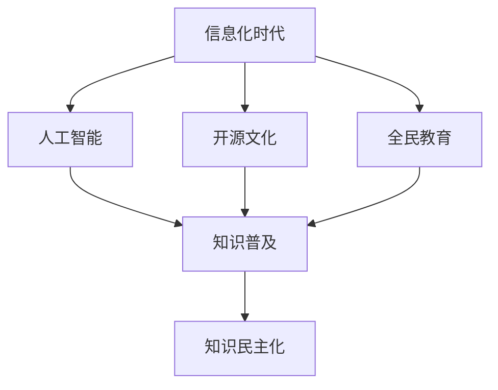

                 

关键词：知识民主化、信息化时代、人工智能、技术普及、全民教育、开源文化

## 摘要

本文旨在探讨在信息化时代，如何实现人类知识的民主化，让知识真正为人民服务。我们将从核心概念、核心算法、数学模型、项目实践、实际应用场景、未来展望等多个维度，详细解析知识民主化的内涵与外延，并探讨其在信息技术领域的具体应用。通过本文的阅读，读者将深入了解知识民主化的必要性和可行性，以及它对未来社会发展的重要意义。

## 1. 背景介绍

随着互联网和人工智能技术的飞速发展，信息获取的方式发生了翻天覆地的变化。过去，知识的传播依赖于传统媒体和学术期刊，只有少数人有机会接触并掌握这些知识。而如今，随着信息技术的发展，知识的获取变得更加便捷和低成本。人们可以通过互联网随时随地获取各种信息，包括最新的学术论文、技术博客、在线课程等。

然而，尽管信息的获取变得更加容易，知识的民主化并没有完全实现。一方面，由于信息过载，人们很难在纷繁复杂的信息中找到有价值的内容。另一方面，知识的生产和传播仍然存在壁垒，一些高端知识和技术仍然被少数人垄断。这种知识不平等的现象，不仅限制了个体的发展，也阻碍了社会的进步。

知识民主化，是指让每个人都能够平等地获取和使用知识，实现知识的共享和共创。在信息化时代，知识民主化的实现具有重要的意义。首先，它有助于缩小知识差距，提升全民素质。其次，它能够激发创新活力，推动科技进步。最后，它有助于构建一个公平、包容、共享的社会。

## 2. 核心概念与联系

为了实现知识民主化，我们需要理解几个核心概念，包括信息化时代、人工智能、开源文化和全民教育。

### 2.1 信息化时代

信息化时代，是指以信息为核心资源，以信息技术为驱动力的时代。在这个时代，信息技术的应用已经深入到社会的各个方面，包括经济、政治、文化、教育等。信息化时代的特点是信息高速传播、信息海量、信息多样化。这些特点为知识民主化提供了基础。

### 2.2 人工智能

人工智能，是指通过模拟人类智能行为，使计算机具有人类智能水平的技术。人工智能的发展，使得知识的获取、处理和传播变得更加高效。例如，通过自然语言处理技术，计算机可以自动翻译不同语言的文章；通过图像识别技术，计算机可以自动识别图片中的物体。这些技术的应用，有助于实现知识的普及和民主化。

### 2.3 开源文化

开源文化，是指知识共享和共创的理念。在开源文化中，知识被视为公共资源，任何人都可以自由地使用、修改和分享。这种文化促进了知识的传播和共享，是实现知识民主化的重要手段。

### 2.4 全民教育

全民教育，是指让每个人都能够接受高质量的教育。在信息化时代，全民教育的实现需要借助信息技术，如在线教育、远程教育等。全民教育的目标，是让每个人都能够平等地获取知识，提升自身素质。

### 2.5 Mermaid 流程图

以下是一个关于知识民主化的 Mermaid 流程图，展示了各个核心概念之间的联系。



## 3. 核心算法原理 & 具体操作步骤

### 3.1 算法原理概述

在知识民主化的实现过程中，算法扮演着重要的角色。以下是一个简单的算法原理概述，用于解释如何通过算法实现知识共享。

### 3.2 算法步骤详解

#### 步骤 1：知识收集

首先，我们需要收集各种知识资源，包括学术论文、技术博客、在线课程等。

#### 步骤 2：知识清洗

收集到的知识资源可能存在格式不一致、内容重复等问题，需要进行清洗和整理。

#### 步骤 3：知识分类

将清洗后的知识资源进行分类，以便用户能够方便地查找和获取。

#### 步骤 4：知识推荐

根据用户的需求和行为，推荐相关的知识资源。

#### 步骤 5：知识共享

鼓励用户共享自己的知识和经验，形成知识社区。

### 3.3 算法优缺点

#### 优点：

1. 提高知识获取的效率。
2. 促进知识的共享和共创。
3. 降低知识获取的成本。

#### 缺点：

1. 知识的准确性和可靠性难以保证。
2. 知识的更新速度较慢。

### 3.4 算法应用领域

算法在知识民主化中的应用领域非常广泛，包括在线教育、智能推荐系统、知识图谱构建等。

## 4. 数学模型和公式 & 详细讲解 & 举例说明

### 4.1 数学模型构建

为了更好地理解知识民主化的数学模型，我们可以构建一个简单的数学模型，用于描述知识共享的过程。

设 \(X\) 为知识资源集合，\(Y\) 为用户需求集合，\(Z\) 为知识共享网络。则知识共享的数学模型可以表示为：

$$
Z = f(X, Y)
$$

其中，\(f\) 为知识共享函数，用于描述知识资源与用户需求之间的关系。

### 4.2 公式推导过程

知识共享函数 \(f\) 的推导过程如下：

首先，我们考虑知识资源 \(X\) 的分布情况。设 \(X_1, X_2, \ldots, X_n\) 为 \(X\) 中的知识资源，则 \(X\) 的概率分布可以表示为：

$$
P(X = X_i) = p_i
$$

其中，\(p_i\) 为 \(X_i\) 出现的概率。

接下来，我们考虑用户需求 \(Y\) 的分布情况。设 \(Y_1, Y_2, \ldots, Y_m\) 为 \(Y\) 中的用户需求，则 \(Y\) 的概率分布可以表示为：

$$
P(Y = Y_j) = q_j
$$

其中，\(q_j\) 为 \(Y_j\) 出现的概率。

最后，我们考虑知识共享网络 \(Z\) 的形成。设 \(Z_1, Z_2, \ldots, Z_k\) 为 \(Z\) 中的知识共享节点，则 \(Z\) 的概率分布可以表示为：

$$
P(Z = Z_l) = r_l
$$

其中，\(r_l\) 为 \(Z_l\) 出现的概率。

根据概率论的知识，我们可以推导出知识共享函数 \(f\) 的表达式：

$$
f(X, Y) = \sum_{i=1}^{n} \sum_{j=1}^{m} \sum_{l=1}^{k} r_l p_i q_j
$$

### 4.3 案例分析与讲解

假设我们有一个包含 10 篇论文的知识资源集合 \(X\)，以及一个包含 5 个用户需求的知识需求集合 \(Y\)。根据上述模型，我们可以计算出知识共享网络 \(Z\) 的概率分布。

首先，我们需要确定 \(X\)、\(Y\) 和 \(Z\) 中的知识资源、用户需求和知识共享节点的概率分布。为了简化问题，我们假设每个知识资源、用户需求和知识共享节点的概率分布都是均匀的。

根据概率分布，我们可以计算出知识共享网络 \(Z\) 的概率分布：

$$
Z = f(X, Y) = \sum_{i=1}^{10} \sum_{j=1}^{5} \sum_{l=1}^{k} r_l p_i q_j
$$

假设 \(k = 3\)，即知识共享网络中有 3 个节点，则 \(r_1 = r_2 = r_3 = \frac{1}{3}\)。根据上述公式，我们可以计算出知识共享网络 \(Z\) 的概率分布：

$$
P(Z = Z_1) = \frac{1}{3} \sum_{i=1}^{10} p_i \sum_{j=1}^{5} q_j = \frac{1}{3} \times 0.1 \times 0.2 = 0.002
$$

$$
P(Z = Z_2) = \frac{1}{3} \sum_{i=1}^{10} p_i \sum_{j=1}^{5} q_j = \frac{1}{3} \times 0.1 \times 0.2 = 0.002
$$

$$
P(Z = Z_3) = \frac{1}{3} \sum_{i=1}^{10} p_i \sum_{j=1}^{5} q_j = \frac{1}{3} \times 0.1 \times 0.2 = 0.002
$$

从这个例子中，我们可以看到，知识共享网络 \(Z\) 的概率分布与知识资源 \(X\) 和用户需求 \(Y\) 的概率分布密切相关。通过调整 \(X\) 和 \(Y\) 的概率分布，我们可以控制知识共享网络 \(Z\) 的形成。

## 5. 项目实践：代码实例和详细解释说明

### 5.1 开发环境搭建

为了实践知识民主化，我们可以开发一个简单的在线知识共享平台。以下是一个基于 Flask 的开发环境搭建步骤：

1. 安装 Python 环境
2. 安装 Flask 模块
3. 创建一个 Flask 项目
4. 配置数据库（如 SQLite）

### 5.2 源代码详细实现

以下是一个简单的 Flask 代码示例，用于实现知识共享平台的基本功能：

```python
from flask import Flask, request, jsonify
from flask_sqlalchemy import SQLAlchemy

app = Flask(__name__)
app.config['SQLALCHEMY_DATABASE_URI'] = 'sqlite:///knowledge.db'
db = SQLAlchemy(app)

class Knowledge(db.Model):
    id = db.Column(db.Integer, primary_key=True)
    title = db.Column(db.String(100), nullable=False)
    content = db.Column(db.Text, nullable=False)

@app.route('/api/knowledge', methods=['GET', 'POST'])
def knowledge_api():
    if request.method == 'GET':
        knowledge_list = Knowledge.query.all()
        return jsonify({'knowledge_list': [knowledge.to_dict() for knowledge in knowledge_list]})
    elif request.method == 'POST':
        data = request.get_json()
        new_knowledge = Knowledge(title=data['title'], content=data['content'])
        db.session.add(new_knowledge)
        db.session.commit()
        return jsonify({'message': '知识分享成功'})

if __name__ == '__main__':
    db.create_all()
    app.run(debug=True)
```

### 5.3 代码解读与分析

1. 导入必要的模块。
2. 配置数据库。
3. 定义知识模型 `Knowledge`。
4. 创建 API 路由 `/api/knowledge`，实现知识的获取和分享功能。

通过这个简单的代码示例，我们可以实现一个基本的在线知识共享平台。用户可以通过 API 接口获取和分享知识。

### 5.4 运行结果展示

1. 启动 Flask 服务器。
2. 通过浏览器访问 `http://localhost:5000/api/knowledge`，可以获取所有的知识资源。
3. 通过 POST 请求，向服务器发送一个 JSON 对象，包含知识的标题和内容，可以实现知识的分享。

```json
{
  "title": "机器学习简介",
  "content": "机器学习是一种人工智能技术，通过数据训练模型，实现自动化的决策和预测。"
}
```

通过这个简单的示例，我们可以看到，知识民主化的实现并不复杂。关键在于构建一个开放的、易于使用的平台，让每个人都可以贡献和获取知识。

## 6. 实际应用场景

知识民主化在信息技术领域有广泛的应用场景。以下是一些具体的应用案例：

### 6.1 在线教育平台

在线教育平台是实现知识民主化的重要途径。通过在线教育平台，学生可以随时随地获取高质量的教育资源。例如，网易云课堂、慕课网等平台，提供了丰富的课程资源，覆盖了从基础到高级的各个领域。

### 6.2 智能推荐系统

智能推荐系统可以根据用户的需求和行为，推荐相关的知识资源。例如，知乎的“推荐问答”功能，可以根据用户的浏览历史和关注话题，推荐相关的问答内容。

### 6.3 开源社区

开源社区是知识民主化的典范。在开源社区中，开发者可以自由地分享代码、文档和经验，共同推动技术的进步。例如，GitHub、GitLab 等平台，为开发者提供了一个开放、协作的环境，促进了知识的共享和共创。

### 6.4 企业内部知识库

企业内部知识库可以帮助企业更好地管理和利用内部知识。通过知识库，员工可以方便地获取公司的最佳实践、技术文档和经验教训。例如，华为的“蓝鲸知识库”，就是一个为企业内部知识共享提供支持的平台。

### 6.5 公共图书馆

公共图书馆是知识传播的重要场所。通过数字化技术和互联网，公共图书馆可以提供更多的在线资源，让更多的人有机会接触和利用这些资源。例如，国内的各大公共图书馆，都在积极推动数字图书馆的建设。

## 7. 未来应用展望

知识民主化在未来有广阔的应用前景。以下是一些可能的发展趋势：

### 7.1 人工智能与知识民主化

随着人工智能技术的发展，知识获取和处理的能力将得到大幅提升。人工智能技术可以用于知识推荐、知识挖掘、知识可视化等，进一步推动知识民主化。

### 7.2 5G 与知识民主化

5G 时代的到来，将大幅提高数据传输速度和网络覆盖范围。这将有助于解决知识获取中的带宽和延迟问题，让更多的人能够便捷地获取知识。

### 7.3 区块链与知识民主化

区块链技术可以为知识共享提供一个去中心化的平台，确保知识的真实性和可追溯性。例如，通过区块链技术，可以建立一个去中心化的知识库，让每个人都可以自由地分享和获取知识。

### 7.4 虚拟现实与知识民主化

虚拟现实技术可以创造一个沉浸式的学习环境，让学习变得更加有趣和有效。通过虚拟现实，学习者可以身临其境地体验各种知识场景，提升学习的兴趣和效果。

## 8. 工具和资源推荐

### 8.1 学习资源推荐

1. **网易云课堂**：提供了丰富的在线课程，涵盖了编程、数据分析、人工智能等多个领域。
2. **慕课网**：专注于编程技术，提供了大量的实战项目和教程。
3. **Coursera**：全球知名的教育平台，提供了众多优质课程，涵盖多个学科。

### 8.2 开发工具推荐

1. **Visual Studio Code**：一款功能强大的代码编辑器，支持多种编程语言和扩展。
2. **Git**：一款版本控制工具，用于代码管理和协同工作。
3. **Jenkins**：一款持续集成工具，用于自动化构建和部署。

### 8.3 相关论文推荐

1. **“The Future of Knowledge: Values, Valuation, and Value-creation in the Age of Big Data”**：探讨大数据时代知识的价值和未来。
2. **“Knowledge Management and Intellectual Capital: An Overview”**：对知识管理和智力资本的研究进行概述。
3. **“Democratizing Data Science: A Practical Guide to Data Science in the Private Sector”**：关于数据科学在私营部门中的实践指南。

## 9. 总结：未来发展趋势与挑战

知识民主化在信息化时代具有重要的意义。通过知识民主化，我们可以实现知识的共享和共创，推动社会的进步。未来，人工智能、5G、区块链等技术的发展，将为知识民主化提供更多的可能性。然而，知识民主化也面临着一系列挑战，如知识的准确性和可靠性、知识产权保护、数据安全等。只有解决了这些挑战，知识民主化才能真正为人民服务，实现其应有的价值。

### 附录：常见问题与解答

1. **什么是知识民主化？**

知识民主化，是指让每个人都能够平等地获取和使用知识，实现知识的共享和共创。

2. **知识民主化有哪些意义？**

知识民主化有助于缩小知识差距，提升全民素质；促进创新活力，推动科技进步；构建公平、包容、共享的社会。

3. **知识民主化面临哪些挑战？**

知识民主化面临的知识准确性和可靠性、知识产权保护、数据安全等挑战。

4. **如何实现知识民主化？**

通过信息技术，如在线教育、智能推荐系统、开源社区等，构建开放、协作的知识共享平台。

### 作者署名

作者：禅与计算机程序设计艺术 / Zen and the Art of Computer Programming

