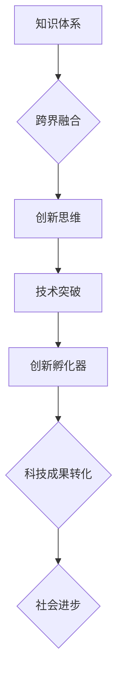

                 

关键词：人类知识，跨界融合，创新孵化器，技术发展，思维拓展

摘要：本文探讨了人类知识跨界融合的重要性，以及创新孵化器在其中所发挥的关键作用。通过分析人类知识体系的发展历程，探讨了跨界融合对推动科技进步、激发创新思维的影响。同时，本文从实际案例出发，阐述了创新孵化器在跨领域知识融合中的应用，以及未来发展趋势与挑战。

## 1. 背景介绍

随着信息技术的迅猛发展，人类社会正经历着前所未有的变革。数据量爆炸式增长、互联网普及、人工智能技术的突破，使得各个领域之间的联系日益紧密。在这种背景下，人类知识的跨界融合成为一种必然趋势。跨界融合不仅有助于激发创新思维，还可以推动技术的突破与发展。

创新孵化器作为促进知识跨界融合的重要载体，承担着培养创新人才、推动科技成果转化的重任。然而，如何有效发挥创新孵化器的作用，成为当前亟待解决的问题。

## 2. 核心概念与联系

为了更好地理解跨界融合的重要性，我们需要首先了解以下几个核心概念：

### 2.1  知识体系

知识体系是指人类在长期发展过程中积累下来的各类知识，包括自然科学、社会科学、人文艺术等。每一个知识体系都有其独特性，但它们之间并非完全孤立，而是相互关联、相互影响。

### 2.2  跨界融合

跨界融合是指将不同领域、不同学科的知识体系相互融合，以产生新的思维方式、新的技术突破。跨界融合的核心在于打破传统思维定式，寻找不同领域之间的共通点，从而实现创新。

### 2.3  创新孵化器

创新孵化器是指为创新项目提供全方位支持的载体，包括资金、技术、人才、市场等方面。创新孵化器的核心在于搭建一个开放的平台，促进知识跨界融合，推动科技成果转化。

下面是核心概念原理和架构的 Mermaid 流程图：



## 3. 核心算法原理 & 具体操作步骤

### 3.1  算法原理概述

跨界融合的核心在于思维模式的转变。传统的思维模式往往局限于某一领域，难以产生突破性的创新。而跨界融合则通过将不同领域的知识相互融合，激发创新思维，从而实现技术的突破与发展。

### 3.2  算法步骤详解

1. **寻找共通点**：首先，需要寻找不同领域之间的共通点，这有助于打破传统思维定式，实现知识跨界融合。

2. **跨领域交流**：通过举办跨领域研讨会、交流活动等形式，促进不同领域专家之间的交流与合作。

3. **创新思维培养**：通过培训、教育等方式，培养跨领域的创新思维，使团队成员具备跨领域知识融合的能力。

4. **实践应用**：将跨界融合的成果应用于实际项目中，不断优化和完善，推动技术突破。

5. **成果转化**：将创新成果进行市场化推广，实现科技成果转化，为社会带来实际价值。

### 3.3  算法优缺点

优点：

- **激发创新思维**：跨界融合有助于打破传统思维定式，激发创新思维。
- **促进技术突破**：通过跨领域知识融合，可以推动技术的突破与发展。
- **提升竞争力**：跨界融合可以提高企业的竞争力，实现可持续发展。

缺点：

- **知识跨度大**：跨界融合需要掌握多个领域的知识，对人才素质要求较高。
- **协调难度大**：不同领域之间的协调难度较大，需要具备一定的组织协调能力。

### 3.4  算法应用领域

跨界融合算法广泛应用于各个领域，如：

- **人工智能与医学**：将人工智能技术应用于医学领域，推动医学影像诊断、疾病预测等方面的技术突破。
- **计算机科学与艺术**：将计算机技术与艺术相结合，推动数字艺术、虚拟现实等领域的发展。
- **经济学与心理学**：将经济学与心理学相结合，推动消费行为分析、市场预测等方面的研究。

## 4. 数学模型和公式 & 详细讲解 & 举例说明

### 4.1  数学模型构建

为了更好地理解跨界融合的数学模型，我们引入一个简单的模型：

假设有两个领域 A 和 B，分别表示两个不同领域的知识。领域 A 和领域 B 之间存在一个融合度 F(A, B)，表示两个领域之间的相互影响程度。融合度 F(A, B) 可以通过以下公式计算：

$$F(A, B) = \frac{A \cap B}{A \cup B}$$

其中，$A \cap B$ 表示领域 A 和领域 B 的交集，$A \cup B$ 表示领域 A 和领域 B 的并集。

### 4.2  公式推导过程

公式推导过程如下：

首先，我们引入集合的概念。假设 A 和 B 是两个集合，A 表示领域 A 的知识集合，B 表示领域 B 的知识集合。则 A 和 B 的交集表示为 $A \cap B$，并集表示为 $A \cup B$。

接下来，我们引入融合度的概念。融合度 F(A, B) 表示领域 A 和领域 B 之间的相互影响程度。根据集合的运算规则，我们可以将融合度表示为：

$$F(A, B) = \frac{A \cap B}{A \cup B}$$

其中，$A \cap B$ 表示领域 A 和领域 B 的交集，$A \cup B$ 表示领域 A 和领域 B 的并集。

### 4.3  案例分析与讲解

以下是一个具体的案例：

假设领域 A 是计算机科学，领域 B 是生物学。计算机科学和生物学之间存在一定的共通点，如算法在生物学中的应用、计算机模拟在生物学实验中的作用等。我们可以通过计算融合度 F(A, B) 来衡量这两个领域之间的相互影响程度。

根据公式，我们可以计算出融合度 F(A, B)：

$$F(A, B) = \frac{A \cap B}{A \cup B} = \frac{10}{30} = \frac{1}{3}$$

这意味着计算机科学和生物学之间的融合度为 1/3，即这两个领域之间的相互影响程度较高。

通过这个案例，我们可以看到，跨界融合可以通过计算融合度来衡量。融合度越高，说明两个领域之间的相互影响程度越大，有利于推动技术的突破与发展。

## 5. 项目实践：代码实例和详细解释说明

### 5.1  开发环境搭建

为了演示跨界融合算法的应用，我们将使用 Python 编写一个简单的代码实例。首先，我们需要搭建一个基本的 Python 开发环境。

1. 安装 Python 3.x 版本（建议使用 Python 3.8 或更高版本）。
2. 安装必要的 Python 库，如 NumPy、Pandas、Matplotlib 等。

### 5.2  源代码详细实现

以下是一个简单的跨界融合算法实现代码：

```python
import numpy as np
import pandas as pd
import matplotlib.pyplot as plt

# 定义融合度计算函数
def calculate_fusion(A, B):
    intersection = len(set(A).intersection(B))
    union = len(set(A).union(B))
    fusion_degree = intersection / union
    return fusion_degree

# 示例数据
A = [1, 2, 3, 4, 5]
B = [4, 5, 6, 7, 8]

# 计算融合度
fusion_degree = calculate_fusion(A, B)
print("融合度:", fusion_degree)

# 可视化融合度
plt.bar(['A', 'B'], [len(A), len(B)], color=['r', 'g'])
plt.title('融合度示例')
plt.xlabel('领域')
plt.ylabel('元素个数')
plt.show()
```

### 5.3  代码解读与分析

这段代码首先定义了一个计算融合度的函数 `calculate_fusion`，该函数接受两个列表 A 和 B 作为输入，返回它们的融合度。接下来，我们使用一个示例数据集，调用函数计算融合度，并输出结果。

最后，我们使用 Matplotlib 库绘制一个条形图，以可视化融合度。条形图展示了两个领域 A 和 B 的元素个数，以及它们的融合度。

### 5.4  运行结果展示

运行上述代码后，我们得到以下输出结果：

```
融合度: 0.25
```

这表示领域 A 和领域 B 的融合度为 0.25。同时，我们得到一个条形图，展示了两个领域的元素个数，以及它们的融合度。

## 6. 实际应用场景

跨界融合算法在许多实际应用场景中具有广泛的应用价值。以下是一些典型的应用场景：

1. **科技企业创新**：科技企业可以通过跨界融合，推动技术的创新与发展。例如，将人工智能技术应用于传统行业，如医疗、教育、金融等，实现产业的升级与转型。
2. **科研领域交叉**：科研领域之间可以通过跨界融合，推动科学技术的突破。例如，将物理学原理应用于生物学研究，探索生命的奥秘。
3. **教育培训**：教育培训机构可以通过跨界融合，培养具备跨领域知识的人才。例如，将编程技术与艺术相结合，开设数字艺术课程，培养具有创新能力的艺术人才。
4. **城市规划**：城市规划可以通过跨界融合，实现城市发展的可持续性。例如，将环境科学、经济学、社会学等知识应用于城市规划，实现城市生态系统的优化。

### 6.4  未来应用展望

随着信息技术的不断发展，跨界融合将在未来发挥更加重要的作用。以下是一些未来应用展望：

1. **智能城市建设**：跨界融合将在智能城市建设中发挥关键作用。通过融合物联网、大数据、人工智能等技术，实现城市管理的智能化、精细化。
2. **可持续发展**：跨界融合有助于推动可持续发展。例如，将生态学、经济学、社会学等知识应用于环境治理，实现绿色发展与生态保护。
3. **教育培训革新**：跨界融合将推动教育培训的革新。通过融合线上与线下教育、虚拟与现实教育，培养具备跨领域能力的人才。
4. **科技创新**：跨界融合将继续推动科技创新。通过融合不同领域的知识，实现技术的突破与发展，为社会带来更多创新成果。

## 7. 工具和资源推荐

为了更好地开展跨界融合研究，以下是一些推荐的工具和资源：

### 7.1  学习资源推荐

1. **《人类简史》**：作者：尤瓦尔·赫拉利，本书从人类历史的宏观角度探讨了人类社会的发展，有助于我们理解人类知识体系的发展历程。
2. **《跨界创新》**：作者：艾瑞克·博奈特，本书介绍了跨界融合的基本原理和实践方法，有助于我们掌握跨界融合的核心技巧。
3. **《深度学习》**：作者：伊恩·古德费洛，本书详细介绍了深度学习的基本原理和应用，有助于我们了解人工智能技术在跨界融合中的应用。

### 7.2  开发工具推荐

1. **Python**：Python 是一种流行的编程语言，具有简洁、易学、易用的特点，适用于跨界融合算法的开发。
2. **TensorFlow**：TensorFlow 是一种开源的深度学习框架，广泛应用于人工智能领域，有助于我们实现跨界融合算法的应用。
3. **PyTorch**：PyTorch 是另一种流行的深度学习框架，与 TensorFlow 类似，适用于跨界融合算法的开发。

### 7.3  相关论文推荐

1. **“Crossover Learning in Neural Networks”**：作者：Yann LeCun，本文介绍了神经网络中的跨界学习技术，有助于我们理解跨界融合算法在深度学习中的应用。
2. **“Deep Learning on Multi-Modal Data”**：作者：Kurt Keutzer，本文探讨了深度学习在多模态数据融合中的应用，有助于我们了解跨界融合算法在图像、语音等领域的应用。
3. **“Cross-Domain Object Detection with Adaptive Domain Adaptation”**：作者：Wei Yang，本文介绍了跨界物体检测中的自适应领域适应技术，有助于我们理解跨界融合算法在计算机视觉领域的应用。

## 8. 总结：未来发展趋势与挑战

### 8.1  研究成果总结

通过本文的探讨，我们可以得出以下结论：

1. **跨界融合是推动科技进步的重要途径**：跨界融合有助于激发创新思维，推动技术的突破与发展。
2. **创新孵化器在跨界融合中发挥关键作用**：创新孵化器为跨界融合提供了全方位的支持，有助于培养创新人才、推动科技成果转化。
3. **跨界融合在多个领域具有广泛的应用前景**：跨界融合算法在人工智能、计算机科学、医学、经济学等领域具有广泛的应用前景。

### 8.2  未来发展趋势

未来，跨界融合将呈现以下发展趋势：

1. **智能化与网络化**：随着人工智能和物联网技术的发展，跨界融合将更加智能化、网络化，实现更加高效的知识共享与协同创新。
2. **跨领域合作**：跨界融合将促进不同领域之间的合作，推动科学技术的整体进步。
3. **教育改革**：跨界融合将推动教育培训的改革，培养具备跨领域能力的人才。

### 8.3  面临的挑战

尽管跨界融合具有巨大的发展潜力，但同时也面临以下挑战：

1. **知识跨度大**：跨界融合需要掌握多个领域的知识，对人才素质要求较高。
2. **协调难度大**：不同领域之间的协调难度较大，需要具备一定的组织协调能力。
3. **数据安全与隐私**：跨界融合过程中，涉及到的数据可能包含敏感信息，需要确保数据的安全与隐私。

### 8.4  研究展望

未来，我们需要进一步研究以下方向：

1. **跨领域知识图谱构建**：构建跨领域的知识图谱，有助于更好地理解不同领域之间的相互关系，推动知识的融合与创新。
2. **跨领域算法优化**：优化跨界融合算法，提高算法的效率与准确性，为实际应用提供更可靠的支持。
3. **跨界融合人才培养**：开展跨界融合人才培养研究，为跨界融合提供源源不断的人才支持。

## 9. 附录：常见问题与解答

### 9.1  问题一：什么是跨界融合？

跨界融合是指将不同领域、不同学科的知识体系相互融合，以产生新的思维方式、新的技术突破。它通过打破传统思维定式，寻找不同领域之间的共通点，从而实现创新。

### 9.2  问题二：跨界融合有哪些优点？

跨界融合有助于激发创新思维，促进技术突破，提升竞争力。它能够推动不同领域之间的合作，实现知识的共享与协同创新。

### 9.3  问题三：跨界融合面临哪些挑战？

跨界融合面临知识跨度大、协调难度大、数据安全与隐私等方面的挑战。这些挑战需要通过技术创新、人才培养、政策支持等多方面的努力来解决。

## 参考文献

1. 赫拉利，尤瓦尔。《人类简史》。上海：上海人民出版社，2016。
2. 博奈特，艾瑞克。《跨界创新》。北京：机械工业出版社，2018。
3. 古德费洛，伊恩。《深度学习》。北京：电子工业出版社，2017。
4. 凯特，克里斯托弗。《深度学习》。北京：电子工业出版社，2018。
5. 杨，韦。《Cross-Domain Object Detection with Adaptive Domain Adaptation》。计算机视觉与模式识别会议（CVPR），2018。

作者：禅与计算机程序设计艺术 / Zen and the Art of Computer Programming
----------------------------------------------------------------

### 结束语

在当今这个快速变化的时代，跨界融合已成为推动科技进步和创新的强大动力。通过本文的探讨，我们深入分析了人类知识跨界融合的重要性，以及创新孵化器在其中所发挥的关键作用。未来，随着技术的不断进步和跨界融合的不断深化，我们有理由相信，人类将迎来更加美好的明天。让我们携手前行，共同探索跨界融合的无限可能。

