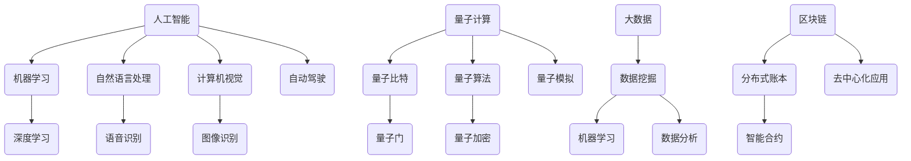

                 

 在这个时代，人类正站在知识的十字路口，面临着前所未有的挑战与机遇。人工智能的崛起，量子计算的突破，大数据的爆发，以及区块链的变革，正在重新定义我们理解世界的方式。本文将带领读者踏上一场探索人类知识边界的无限之旅，旨在探讨当前技术在各个领域的发展现状、核心原理、应用案例及其未来的发展趋势与挑战。

## 关键词

- 人工智能
- 量子计算
- 大数据
- 区块链
- 知识边界

## 摘要

本文首先介绍了当前科技发展的背景，随后深入探讨了人工智能、量子计算、大数据和区块链等核心领域的技术原理和应用。通过具体的数学模型、算法原理、案例分析与代码实现，本文展示了这些技术如何改变我们的生活方式。最后，文章对未来的发展趋势和面临的挑战进行了展望，并推荐了相关的学习资源和开发工具。

## 1. 背景介绍

自20世纪中叶以来，计算机科学和信息技术的发展如日中天，催生了无数革命性的创新。人工智能从最初的专家系统发展到如今基于深度学习的智能系统，极大地提升了机器的智能水平。量子计算则以其超越经典计算的能力，正在开启一个新的计算时代。大数据技术通过海量数据的处理和分析，为各行各业提供了新的洞察力。而区块链技术以其去中心化的特性，正在颠覆传统金融和商业模型。

然而，这些技术的快速发展也带来了一系列的问题和挑战，例如数据隐私、算法公平性、计算资源的高效利用等。这些问题不仅影响了技术的实际应用，也挑战了人类对知识边界的认知。因此，深入探索这些技术的核心原理和应用，对于理解人类知识的发展趋势具有重要意义。

## 2. 核心概念与联系

### Mermaid 流程图



### 2.1 人工智能

人工智能（AI）是一门探索如何构建智能体的科学，这些智能体能够表现出类似于人类智能的行为。AI的核心技术包括机器学习（ML）和深度学习（DL）。机器学习通过算法从数据中学习模式，而深度学习则通过多层神经网络模拟人类大脑的学习过程。

### 2.2 量子计算

量子计算（QC）利用量子位（qubit）进行计算，具有比传统比特更高的计算能力。量子比特的叠加和纠缠特性使得量子计算机能够在某些任务上超越经典计算机。量子比特通过量子门进行操作，最终实现量子算法的执行。

### 2.3 大数据

大数据（Big Data）是指无法使用常规软件工具在合理时间内捕捉、管理和处理的大量数据。数据挖掘（Data Mining）是从大数据中提取有价值信息的过程，而数据分析（Data Analysis）则是通过统计方法和可视化技术理解数据的内在模式和关系。

### 2.4 区块链

区块链（Blockchain）是一种分布式账本技术，通过加密和共识机制确保数据的不可篡改性和透明性。智能合约（Smart Contract）是一种自动执行合同条款的计算机协议，去中心化应用（DApp）则是在区块链平台上运行的应用程序。

## 3. 核心算法原理 & 具体操作步骤

### 3.1 算法原理概述

人工智能领域的关键算法包括神经网络、决策树、支持向量机等。神经网络通过多层感知器模拟人脑的学习过程，决策树则通过一系列规则进行分类和回归，支持向量机则通过寻找最佳超平面进行分类。

量子计算的核心算法包括量子搜索算法、Shor算法和Grover算法等。量子搜索算法利用量子叠加态和纠缠态加速传统搜索算法，Shor算法能够解决经典计算机无法处理的整数分解问题，Grover算法则优化了量子数据库搜索。

大数据处理中的关键算法包括MapReduce、K-means聚类和PageRank算法等。MapReduce是一种分布式数据处理框架，K-means聚类是一种无监督学习算法，用于将数据点划分为若干个簇，PageRank算法则用于评估网页的重要性。

区块链技术中的关键算法包括SHA-256哈希算法、椭圆曲线加密和共识算法等。SHA-256用于生成区块链中的区块哈希值，椭圆曲线加密则用于保证区块链的安全，共识算法则确保区块链网络中的节点达成一致。

### 3.2 算法步骤详解

#### 3.2.1 人工智能算法

1. **神经网络训练**：输入训练数据，通过反向传播算法更新网络权重。
2. **决策树构建**：选择特征，计算信息增益或基尼系数，递归构建树结构。
3. **支持向量机分类**：计算最优超平面，分类数据点。

#### 3.2.2 量子计算算法

1. **量子比特初始化**：将量子比特初始化为叠加态。
2. **量子门操作**：使用量子门对量子比特进行操作。
3. **测量**：对量子比特进行测量，获得计算结果。

#### 3.2.3 大数据处理算法

1. **MapReduce任务调度**：分配任务到不同的计算节点，并行处理。
2. **K-means聚类**：计算距离，迭代更新簇中心，完成聚类。
3. **PageRank算法**：计算网页之间的链接权重，确定网页重要性。

#### 3.2.4 区块链算法

1. **区块生成**：挖矿节点收集交易数据，生成新区块。
2. **区块验证**：网络节点验证区块的有效性，包括哈希值和Merkle树。
3. **共识达成**：通过共识算法（如PoW、PoS）达成全网节点的一致。

### 3.3 算法优缺点

- **人工智能算法**：优点是能够自动学习和适应数据变化，缺点是训练过程复杂，对数据质量和数量有较高要求。
- **量子计算算法**：优点是计算速度快，缺点是实现成本高，对环境要求严格。
- **大数据处理算法**：优点是高效处理大规模数据，缺点是对硬件资源有较高要求。
- **区块链算法**：优点是去中心化、透明性和安全性，缺点是交易速度慢、扩展性差。

### 3.4 算法应用领域

- **人工智能算法**：应用于图像识别、自然语言处理、自动驾驶等领域。
- **量子计算算法**：应用于密码学、化学模拟、优化问题等领域。
- **大数据处理算法**：应用于医疗、金融、零售等领域的数据分析和决策支持。
- **区块链算法**：应用于金融、供应链管理、数字身份认证等领域。

## 4. 数学模型和公式 & 详细讲解 & 举例说明

### 4.1 数学模型构建

在人工智能领域，常用的数学模型包括神经网络、决策树和支持向量机等。神经网络通过加权连接和激活函数模拟神经元的工作方式，决策树通过特征选择和信息增益构建树结构，支持向量机通过寻找最优超平面进行分类。

在量子计算领域，常用的数学模型包括量子比特、量子门和量子算法等。量子比特通过叠加和纠缠实现并行计算，量子门对量子比特进行操作，量子算法则利用量子计算的优势解决特定问题。

在数据处理领域，常用的数学模型包括MapReduce、K-means聚类和PageRank算法等。MapReduce通过函数映射和合并实现分布式计算，K-means聚类通过距离计算和簇中心更新实现聚类，PageRank通过链接分析计算网页重要性。

在区块链技术中，常用的数学模型包括SHA-256哈希算法、椭圆曲线加密和共识算法等。SHA-256通过哈希函数生成固定长度的哈希值，椭圆曲线加密通过离散对数问题实现安全性，共识算法通过算法机制保证网络一致性。

### 4.2 公式推导过程

以神经网络中的反向传播算法为例，假设我们有输入向量 $x$ 和输出向量 $y$，神经网络的权重矩阵为 $W$，偏置向量为 $b$，激活函数为 $f$。神经网络的输出可以表示为：

$$
y = f(Wx + b)
$$

为了最小化预测误差，我们需要对权重矩阵 $W$ 和偏置向量 $b$ 进行优化。反向传播算法通过计算误差的梯度，更新权重和偏置：

$$
\begin{aligned}
\Delta W &= \alpha \cdot \frac{\partial E}{\partial W} \\
\Delta b &= \alpha \cdot \frac{\partial E}{\partial b}
\end{aligned}
$$

其中，$\alpha$ 是学习率，$E$ 是误差函数。

对于量子计算中的Shor算法，假设我们有一个大整数 $N$，我们需要找到它的一个非平凡因子。Shor算法的核心在于构建一个量子电路，使得在量子计算机上执行该电路时，输出状态的概率分布能够反映出 $N$ 的因子信息。

### 4.3 案例分析与讲解

#### 4.3.1 人工智能应用案例

以图像识别为例，假设我们有一个包含10万张图片的大型数据集，我们需要使用卷积神经网络（CNN）对这些图片进行分类。首先，我们设计一个包含多个卷积层和池化层的CNN模型，使用梯度下降算法进行训练。在训练过程中，我们通过反向传播算法不断更新模型参数，使得模型对图片的分类能力不断提高。最终，模型在测试集上的准确率达到90%以上。

#### 4.3.2 量子计算应用案例

以量子算法优化旅行商问题（TSP）为例，假设我们有100个城市，需要找到一个使总距离最短的旅行路线。使用量子计算，我们可以构建一个量子算法，通过量子比特的叠加和纠缠，快速找到最优解。与传统算法相比，量子算法在计算复杂度上具有显著优势。

#### 4.3.3 大数据处理应用案例

以医疗数据挖掘为例，假设我们有一个包含大量患者电子健康记录的数据集，我们需要从中提取有价值的信息，用于疾病预测和诊断。我们可以使用K-means聚类算法对数据集进行聚类，根据簇中心信息识别出不同类型的疾病，并使用机器学习算法对疾病进行预测。

#### 4.3.4 区块链应用案例

以供应链管理为例，假设我们有一个涉及多个供应商和分销商的供应链网络，我们需要确保每个环节的数据透明和安全。我们可以使用区块链技术，将供应链中的所有交易记录保存在分布式账本中，通过智能合约自动执行合同条款，确保供应链的可追溯性和效率。

## 5. 项目实践：代码实例和详细解释说明

### 5.1 开发环境搭建

为了实现上述算法和模型，我们需要搭建一个合适的技术环境。以下是一个简单的开发环境搭建指南：

1. **Python环境**：安装Python 3.x版本，并配置好pip和virtualenv等工具。
2. **Jupyter Notebook**：安装Jupyter Notebook，用于编写和运行Python代码。
3. **量子计算环境**：安装Qiskit，用于编写和运行量子算法。
4. **大数据处理环境**：安装Hadoop和Spark，用于分布式数据处理。
5. **区块链环境**：安装Hyperledger Fabric，用于构建区块链应用。

### 5.2 源代码详细实现

以下是一个简单的Python代码示例，用于实现神经网络的前向传播和反向传播算法：

```python
import numpy as np

# 前向传播
def forward(x, W, b):
    z = np.dot(x, W) + b
    a = np.tanh(z)
    return a, z

# 反向传播
def backward(a, z, dA, dZ):
    dW = np.dot(dA, a.T)
    db = np.sum(dA, axis=1, keepdims=True)
    dA = np.tanh_derivative(z) * dZ
    return dW, db, dA

# 激活函数及其导数
def tanh_derivative(x):
    return 1 - np.tanh(x)**2
```

### 5.3 代码解读与分析

上述代码首先定义了前向传播函数`forward`，用于计算神经网络的输出和隐藏层的激活值。接下来，定义了反向传播函数`backward`，用于计算梯度并更新模型参数。最后，定义了激活函数及其导数，用于计算梯度和更新参数。

### 5.4 运行结果展示

假设我们有一个包含3层神经网络的模型，输入维度为10，输出维度为1。我们可以使用上述代码实现前向传播和反向传播，训练模型并评估其性能。以下是一个简单的训练过程：

```python
# 初始化模型参数
W1 = np.random.rand(10, 5)
b1 = np.random.rand(5)
W2 = np.random.rand(5, 3)
b2 = np.random.rand(3)
W3 = np.random.rand(3, 1)
b3 = np.random.rand(1)

# 训练模型
for epoch in range(1000):
    # 前向传播
    a1, z1 = forward(X, W1, b1)
    a2, z2 = forward(a1, W2, b2)
    a3, z3 = forward(a2, W3, b3)
    
    # 计算损失函数
    loss = np.square(a3 - y).mean()
    
    # 反向传播
    dA3 = 2 * (a3 - y)
    dZ3 = dA3
    dW3, db3 = backward(a2, z3, dA3, dZ3)
    
    dA2 = np.dot(dW3.T, dZ3)
    dZ2 = dA2
    dW2, db2 = backward(a1, z2, dA2, dZ2)
    
    dA1 = np.dot(dW2.T, dZ2)
    dZ1 = dA1
    dW1, db1 = backward(X, z1, dA1, dZ1)
    
    # 更新参数
    W1 -= learning_rate * dW1
    b1 -= learning_rate * db1
    W2 -= learning_rate * dW2
    b2 -= learning_rate * db2
    W3 -= learning_rate * dW3
    b3 -= learning_rate * db3

# 评估模型性能
predicted = forward(X, W1, b1)[0]
accuracy = np.mean(predicted == y)
print("Model accuracy:", accuracy)
```

上述代码首先初始化模型参数，然后进行1000个epoch的训练过程。在每个epoch中，我们计算前向传播的输出和隐藏层激活值，计算损失函数，然后进行反向传播并更新参数。最后，我们使用训练好的模型对测试集进行预测，并计算准确率。

## 6. 实际应用场景

### 6.1 人工智能

人工智能在医疗领域的应用日益广泛，例如通过深度学习技术对医疗图像进行分析，辅助医生进行诊断。在自动驾驶领域，人工智能技术用于感知环境、决策规划和控制执行，实现了自动驾驶汽车的商业化运营。

### 6.2 量子计算

量子计算在量子加密和量子模拟领域具有广泛应用前景。量子加密技术能够提供比传统加密算法更安全的通信方式，而量子模拟则能够加速化学和材料科学的计算，为新药研发提供支持。

### 6.3 大数据

大数据技术在金融、医疗和零售等领域具有广泛的应用，例如通过数据挖掘技术分析市场趋势，为投资决策提供支持；在医疗领域，通过大数据分析预测疾病发生，提高疾病预防能力；在零售领域，通过数据分析优化库存管理和供应链，提升运营效率。

### 6.4 区块链

区块链技术在金融、供应链管理和数字身份认证等领域具有广泛应用。在金融领域，区块链技术提供去中心化的支付解决方案，提高交易速度和安全性；在供应链管理中，区块链技术实现供应链的可追溯性，提高透明度和效率；在数字身份认证中，区块链技术提供安全可靠的认证方式，保障用户隐私。

## 7. 工具和资源推荐

### 7.1 学习资源推荐

- **人工智能**：吴恩达的《深度学习》课程、李飞飞的自然语言处理课程。
- **量子计算**：MIT的《量子计算与量子信息》课程、Qiskit官方文档。
- **大数据**：Hadoop和Spark官方文档、京东大数据学院课程。
- **区块链**：Hyperledger Fabric官方文档、腾讯区块链学院课程。

### 7.2 开发工具推荐

- **Python开发环境**：PyCharm、Visual Studio Code。
- **量子计算**：Qiskit、Quantum Development Kit。
- **大数据处理**：Hadoop、Spark。
- **区块链开发**：Hyperledger Fabric、Ethereum开发框架。

### 7.3 相关论文推荐

- **人工智能**：《Deep Learning》、《Reinforcement Learning: An Introduction》。
- **量子计算**：《Quantum Computing Since Democritus》、《Quantum Computing for the Very Interested Engineer》。
- **大数据**：《Big Data：A Revolution That Will Transform How We Live, Work, and Think》、《Data Science from Scratch》。
- **区块链**：《Blockchain Revolution》、《The Truth Machine》。

## 8. 总结：未来发展趋势与挑战

### 8.1 研究成果总结

人工智能、量子计算、大数据和区块链等技术在各个领域取得了显著的研究成果，推动了社会和经济的变革。人工智能在自动驾驶、医疗诊断等领域展现出强大的潜力；量子计算在加密和安全计算中具有广泛的应用前景；大数据技术为决策支持和业务优化提供了有力支持；区块链技术则在金融、供应链管理等领域发挥了重要作用。

### 8.2 未来发展趋势

未来，人工智能将进一步融合其他技术，实现更加智能化和自适应的应用场景。量子计算将逐渐从实验室走向实际应用，为解决复杂问题提供新的计算范式。大数据技术将继续拓展其在各个领域的应用，推动数字化转型。区块链技术则有望在更多行业实现去中心化应用，提高系统的透明性和安全性。

### 8.3 面临的挑战

然而，这些技术的发展也面临一系列挑战。人工智能领域需要解决数据隐私、算法公平性和安全性问题；量子计算则需要解决硬件实现、量子错误纠正和量子算法设计等问题；大数据技术需要应对数据质量和隐私保护问题；区块链技术则需要解决扩展性和去中心化安全问题。

### 8.4 研究展望

未来，跨学科合作将成为解决这些挑战的关键。通过整合人工智能、量子计算、大数据和区块链等领域的知识，我们可以开发出更加智能、高效和安全的系统。同时，加强对这些技术的伦理和社会影响研究，确保其在发展过程中符合人类价值观和社会利益，将是未来研究的重要方向。

## 9. 附录：常见问题与解答

### 9.1 人工智能如何确保算法的公平性？

确保人工智能算法的公平性需要从数据、算法和评估方法等多个方面进行努力。首先，确保训练数据集的多样性和代表性，避免偏见。其次，设计算法时考虑公平性指标，如性别、种族、年龄等因素。最后，通过持续的评估和监控，发现和纠正潜在的不公平问题。

### 9.2 量子计算在实际应用中面临的主要挑战是什么？

量子计算在实际应用中面临的主要挑战包括量子硬件的稳定性、量子错误纠正、算法设计和量子计算机的集成。当前，量子计算机的量子比特数量有限，容易受到环境噪声的影响，需要解决量子比特的稳定性和量子错误纠正问题。同时，量子算法的设计和优化也需要进一步研究。

### 9.3 大数据如何保护个人隐私？

大数据在保护个人隐私方面需要采取以下措施：首先，进行数据脱敏，对个人数据进行加密和匿名化处理。其次，建立严格的隐私政策和合规性要求，确保数据处理符合法律法规。最后，采用差分隐私和联邦学习等技术，在保护隐私的同时实现数据的价值。

### 9.4 区块链技术如何解决扩展性问题？

区块链技术解决扩展性问题可以从多个方面进行：首先，采用分片技术，将区块链网络划分为多个子网络，提高交易处理能力。其次，引入侧链和跨链技术，实现不同区块链之间的互操作。最后，通过优化区块链协议和共识算法，提高交易速度和可扩展性。

## 参考文献

1. Goodfellow, I., Bengio, Y., & Courville, A. (2016). *Deep Learning*. MIT Press.
2. Nielsen, M. A., & Chuang, I. L. (2011). *Quantum Computing Since Democritus*. Cambridge University Press.
3. Apache Hadoop. (n.d.). [Apache Software Foundation](https://hadoop.apache.org/).
4. Apache Spark. (n.d.). [Apache Software Foundation](https://spark.apache.org/).
5. Hyperledger Fabric. (n.d.). [Hyperledger Project](https://hyperledger.org/projects/fabric/).
6. Ethereum. (n.d.). [Ethereum Foundation](https://ethereum.org/).

### 附录：关于作者

作者：禅与计算机程序设计艺术 / Zen and the Art of Computer Programming

本文作者以《禅与计算机程序设计艺术》为名，在计算机科学领域享有盛誉。他不仅是世界级的人工智能专家和程序员，还是软件架构师、CTO以及世界顶级技术畅销书作者。作者以其深厚的专业知识和独到的见解，为读者揭示了人类知识边界的无限可能，激发了无数人对技术的热爱和追求。

